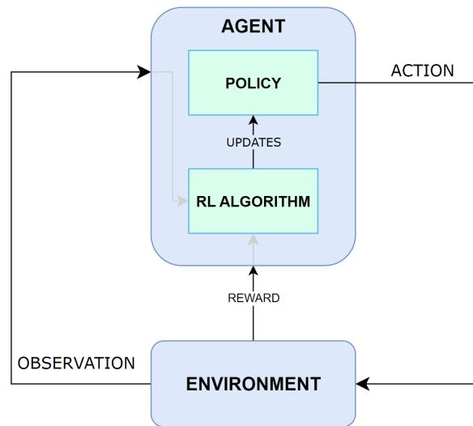
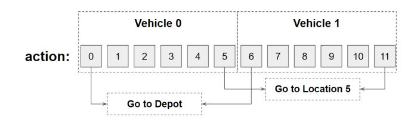
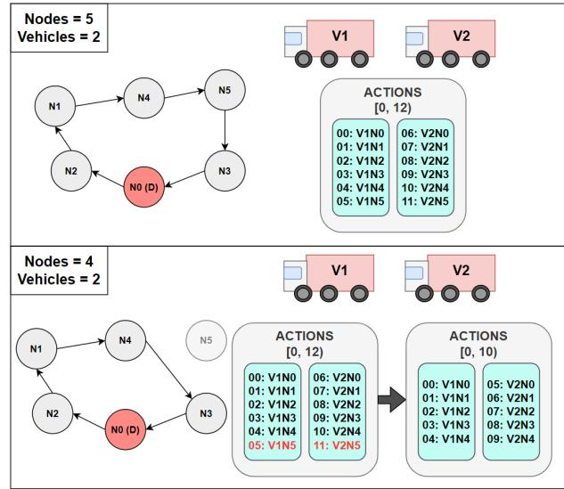
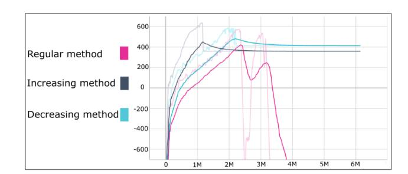
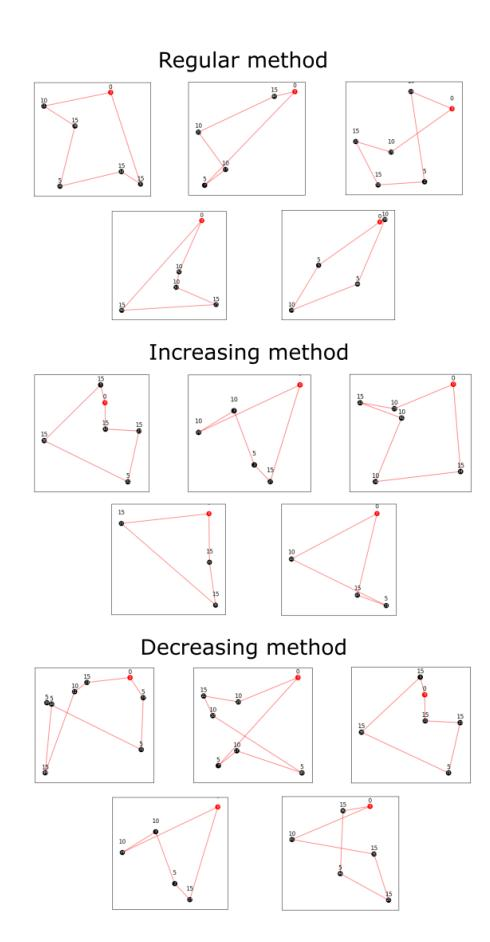
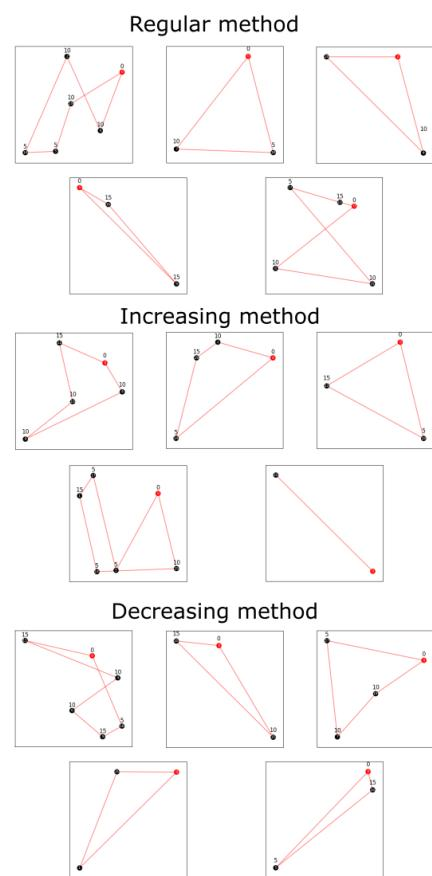

# A Flexible Vehicle Routing Reinforcement Learning Environment for the Reusability of Trained Agents

Jon Díaz jon.diaz@deusto.es DeustoTech, Faculty of Engineering, University of Deusto Bilbao, Spain

Jenny Fajardo fajardo.jenny@deusto.es DeustoTech, Faculty of Engineering, University of Deusto Bilbao, Spain

Erick Rodriguez erick.rodriguez@deusto.es DeustoTech, Faculty of Engineering, University of Deusto Bilbao, Spain

Enrique Onieva enrique.onieva@deusto.es DeustoTech, Faculty of Engineering, University of Deusto Bilbao, Spain

### ABSTRACT

Society keeps ever-growing, and new challenges keep arising for the artificial intelligence to solve, fueled by the desire to enable global operations and optimize current deep and machine learning methodologies. One of these disciplines is reinforcement learning, which has not seen much use outside of the context of video games until recent years, where different algorithms have eased it's transition to more real-world scenarios, such as autonomous systems or self-driving vehicles. For this paper, the aim is to develop a reinforcement learning environment that can model and solve a complex vehicle routing problem with multiple constraints, with the addendum of allowing pre-trained models to solve use cases that differ from those that they were trained on.

#### KEYWORDS

reinforcement learning, vehicle routing problem, artificial intelligence,optimization

#### ACM Reference Format:

Jon Díaz, Jenny Fajardo, Erick Rodriguez, and Enrique Onieva. 2024. A Flexible Vehicle Routing Reinforcement Learning Environment for the Reusability of Trained Agents. In 2024 10th International Conference on Computer Technology Applications (ICCTA 2024), May 15–17, 2024, Vienna, Austria. ACM, New York, NY, USA, [7](#page-6-0) pages.<https://doi.org/10.1145/3674558.3674576>

### 1 INTRODUCTION

In the past few years, science and technology have been steadily evolving across multiple areas, one of the areas that has changed the most being the field of logistics. More specifically, last mile logistics have been evolving due to an increase in e-commerce, changes on the consumer's preferences and traceability of multiple products, which is largely thanks to the previously mentioned technological evolution [\[12\]](#page-6-1), [\[15\]](#page-6-2).

Permission to make digital or hard copies of all or part of this work for personal or classroom use is granted without fee provided that copies are not made or distributed for profit or commercial advantage and that copies bear this notice and the full citation on the first page. Copyrights for components of this work owned by others than the author(s) must be honored. Abstracting with credit is permitted. To copy otherwise, or republish, to post on servers or to redistribute to lists, requires prior specific permission and/or a fee. Request permissions from permissions@acm.org.

ICCTA 2024, May 15–17, 2024, Vienna, Austria © 2024 Copyright held by the owner/author(s). Publication rights licensed to ACM. ACM ISBN 979-8-4007-1638-6/24/05 <https://doi.org/10.1145/3674558.3674576>

Last-mile logistics refers to the process of delivering products to the consumer or final recipient, being the last step in the logistics process and incredibly crucial to customer satisfaction and to the company's reputation, just as any of the previous steps are.

This exponential growth has caused companies, authorities and logisticians to devote much of their time and budget to improving urban logistics [\[4\]](#page-5-0), as consumers now expect much faster and more accurate deliveries, which has led companies to hasten their logistics processes to meet these demands, with features such as same-day or 24-hour delivery becoming the norm [\[3\]](#page-5-1).

Another factor that has driven the evolution of last-mile logistics is technological advancement. The implementation of technologies such as real-time tracking, artificial intelligence and data analytics have improved the efficiency of the delivery process, and enabled greater accuracy in the planning of their schedules [\[1\]](#page-5-2). In general, it is a field widely studied today, both by large and small companies in which large amounts of capital are invested.

As such, new ways of improving existing routes are constantly being researched, and the use of artificial intelligence has proven successful in the field. Reinforcement learning (RL) is a relatively unexplored technique in the context of logistics, and, in this paper, a RL approach is proposed for the CVRP (Capacitated Vehicle Routing Problem). The aim of the proposal is to capitalize on the strengths of RL's capability to learn how a specific environment works, while generalizing such learning so that an agent can be used to solve multiple use cases with varying sizes and node distribution. The trained models use pre-existing RL algorithms, and their reusability is tested by comparing the generated routes in the default training versus the routes created in a different use case.

This paper is structured as follows. Section [2](#page-0-0) presents a literature review related to the topics of the paper. Section [3](#page-1-0) explains the implemented environment, and Section [4](#page-2-0) explains how the reusability has been approached. Section [5](#page-3-0) shows the performed experiments, while their respective results are displayed in [6.](#page-4-0) Finally, Section [7](#page-5-3) focuses on conclusions and future work.

## <span id="page-0-0"></span>2 LITERATURE REVIEW

One of the first studies published in the literature on the subject of RL and vehicle routing problem (VRP) is [\[13\]](#page-6-3), where a stochastic policy is proposed along with a policy gradient to optimize the model and a solution is obtained as an array of actions to be taken.

<span id="page-1-0"></span>

<span id="page-1-1"></span>

Figure 1: Diagram of a standard RL environment architecture.

strengthened and encouraged, while actions that lead to negative

The learning environment was developed with the aim of modeling and solving the CVRP, a problem similar to the VRP but with node capacities added. As such, the environment contains information about the nodes to be visited, the starting points, the demands to be satisfied at each node, and the fleet of vehicles available for this purpose, as represented in Figure [1.](#page-1-1) The agent can be considered a fleet manager, deciding which nodes to visit with each vehicle and

Said agent has a RL algorithm that allows for it to update it's own policy, which is the strategy to follow in order to reach the final goal. To this end, it will receive information about the state of the environment (such as the position of each vehicle, the remaining nodes to be visited, the demand of each node...) and about the performed action at each instant, in the form of rewards that will increase or decrease depending on how short or long the path taken

Since the number of nodes and vehicles vary from one problem to another, and one of the goals is to create a flexible environment, it is necessary to generalize the action representation. This way, the number of available actions will vary from case to case, which will

All list of these actions comprise the action space, and each will be translated from their discrete format to node and vehicle following the Formula 1 and Formula 2, respectively, in order to know which node should be visited by which vehicle. In both cases,  $N$  represents the total number of nodes in the problem, depot included. Figure 2 illustrates an example where there are 2 vehicles and 6 nodes, for a total of 12 possible actions.

<span id="page-1-2"></span>
$$vehicle = \left[ \frac{accion}{N} \right] \quad (1)$$

<span id="page-2-2"></span>

Figure 2: Visual representation of the flexible action space.

<span id="page-2-1"></span>
$$node = action\$on\%N$$
 (2)

For example, in a case where 10 nodes are to be visited by 2 vehicles, the number of actions will be 2 · (10 + 1) = 22, where the 1 will be the additional node representing the depot from which the vehicles will depart. To translate the action taken by the agent to the concrete case, a series of operations are performed to calculate the node to be visited and the vehicle which will be used. First, the vehicle is calculated by obtaining the integer quotient of the selected action divided by the maximum number of nodes (including depot). Then, the node to visit is calculated by obtaining the modulus between the selected action and the number of nodes.

Following the previous example, if action 13 is selected, the vehicle that will have to perform it will be ⌊ 13 <sup>11</sup> ⌋ <sup>=</sup> 1, so it will be the second vehicle (the first one being vehicle 0). The node to be visited by vehicle 1 will be 13%11 = 2, i.e., the second node (depot being node 0 and the first being node 1).

### 3.2 Observation Space

Whenever an action is chosen, the agent will apply it over the environment, and a response will be obtained based on the selected action and the new state of the environment. The response comes as an array of observations, as presented in Table [1,](#page-3-1) which track different aspects of the status of the environment, such as the nodes that have been visited, the current vehicle loads and the positions of said vehicles.

The size of these observations vary depending on whether they are related to the nodes ( $N_{node}$ ) or to the vehicles ( $N_{vehicle}$ ) themselves. Regarding their value range, most of them are self-explanatory, but it should be noted that the vehicle loads and node demands depend on the vehicle capacity ( $C_{vehicle}$ ) and the node capacity ( $C_{node}$ ), respectively.

All the observations are discrete, aside from the vehicle-node distances, which is a continuous observation. The node demands, the distance between each vehicle and node, as well as a numeric reward are also returned.

With the aim of creating the most optimal routes possible, the reward has been defined to be inversely proportional to the distance traveled and to the emptiness of the vehicles, as shown in Equation [3.](#page-2-3) The longer the distance, the smaller the reward will be, while it will become bigger the more demands the vehicle carries. Based on all this returned information, the agent will learn to solve the environment by updating the model and it's policy.

<span id="page-2-3"></span>
$$\text{reward} = \left[ \frac{1}{\text{distance}}} \right] + \left[ \frac{1}{\text{availableCapacity}} \right] \quad (3)$$

#### <span id="page-2-4"></span>3.3 Finished episode conditions

Since the task at hand must be finished for the episode to be considered complete, it is necessary to define the conditions that need to be met as to regard the episode as finished. For this problem, the condition is quite simple: an episode will finish whenever all the nodes are visited and all the vehicles used have returned to the depot.

However, during development, we noticed that these conditions worked wonders on small sized problems, but as said problems became bigger, i.e. when more nodes were added, the conditions were harder to meet. Due to how the action space has been defined and the way RL works, the training in big sized use cases was very slow.

Since at the beginning of the learning process the algorithm performs exploratory (almost random) actions, and the policy is not updated until an episode is finished, it can take a big amount of time for the algorithm to solve and learn from the first episodes.

For this very reason, two alternative finishing conditions were implemented, which go as follows:

- a) Increasing method: While using this condition, a minimum percentage as well as an increasing percentage and rate need to be established. Doing so, at the beginning of the learning process only a fraction of the total nodes will have to be visited, which will depend on the minimum percentage previously mentioned. As the training continues, said percentage will gradually increase, up to a 100%, according to the increase rate.
- b) Decreasing method: This condition works similarly to the previous one. In this case, the minimum percentage of visited nodes at the beginning of the training will be 100%, which will not decrease for several timesteps. After those steps, if the agent is unable to find a solution, the minimum percentage will decrease, down to a certain limit.

These two conditions were implemented with the common goal of easening the learning process. The first one intends to assure that the agent learns even when the use case has not been entirely addressed, by allowing it to gradually learn how to solve the whole instance. As for the second implementation, it aims to allow the agent some time to find a solution with the whole case and, in the event of failure, to reduce the amount of nodes needed to achieve a valid result.

#### <span id="page-2-0"></span>4 TRAINED MODEL REUSABILITY

Training a RL agent takes a long time, and it usually only works in the same environment it was trained on. In the case at hand, if the environment had solely one node less, the model would not know how to adapt to it, requiring a completely new training from scratch, which is a waste of time and resources. Thereby, it was set as one of the main aims of the project to develop an environment that allowed model reusability up to some extent.

To achieve this goal, one of the main design choices was to abstract the action space. Thanks to said abstraction, an action mask has been implemented in order to allow for a certain model to be used in a similar or smaller environment that the one it was trained in. Figure [3](#page-3-2) illustrates how the action masking works.

**Table 1: List of all the observations available in the observation space.**<span id="page-3-1"></span>

| Observation      | Size                         | Description                                                                             |
|------------------|------------------------------|-----------------------------------------------------------------------------------------|
| Visited nodes    | $N_{node}$                   | Marks whether a node has been visited (1) or not (0).                                   |
| Vehicle position | $N_{vehicle}$                | Current node where each vehicle is located at.                                          |
| Vehicle loads    | $N_{vehicle}$                | Current load of each vehicle, which ranges from 0 to $C_{vehicle}$ .                    |
| Node demands     | $N_{node}$                   | Current demand of each of the nodes, ranging from 0 to $C_{node}$ .                     |
| V-N distances    | $N_{node} \cdot N_{vehicle}$ | Current distance between each pair of node and vehicle, with a range of $[0, \infty)$ . |

**Algorithm 1:** Training process of the RL agent.

```
1 Input:  $N_{node}$ ,  $N_{vehicle}$ , algorithm
2  $env = newEnv(N_{node}, N_{vehicle})$ ;
3  $obs = env.reset()$ ;
4  $agent = newAgent(algorithm)$ ;
5 for  $i \in \{1 \dots iterations\}$  do
6    $action = agent.choseAction(env.actions, obs);$ 
7    $reward = -1;$ 
8   if  $env.checkAction(action)$  then
9      $obs.reward = env.visit(action);$ 
10   $done = env.isDone();$ 
11   $agent.learn(action, reward, obs, done);$ 
12  if  $done$  then
13     $obs = env.reset();$ 
14  $agent.close();$
```

<span id="page-3-2"></span>

**Figure 3: Action masking functionality.**The first section of the picture represents a simple case with 5 nodes (6 when accounting for the depot) and 2 vehicles available to visit all of them. In this case, the action space would be made up of 12 different actions, the first 6 (actions 0 to 5) would represent the movement of the first vehicle, while actions 6 to 11 would correspond to the second one.

In the second half of the picture, the masking can be seen in action. The case is almost the same, except that one less node is present. Therefore, only 10 different actions would be needed. In order to use the model previously trained in the 12 actions case, the excess actions would need to be masked, i.e. the ones corresponding to the node 5, which is no longer present. Now, actions 0-4 would be for the first vehicle, actions 5-9 for the second vehicle and actions 10 and 11 would be forbidden. If the model chose them, the action would be considered not valid, and the environment state would not change at all.

Thanks to these abstractions, it is possible to use a certain model in a smaller case, or in a completely different one, as long as the total number of actions is not higher than the original ones. The model of the previous case could be used as well to solve a problem formed by 1 single vehicle and 11 nodes, for example, as the total number of actions remains the same at 12.

<span id="page-3-0"></span>**5 EXPERIMENTATION**RL is a particularly intricate and multifaceted area of study, with an extensive array of features that warrants thorough analysis. As such, experimentation with any environment spans diverse aspects to consider, such as the measurement of training times, the definition of the most suitable observations that yield optimal results, the training algorithm used and how the training methodology affects the generated routes.

The objective of the experimentation outlined in this paper is to discern the most suitable episode finishing conditions among the ones proposed in Section 3.3, as well as probing the model reusability of the environment. Therefore, there are some other features that will not be tested for this paper, like using different RL training algorithms.

For the experimentation, the chosen algorithm is Proximal Policy Optimization (PPO) [17], a popular training algorithm due to its stability during the learning process, achieved with a gradient descent used to optimize the policy while limiting how much it can change in each of the learning steps. The implementation of this algorithm has been obtained from the Stable Baselines <sup>3</sup> library, and no hyperparameter tuning has been conducted, as their default values were used.

For the experimentation procedure, two different use cases have been defined:

- • Small use case: 20 nodes, max 7 vehicles.
- • Medium use case: 50 nodes, max 13 vehicles.

The node positions have been randomly generated with an arbitrary range between 0 and 1, as have been the node demands.

<span id="page-3-3"></span>

<sup>3</sup><https://stable-baselines3.readthedocs.io/en/master/index.html>

<span id="page-4-1"></span>

Figure 4: Rewards obtained during the training process.

These can vary from 5 to 15, and each vehicle is able of carrying a maximum of 100 units. The largest amount of vehicles that can be used has been defined so that, regardless of the generated demands, all nodes should have their demands fulfilled.

The rest of the parameters are kept static across all the experiments as follows: agents train from scratch and for a total of 6 million time steps, each vehicle can carry a maximum demand of 100 units, the nodes can store up to 20 units and the speed of all vehicles is set to a constant of 70km/h.

The different episode finishing conditions have been tested, applying each of them to a training process with the medium-sized use case. Figure [4](#page-4-1) shows the rewards obtained during the training process by each of the methods described in Section [3.3.](#page-2-4) It can be seen that all three methods reach the maximum reward quite early during training, the increasing method achieving it the quickest, little after 1 million time steps.

The other two methods take more time to reach their peak, the decreasing method obtaining the highest reward overall. While the modified methods seem to be quite stable, as their reward curve does not decrease as the training time increases, the regular method sees a drastic decrease in performance after a certain amount of steps.

#### <span id="page-4-0"></span>6 RESULTS

During training, the model used when each method reached the highest reward was saved. A subset of the obtained routes can be seen in Figure [5,](#page-4-2) where 5 routes are displayed for each of the methods. One single route is performed by only one vehicle, which will depart from the depot (denoted with a red dot) and return once it's route finishes. The demands of each node are also displayed, with the depot having a demand of 0.

For the regular method, the total distance of all the vehicles was of 29.657 meters, while the increasing method achieved a distance of 31.535 meters. The lowest distance was obtained by the decreasing method, with a total of 28.851 meters.

As it can be seen, the overall routes for the regular and the increasing conditions are well constructed. The vehicles take some unneeded detours, specially with the increasing methods, but the routes are mostly logical. It should be noted that most of the vehicles used have not been completely filled. The decreasing method shows a few more irregularities in it's routes compared to the other methods.

All in all, although far from optimal, the algorithm has been able to generate feasible routes with the implemented environment.

<span id="page-4-2"></span>

Figure 5: Routes obtained with each method.

Among the three training methods, the increasing condition has proven to achieve learn faster than the others, likely due to the fact that it only needs a fraction of all the nodes visited in order to begin learning. However, it later translates poorly to the route generation, being it the one with the highest traveling length.

### 6.1 Model Reusability

As previously explained, namely in Section [4,](#page-2-0) one of the team's goals was to use trained agents on environments different from the ones they were originally trained on. In order to showcase this functionality, the trained agents from Section [5](#page-3-0) have been ran in a distinct case.

These agents originally learnt to solve a randomly generated problem, which was composed of 50 nodes with demands ranging between 5 and 15, and a upper limit of 13 vehicles available to meet them. Figure [6](#page-5-9) illustrates the routes obtained when the models tried to solve a completely new problem with no additional training. For the new problem, both, the number of nodes and the maximum amount of procurable vehicles were reduced to 20 and 7, respectively. The node coordinates along with their demands were randomly created, and kept unlike the test case the models were trained on.

<span id="page-5-9"></span>

Figure 6: Routes obtained with the reused models.

It can be appreciated that the routes are mostly fine, with a few flaws that keep them from being optimal. For the regular method, the total distance was of 14.058 meters, while the increased method achieved a total route length of 12.856 meters and the decreasing one 12.623 meters. In general, the regular method obtained significantly worse results than the other two, despite the routes seemingly looking better.

An important point to note is the fact that the routes are overall quite short, as the models are not focusing on optimizing the vehicle usage, but rather try to make the routes as short as possible, likely due to the fact of having many more available vehicles than the ones needed and the way the learning reward is calculated.

All in all, it should still be noted that the performance of the algorithms is satisfactory, considering the fact that they were originally trained in an unsimilar case, with more nodes, and different demands and locations for them.

## <span id="page-5-3"></span>7 CONCLUSIONS AND FUTURE WORKS

From it's conception, the current work has always been a challenging one, specially because the subject of RL was a barely studied one among the authors. Besides, RL and VRP are two areas that have not seen much research in the past few years, with most of

the literature focusing on small use cases far from being close to real life examples.

As it has been thoroughly exposed during the whole paper, one of the main goals was to develop a flexible environment, which was achieved thanks to the abstraction of the action space and the implemented action mask, allowing it to be used across problems of different sizes.

Still, RL is a very complex artificial intelligence technique, and there are many aspects of it worth exploring that have not been given enough time during the writing of the paper. One of these attributes are the rewards, which have been kept quite simple across all the development and testing process.

Being a fundamental aspect of the RL techniques as rewards are, future works would want to focus more on them and how they influence the results obtained with the developed environment, because refining the reward system is key in order to achieve more optimal routes.

Another point to work on is the use of different RL algorithms. Currently, PPO has been used due to it's stability and overall good performance, but further experimenting would requiring testing more diverse algorithms.

Lastly, it should be noted the outstanding performance the models have achieved when solving an environment they have not seen before. The designed environment allows to represent a relatively complex vehicle routing problem while abstracting mandatory reinforcement learning elements, such as actions and observations, which allows for already trained models to create semi-optimal routes out of completely new use cases.

#### ACKNOWLEDGMENTS

This paper has been funded by the Basque Government as part of the FLEETBOT project (Tecnologías de Movilidad Inteligente. ELKARTEK 2022. ID: KK-2022/00098) and by SENATOR under the European Union's Horizon 2020 research and innovation programme (grant agreement 861540).

### REFERENCES

<span id="page-5-8"></span><span id="page-5-7"></span><span id="page-5-6"></span><span id="page-5-5"></span><span id="page-5-4"></span><span id="page-5-2"></span><span id="page-5-1"></span><span id="page-5-0"></span>[1] Juan J Alcaraz, Luis Caballero-Arnaldos, and Javier Vales-Alonso. 2019. Rich vehicle routing problem with last-mile outsourcing decisions. Transportation Research Part E: Logistics and Transportation Review 129 (2019), 263–286. [2] Ali Arishi and Krishna Krishnan. 2023. A multi-agent deep reinforcement learning approach for solving the multi-depot vehicle routing problem. Journal of Management Analytics 10, 3 (2023), 493–515. [3] Techane Bosona. 2020. Urban freight last mile logistics—Challenges and opportunities to improve sustainability: A literature review. Sustainability 12, 21 (2020), 8769. [4] Ivan Cardenas, Yari Borbon-Galvez, Thomas Verlinden, Eddy Van de Voorde, Thierry Vanelslander, and Wouter Dewulf. 2017. City logistics, urban goods distribution and last mile delivery and collection. Competition and regulation in network industries 18, 1-2 (2017), 22–43. [5] Getu Fellek, Ahmed Farid, Goytom Gebreyesus, Shigeru Fujimura, and Osamu Yoshie. 2023. Graph Transformer with Reinforcement Learning for Vehicle Routing Problem. IEEJ Transactions on Electrical and Electronic Engineering 18, 5 (2023), 701–713. [6] Jakob Foerster, Gregory Farquhar, Triantafyllos Afouras, Nantas Nardelli, and Shimon Whiteson. 2018. Counterfactual multi-agent policy gradients. In Proceedings of the AAAI conference on artificial intelligence, Vol. 32. [7] Zangir Iklassov, Ikboljon Sobirov, Ruben Solozabal, and Martin Takac. 2023. Reinforcement Learning for Solving Stochastic Vehicle Routing Problem. arXiv preprint arXiv:2311.07708 (2023). [8] JQ James, Wen Yu, and Jiatao Gu. 2019. Online vehicle routing with neural combinatorial optimization and deep reinforcement learning. IEEE Transactions on Intelligent Transportation Systems 20, 10 (2019), 3806–3817.

<span id="page-6-8"></span><span id="page-6-0"></span>[9] Can B Kalayci and Can Kaya. 2016. An ant colony system empowered variable [10] Sašo Karakatič and Vili Podgorelec. 2015. A survey of genetic algorithms for [11] Simon Martin, Djamila Ouelhadj, Patrick Beullens, Ender Ozcan, Angel A Juan, [12] Hyeong Suk Na, Sang Jin Kweon, and Kijung Park. 2021. Characterization and [13] Mohammadreza Nazari, Afshin Oroojlooy, Lawrence Snyder, and Martin Takác. [14] Weixu Pan and Shi Qiang Liu. 2023. Deep reinforcement learning for the dynamic

neighborhood search algorithm for the vehicle routing problem with simultaneous pickup and delivery. Expert Systems with Applications 66 (2016), 163–175.

<span id="page-6-6"></span>solving multi depot vehicle routing problem. Applied Soft Computing 27 (2015),

<span id="page-6-4"></span>519–532.

<span id="page-6-1"></span>and Edmund K Burke. 2016. A multi-agent based cooperative approach to scheduling and routing. European Journal of Operational Research 254, 1 (2016), 169–178.

design for last mile logistics: A review of the state of the art and future directions.

<span id="page-6-3"></span>Applied Sciences 12, 1 (2021), 118.

2018. Reinforcement learning for solving the vehicle routing problem. Advances

<span id="page-6-9"></span>in neural information processing systems 31 (2018).

and uncertain vehicle routing problem. Applied Intelligence 53, 1 (2023), 405–422.

<span id="page-6-2"></span>[15] Telmo Pinto, Cláudio Alves, and José Valério de Carvalho. 2018. Models and advanced optimization algorithms for the integrated management of logistics operations. In Operational Research: IO2017, Valença, Portugal, June 28-30 XVIII.

Springer, 313–324.

<span id="page-6-11"></span><span id="page-6-7"></span>[16] David Sacramento, David Pisinger, and Stefan Ropke. 2019. An adaptive large neighborhood search metaheuristic for the vehicle routing problem with drones. Transportation Research Part C: Emerging Technologies 102 (2019), 289–315. [17] John Schulman, Filip Wolski, Prafulla Dhariwal, Alec Radford, and Oleg Klimov. 2017. Proximal Policy Optimization Algorithms. arXiv[:1707.06347](https://arxiv.org/abs/1707.06347) [cs.LG] [18] Yong Shi, Toufik Boudouh, and Olivier Grunder. 2017. A hybrid genetic algorithm for a home health care routing problem with time window and fuzzy demand.

<span id="page-6-5"></span>Expert Systems with Applications 72 (2017), 160–176.

<span id="page-6-10"></span>[19] Renchi Zhang, Runsheng Yu, and Wei Xia. 2022. Constraint-aware Policy Optimization to Solve the Vehicle Routing Problem with Time Windows. Information

Technology and Control 51, 1 (2022), 126–138.