# A SURVEY OF PROGRESS ON COOPERATIVE MULTI-AGENT REINFORCEMENT LEARNING IN OPEN ENVIRONMENT

Lei Yuan, Ziqian Zhang, Lihe Li, Cong Guan, Yang Yu\*

National Key Laboratory for Novel Software Technology, Nanjing University

School of Artificial Intelligence, Nanjing University

{yuanl, zhangzq, lilh, guanc}@lamda.nju.edu.cn, yuy@nju.edu.cn

# ABSTRACT

Multi-agent Reinforcement Learning (MARL) has gained wide attention in recent years and has made progress in various fields. Specifically, cooperative MARL focuses on training a team of agents to cooperatively achieve tasks that are difficult for a single agent to handle. It has shown great potential in applications such as path planning, autonomous driving, active voltage control, and dynamic algorithm configuration. One of the research focuses in the field of cooperative MARL is how to improve the coordination efficiency of the system, while research work has mainly been conducted in simple, static, and closed environment settings. To promote the application of artificial intelligence in real-world, some research has begun to explore multi-agent coordination in open environments. These works have made progress in exploring and researching the environments where important factors might change. However, the mainstream work still lacks a comprehensive review of the research direction. In this paper, starting from the concept of reinforcement learning, we subsequently introduce multi-agent systems (MAS), cooperative MARL, typical methods, and test environments. Then, we summarize the research work of cooperative MARL from closed to open environments, extract multiple research directions, and introduce typical works. Finally, we summarize the strengths and weaknesses of the current research, and look forward to the future development direction and research problems in cooperative MARL in open environments.

# 1 Introduction

As a sub-branch of machine learning, reinforcement learning (RL) [\[1\]](#page-35-0) is an effective method for solving sequential decision-making problems. Compared to supervised learning and unsupervised learning, RL learns from interactions. In the paradigm of RL, an agent interacts with the environment and continuously optimizes its policy based on the rewards or penalties it receives from the environment. Due to its similarity to the way humans acquire knowledge, RL is considered as one of the approaches to achieving Artificial General Intelligence (AGI) [\[2\]](#page-35-1). Early work in RL relied on handcrafted features input into linear models for value estimation and approximation, which performed poorly in complex scenarios. In the past decade, deep RL has achieved remarkable achievements in various fields with the flourishing development of deep learning [\[3\]](#page-35-2). For example, Deep Q-Network (DQN) [\[4\]](#page-35-3) surpassed professional human players in Atari video games. AlphaGo [\[5\]](#page-35-4) defeated the world champion Go player, Lee Sedol. AlphaStar [\[6\]](#page-35-5) defeated top human professional players in the imperfect information real-time policy game StarCraft II. OpenAI Five [\[7\]](#page-35-6) performed well in the multiplayer real-time online game Dota 2. AI-Suphx [\[8\]](#page-35-7) also achieved significant results in multiplayer imperfect information Mahjong games. In addition, the application scope of RL has gradually expanded from the games to various domains in real life, including industrial manufacturing, robotic control, logistics management, defense and military affairs, intelligent transportation, and intelligent healthcare, greatly promoting the development of artificial intelligence [\[9,](#page-35-8) [10\]](#page-35-9). For example, ChatGPT [\[11\]](#page-35-10), which has recently received widespread attention, also uses RL techniques for optimization. In recent years, under the trend of applying artificial intelligence to scientific research (AI4Science) [\[12\]](#page-35-11), RL has also shined in many fundamental scientific fields. For example, DeepMind achieved nuclear fusion control [\[13\]](#page-36-0) with the application of RL. AlphaTensor has also applied RL into discovering matrix multiplication [\[14\]](#page-36-1).

\*Corresponding Author

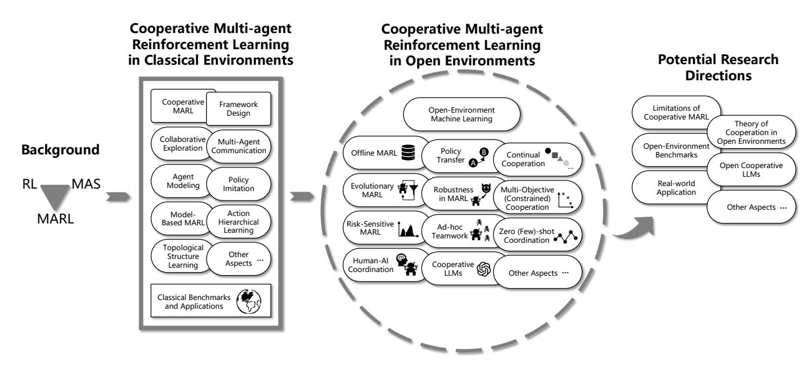

Figure 1: Framework of the survey

At the same time, many real-world problems are shown to be large-scale, complex, real-time, and uncertain. Formulating such problems as the single-agent system is inefficient and inconsistent with real conditions, while modeling them as multi-agent systems (MAS) [\[15\]](#page-36-2) problems is often more suitable. Furthermore, multi-agent coordination has been applied into dealing with many complex problems, such as autonomous driving cars, intelligent warehousing systems, and sensor networks. Multi-agent reinforcement learning (MARL) [\[16–](#page-36-3)[18\]](#page-36-4) provides strong support for modeling and solving these problems. In MARL, a team of agents learns a joint cooperative policy to solve the tasks through interactions with the environment. Compared to traditional methods, the advantages of MARL lie in its ability to deal with environmental uncertainty and learn to solve unknown tasks without requiring excessive domain knowledge. In recent years, the combination of deep learning and MARL has produced fruitful results [\[19\]](#page-36-5), and many algorithms have been proposed and applied to solve complex tasks. However, MARL also brings new challenges. On the one hand, the environment where the MAS exists is often partially observable, and the individual cannot obtain global information from its local observations. This means that independently learning agents struggle to make optimal decisions [\[20\]](#page-36-6). On the other hand, since other agents are also learning simultaneously, the policies will change accordingly. From the perspective of an individual agent, the environment is non-stationary, and convergence cannot be guaranteed [\[21\]](#page-36-7). In addition, cooperative MAS often receive shared rewards only, and how to allocate these rewards to provide accurate feedback for each agent (a.k.a, credit assignment), thereby enabling efficient learning of cooperation and ultimately maximizing system performance, is one of the key challenges [\[22\]](#page-36-8). Finally, as the number of agents in a MAS increases, the search space faced in solving RL problems will exponentially expand, making policy learning and search extremely difficult, bring the scalability issue. Therefore, organizing efficient policy learning is also a major challenge at present [\[23,](#page-36-9) [24\]](#page-36-10).

To address the aforementioned challenges, a large amount of work is currently being conducted from multiple aspects, and surprising achievements have been made in many task scenarios [\[18\]](#page-36-4). Cooperative MARL has demonstrated superior performance compared to traditional methods in tasks such as path planning [\[25\]](#page-36-11), active voltage control [\[26\]](#page-36-12), and dynamic algorithm configuration [\[27\]](#page-36-13). Researchers have designed many algorithms to promote cooperation among agents, including policy gradient based methods such as MADDPG [\[28\]](#page-36-14) and MAPPO [\[29\]](#page-36-15), value based methods such as VDN [\[30\]](#page-36-16) and QMIX [\[31\]](#page-36-17), and other methods that leverage the powerful expressive power of Transformers to enhance coordination capabilities, such as MAT [\[32\]](#page-37-0). These methods have demonstrated excellent cooperation ability in many tasks, such as SMAC [\[33\]](#page-37-1), Hanabi, and GRF [\[29\]](#page-36-15). In addition to the above methods and their respective variants, researchers have also conducted in-depth exploration and research on cooperative MARL from other perspectives, including alleviating partial observability under distributed policy execution settings through efficient communication [\[20\]](#page-36-6), offline deployment of policies [\[34\]](#page-37-2), world model learning in MARL [\[35\]](#page-37-3), and research on training paradigms [\[36\]](#page-37-4).

Traditional machine learning research is typically conducted under the assumption of classical closed environments, where crucial factors in the learning process remain constant. Nowadays, an increasing number of tasks, especially those involving open environment scenarios, may experience changes in essential learning factors. Clearly, transitioning from classical to open environments poses a significant challenge for machine learning. For data-driven learning

tasks, data in open environments accumulates online over time, such as in the form of data streams, making model learning more challenging. Machine learning in open environments [37, 38] has gained application prospects in many scenarios, gradually attracting widespread attention. Current research in open environment machine learning includes category changes, feature evolution, data distribution changes, and variations in learning objectives. Correspondingly, some works in the field of RL have started focusing on tasks in open environments. Key areas of research include trustworthy RL [39], environment generation and policy learning [40], continual RL [41], RL generalization capabilities [42], meta-RL [43], and sim-to-real policy transfer [44].

Compared to single-agent reinforcement learning (SARL), multi-agent scenarios are more complex and challenging. Currently, there is limited research on cooperative MASs in open environments, with some efforts focusing on robustness in multi-agent settings [45]. These works describe problems and propose algorithmic designs from different perspectives [46–49]. Additionally, addressing the challenges of open-team MARL, some works introduce settings such as Ad-Hoc Teamwork (AHT), Zero-Shot Coordination (ZSC), and Few-Shot Teamwork (FST) to tackle it [50–52]. Although these works have achieved success in some task scenarios, they still fail to align well with most real-world applications, leaving room for substantial improvement in practical effectiveness. Regarding MARL, there exist some review works, such as those on multi-agent systems [15], MARL [16,53–58], agent modeling in multi-agent scenarios [59], non-stationarity handling in multi-agent settings [21], multi-agent transfer learning [60], cooperative MARL [17,61,62], model-based multi-agent learning [35], causal MARL [63], and multi-agent communication [20]. Additionally, some works provide comprehensive analyses of open machine learning [37,38,64]. Although the mentioned works provide reviews and summaries in various aspects of MARL or open environment machine learning, there is currently no systematic review specifically focusing on cooperative MARL in open environments. Considering the potential and value of cooperative MARL in solving complex coordination problems in real environments, this paper aims to describe recent advances in this field. The subsequent arrangement of this paper is shown in Figure 1. We first introduce the background relevant to this paper, including basic knowledge of RL, common knowledge and background of MASs to MARL. Next, we introduce cooperative MARL in classical closed environments, covering specific definitions, current mainstream research content, and common testing environments and application cases. Following that, we introduce cooperative MARL in open environments, specifically including common research directions and content from closed machine learning and reinforcement learning to cooperative multi-agent scenarios. Finally, we summarize the main content of this paper, provide a prospect on cooperative MARL in open environments, and aim to inspire further research and ex

# 2 Background

### 2.1 Reinforcement Learning

Reinforcement learning [1] aims to guide an agent to learn the appropriate actions based on the current state, i.e. learning a mapping from observed state to action, in order to maximize the cumulative numerical reward feedback from the environment. The environment provides reward information based on the current state and the action taken by the agent. The agent does not know the optimal actions in advance and must discover actions that yield the highest cumulative reward through trial and error. In a standard RL scenario, the agent interacts with the environment by observing states and taking actions. At each time step, the agent receives an observation of the current state, selects an action based on that observation, and the execution will change the state of the environment and lead to a reward signal. The goal of the agent is to execute a sequence of actions that maximizes the cumulative numerical reward.

### 2.1.1 Formulation of the problem

RL [1] is a sub-branch of machine learning that differs from classical supervised and unsupervised learning in that it learns through interaction. In RL, an agent interacts with an environment, constantly optimizing its policy based on the rewards or punishments received from the environment. RL consists of four main components: agent, state, action, and reward (Figure 2). The goal of RL is to maximize cumulative rewards. The agent must explore and learn through trial and error to find the optimal policy. This process can be modeled as a Markov Decision Process (MDP).

**Defininition 1** (Markov Decision Process). *A Markov Decision Process is defined by either the five-tuple  $\langle \mathcal{S}, \mathcal{A}, P, R, \gamma \rangle$  (infinite process) or  $\langle \mathcal{S}, \mathcal{A}, P, R, T \rangle$  (finite process), where:*

- *S* is the se set of states,
- *A* is the set of acontrols,
- •  $P : \mathcal{S} \times \mathcal{A} \times \mathcal{S} \rightarrow [0, 1]$  is the state transition probability function:  $P(s' \mid s, a) = \Pr[S_{t+1} = s' \mid S_t = s, A_t = a]$ ,

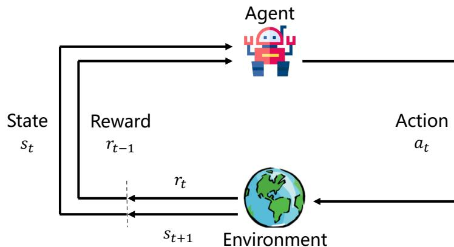

Figure 2: Illustration of reinforcement learning.

The agent is free to choose deterministic action to perform in a given state or to sample actions from some certain probability distributions. The emphasis here is on "free choice," which refers to the agent's autonomy in changing action selection. The fixed selection of actions is referred to as a "policy". Specifically, at any time step  $t$ , the agent observes the current state  $s_t$  from the environment and then performs action  $a_t$ . This action causes the environment to transition to a new state  $s_{t+1}$  based on the transition function  $s_{t+1} \sim P(\cdot | s_t, a_t)$  and the agent receives a reward signal  $r_t = R(s_t, a_t)$  from the environment. Without loss of generality, we mainly discusses infinite MDP in this paper, where the goal of the agent is to find the optimal policy to maximize cumulative rewards. Mathematically, the above process can be summarized as finding a Markov, time-independent, and stationary policy function  $\pi : \mathcal{S} \rightarrow \Delta(\mathcal{A})$  that guides the agent to execute appropriate sequential decisions to maximize cumulative rewards, with the optimization objective defined as follows:

$$\mathbb{E}\mathbb{E}^\pi \left[ \sum_{t=0}^{\infty} \gamma^t R(s_t, a_t) \mid s_0 \right], \quad (1)$$

where the o operator  $\mathbb{E}^\pi[\cdot]$  computes the expectation over the distribution of sequences  $\tau = (s_0, a_0, s_1, a_1, \dots)$  generated by the policy  $\pi(a_t|s_t)$  and the state transition  $P(s_{t+1}|s_t, a_t)$ .

Baseased on the objective in Equation 1, the state-action value function, denoted as the  $Q$ -function, can be defined under the guidance of policy  $\pi$ . The  $Q$ -function represents the expected cumulative reward after taking action  $a$  based on state  $s$  under policy  $\pi$ . Additionally, the state value function  $V$  describes the expected cumulative reward based on state  $s$ :

$$Q^\pi(s, a) = \mathbb{E}^\pi \left[ \sum_{t=0}^{\infty} \gamma^t R(s_t, a_t) \mid s_0 = s, a_0 = a \right], \quad (2)$$

$$V^\pi(s) = \mathbb{E}^\pi \left[ \sum_{t=0}^{\infty} \gamma^t R(s_t, a_t) \mid s_0 = s \right].$$

Clertainly, the relationship between the state-action function  $Q$  and the state value function  $V$  can be expressed as  $V^\pi(s) = \mathbb{E}_{a \sim \pi(\cdot|s)} [Q^\pi(s, a)]$  and  $Q^\pi(s, a) = \mathbb{E}_{s' \sim P(\cdot|s, a)} [R(s, a) + V^\pi(s')]$ . Based on the definitions of these two types of value functions, the learning goal of RL in Markov decision processes can be represented as finding the optimal policy  $\pi_*$  that maximizes the value function:  $\pi_* = \arg \max_\pi V^\pi(s), \forall s$ .

For ther the MDP with finite state and action space, there exists at least one deterministic stationary optimal policy that maximizes the cumulative reward. Value based RL methods require the construction and estimation of a value function, which is subsequently used to guide action selection and execution, deriving the corresponding policy. Most of these algorithms do not directly use the  $V$ -function but require the use of the  $Q$ -value function to maximize the  $Q$ -value corresponding to Equation 2. The optimal policy induced by the  $Q$ -function through greedy action selection can be expressed as  $\pi^*(a|s) = \mathbb{1}\{a = \arg \max_Q Q^*(s, a)\}$ , where  $\mathbb{1}\{\cdot\}$  is the indicator function. The classical  $Q$ -learning

algorithm, t, through temporal-difference (TD) learning, updates the agent’s function  $\hat{Q}$ -value to approximate the optimal function  $Q^*$  [65], with the update process defined as follows:

$$\hat{Q}(s_t, a_t) \leftarrow \hat{Q}(s_t, a_t) + \alpha \cdot \underbrace{r_t + \gamma \max_{a_{t+1} \in \mathcal{A}} \hat{Q}(s_{t+1}, a_{t+1}) - \hat{Q}(s_t, a_t)}_{\text{temporal-difference target}}. \quad (3)$$

In n theory, given the Bellman optimality operator  $\mathcal{B}^*$ , the update of  $Q$ -value function can be defined as [66]:

$$(\mathcal{B}^*Q)(s, a) = \sum_{s'} P(s'|s, a) \left[ R(s, a) + \gamma \max_{a' \in \mathcal{A}} Q(s', a') \right]. \quad (4)$$

To establish the optimal  $Q$ -value function, the  $Q$ -learning algorithm uses the fixed-point iteration of the Bellman equation to solve the unique solution for  $Q^*(s, a) = (B^*Q^*)(s, a)$ . In practice, when the world model [67] is unknown, state-action pairs are discretely represented, and all actions can be repetitively sampled in all states, the mentioned  $Q$ -learning method guarantees convergence to the optimal solution.

However, real-world problems may involve continuous, high-dimensional state-action spaces, making the above assumptions usually inapplicable. In such cases, agents need to learn a parameterized  $Q$ -value function  $Q(s, a|\theta)$ , where  $\theta$  is the parameter instantiation of the function. To update the  $Q$ -function, the agent needs to collect samples generated during interaction with the environment in the form of tuples  $(s, a, r, s')$ . Here, the reward  $r$  and the state  $s'$  at the next time step follow feedback from the environment based on the state-action pair  $(s, a)$ . At each iteration, the current  $Q$ -value function  $Q(s, a|\theta)$  can be updated as follows [68]:

$$y^Q = = r + \gamma \max_{a' \in A} Q(s', a' | \theta), \quad (5)$$

$$\theta \leftarrow \theta + \alpha (y^Q - Q(s, a | \theta)) \nabla_\theta Q(s, a | \theta),$$

where  $\alpha$  is the update rate.

The  $Q$ -learning approach in Equation 5 can directly use a neural network  $Q(s, a|\theta)$  to fit and converge to the optimal  $Q^*$ -value, where the parameters  $\theta$  are updated through stochastic gradient descent (or other optimization methods). However, due to the limited generalization and reasoning capabilities of neural networks,  $Q$ -networks may exhibit unpredictable variations in different locations of the state-action space. Consequently, the contraction mapping property of the Bellman operator in Equation 4 is insufficient to guarantee convergence. Extensive experiments show that these errors propagate with the propagation of online update rules, leading to slow or even unstable convergence. Another disadvantage of using function approximation for  $Q$ -values is that, due to the action of the max operator,  $Q$ -values are often overestimated. Therefore, due to the risks of instability and overestimation, special attention must be paid to ensuring an appropriate learning rate. Deep Q Network (DQN) algorithm proposed by literature [69] addresses these challenges by incorporating two crucial factors: a target  $Q$ -network and experience replay buffer. Specifically, DQN instantiates a target  $Q$ -network with parameters  $\theta^-$  to compute the temporal-difference target. Simultaneously, it uses an experience replay buffer  $\mathcal{D}$  to store sampled sequences, ensuring both sample utilization and, during training, mitigating the correlation of sampled data through independent and identically distributed sampling. The optimization objectiv
$$\min_{\theta} \mathbb{E}_{(s,a,r,s') \sim \mathcal{D}}[(r + \gamma \max_{a' \in \mathcal{A}} Q(s', a' | \theta^-) - Q(s, a | \theta))^2], \quad (6)$$

The target  $Q-network  $Q(s, a|\theta^-)$  is periodically updated to synchronize with the parameters of the Q-network. Through these methods and two crucial factors, stable training of the Q-network can be achieved.$ 

Furthermore, many recent works have made additional improvements to DQN. In [70], the value function and advantage function (defined as  $A(s, a) = Q(s, a) - V(s)$ ) are decoupled using a neural network structure, enhancing learning performance. In [71], a specific update scheme (a variant of Equation 6) reduces the overestimation of  $Q$ -values while improving learning stability. Parallel learning [72] or the use of unsupervised auxiliary tasks [73] contributes to faster and more robust learning. In [74], a differentiable memory module can integrate recent experiences by interpolating between Monte Carlo value estimates and off-policy estimates.

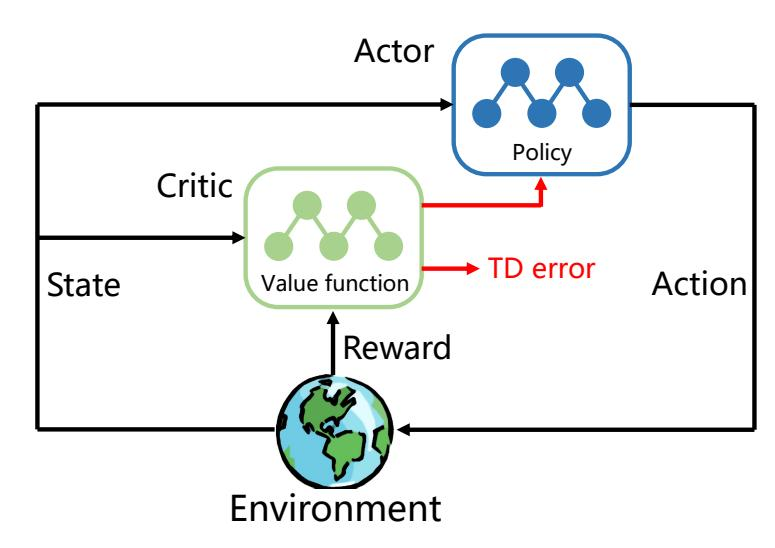

Figure 3: Framework of Actor-Critic based Methods.

#### 2.1.3 Policy Gradient based Reinforcement Learning

Policy gradient based methods [75] are fundamentally designed to directly learn a parameterized optimal policy  $\pi_\theta$ . In comparison to value-based methods, policy-based algorithms have the following characteristics: firstly, these methods can be flexibly applied to continuous action spaces; secondly, they can directly obtain a stochastic policy  $\pi_\theta(\cdot|s)$ . When parameterizing the policy with a neural network, a typical approach is to adjust the parameters in the direction of increasing the cumulative reward:  $\theta \leftarrow \theta + \alpha \nabla_\theta V^{\pi_\theta}(s)$ . However, the gradient is also subject to the unknown effects of policy changes on the state distribution. In [1], researchers derived a solution based on policy gradients that does not involve the state distribution:

$$\nabla V^{\pi, \theta}(s) = \mathbb{E}_{s \sim \mu^{\pi,\theta}(\cdot), a \sim \pi_{\theta}(\cdot|s)} [\nabla_{\theta} \log \pi_{\theta}(a|s) \cdot Q^{\pi,\theta}(s, a)], \quad (7)$$

where  $\mu^{\pi_\theta}$  is the state occupancy measure under policy  $\pi_\theta$  [76], and  $\nabla_\theta \log \pi_\theta(a|s)$  is the policy's score evaluation. When the policy is deterministic, and the action space is continuous, we can further obtain the Deterministic Policy Gradient (DPG) theorem [77]:

$$\nabla_{\theta} V^{\pi \theta}(s) = \mathbb{E} \mathbb{E}_{s \sim \mu^{\pi \theta}(\cdot)} \left[ \nabla_{\theta} \pi_{\theta}(a|s) \cdot \nabla_a Q^{\pi \theta}(s, a) \right]_{a=\pi_{\theta}(s)}. \quad (8)$$

One of the most classical applications of policy gradients is the REINFORCE algorithm [78], which uses the cumulative reward  $R_t = \sum_{t'=t}^T \gamma^{t'-t} r_{t'}$  as an estimate for  $Q^{\pi_\theta}(s_t, a_t)$  to update the policy parameters.

### 2.1.4 Actor-Critic based Reinforcement Learning

The traditional Actor-Critic method consists of two components: the Actor, which adjusts the parameters  $\theta$  of the policy  $\pi_\theta$ ; and the Critic, which adjusts the parameters  $w$  of the state-action value function  $Q_w^\pi$ . Based on these two components, the corresponding update methods for the Actor and Critic can be obtained as follows:

$$\begin{aligned}\theta &\leftarrow \theta + \alpha_\theta Q_w(s, a) \nabla_\theta \pi_\theta(s, a), \\w &\leftarrow w + \alpha_w (r + \gamma Q_w(s', a') - Q_w(s, a)) \nabla_w Q_w(s, a).\end{aligned}\tag{9}$$

The Actor-Critic method combines policy gradient methods with value function approximation. The Actor probabilistically selects actions, while the Critic, based on the action chosen by the Actor and the current state, evaluates the score of that action. The Actor then modifies the probability of choosing actions based on the Critic's score. The advantage of such methods is that they allow for single-step updates, yielding low-variance solutions in continuous action spaces [79,80]. However, the drawback is that, during the initial stages of learning, there is significant fluctuation due to the imprecise estimation by the Critic. Figure 3 illustrates the architecture of the Actor-Critic method, and for more details on SARL methods, refer to the review [9].

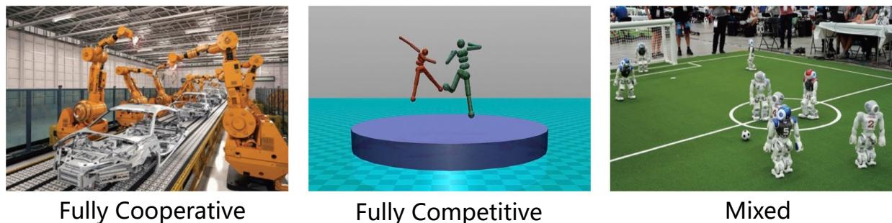

The Multi-agent system (MAS) evolved from Distributed Artificial Intelligence (DAI) [\[81\]](#page-39-7). The research aim is to address real-world problems that are large-scale, complex, real-time, and involve uncertainty. Modeling such problems with a single intelligent agent is often inefficient and contradictory to real-world conditions. MASs exhibit autonomy, distribution, coordination, self-organization, reasoning, and learning capabilities. Developed since the 1970s, research on MASs encompasses both building individual agents' technologies, such as modeling, reasoning, learning, and planning, and technologies for coordinating the operation of multiple agents, such as interaction, coordination, cooperation, negotiation, scheduling, and conflict resolution. MASs find rapid and extensive applications in areas such as intelligent robotics, traffic control, distributed decision-making, software development, and gaming, becoming

Depending on task characteristics, MASs can generally be classified into three settings: Fully Cooperative, Fully Competitive, and Mixed. In a Fully Cooperative setting, agents share a common goal, collaborating to accomplish specific tasks, such as the assembly of machine systems. In a Fully Competitive setting, agents' goals conflict, where one agent's gain results in another's loss, like in a sumo wrestling match. Mixed settings involve agents forming multiple groups, with cooperation within groups and competition between them, resembling a soccer match where

In MASs, different settings lead to variations in policy optimization goals and learned policies. In cooperative settings, agents must consider teammates' policies, aiming for optimal coordination to avoid interference. In competitive settings, agents consider opponents' policies, minimizing opponents' gains while maximizing their own returns, opti-

Game theory [\[82,](#page-39-8) [83\]](#page-39-9), a mathematical theory and method for analyzing strategic interactions among rational agents, was initially widely applied in economics and has expanded to cover various disciplines, including sociology, politics, psychology, and computer science. In MASs, the interaction and decision-making processes among individuals can be modeled as a game, providing a framework to analyze strategic choices. Game theory typically models problems

- $\mathcal{N}$  is a finite set of agents, with a size of  $n$ , each indexed by  $i \in 1, \dots, n$ ;
- $\mathcal{A} = \mathcal{A}_1 \times \dots \times \mathcal{A}_n$  represents the joint action space, where each  $\mathcal{A}_i$  is the action set for agent  $i$ , and  $\mathbf{a} = (a_1, a_2, \dots, a_n) \in \mathcal{A}$  is called an action profile.
- $\mathbf{Q} = (Q_1, \dots, Q_n)$ , where each component  $Q_i : \mathcal{A} \mapsto \mathbb{R}$  is the utility function of agent  $i$ .

Although game theory commonly uses the symbol  $u$  to denote the utility function, its meaning is equivalent to the action-value function in the case of a single state and 1-horizon MDP. Hence, we replace  $u$  with the symbol  $Q$  for consistency of notation. We also do not distinguish "policy" and "strategy" in the paper. For a two-player normal-form game where both agents are in a fully competitive scenario, it can be modeled as a zero-sum game:

**Definition 3** (Two-Player Zero-Sum Game). *A game is a two-player zero-sum game when the utility functions satisfy  $\forall a, Q_1(a) + Q_2(a) \equiv 0$ .*

In a normal-form game, if an agent takes a single action, it is considered a pure policy. When each agent takes a single action, the resulting action profile  $\alpha$  is known as a pure policy profile. More generally, an agent's policy is defined as follows:

**Definition 4** (Policy and Policy Profile). *In a normal-form game  $(\mathcal{N}, \mathcal{A}, \mathbf{Q})$ , the policy of agent  $i$  is a probability distribution defined on its feasible action space  $\mathcal{A}_i$ , denoted as  $\pi_i : \mathcal{A}_i \mapsto [0, 1]$ . The Cartesian product of all agents' policies, denoted as  $\pi = \prod_{i=1}^n \pi_i$ , is a (mixed) policy profile.*

The se symbols  $\pi_i$ , commonly used in RL, is employed here instead of the often-used symbol  $\sigma_i$  in game theory to represent a probability distribution on the feasible action space. Additionally, in game theory,  $-i$  usually denotes the set of all players except player  $i$ . Consequently, the expected utility of agent  $i$  under a mixed policy profile  $\pi = (\pi_i, \pi_{-i})$  is given by

$$Q_i(\pi_i, \pi_{-i}) = \sum_{\mathbf{a} \in \mathcal{A}} Q_i(\mathbf{a}) \prod_{i=1}^n \pi_i(a_i).$$

The form of the expected utility shows that, for agent  $i$ , the expected utility functions of a two-person constant-sum game and a two-player zero-sum game only differ by a constant  $c$ . Thus, under the same solution concept, there is no difference in the policies between the two types of games. For rational agents, the goal is often to maximize their utility, meaning maximizing their expected returns. Therefore, we need to introduce the definition of best response.

**Definition 5** (Best Response). *A policy  $\pi_i^*$  for agent  $i$  is a best response to the policy profile  $\pi-i$  if*

$$\forall \pi'_i, Q_i(\pi_i^*, \pi-i) \geq Q_i(\pi'_i, \pi-i),$$

and the set of best responses to  $\pi_{-i}$  is denoted as  $BR(\pi_{-i})$ .

The best response intuitively meagents that, given the policies of other agents  $\pi_{-i}$ , the agent  $i$ 's policy  $\pi_i^*$  maximizes its utility. Thus, if other agents' policies are fixed, we can use RL to find the best response. Based on best responses, we can straightforwardly introduce the definition of Nash Equilibrium.

**Definition 6** (Nash Equilibrium). *In a game with  $n$  agents, if a policy profile  $\pi = (\pi_1, \dots, \pi_n)$  satisfies  $\forall i \in 1, \dots, n, \pi_i \in BR(\pi_{-i})$ , then  $\pi$  is a Nash Equilibrium.*

According to the above definition, in a Nash Equilibrium, unilateral deviations by individual agents do not increase their own utility, indicating that each rational agent has no incentive to deviate unilaterally from the equilibrium. Besides Nash Equilibrium, there are many other solution concepts in game theory, such as maximin policy and minimax policy.

**Definition 7** (Maxmin policy). *The maxmin policy for agent  $i$  is  $\arg \max_{\pi_i} \min_{\pi_{-i}} Q_i(\pi_i, \pi_{-i})$ , and its corresponding maxmin value is  $\max_{\pi_i} \min_{\pi_{-i}} u_i(\pi_i, \pi_{-i})$ .*

The maxmin policy maximizes the agent  $i$ 's utility in the worst-case scenario (against the most malicious opponent). Therefore, adopting the maxmin policy ensures that the agent's utility is not lower than the maxmin value. When making decisions solely to maximize their own returns without making any assumptions about other agents, the maxmin policy is a suitable and conservative choice. The "dual" policy to the maxmin policy is the minimax policy.

**Definition 8** (Minmax policy). *The minimax policy for other agents  $-i$  is  $\arg \min_{\pi_{-i}} \max_{\pi_i} Q_i(\pi_i, \pi_{-i})$ , and the corresponding minimax value is  $\min_{\pi_{-i}} \max_{\pi_i} Q_i(\pi_i, \pi_{-i})$ .*

These two policies are often applied in constant-sum games. However, in cooperative settings, attention is given to how agents in the system choose policies through certain coordination means to achieve mutual benefits. Relevant equilibrium provides a reasonable policy coordination mechanism.

**Definition 9** (Correlated Equilibrium). *A joint policy  $\pi$  is a correlated equilibrium if, for  $\forall i \in \mathcal{N}$  and  $\forall a^i \in \mathcal{A}^i$ ,*

$$\sum_{\mathbf{a}^{-i}} \pi(a^i, \mathbf{a}^{-i}) [Q_i(a^i, \mathbf{a}^{-i}) - Q_i(a^i, \mathbf{a}^{-i})] \geq 0,$$

where  $a^{i,*}$  is the best response to  $a^{-i}$ .

Correlated equilibrium describes a situation where, assuming two agents follow a correlated policy distribution, no agent can unilaterally change its current policy to obtain a higher utility. It should be noted that Nash Equilibrium implies that choices made by each agent are independent, i.e., the actions of agents are not correlated. Nash Equilibrium can be viewed as a special case of correlated equilibrium.

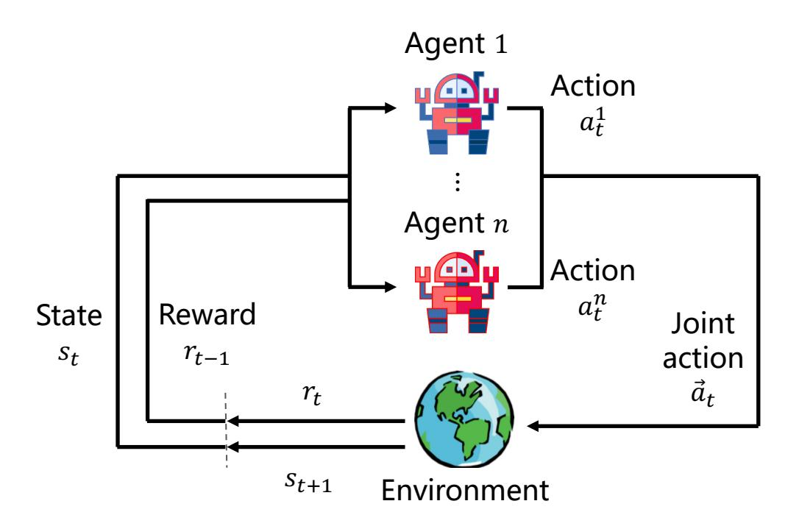

Figure 5: Illustration of MARL.

The concepts mentioned above assume that agents make decisions simultaneously. However, in some scenarios, there may be a sequence of decisions. In such cases, agents are defined as leaders and followers, where leaders make decisions first, enjoying a first-mover advantage, and followers make decisions afterward.

**Defininition 10** (Stackelberg Equilibrium). Assuming a sequential action scenario where leader  $\pi_l$  makes policy actions first, and follower  $\pi_f$  makes policy actions later.  $Q_l$  and  $Q_f$  are the utility functions of the leader and follower, respectively. The Stackelberg Equilibrium  $(\pi_l \pi_f)$  satisfies the following constraints:

$$Q_l(\pi_l^*, \pi_f^*) \geq Q_l(\pi_l, \pi_f^*),$$

where

$$\pi_f^* = \arg \max_{\pi_f} Q_f(\pi_l, \pi_f).$$

#### 2.2.3 Multi-agent Reinforcement Learning

Multi-agent Learning (MAL) introduces machine learning techniques into the field of MASs, exploring the design of algorithms for adaptive agent learning and optimization in dynamic environments. The objective of Multi-agent Reinforcement Learning (MARL) (Figure 5) is to train multiple agents in a shared environment using RL methods to accomplish given tasks [19, 56].

Differing from modeling the multi-step decision-making process as a Markov Decision Process (MDP) in SARL, MARL is generally modeled as a Stochastic Game.

**Definition 11** (Stochastic Game). *A stochastic game can typically be represented by a sextuple  $\langle \mathcal{N}, \mathcal{S}, \{\mathcal{A}^i\}_{i \in \mathcal{N}}, P \rangle$ ,  $\{R^i\}_{i \in \mathcal{N}}, \gamma \rangle$ , where:*

- •  $\mathcal{N} = 1, 2, \dots, n$  represents the set of agents in the system. When  $n = 1$ , the problem degenerates into a single-agent Markov Decision Process, and  $n \geq 2$  is a general stochastic game process.
- *S* is the state space shared by all agents in the environment.
- $\mathcal{A}^i$  is the action space of agent  $i$ , defining the joint action space  $\mathcal{A} := \mathcal{A}^1 \times \cdots \times \mathcal{A}^n$ .
- •  $P : \mathcal{S} \times \mathcal{A} \rightarrow \Delta(\mathcal{S})$  is the *state transition function*, specifying the probability that the environment transitions from  $s \in \mathcal{S}$  to another state  $s' \in \mathcal{S}$  at each time step, given a joint action  $\mathbf{a} \in \mathcal{A}$ .

- $R^i : \mathcal{S} \times \mathcal{A} \times \mathcal{N} \rightarrow \mathbb{R}$  is the reward function for each agent.
- $\gamma \in [0, 1]$  is the discount factor.

At each time step, agent  $i \in \mathcal{N}$  is in state  $s$ , selects action  $a^i \in \mathcal{A}^i$ , forms the joint action  $\mathbf{a} = \langle a^1, \dots, a^n \rangle$ , and executes it. The environment transitions to the next state  $s' \sim P(\cdot \mid s, \mathbf{a})$ , and agent  $i$  receives its own reward  $R^i(s, \mathbf{a})$ . Each agent optimizes its policy function  $\pi_i : \mathcal{S} \rightarrow \Delta(\mathcal{A}^i)$  to maximize its expected cumulative reward, expressed in the form of a state value function:

$$\max_{\pi_i} V_{\pi}^i(s) := \mathbb{E}\left[\sum_{t \geq 0} \gamma^t R^i(s_t, \mathbf{a}_t) | a_t^i \sim \pi_i(\cdot \mid s_t), \right. \\ \left. \mathbf{a}_t^{-i} \sim \pi_{-i}(\cdot \mid s_t), s_0 = s \right],$$

where the symbol  $-i$  represents all agents except agent  $i$ . Unlike in SARL where agents only need to consider their own impact on the environment, in MASs, agents mutually influence each other, jointly make decisions, and simultaneously update policies. When the policies of other agents in the system are fixed, agent  $i$  can maximize its own payoff function to find the optimal policy  $\pi_i^*$  relative to the policies of other agents. In MARL, rationality and convergence are the primary evaluation metrics for learning algorithms.

**Definition 12** (Rationality). *In the scenario where opponents use a constant policy, rationality is the ability of the current agent to learn and converge to an optimal policy relative to the opponent's policy.*

**Defininition 13** (Convergence). *When other agents also use learning algorithms, convergence is the ability of the current agent to learn and converge to a stable policy. Typically, convergence applies to all agents in the system using the same learning algorithm.*

From the above discussions, it is evident that in the process of MARL, each agent aims to increase its own utility. The learning goal in this case can be to maximize its own Q-function. Therefore, an intuitive learning approach is to construct an independent Q-function for each agent and update it according to the Q-learning algorithm:

$$Q_i(s_t, a_t^i) \leftarrow Q_i(s_t, a_t^i) + \alpha [r_{t+1} + \gamma \max_{a_{t+1}^i \in \mathcal{A}^i} Q_i(s_{t+1}, a_{t+1}^i) - Q_i(s_t, a_t^i)]. \quad (10)$$

Similar to the SARL algorithm, each agent selects the current action using a greedy policy:

$$\pi_i(a_t^i |s_t) = \mathbb{1}\{a_t^i = \arg \max_{a_t^i} Q_i(s_t, a_t^i)\}. \quad (11)$$

In the above scenario, we assume that eachch agent can obtain global state information for decision-making. However, constrained by real conditions, individuals in MASs often can only obtain limited local observations. To address this characteristic, we generally model such decision processes as Partially-Observable Stochastic Games (POSG).

**Definition 14** (Partially-Observable Stochastic Games (POSG)). *The POSG is often defined as  $\mathcal{M} = \langle \mathcal{N}, \mathcal{S}, \{\mathcal{A}^i\}_{i \in \mathcal{N}} \rangle$ ,  $P, \{R^i\}_{i \in \mathcal{N}}, \gamma, \{\Omega^i\}_{i \in \mathcal{N}}, \mathcal{O} \rangle$ , POSG includes the first six components consistent with the definition 11. Additionally, it introduces:*

- $\Omega^i$  is the observation space of agent  $i$ , and the joint observation space for all agents is  $\boldsymbol{\Omega} := \boldsymbol{\Omega}^1 \times \cdots \times \boldsymbol{\Omega}^i$ .
- *yn*.
- $\mathcal{O} : \mathcal{S} \rightarrow \Delta(\Omega)$  represents the observation function,  $\mathcal{O}(o|s)$ , indicating the probability function concerning the joint observation  $o$  given a state  $s$ .

In POSG, each agent optimizes its policy  $\pi_i : \Omega^i \rightarrow \Delta(\mathcal{A}^i)$  to maximize its return. Although POSG is widely applied in real scenarios, theoretical results prove its problem-solving difficulty is NEXP-hard [84]. Fortunately, recent technologies, including centralized MARL training frameworks, utilizing recurrent neural networks to encode historical information [85], and agent communication [20], have alleviated this issue from different perspectives.

In cooperatative tasks, POSG can be further modeled as a Decentralized Partially Observable Markov Decision Process (Dec-POMDP) [84]. The main difference lies in the fact that in Dec-POMDP, the reward functions for each agent are identical. Beyond the challenges of partial observability, MARL faces unique problems compared to SARL. In MARL, the state space becomes larger, and the action space experiences the "curse of dimensionality" problem as the number of agents grows [56]. Additionally, issues such as scalability, credit assignment, heterogeneity, and cooperative exploration have hindered the development of MARL [55].

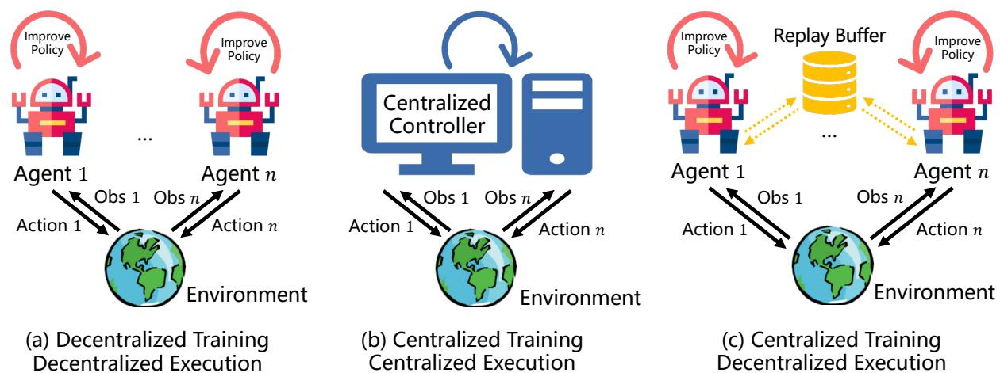

In MARL, training is the process of optimizing policies based on acquired experience (states, actions, rewards, etc.), while execution involves agents interacting with the environment by executing actions according to individual or joint policies. Generally, depending on whether agents need information from other agents during policy updates, the training process can be categorized into Centralized Training and Decentralized Training. Correspondingly, based on whether external information is required during the execution phase, it is categorized into Centralized Execution and Decentralized Execution. Combining these phases, MARL encompasses three paradigms: Decentralized Training Decentralized Execution (DTDE), Centralized Training Centralized Execution (CTCE), and Centralized Training

Definition 15 (Decentralized Training Decentralized Execution (DTDE)). *In the DTDE framework, each agent independently updates its policy and executes using only its local information, without any information exchange. The*

IQL [86] is a typical algorithm based on DTDE, known for its scalability as it only considers the individual agent. However, due to the lack of consideration for information from other agents, agents often operate in a non-stationary environment, as defined in Section 2.1. To address the inefficiency brought by decentralized learning, optimistic and delayed optimization assign greater update weights to better  $Q$  values, alleviating the non-stationarity issue. Techniques like recurrent neural networks can also mitigate these problems.

When updating policies using DQN, direct usage of data from experience replay buffer exacerbates non-stationarity.

$$\mathcal{L}(\theta_i) = \frac{\pi^{t_c}(\mathbf{a}^{-i}|\mathbf{o}^{-i})}{\pi^{t_i}(\mathbf{a}^{-i}|\mathbf{o}^{-i})} [(y_i^{\mathbb{Q}} - Q_i(o^i, a^i; \theta_i))^2],$$

is the

Definition 16 (Centralized Training Centralized Execution (CTCE)). *In the CTCE framework, agents learn a central-*

$$\pi : \Omega \rightarrow \Delta(\mathcal{A}),$$

Here, any SARL algorithm can be used to train MASs. However, the complexity of the algorithm grows exponentially

While decomposition methods alleviate the dimension explosion problem, CTCE struggles to evaluate the mutual influences among agents. Recently, attention has been given to the Centralized Training Decentralized Execution

Definition 17 (Centralized Training Decentralized Execution (CTDE)). *In the CTDE framework, during the training phase, agents optimize their local policies with access to information from other agents or even global information:*

 $\pi_i : \Omega^i \rightarrow \Delta(\mathcal{A}^i)$ . During the decentralized execution process, agents make decisions using only their local information.

CTDE has found widespread applications in MASs, particularly excelling in certain complex scenarios. However, when dealing with heterogeneous MASs, CTDE may face challenges. Skill learning or grouping followed by local CTDE training are proposed solutions. Additionally, research has discussed centralized and decentralized aspects from various perspectives [\[88,](#page-39-14) [89\]](#page-39-15).

# 2.2.5 Challenges and Difficulties in Multi-Agent Reinforcement Learning

Compared to SARL, real-world scenarios are often better modeled as MARL. However, the presence of multiple agents simultaneously updating their policies introduces more challenges. This section discusses key challenges in MARL, including non-stationarity, scalability, partial observability, and current solutions.

In a single-agent system, the agent only considers its own interaction with the environment, resulting in a fixed transition of the environment. However, in MASs, simultaneous policy updates by multiple agents lead to a dynamic target process, termed non-stationarity.

**Definition 18** (Non-Stationarity Problem). *In multi-agent systems, a particular agent  $i$  faces a dynamic target pt process, where for any  $\pi_i \neq \bar{\pi}_i$ :*

$$P(s'|s, \mathbf{a}, \pi_i, \boldsymbol{\pi}_{-i}) \neq P(s'|s, \mathbf{a}, \bar{\pi}_i, \boldsymbol{\pi}_{-i}).$$

Non-stagentiarity indicates that, with simultaneous learning and updates by multiple agents, learning no longer adheres to Markovian properties. This issue is more severe in updates of  $Q$  values, particularly methods relying on experience replay, where sampling joint actions in multi-agent environments is challenging. To address non-stationarity, solutions involve modeling opponents (teammates), importance sampling of replay data, centralized training, or incorporating meta-RL considering updates from other teammates.

Definition 19 (Scalability Issue). *To tackle non-stationarity, multi-agent systems often need to consider the joint actions of all agents in the environment, leading to an exponential rise in joint actions with an increasing number of agents.*

In real-world scenarios, the number of agents in MASs is often substantial, such as in autonomous driving environments where there may be hundreds or even thousands of agents. Scalability becomes essential but is also a highly challenging aspect. Current methods to address scalability include parameter sharing, where homogeneous agents share neural networks, and heterogeneous agents undergo independent training [\[24\]](#page-36-10). Alternatively, techniques such as transfer learning or curriculum learning involve training initially with fewer agents and progressively scaling up to environments with a larger number of agents [\[60\]](#page-38-4).

Due to sensor limitations and other factors, agents often struggle to obtain global states and can only access partial information. MARL is often modeled as Partially Observable Stochastic Games (POSG), where the environment, from an individual agent's perspective, no longer adheres to Markovian properties, posing training challenges.

Various solutions have been proposed, including multi-agent communication, where agents exchange information to alleviate local observation issues. Key questions in communication involve determining who to communicate with, what information to communicate, and when to communicate. Current research explores three communication topologies (Figure [7\)](#page-12-0): broadcasting information to all agents, forming network structures for selective communication, or communicating with a subset of neighbors. Policies for handling these questions include direct exchange of local information, preprocessing information before transmission, and optimizing communication timing. In conclusion, the challenges of non-stationarity, scalability, and partial observability in MARL demand innovative solutions to ensure effective learning and decision-making in complex, real-world scenarios.

# 3 Cooperative Multi-agent Reinforcement Learning in Classical Environments

# 3.1 Concept of Multi-agent Cooperation

Previously, we mentioned that MASs can be categorized into fully cooperative, fully competitive, and mixed settings based on task characteristics. Among these settings, competitive scenarios are generally solved by modeling them as zero-sum games, while mixed scenarios involve a combination of cooperation and competition. This section focuses on cooperative MARL algorithms, which have been extensively researched.

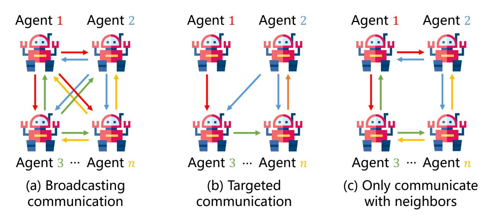

Figure 7: Three different communication topologies.

**Definition 20** (Fully Cooperative). *In MARL, fully cooperative refers ts to all agents sharing a common reward function, satisfying the condition:*

$$R^1 = R^2 = \dots = R^n = R.$$

In cooperative MARL, where agents share a common reward function, it is evident that agents have identical returns. With a centralized controller, the learning process can degrade into a Markov Decision Process, and the action space of agents becomes a joint action space for a stochastic game. The optimization objective is as follows:

$$Q(s_t, \mathbf{a}_t) \leftarrow Q(s_t, \mathbf{a}_t) + \alpha[r_t + \gamma \max_{\mathbf{a}_{t+1} \in \mathcal{A}} Q(s_{t+1}, \mathbf{a}_{t+1}) - Q(s_t, \mathbf{a}_t)]. \quad (12)$$

However, in real-world scenarios, this objective is challenging for multi-agent decision-making because agents often independently make decisions. Concretely, agents may choose actions belong to different optimal joint actions, due to decentralized execution. Ignoring inter-agent cooperation behavior [90], early distributed Q-learning algorithms assumed a single optimal equilibrium point, allowing for the direct use of the above formula, where each agents only update its local action-value function  $Q_i(s, a^i)$ .

**Definition 21** (Credit Assignment Problem). *In fully cooperative MARL, where agents share global rewards, accurately evaluating the contribution of an agent's action to the entire system becomes a challenge.*

**Definition 22** (Coordination-Free Multi-Agent Cooperation Method). Assuming each agent's local action-value function is  $Q_i(s_t, a_t^i)$ , its update is as follows:

$$Q_i(s_t, a_t^i) \leftarrow \max_{a_{t+1}^i \in \mathcal{A}^i} \{Q_i(s_t, a_t^i), r_t + \gamma \max_{a_{t+1}^i \in \mathcal{A}^i} Q_i(s_{t+1}, a_{t+1}^i)\}. \quad (13)$$
Coordination-free approach i
$$Q_i(s_t, a_t^i_t) \leftarrow \max\{Q_i(s_t, a^i_t), r_t + \gamma \max_{a^i_{t+1} \in \mathcal{A}^i} Q_i(s_{t+1}, a^i_{t+1})\}. \quad (13)$$

Cooordination-free approach ignores poorly rewarded actions. However, consistently choosing the maximum operation may lead to overestimation issues, and it often lacks scalability due to the calculation based on the joint action function [91].

**Definition 23** (Joint Acontrol Learning). *Assuming agents are in a globally observable environment, observing the states and actions of all teammates, each agent's policy is  $\pi_i$ , and there exists a global value function  $Q(s, \mathbf{a})$ , then for agent  $i$ , its local action value can be assessed as:*

$$Q_i(s_t, a_i) =: \sum_{\mathbf{a}_{-i} \in \mathcal{A}_{-i}} Q(\langle a_i, \mathbf{a}_{-i} \rangle) \prod_{j \neq i} \pi_j(a_j).$$

Simultaneously, in special scenarios, multi-agent cooperation can be indirectly achieved through role assignment coordination graphs, multi-agent communication, etc. Additionally, distributed systems often obtain only local observations. We generally model cooperative MARL as a partially observable stochastic game (POSG), a special case of Dec-POMDP. In Dec-POMDPs, each agent shares the same reward function. We observe that when all agents share a reward function and return, some agents can receive rewards without making a substantial contribution to the system, leading to the credit assignment problem in the MAS [22,92].

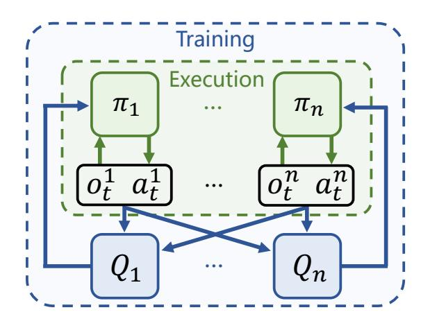

Figure 8: Framework of MADDPG [28].

# 3.2 Typical Cooperative MARL Algorithms

# 3.2.1 Policy-Gradient-Based MARL Methods

In cooperpative MARL, where rewards and returns among agents are identical, all agents possess the same value function. We denote the global action value function as  $Q_\pi(s, a)$  and the state value function as  $V_\pi(s)$ . It's worth noting that, in MARL, the action value function and state value function of an agent depend on the policies of all agents:

$$\pi_1(a^1|o^1, \theta^1), \pi_2(a^2|o^2, \theta^2), \dots, \pi_n(a^n|o^n, \theta^n).$$

Here,  $\theta^i$  reprepresents the policy parameters of agent  $i$ , and the differences in policies among agents mainly manifest in the differences in policy parameters. In the process of policy learning, our objective is to optimize policy parameters to maximize the objective function:

$$J(\theta^1, \dots, \theta^n) = E_s[V_{\pi}(s)].$$

All agents share a common goal, optimizing their policy parameters  $\theta^i$  to maximize the objective function  $J$ . Thus, the optimization objective can be expressed as follows:

$$\max_{\theta^1, \dots, \theta^n} J(\theta^1, \dots, \theta^n).$$

For a specifific agent, by performing gradient ascent, we maximize the objective function:

$$\theta^i \leftarrow \theta^i + \alpha^i \nabla_{\theta^i} J(\theta^1, \dots, \theta^n).$$

Here,  $\alpha^i$  is the learning rate, and the stopping criterion is the convergence of the objective function. In the above equation, direct computation of the gradient is not feasible, and a value network is commonly employed to approximate the policy gradient.

**Theorem 1** (Policy Gradient Theorem of Cooperative MARL). *Suppose there exists a baseline function  $b$  independent of joint actions. Then, cooperative MARL has the following policy gradient:*

$$\nabla_{\theta^i} J(\theta^1, \dots, \theta^i) = \mathbb{E}[\nabla_{\theta^i} \log \pi_i(a^i|\theta^i, \theta^i) \cdot (Q_{\pi}(s, \mathbf{a}) - b)]. \quad (14)$$

*Here, the joint actiounts is sampled from the joint action distribution:*

$$\pi(\mathbf{a}|\mathbf{o}, \boldsymbol{\theta}) = \pi_1(a^1|o^1; \theta^1) \times \cdots \times \pi_n(a^n|o^n; \theta^n)$$

Here, we focus on the Multi-Agent Deep Deterministic Policy Gradient (MADDPG) algorithm [28] (Figure 8). The algorithm’s pseudocode is provided in Algorithm 1. One one hand, each agent corresponds to a distributed deterministic policy, the Actor module  $\pi_i(o^i; \theta^i)$ , and decisions are made by agents based on their respective Actors. On the other hand, each agent is equipped with a centralized Critic network  $Q_i(s, \mathbf{a}; \phi^i)$  to guide the updating and optimization of the Actor network. Specifically, MADDPG additionally maintains a target policy  $\pi'_i(o^i; \theta'_-)$  for delayed updates to calculate the temporal difference target value for the Critic:

$$y_i^Q = r + \gamma Q_i(s', \mathbf{a}' | \phi^i) \Big|_{a'j = \pi'_j(o'^j; \theta^j_-)},$$

$$\mathcal{L}(\phi^i) = \frac{1}{2}(y_i^Q - Q_i(s, \mathbf{a}; \phi^i))^2.$$
(15)

Furthermore, we use the Critic to guide the Actor with the following update:

$$\nabla_{\theta^i} J(\theta^i) = \nabla_{\theta^i} \pi_i(o^i; \theta^i) \nabla_{a^i} Q_i(s, \mathbf{a}; \phi^i)|_{a^i=\pi_j(o^i|\theta^i)} \quad (16)$$

# Algorithm 1 MADDPG Algorithm

1: **for** *episode* = 1 **to** *M* **do**

2: Initialize random exploration noise  $\mathcal{N}$ 

3: Obtain initial state  $s$ 

4: **: for  $t = 1$  to maximum trajectory length do**

5: Each a agent explores based on the current policy, obtaining actions:  $a^i = \pi_i(o^i; \theta^i) + \mathcal{N}_t$ 

6: All agents execute joint actions  $a = (a^1, \dots, a^n)$ , obtaining rewards  $r$  and new state  $s'$ 

7: Storote  $(s, a, r, s')$  in the experience pool  $\mathcal{D}$ 

8:  $s \leftarrow s'$ 

9: **for** agent  $i = 1$  to  $n$  **do**

10: Sample samples  $\{s_j, a_j, r_j, s'_j\}_{j=1}^{bs}$  from experience pool  $\mathcal{D}$ .

11: Optimize Critic network according to Equation 15

12: Optimize Actor network according to Equation 16

13:14: Update target neural networks:  $\theta_-^i = \tau\theta^i + (1 - \tau)\theta_-^i$ 

15: enext end for

16: **end for**

MADDPG is a typical algorithm based on the CTDE framework. Training the critic network requires access to the environment's global state information. In environments where global state information is unavailable, usually only the observation information  $o_i$  of other agents is accessible. As the number of agents increases, training the Critic network becomes more challenging. Techniques such as attention mechanisms [93] can be employed for information aggregation to alleviate the computational cost arising from changes in quantity. Additionally, MADDPG can handle competitive settings. However, due to privacy concerns, it may not be possible to obtain the actions of other agents. In such cases, opponent modeling [59] can be used to estimate the action information of other agents.

MADDPG in cooperative MARL tasks does not explicitly consider the credit assignment problem. To explicitly model the contributions of each agent in cooperative MASs (or the rewards they should receive), the Counterfactual Multi-Agent Policy Gradients (COMA) algorithm [92] is widely used. First, the counterfactual baseline is defined:

**Definition 24** (Counterfactual Baseline for Cooperative Multi-Agent Systems). *In cooperative MARL, assuming the existence of a global state-action value function  $Q(s, a)$ , when the policies of other agents are fixed, the advantage function for agent  $i$  at the current action is defined as:*

$$A_i(s, \mathbf{a}) = Q(s, \mathbf{a}) - \sum_{a'^i} \pi^i(a'^i | o^i) Q(s, \langle \mathbf{a}^{-i}, a'^i \rangle).$$

In the above definition,  $A_i(s, a)$  calculates the baseline function using a centralized Critic for each agent  $i$ . This baseline function is then used to compute its policy gradient:

**Definition 25** (Policy Gradient based on COMA). *For a MARL algorithm based on the Actor-Critic framework and considering  $TD(1)$  Critic optimization, the policy gradient is given by:*

$$\nabla J = \mathbb{E} \left[ \sum_{i=1}^n \nabla_{\theta^i} \log \pi_i(a^i | o^i) A_i(s, \mathbf{a}) \right].$$

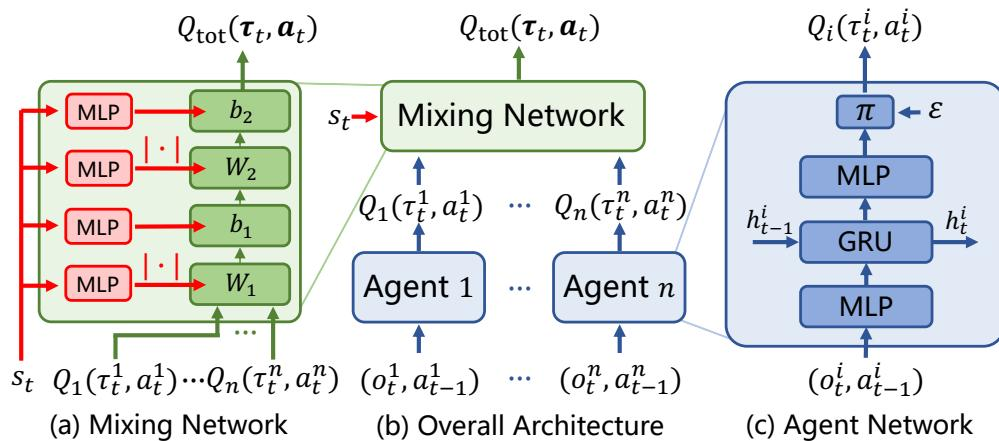

While CTDE-based multi-agent policy gradient methods show promising performance in some application scenarios, and methods based on athe attention mechanisms, such as MAAC [93], can alleviate the curse of dimensionality to some extent, and methods based on counterfactual baselines can address the credit assignment problem to a certain extent. However, in complex cooperative scenarios, such as micro-management in StarCraft [33], these methods are often inefficient. On the contrary, MARL methods based on value decomposition have shown better performance [94]. In the following discussion, we will change the input of the value function from observation  $o_t^i$  to trajectory  $\tau_t^i = (o_1, a_1, \dots, a_{t-1}, o_t) \in \mathcal{T}^i$ , thus partially alleviating the problems caused by partial observability. It is worth noting that this technique can also be used in policy-gradient-based methods mentioned above to improve coordination performance. Most value decomposition methods are based on the Individual-Global-Max (IGM) principle [83].

**Theorem 2** (Individual-Global-Max Principlple). *For a joint action value function  $Q_{\text{tot}} : \mathcal{T} \times \mathcal{A}$  and local individual action value functions  $\{Q_i : \mathcal{T}^i \times \mathcal{A}^i \rightarrow \mathbb{R}\}_{i=1}^n$ , if the following equation holds:*

$$\arg \max_{\mathbf{a}} Q_{\text{tot}}(\boldsymbol{\tau}, \mathbf{a}) = \begin{pmatrix} \arg \max_{a^1} Q_1(\tau^1, a^1) \\ \vdots \\ \arg \max_{a^n} Q_n(\tau^n, a^n) \end{pmatrix},$$

Three typical value decomposition methods that satisfy the IGM principle are as follows. VDN [\[30\]](#page-36-16) represents the

$$Q_{\text{tot}}^{\text{VDN}}(\boldsymbol{\tau}, \mathbf{a}) = \sum_{i=1}^n Q_i(\boldsymbol{\tau}^i, a^i). \quad (17)$$

Although this value decomposition method satisfies IGM, its network expressiveness is often insufficient and it performs poorly in complex scenarios. QMIX [\[31\]](#page-36-17) (see Figure [9\)](#page-15-0) extends VDN by introducing a mixing network that combines the Q values of each agent with the global state to calculate the global utility and perform credit assignment. To ensure IGM, the mixing network takes the individual Q values and the state as inputs, calculates the global Q value,

$$Q_{\text{tot}}^{\text{QMIX}}(\boldsymbol{\tau}, \mathbf{a}) = \text{Mixing}(s, Q_1(\tau^1, a^1), \dots, Q_n(\tau^n, a^n)),$$

$$\forall i \in \mathcal{N}, \frac{\partial Q_{\text{tot}}^{\text{QMIX}}(\boldsymbol{\tau}, \mathbf{a})}{\partial Q_i(\tau^i, a^i)} \geq 0. \quad (18)$$

During optimization, the temporal difference loss is computed for optimization:

$$\mathcal{L}_{\text{QMIX}} = (Q_{\text{tot}}^{\text{QMIX}}(\boldsymbol{\tau}, \mathbf{a}) - y_{\text{tot}})^2, \quad (19)$$

where  $y_{\text{tot}} = r + \gamma \max_{\mathbf{a}'} Q_{\text{tot}}^{\text{QMIX},-}(\boldsymbol{\tau}', \mathbf{a}')$  and  $Q_{\text{tot}}^{\text{QMIX},-}$  is the target Q network. Based on the expressiveness and simplicity of the mixing network, QMIX achieves superior results in various environments, and its pseudocode is shown in Algorithm 2.

### Algorithm 2 QMIX Algorithm

1. 1: Initialize network parameters  $\theta$ , including the mixing network, local neural networks for agents, and a hypernetwork.
2. 2: Set learning rate  $\alpha$ , clear experience replay buffer  $D = \{\}$ ,  $t = 0$
3. 3: **while** training not finished **do**
4. 4:     Set step = 0,  $s_0$  as the initial state
5. 5:     **while**  $s_t$  not in terminal state and step is less than the maximum trajectory length **do**
6. 6:         **for** each agent  $i$  **do**
7. 7:              $\tau_t^i = \tau_{t-1}^i \cup \{(o_t^i, a_{t-1}^i)\}$
8. 8:              $\epsilon = \text{epsilon\_schedule}(t)$
9. 9:              $a_t^i = \begin{cases} \arg \max_{a_t^i} Q(\tau_t^i, a_t^i) & \text{with probability } 1 - \epsilon \\ \text{Randint}(1, |\mathcal{A}^i|) & \text{with probability } \epsilon \end{cases}$
10. 10:     **end for**
11. 11:     Obtain reward function  $r_t$  and the next state  $s_t$
12. 12:     Let  $D = D \cup \{(s_t, \mathbf{a}_t, r_t, s_{t+1})\}$
13. 13:      $t = t + 1$ , step = step + 1
14. 14:    **end while**
15. 15:    **if**  $|D| \geq \text{batch\_size}$  **then**
16. 16:          $b \leftarrow \text{randomly}$  sample from  $D$
17. 17:         **for** each time point  $t$  in each trajectory of  $b$  **do**
18. 18:             Compute  $Q_{\text{tot}}^{\text{QMIX}}$  and  $y_{\text{tot}}^{\text{QMIX}}$  through Equation 18
19. 19:         **end for**
20. 20:         Compute  $\mathcal{L}_{\text{QMIX}}$  through Equation 19 for optimization.
21. 21:    **end if**
22. 22:    **if** update time exceeds the designed threshold **then**
23. 23:         Update target networks
24. 24:    **end if**
25. 25: **end while**

The conditions satisfied by VDN and QMIX are sufficient but unnecessary conditions for the IGM property, leading to some shortcomings in their expressiveness. To further enhance the expressiveness of neural networks, QPLEX [95] proposed a new Duplex Dueling Multi-agent (DDMA) structure:

$$Q_{\text{tot}}^{\text{QPLEX}}(\boldsymbol{\tau}, \mathbf{a}) = V_{\text{tot}}(\boldsymbol{\tau}) + A_{\text{tot}}(\boldsymbol{\tau}, \mathbf{a}) = \sum_{i=1}^n Q_i(\boldsymbol{\tau}, a^i) + \sum_{i=1}^n (\lambda^i(\boldsymbol{\tau}, \mathbf{a}) - 1) A_i(\boldsymbol{\tau}, a^i). \quad (20)$$

Here,  $\lambda^i(\boldsymbol{\tau}, \boldsymbol{a})$  is computed using a multi-head attention mechanism [96], obtaining the credit assignment for different advantage functions. QPLEX, with its expressiveness and network structure, achieves superior results in various environments.

# 3.2.3 Integrating Policy Gradient and Value Decomposition in Cooperative MARL

In additition to the aforementioned methods based on policy gradient and value decomposition, some works combine the advantages of both to develop algorithms. One such algorithm is Decomposed Off-policy multi-agent Policy gradients (DOP) [97] (as shown in Figure 10), which introduces the idea of value decomposition into the multi-agent actor-critic framework and learns a centralized but decomposed critic. This framework decomposes the centralized critic into a weighted linear sum of individual critics with local actions as inputs. This decomposition structure not only achieves scalable learning of critics but also brings several benefits. It realizes feasible off-policy evaluation for stochastic policies, alleviates the centralized-decentralized inconsistency problem, and implicitly learns efficient multi-agent

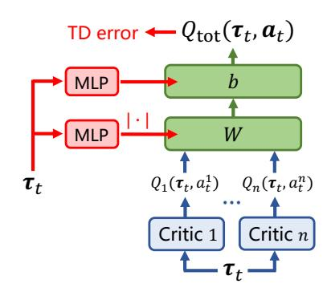

Figure 10: Framework of DOP.

reward allocation. Based on this decomposition, DOP develops efficient off-policy multi-agent decomposed policy gradient methods for both discrete and continuous action spaces.

DOP's specific contributions include: (1) To address the credit assignment problem in MASs and the scalability problem of learning a centralized critic, DOP uses linear value function decomposition to learn a centralized critic, enabling local policy gradients to be derived for each agent based on individual value functions. (2) DOP proposes offpolicy MARL algorithms for both stochastic policy gradients and deterministic policy gradients, effectively handling tasks with discrete and continuous action spaces, respectively. (3) Considering the sample efficiency issue of policy gradient algorithms, DOP combines linear value function decomposition with tree-backup techniques, proposing an efficient off-policy critic learning method to improve the sample efficiency of policy learning. In addition to DOP, other work combines the advantages of value decomposition and policy gradient from different perspectives. VDAC [\[98\]](#page-40-2) directly integrated policy gradient-like methods with value decomposition methods, proposing methods based on linear summation and mixed neural networks. IAC [\[99\]](#page-40-3), based on MAAC, further optimizes the credit assignment between agents through value decomposition methods, achieving surprising coordination performance in various environments. FACMAC [\[100\]](#page-40-4) proposed a decomposable joint policy gradient multi-agent algorithm and proposes the continuous environment multi-agent testing environment MAMuJoCo, FOP [\[101\]](#page-40-5) designed a value decomposition and gradient decomposition method based on maximum entropy, RIIT [\[102\]](#page-40-6) integrated some common techniques in current MARL into the coordination algorithms and proposes a new open-source algorithm framework PyMARL2 [†](#page-17-1) .

# 3.3 Cooperative Multi-Agent Reinforcement Learning in Classical Environments

In addition to methods aimed at improving cooperative capabilities discussed in the previous section, researchers have explored cooperative MARL from various perspectives, including efficient exploration, communication, and more. The core content, representative algorithms, and applications or achievements in various research directions in classical environments are summarized in Table [1.](#page-18-0)

# 3.3.1 Cooperative Multi-Agent Exploration

RL methods strive to efficiently learn optimal policies, where high-quality training samples are crucial, and exploration plays a key role during the sampling process, constituting a vital aspect of RL [\[150\]](#page-42-0). Similar to exploration techniques widely used in single-agent scenarios, exploration in cooperative MARL has garnered attention. Initial algorithms like QMIX and MADDPG, designed for multi-agent tasks, lacked specific exploration policies and underperformed in certain complex scenarios. Subsequent works aim at addressing multi-agent exploration challenges. MAVEN [\[104\]](#page-40-7) introduced a latent variable to maximize mutual information between this variable and generated trajectories, addressing the exploration limitations of value decomposition methods like QMIX. EITI and EDTI [\[105\]](#page-40-8) proposed cooperative exploration methods by considering interactions among agents, demonstrating improved coordination in various environments. CMAE [\[107\]](#page-40-9) uses constrained space selection to encourage exploration in regions with higher value, enhancing cooperative efficiency. EMC [\[106\]](#page-40-10) extends single-agent, motion-based exploration methods to the multi-agent domain and proposes episodic-memory-based approaches to store high-value trajectories for exploration facilitation. Uneven [\[108\]](#page-40-11) improves exploration efficiency by simultaneously learning multiple task sets, obtaining a multi-agent generalization feature to address relative overgeneralization in multi-agent scenarios. SMMAE [\[109\]](#page-40-12) balances individual and team exploration to enhance coordination efficiency, achieving satisfactory results in com-

† https://github.com/hijkzzz/pymarl2

| Research Direction         | Core Content                                                                                                                                                                                                 | Representative Algorithms                                                                 | Applications and Achievements                                                                                                                                                                                                                 |
|----------------------------|--------------------------------------------------------------------------------------------------------------------------------------------------------------------------------------------------------------|-------------------------------------------------------------------------------------------|-----------------------------------------------------------------------------------------------------------------------------------------------------------------------------------------------------------------------------------------------|
| Algorithm Framework Design | Utilize multi-agent coordination theories or design neural networks to enhance coordination                                                                                                                  | VDN [30], QMIX [31], QPLEX [95], MADDPG [28], MAPPO [29], HAPPO [103], DOP [97], MAT [32] | Demonstrated significant cooperative potential in various tasks such as SMAC [33], GRF [32], showcasing good coordination effects                                                                                                             |
| Cooperative Exploration    | Design mechanisms for efficient exploration of the environment to obtain optimal coordination patterns. Simultaneously, collect efficient trajectory experiences to train policies to find optimal solutions | MAVEN [104], EITI(EDTI) [105], EMC [106], CMAE [107], Uneven [108], SMMAE [109]           | Significant improvement in cooperative performance in complex task scenarios, addressing low coordination ability in sparse reward scenarios                                                                                                  |
| Multi-Agent Communication  | Design methods to promote information sharing between agents, addressing issues such as partial observability. Focus on when and with which teammate(s) to exchange what type of information                 | DIAL [110], VBC [111], I2C [112], TarMAC [113], MAIC [114], MASIA [115]                   | Effectively enhances cooperative capabilities in scenarios with partial observability or requiring strong coordination                                                                                                                        |
| Agent Modeling             | Develop technologies to endow agents with the ability to infer the actions, goals, and beliefs of other agents in the environment, promoting the improvement of cooperative system capabilities              | ToMnet [116], OMDDPG [117], LIAM [118], LILI [119], MBOM [120], MACC [121]                | Significant improvement in cooperative performance in scenarios with environmental non-stationarity due to the presence of other agents, improvement in performance in scenarios with strong interaction and the need for strong coordination |
| Policy Imitation           | Agents learn cooperative policies from given trajectories or example samples to accomplish tasks                                                                                                             | MAGAIL [122], MA-AIRL [123], CoDAIL [124], DM 2 [125]                          | Achievement of policy learning solely from example data                                                                                                                                                                                       |
| Model-Based MARL           | Learn a world model from data; agents learn from the learned model to avoid direct interaction with the environment, improving sample efficiency                                                             | MAMBPO [126], AORPO [127], MBVD [128], MAMBA [129], VDFD [130]                            | Significant improvement in sample utilization efficiency and cooperative effectiveness in complex scenarios with the help of successful model learning methods or the development of methods tailored for MASs                                |

Table 2: Research directions in cooperative multi-agent reinforcement learning in classical environments (continued).

| Research Direction             | Core Content                                                                                                                                                 | Representative Algorithms                                             | Applications and Achievements                                                                                                                                      |
|--------------------------------|--------------------------------------------------------------------------------------------------------------------------------------------------------------|-----------------------------------------------------------------------|--------------------------------------------------------------------------------------------------------------------------------------------------------------------|
| Action Hierarchical Learning   | Decompose complexes problems into multiple sub-problems, solve each sub-problem separately, and then solve the original complex problem                      | FHM [131], HSD [132], RODE [133], ALMA [134], HAVEN [135], ODIS [34]  | Significant improvement in the coordination efficiency of MASs in various task scenarios                                                                           |
| Topological Structure Learning | Model interaction relationships between multiple agents, using coordination graphs, and other means to describe the interaction relationships between agents | CG [136], DCG [137], DICG [138], MAGIC [139], ATOC [140], CASEC [141] | Implicit or explicit representation of the relationships between agents; can reduce the joint action space in complex scenarios, improving cooperative performance |
| Other Aspects                  | Research on interpretability, theoretical analysis, social dilemmas, large-scale scenarios, delayed rewards, etc.                                            | Na2q [142], ACE [143], CM3 [144], MAHHQN [145], references [146–149]  | Further comprehensive research on cooperative MARL                                                                                                                 |

plex tasks. Recently developed ADER [\[151\]](#page-42-14) focused on studying the balance between exploration and exploitation in cooperative multi-agent tasks.

Additionally, various methods have explored multi-agent exploration from different perspectives, such as intrinsic reward exploration [\[152\]](#page-42-15), decentralized multi-agent exploration in distributed scenarios [\[153,](#page-42-16) [154\]](#page-42-17), information-based exploration methods [\[155\]](#page-43-0), cooperative exploration under unknown initial conditions [\[156\]](#page-43-1), exploration problems in multi-agent multi-armed bandit settings [\[157\]](#page-43-2), exploration-exploitation balance in competitive multi-agent scenarios [\[158\]](#page-43-3), structure-based exploration methods [\[159\]](#page-43-4), optimistic exploration [\[160\]](#page-43-5), and exploration in reward-sparse scenarios [\[161\]](#page-43-6). While these methods have shown promising results in diverse testing environments, developing test environments tailored for various exploration algorithms and proposing comprehensive theories for multi-agent exploration remain worthwhile areas for future research.

# 3.3.2 Multi-Agent Communication

Communication plays a crucial role in MASs, enabling agents to share experiences, intentions, observations, and other vital information based on communication technology (Figure [11](#page-20-0) [\[20\]](#page-36-6)). Three factors typically characterize multiagent communication: when, with which agents, and what type of information is exchanged. Early research focused on integrating communication with existing MARL to improve coordination efficiency. DIAL [\[110\]](#page-40-14) introduced a simple communication mechanism where agents broadcast information to all teammates, facilitating end-to-end RL training. CommNet [\[162\]](#page-43-7) proposed an efficient centralized communication structure where hidden layer outputs of all agents are collected and averaged to enhance local observations. VBC [\[111\]](#page-40-15) adds a variance-based regularizer to eliminate noise components in information, achieving lower communication overhead and better performance than other methods. IC3Net [\[163\]](#page-43-8), Gated-ACML [\[164\]](#page-43-9), and I2C [\[112\]](#page-40-16) learn gating mechanisms to decide when and with which teammates to communicate, reducing information redundancy. SMS [\[165\]](#page-43-10) models multi-agent communication as a cooperative game, evaluating the importance of each message for decision-making and trimming channels with no positive gain. MASIA [\[115\]](#page-41-0) introduced the concept of information aggregation, extracting information effectively for decision-making at the information receiver. Additionally, it designed an open-source offline communication dataset, demonstrating the efficiency and rationality of the proposed communication structure in various experiments.

Some works have focused on determining the content of communication. TarMAC [\[113\]](#page-40-17) generate information by appending signatures, and the receiver use attention mechanisms to calculate the similarity between its local observation and the information signatures from different teammates. DAACMP [\[166\]](#page-43-11), based on the MADDPG [\[28\]](#page-36-14) framework, introduced a dual attention mechanism, showing that attention improves the coordination performance of MASs. NDQ [\[167\]](#page-43-12) uses information-theoretic regularization to design two different information-theoretic regu-

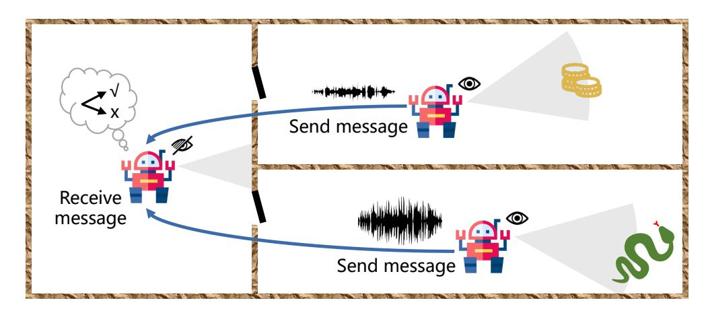

Figure 11: Cooperative Multi-Agent Communication.

larization terms for optimizing the value function, achieving good coordination performance in locally observable scenarios. TMC [168] applied smoothing and action selection regularizers for concise and robust communication, adding received information as an incentive to individual value functions. MAIC [114] designed a decentralized incentive communication based on teammate modeling, demonstrating excellent communication efficiency in various task scenarios. Recent works, including CroMAC [169], AME [170],  $\mathcal{R}$ -MACRL [49], and MA3C [171] focus on communication policy robustness during deployment, addressing potential communication interference issues. While existing methods have demonstrated effectiveness in various task scenarios, the natural gap between multi-agent environments and human society poses challenges. Exploring ways to bridge this gap through technologies like large language models [172], promoting human-AI interaction, and conducting interpretable research on communication content are promising areas for future study.

### 3.3.3 Cooperative Multi-Agent Reinforcement Learning with Agent Modeling

Endowing agents with the ability to infer actions, goals, and beliefs of other agents in the environment is a key focus in MARL, particularly in cooperative tasks [\[59\]](#page-38-3). Effective and accurate modeling techniques enable agents to collaborate efficiently (Figure [12\)](#page-21-0). One direct approach is employing Theory of Mind (ToM) from psychology, where ToMnet [\[116\]](#page-41-1), and subsequent works like ToM2C [\[173\]](#page-43-18), CTH [\[174\]](#page-43-19), and [\[175\]](#page-44-0), incorporate psychological theories into multi-agent tasks, enhancing teammate modeling and improving coordination capabilities. More details and development of ToM can be seen in [\[176\]](#page-44-1).

Alternatively, some works employ different techniques to model other teammates. OMDDPG [\[117\]](#page-41-2) uses Variational Autoencoders (VAEs) to infer the behavior of other agents based on local information. LIAM [\[118\]](#page-41-3) extended this technique to locally observable conditions, developing an efficient teammate modeling technique. LINDA [\[177\]](#page-44-2) mitigates local observability issues by considering perceived teammate information, assisting in enhancing MAS coordination across diverse tasks. MACC [\[121\]](#page-41-6) uses local information learning for subtask representation to augment individual policies. MAIC [\[114\]](#page-40-18) introduced a communication-based method for teammate modeling, extracting crucial information for efficient decision-making. LILI [\[119\]](#page-41-4) considered agent modeling in robotic scenarios and developed algorithms based on high-level policy representation learning to promote coordination. SILI [\[178\]](#page-44-3) further considered learning a smooth representation to model other agents based on LILI. Literature [\[179\]](#page-44-4) empowered robots to understand their own behaviors and develop technologies to better assist humans in achieving rapid value alignment.

In addition to the modeling techniques mentioned above, SOM [\[180\]](#page-44-5) enables agents to learn how to predict the behaviors of teammates by using their own policies, and update their unknown target beliefs about other teammates online accordingly. MBOM [\[120\]](#page-41-5) developed adversary modeling techniques based on model learning. [\[181\]](#page-44-6) takes modeling the behavior of other agents as an additional objective when optimizing the policy. DPIQN and DRPIQN [\[182\]](#page-44-7) considered modeling multi-agent task scenarios with policy changes and propose using a policy feature optimizer to optimize policy learning. ATT-MADDPG [\[183\]](#page-44-8) obtains a joint teammate representation to evaluate teammate policies and promote multi-agent coordination via attention based MADDPG [\[184\]](#page-44-9). Literature [\[185\]](#page-44-10) and subsequent work considered solving the cyclic inference problem in teammate modeling through techniques such as probability inference. Literature [\[186\]](#page-44-11) proposed TeamReg and CoachReg to evaluate the action choices of the team and achieve better coordination. The aforementioned works have shown good coordination performance in various task scenarios. However, in these works, agents need to model other agents or entities in the environment. When dealing with large-scale

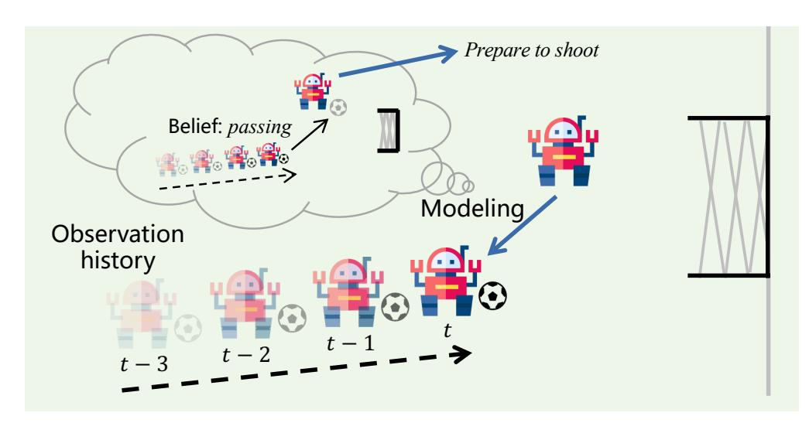

Figure 12: MARL with Agent Modeling.

agent systems or a large number of entities, using above methods will greatly increase computational complexity. Developing technologies such as distributed grouping to improve computational efficiency is one of the future research directions and valuable topics.

# 3.3.4 Multi-Agent Policy Imitation

Imitation Learning (IL) [\[187\]](#page-44-12) offers a method for agents to make intelligent decisions by mimicking human experts. In multi-agent scenarios, IL has advanced significantly. For example, [\[188\]](#page-44-13) proposed to learn a probabilistic cooperative model in latent space from demonstration data. [\[189\]](#page-44-14) extended this by using a hierarchical structure for high-level intention modeling. [\[190\]](#page-44-15) employed a connection structure [\[191\]](#page-44-16) to explicitly model coordination relationships. Multiagent Inverse RL (IRL) has also been explored, with MAGAIL [\[122\]](#page-41-7) extending adversarial generative techniques to MASs. MA-AIRL [\[123\]](#page-41-8) developed a scalable algorithm for high-dimensional state spaces and unknown dynamic environments. [\[192\]](#page-44-17) learns a reward function based on the representation space to represent the behavior of agents. CoDAIL [\[124\]](#page-41-9) introduced a distributed adversarial imitation learning method based on correlated policies. DM2 [\[125\]](#page-41-10) recently presented a distributed multi-agent imitation learning method based on distribution matching. MIFQ [\[193\]](#page-44-18) studied a decomposed multi-agent IRL method, demonstrating excellent performance in various scenarios.

Other research have explored multi-agent imitation learning from different perspectives, including applications in imitatiing driving [\[194\]](#page-44-19), policy research in multi-agent IRL [\[195\]](#page-44-20), multi-agent IRL without demonstration data [\[196\]](#page-45-0), application to mean field game problems [\[197\]](#page-45-1), design for mulit-agent systems in distributed constrained IRL [\[198\]](#page-45-2), and asynchronous multi-agent imitation learning [\[199\]](#page-45-3). Despite progress in various aspects, there's a need for research exploring large-scale scenarios, handling heterogeneous or suboptimal demonstration data, and applying multi-agent imitation learning to real-world scenarios like autonomous driving. Investigating these aspects and fostering coordination between AI and domain experts can drive significant advancements in multi-agent policy imitation.

# 3.3.5 Model-Based Cooperative MARL

Reinforcement learning, due to its need for continual interaction with the environment for policy optimization, often employs model-free algorithms, where agents use samples from interaction with the environment. However, these algorithms frequently suffer from low sample efficiency. Model-based RL, considered to have higher sample efficiency, typically involves learning the environment's state transition function (often including the reward function), i.e., the world model. Subsequently, policy optimization is conducted based on the knowledge derived from the world model [\[67,](#page-38-11) [200\]](#page-45-4), leading to a significant improvement in sample efficiency.

In recent years, model-based MARL has garnered attention and made progress [\[35\]](#page-37-3). Early efforts extended successful techniques in single-agent scenarios to multi-agent settings. For instance, MAMBPO [\[126\]](#page-41-11) extended the MBPO method [\[201\]](#page-45-5) to multi-agent tasks, constructing a model-based RL system based on the CTDE paradigm and a world model. This approach moderately enhances the system's sampling efficiency. CTRL [\[202\]](#page-45-6) and AORPO [\[127\]](#page-41-12) further introduced opponent modeling techniques into model learning to acquire adaptive trajectory data, augmenting the original data. MARCO [\[203\]](#page-45-7) learns a multi-agent world model and employs it to learn a centralized exploration policy to collect more data in high uncertainty areas, enhancing multi-agent policy learning. Some techniques extend widely used single-agent methods, such as Dreamer [\[204\]](#page-45-8), to multi-agent tasks. MBVD [\[128\]](#page-41-13) learns an implicit world model based on value decomposition, enabling agents to evaluate state values in latent space, providing them with foresight. MAMBA [\[129\]](#page-41-14) enhances centralized training in cooperative scenarios using model-based RL. The study discovers that algorithm optimization can be achieved during training through a world model and, during execution, a new corresponding world model can be established through communication. VDFD [\[130\]](#page-41-15) significantly improves the

sample efficiency of MARL by developing techniques that decouple the learning of the world model.

Additionally, researchers explore the learning of world models in MASs from various perspectives, such as collision avoidance in distributed robot control [\[205\]](#page-45-9), safety and efficiency improvement [\[206\]](#page-45-10), agent interaction modeling [\[207\]](#page-45-11), optimization of distributed network systems [\[208\]](#page-45-12), model-based opponent modeling [\[120\]](#page-41-5), efficiency improvement in multi-agent communication through model-based learning [\[209](#page-45-13)[–211\]](#page-45-14), model-based mean-field MARL [\[212\]](#page-45-15), efficient multi-agent model learning [\[213\]](#page-45-16), improving the learning efficiency of offline MARL through model learning [\[214\]](#page-45-17), and applications of model-based MARL [\[215\]](#page-45-18). Although some of these methods have achieved certain results, the challenges posed by the curse of dimensionality with the increasing number of agents and the partial observability introduced by decentralized execution often hinder the development of model-based MARL algorithms. Exploring efficient methods tailored to the characteristics of MASs, such as subset selection [\[216\]](#page-45-19), is an essential

research direction.

3.3.6 Multi-Agent Hierarchical Reinforcement Learning and Skill Learning

Reinforcement learning faces the challenge of the curse of dimensionality in complex scenarios. To address this issue, researchers have proposed hierarchical RL (HRL) [\[217\]](#page-46-0). The primary goal of HRL is to decompose complex problems into smaller ones, solve each subproblem independently, and thus achieve the overall goal. In recent years, there have been advancements in multi-agent hierarchical RL [\[218\]](#page-46-1). FHM [\[131\]](#page-41-16) introduced a feudal lord structure into the process of MARL. This method is designed for scenarios where agents have different task objectives but may not be suitable for cooperative tasks with shared objectives. To address the sparse and delayed reward issues in multi-agent tasks, [\[219\]](#page-46-2) proposed a hierarchical version of the QMIX algorithm and a hierarchical communication structure. This method achieves excellent cooperation performance in various task scenarios but requires manual design of high-level actions. HSD [\[132\]](#page-41-17) generates corresponding skills through an high-level macro policy, and this method is mainly trained through supervised learning. RODE [\[133\]](#page-41-18) learns action representations and selects actions hierarchically to enhance cooperation performance in various scenarios. VAST [\[220\]](#page-46-3) addresses the efficiency issues in large-scale multi-agent cooperation tasks through a hierarchical approach. ALMA [\[134\]](#page-41-19) fully exploits the task structure in multiagent tasks and uses high-level subtask decomposition policies and lower-level agent execution policies. HAVEN [\[135\]](#page-42-1) introduces a bidirectional hierarchical structure for both inter-agent and intra-agent coordination to further improve

multi-agent cooperation efficiency.

Apart from the mentioned works, some skill-based approaches in SARL have made progress [\[221\]](#page-46-4) and have been applied to MARL. [\[222\]](#page-46-5) considered integrating skills into MASs to improve overall performance. HSL [\[223\]](#page-46-6) designs a method to extract heterogeneous and sufficiently diverse skills from various tasks for downstream task learning. ODIS [\[34\]](#page-37-2) focuses on extracting skills from offline datasets. MASD [\[224\]](#page-46-7) aims to discover skills beneficial for cooperation by maximizing the mutual information between the potential skill distribution and the combination of all agent states and skills. SPC [\[225\]](#page-46-8) focuses on the automatic curriculum learning process of skill populations in MARL. [\[226\]](#page-46-9) also explores learning to augment multi-agent skills. While these methods to some extent learn or use skills in MASs, the interpretability of the learned skills is currently lacking. Exploring ways to make the learned skills interpretable, such as bridging the gap between MASs and the human society through natural language [\[227\]](#page-46-10), is a

topic worth researching.

3.3.7 Cooperative Multi-Agent Reinforcement Learning Topology Structure Learning

The interaction among agents is a focal point in the study of multi-agent problems. A coordination graph is a method that explicitly characterizes the interaction between agents by decomposing the multi-agent value function into a graph representation [\[136,](#page-42-2) [228\]](#page-46-11). In recent years, this approach has been widely applied in cooperative MARL. In coordination graph-based MARL tasks, nodes generally represent agents, and edges (hyper-edges) represent connected relationships between agents, constructing a reward function on the joint observation action space. A coordination graph can represent a high-order form of value decomposition among multiple agents. Typically, Distributed Constraint Optimization (DCOP) algorithms [\[229\]](#page-46-12) are employed to find action selections that maximize the value. Agents can exchange information through connected edges over multiple rounds. DCG [\[137\]](#page-42-3) introduces some deep learning techniques into coordination graphs, expanding them into high-dimensional state-action spaces. In complex task scenarios, such as SMAC, DCG can relieve the relative overgeneralization issues among multiple agents. However, DCG mainly focuses on pre-training on static and dense topological structures, exhibiting poor scalability and requiring dense and inefficient communication methods in dynamic environments.

A core issue in coordination graph problems is how to learn a dynamic and sparse graph structure that satisfies agent action selection. Sparse cooperative Q-function learning [\[230\]](#page-46-13) attempts to learn sparse graph structures for value function learning. However, the graph structure learned by this method is static and requires substantial prior knowledge. Literature [\[231\]](#page-46-14) proposed learning a minimal dynamic graph set for each agent, but the computational complexity exponentially increases with the number of agent neighbors. Literature [\[232\]](#page-46-15) studies the expressiveness of some graph structures but mainly focuses on random topologies and stateless problems. Literature [\[141\]](#page-42-7) proposed a new coordination graph testing environment, MACO, and introduced the Context-Aware Sparse Deep Coordination Graphs algorithm (CASEC). This algorithm effectively reduces the reward function evaluation error introduced during the graph construction process by learning induced representations and performs well in multiple environments. Subsequent work also enhances coordination from multiple perspectives, such as developing nonlinear coordination graph structures [\[233\]](#page-46-16), self-organizing polynomial coordination graph structures [\[234\]](#page-46-17), and so on.

On the other hand, some methods use techniques such as attention mechanisms to find implicit graph structures among multiple agents by cutting unnecessary connection structures through attention mechanisms. For instance, ATOC [\[140\]](#page-42-6) learns the most essential communication structure through attention mechanisms. DICG [\[138\]](#page-42-4) learns implicit coordination graph structures through attention mechanisms. MAGIC [\[139\]](#page-42-5) improves the communication efficiency and teamwork of MASs through graph attention mechanisms. Although these methods can to some extent obtain or improve the interaction topology between agents, currently, these methods generally make progress only in scenarios with a small number of agents. The challenge of obtaining the optimal topology structure in large-scale and strongly interacting scenarios is a future research direction [\[235\]](#page-46-18).

### 3.3.8 Other Aspects

In addition to the extensively researched topics mentioned above, several other aspects are gradually being explored and uncovered in MARL. These include but are not limited to cooperative interpretability [\[142\]](#page-42-8), developing multiagent cooperation algorithms with decision-making order [\[32,](#page-37-0) [143,](#page-42-9) [236,](#page-46-19) [237\]](#page-46-20), theoretical analysis of multi-agent cooperation [\[22,](#page-36-8) [238,](#page-47-0) [239\]](#page-47-1), multi-agent multi-task (stage) cooperation learning [\[144\]](#page-42-10), social dilemma problems in MASs [\[240\]](#page-47-2), asynchronous multi-agent cooperation [\[241,](#page-47-3) [242\]](#page-47-4), large-scale multi-agent cooperation [\[243\]](#page-47-5), delayed reward in multi-agent cooperation [\[244\]](#page-47-6), multi-agent cooperation in mixed action spaces [\[145\]](#page-42-11), discovery of causal relationships in multi-agent cooperation [\[63\]](#page-38-7), curriculum learning in multi-agent cooperation [\[146\]](#page-42-12), research on teacherstudent relationships in cooperative MARL [\[147\]](#page-42-18), fairness in MASs [\[148\]](#page-42-19), and entity-based multi-agent cooperation [\[149\]](#page-42-13), among others.

# 3.4 Typical Benchmark Scenarios

While designing and researching algorithms, some works have developed a series of test environments to comprehensively evaluate algorithms from various aspects. Typical environments include the StarCraft Multi-Agent Challenge (SMAC) [\[33\]](#page-37-1) and its improved version SMACv2 [\[245\]](#page-47-7), SMAClite [\[246\]](#page-47-8), Multi-Agent Particle World (MPE) [\[28\]](#page-36-14), Multi-Agent MuJoCo (MAMuJoCo) [\[100\]](#page-40-4), Google Research Football (GRF) [\[247\]](#page-47-9), Large-scale Multi-Agent Environment (MAgent) [\[248\]](#page-47-10), Offline MARL Test Environment [\[249\]](#page-47-11), and Multi-Agent Taxi Environment TaxAI [\[250\]](#page-47-12), among others. Common multi-agent test environments and their characteristics are shown in Table [3.](#page-24-0) Moreover, for the convenience of future work, some researchers have integrated and open-sourced the current mainstream testing environments, including Pymarl [\[33\]](#page-37-1) [‡](#page-23-0) , EPyMARL [\[251\]](#page-47-13)[§](#page-23-1) , PettingZoo [\[252\]](#page-47-14)[¶](#page-23-2) , MARLlib [\[253\]](#page-47-15)[||](#page-23-3), and the environment from the 1st AI Agents Contest[\\*\\*](#page-23-4), among others.

# 3.5 Typical Application Scenarios

Meanwhile, cooperative MARL algorithms have been widely applied in various task scenarios, including gaming, industrial applications, robot control, cross-disciplinary applications, and military domains [\[17,](#page-36-18) [275–](#page-48-0)[278\]](#page-49-0).

Early multi-agent algorithms primarily focused on the gaming domain, optimizing policies using RL algorithms. AlphaStar [\[6\]](#page-35-5), based on RL and employing multi-agent learning algorithms like population training, demonstrated

https://github.com/oxwhirl/pymarl

§ https://github.com/uoe-agents/epymarl

https://github.com/Farama-Foundation/PettingZoo

||https://marllib.readthedocs.io/en/latest/index.html

\*\*http://www.jidiai.cn/environment

Table 3: Introduction to Typical Multi-Agent Testing Environments.

|                             |               | Scenario    | Observation            | Action                 | Typical  | Communication |                               |
|-----------------------------|---------------|-------------|------------------------|------------------------|----------|---------------|-------------------------------|
| Environment                 | Heterogeneous |             |                        |                        |          |               |                               |
|                             | Agents        | Type        | Space                  | Space                  | Number   | Capability    | Problem Domain                |
| Matrix Games [91]           |               |             |                        |                        |          |               |                               |
| (1998)                      | Yes           | Mixed       | Discrete               | Discrete               | 2        | No            | Matrix Games                  |
| MPE [28]                    |               |             |                        |                        |          |               |                               |
| (2017)                      | Yes           | Mixed       | Continuous             | Discrete               | 2-6      | Allowed       | Particle Games                |
| MACO [141]                  |               |             |                        |                        |          |               |                               |
| (2022)                      | No            | Mixed       | Discrete               | Discrete               | 5-15     | Allowed       | Particle Games                |
| GoBigger [254]              |               |             |                        |                        |          |               |                               |
| (2022)                      | No            | Mixed       | Continuous             | Continuous or Discrete | 4-24     | No            | Particle Games                |
| MAgent [248]                |               |             |                        |                        |          |               |                               |
| (2018)                      | Yes           | Mixed       | Continuous+Image       | Discrete               | 1000     | No            | Large-Scale                   |
|                             |               |             |                        |                        |          |               | Particle Confrontation        |
| MARLÖ [255]                 |               |             |                        |                        |          |               |                               |
| (2018)                      | No            | Mixed       | Continuous+Image       | Discrete               | 2-8      | No            | Adversarial Games             |
| DCA [243]                   |               |             |                        |                        |          |               |                               |
| (2022)                      | No            | Mixed       | Continuous             | Discrete               | 100-300  | No            | Adversarial Games             |
| Pommerman [256]             |               |             |                        |                        |          |               |                               |
| (2018)                      | No            | Mixed       | Discrete               | Discrete               | 4        | Yes           | Bomberman Game                |
| SMAC [33]                   |               |             |                        |                        |          |               |                               |
| (2019)                      | Yes           | Cooperative | Continuous             | Discrete               | 2-27     | No            | StarCraft Game                |
| Hanabi [257]                |               |             |                        |                        |          |               |                               |
| (2019)                      | No            | Cooperative | Discrete               | Discrete               | 2-5      | Yes           | Card Game                     |
| Overcooked [258]            |               |             |                        |                        |          |               |                               |
| (2019)                      | Yes           | Cooperative | Discrete               | Discrete               | 2        | No            | Cooking Game                  |
| Neural MMO [259]            |               |             |                        |                        |          |               |                               |
| (2019)                      | No            | Mixed       | Continuous             | Discrete               | 1-1024   | No            | Multiplayer Game              |
| Hide-and-Seek [260]         |               |             |                        |                        |          |               |                               |
| (2019)                      | Yes           | Mixed       | Continuous             | Discrete               | 2-6      | No            | Hide and Seek Game            |
| LBF [251]                   |               |             |                        |                        |          |               |                               |
| (2020)                      | No            | Cooperative | Discrete               | Discrete               | 2-4      | No            | Food Search Game              |
| Hallway [167]               |               |             |                        |                        |          |               |                               |
| (2020)                      | No            | Cooperative | Discrete               | Discrete               | 2        | Yes           | Communication                 |
|                             |               |             |                        |                        |          |               | Corridor Game                 |
| GRF [247]                   |               |             |                        |                        |          |               |                               |
| (2019)                      | No            | Cooperative | Continuous             | Discrete               | 1-3      | No            | Soccer Confrontation          |
| Fever Basketball [261]      |               |             |                        |                        |          |               |                               |
| (2020)                      | Yes           | Mixed       | Continuous             | Discrete               | 2-6      | No            | Basketball Confrontation      |
| SUMO [262]                  |               |             |                        |                        |          |               |                               |
| (2010)                      | No            | Mixed       | Continuous             | Discrete               | 2-6      | No            | Traffic Control               |
| Traffic Junction [162]      |               |             |                        |                        |          |               |                               |
| (2016)                      | No            | Cooperative | Discrete               | Discrete               | 2-10     | Yes           | Communication                 |
|                             |               |             |                        |                        |          |               | Traffic Scheduling            |
| CityFlow [263]              |               |             |                        |                        |          |               |                               |
| (2019)                      | No            | Cooperative | Continuous             | Discrete               | 1-50+    | No            | Traffic Control               |
| MAPF [264]                  |               |             |                        |                        |          |               |                               |
| (2019)                      | Yes           | Cooperative | Discrete               | Discrete               | 2-118    | No            | Path Navigation               |
| Flatland [265]              |               |             |                        |                        |          |               |                               |
| (2020)                      | No            | Cooperative | Continuous             | Discrete               | > 100    | No            | Train Scheduling              |
| SMARTS [266]                |               |             |                        |                        |          |               |                               |
| (2020)                      | Yes           | Mixed       | Continuous+Image       | Continuous or Discrete | 3-5      | No            | Autonomous Driving            |
| MetaDrive [267]             |               |             |                        |                        |          |               |                               |
| (2021)                      | No            | Mixed       | Continuous             | Continuous             | 20-40    | No            | Autonomous Driving            |
| MATE [268]                  |               |             |                        |                        |          |               |                               |
| (2022)                      | Yes           | Mixed       | Continuous             | Continuous or Discrete | 2-100+   | Yes           | Target Tracking               |
| MARBLER [269]               |               |             |                        |                        |          |               |                               |
| (2023)                      | Yes           | Mixed       | Continuous             | Discrete               | 4-6      | Allowed       | Traffic Control               |
| RWARE [251]                 |               |             |                        |                        |          |               |                               |
| (2020)                      | No            | Cooperative | Discrete               | Discrete               | 2-4      | No            | Warehouse Logistics           |
| MABIM [270]                 |               |             |                        |                        |          |               |                               |
| (2023)                      | No            | Mixed       | Continuous             | Continuous or Discrete | 500-2000 | No            | Inventory Management          |
| MaMo [27]                   |               |             |                        |                        |          |               |                               |
| (2022)                      | Yes           | Cooperative | Continuous             | Continuous             | 2-4      | No            | Parameter Tuning              |
| Active Voltage Control [26] |               |             |                        |                        |          |               |                               |
| (2021)                      | Yes           | Cooperative | Continuous             | Continuous             | 6-38     | No            | Power Control                 |
| MAMuJoCo [100] (2020)       | Yes           | Cooperative | Continuous             | Continuous             | 2-6      | No            | Robot Control                 |
| Light Aircraft Game [271]   |               |             |                        |                        |          |               |                               |
| (2022)                      | No            | Mixed       | Continuous             | Discrete               | 1-2      | No            | Intelligent Air Combat        |
| MaCa [272]                  |               |             |                        |                        |          |               |                               |
| (2020)                      | Yes           | Mixed       | Image                  | Discrete               | 2        | No            | Intelligent Air Combat        |
| Gathering [240]             |               |             |                        |                        |          |               |                               |
| (2020)                      | No            | Cooperative | Image                  | Discrete               | 2        | No            | Social Dilemma                |
| Harvest [273]               |               |             |                        |                        |          |               |                               |
| (2017)                      | No            | Mixed       | Image                  | Discrete               | 3-6      | No            | Social Dilemma                |
| Safe MAMuJoCo [274]         |               |             |                        |                        |          |               |                               |
| (2023)                      | Yes           | Cooperative | Continuous             | Continuous             | 2-8      | No            | Safe Multi-Agent              |
| Safe MARobosuite [274]      |               |             |                        |                        |          |               |                               |
| (2023)                      | Yes           | Cooperative | Continuous             | Continuous             | 2-8      | No            | Safe Multi-Agent              |
| Safe MAIG [274]             |               |             |                        |                        |          |               |                               |
| (2023)                      | Yes           | Cooperative | Continuous             | Continuous             | 2-12     | No            | Safe Multi-Agent              |
| OG-MARL [249]               |               |             |                        |                        |          |               |                               |
| (2023)                      | Yes           | Mixed       | Continuous             | Continuous or Discrete | 2-27     | No            | Offline Dataset               |
| MASIA [115]                 |               |             |                        |                        |          |               |                               |
| (2023)                      | Yes           | Cooperative | Discrete or Continuous | Discrete               | 2-11     | No            | Offline Communication Dataset |

remarkable performance in controlling in-game agents to defeat opponents in StarCraft [\[16,](#page-36-3) [279\]](#page-49-1). Subsequent works extended MARL algorithms to other gaming tasks. The ViVO team achieved effective adversarial results in controlling hero units in the game Honor of Kings using hierarchical RL in various scenarios [\[280\]](#page-49-2). Many test environments, including SMAC [\[33\]](#page-37-1), are developed based on game engines. Besides real-time games, MARL has also shown success in non-real-time games such as chess [\[281\]](#page-49-3), Chinese chess [\[282\]](#page-49-4), mahjong [\[283\]](#page-49-5), poker [\[284\]](#page-49-6), football [\[247\]](#page-47-9), basketball games [\[261,](#page-48-5) [285\]](#page-49-7), and hide-and-seek [\[260\]](#page-48-4).

On the other hand, researchers have explored applying MARL to industrial domains. Leveraging the significant potential of MARL in problem-solving, studies model industrial problems as MARL tasks. For example, in [\[286\]](#page-49-8), unmanned driving is modeled as a cooperative problem, promoting cooperation between unmanned vehicles using a coordination graph. The study found that automatic vehicle scheduling can be achieved in various task scenarios. Other related works use MARL to enhance traffic signal control [\[287\]](#page-49-9), unmanned driving [\[288\]](#page-49-10), drone control [\[289,](#page-49-11) [290\]](#page-49-12), and autonomous vehicle control [\[291\]](#page-49-13). Additionally, researchers have explored power-related applications, such as controlling the frequency of wind power generation using MARL algorithms [\[292\]](#page-49-14). Some works have delved into finance, applying MARL in various scenarios [\[293](#page-49-15)[–295\]](#page-50-0). Furthermore, MAAB [\[296\]](#page-50-1) designs an online automatic bidding framework based on MARL, addressing other issues [\[297\]](#page-50-2). In addition, some works synchronize clocks on FPGAs using MARL [\[298\]](#page-50-3), and in the context of virtual Taobao, MARL is applied for better capturing user preferences [\[299\]](#page-50-4). Some studies focus on controlling robots using MARL [\[300–](#page-50-5)[302\]](#page-50-6), such as [\[303\]](#page-50-7), applying cooperative MARL to cooperative assistance tasks in robot surgery, significantly improving task completion.

MARL is also applied in cross-disciplinary fields. For instance, MA-DAC [\[27\]](#page-36-13) models multi-parameter optimization problems as MARL tasks and solves them using cooperative MARL algorithms like QMIX, significantly enhancing the ability to optimize multiple parameters. MA2ML [\[304\]](#page-50-8) effectively addresses optimization learning problems in the connection of modules in automated machines using MARL. The study in [\[305\]](#page-50-9) enriches MARL under rich visual information and designs navigation tasks in a cooperative setting. Literature [\[306\]](#page-50-10) proposed a multi-camera cooperative system based on cooperative alignment to solve the active multi-target tracking problem. Literature [\[307\]](#page-50-11) modeled image data augmentation as a multi-agent problem, introducing a more fine-grained automatic data method by dividing an image into multiple grids and finding a jointly optimal enhancement policy. Additionally, many works focus on applying MARL algorithms to combinatorial optimization. Literature [\[308\]](#page-50-12) studies optimizing online parking allocation through MARL, literature [\[309\]](#page-50-13) focuses on lithium-ion battery scheduling using a MARL framework, literature [\[310\]](#page-50-14) leverages MARL to solve job scheduling problems in resource preemptive environments, and literature [\[311\]](#page-50-15) explores online scheduling problems in small-scale factories using MARL. MARLYC [\[312\]](#page-50-16) proposed a new method called MARL yaw control to suggest controlling the yaw of each turbine, ultimately increasing the total power generation of the farm. Cooperative MARL has also found applications in daily life, such as [\[313\]](#page-50-17), testing the acoustic effects in a room using two collaborating robots, and [\[314\]](#page-51-0), managing energy in daily home environments. Literature [\[315\]](#page-51-1) explores online intelligent education based on MARL. Some studies also attempt to apply multi-agent collaboration techniques to the medical field, such as using multi-agent collaboration for neuron segmentation [\[316\]](#page-51-2) or medical image segmentation [\[317\]](#page-51-3).

In addition to the applications mentioned earlier, MARL has also been explored in the field of national defense applications [\[318,](#page-51-4) [319, 319–](#page-51-5)[323\]](#page-51-6). The work in [\[324\]](#page-51-7) proposes an approach based on MADDPG and attention mechanisms capable of handling scenarios with variable teammates and opponents in multi-agent aerial combat tasks. In [\[325\]](#page-51-8), a hierarchical MARL (HMARL) approach is introduced to address the cooperative decision-making problem of heterogeneous drone swarms, specifically focusing on the Suppression of Enemy Air Defenses (SEAD) mission by decoupling it into two sub-problems: high-level target assignment (TA) and low-level cooperative attack (CA). The study in [\[326\]](#page-51-9) constructs a multi-drone cooperative aerial combat system based on MARL. Simulation results indicate that the proposed strategy learning method can achieve a significant energy advantage and effectively defeat various opponents. In [\[327\]](#page-51-10), a hierarchical MARL framework for air-to-air combat is proposed to handle scenarios involving multiple heterogeneous intelligent agents. MAHPG [\[328\]](#page-51-11) designs a strategy gradient MARL method based on selfplay adversarial training and hierarchical decision networks to enhance the aerial combat performance of the system, aiming to learn various strategies. Additionally, using hierarchical decision networks to handle complex mixed actions, the study in [\[329\]](#page-51-12) designs a mechanism based on a two-stage graph attention neural network to capture crucial interaction relationships between intelligent agents in intelligent aerial combat scenarios. Experiments demonstrate that this method significantly enhances the system's collaborative capabilities in large-scale aerial combat scenarios.

# 4 Cooperative Multi-agent Reinforcement Learning in Open Environments

The previous content mainly discussed in the context of classical closed environments, where the factors in the environment remain constant. However, research on machine learning algorithms in real environments often needs to address situations where certain factors may change. This characteristic has given rise to a new research area—openenvironment machine learning, including Open-world Learning [\[330\]](#page-51-13), Open-environment Learning [\[38\]](#page-37-6), Open-ended Learning [\[331\]](#page-51-14), Open-set Learning [\[332\]](#page-52-0), etc.

#### 4.1 Machine Learning in Open Environments

Traditional machine learning is generally discussed in classical closed environments, where important factors in the environment do not change. These factors can have different definitions and scopes in different research fields, such as new categories in supervised learning, new tasks in continual learning, changes in features in neural network inputs, shifts in the distribution of training (testing) data, and changes in learning objectives across tasks. Open-environment machine learning [\[38\]](#page-37-6), to some extent, is related to open-ended learning [\[331\]](#page-51-14). In contrast to machine learning in closed environments, open-environment machine learning primarily considers the possibility of changes in important factors in the machine learning environment [\[38\]](#page-37-6). Previous research in this area has explored category changes in supervised learning [\[37\]](#page-37-5), feature changes [\[333\]](#page-52-1), task changes in continual learning [\[64\]](#page-38-8), setting of open environments for testing [\[334\]](#page-52-2), and open research in game problems [\[335\]](#page-52-3), among others.

On the other hand, open-environment RL has gained attention and made progress in various aspects in recent years. Unlike supervised learning, where model is learned from labeled training data, or unsupervised learning, which analyzes inherent information in given data, RL places agents in unfamiliar environments. Agents must interact autonomously with the environment and learn from the results of these interactions. Different interaction methods generate different data, posing a key challenge in RL—learning from dynamic data distributions that, in turn, further alter the data distribution [\[1\]](#page-35-0). In addition, agents need to consider changes in the Markov Decision Process (MDP) of the environment. Some methods have attempted to learn a trustworthy RL policy [\[39\]](#page-37-7), learn a highly generalizable policy through methods like evolutionary learning [\[40\]](#page-37-8), learn skills for open environments [\[336\]](#page-52-4), enhance generalization ability by changing the reward function [\[337\]](#page-52-5), design testing environments for open RL [\[338\]](#page-52-6), design general open intelligent agents based on RL [\[339,](#page-52-7) [340\]](#page-52-8), study policy generalization in RL [\[42\]](#page-37-10), etc.

#### 4.2 Cooperative Multi-Agent Reinforcement Learning in Open Environments

The aforementioned content introduced some related works on SARL in open environments. Some studies have provided descriptions of MARL in open environments from specific perspectives. In open MASs, the composition and scale of the system may change over time due to agents joining or leaving during the coordination process [\[391\]](#page-54-0).

Classical MARL algorithms primarily address issues such as non-stationarity caused by teammate policy optimization during training and the exploration and discovery of effective coordination patterns. While these methods effectively improve sample efficiency and cooperative ability, they do not consider the problem of changes in real-world MASs and environmental factors. Taking the example of open MASs mentioned earlier, due to changes in teammate behavior styles, the intelligent agents generated by classical MARL algorithms make decisions based on historical information. They cannot promptly perceive changes in teammate behavior styles, leading to a certain lag in their adaptive capability, greatly impacting cooperative performance.

In previous works, research focused mainly on multi-agent planning in open situations, giving rise to many related problem settings, such as Open Decentralized Partially Observable Markov Decision Processes (Open Dec-POMDP) [\[392\]](#page-54-1), Team-POMDP [\[393,](#page-55-0) [394\]](#page-55-1), I-POMDP-Lite [\[371,](#page-54-2) [395\]](#page-55-2), and CI-POMDP [\[396\]](#page-55-3). Recently, some work has begun to consider the issue of open MARL. GPL [\[373\]](#page-54-3) formalizes the problem of Open Ad-hoc Teamwork as Open Stochastic Bayesian Games (OSBG), assuming global observability to improve efficiency. However, it is challenging to implement in the real world. Additionally, it uses a graph neural network-based method applicable only to single-controllable intelligent agent settings, making it challenging to extend to multiple controllable intelligent agents. Recent work [\[397\]](#page-55-4) proposes OASYS, an open MAS, to describe open MASs.

While the aforementioned works have delved into research on MARL in open environments from specific perspectives, their focus is relatively narrow, and there are certain limitations. There lacks a comprehensive overview of the entire research field. We believe that for a cooperative MAS to be applied to complex open real-world scenarios, it should possess the ability to cope with changes in environmental factors (states, actions, reward functions, etc.), changes in coordination modes (teammates, opponents), and the emergence of tasks in the form of data streams. This capability should mainly include the following aspects:

- During policy training and evolution, the system should have the ability for offline policy learning, policies with transfer and generalization capabilities, policies that support continual learning, and the system should possess evolution and adaptation capabilities.

Table 4: Research Directions in Multi-Agent Systems in Open Environments.

| Research Direction                        | Core Content                                                                                                                                                                                                                 | Representative Algorithms                                                             | Applications and Achievements                                                                                                                                                                        |
|-------------------------------------------|------------------------------------------------------------------------------------------------------------------------------------------------------------------------------------------------------------------------------|---------------------------------------------------------------------------------------|------------------------------------------------------------------------------------------------------------------------------------------------------------------------------------------------------|
| Offline MARL                              | Extending successful offline learning techniques from single-agent RL to multi-agent scenarios or designing multi-agent offline methods specifically                                                                         | ICQ [341], MABCQ [342], SIT [343], ODIS [34], MADT [344], OMAC [345], CFCQL [346]     | Learning policies from collected static offline data, avoiding issues arising from interaction with the environment, achieving learning objectives from large-scale and diverse data                 |
| Policy Transfer and Generalization        | Transferring and directly generalizing multi-agent policies across tasks to enable knowledge reuse                                                                                                                           | LeCTR [347], MAPTF [348], EPC [349], Literature [350], MATTAR [351]                   | Facilitating knowledge reuse across tasks, speeding up learning on new tasks                                                                                                                         |
| Continual Cooperation                     | Cooperative task learning when facing tasks or samples presented sequentially                                                                                                                                                | Literature [352], MACPro [353], Macop [354]                                           | Extending existing techniques from single-agent scenarios to handle cooperative task emergence in multi-agent settings                                                                               |
| Evolutionary MARL                         | Simulating heuristic stochastic optimization algorithms inspired by the natural evolution process, including genetic algorithms, evolutionary policies, particle swarm algorithms, etc., to empower multi-agent coordination | MERL [355], BEHT [356], MCAA [357], EPC [349], ROMANCE [358], MA3C [171]              | Simulating multi-agent policies through evolutionary algorithms or generating training partners or opponents to assist multi-agent policy training, widely applied in various project scenarios      |
| Robustness in MARL                        | Considering policy learning and execution when the system environment undergoes changes, learning robust policies to cope with environmental noise, teammate changes, etc.                                                   | R-MADDPG [47], Literature [46], RAMAO [359], ROMANCE [358], MA3C [169], CroMAC [171]  | Maintaining robust cooperative capabilities in conditions where states, observations, actions, and communication channels in the environment are subjected to noise or even malicious attacks        |
| Multi-Objective (Constrained) Cooperation | Optimizing problems with multiple objectives, simultaneously considering the optimal solutions of different objective functions                                                                                              | MACPO(MAPPO-Lagrangian) [274], CAMA [360], MDBC [361], Literature [206, 362, 363]     | Addressing multiple constraint objectives in the environment, making progress in constrained or safety-related domains, laying the foundation for practical applications of multi-agent coordination |
| Risk-Sensitive MARL                       | Modeling the numerical values (rewards) of variables in the environment as distributions using value distributions, using risk functions to assess system risks, etc.                                                        | DFAC [364], RMIX [365], ROE [160], DRE-MARL [366], DRIMA [367], Literature [368, 369] | Enhancing coordination performance in complex scenarios, effectively perceiving risks, and assessing performance in risk-sensitive scenarios                                                         |

Table 5: Research Directions in Multi-Agent Systems in Open Environments (Continued).

| Research Direction                | Core Content                                                                                                                                                                                          | Representative Algorithms                                                                                | Applications and Achievements                                                                                                                                                                                                        |
|-----------------------------------|-------------------------------------------------------------------------------------------------------------------------------------------------------------------------------------------------------|----------------------------------------------------------------------------------------------------------|--------------------------------------------------------------------------------------------------------------------------------------------------------------------------------------------------------------------------------------|
| Ad-hoc Teamwork                   | Creating a single autonomous agent capable of efficiently and robustly collaborating with unknown teammates in specific tasks or situations                                                           | Literature [370,371], ODITS [372], OSBG [373], BRDiv [374], L-BRDiv [375], TEAMSTER [376]                | Empowering a single autonomous agent with the ability to collaborate rapidly with unknown teammates, achieving quick coordination in temporary teams across various task scenarios                                                   |
| Zero (Few)-shot Coordination      | Designing training paradigms to enable MASs to collaborate with unseen teammates using few or zero interaction samples                                                                                | FCP [377], TrajeDi [378], MAZE [379], CSP [380], LIPO [381], HSP [382], Macop [353], Literature [52,383] | Current algorithms have shown effective zero-shot coordination or low-shot coordination with diverse unseen teammates in benchmark environments like Overcooked                                                                      |
| Human-AI Coordination             | Providing support for human-intelligence (huma-machine) interaction, enabling better coordination between human participants and agents to accomplish specific tasks                                  | FCP [377], Literature [384], HSP [382], Latent Offline RL [385], RILI [386], PECAN [387]                 | Achieving certain levels of coordination between human and machine in given simulation environments or real-world robot scenarios                                                                                                    |
| Cooperative Large Language Models | Developing large cooperative decision-making models using the concept of universal large language models, or leveraging current large language model technologies to enhance multi-agent coordination | MADT [344], MAT [32], MAGENTA [388], MADiff [389], ProAgent [231], SAMA [390]                            | For specific task scenarios, using large language model to impart language model to impart policies with a degree of generality; additionally, some works leverage large language models to promote system coordination capabilities |

- In the deployment process, policies should be able to handle changes in environmental factors, specifically demonstrating robust cooperative capabilities when states, observations, actions, environmental dynamic, and communication change in environments.
- In real-world deployment, considerations should include multi-objective (constraint) policy optimization, risk perception and assessment capabilities in the face of real, high-dynamic task scenarios.
- Trained policies, when deployed, should have self-organizing cooperative capabilities and should have zero (or few) shot adaptation capabilities. Furthermore, they should support human-intelligence coordination, endowing the MAS with the ability to serve humans.
- Finally, considering the differences and similarities in various multi-agent cooperative tasks, learning policy models for each type of task often incurs high costs and resource waste. Policies should have the capability o cover various multi-agent cooperative tasks, similar to ChatGPT.

Based on this, this section reviews and compares relevant works in these eleven aspects, presenting the main content and existing issues in current research, as well as future directions worthy of exploration.

# 4.2.1 Offline Cooperative Multi-Agent Reinforcement Learning

Offline reinforcement learning [\[398,](#page-55-5) [399\]](#page-55-6) has recently attracted considerable research attention, focusing on a datadriven training paradigm that does not require interaction with the environment [\[399\]](#page-55-6). Previous work [\[400\]](#page-55-7) primarily addressed distributional shift issues in offline learning, considering learning behavior-constrained policies to alleviate extrapolation errors in estimating unseen data [\[401](#page-55-8)[–403\]](#page-55-9). Offline MARL is a relatively new and promising research direction [\[404\]](#page-55-10), training cooperative policie's from static datasets. One class of offline MARL methods attempts to learn policies from offline data with policy constraints. ICQ [\[341\]](#page-52-9) effectively mitigated extrapolation errors in MARL by trusting only offline data. MABCQ [\[342\]](#page-52-10) introduced a fully distributed setting for offline MARL, utilizing techniques such as value bias and transfer normalization for efficient learning. OMAR [\[405\]](#page-55-11) combined first-order policy gradients and zero-order optimization methods to avoid discordant local optima. MADT [\[344\]](#page-52-12) harnessed the powerful sequential modeling capability of Transformers, seamlessly integrating it with offline and online MARL tasks. Literature [\[343\]](#page-52-11) investigated offline MARL, explicitly considering the diversity of agent trajectories and proposing a new framework called Shared Individual Trajectories (SIT). Literature [\[406\]](#page-55-12) proposes training a teacher policy with access to observations, actions, and rewards for each agent first. After determining and gathering "good" behaviors in the dataset, individual student policies are created and endowed with the structural relationships between the teacher policy's features and the agents through knowledge distillation. ODIS [\[34\]](#page-37-2) introduced a novel offline MARL algorithm for discovering cooperative skills from multi-task data. Literature [\[249\]](#page-47-11) recently released the Off-the-Grid MARL (OG-MARL) framework for generating offline MARL datasets and algorithm evaluation. M3 [\[407\]](#page-55-13) innovatively introduced the idea of multi-task and multi-agent offline pre-training modules to learn higher-level transferable policy representations. OMAC [\[345\]](#page-52-13) proposed an offline MARL algorithm based on coupled value decomposition, decomposing the global value function into local and shared components while maintaining credit assignment consistency between global state values and Q-value functions.

# 4.2.2 Cooperative Policy Transfer and Generalization

Transfer learning is considered a crucial method to improve the sample efficiency of RL algorithms [\[408\]](#page-55-14), aiming to reuse knowledge across different tasks, accelerating the policy learning of agents on new tasks. Transfer learning in multi-agent scenarios [\[60\]](#page-38-4) has also garnered extensive attention. In addition to considering knowledge reuse between tasks, some researchers focus on knowledge reuse among agents. The basic idea is to enable some agents to selectively reuse knowledge from other agents, thereby assisting the overall MAS in achieving better cooperation. DVM [\[409\]](#page-55-15) modeled the multi-agent problem as a multi-task learning problem, combining knowledge between different tasks and distilling this knowledge through a value-matching mechanism. LeCTR [\[347\]](#page-52-15) conducted policy teaching in multiagent scenarios, guiding some agents to guide others, thus facilitating better policy cooperation overall. MAPTF [\[348\]](#page-52-16) proposed an option-based policy transfer method to assist multi-agent cooperation.

On the other hand, methods for policy reuse among multi-agent tasks emphasize the reuse of knowledge and experience from old tasks to assist in the policy learning of new tasks, focusing on knowledge transfer between different tasks. Compared to single-agent problems, the dimensions of environmental state (observations) may vary in tasks with different scales of multi-agent tasks, posing challenges to policy transfer among tasks. Specifically, DyMA-CL [\[410\]](#page-55-16) designed a network structure independent of the number of agents and introduces a series of transfer mechanisms based on curriculum learning to accelerate the learning process of cooperative policies in multi-agent scenarios. EPC [\[349\]](#page-52-17) proposed an evolutionary algorithm-based multi-agent curriculum learning method to help groups achieve cooperative policy learning in complex scenarios. UPDeT [\[411\]](#page-55-17) and PIT [\[412\]](#page-56-0) leveraged the generalization of transformer networks to address the problem of changing environmental input dimensions, aiding efficient cooperation and knowledge transfer among agent groups. These related works on multi-agent transfer learning provide inspiration for knowledge transfer between tasks, but they do not explicitly consider the correlation between tasks and how to utilize task correlation for more efficient knowledge transfer remains an open research topic. MATTAR [\[351\]](#page-52-19) addressed the challenge of adapting cooperative policy models to new tasks and proposes a policy transfer method based on task relations. Literature [\[413\]](#page-56-1) considers using lateral transfer learning to promote MARL. Literature [\[350\]](#page-52-18) further focused on designing algorithms to enhance the generalization ability in MARL.

# 4.2.3 Multi-Agent Reinforcement Learning and Continual coordination

Continual learning, incremental learning and lifelong learning are related, assuming tasks or samples appear sequentially [414]. In recent years, continual RL [41,415] has received some attention. In this setting, the challenge for agents is to avoid catastrophic forgetting while transferring knowledge from old tasks to new ones (also known as the stability-plasticity dilemma [416]), while maintaining scalability to a large number of tasks. Researchers have proposed various methods to address these challenges. EWC [417] used weight regularization based on  $1/2$  distance to constrain the gap between current model parameters and those of previously learned models, requiring additional supervision to select specific Q-function heads and set exploration policies for different task scenarios. CLEAR [418] is a task-agnostic continual learning method that does not require task information during the continual learning process. It maintains a large experience replay buffer and addresses forgetting by sampling data from past tasks. Other methods such as HyperCRL [419] and [420] leveraged learned world models to enhance learning efficiency. To address scalability issues in scenarios with numerous tasks, LLIRL [421] decomposed the task s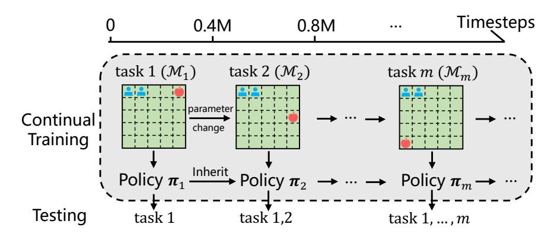

Figure 13: Illustration of continual coordination.

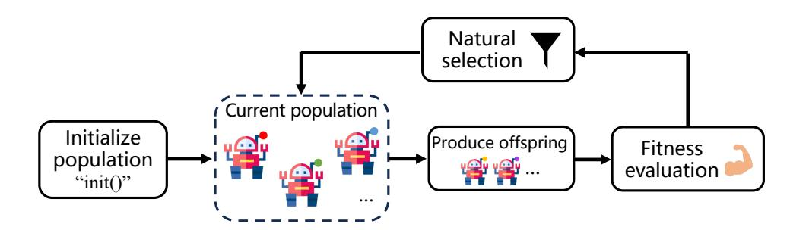

Figure 14: Illustration of Evolutionary Algorithms.

Chinese restaurant process to expand neural networks, making continual RL more efficient. OWL [\[422\]](#page-56-10) is a recent efficient method based on a multi-head architecture. CSP [\[423\]](#page-56-11) gradually constructed policy subspaces, training RL agents on a series of tasks. Another class of means to address scalability issues is based on the idea of Packnet [\[424\]](#page-56-12), sequentially encoding task information into neural networks and pruning network nodes for relevant tasks. Regarding the problem of continual learning in multi-agent settings (see Figure [13\)](#page-30-0), literature [\[352\]](#page-53-0) investigated whether agents can cooperate with unknown agents by introducing a multi-agent learning testbed based on Hanabi. However, it only considers single-modal task scenarios. MACPro [\[353\]](#page-53-1) proposed a method for achieving continual coordination among multiple agents through progressive task contextualization. It uses a shared feature extraction layer to obtain task features but employs independent policy output heads, each making decisions for tasks of specific categories. Macop [\[354\]](#page-53-2) endowed a MAS with continual coordination capabilities, developing an algorithm based on incompatible teammate evolution and high-compatibility multi-agent cooperative training paradigms. In various test environments where teammates switch within and between rounds, the proposed method can quickly capture teammate identities, demonstrating stronger adaptability and generalization capabilities compared to various comparative methods, even in unknown scenarios.

#### 4.2.4 Evolutionary Multi-Agent Reinforcement Learning

Evolutionary algorithms [425] constitute a class of heuristic stochastic optimization algorithms simulating the natural evolution process, including genetic algorithms, evolutionary policies, particle swarm algorithms, etc. (Figure 14) Despite numerous variants, the main idea remains consistent in solving problems. First, a population is initialized by generating several individuals as the initial population through random sampling. The remaining process can be abstracted into a loop of three main steps. Based on the current population, offspring individuals are generated using operators such as crossover and mutation; the fitness of offspring individuals is evaluated; according to the survival of the fittest principle, some individuals are eliminated, and the remaining individuals constitute the new generation. Previous research [216] revealed the rich potential of evolutionary algorithms in solving subset selection problems. Evolutionary algorithms have also found widespread applications in the multi-agent domain [426], such as  $\alpha$ -Rank [427] and many subsequent works that used evolutionary algorithms to optimize and evaluaIn the context of cooperative tasks, evolutionary algorithms play a significant role. Literature [\[428\]](#page-56-16) considered the distributed configuration problem in multi-agent robot systems, optimizing the system through a fuzzy system and evolutionary algorithm to enhance cooperative performance. MERL [\[355\]](#page-53-3) designed a layered training platform, addressing two objectives through two optimization processes. An evolutionary algorithm maximizes sparse team-based objectives by evolving the team population. Simultaneously, a gradient-based optimizer trains policies, maximizing rewards for specific individual agents. BEHT [\[356\]](#page-53-4) introduced high-quality diverse goals into MASs to solve heterogeneous problems, effectively enhancing system generalization. MCAA [\[357\]](#page-53-5) and some subsequent works [\[429,](#page-56-17) [430\]](#page-56-18) considered improving asymmetric MASs through evolutionary learning. EPC [\[349\]](#page-52-17) enhanced the generalization and transfer capabilities of MASs through population evolution. ROMANCE [\[358\]](#page-53-6) and MA3C [\[171\]](#page-43-16) used population evolution to generate adversarial attackers to assist in the training of cooperative MASs, obtaining robust policies.

### 4.2.5 Robust Cooperation in Multi-Agent Reinforcement Learning

The study of robustness in RL has garnered widespread attention in recent years and has made significant progress [\[431\]](#page-56-19). The focus of robustness research includes perturbations to various aspects of agents in RL, such as states, rewards, and actions. One category of methods introduces auxiliary adversarial attackers, achieving robustness through adversarial training alternating between the policy in use and the opponent system [\[432](#page-56-20)[–435\]](#page-57-0). Other methods enhance robustness by designing appropriate regularization terms in the loss function [\[436](#page-57-1)[–438\]](#page-57-2). In comparison to adversarial training, these methods effectively improve sample efficiency. However, these approaches lack certifiable robustness guarantees regarding the noise level and the robustness between policy execution. In response to this issue, several verifiable robustness methods have been derived [\[361,](#page-53-9) [439](#page-57-3)[–441\]](#page-57-4).

Currently, research on robustness in MARL has started to attract attention [\[45\]](#page-37-13). The main challenges lie in the additional considerations required for MASs compared to single-agent systems, including non-stationarity arising from complex interactions among agents [\[21\]](#page-36-7), trust allocation [\[22\]](#page-36-8), scalability [\[24\]](#page-36-10), etc. Early work aimed to investigate whether cooperative policies exhibit robustness. For instance, targeting a cooperation policy trained using the QMIX algorithm, literature [\[442\]](#page-57-5) trained an attacker against observations using RL. Subsequently, literature [\[45\]](#page-37-13) conducted a comprehensive robustness test on typical MARL algorithms such as QMIX and MAPPO in terms of rewards, states, and actions. The results further confirmed the vulnerability of MASs to attacks, emphasizing the necessity and urgency of research on robust MARL. Recent progress in enhancing robustness in MARL includes work focusing on learning robust cooperative policies to avoid overfitting to specific teammates [\[46\]](#page-37-14) and opponents [\[443\]](#page-57-6). Similar to robust SARL, R-MADDPG [\[47\]](#page-37-17) addressed the uncertainty of the MAS's model, establishing the concept of robust Nash equilibrium under model uncertainty and achieving optimal robustness in multiple environments. Addressing the issue of perturbed actions in some agents within MASs, literature [\[48\]](#page-37-18) introduces a heuristic rule and relevant equilibrium theory to learn a robust cooperative policy for MASs. The robustness of multi-agent communication has also received attention in recent years. Literature [\[444\]](#page-57-7) designed a filter based on Gaussian processes to extract valuable information from noisy communication. Literature [\[445\]](#page-57-8) studied the robustness of multi-agent communication systems at the neural network level. Literature [\[49\]](#page-37-15) modeled multi-agent communication as a two-player zero-sum game and applies PSRO technology to learn a robust communication policy. Works such as ARTS [\[446\]](#page-57-9) and RADAR [\[447\]](#page-57-10) considered the resilience of MASs and study the recovery capabilities of cooperative MARL tasks in the face of environmental changes.

Recently, addressing the challenge of cooperation robustness in dynamically changing environments, literature [\[358\]](#page-53-6) proposes the ROMANCE algorithm, an robust cooperation algorithm against evolutionary auxiliary adversarial attackers. Literature [\[169\]](#page-43-14) introduces the MA3C framework for adversarial robust multi-agent communication training through population adversarial training. Literature [\[171\]](#page-43-16) proposes the CroMAC method for verifiable robust communication with a multi-view information perspective. Research on perturbed multi-agent observations is discussed in literature [\[359\]](#page-53-7), and literature [\[448\]](#page-57-11) considers learning a robust policy against state attacks in MASs.

### 4.2.6 Multi-Objective (Constrained) Cooperative Multi-Agent Reinforcement Learning

Multi-objective optimization [\[449\]](#page-57-12) refers to the existence of multiple objective functions in an optimization problem, requiring simultaneous consideration of the optimal solutions for each objective. In multi-objective optimization problems, conflicts may arise between different objective functions, meaning that improving one objective function may lead to the deterioration of another. Therefore, a balance needs to be struck between different objective functions to find a compromise point, also known as the Pareto optimal solution set.

In RL, multi-objective optimization is frequently employed. For example, in multi-objective RL, agents need to learn Pareto optimal policies across multiple objectives [\[450](#page-57-13)[–453\]](#page-58-0). Similarly, in MARL, some works introduce multiobjective learning problems, generally modeled as Multiobjective MASs (MOMAS) [\[454\]](#page-58-1), where reward functions for different objectives may conflict. Literature [\[455\]](#page-58-2) considered the relationship between individual preferences and shared goals in MASs, modeling it as a multi-objective problem. The results indicate that a mixed processing approach achieves better performance than solely considering a single objective. Literature [\[456\]](#page-58-3) exploreed how communication

and commitment help multi-agents learn appropriate policies in challenging environments. Literature [\[457\]](#page-58-4) addressed the multi-objective opponent modeling problem in general game problems, accelerating policy learning through multi-

On another note, recent works focus on single-agent safe RL [\[458,](#page-58-5) [459\]](#page-58-6) and multi-agent safe RL [\[274\]](#page-48-18). These constrained problems in RL settings can be modeled as Constrained Markov Decision Processes (CMDP). In MARL, literature [\[274\]](#page-48-18) proposed testing environments, Safe MAMuJoCo, Safe MARobosuite, and Safe MAIG, for multiagent tasks. They further propose safe MARL algorithms MACPO and MAPPO-Lagrangian. Literature [\[460\]](#page-58-7) studied online secure MARL in constrained Markov games, where agents compete by maximizing their expected total utility while constraining the expected total reward. Literature [\[461\]](#page-58-8) investigated safe MARL, where agents attempt to jointly maximize the sum of local objectives while satisfying their individual safety constraints. CAMA [\[360\]](#page-53-8) explored safety issues in multi-agent coordination. Literature [\[462\]](#page-58-9) considered robustness and safety issues in MASs when states are perturbed. Additionally, some works consider safety in MARL based on barrier protection [\[206,](#page-45-10)[362,](#page-53-10)[363\]](#page-53-11), or combine

Distributional RL has made significant progress in various domains in recent years [464]. Classical value-based RL methods attempt to model the cumulative return using expected values, represented as value functions  $V(s)$  of action-value functions  $Q(s, a)$ . However, complete distribution information is largely lost in this modeling process. Distributional RL aims to address this issue by modeling the distribution  $Z(s, a)$  of the random variable representing the cumulative return. Such methods are also applied to multi-agent cooperation tasks. To alleviate the randomness in the environment caused by local observability, DFAC [364] extended the reward function of a single agent from a deterministic variable to a random variable. It models the mixing function of QMIX-type algorithms as a distributional mixing function, achieving excellent cooperation results in various challenging tasks. Furthermore, to mitigate the uncertainty introduced by the stochasticity of reward functions in multi-agent cooperation tasks, RMIX [365] utilized risk-based distributional techniques, such as Conditional Value at Risk (CVaR), to enhance the algorithm's cooperation ability. The algorithm innovatively introduces risk assessment based on the similarity of agent trajectories, with theoretical justification and experimental results verifying its effectiveness. ROE [160] proposed a risk-based optimistic exploration method from another perspective. This method selectively samples distributions to effectively improve the exploration efIn addition to distribution-based multi-agent cooperation algorithms mentioned above, other works explore various aspects, such as reward evaluation based on value distribution [\[366\]](#page-53-14), efficient and adaptive multi-agent policy learning in general game problems [\[368\]](#page-53-16), risk decoupling learning in the multi-agent learning process [\[367\]](#page-53-15), and risk management based on game theory [\[369\]](#page-53-17). Although these works have achieved certain results in various environments, considering the unknown risks in real environments, exploring how to deploy multi-agent policies in real environments, automatically identifying environmental risks, and adjusting cooperative policies accordingly is one of the future research

Ad-hoc teamwork (AHT) [\[50\]](#page-37-16) aims to endow intelligent agents with the ability to efficiently collaborate with untrained agents, creating autonomous agents capable of effective and robust coordination with previously unknown teammates [\[370\]](#page-53-18). Early work assumed knowledge of the cooperative behavior of teammates for learning agents [\[370,](#page-53-18)[465\]](#page-58-12). Subsequent research gradually relaxed this assumption, allowing autonomous learning agents to be unaware of teammates' behaviors during interaction. Some approaches design algorithms to predict corresponding teammates' policies by observing their behaviors, promoting coordination in AHT [\[466](#page-58-13)[–469\]](#page-58-14). Other works attempted to enhance cooperation among teammates in AHT through effective communication methods [\[470\]](#page-58-15). While these approaches improve coordination performance to some extent, they assume that cooperating teammates are in a closed environment, maintaining a constant number and type of teammates in a single trajectory. Open AHT has been proposed and studied to address this limitation [\[371\]](#page-54-2), where GPL [\[373\]](#page-54-3) tackles changes in teammate types and quantities at different time

Early AHT work generally considered agents in globally observable environments. Recent efforts extend this setting to scenarios with locally observable scenes. ODITS [\[372\]](#page-54-4) evaluated other teammates' behaviors using mutual information-optimized regularization, enabling trained autonomous agents to infer teammate behavior from local observations. In contrast to previous studies, a method is proposed to address open-ended temporary teamwork in partially observable scenarios [\[471\]](#page-58-16). TEAMSTER [\[376\]](#page-54-7) introduced a method to decouple world model learning from teammate behavior model learning. Additionally, some work explores various aspects, including AHT problems with attackers [\[472\]](#page-58-17), few-shot interaction coordination [\[52\]](#page-38-0), and teammate generation coverage in AHT [\[374,](#page-54-5) [375\]](#page-54-6) .

### 4.2.9 Zero (Few)-Shot Coordination

Zero-shot coordination (ZSC) is a concept proposed in recent years for cooperative multi-agent tasks, aiming to train agents to cooperate with unseen teammates [\[51\]](#page-38-20). Self-play [\[473,](#page-58-18) [474\]](#page-59-0) is one means of effectively improving coordination, where agents continuously enhance their coordination abilities through self-coordination. However, agents generated in this way may lack the ability to collaborate with unseen teammates. Literature [\[475\]](#page-59-1) further refined the problem, involving introducing sequence-independent training methods to alleviate suboptimality. To address potential overfitting to specific teammate behavior styles resulting from training with a single teammate, other methods, such as Fictitious Co-Play (FCP) [\[377,](#page-54-8)[476\]](#page-59-2) and co-evolution with teammate populations [\[379\]](#page-54-10), have achieved success. Some works leverage few-shot techniques to cope with multimodal scenarios and have shown effectiveness [\[353,](#page-53-1)[380\]](#page-54-11). Recent research [\[477\]](#page-59-3) evaluates and quantifies the capacity of various ZSC algorithms based on the action preferences of collaborating teammates.

Beyond these efforts, ZSC research includes diversity metrics [\[378,](#page-54-9)[478\]](#page-59-4), design of training paradigms [\[377,](#page-54-8)[379,](#page-54-10)[475\]](#page-59-1), equivariant network design [\[479\]](#page-59-5), coordination enhancement based on policy similarity evaluation [\[480\]](#page-59-6), general scenarios of ZSC problems [\[481\]](#page-59-7), ZSC improvement based on ensemble techniques [\[481\]](#page-59-7), studies on human value preferences [\[382\]](#page-54-13), diverse teammate generation [\[381\]](#page-54-12), and policy coevolution in heterogeneous environments [\[379\]](#page-54-10). Additionally, few-shot adaptation has found widespread use in single-agent meta-RL [\[482](#page-59-8)[–484\]](#page-59-9), and Few-shot Teamwork (FST) [\[52\]](#page-38-0) explores generating agents that can adapt and collaborate in unknown but relevant tasks. CSP [\[380\]](#page-54-11) considered a multi-modal cooperation paradigm and develops a few-shot collaboration paradigm that decouples collaboration and exploration strategies, it collects a small number of samples during policy execution to find the optimal policy head. The study in [\[383\]](#page-54-14) found that current performance-competitive ZSC algorithms require a considerable number of samples to adapt to new teammates when facing different learning methods. Accordingly, they propose a few-shot collaborative method and validate the algorithm's effectiveness on Hanabi. Macop [\[354\]](#page-53-2) considered the adaptability of strategies under changes in cooperative objects between rounds and proposes a highly compatible collaboration algorithm for arbitrary teammates, significantly improving the collaboration algorithm's generalization ability, showing astonishing coordination effectiveness.

### 4.2.10 Human-AI Coordination

The capability to enable efficient collaboration between agents (robots) and humans has been a longstanding goal in artificial intelligence [\[485,](#page-59-10) [486\]](#page-59-11). The concept of human-AI coordination [\[258\]](#page-48-2) has a relationship with Human-AI Interaction (HAI) [\[487\]](#page-59-12) or Human-Robot Interaction (HRI) [\[488\]](#page-59-13). The purpose of human-AI coordination is to enhance collaboration between human participants and agents to accomplish specific tasks. Benefiting the strong problem solving ability, cooperative MARL can be employed to improve human-AI coordination capabilities for different human participants.

In contrast to the previously mentioned ZSC issue, human-AI coordination considers human participants as cooperative entities. Although research has shown that, in some environments, it might be possible for intelligent agents to collaborate with real humans without training on human data [\[377\]](#page-54-8), in scenarios where subtle features of human behavior critically impact the task, generating effective collaborative strategies is impossible without human data. For the intelligent agents to be trained, one approach is to directly encode teammates with human behavioral styles through prior bias [\[475,](#page-59-1) [489,](#page-59-14) [490\]](#page-59-15). Another approach involves training the agents to varying degrees using data collected from interactions with real humans. Some methods combine hand-coding human behaviors based on prior bias with optimizing agents using data from human interactions [\[491–](#page-59-16)[493\]](#page-59-17).

However, these methods make strong assumptions about the patterns of human behavior during testing, which are often unrealistic. In response to this issue, a series of methods have emerged to learn models of human behavior and compute the best responses to them, facilitating human-AI coordination [\[384\]](#page-54-15). In the realm of human-aided collaboration, some methods are exploring alternative perspectives, such as studying task scenarios preferred by humans [\[382\]](#page-54-13), promoting human-machine coordination through offline data [\[385\]](#page-54-16), developing technology for human-AI mutual cooperation [\[386\]](#page-54-17), exploring leadership and following technologies in human-machine coordination [\[494\]](#page-59-18), zero-shot human-AI coordination [\[495\]](#page-60-0), Bayesian optimization-based human-AI coordination [\[496\]](#page-60-1), and setting up human-machine collaboration environments [\[497\]](#page-60-2). Although these works have made some progress in human-aided collaboration, several challenges persist in this direction. For instance, there is a lack of convenient and effective testing environments; most work is primarily conducted on Overcooked [\[258\]](#page-48-2), which has a limited number of agents and overly simple scenarios. Additionally, some studies mainly validate in third-party non-open-source environments like custom-made robotic arms, posing challenges in developing versatile testing environments suitable for various task requirements and human participants, as well as designing more efficient algorithms. On the other hand, approaches such as human value alignment [\[498](#page-60-3)[,499\]](#page-60-4), and human in-the-loop training [\[500\]](#page-60-5) could be potential solutions to address these issues in the future.

# 4.2.11 Cooperative Multi-Agent Reinforcement Learning with Large Language Models

The development of large models, especially large language models [\[501\]](#page-60-6), has gained widespread attention and application in various fields in recent years. Some recent works are exploring universal decision-making large models [\[502,](#page-60-7) [503\]](#page-60-8) and applying them in different contexts. In SARL tasks, research works like GATO [\[504\]](#page-60-9), DreamerV3 [\[505\]](#page-60-10), and DT [\[506\]](#page-60-11) have achieved surprising results in many task scenarios. These works leverage the powerful expressive capabilities of existing technologies such as Transformer [\[96,](#page-40-0) [507\]](#page-60-12). On the other hand, some recent works are attempting to learn universal decision-making large models for MASs. For example, MADT [\[344\]](#page-52-12) promotes research by providing a large-scale dataset and explores the application of DT in MARL environments. MAT [\[32\]](#page-37-0) studies an effective large model method to transform MARL into a single-agent problem, aiming to map the observation sequences of agents to optimal action sequences, demonstrating superior performance in multiple task scenarios compared to traditional methods. Addressing the information of entities in multi-agent environments, literature [\[388\]](#page-54-19) proposed MAGENTA, a study orthogonal to previous time-series modeling. MADiff [\[389\]](#page-54-20) and DOM2 [\[508\]](#page-60-13) introduced generative diffusion models to MARL, promoting collaboration in various scenarios. SCT [\[509\]](#page-60-14) accelerates multi-agent online adaptation using a Transformer model. Literature [\[510\]](#page-60-15) constructed a humanoid multi-agent environment, "West World," to simulate and test MASs in large-scale scenarios.

Additionally, with the development of large language models represented by ChatGPT, some works are attempting to promote multi-agent collaboration through language models. For instance, EnDi [\[511\]](#page-60-16) uses natural language to enhance the generalization ability of MASs. InstructRL [\[512\]](#page-60-17) allows humans to obtain the desired agent strategy through natural language instructions. SAMA [\[390\]](#page-54-21) proposes semantically aligned multi-agent collaboration, automatically assigning goals to MASs using pre-trained language prompts, achieving impressive collaboration results in various scenarios. HAPLAN [\[115\]](#page-41-0) utilizes large language model like ChatGPT to bride the gap between human and AI for efficient coordination. ProAgent [\[513\]](#page-60-18) introduces an efficient human-machine collaboration framework that leverages large language models for teammate behavior prediction, achieving the best collaborative performance in human-machine collaboration tasks. On the other hand, some works apply multi-agent collaboration methods to enhance the capabilities of large language models [\[514](#page-60-19)[–516\]](#page-61-0). However, due to reasons such as complex interactions, the field of universal decision-making large models for multi-agents is currently less explored. Challenges such as learning a universal multi-agent decision-making large model that can generalize with zero or few shot across various scenarios or quickly adapt to new tasks through fine-tuning are worth researching.

# 5 Summary and Prospect

This paper focuses on the development and research of cooperative MARL, progressing from classical closed environments to open environments that align with real-world applications. It provides a comprehensive introduction to reinforcement learning, multi-agent systems, multi-agent reinforcement learning, and cooperative multi-agent reinforcement learning. Summarizing different research directions, it extracts and condenses the key research focuses on MARL in classical environments. Despite the success of many closed-environment MARL algorithms based on the closed-world assumption, their application in the real world remains limited. This limitation is largely attributed to the lack of targeted research on the characteristics of open environments. There exists a substantial gap between the current methods and the actual empowerment of daily life. To overcome the challenges posed by the complexity, dynamism, and numerous constraints in open environments, future research in cooperative MARL could address the following aspects. This will trigger more attention and exploration of MARL in open environments, enabling better application of cooperative MASs in real-world settings to enhance human life.

- Solutions of Multi-Agent Coordination Issues in Classical Closed Environments: Algorithms for Cooperative Multi-agent Reinforcement Learning in classical environments serve as the foundation for transitioning to open environments. Improving the coordination performance in closed environments enhances the broader applicability potential of these systems. However, challenges persist in large-scale scenarios with numerous intelligent agents, such as efficient policy optimization [\[517\]](#page-61-1), and balancing the relationship between distributed and centralized aspects during training and execution. These issues require careful consideration and resolution in future research.
- Theoretical Analysis and Framework Construction in Open Environments: Open environments present more stringent conditions and greater challenges compared to closed ones. While some efforts have utilized heuristic rules to design the openness of machine learning environments [\[38\]](#page-37-6), the establishment of a comprehensive framework, including a well-defined concept of openness in multi-agent coordination, definitions of environmental openness, and the performance boundaries of algorithms, is a crucial area for future research.
- Construction of Testing Environments for Cooperative MASs in Open Environments: Despite ongoing research on robustness in open environments for cooperative MARL, benchmark testing often involves

modifications in classical closed environments. These approaches lack compatibility with various challenges posed by different open-ended scenarios. Future research could focus on constructing testing environments that evaluate eleven identified aspects, providing a significant boost to the study of cooperative MASs in open environments.

- Development of General Decision-Making Large Language Models for Multi-agent Systems in Open Environments: Large models, especially large language models [\[501\]](#page-60-6), have garnered attention and applications in various fields. Some works explore decision-making large language models in multi-agent settings [\[503,](#page-60-8)[518\]](#page-61-2), yet there is still a considerable gap in research. Future investigations could focus on learning universal decision-making large language models for MASs that generalize across diverse task scenarios, achieving zero or few-shot generalization, or rapid adaptation to unknown task domains through fine-tuning.
- Application and Implementation of Cooperative Multi-agent Reinforcement Learning in Real-world Scenarios: While the efficient cooperative performance of MARL in classical environments holds great application potential, most studies are limited to testing in simulators or specific task scenarios [\[519\]](#page-61-3). There is still a considerable distance from real-world social applications and current needs. The primary goal of research in cooperative MARL in open environments remains the application of algorithms to human life and the promotion of societal progress. In the future, exploring how to safely and efficiently apply MARL algorithms in areas such as large-scale autonomous driving, smart cities, and massive computational resource scheduling is a topic worthy of discussion.

# Acknowledgments

We would like to thank Rongjun Qin, Fuxiang Zhang, Chenghe Wang, Yichen Li, Ke Xue, Chengxing Jia, Feng Chen, and Zhichao Wu for their helpful discussions and support.

# References

[1] Richard S Sutton and Andrew G Barto. *Reinforcement Learning: An Introduction*. MIT Press, 2018. [1,](#page-0-0) [2.1,](#page-2-0) [2.1.1,](#page-2-1) [2.1.3,](#page-5-1) [4.1](#page-26-0) [2] Ben Goertzel and Cassio Pennachin. *Artificial General Intelligence*. Springer, 2007. [1](#page-0-0) [3] Yann LeCun, Yoshua Bengio, and Geoffrey Hinton. Deep learning. *Nature*, 521(7553):436–444, 2015. [1](#page-0-0) [4] Volodymyr Mnih, Koray Kavukcuoglu, David Silver, Alex Graves, Ioannis Antonoglou, Daan Wierstra, and Martin Riedmiller. Playing atari with deep reinforcement learning. *preprint arXiv:1312.5602*, 2013. [1](#page-0-0) [5] David Silver, Aja Huang, Chris J Maddison, Arthur Guez, Laurent Sifre, George Van Den Driessche, Julian Schrittwieser, Ioannis Antonoglou, Veda Panneershelvam, Marc Lanctot, et al. Mastering the game of go with deep neural networks and tree search. *Nature*, 529(7587):484–489, 2016. [1](#page-0-0) [6] Oriol Vinyals, Igor Babuschkin, Wojciech M Czarnecki, Michaël Mathieu, Andrew Dudzik, Junyoung Chung, David H Choi, Richard Powell, Timo Ewalds, Petko Georgiev, et al. Grandmaster level in starcraft ii using multi-agent reinforcement learning. *Nature*, 575(7782):350–354, 2019. [1,](#page-0-0) [3.5](#page-23-5) [7] Christopher Berner, Greg Brockman, Brooke Chan, Vicki Cheung, Przemyslaw Dkebiak, Christy Dennison, David Farhi, Quirin Fischer, Shariq Hashme, Chris Hesse, et al. Dota 2 with large scale deep reinforcement learning. *preprint arXiv:1912.06680*, 2019. [1](#page-0-0) [8] Junjie Li, Sotetsu Koyamada, Qiwei Ye, Guoqing Liu, Chao Wang, Ruihan Yang, Li Zhao, Tao Qin, Tie-Yan Liu, and Hsiao-Wuen Hon. Suphx: Mastering mahjong with deep reinforcement learning. *preprint arXiv:2003.13590*, 2020. [1](#page-0-0) [9] Yuxi Li. Deep reinforcement learning: An overview. *preprint arXiv:1701.07274*, 2017. [1,](#page-0-0) [2.1.4](#page-5-2) [10] Ashish Kumar Shakya, Gopinatha Pillai, and Sohom Chakrabarty. Reinforcement learning algorithms: A brief survey. *Expert Systems with Applications*, page 120495, 2023. [1](#page-0-0) [11] Yiheng Liu, Tianle Han, Siyuan Ma, Jiayue Zhang, Yuanyuan Yang, Jiaming Tian, Hao He, Antong Li, Mengshen He, Zhengliang Liu, et al. Summary of chatgpt/gpt-4 research and perspective towards the future of large language models. *preprint arXiv:2304.01852*, 2023. [1](#page-0-0) [12] Hanchen Wang, Tianfan Fu, Yuanqi Du, Wenhao Gao, Kexin Huang, Ziming Liu, Payal Chandak, Shengchao Liu, Peter Van Katwyk, Andreea Deac, et al. Scientific discovery in the age of artificial intelligence. *Nature*, 620(7972):47–60, 2023. [1](#page-0-0)

[13] Jonas Degrave, Federico Felici, Jonas Buchli, Michael Neunert, Brendan D. Tracey, Francesco Carpanese, Timo Ewalds, Roland Hafner, Abbas Abdolmaleki, Diego de Las Casas, Craig Donner, Leslie Fritz, Cristian Galperti, Andrea Huber, James Keeling, Maria Tsimpoukelli, Jackie Kay, Antoine Merle, Jean-Marc Moret, Seb Noury, Federico Pesamosca, David Pfau, Olivier Sauter, Cristian Sommariva, Stefano Coda, Basil Duval, Ambrogio Fasoli, Pushmeet Kohli, Koray Kavukcuoglu, Demis Hassabis, and Martin A. Riedmiller. Magnetic control of tokamak plasmas through deep reinforcement learning. *Nat.*, 602(7897):414–419, 2022. [1](#page-0-0) [14] Alhussein Fawzi, Matej Balog, Aja Huang, Thomas Hubert, Bernardino Romera-Paredes, Mohammadamin Barekatain, Alexander Novikov, Francisco J R Ruiz, Julian Schrittwieser, Grzegorz Swirszcz, et al. Discovering faster matrix multiplication algorithms with reinforcement learning. *Nature*, 610(7930):47–53, 2022. [1](#page-0-0) [15] Ali Dorri, Salil S Kanhere, and Raja Jurdak. Multi-agent systems: A survey. *IEEE Access*, 6:28573–28593, 2018. [1,](#page-0-0) [1,](#page-1-0) [2.2.1](#page-6-0) [16] Yaodong Yang and Jun Wang. An overview of multi-agent reinforcement learning from game theoretical perspective. *preprint arXiv:2011.00583*, 2020. [1,](#page-0-0) [1,](#page-1-0) [3.5](#page-23-5) [17] Afshin Oroojlooy and Davood Hajinezhad. A review of cooperative multi-agent deep reinforcement learning. *Applied Intelligence*, 53(11):13677–13722, 2023. [1,](#page-0-0) [1,](#page-1-0) [3.5](#page-23-5) [18] Stefano V. Albrecht, Filippos Christianos, and Lukas Schäfer. *Multi-Agent Reinforcement Learning: Foundations and Modern Approaches*. MIT Press, 2023. [1,](#page-0-0) [1](#page-1-0) [19] Sven Gronauer and Klaus Diepold. Multi-agent deep reinforcement learning: a survey. *Artificial Intelligence Review*, 55(2):895–943, 2022. [1,](#page-0-0) [2.2.3](#page-8-2) [20] Changxi Zhu, Mehdi Dastani, and Shihan Wang. A survey of multi-agent reinforcement learning with communication. *preprint arXiv:2203.08975*, 2022. [1,](#page-0-0) [1,](#page-1-0) [2.2.3,](#page-9-0) [3.3.2](#page-19-0) [21] Georgios Papoudakis, Filippos Christianos, Arrasy Rahman, and Stefano V Albrecht. Dealing with nonstationarity in multi-agent deep reinforcement learning. *preprint arXiv:1906.04737*, 2019. [1,](#page-0-0) [1,](#page-1-0) [4.2.5](#page-31-0) [22] Jianhao Wang, Zhizhou Ren, Beining Han, Jianing Ye, and Chongjie Zhang. Towards understanding cooperative multi-agent q-learning with value factorization. In *Advances in Neural Information Processing Systems*, pages 29142–29155, 2021. [1,](#page-0-0) [3.1,](#page-12-1) [3.3.8,](#page-23-6) [4.2.5](#page-31-0) [23] Chongjie Zhang. *Scaling multi-agent learning in complex environments*. PhD thesis, 2011. [1](#page-0-0) [24] Filippos Christianos, Georgios Papoudakis, Muhammad A Rahman, and Stefano V Albrecht. Scaling multiagent reinforcement learning with selective parameter sharing. In *Proceedings of the International Conference on Machine Learning*, pages 1989–1998, 2021. [1,](#page-0-0) [2.2.5,](#page-11-0) [4.2.5](#page-31-0) [25] Guillaume Sartoretti, Justin Kerr, Yunfei Shi, Glenn Wagner, TK Satish Kumar, Sven Koenig, and Howie Choset. Primal: Pathfinding via reinforcement and imitation multi-agent learning. *IEEE Robotics and Automation Letters*, 4(3):2378–2385, 2019. [1](#page-1-0) [26] Jianhong Wang, Wangkun Xu, Yunjie Gu, Wenbin Song, and Tim C Green. Multi-agent reinforcement learning for active voltage control on power distribution networks. In *Advances in Neural Information Processing Systems*, pages 3271–3284, 2021. [1,](#page-1-0) [3](#page-24-0) [27] Ke Xue, Jiacheng Xu, Lei Yuan, Miqing Li, Chao Qian, Zongzhang Zhang, and Yang Yu. Multi-agent dynamic algorithm configuration. In *Advances in Neural Information Processing Systems*, pages 20147–20161, 2022. [1,](#page-1-0) [3,](#page-24-0) [3.5](#page-23-5) [28] Ryan Lowe, Yi Wu, Aviv Tamar, Jean Harb, Pieter Abbeel, and Igor Mordatch. Multi-agent actor-critic for mixed cooperative-competitive environments. In *Advances in Neural Information Processing Systems*, pages 6379–6390, 2017. [1,](#page-1-0) [8, 3.2.1,](#page-13-0) [1,](#page-18-0) [3.3.2,](#page-20-0) [3.4,](#page-23-7) [3](#page-24-0) [29] Chao Yu, Akash Velu, Eugene Vinitsky, Jiaxuan Gao, Yu Wang, Alexandre Bayen, and Yi Wu. The surprising effectiveness of PPO in cooperative multi-agent games. In *Advances in Neural Information Processing Systems*, pages 24611–24624, 2022. [1,](#page-1-0) [1](#page-18-0) [30] Peter Sunehag, Guy Lever, Audrunas Gruslys, Wojciech Marian Czarnecki, Vinícius Flores Zambaldi, Max Jaderberg, Marc Lanctot, Nicolas Sonnerat, Joel Z Leibo, Karl Tuyls, and Thore Graepel. Value-decomposition networks for cooperative multi-agent learning based on team reward. In *Proceedings of the International Conference on Autonomous Agents and MultiAgent Systems*, pages 2085–2087, 2018. [1,](#page-1-0) [3.2.2,](#page-15-2) [1](#page-18-0) [31] Tabish Rashid, Mikayel Samvelyan, Christian Schroeder, Gregory Farquhar, Jakob Foerster, and Shimon Whiteson. Qmix: Monotonic value function factorisation for deep multi-agent reinforcement learning. In *Proceedings of the International Conference on Machine Learning*, pages 4295–4304, 2018. [1,](#page-1-0) [3.2.2,](#page-15-3) [1](#page-18-0)

[32] Muning Wen, Jakub Grudzien Kuba, Runji Lin, Weinan Zhang, Ying Wen, Jun Wang, and Yaodong Yang. Multi-agent reinforcement learning is a sequence modeling problem. In *Advances in Neural Information Processing Systems*, pages 16509–16521, 2022. [1,](#page-1-0) [1,](#page-18-0) [3.3.8,](#page-23-6) [5,](#page-28-0) [4.2.11](#page-34-0) [33] Mikayel Samvelyan, Tabish Rashid, Christian Schröder de Witt, Gregory Farquhar, Nantas Nardelli, Tim G. J. Rudner, Chia-Man Hung, Philip H. S. Torr, Jakob N. Foerster, and Shimon Whiteson. The Starcraft multi-agent challenge. In *Proceedings of the International Conference on Autonomous Agents and MultiAgent Systems*, pages 2186–2188, 2019. [1,](#page-1-0) [3.2.2,](#page-15-4) [1,](#page-18-0) [3.4,](#page-23-7) [3,](#page-24-0) [3.5](#page-23-5) [34] Fuxiang Zhang, Chengxing Jia, Yi-Chen Li, Lei Yuan, Yang Yu, and Zongzhang Zhang. Discovering generalizable multi-agent coordination skills from multi-task offline data. In *International Conference on Learning Representations*, 2023. [1,](#page-1-0) [2,](#page-19-1) [3.3.6,](#page-22-0) [4,](#page-27-0) [4.2.1](#page-28-1) [35] Xihuai Wang, Zhicheng Zhang, and Weinan Zhang. Model-based multi-agent reinforcement learning: Recent progress and prospects. *preprint arXiv:2203.10603*, 2022. [1,](#page-1-0) [3.3.5](#page-21-1) [36] Xueguang Lyu, Yuchen Xiao, Brett Daley, and Christopher Amato. Contrasting centralized and decentralized critics in multi-agent reinforcement learning. In *Proceedings of the International Conference on Autonomous Agents and Multiagent Systems*, pages 844–852, 2021. [1](#page-1-0) [37] Jitendra Parmar, Satyendra Chouhan, Vaskar Raychoudhury, and Santosh Rathore. Open-world machine learning: applications, challenges, and opportunities. *ACM Computing Surveys*, 55(10):1–37, 2023. [1,](#page-1-0) [4.1](#page-26-0) [38] Zhi-Hua Zhou. Open-environment machine learning. *National Science Review*, 9(8), 2022. [1,](#page-1-0) [4,](#page-25-0) [4.1,](#page-26-0) [5](#page-34-1) [39] Mengdi Xu, Zuxin Liu, Peide Huang, Wenhao Ding, Zhepeng Cen, Bo Li, and Ding Zhao. Trustworthy reinforcement learning against intrinsic vulnerabilities: Robustness, safety, and generalizability. *preprint arXiv:2209.08025*, 2022. [1,](#page-1-0) [4.1](#page-26-0) [40] Rui Wang, Joel Lehman, Aditya Rawal, Jiale Zhi, Yulun Li, Jeffrey Clune, and Kenneth Stanley. Enhanced poet: Open-ended reinforcement learning through unbounded invention of learning challenges and their solutions. In *Proceedings of the International Conference on Machine Learning*, pages 9940–9951, 2020. [1,](#page-1-0) [4.1](#page-26-0) [41] Khimya Khetarpal, Matthew Riemer, Irina Rish, and Doina Precup. Towards continual reinforcement learning: A review and perspectives. *Journal of Artificial Intelligence Research*, 75:1401–1476, 2022. [1,](#page-1-0) [4.2.3](#page-29-0) [42] Robert Kirk, Amy Zhang, Edward Grefenstette, and Tim Rocktäschel. A survey of zero-shot generalisation in deep reinforcement learning. *Journal of Artificial Intelligence Research*, 76:201–264, 2023. [1,](#page-1-0) [4.1](#page-26-0) [43] Jacob Beck, Risto Vuorio, Evan Zheran Liu, Zheng Xiong, Luisa Zintgraf, Chelsea Finn, and Shimon Whiteson. A survey of meta-reinforcement learning. *preprint arXiv:2301.08028*, 2023. [1](#page-1-0) [44] Wenshuai Zhao, Jorge Peña Queralta, and Tomi Westerlund. Sim-to-real transfer in deep reinforcement learning for robotics: a survey. In *Proceedings of the 2020 IEEE Symposium Series on Computational Intelligence*, pages 737–744, 2020. [1](#page-1-0) [45] Jun Guo, Yonghong Chen, Yihang Hao, Zixin Yin, Yin Yu, and Simin Li. Towards comprehensive testing on the robustness of cooperative multi-agent reinforcement learning. In *Proceedings of the 2022 IEEE/CVF Conference on Computer Vision and Pattern Recognition Workshops*, pages 114–121, 2022. [1,](#page-1-0) [4.2.5](#page-31-0) [46] Tessa van der Heiden, Christoph Salge, Efstratios Gavves, and Herke van Hoof. Robust multi-agent reinforcement learning with social empowerment for coordination and communication. *preprint arXiv:2012.08255*, 2020. [1,](#page-1-0) [4,](#page-27-0) [4.2.5](#page-31-0) [47] Kaiqing Zhang, Tao Sun, Yunzhe Tao, Sahika Genc, Sunil Mallya, and Tamer Basar. Robust multi-agent reinforcement learning with model uncertainty. In *Advances in Neural Information Processing Systems*, pages 10571–10583, 2020. [1,](#page-1-0) [4,](#page-27-0) [4.2.5](#page-31-0) [48] Yizheng Hu, Kun Shao, Dong Li, Jianye Hao, Wulong Liu, Yaodong Yang, Jun Wang, and Zhanxing Zhu. Robust multi-agent reinforcement learning driven by correlated equilibrium, 2021. [1,](#page-1-0) [4.2.5](#page-31-0) [49] Wanqi Xue, Wei Qiu, Bo An, Zinovi Rabinovich, Svetlana Obraztsova, and Chai Kiat Yeo. Mis-spoke or mis-lead: Achieving robustness in multi-agent communicative reinforcement learning. In *Proceedings of the International Conference on Autonomous Agents and Multiagent Systems*, pages 1418–1426, 2022. [1,](#page-1-0) [3.3.2,](#page-20-0) [4.2.5](#page-31-0) [50] Reuth Mirsky, Ignacio Carlucho, Arrasy Rahman, Elliot Fosong, William Macke, Mohan Sridharan, Peter Stone, and Stefano V Albrecht. A survey of ad hoc teamwork research. In *European Conference on Multi-Agent Systems*, pages 275–293, 2022. [1,](#page-1-0) [4.2.8](#page-32-0)

[51] Johannes Treutlein, Michael Dennis, Caspar Oesterheld, and Jakob Foerster. A new formalism, method and open issues for zero-shot coordination. In *Proceedings of the International Conference on Machine Learning*, [52] Elliot Fosong, Arrasy Rahman, Ignacio Carlucho, and Stefano V Albrecht. Few-shot teamwork. *preprint* [53] Yoav Shoham, Rob Powers, and Trond Grenager. Multi-agent reinforcement learning: a critical survey. Tech-[54] Yoav Shoham, Rob Powers, and Trond Grenager. If multi-agent learning is the answer, what is the question? [55] Lucian Busoniu, Robert Babuska, and Bart De Schutter. A comprehensive survey of multiagent reinforcement learning. *IEEE Transactions on Systems, Man, and Cybernetics, Part C (Applications and Reviews)*, 38(2):156– [56] Pablo Hernandez-Leal, Bilal Kartal, and Matthew E Taylor. A survey and critique of multiagent deep reinforce-[57] Thanh Thi Nguyen, Ngoc Duy Nguyen, and Saeid Nahavandi. Deep reinforcement learning for multiagent systems: A review of challenges, solutions, and applications. *IEEE transactions on cybernetics*, 50(9):3826– [58] Kaiqing Zhang, Zhuoran Yang, and Tamer Ba¸sar. Multi-agent reinforcement learning: A selective overview of [59] Stefano V Albrecht and Peter Stone. Autonomous agents modelling other agents: A comprehensive survey and [60] Felipe Leno Da Silva and Anna Helena Reali Costa. A survey on transfer learning for multiagent reinforcement [61] Jim E Doran, SRJN Franklin, Nicholas R Jennings, and Timothy J Norman. On cooperation in multi-agent [62] Liviu Panait and Sean Luke. Cooperative multi-agent learning: The state of the art. *Autonomous agents and* [63] St John Grimbly, Jonathan Shock, and Arnu Pretorius. Causal multi-agent reinforcement learning: Review and [64] Gyuhak Kim, Changnan Xiao, Tatsuya Konishi, Zixuan Ke, and Bing Liu. Open-world continual learning: [66] Gerald Tesauro. Temporal difference learning and td-gammon. *Communications of the ACM*, 38(3):58–68, [67] Fan-Ming Luo, Tian Xu, Hang Lai, Xiong-Hui Chen, Weinan Zhang, and Yang Yu. A survey on model-based [68] Steven J Bradtke and Andrew G Barto. Linear least-squares algorithms for temporal difference learning. *Ma-*[69] Volodymyr Mnih, Koray Kavukcuoglu, David Silver, Andrei A. Rusu, Joel Veness, Marc G. Bellemare, Alex Graves, Martin A. Riedmiller, Andreas Fidjeland, Georg Ostrovski, Stig Petersen, Charles Beattie, Amir Sadik, Ioannis Antonoglou, Helen King, Dharshan Kumaran, Daan Wierstra, Shane Legg, and Demis Hass-[70] Ziyu Wang, Tom Schaul, Matteo Hessel, Hado van Hasselt, Marc Lanctot, and Nando de Freitas. Dueling network architectures for deep reinforcement learning. In *Proceedings of the International Conference on* [71] Hado van Hasselt, Arthur Guez, and David Silver. Deep reinforcement learning with double q-learning. In [72] Marc G. Bellemare, Will Dabney, and Rémi Munos. A distributional perspective on reinforcement learning. In [73] Max Jaderberg, Volodymyr Mnih, Wojciech Marian Czarnecki, Tom Schaul, Joel Z. Leibo, David Silver, and Koray Kavukcuoglu. Reinforcement learning with unsupervised auxiliary tasks. In *International Conference on Learning Representations*, 2017. [2.1.2](#page-4-2)

[74] Alexander Pritzel, Benigno Uria, Sriram Srinivasan, Adrià Puigdomènech Badia, Oriol Vinyals, Demis Hassabis, Daan Wierstra, and Charles Blundell. Neural episodic control. In *Proceedings of the International Conference on Machine Learning*, pages 2827–2836, 2017. [2.1.2](#page-4-2) [75] Vijay R. Konda and John N. Tsitsiklis. Actor-critic algorithms. In *Advances in Neural Information Processing Systems*, pages 1008–1014, 1999. [2.1.3](#page-5-1) [76] Jonathan Ho and Stefano Ermon. Generative adversarial imitation learning. In *Advances in Neural Information Processing Systems*, pages 4565–4573, 2016. [2.1.3](#page-5-3) [77] David Silver, Guy Lever, Nicolas Heess, Thomas Degris, Daan Wierstra, and Martin A. Riedmiller. Deterministic policy gradient algorithms. In *Proceedings of the International Conference on Machine Learning*, pages 387–395, 2014. [2.1.3](#page-5-3) [78] Ronald J. Williams. Simple statistical gradient-following algorithms for connectionist reinforcement learning. *Machine Learning*, 8:229–256, 1992. [2.1.3](#page-5-4) [79] Ziyu Wang, Victor Bapst, Nicolas Heess, Volodymyr Mnih, Rémi Munos, Koray Kavukcuoglu, and Nando de Freitas. Sample efficient actor-critic with experience replay. In *International Conference on Learning Representations*, 2017. [2.1.4](#page-5-2) [80] Tuomas Haarnoja, Aurick Zhou, Kristian Hartikainen, George Tucker, Sehoon Ha, Jie Tan, Vikash Kumar, Henry Zhu, Abhishek Gupta, Pieter Abbeel, et al. Soft actor-critic algorithms and applications. *preprint arXiv:1812.05905*, 2018. [2.1.4](#page-5-2) [81] Gerhard Weiss. *Multiagent Systems: A Modern Approach to Distributed Artificial Intelligence*. MIT press, 1999. [2.2.1](#page-6-0) [82] Drew Fudenberg and Jean Tirole. *Game theory*. MIT press, 1991. [2.2.2](#page-6-1) [83] Guillermo Owen. *Game theory*. Emerald Group Publishing, 2013. [2.2.2,](#page-6-1) [3.2.2](#page-15-4) [84] Daniel S Bernstein, Robert Givan, Neil Immerman, and Shlomo Zilberstein. The complexity of decentralized control of markov decision processes. *Mathematics of operations research*, 27(4):819–840, 2002. [2.2.3](#page-9-0) [85] Matthew Hausknecht and Peter Stone. Deep recurrent q-learning for partially observable mdps. In *Proceedings of the 2015 AAAI Fall Symposia*, pages 29–37, 2015. [2.2.3](#page-9-0) [86] Ming Tan. Multi-agent reinforcement learning: Independent vs. cooperative agents. In *Proceedings of the international conference on machine learning*, pages 330–337, 1993. [2.2.4](#page-10-1) [87] Dean Foster, Dylan J Foster, Noah Golowich, and Alexander Rakhlin. On the complexity of multi-agent decision making: From learning in games to partial monitoring. In *the Annual Conference on Learning Theory*, pages 2678–2792, 2023. [2.2.4](#page-10-2) [88] Xueguang Lyu, Andrea Baisero, Yuchen Xiao, Brett Daley, and Christopher Amato. On centralized critics in multi-agent reinforcement learning. *Journal of Artificial Intelligence Research*, 77:295–354, 2023. [2.2.4](#page-10-3) [89] Yihe Zhou, Shunyu Liu, Yunpeng Qing, Kaixuan Chen, Tongya Zheng, Yanhao Huang, Jie Song, and Mingli Song. Is centralized training with decentralized execution framework centralized enough for marl? *preprint arXiv:2305.17352*, 2023. [2.2.4](#page-10-3) [90] Martin Lauer and Martin Riedmiller. An algorithm for distributed reinforcement learning in cooperative multiagent systems. In *Proceedings of the 17th International Conference on Machine Learning*, 2000. [3.1](#page-12-2) [91] Caroline Claus and Craig Boutilier. The dynamics of reinforcement learning in cooperative multiagent systems. In *Proceedings of the National Conference on Artificial Intelligence and Tenth Innovative Applications of Artificial Intelligence Conference*, pages 746–752, 1998. [3.1,](#page-12-3) [3](#page-24-0) [92] Jakob Foerster, Gregory Farquhar, Triantafyllos Afouras, Nantas Nardelli, and Shimon Whiteson. Counterfactual multi-agent policy gradients. In *Proceedings of the AAAI Conference on Artificial Intelligence*, pages 2974–2982, 2018. [3.1,](#page-12-1) [3.2.1](#page-14-3) [93] Shariq Iqbal and Fei Sha. Actor-attention-critic for multi-agent reinforcement learning. In *Proceedings of the International Conference on Machine Learning*, pages 2961–2970, 2019. [3.2.1,](#page-14-3) [3.2.2](#page-15-4) [94] Rihab Gorsane, Omayma Mahjoub, Ruan John de Kock, Roland Dubb, Siddarth Singh, and Arnu Pretorius. Towards a standardised performance evaluation protocol for cooperative marl. In *Advances in Neural Information Processing Systems*, pages 5510–5521, 2022. [3.2.2](#page-15-4) [95] Jianhao Wang, Zhizhou Ren, Terry Liu, Yang Yu, and Chongjie Zhang. QPLEX: Duplex dueling multi-agent Q-learning. In *International Conference on Learning Representations*, 2021. [3.2.2,](#page-16-2) [1](#page-18-0)

[96] Ashish Vaswani, Noam Shazeer, Niki Parmar, Jakob Uszkoreit, Llion Jones, Aidan N Gomez, Łukasz Kaiser, and Illia Polosukhin. Attention is all you need. In *Advances in Neural Information Processing Systems*, pages 6000–6010, 2017. [3.2.2,](#page-16-3) [4.2.11](#page-34-0) [97] Yihan Wang, Beining Han, Tonghan Wang, Heng Dong, and Chongjie Zhang. Dop: Off-policy multi-agent decomposed policy gradients. In *International conference on learning representations*, 2020. [3.2.3,](#page-16-4) [1](#page-18-0) [98] Jianyu Su, Stephen Adams, and Peter Beling. Value-decomposition multi-agent actor-critics. In *Proceedings of the AAAI conference on artificial intelligence*, pages 11352–11360, 2021. [3.2.3](#page-17-0) [99] Xiaoteng Ma, Yiqin Yang, Chenghao Li, Yiwen Lu, Qianchuan Zhao, and Jun Yang. Modeling the interaction between agents in cooperative multi-agent reinforcement learning. In *Proceedings of the International Conference on Autonomous Agents and MultiAgent Systems*, pages 853–861, 2021. [3.2.3](#page-17-0) [100] Bei Peng, Tabish Rashid, Christian Schroeder de Witt, Pierre-Alexandre Kamienny, Philip Torr, Wendelin Böhmer, and Shimon Whiteson. Facmac: Factored multi-agent centralised policy gradients. In *Advances in Neural Information Processing Systems*, pages 12208–12221, 2021. [3.2.3,](#page-17-0) [3.4,](#page-23-7) [3](#page-24-0) [101] Tianhao Zhang, Yueheng Li, Chen Wang, Guangming Xie, and Zongqing Lu. Fop: Factorizing optimal joint policy of maximum-entropy multi-agent reinforcement learning. In *Proceedings of the International Conference on Machine Learning*, pages 12491–12500, 2021. [3.2.3](#page-17-0) [102] Jian Hu, Siyang Jiang, Seth Austin Harding, Haibin Wu, and Shih-wei Liao. Rethinking the implementation tricks and monotonicity constraint in cooperative multi-agent reinforcement learning. *preprint arXiv:2102.03479*, 2021. [3.2.3](#page-17-0) [103] Jakub Grudzien Kuba, Ruiqing Chen, Muning Wen, Ying Wen, Fanglei Sun, Jun Wang, and Yaodong Yang. Trust region policy optimisation in multi-agent reinforcement learning. In *International Conference on Learning Representations*, 2021. [1](#page-18-0) [104] Anuj Mahajan, Tabish Rashid, Mikayel Samvelyan, and Shimon Whiteson. MAVEN: multi-agent variational exploration. In *Advances in Neural Information Processing Systems*, pages 7611–7622, 2019. [3.3.1,](#page-17-2) [1](#page-18-0) [105] Tonghan Wang, Jianhao Wang, Yi Wu, and Chongjie Zhang. Influence-based multi-agent exploration. In *International Conference on Learning Representations*, 2019. [3.3.1,](#page-17-2) [1](#page-18-0) [106] Lulu Zheng, Jiarui Chen, Jianhao Wang, Jiamin He, Yujing Hu, Yingfeng Chen, Changjie Fan, Yang Gao, and Chongjie Zhang. Episodic multi-agent reinforcement learning with curiosity-driven exploration. In *Advances in Neural Information Processing Systems*, pages 3757–3769, 2021. [3.3.1,](#page-17-2) [1](#page-18-0) [107] Iou-Jen Liu, Unnat Jain, Raymond A Yeh, and Alexander Schwing. Cooperative exploration for multi-agent deep reinforcement learning. In *Proceedings of the International Conference on Machine Learning*, pages 6826–6836, 2021. [3.3.1,](#page-17-2) [1](#page-18-0) [108] Tarun Gupta, Anuj Mahajan, Bei Peng, Wendelin Böhmer, and Shimon Whiteson. Uneven: Universal value exploration for multi-agent reinforcement learning. In *Proceedings of the International Conference on Machine Learning*, pages 3930–3941, 2021. [3.3.1,](#page-17-2) [1](#page-18-0) [109] Shaowei Zhang, Jiahan Cao, Lei Yuan, Yang Yu, and De-Chuan Zhan. Self-motivated multi-agent exploration. In *Proceedings of the International Conference on Autonomous Agents and Multiagent Systems*, pages 476–484, 2023. [3.3.1,](#page-17-2) [1](#page-18-0) [110] Jakob N. Foerster, Yannis M. Assael, Nando de Freitas, and Shimon Whiteson. Learning to communicate with deep multi-agent reinforcement learning. In *Advances in Neural Information Processing Systems*, pages 2137–2145, 2016. [1,](#page-18-0) [3.3.2](#page-19-0) [111] Sai Qian Zhang, Qi Zhang, and Jieyu Lin. Efficient communication in multi-agent reinforcement learning via variance based control. In *Advances in Neural Information Processing Systems*, pages 3230–3239, 2019. [1,](#page-18-0) [3.3.2](#page-19-0) [112] Ziluo Ding, Tiejun Huang, and Zongqing Lu. Learning individually inferred communication for multi-agent cooperation. In *Advances in Neural Information Processing Systems*, pages 22069–22079, 2020. [1,](#page-18-0) [3.3.2](#page-19-0) [113] Abhishek Das, Théophile Gervet, Joshua Romoff, Dhruv Batra, Devi Parikh, Mike Rabbat, and Joelle Pineau. Tarmac: Targeted multi-agent communication. In *Proceedings of the International Conference on Machine Learning*, pages 1538–1546, 2019. [1,](#page-18-0) [3.3.2](#page-20-0) [114] Lei Yuan, Jianhao Wang, Fuxiang Zhang, Chenghe Wang, Zongzhang Zhang, Yang Yu, and Chongjie Zhang. Multi-agent incentive communication via decentralized teammate modeling. In *Proceedings of the AAAI Conference on Artificial Intelligence*, pages 9466–9474, 2022. [1,](#page-18-0) [3.3.2,](#page-20-0) [3.3.3](#page-20-1)

[115] Cong Guan, Feng Chen, Lei Yuan, Zongzhang Zhang, and Yang Yu. Efficient communication via selfsupervised information aggregation for online and offline multi-agent reinforcement learning. *preprint arXiv:2302.09605*, 2023. [1,](#page-18-0) [3.3.2,](#page-19-0) [3,](#page-24-0) [4.2.11](#page-34-0) [116] Neil Rabinowitz, Frank Perbet, Francis Song, Chiyuan Zhang, SM Ali Eslami, and Matthew Botvinick. Machine theory of mind. In *Proceedings of the International conference on machine learning*, pages 4218–4227, 2018. [1,](#page-18-0) [3.3.3](#page-20-1) [117] Georgios Papoudakis and Stefano V Albrecht. Variational autoencoders for opponent modeling in multi-agent systems. *preprint arXiv:2001.10829*, 2020. [1,](#page-18-0) [3.3.3](#page-20-1) [118] Georgios Papoudakis, Filippos Christianos, and Stefano Albrecht. Agent modelling under partial observability for deep reinforcement learning. In *Advances in Neural Information Processing Systems*, pages 19210–19222, 2021. [1,](#page-18-0) [3.3.3](#page-20-1) [119] Annie Xie, Dylan Losey, Ryan Tolsma, Chelsea Finn, and Dorsa Sadigh. Learning latent representations to influence multi-agent interaction. In *Conference on robot learning*, pages 575–588, 2021. [1,](#page-18-0) [3.3.3](#page-20-1) [120] Xiaopeng Yu, Jiechuan Jiang, Wanpeng Zhang, Haobin Jiang, and Zongqing Lu. Model-based opponent modeling. In *Advances in Neural Information Processing Systems*, pages 28208–28221, 2022. [1,](#page-18-0) [3.3.3,](#page-20-1) [3.3.5](#page-21-1) [121] Lei Yuan, Chenghe Wang, Jianhao Wang, Fuxiang Zhang, Feng Chen, Cong Guan, Zongzhang Zhang, Chongjie Zhang, and Yang Yu. Multi-agent concentrative coordination with decentralized task representation. In *Proceedings of the International Joint Conference on Artificial Intelligence*, pages 599–605, 2022. [1,](#page-18-0) [3.3.3](#page-20-1) [122] Jiaming Song, Hongyu Ren, Dorsa Sadigh, and Stefano Ermon. Multi-agent generative adversarial imitation learning. In *Advances in Neural Information Processing Systems*, pages 7472–7483, 2018. [1,](#page-18-0) [3.3.4](#page-21-2) [123] Lantao Yu, Jiaming Song, and Stefano Ermon. Multi-agent adversarial inverse reinforcement learning. In *Proceedings of the International Conference on Machine Learning*, pages 7194–7201, 2019. [1,](#page-18-0) [3.3.4](#page-21-2) [124] Minghuan Liu, Ming Zhou, Weinan Zhang, Yuzheng Zhuang, Jun Wang, Wulong Liu, and Yong Yu. Multiagent interactions modeling with correlated policies. In *International Conference on Learning Representations*, 2019. [1,](#page-18-0) [3.3.4](#page-21-2) [125] Caroline Wang, Ishan Durugkar, Elad Liebman, and Peter Stone. Distributed multi-agent reinforcement learning for distribution matching. *preprint arXiv:2206.00233*, 2022. [1,](#page-18-0) [3.3.4](#page-21-2) [126] Daniël Willemsen, Mario Coppola, and Guido CHE de Croon. Mambpo: Sample-efficient multi-robot reinforcement learning using learned world models. In *2021 IEEE/RSJ International Conference on Intelligent Robots and Systems*, pages 5635–5640, 2021. [1,](#page-18-0) [3.3.5](#page-21-1) [127] Weinan Zhang, Xihuai Wang, Jian Shen, and Ming Zhou. Model-based multi-agent policy optimization with adaptive opponent-wise rollouts. In *Proceedings of the International Joint Conference on Artificial Intelligence*, pages 3384–3391, 2021. [1,](#page-18-0) [3.3.5](#page-21-1) [128] Zhiwei Xu, Bin Zhang, Yuan Zhan, Yunpeng Baiia, Guoliang Fan, et al. Mingling foresight with imagination: Model-based cooperative multi-agent reinforcement learning. *Advances in Neural Information Processing Systems*, pages 11327–11340, 2022. [1,](#page-18-0) [3.3.5](#page-21-1) [129] Vladimir Egorov and Alexei Shpilman. Scalable multi-agent model-based reinforcement learning. In *Proceedings of the International Conference on Autonomous Agents and Multiagent Systems*, pages 381–390, 2022. [1,](#page-18-0) [3.3.5](#page-21-1) [130] Zhizun Wang and David Meger. Leveraging world model disentanglement in value-based multi-agent reinforcement learning. *preprint arXiv:2309.04615*, 2023. [1,](#page-18-0) [3.3.5](#page-21-1) [131] S Ahilan and P Dayan. Feudal multi-agent hierarchies for cooperative reinforcement learning. In *Workshop on Structure & Priors in Reinforcement Learning (SPiRL 2019) at ICLR 2019*, pages 1–11, 2019. [2,](#page-19-1) [3.3.6](#page-22-0) [132] Jiachen Yang, Igor Borovikov, and Hongyuan Zha. Hierarchical cooperative multi-agent reinforcement learning with skill discovery. In *Proceedings of the International Conference on Autonomous Agents and MultiAgent Systems*, pages 1566–1574, 2020. [2,](#page-19-1) [3.3.6](#page-22-0) [133] Tonghan Wang, Tarun Gupta, Anuj Mahajan, Bei Peng, Shimon Whiteson, and Chongjie Zhang. Rode: Learning roles to decompose multi-agent tasks. In *International Conference on Learning Representations*, 2020. [2,](#page-19-1) [3.3.6](#page-22-0) [134] Shariq Iqbal, Robby Costales, and Fei Sha. Alma: Hierarchical learning for composite multi-agent tasks. In *Advances in Neural Information Processing Systems*, pages 7155–7166, 2022. [2,](#page-19-1) [3.3.6](#page-22-0)

[135] Zhiwei Xu, Yunpeng Bai, Bin Zhang, Dapeng Li, and Guoliang Fan. Haven: hierarchical cooperative multiagent reinforcement learning with dual coordination mechanism. In *Proceedings of the AAAI Conference on* [136] Carlos Guestrin, Michail G. Lagoudakis, and Ronald Parr. Coordinated reinforcement learning. In *Proceedings* [137] Wendelin Boehmer, Vitaly Kurin, and Shimon Whiteson. Deep coordination graphs. In *Proceedings of the* [138] Sheng Li, Jayesh K Gupta, Peter Morales, Ross Allen, and Mykel J Kochenderfer. Deep implicit coordination graphs for multi-agent reinforcement learning. In *Proceedings of the International Conference on Autonomous* [139] Yaru Niu, Rohan Paleja, and Matthew Gombolay. Multi-agent graph-attention communication and teaming. In *Proceedings of the International Conference on Autonomous Agents and MultiAgent Systems*, pages 964–973, [140] Jiechuan Jiang and Zongqing Lu. Learning attentional communication for multi-agent cooperation. In *Advances* [141] Tonghan Wang, Liang Zeng, Weijun Dong, Qianlan Yang, Yang Yu, and Chongjie Zhang. Context-aware sparse [142] Zichuan Liu, Yuanyang Zhu, and Chunlin Chen. Na2q: Neural attention additive model for interpretable multi-[143] Chuming Li, Jie Liu, Yinmin Zhang, Yuhong Wei, Yazhe Niu, Yaodong Yang, Yu Liu, and Wanli Ouyang. Ace: cooperative multi-agent q-learning with bidirectional action-dependency. In *Proceedings of the AAAI* [144] Jiachen Yang, Alireza Nakhaei, David Isele, Kikuo Fujimura, and Hongyuan Zha. Cm3: Cooperative multigoal multi-stage multi-agent reinforcement learning. In *International Conference on Learning Representations*, [145] Haotian Fu, Hongyao Tang, Jianye Hao, Zihan Lei, Yingfeng Chen, and Changjie Fan. Deep multi-agent reinforcement learning with discrete-continuous hybrid action spaces. In *Proceedings of the International Joint* [146] Jiayu Chen, Yuanxin Zhang, Yuanfan Xu, Huimin Ma, Huazhong Yang, Jiaming Song, Yu Wang, and Yi Wu. Variational automatic curriculum learning for sparse-reward cooperative multi-agent problems. In *Advances in* [147] Felipe Leno Da Silva, Garrett Warnell, Anna Helena Reali Costa, and Peter Stone. Agents teaching agents: a survey on inter-agent transfer learning. *Autonomous Agents and Multi-Agent Systems*, 34:1–17, 2020. [2,](#page-19-1) [3.3.8](#page-23-6) [148] Niko A Grupen, Bart Selman, and Daniel D Lee. Cooperative multi-agent fairness and equivariant policies. In [149] Felipe Leno Da Silva, Ruben Glatt, and Anna Helena Reali Costa. Moo-mdp: An object-oriented representation for cooperative multiagent reinforcement learning. *IEEE Transactions on Cybernetics*, 49(2):567–579, 2017. [150] Jianye Hao, Tianpei Yang, Hongyao Tang, Chenjia Bai, Jinyi Liu, Zhaopeng Meng, Peng Liu, and Zhen Wang. Exploration in deep reinforcement learning: From single-agent to multiagent domain. *IEEE Transactions on* [151] Woojun Kim and Youngchul Sung. An adaptive entropy-regularization framework for multi-agent reinforcement learning. In *Proceedings of the International Conference on Machine Learning*, pages 16829–16852, [152] Shariq Iqbal and Fei Sha. Coordinated exploration via intrinsic rewards for multi-agent reinforcement learning. [153] Alberto Viseras, Thomas Wiedemann, Christoph Manss, Lukas Magel, Joachim Mueller, Dmitriy Shutin, and Luis Merino. Decentralized multi-agent exploration with online-learning of gaussian processes. In *2016 IEEE* [154] Hans J He, Alec Koppel, Amrit Singh Bedi, Daniel J Stilwell, Mazen Farhood, and Benjamin Biggs. Decentralized multi-agent exploration with limited inter-agent communications. In *2023 IEEE International Conference on Robotics and Automation*, pages 5530–5536, 2023. [3.3.1](#page-17-2)

[155] M Baglietto, M Paolucci, L Scardovi, and R Zoppoli. Information-based multi-agent exploration. In *Proceedings of the Third International Workshop on Robot Motion and Control*, pages 173–179, 2002. [3.3.1](#page-17-2) [156] Jingtian Yan, Xingqiao Lin, Zhongqiang Ren, Shiqi Zhao, Jieqiong Yu, Chao Cao, Peng Yin, Ji Zhang, and Sebastian Scherer. Mui-tare: Cooperative multi-agent exploration with unknown initial position. *IEEE Robotics and Automation Letters*, 2023. [3.3.1](#page-17-2) [157] Mithun Chakraborty, Kai Yee Phoebe Chua, Sanmay Das, and Brendan Juba. Coordinated versus decentralized exploration in multi-agent multi-armed bandits. In *Proceedings of the International Joint Conferences on Artificial Intelligence*, pages 164–170, 2017. [3.3.1](#page-17-2) [158] Stefanos Leonardos, Georgios Piliouras, and Kelly Spendlove. Exploration-exploitation in multi-agent competition: Convergence with bounded rationality. In *Advances in Neural Information Processing Systems*, pages 26318–26331, 2021. [3.3.1](#page-17-2) [159] Yonghyeon Jo, Sunwoo Lee, Junghyuk Yum, and Seungyul Han. Fox: Formation-aware exploration in multiagent reinforcement learning. *preprint arXiv:2308.11272*, 2023. [3.3.1](#page-17-2) [160] Jihwan Oh, Joonkee Kim, Minchan Jeong, and Se-Young Yun. Toward risk-based optimistic exploration for cooperative multi-agent reinforcement learning. In *Proceedings of the International Conference on Autonomous Agents and Multiagent Systems*, pages 1597–1605, 2023. [3.3.1,](#page-17-2) [4,](#page-27-0) [4.2.7](#page-32-1) [161] Pei Xu, Junge Zhang, and Kaiqi Huang. Exploration via joint policy diversity for sparse-reward multi-agent tasks. In *Proceedings of the International Joint Conferences on Artificial Intelligence*, pages 326–334, 2023. [3.3.1](#page-17-2) [162] Sainbayar Sukhbaatar, Arthur Szlam, and Rob Fergus. Learning multiagent communication with backpropagation. In *Advances in Neural Information Processing Systems*, pages 2244–2252, 2016. [3.3.2,](#page-19-0) [3](#page-24-0) [163] Amanpreet Singh, Tushar Jain, and Sainbayar Sukhbaatar. Learning when to communicate at scale in multiagent cooperative and competitive tasks. In *International Conference on Learning Representations*, 2019. [3.3.2](#page-19-0) [164] Hangyu Mao, Zhengchao Zhang, Zhen Xiao, Zhibo Gong, and Yan Ni. Learning agent communication under limited bandwidth by message pruning. In *Proceedings of the AAAI Conference on Artificial Intelligence*, pages 5142–5149, 2020. [3.3.2](#page-19-0) [165] Di Xue, Lei Yuan, Zongzhang Zhang, and Yang Yu. Efficient multi-agent communication via shapley message value. In *Proceedings of the International Joint Conference on Artificial Intelligence*, pages 578–584, 2022. [3.3.2](#page-19-0) [166] Hangyu Mao, Zhengchao Zhang, Zhen Xiao, Zhibo Gong, and Yan Ni. Learning multi-agent communication with double attentional deep reinforcement learning. *Autonomous Agents and Multi-Agent Systems*, 34(1):1–34, 2020. [3.3.2](#page-20-0) [167] Tonghan Wang, Jianhao Wang, Chongyi Zheng, and Chongjie Zhang. Learning nearly decomposable value functions via communication minimization. In *International Conference on Learning Representations*, 2020. [3.3.2,](#page-20-0) [3](#page-24-0) [168] Sai Qian Zhang, Qi Zhang, and Jieyu Lin. Succinct and robust multi-agent communication with temporal message control. In *Advances in Neural Information Processing Systems*, pages 17271–17282, 2020. [3.3.2](#page-20-0) [169] Lei Yuan, Tao Jiang, Lihe Li, Feng Chen, Zongzhang Zhang, and Yang Yu. Robust multi-agent communication via multi-view message certification. *preprint arXiv:2305.13936*, 2023. [3.3.2,](#page-20-0) [4,](#page-27-0) [4.2.5](#page-31-0) [170] Yanchao Sun, Ruijie Zheng, Parisa Hassanzadeh, Yongyuan Liang, Soheil Feizi, Sumitra Ganesh, and Furong Huang. Certifiably robust policy learning against adversarial multi-agent communication. In *The International Conference on Learning Representations*, 2022. [3.3.2](#page-20-0) [171] Lei Yuan, Feng Chen, Zhongzhang Zhang, and Yang Yu. Communication-robust multi-agent learning by adaptable auxiliary multi-agent adversary generation. *preprint arXiv:2305.05116*, 2023. [3.3.2,](#page-20-0) [4,](#page-27-0) [4.2.4,](#page-30-1) [4.2.5](#page-31-0) [172] Jing-Cheng Pang, Pengyuan Wang, Kaiyuan Li, Xiong-Hui Chen, Jiacheng Xu, Zongzhang Zhang, and Yang Yu. Language model self-improvement by reinforcement learning contemplation. *preprint arXiv:2305.14483*, 2023. [3.3.2](#page-20-0) [173] Yuanfei Wang, Jing Xu, Yizhou Wang, et al. Tom2c: Target-oriented multi-agent communication and cooperation with theory of mind. In *International Conference on Learning Representations*, 2021. [3.3.3](#page-20-1) [174] Michael Shum, Max Kleiman-Weiner, Michael L Littman, and Joshua B Tenenbaum. Theory of minds: Understanding behavior in groups through inverse planning. In *Proceedings of the AAAI conference on artificial intelligence*, pages 6163–6170, 2019. [3.3.3](#page-20-1)

[175] Emre Erdogan, Frank Dignum, Rineke Verbrugge, and Pinar Yolum. Abstracting minds: Computational theory of mind for human-agent collaboration. In *Proceedings of the First International Conference on Hybrid Human-Artificial Intelligence, Amsterdam,*, pages 199–211, 2022. [3.3.3](#page-20-1) [176] Christelle Langley, Bogdan Ionut Cirstea, Fabio Cuzzolin, and Barbara J Sahakian. Theory of mind and preference learning at the interface of cognitive science, neuroscience, and ai: A review. *Frontiers in Artificial Intelligence*, 5:62, 2022. [3.3.3](#page-20-1) [177] Jiahan Cao, Lei Yuan, Jianhao Wang, Shaowei Zhang, Chongjie Zhang, Yang Yu, and De-Chuan Zhan. Linda: Multi-agent local information decomposition for awareness of teammates. *Science China Information Sciences*, 66(8):182101, 2023. [3.3.3](#page-20-1) [178] Woodrow Zhouyuan Wang, Andy Shih, Annie Xie, and Dorsa Sadigh. Influencing towards stable multi-agent interactions. In *Conference on robot learning*, pages 1132–1143, 2022. [3.3.3](#page-20-1) [179] Ran Tian, Masayoshi Tomizuka, Anca D Dragan, and Andrea Bajcsy. Towards modeling and influencing the dynamics of human learning. In *Proceedings of the 2023 ACM/IEEE International Conference on Human-Robot Interaction*, pages 350–358, 2023. [3.3.3](#page-20-1) [180] Roberta Raileanu, Emily Denton, Arthur Szlam, and Rob Fergus. Modeling others using oneself in multi-agent reinforcement learning. In *Proceedings of the International conference on machine learning*, pages 4257–4266, 2018. [3.3.3](#page-20-1) [181] Pablo Hernandez-Leal, Bilal Kartal, and Matthew E Taylor. Agent modeling as auxiliary task for deep reinforcement learning. In *Proceedings of the AAAI conference on artificial intelligence and interactive digital entertainment*, pages 31–37, 2019. [3.3.3](#page-20-1) [182] Zhang-Wei Hong, Shih-Yang Su, Tzu-Yun Shann, Yi-Hsiang Chang, and Chun-Yi Lee. A deep policy inference q-network for multi-agent systems. In *Proceedings of the International Conference on Autonomous Agents and MultiAgent Systems*, pages 1388–1396, 2018. [3.3.3](#page-20-1) [183] Hangyu Mao, Zhengchao Zhang, Zhen Xiao, and Zhibo Gong. Modelling the dynamic joint policy of teammates with attention multi-agent ddpg. In *Proceedings of the International Conference on Autonomous Agents and MultiAgent Systems*, pages 1108–1116, 2019. [3.3.3](#page-20-1) [184] Timothy P. Lillicrap, Jonathan J. Hunt, Alexander Pritzel, Nicolas Heess, Tom Erez, Yuval Tassa, David Silver, and Daan Wierstra. Continuous control with deep reinforcement learning. In *The International Conference on Learning Representations*, 2016. [3.3.3](#page-20-1) [185] Ying Wen, Yaodong Yang, Rui Luo, Jun Wang, and Wei Pan. Probabilistic recursive reasoning for multi-agent reinforcement learning. In *International Conference on Learning Representations*, 2018. [3.3.3](#page-20-1) [186] Julien Roy, Paul Barde, Félix Harvey, Derek Nowrouzezahrai, and Chris Pal. Promoting coordination through policy regularization in multi-agent deep reinforcement learning. In *Advances in Neural Information Processing Systems*, pages 15774–15785, 2020. [3.3.3](#page-20-1) [187] Maryam Zare, Parham M Kebria, Abbas Khosravi, and Saeid Nahavandi. A survey of imitation learning: Algorithms, recent developments, and challenges. *preprint arXiv:2309.02473*, 2023. [3.3.4](#page-21-2) [188] Hoang M Le, Yisong Yue, Peter Carr, and Patrick Lucey. Coordinated multi-agent imitation learning. In *Proceedings of the International Conference on Machine Learning*, pages 1995–2003, 2017. [3.3.4](#page-21-2) [189] Eric Zhan, Stephan Zheng, Yisong Yue, Long Sha, and Patrick Lucey. Generating multi-agent trajectories using programmatic weak supervision. In *International Conference on Learning Representations*, 2018. [3.3.4](#page-21-2) [190] Hongwei Wang, Lantao Yu, Zhangjie Cao, and Stefano Ermon. Multi-agent imitation learning with copulas. In *Machine Learning and Knowledge Discovery in Databases*, pages 139–156, 2021. [3.3.4](#page-21-2) [191] Roger B Nelsen. *An introduction to copulas*. Springer, 2006. [3.3.4](#page-21-2) [192] Nate Gruver, Jiaming Song, Mykel J Kochenderfer, and Stefano Ermon. Multi-agent adversarial inverse reinforcement learning with latent variables. In *Proceedings of the International Conference on Autonomous Agents and MultiAgent Systems*, pages 1855–1857, 2020. [3.3.4](#page-21-2) [193] The Viet Bui, Tien Mai, and Thanh Hong Nguyen. Inverse factorized q-learning for cooperative multi-agent imitation learning. *preprint arXiv:2310.06801*, 2023. [3.3.4](#page-21-2) [194] Raunak P Bhattacharyya, Derek J Phillips, Blake Wulfe, Jeremy Morton, Alex Kuefler, and Mykel J Kochenderfer. Multi-agent imitation learning for driving simulation. In *2018 IEEE/RSJ International Conference on Intelligent Robots and Systems*, pages 1534–1539, 2018. [3.3.4](#page-21-2) [195] Justin Fu, Andrea Tacchetti, Julien Perolat, and Yoram Bachrach. Evaluating strategic structures in multi-agent inverse reinforcement learning. *Journal of Artificial Intelligence Research*, 71:925–951, 2021. [3.3.4](#page-21-2)

[196] Xingyu Wang and Diego Klabjan. Competitive multi-agent inverse reinforcement learning with sub-optimal demonstrations. In *Proceedings of the International Conference on Machine Learning*, pages 5143–5151, 2018. [3.3.4](#page-21-2) [197] Yang Chen, Libo Zhang, Jiamou Liu, and Michael Witbrock. Adversarial inverse reinforcement learning for mean field games. In *Proceedings of the International Conference on Autonomous Agents and Multiagent Systems*, pages 1088–1096, 2023. [3.3.4](#page-21-2) [198] Shicheng Liu and Minghui Zhu. Distributed inverse constrained reinforcement learning for multi-agent systems. In *Advances in Neural Information Processing Systems*, pages 33444–33456, 2022. [3.3.4](#page-21-2) [199] Xin Zhang, Weixiao Huang, Yanhua Li, Renjie Liao, and Ziming Zhang. Imitation learning from inconcurrent multi-agent interactions. In *Proceedings of the IEEE Annual Conference on Decision and Control*, pages 43–48, 2021. [3.3.4](#page-21-2) [200] Thomas M Moerland, Joost Broekens, Aske Plaat, Catholijn M Jonker, et al. Model-based reinforcement learning: A survey. *Foundations and Trends® in Machine Learning*, 16(1):1–118, 2023. [3.3.5](#page-21-1) [201] Michael Janner, Justin Fu, Marvin Zhang, , and Sergey Levine. When to trust your model: Model-based policy optimization. In *Advances in Neural Information Processing Systems*, pages 12498–12509, 2019. [3.3.5](#page-21-1) [202] Young Joon Park, Yoon Sang Cho, and Seoung Bum Kim. Multi-agent reinforcement learning with approximate model learning for competitive games. *PloS one*, 14(9):e0222215, 2019. [3.3.5](#page-21-1) [203] Qizhen Zhang, Chris Lu, Animesh Garg, and Jakob Foerster. Centralized model and exploration policy for multi-agent rl. In *Proceedings of the International Conference on Autonomous Agents and Multiagent Systems*, pages 1500–1508, 2022. [3.3.5](#page-21-1) [204] Danijar Hafner, Timothy Lillicrap, Jimmy Ba, and Mohammad Norouzi. Dream to control: Learning behaviors by latent imagination. In *International Conference on Learning Representations*, 2019. [3.3.5](#page-21-1) [205] Rose Wang, J Chase Kew, Dennis Lee, Tsang-Wei Lee, Tingnan Zhang, Brian Ichter, Jie Tan, and Aleksandra Faust. Model-based reinforcement learning for decentralized multiagent rendezvous. In *Conference on Robot Learning*, pages 711–725, 2021. [3.3.5](#page-21-1) [206] Wenli Xiao, Yiwei Lyu, and John Dolan. Model-based dynamic shielding for safe and efficient multi-agent reinforcement learning. In *Proceedings of the International Conference on Autonomous Agents and Multiagent Systems*, pages 1587–1596, 2023. [3.3.5,](#page-21-1) [4,](#page-27-0) [4.2.6](#page-31-1) [207] Anuj Mahajan, Mikayel Samvelyan, Lei Mao, Viktor Makoviychuk, Animesh Garg, Jean Kossaifi, Shimon Whiteson, Yuke Zhu, and Animashree Anandkumar. Tesseract: Tensorised actors for multi-agent reinforcement learning. In *Proceedings of the International Conference on Machine Learning*, pages 7301–7312, 2021. [3.3.5](#page-21-1) [208] Yali Du, Chengdong Ma, Yuchen Liu, Runji Lin, Hao Dong, Jun Wang, and Yaodong Yang. Scalable modelbased policy optimization for decentralized networked systems. In *IEEE/RSJ International Conference on Intelligent Robots and Systems*, pages 9019–9026, 2022. [3.3.5](#page-21-1) [209] Woojun Kim, Jongeui Park, and Youngchul Sung. Communication in multi-agent reinforcement learning: Intention sharing. In *International Conference on Learning Representations*, 2020. [3.3.5](#page-21-1) [210] Ziluo Ding, Kefan Su, Weixin Hong, Liwen Zhu, Tiejun Huang, and Zongqing Lu. Multi-agent sequential decision-making via communication. *preprint arXiv:2209.12713*, 2022. [3.3.5](#page-21-1) [211] Shuai Han, Mehdi Dastani, and Shihan Wang. Model-based sparse communication in multi-agent reinforcement learning. In *Proceedings of the International Conference on Autonomous Agents and Multiagent Systems*, pages 439–447, 2023. [3.3.5](#page-21-1) [212] Barna Pásztor, Andreas Krause, and Ilija Bogunovic. Efficient model-based multi-agent mean-field reinforcement learning. *Transactions on Machine Learning Research*, 2023. [3.3.5](#page-21-1) [213] Pier Giuseppe Sessa, Maryam Kamgarpour, and Andreas Krause. Efficient model-based multi-agent reinforcement learning via optimistic equilibrium computation. In *Proceedings of the International Conference on Machine Learning*, pages 19580–19597, 2022. [3.3.5](#page-21-1) [214] Paul Barde, Jakob Foerster, Derek Nowrouzezahrai, and Amy Zhang. A model-based solution to the offline multi-agent reinforcement learning coordination problem. *preprint arXiv:2305.17198*, 2023. [3.3.5](#page-21-1) [215] Dongge Han, Chris Xiaoxuan Lu, Tomasz Michalak, and Michael Wooldridge. Multiagent model-based credit assignment for continuous control. In *Proceedings of the International Conference on Autonomous Agents and Multiagent Systems*, pages 571–579, 2022. [3.3.5](#page-21-1) [216] Chao Qian, Yang Yu, and Zhi-Hua Zhou. Subset selection by pareto optimization. In *Advances in Neural Information Processing Systems*, pages 1774–1782, 2015. [3.3.5,](#page-21-1) [4.2.4](#page-30-1)

[217] Shubham Pateria, Budhitama Subagdja, Ah-hwee Tan, and Chai Quek. Hierarchical reinforcement learning: A comprehensive survey. *ACM Computing Surveys (CSUR)*, 54(5):1–35, 2021. [3.3.6](#page-22-0) [218] Rajbala Makar, Sridhar Mahadevan, and Mohammad Ghavamzadeh. Hierarchical multi-agent reinforcement learning. In *Proceedings of the international conference on Autonomous agents*, pages 246–253, 2001. [3.3.6](#page-22-0) [219] Hongyao Tang, Jianye Hao, Tangjie Lv, Yingfeng Chen, Zongzhang Zhang, Hangtian Jia, Chunxu Ren, Yan Zheng, Zhaopeng Meng, Changjie Fan, et al. Hierarchical deep multiagent reinforcement learning with temporal abstraction. *preprint arXiv:1809.09332*, 2018. [3.3.6](#page-22-0) [220] Thomy Phan, Fabian Ritz, Lenz Belzner, Philipp Altmann, Thomas Gabor, and Claudia Linnhoff-Popien. Vast: Value function factorization with variable agent sub-teams. In *Advances in Neural Information Processing Systems*, pages 24018–24032, 2021. [3.3.6](#page-22-0) [221] Benjamin Eysenbach, Abhishek Gupta, Julian Ibarz, and Sergey Levine. Diversity is all you need: Learning skills without a reward function. In *International Conference on Learning Representations*, 2018. [3.3.6](#page-22-0) [222] Holger Friedrich, Oliver Rogalla, and Ru¨ diger Dillmann. Integrating skills into multi-agent systems. *Journal of Intelligent Manufacturing*, 9:119–127, 1998. [3.3.6](#page-22-0) [223] Yuntao Liu, Yuan Li, Xinhai Xu, Yong Dou, and Donghong Liu. Heterogeneous skill learning for multi-agent tasks. In *Advances in Neural Information Processing Systems*, pages 37011–37023, 2022. [3.3.6](#page-22-0) [224] Shuncheng He, Jianzhun Shao, and Xiangyang Ji. Skill discovery of coordination in multi-agent reinforcement learning. *preprint arXiv:2006.04021*, 2020. [3.3.6](#page-22-0) [225] Rundong Wang, Longtao Zheng, Wei Qiu, Bowei He, Bo An, Zinovi Rabinovich, Yujing Hu, Yingfeng Chen, Tangjie Lv, and Changjie Fan. Towards skilled population curriculum for multi-agent reinforcement learning. *preprint arXiv:2302.03429*, 2023. [3.3.6](#page-22-0) [226] Jiayu Chen, Jingdi Chen, Tian Lan, and Vaneet Aggarwal. Scalable multi-agent covering option discovery based on kronecker graphs. In *Advances in Neural Information Processing Systems*, pages 30406–30418, 2022. [3.3.6](#page-22-0) [227] Jing-Cheng Pang, Xin-Yu Yang, Si-Hang Yang, and Yang Yu. Natural language-conditioned reinforcement learning with inside-out task language development and translation. *preprint arXiv:2302.09368*, 2023. [3.3.6](#page-22-0) [228] Carlos Guestrin, Shobha Venkataraman, and Daphne Koller. Context-specific multiagent coordination and planning with factored mdps. In *Proceedings of the Eighteenth National Conference on Artificial Intelligence and Fourteenth Conference on Innovative Applications of Artificial Intelligence*, pages 253–259, 2002. [3.3.7](#page-22-1) [229] Shanjun Cheng. *Coordinating decentralized learning and conflict resolution across agent boundaries*. PhD thesis, The University of North Carolina at Charlotte, 2012. [3.3.7](#page-22-1) [230] Jelle R Kok and Nikos Vlassis. Collaborative multiagent reinforcement learning by payoff propagation. *Journal of Machine Learning Research*, 7:1789–1828, 2006. [3.3.7](#page-22-1) [231] Chongjie Zhang and Victor Lesser. Coordinating multi-agent reinforcement learning with limited communication. In *Proceedings of the international conference on Autonomous agents and multi-agent systems*, pages 1101–1108, 2013. [3.3.7,](#page-22-1) [5](#page-28-0) [232] Jacopo Castellini, Frans A Oliehoek, Rahul Savani, and Shimon Whiteson. The representational capacity of action-value networks for multi-agent reinforcement learning. In *Proceedings of the International Conference on Autonomous Agents and MultiAgent Systems*, pages 1862–1864, 2019. [3.3.7](#page-22-1) [233] Yipeng Kang, Tonghan Wang, Qianlan Yang, Xiaoran Wu, and Chongjie Zhang. Non-linear coordination graphs. In *Advances in Neural Information Processing Systems*, pages 25655–25666, 2022. [3.3.7](#page-22-1) [234] Qianlan Yang, Weijun Dong, Zhizhou Ren, Jianhao Wang, Tonghan Wang, and Chongjie Zhang. Self-organized polynomial-time coordination graphs. In *Proceedings of the International Conference on Machine Learning*, pages 24963–24979, 2022. [3.3.7](#page-22-1) [235] Junjie Sheng, Xiangfeng Wang, Bo Jin, Wenhao Li, Jun Wang, Junchi Yan, Tsung-Hui Chang, and Hongyuan Zha. Learning structured communication for multi-agent reinforcement learning. In *Proceedings of the International Conference on Autonomous Agents and Multiagent Systems*, pages 436–438, 2023. [3.3.7](#page-22-1) [236] Jakub Grudzien Kuba, Muning Wen, Linghui Meng, Haifeng Zhang, David Mguni, Jun Wang, Yaodong Yang, et al. Settling the variance of multi-agent policy gradients. In *Advances in Neural Information Processing Systems*, pages 13458–13470, 2021. [3.3.8](#page-23-6) [237] Xihuai Wang, Zheng Tian, Ziyu Wan, Ying Wen, Jun Wang, and Weinan Zhang. Order matters: Agent-by-agent policy optimization. In *The International Conference on Learning Representations*, 2023. [3.3.8](#page-23-6)

[238] Zehao Dou, Jakub Grudzien Kuba, and Yaodong Yang. Understanding value decomposition algorithms in deep cooperative multi-agent reinforcement learning. *preprint arXiv:2202.04868*, 2022. [3.3.8](#page-23-6) [239] Jianghai Hu. *Multi-agent coordination: Theory and applications*. University of California, Berkeley, 2003. [3.3.8](#page-23-6) [240] Joel Z Leibo, Vinicius Zambaldi, Marc Lanctot, Janusz Marecki, and Thore Graepel. Multi-agent reinforcement learning in sequential social dilemmas. In *Proceedings of the Conference on Autonomous Agents and MultiAgent Systems*, pages 464–473, 2017. [3.3.8,](#page-23-6) [3](#page-24-0) [241] Yuchen Xiao, Weihao Tan, and Christopher Amato. Asynchronous actor-critic for multi-agent reinforcement learning. *Advances in Neural Information Processing Systems*, 35:4385–4400, 2022. [3.3.8](#page-23-6) [242] Hancheng Zhang, Guozheng Li, Chi Harold Liu, Guoren Wang, and Jian Tang. Himacmic: Hierarchical multiagent deep reinforcement learning with dynamic asynchronous macro strategy. In *Proceedings of the 29th ACM SIGKDD Conference on Knowledge Discovery and Data Mining*, pages 3239–3248, 2023. [3.3.8](#page-23-6) [243] Qingxu Fu, Tenghai Qiu, Jianqiang Yi, Zhiqiang Pu, and Shiguang Wu. Concentration network for reinforcement learning of large-scale multi-agent systems. In *Proceedings of the AAAI Conference on Artificial Intelligence*, pages 9341–9349, 2022. [3.3.8,](#page-23-6) [3](#page-24-0) [244] Wei Qiu, Weixun Wang, Rundong Wang, Bo An, Yujing Hu, Svetlana Obraztsova, Zinovi Rabinovich, Jianye Hao, Yingfeng Chen, and Changjie Fan. Off-beat multi-agent reinforcement learning. *preprint arXiv:2205.13718*, 2022. [3.3.8](#page-23-6) [245] Benjamin Ellis, Skander Moalla, Mikayel Samvelyan, Mingfei Sun, Anuj Mahajan, Jakob N Foerster, and Shimon Whiteson. Smacv2: An improved benchmark for cooperative multi-agent reinforcement learning. *preprint arXiv:2212.07489*, 2022. [3.4](#page-23-7) [246] Adam Michalski, Filippos Christianos, and Stefano V Albrecht. Smaclite: A lightweight environment for multi-agent reinforcement learning. *preprint arXiv:2305.05566*, 2023. [3.4](#page-23-7) [247] Karol Kurach, Anton Raichuk, Piotr Stanczyk, Michal Zajac, Olivier Bachem, Lasse Espeholt, Carlos Riquelme, Damien Vincent, Marcin Michalski, Olivier Bousquet, and Sylvain Gelly. Google research football: A novel reinforcement learning environment. In *Proceedings of the AAAI conference on artificial intelligence*, pages 4501–4510, 2020. [3.4,](#page-23-7) [3,](#page-24-0) [3.5](#page-23-5) [248] Lianmin Zheng, Jiacheng Yang, Han Cai, Ming Zhou, Weinan Zhang, Jun Wang, and Yong Yu. Magent: A many-agent reinforcement learning platform for artificial collective intelligence. In *Proceedings of the AAAI Conference on Artificial Intelligence*, 2018. [3.4,](#page-23-7) [3](#page-24-0) [249] Claude Formanek, Asad Jeewa, Jonathan Shock, and Arnu Pretorius. Off-the-grid marl: Datasets and baselines for offline multi-agent reinforcement learning. In *Proceedings of the International Conference on Autonomous Agents and Multiagent Systems*, page 2442–2444, 2023. [3.4,](#page-23-7) [3,](#page-24-0) [4.2.1](#page-28-1) [250] Qirui Mi, Siyu Xia, Yan Song, Haifeng Zhang, Shenghao Zhu, and Jun Wang. Taxai: A dynamic economic simulator and benchmark for multi-agent reinforcement learning. *preprint arXiv:2309.16307*, 2023. [3.4](#page-23-7) [251] Georgios Papoudakis, Filippos Christianos, Lukas Schäfer, and Stefano V Albrecht. Benchmarking multiagent deep reinforcement learning algorithms in cooperative tasks. In *Proceedings of the Neural Information Processing Systems Track on Datasets and Benchmarks 1, NeurIPS Datasets and Benchmarks 2021*, 2021. [3.4,](#page-23-7) [3](#page-24-0) [252] J Terry, Benjamin Black, Nathaniel Grammel, Mario Jayakumar, Ananth Hari, Ryan Sullivan, Luis S Santos, Clemens Dieffendahl, Caroline Horsch, Rodrigo Perez-Vicente, et al. Pettingzoo: Gym for multi-agent reinforcement learning. In *Advances in Neural Information Processing Systems*, pages 15032–15043, 2021. [3.4](#page-23-7) [253] Siyi Hu, Yifan Zhong, Minquan Gao, Weixun Wang, Hao Dong, Zhihui Li, Xiaodan Liang, Xiaojun Chang, and Yaodong Yang. Marllib: Extending rllib for multi-agent reinforcement learning. *preprint arXiv:2210.13708*, 2022. [3.4](#page-23-7) [254] Ming Zhang, Shenghan Zhang, Zhenjie Yang, Lekai Chen, Jinliang Zheng, Chao Yang, Chuming Li, Hang Zhou, Yazhe Niu, and Yu Liu. Gobigger: A scalable platform for cooperative-competitive multi-agent interactive simulation. In *International Conference on Learning Representations*, 2022. [3](#page-24-0) [255] Diego Perez-Liebana, Katja Hofmann, Sharada Prasanna Mohanty, Noburu Kuno, Andre Kramer, Sam Devlin, Raluca D Gaina, and Daniel Ionita. The multi-agent reinforcement learning in malmö (marlö) competition. *preprint arXiv:1901.08129*, 2019. [3](#page-24-0) [256] Cinjon Resnick, Wes Eldridge, David Ha, Denny Britz, Jakob Foerster, Julian Togelius, Kyunghyun Cho, and Joan Bruna. Pommerman: A multi-agent playground. *preprint arXiv:1809.07124*, 2018. [3](#page-24-0)

[257] Nolan Bard, Jakob N Foerster, Sarath Chandar, Neil Burch, Marc Lanctot, H Francis Song, Emilio Parisotto, Vincent Dumoulin, Subhodeep Moitra, Edward Hughes, et al. The hanabi challenge: A new frontier for ai research. *Artificial Intelligence*, 280:103216, 2020. [3](#page-24-0) [258] Micah Carroll, Rohin Shah, Mark K. Ho, Tom Griffiths, Sanjit A. Seshia, Pieter Abbeel, and Anca D. Dragan. On the utility of learning about humans for human-ai coordination. In *Advances in Neural Information Processing Systems*, pages 5175–5186, 2019. [3,](#page-24-0) [4.2.10](#page-33-1) [259] Joseph Suarez, Yilun Du, Clare Zhu, Igor Mordatch, and Phillip Isola. The neural mmo platform for massively multiagent research. *preprint arXiv:2110.07594*, 2021. [3](#page-24-0) [260] Bowen Baker, Ingmar Kanitscheider, Todor Markov, Yi Wu, Glenn Powell, Bob McGrew, and Igor Mordatch. Emergent tool use from multi-agent autocurricula. In *International Conference on Learning Representations*, 2019. [3,](#page-24-0) [3.5](#page-23-5) [261] Hangtian Jia, Yujing Hu, Yingfeng Chen, Chunxu Ren, Tangjie Lv, Changjie Fan, and Chongjie Zhang. Fever basketball: A complex, flexible, and asynchronized sports game environment for multi-agent reinforcement learning. *preprint arXiv:2012.03204*, 2020. [3,](#page-24-0) [3.5](#page-23-5) [262] Daniel Krajzewicz. Traffic simulation with sumo–simulation of urban mobility. *Fundamentals of traffic simulation*, pages 269–293, 2010. [3](#page-24-0) [263] Huichu Zhang, Siyuan Feng, Chang Liu, Yaoyao Ding, Yichen Zhu, Zihan Zhou, Weinan Zhang, Yong Yu, Haiming Jin, and Zhenhui Li. Cityflow: A multi-agent reinforcement learning environment for large scale city traffic scenario. In *The World Wide Web Conference,*, pages 3620–3624, 2019. [3](#page-24-0) [264] Roni Stern, Nathan R. Sturtevant, Ariel Felner, Sven Koenig, Hang Ma, Thayne T. Walker, Jiaoyang Li, Dor Atzmon, Liron Cohen, T. K. Satish Kumar, Roman Barták, and Eli Boyarski. Multi-agent pathfinding: Definitions, variants, and benchmarks. In *Proceedings of the Twelfth International Symposium on Combinatorial Search*, pages 151–159, 2019. [3](#page-24-0) [265] Sharada Mohanty, Erik Nygren, Florian Laurent, Manuel Schneider, Christian Scheller, Nilabha Bhattacharya, Jeremy Watson, Adrian Egli, Christian Eichenberger, Christian Baumberger, et al. Flatland-rl: Multi-agent reinforcement learning on trains. *preprint arXiv:2012.05893*, 2020. [3](#page-24-0) [266] Ming Zhou, Jun Luo, Julian Villella, Yaodong Yang, David Rusu, Jiayu Miao, Weinan Zhang, Montgomery Alban, Iman Fadakar, Zheng Chen, et al. Smarts: Scalable multi-agent reinforcement learning training school for autonomous driving. *preprint arXiv:2010.09776*, 2020. [3](#page-24-0) [267] Quanyi Li, Zhenghao Peng, Lan Feng, Qihang Zhang, Zhenghai Xue, and Bolei Zhou. Metadrive: Composing diverse driving scenarios for generalizable reinforcement learning. *IEEE transactions on pattern analysis and machine intelligence*, 45(3):3461–3475, 2022. [3](#page-24-0) [268] Xuehai Pan, Mickel Liu, Fangwei Zhong, Yaodong Yang, Song-Chun Zhu, and Yizhou Wang. Mate: Benchmarking multi-agent reinforcement learning in distributed target coverage control. In *Advances in Neural Information Processing Systems*, pages 27862–27879, 2022. [3](#page-24-0) [269] Reza Torbati, Shubbham Lohiya, Shivika Singh, Meher S Nigam, and Harish Ravichandar. Marbler: An open platform for standarized evaluation of multi-robot reinforcement learning algorithms. *preprint arXiv:2307.03891*, 2023. [3](#page-24-0) [270] Xianliang Yang, Zhihao Liu, Wei Jiang, Chuheng Zhang, Li Zhao, Lei Song, and Jiang Bian. A versatile multi-agent reinforcement learning benchmark for inventory management. *preprint arXiv:2306.07542*, 2023. [3](#page-24-0) [271] Xiaoteng Ma QihanLiu, Yuhua Jiang. Light aircraft game: A lightweight, scalable, gym-wrapped aircraft competitive environment with baseline reinforcement learning algorithms. [https://github.com/liuqh16/](https://github.com/liuqh16/CloseAirCombat) [CloseAirCombat](https://github.com/liuqh16/CloseAirCombat), 2022. [3](#page-24-0) [272] Fang Gao, Si Chen, Mingqiang Li, and Bincheng Huang. Maca: a multi-agent reinforcement learning platform for collective intelligence. In *2019 IEEE 10th International Conference on Software Engineering and Service Science*, pages 108–111, 2019. [3](#page-24-0) [273] Yuyu Yuan, Pengqian Zhao, Ting Guo, and Hongpu Jiang. Counterfactual-based action evaluation algorithm in multi-agent reinforcement learning. *Applied Sciences*, 12(7), 2022. [3](#page-24-0) [274] Shangding Gu, Jakub Grudzien Kuba, Yuanpei Chen, Yali Du, Long Yang, Alois Knoll, and Yaodong Yang. Safe multi-agent reinforcement learning for multi-robot control. *Artificial Intelligence*, 319:103905, 2023. [3,](#page-24-0) [4,](#page-27-0) [4.2.6](#page-31-1) [275] F Bahrpeyma and D Reichelt. A review of the applications of multi-agent reinforcement learning in smart factories. *Frontiers in Robotics and AI*, 9:1027340–1027340, 2022. [3.5](#page-23-5)

[276] Lorenzo Canese, Gian Carlo Cardarilli, Luca Di Nunzio, Rocco Fazzolari, Daniele Giardino, Marco Re, and Sergio Spanò. Multi-agent reinforcement learning: A review of challenges and applications. *Applied Sciences*, 11(11):4948, 2021. [3.5](#page-23-5) [277] Tianxu Li, Kun Zhu, Nguyen Cong Luong, Dusit Niyato, Qihui Wu, Yang Zhang, and Bing Chen. Applications of multi-agent reinforcement learning in future internet: A comprehensive survey. *IEEE Communications Surveys & Tutorials*, 24(2):1240–1279, 2022. [3.5](#page-23-5) [278] Ziyuan Zhou, Guanjun Liu, and Ying Tang. Multi-agent reinforcement learning: Methods, applications, visionary prospects, and challenges. *preprint arXiv:2305.10091*, 2023. [3.5](#page-23-5) [279] Zun Li, Marc Lanctot, Kevin R McKee, Luke Marris, Ian Gemp, Daniel Hennes, Paul Muller, Kate Larson, Yoram Bachrach, and Michael P Wellman. Combining tree-search, generative models, and nash bargaining concepts in game-theoretic reinforcement learning. *preprint arXiv:2302.00797*, 2023. [3.5](#page-23-5) [280] Zhijian Zhang, Haozheng Li, Luo Zhang, Tianyin Zheng, Ting Zhang, Xiong Hao, Xiaoxin Chen, Min Chen, Fangxu Xiao, and Wei Zhou. Hierarchical reinforcement learning for multi-agent moba game. *preprint arXiv:1901.08004*, 2019. [3.5](#page-23-5) [281] Julien Perolat, Bart De Vylder, Daniel Hennes, Eugene Tarassov, Florian Strub, Vincent de Boer, Paul Muller, Jerome T Connor, Neil Burch, Thomas Anthony, et al. Mastering the game of stratego with model-free multiagent reinforcement learning. *Science*, 378(6623):990–996, 2022. [3.5](#page-23-5) [282] Yang Li, Kun Xiong, Yingping Zhang, Jiangcheng Zhu, Stephen Mcaleer, Wei Pan, Jun Wang, Zonghong Dai, and Yaodong Yang. Jiangjun: Mastering xiangqi by tackling non-transitivity in two-player zero-sum games. *preprint arXiv:2308.04719*, 2023. [3.5](#page-23-5) [283] Xiangyu Zhao and Sean B Holden. Towards a competitive 3-player mahjong ai using deep reinforcement learning. In *2022 IEEE Conference on Games*, pages 524–527, 2022. [3.5](#page-23-5) [284] Daochen Zha, Jingru Xie, Wenye Ma, Sheng Zhang, Xiangru Lian, Xia Hu, and Ji Liu. Douzero: Mastering doudizhu with self-play deep reinforcement learning. In *international conference on machine learning*, pages 12333–12344, 2021. [3.5](#page-23-5) [285] Raymond A Yeh, Alexander G Schwing, Jonathan Huang, and Kevin Murphy. Diverse generation for multiagent sports games. In *Proceedings of the IEEE/CVF Conference on Computer Vision and Pattern Recognition*, pages 4610–4619, 2019. [3.5](#page-23-5) [286] Dimitrios Troullinos, Georgios Chalkiadakis, Ioannis Papamichail, and Markos Papageorgiou. Collaborative multiagent decision making for lane-free autonomous driving. In *Proceedings of the International Conference on Autonomous Agents and MultiAgent Systems*, pages 1335–1343, 2021. [3.5](#page-23-5) [287] Tong Wang, Jiahua Cao, and Azhar Hussain. Adaptive traffic signal control for large-scale scenario with cooperative group-based multi-agent reinforcement learning. *Transportation research part C: emerging technologies*, 125:103046, 2021. [3.5](#page-23-5) [288] Siyuan Chen, Meiling Wang, Wenjie Song, Yi Yang, and Mengyin Fu. Multi-agent reinforcement learningbased twin-vehicle fair cooperative driving in dynamic highway scenarios. In *2022 IEEE International Conference on Intelligent Transportation Systems*, pages 730–736, 2022. [3.5](#page-23-5) [289] Sangwoo Jeon, Hoeun Lee, Vishnu Kumar Kaliappan, Tuan Anh Nguyen, Hyungeun Jo, Hyeonseo Cho, and Dugki Min. Multiagent reinforcement learning based on fusion-multiactor-attention-critic for multipleunmanned-aerial-vehicle navigation control. *Energies*, 15(19):7426, 2022. [3.5](#page-23-5) [290] Shutong Chen, Guanjun Liu, Ziyuan Zhou, Kaiwen Zhang, and Jiacun Wang. Robust multi-agent reinforcement learning method based on adversarial domain randomization for real-world dual-uav cooperation. *IEEE Transactions on Intelligent Vehicles*, 2023. [3.5](#page-23-5) [291] Ho-Bin Choi, Ju-Bong Kim, Youn-Hee Han, Se-Won Oh, and Kwihoon Kim. Marl-based cooperative multi-agv control in warehouse systems. *IEEE Access*, 10:100478–100488, 2022. [3.5](#page-23-5) [292] Yanchang Liang, Xiaowei Zhao, and Li Sun. A multiagent reinforcement learning approach for wind farm frequency control. *IEEE Transactions on Industrial Informatics*, 19(2):1725–1734, 2022. [3.5](#page-23-5) [293] Zhenhan Huang and Fumihide Tanaka. Correction: Mspm: A modularized and scalable multi-agent reinforcement learning-based system for financial portfolio management. *PLOS ONE*, 17(3):e0265924, 2022. [3.5](#page-23-5) [294] Ali Shavandi and Majid Khedmati. A multi-agent deep reinforcement learning framework for algorithmic trading in financial markets. *Expert Systems with Applications*, 208:118124, 2022. [3.5](#page-23-5)

[295] Yuling Huang, Chujin Zhou, Kai Cui, and Xiaoping Lu. A multi-agent reinforcement learning framework for optimizing financial trading strategies based on timesnet. *Expert Systems with Applications*, page 121502, 2023. [3.5](#page-23-5) [296] Chao Wen, Miao Xu, Zhilin Zhang, Zhenzhe Zheng, Yuhui Wang, Xiangyu Liu, Yu Rong, Dong Xie, Xiaoyang Tan, Chuan Yu, et al. A cooperative-competitive multi-agent framework for auto-bidding in online advertising. In *Proceedings of the Fifteenth ACM International Conference on Web Search and Data Mining*, pages 1129– 1139, 2022. [3.5](#page-23-5) [297] Yuchen Fang, Zhenggang Tang, Kan Ren, Weiqing Liu, Li Zhao, Jiang Bian, Dongsheng Li, Weinan Zhang, Yong Yu, and Tie-Yan Liu. Learning multi-agent intention-aware communication for optimal multi-order execution in finance. In *Proceedings of the ACM SIGKDD Conference on Knowledge Discovery and Data Mining*, pages 4003–4012, 2023. [3.5](#page-23-5) [298] Gian Carlo Cardarilli, Luca Di Nunzio, Rocco Fazzolari, Daniele Giardino, Marco Re, Andrea Ricci, and Sergio Spano. An fpga-based multi-agent reinforcement learning timing synchronizer. *Computers and Electrical Engineering*, 99:107749, 2022. [3.5](#page-23-5) [299] Jing-Cheng Shi, Yang Yu, Qing Da, Shi-Yong Chen, and An-Xiang Zeng. Virtual-taobao: Virtualizing realworld online retail environment for reinforcement learning. In *Proceedings of the AAAI Conference on Artificial Intelligence*, pages 4902–4909, 2019. [3.5](#page-23-5) [300] Zool Hilmi Ismail, Nohaidda Sariff, and E Gorrostieta Hurtado. A survey and analysis of cooperative multiagent robot systems: challenges and directions. *Applications of Mobile Robots*, pages 8–14, 2018. [3.5](#page-23-5) [301] Ammar Abdul Ameer Rasheed, Mohammed Najm Abdullah, and Ahmed Sabah Al-Araji. A review of multiagent mobile robot systems applications. *International Journal of Electrical & Computer Engineering (2088- 8708)*, 12(4), 2022. [3.5](#page-23-5) [302] Abhinav Dahiya, Alexander M Aroyo, Kerstin Dautenhahn, and Stephen L Smith. A survey of multi-agent human–robot interaction systems. *Robotics and Autonomous Systems*, 161:104335, 2023. [3.5](#page-23-5) [303] Paul Maria Scheikl, Balázs Gyenes, Tornike Davitashvili, Rayan Younis, André Schulze, Beat P Müller-Stich, Gerhard Neumann, Martin Wagner, and Franziska Mathis-Ullrich. Cooperative assistance in robotic surgery through multi-agent reinforcement learning. In *2021 IEEE/RSJ International Conference on Intelligent Robots and Systems*, pages 1859–1864, 2021. [3.5](#page-23-5) [304] Zhaozhi Wang, Kefan Su, Jian Zhang, Huizhu Jia, Qixiang Ye, Xiaodong Xie, and Zongqing Lu. Multi-agent automated machine learning. In *Proceedings of the IEEE/CVF Conference on Computer Vision and Pattern Recognition*, pages 11960–11969, 2023. [3.5](#page-23-5) [305] Haiyang Wang, Wenguan Wang, Xizhou Zhu, Jifeng Dai, and Liwei Wang. Collaborative visual navigation. *preprint arXiv:2107.01151*, 2021. [3.5](#page-23-5) [306] Zeyu Fang, Jian Zhao, Mingyu Yang, Wengang Zhou, Zhenbo Lu, and Houqiang Li. Coordinate-aligned multicamera collaboration for active multi-object tracking. *preprint arXiv:2202.10881*, 2022. [3.5](#page-23-5) [307] Shiqi Lin, Tao Yu, Ruoyu Feng, Xin Li, Xiaoyuan Yu, Lei Xiao, and Zhibo Chen. Local patch autoaugment with multi-agent collaboration. *IEEE Transactions on Multimedia*, 2023. [3.5](#page-23-5) [308] Xinyuan Zhang, Cong Zhao, Feixiong Liao, Xinghua Li, and Yuchuan Du. Online parking assignment in an environment of partially connected vehicles: A multi-agent deep reinforcement learning approach. *Transportation Research Part C: Emerging Technologies*, 138:103624, 2022. [3.5](#page-23-5) [309] Yu Sui and Shiming Song. A multi-agent reinforcement learning framework for lithium-ion battery scheduling problems. *Energies*, 13(8):1982, 2020. [3.5](#page-23-5) [310] Xiaohan Wang, Lin Zhang, Tingyu Lin, Chun Zhao, Kunyu Wang, and Zhen Chen. Solving job scheduling problems in a resource preemption environment with multi-agent reinforcement learning. *Robotics and Computer-Integrated Manufacturing*, 77:102324, 2022. [3.5](#page-23-5) [311] Tong Zhou, Dunbing Tang, Haihua Zhu, and Zequn Zhang. Multi-agent reinforcement learning for online scheduling in smart factories. *Robotics and Computer-Integrated Manufacturing*, 72:102202, 2021. [3.5](#page-23-5) [312] Elie Kadoche, Sébastien Gourvénec, Maxime Pallud, and Tanguy Levent. Marlyc: Multi-agent reinforcement learning yaw control. *Renewable Energy*, 217:119129, 2023. [3.5](#page-23-5) [313] Yinfeng Yu, Changan Chen, Lele Cao, Fangkai Yang, and Fuchun Sun. Measuring acoustics with collaborative multiple agents. In *Proceedings of the International Joint Conference on Artificial Intelligence*, pages 335–343, 2023. [3.5](#page-23-5)

[314] Xu Xu, Youwei Jia, Yan Xu, Zhao Xu, Songjian Chai, and Chun Sing Lai. A multi-agent reinforcement learningbased data-driven method for home energy management. *IEEE Transactions on Smart Grid*, 11(4):3201–3211, 2020. [3.5](#page-23-5) [315] Haoyu Zhou, Haifeng Zhang, Yushan Zhou, Xinchao Wang, and Wenxin Li. Botzone: an online multi-agent competitive platform for ai education. In *Proceedings of the 23rd Annual ACM Conference on Innovation and Technology in Computer Science Education*, pages 33–38, 2018. [3.5](#page-23-5) [316] Yinda Chen, Wei Huang, Shenglong Zhou, Qi Chen, and Zhiwei Xiong. Self-supervised neuron segmentation with multi-agent reinforcement learning. pages 609–617, 2023. [3.5](#page-23-5) [317] Hanane Allioui, Mazin Abed Mohammed, Narjes Benameur, Belal Al-Khateeb, Karrar Hameed Abdulkareem, Begonya Garcia-Zapirain, Robertas Damaševicius, and Rytis Maskeli ˇ unas. A multi-agent deep reinforcement ¯ learning approach for enhancement of covid-19 ct image segmentation. *Journal of personalized medicine*, 12(2):309, 2022. [3.5](#page-23-5) [318] Zihao Gong, Yang Xu, and Delin Luo. Uav cooperative air combat maneuvering confrontation based on multiagent reinforcement learning. *Unmanned Systems*, 11(03):273–286, 2023. [3.5](#page-23-5) [319] Shaowei Li, Yongchao Wang, Yaoming Zhou, Yuhong Jia, Hanyue Shi, Fan Yang, and Chaoyue Zhang. Multi-uav cooperative air combat decision-making based on multi-agent double-soft actor-critic. *Aerospace*, 10(7):574, 2023. [3.5](#page-23-5) [320] Lixing Liu, Nikolos Gurney, Kyle McCullough, and Volkan Ustun. Graph neural network based behavior prediction to support multi-agent reinforcement learning in military training simulations. In *2021 Winter Simulation Conference*, pages 1–12. IEEE, 2021. [3.5](#page-23-5) [321] Anjon Basak, Erin G Zaroukian, Kevin Corder, Rolando Fernandez, Christopher D Hsu, Piyush K Sharma, Nicholas R Waytowich, and Derrik E Asher. Utility of doctrine with multi-agent rl for military engagements. In *Artificial Intelligence and Machine Learning for Multi-Domain Operations Applications IV*, volume 12113, pages 609–628. SPIE, 2022. [3.5](#page-23-5) [322] KONG Weiren, ZHOU Deyun, Kai Zhang, and YANG Zhen. Air combat autonomous maneuver decision for one-on-one within visual range engagement base on robust multi-agent reinforcement learning. In *2020 IEEE 16th International Conference on Control & Automation (ICCA)*, pages 506–512. IEEE, 2020. [3.5](#page-23-5) [323] Haiyin Piao, Yue Han, Shaoming He, Chao Yu, Songyuan Fan, Yaqing Hou, Chengchao Bai, and Li Mo. Spatio-temporal relationship cognitive learning for multi-robot air combat. *IEEE Transactions on Cognitive and Developmental Systems*, 2023. [3.5](#page-23-5) [324] Tianrui Jiang, Dongye Zhuang, and Haibin Xie. Anti-drone policy learning based on self-attention multi-agent deterministic policy gradient. In *International Conference on Autonomous Unmanned Systems*, pages 2277– 2289, 2021. [3.5](#page-23-5) [325] Longfei Yue, Rennong Yang, Jialiang Zuo, Ying Zhang, Qiuni Li, and Yijie Zhang. Unmanned aerial vehicle swarm cooperative decision-making for sead mission: A hierarchical multiagent reinforcement learning approach. *IEEE Access*, 10:92177–92191, 2022. [3.5](#page-23-5) [326] Zhang Jiandong, YANG Qiming, SHI Guoqing, LU Yi, and WU Yong. Uav cooperative air combat maneuver decision based on multi-agent reinforcement learning. *Journal of Systems Engineering and Electronics*, 32(6):1421–1438, 2021. [3.5](#page-23-5) [327] Wei-ren Kong, De-yun Zhou, Yong-jie Du, Ying Zhou, and Yi-yang Zhao. Hierarchical multi-agent reinforcement learning for multi-aircraft close-range air combat. *IET Control Theory & Applications*, 17(13):1840–1862, 2023. [3.5](#page-23-5) [328] Zhixiao Sun, Haiyin Piao, Zhen Yang, Yiyang Zhao, Guang Zhan, Deyun Zhou, Guanglei Meng, Hechang Chen, Xing Chen, Bohao Qu, et al. Multi-agent hierarchical policy gradient for air combat tactics emergence via self-play. *Engineering Applications of Artificial Intelligence*, 98:104112, 2021. [3.5](#page-23-5) [329] Zhixiao Sun, Huahua Wu, Yandong Shi, Xiangchao Yu, Yifan Gao, Wenbin Pei, Zhen Yang, Haiyin Piao, and Yaqing Hou. Multi-agent air combat with two-stage graph-attention communication. *Neural Computing and Applications*, 35(27):19765–19781, 2023. [3.5](#page-23-5) [330] Gráinne Conole. *Designing for Learning in An Open World*, volume 4. Springer Science & Business Media, 2012. [4](#page-25-0) [331] Asiiah Song. A little taxonomy of open-endedness. In *ICLR Workshop on Agent Learning in Open-Endedness*, 2022. [4,](#page-25-0) [4.1](#page-26-0)

[332] Chuanxing Geng, Sheng-jun Huang, and Songcan Chen. Recent advances in open set recognition: A survey. *IEEE transactions on pattern analysis and machine intelligence*, 43(10):3614–3631, 2020. [4](#page-25-0) [333] Bo-Jian Hou, Lijun Zhang, and Zhi-Hua Zhou. Learning with feature evolvable streams. *IEEE Transactions on Knowledge and Data Engineering*, 33(6):2602–2615, 2019. [4.1](#page-26-0) [334] Djordje Grbic, Rasmus Berg Palm, Elias Najarro, Claire Glanois, and Sebastian Risi. Evocraft: A new challenge for open-endedness. In *Applications of Evolutionary Computation*, pages 325–340. Springer, 2021. [4.1](#page-26-0) [335] David Balduzzi, Marta Garnelo, Yoram Bachrach, Wojciech Czarnecki, Julien Perolat, Max Jaderberg, and Thore Graepel. Open-ended learning in symmetric zero-sum games. In *Proceedings of the International Conference on Machine Learning*, pages 434–443, 2019. [4.1](#page-26-0) [336] Haoqi Yuan, Chi Zhang, Hongcheng Wang, Feiyang Xie, Penglin Cai, Hao Dong, and Zongqing Lu. Plan4mc: Skill reinforcement learning and planning for open-world minecraft tasks. *preprint arXiv:2303.16563*, 2023. [4.1](#page-26-0) [337] Robert Meier and Asier Mujika. Open-ended reinforcement learning with neural reward functions. In *Advances in Neural Information Processing Systems*, pages 2465–2479, 2022. [4.1](#page-26-0) [338] Michael Matthews, Mikayel Samvelyan, Jack Parker-Holder, Edward Grefenstette, and Tim Rocktäschel. Skillhack: A benchmark for skill transfer in open-ended reinforcement learning. In *ICLR Workshop on Agent Learning in Open-Endedness*, 2022. [4.1](#page-26-0) [339] Open Ended Learning Team, Adam Stooke, Anuj Mahajan, Catarina Barros, Charlie Deck, Jakob Bauer, Jakub Sygnowski, Maja Trebacz, Max Jaderberg, Michael Mathieu, et al. Open-ended learning leads to generally capable agents. *preprint arXiv:2107.12808*, 2021. [4.1](#page-26-0) [340] Adaptive Agent Team, Jakob Bauer, Kate Baumli, Satinder Baveja, Feryal Behbahani, Avishkar Bhoopchand, Nathalie Bradley-Schmieg, Michael Chang, Natalie Clay, Adrian Collister, et al. Human-timescale adaptation in an open-ended task space. *preprint arXiv:2301.07608*, 2023. [4.1](#page-26-0) [341] Yiqin Yang, Xiaoteng Ma, Chenghao Li, Zewu Zheng, Qiyuan Zhang, Gao Huang, Jun Yang, and Qianchuan Zhao. Believe what you see: Implicit constraint approach for offline multi-agent reinforcement learning. In *Advances in Neural Information Processing Systems*, pages 10299–10312, 2021. [4,](#page-27-0) [4.2.1](#page-28-1) [342] Jiechuan Jiang and Zongqing Lu. Offline decentralized multi-agent reinforcement learning. *preprint arXiv:2108.01832*, 2021. [4,](#page-27-0) [4.2.1](#page-28-1) [343] Qi Tian, Kun Kuang, Furui Liu, and Baoxiang Wang. Learning from good trajectories in offline multi-agent reinforcement learning. *preprint arXiv:2211.15612*, 2022. [4,](#page-27-0) [4.2.1](#page-28-1) [344] Linghui Meng, Muning Wen, Yaodong Yang, Chenyang Le, Xiyun Li, Weinan Zhang, Ying Wen, Haifeng Zhang, Jun Wang, and Bo Xu. Offline pre-trained multi-agent decision transformer: One big sequence model conquers all starcraftii tasks. *preprint arXiv:2112.02845*, 2021. [4,](#page-27-0) [5,](#page-28-0) [4.2.1,](#page-28-1) [4.2.11](#page-34-0) [345] Xiangsen Wang and Xianyuan Zhan. Offline multi-agent reinforcement learning with coupled value factorization. In *Proceedings of the International Conference on Autonomous Agents and Multiagent Systems*, pages 2781–2783, 2023. [4,](#page-27-0) [4.2.1](#page-28-1) [346] Jianzhun Shao, Yun Qu, Chen Chen, Hongchang Zhang, and Xiangyang Ji. Counterfactual conservative q learning for offline multi-agent reinforcement learning. *preprint arXiv:2309.12696*, 2023. [4](#page-27-0) [347] Shayegan Omidshafiei, Dong-Ki Kim, Miao Liu, Gerald Tesauro, Matthew Riemer, Christopher Amato, Murray Campbell, and Jonathan P. How. Learning to teach in cooperative multiagent reinforcement learning. In *Proceedings of the AAAI Conference on Artificial Intelligence*, pages 6128–6136, 2019. [4,](#page-27-0) [4.2.2](#page-29-1) [348] Tianpei Yang, Weixun Wang, Hongyao Tang, Jianye Hao, Zhaopeng Meng, Hangyu Mao, Dong Li, Wulong Liu, Yingfeng Chen, Yujing Hu, et al. An efficient transfer learning framework for multiagent reinforcement learning. In *Advances in Neural Information Processing Systems*, pages 17037–17048, 2021. [4,](#page-27-0) [4.2.2](#page-29-1) [349] Qian Long, Zihan Zhou, Abhinav Gupta, Fei Fang, Yi Wu, and Xiaolong Wang. Evolutionary population curriculum for scaling multi-agent reinforcement learning. In *International Conference on Learning Representations*, 2019. [4,](#page-27-0) [4.2.2,](#page-29-1) [4.2.4](#page-30-1) [350] Anuj Mahajan, Mikayel Samvelyan, Tarun Gupta, Benjamin Ellis, Mingfei Sun, Tim Rocktäschel, and Shimon Whiteson. Generalization in cooperative multi-agent systems. *preprint arXiv:2202.00104*, 2022. [4,](#page-27-0) [4.2.2](#page-29-1) [351] Rongjun Qin, Feng Chen, Tonghan Wang, Lei Yuan, Xiaoran Wu, Zongzhang Zhang, Chongjie Zhang, and Yang Yu. Multi-agent policy transfer via task relationship modeling. *preprint arXiv:2203.04482*, 2022. [4,](#page-27-0) [4.2.2](#page-29-1)

[352] Hadi Nekoei, Akilesh Badrinaaraayanan, Aaron Courville, and Sarath Chandar. Continuous coordination as a realistic scenario for lifelong learning. In *Proceedings of the International Conference on Machine Learning*, pages 8016–8024, 2021. [4,](#page-27-0) [4.2.3](#page-29-0) [353] Lei Yuan, Lihe Li, Ziqian Zhang, Fuxiang Zhang, Cong Guan, and Yang Yu. Multi-agent continual coordination via progressive task contextualization. *preprint arXiv:2305.13937*, 2023. [4,](#page-27-0) [5,](#page-28-0) [4.2.3,](#page-29-0) [4.2.9](#page-33-0) [354] Lei Yuan, Lihe Li, Ziqian Zhang, Feng Chen, Tianyi Zhang, Cong Guan, Yang Yu, and Zhi-Hua Zhou. Learning to coordinate with anyone. *preprint arXiv:2309.12633*, 2023. [4,](#page-27-0) [4.2.3,](#page-29-0) [4.2.9](#page-33-0) [355] Somdeb Majumdar, Shauharda Khadka, Santiago Miret, Stephen McAleer, and Kagan Tumer. Evolutionary reinforcement learning for sample-efficient multiagent coordination. In *Proceedings of the International Conference on Machine Learning*, pages 6651–6660, 2020. [4,](#page-27-0) [4.2.4](#page-30-1) [356] Gaurav Dixit and Kagan Tumer. Balancing teams with quality-diversity for heterogeneous multiagent coordination. In *Proceedings of the Genetic and Evolutionary Computation Conference Companion*, pages 236–239, 2022. [4,](#page-27-0) [4.2.4](#page-30-1) [357] Gaurav Dixit, Everardo Gonzalez, and Kagan Tumer. Diversifying behaviors for learning in asymmetric multiagent systems. In *Proceedings of the Genetic and Evolutionary Computation Conference*, pages 350–358, 2022. [4,](#page-27-0) [4.2.4](#page-30-1) [358] Lei Yuan, Ziqian Zhang, Ke Xue, Hao Yin, Feng Chen, Cong Guan, Lihe Li, Chao Qian, and Yang Yu. Robust multi-agent coordination via evolutionary generation of auxiliary adversarial attackers. In *Proceedings of the AAAI Conference on Artificial Intelligence*, pages 11753–11762, 2023. [4,](#page-27-0) [4.2.4,](#page-30-1) [4.2.5](#page-31-0) [359] Chenghe Wang, Yuhang Ran, Lei Yuan, Yang Yu, and Zongzhang Zhang. Robust multi-agent reinforcement learning against adversaries on observation. 2022. [4,](#page-27-0) [4.2.5](#page-31-0) [360] Ziyan Wang, Yali Du, Aivar Sootla, Haitham Bou Ammar, and Jun Wang. CAMA: A new framework for safe multi-agent reinforcement learning using constraint augmentation, 2023. [4,](#page-27-0) [4.2.6](#page-31-1) [361] Zengyi Qin, Kaiqing Zhang, Yuxiao Chen, Jingkai Chen, and Chuchu Fan. Learning safe multi-agent control with decentralized neural barrier certificates. In *International Conference on Learning Representations*, 2020. [4,](#page-27-0) [4.2.5,](#page-31-0) [4.2.6](#page-31-1) [362] Ingy ElSayed-Aly, Suda Bharadwaj, Christopher Amato, Rüdiger Ehlers, Ufuk Topcu, and Lu Feng. Safe multiagent reinforcement learning via shielding. In *Proceedings of the International Conference on Autonomous Agents and Multiagent Systems*, pages 483–491, 2021. [4,](#page-27-0) [4.2.6](#page-31-1) [363] Daniel Melcer, Christopher Amato, and Stavros Tripakis. Shield decentralization for safe multi-agent reinforcement learning. In *Advances in Neural Information Processing Systems*, pages 13367–13379, 2022. [4,](#page-27-0) [4.2.6](#page-31-1) [364] Wei-Fang Sun, Cheng-Kuang Lee, and Chun-Yi Lee. Dfac framework: Factorizing the value function via quantile mixture for multi-agent distributional q-learning. In *Proceedings of the International Conference on Machine Learning*, pages 9945–9954, 2021. [4,](#page-27-0) [4.2.7](#page-32-1) [365] Wei Qiu, Xinrun Wang, Runsheng Yu, Rundong Wang, Xu He, Bo An, Svetlana Obraztsova, and Zinovi Rabinovich. Rmix: Learning risk-sensitive policies for cooperative reinforcement learning agents. In *Advances in Neural Information Processing Systems*, pages 23049–23062, 2021. [4,](#page-27-0) [4.2.7](#page-32-1) [366] Jifeng Hu, Yanchao Sun, Hechang Chen, Sili Huang, Yi Chang, Lichao Sun, et al. Distributional reward estimation for effective multi-agent deep reinforcement learning. In *Advances in Neural Information Processing Systems*, pages 12619–12632, 2022. [4,](#page-27-0) [4.2.7](#page-32-1) [367] Kyunghwan Son, Junsu Kim, Sungsoo Ahn, Roben D Delos Reyes, Yung Yi, and Jinwoo Shin. Disentangling sources of risk for distributional multi-agent reinforcement learning. In *Proceedings of the International Conference on Machine Learning*, pages 20347–20368, 2022. [4,](#page-27-0) [4.2.7](#page-32-1) [368] Ziyi Liu and Yongchun Fang. Learning adaptable risk-sensitive policies to coordinate in multi-agent generalsum games. *arXiv preprint arXiv:2303.07850*, 2023. [4,](#page-27-0) [4.2.7](#page-32-1) [369] Oliver Slumbers, David Henry Mguni, Stefano B Blumberg, Stephen Marcus Mcaleer, Yaodong Yang, and Jun Wang. A game-theoretic framework for managing risk in multi-agent systems. In *Proceedings of the International Conference on Machine Learning*, pages 32059–32087, 2023. [4,](#page-27-0) [4.2.7](#page-32-1) [370] Peter Stone, Gal A. Kaminka, Sarit Kraus, and Jeffrey S. Rosenschein. Ad hoc autonomous agent teams: Collaboration without pre-coordination. In *Proceedings of the AAAI Conference on Artificial Intelligence*, pages 1504–1509, 2010. [5,](#page-28-0) [4.2.8](#page-32-0)

[371] Muthukumaran Chandrasekaran, A. Eck, Prashant Doshi, and Leen-Kiat Soh. Individual planning in open and typed agent systems. In *Proceedings of the Conference on Uncertainty in Artificial Intelligence*, pages 82–91, 2016. [4.2, 5,](#page-28-0) [4.2.8](#page-32-0) [372] Pengjie Gu, Mengchen Zhao, Jianye Hao, and Bo An. Online ad hoc teamwork under partial observability. In *International Conference on Learning Representations*, 2022. [5,](#page-28-0) [4.2.8](#page-32-0) [373] Muhammad A Rahman, Niklas Hopner, Filippos Christianos, and Stefano V Albrecht. Towards open ad hoc teamwork using graph-based policy learning. In *Proceedings of the International Conference on Machine Learning*, pages 8776–8786, 2021. [4.2, 5,](#page-28-0) [4.2.8](#page-32-0) [374] Arrasy Rahman, Elliot Fosong, Ignacio Carlucho, and Stefano V Albrecht. Generating teammates for training robust ad hoc teamwork agents via best-response diversity. *Transactions on Machine Learning Research*, 2023. [5,](#page-28-0) [4.2.8](#page-32-0) [375] Arrasy Rahman, Jiaxun Cui, and Peter Stone. Minimum coverage sets for training robust ad hoc teamwork agents. *preprint arXiv:2308.09595*, 2023. [5,](#page-28-0) [4.2.8](#page-32-0) [376] João G Ribeiro, Gonçalo Rodrigues, Alberto Sardinha, and Francisco S Melo. Teamster: Model-based reinforcement learning for ad hoc teamwork. *Artificial Intelligence*, page 104013, 2023. [5,](#page-28-0) [4.2.8](#page-32-0) [377] DJ Strouse, Kevin McKee, Matt Botvinick, Edward Hughes, and Richard Everett. Collaborating with humans without human data. In *Advances in Neural Information Processing Systems*, pages 14502–14515, 2021. [5,](#page-28-0) [4.2.9,](#page-33-0) [4.2.10](#page-33-1) [378] Andrei Lupu, Brandon Cui, Hengyuan Hu, and Jakob Foerster. Trajectory diversity for zero-shot coordination. In *Proceedings of the International Conference on Machine Learning*, pages 7204–7213, 2021. [5,](#page-28-0) [4.2.9](#page-33-0) [379] Ke Xue, Yutong Wang, Lei Yuan, Cong Guan, Chao Qian, and Yang Yu. Heterogeneous multi-agent zero-shot coordination by coevolution. *preprint arXiv:2208.04957*, 2022. [5,](#page-28-0) [4.2.9](#page-33-0) [380] Hao Ding, Chengxing Jia, Cong Guan, Feng Chen, Lei Yuan, Zongzhang Zhang, and Yang Yu. Coordination scheme probing for generalizable multi-agent reinforcement learning, 2023. [5,](#page-28-0) [4.2.9](#page-33-0) [381] Rujikorn Charakorn, Poramate Manoonpong, and Nat Dilokthanakul. Generating diverse cooperative agents by learning incompatible policies. In *International Conference on Learning Representations*, 2023. [5,](#page-28-0) [4.2.9](#page-33-0) [382] Chao Yu, Jiaxuan Gao, Weilin Liu, Botian Xu, Hao Tang, Jiaqi Yang, Yu Wang, and Yi Wu. Learning zero-shot cooperation with humans, assuming humans are biased. In *International Conference on Learning Representations*, 2023. [5,](#page-28-0) [4.2.9,](#page-33-0) [4.2.10](#page-33-1) [383] Hadi Nekoei, Xutong Zhao, Janarthanan Rajendran, Miao Liu, and Sarath Chandar. Towards few-shot coordination: Revisiting ad-hoc teamplay challenge in the game of hanabi. *preprint arXiv:2308.10284*, 2023. [5,](#page-28-0) [4.2.9](#page-33-0) [384] Hengyuan Hu, David J Wu, Adam Lerer, Jakob Foerster, and Noam Brown. Human-ai coordination via humanregularized search and learning. *preprint arXiv:2210.05125*, 2022. [5,](#page-28-0) [4.2.10](#page-33-1) [385] Joey Hong, Anca Dragan, and Sergey Levine. Learning to influence human behavior with offline reinforcement learning. *preprint arXiv:2303.02265*, 2023. [5,](#page-28-0) [4.2.10](#page-33-1) [386] Sagar Parekh and Dylan P Losey. Learning latent representations to co-adapt to humans. *Autonomous Robots*, pages 1–26, 2023. [5,](#page-28-0) [4.2.10](#page-33-1) [387] Xingzhou Lou, Jiaxian Guo, Junge Zhang, Jun Wang, Kaiqi Huang, and Yali Du. Pecan: Leveraging policy ensemble for context-aware zero-shot human-ai coordination. In *Proceedings of the International Conference on Autonomous Agents and Multiagent Systems*, pages 679–688, 2023. [5](#page-28-0) [388] Rundong Wang, Weixuan Wang, Xianhan Zeng, Liang Wang, Zhenjie Lian, Yiming Gao, Feiyu Liu, Siqin Li, Xianliang Wang, QIANG FU, Yang Wei, Lanxiao Huang, Longtao Zheng, Zinovi Rabinovich, and Bo An. Multi-agent multi-game entity transformer, 2023. [5,](#page-28-0) [4.2.11](#page-34-0) [389] Zhengbang Zhu, Minghuan Liu, Liyuan Mao, Bingyi Kang, Minkai Xu, Yong Yu, Stefano Ermon, and Weinan Zhang. Madiff: Offline multi-agent learning with diffusion models. *preprint arXiv:2305.17330*, 2023. [5,](#page-28-0) [4.2.11](#page-34-0) [390] Wenhao Li, Dan Qiao, Baoxiang Wang, Xiangfeng Wang, Bo Jin, and Hongyuan Zha. Semantically aligned task decomposition in multi-agent reinforcement learning. *preprint arXiv:2305.10865*, 2023. [5,](#page-28-0) [4.2.11](#page-34-0) [391] Julien M Hendrickx and Samuel Martin. Open multi-agent systems: Gossiping with random arrivals and departures. In *Proceedings of the IEEE Annual Conference on Decision and Control*, pages 763–768, 2017. [4.2](#page-28-0) [392] Jonathan Cohen, Jilles Steeve Dibangoye, and Abdel-Illah Mouaddib. Open decentralized pomdps. In *Proceedings of the IEEE International Conference on Tools with Artificial Intelligence*, pages 977–984, 2017. [4.2](#page-28-0)

[393] Jonathan Cohen and Abdel-Illah Mouaddib. Monte-carlo planning for team re-formation under uncertainty: Model and properties. In *Proceedings of the IEEE International Conference on Tools with Artificial Intelligence*, pages 458–465, 2018. [4.2](#page-28-0) [394] Jonathan Cohen and Abdel-Illah Mouaddib. Power indices for team reformation planning under uncertainty. In *Proceedings of the International Conference on Autonomous Agents and MultiAgent Systems*, pages 1886–1888, 2019. [4.2](#page-28-0) [395] A. Eck, Maulik Shah, Prashant Doshi, and Leen-Kiat Soh. Scalable decision-theoretic planning in open and typed multiagent systems. In *Proceedings of the AAAI Conference on Artificial Intelligence*, pages 7127–7134, 2020. [4.2](#page-28-0) [396] Anirudh Kakarlapudi, Gayathri Anil, Adam Eck, Prashant Doshi, and Leen-Kiat Soh. Decision-theoretic planning with communication in open multiagent systems. In *Proceedings of the Conference on Uncertainty in Artificial Intelligence*, pages 938–948, 2022. [4.2](#page-28-0) [397] Adam Eck, Leen-Kiat Soh, and Prashant Doshi. Decision making in open agent systems. *AI Magazine*, 2023. [4.2](#page-28-0) [398] Sergey Levine, Aviral Kumar, George Tucker, and Justin Fu. Offline reinforcement learning: Tutorial, review, and perspectives on open problems. *preprint arXiv:2005.01643*, 2020. [4.2.1](#page-28-1) [399] Rafael Figueiredo Prudencio, Marcos ROA Maximo, and Esther Luna Colombini. A survey on offline reinforcement learning: Taxonomy, review, and open problems. *IEEE Transactions on Neural Networks and Learning Systems*, 2023. [4.2.1](#page-28-1) [400] Scott Fujimoto, David Meger, and Doina Precup. Off-policy deep reinforcement learning without exploration. In *Proceedings of the International Conference on Machine Learning*, pages 2052–2062, 2019. [4.2.1](#page-28-1) [401] Yifan Wu, George Tucker, and Ofir Nachum. Behavior regularized offline reinforcement learning. *preprint arXiv:1911.11361*, 2019. [4.2.1](#page-28-1) [402] Aviral Kumar, Justin Fu, Matthew Soh, George Tucker, and Sergey Levine. Stabilizing off-policy Q-learning via bootstrapping error reduction. In *Advances in Neural Information Processing Systems*, pages 11761–11771, 2019. [4.2.1](#page-28-1) [403] Aviral Kumar, Aurick Zhou, George Tucker, and Sergey Levine. Conservative Q-learning for offline reinforcement learning. In *Advances in Neural Information Processing Systems*, pages 1179–1191, 2020. [4.2.1](#page-28-1) [404] Kaiqing Zhang, Zhuoran Yang, Han Liu, Tong Zhang, and Tamer Basar. Finite-sample analysis for decentralized batch multiagent reinforcement learning with networked agents. *IEEE Transactions on Automatic Control*, 66(12):5925–5940, 2021. [4.2.1](#page-28-1) [405] Ling Pan, Longbo Huang, Tengyu Ma, and Huazhe Xu. Plan better amid conservatism: Offline multi-agent reinforcement learning with actor rectification. In *Proceedings of the International Conference on Machine Learning*, pages 17221–17237, 2022. [4.2.1](#page-28-1) [406] Wei-Cheng Tseng, Tsun-Hsuan Wang, Yen-Chen Lin, and Phillip Isola. Offline multi-agent reinforcement learning with knowledge distillation. In *Advances in Neural Information Processing Systems*, pages 226–237, 2022. [4.2.1](#page-28-1) [407] Linghui Meng, Jingqing Ruan, Xuantang Xiong, Xiyun Li, Xi Zhang, Dengpeng Xing, and Bo Xu. M3: Modularization for multi-task and multi-agent offline pre-training. In *Proceedings of the International Conference on Autonomous Agents and Multiagent Systems*, pages 1624–1633, 2023. [4.2.1](#page-28-1) [408] Zhuangdi Zhu, Kaixiang Lin, Anil K Jain, and Jiayu Zhou. Transfer learning in deep reinforcement learning: A survey. *IEEE Transactions on Pattern Analysis and Machine Intelligence*, 2023. [4.2.2](#page-29-1) [409] Samir Wadhwania, Dong-Ki Kim, Shayegan Omidshafiei, and Jonathan P. How. Policy distillation and value matching in multiagent reinforcement learning. In *IEEE/RSJ International Conference on Intelligent Robots and Systems*, pages 8193–8200, 2019. [4.2.2](#page-29-1) [410] Weixun Wang, Tianpei Yang, Yong Liu, Jianye Hao, Xiaotian Hao, Yujing Hu, Yingfeng Chen, Changjie Fan, and Yang Gao. From few to more: Large-scale dynamic multiagent curriculum learning. In *Proceedings of the AAAI Conference on Artificial Intelligence*, pages 7293–7300, 2020. [4.2.2](#page-29-1) [411] Siyi Hu, Fengda Zhu, Xiaojun Chang, and Xiaodan Liang. UPDeT: Universal multi-agent reinforcement learning via policy decoupling with transformers. In *International Conference on Learning Representations*, 2021. [4.2.2](#page-29-1)

[412] Tianze Zhou, Fubiao Zhang, Kun Shao, Kai Li, Wenhan Huang, Jun Luo, Weixun Wang, Yaodong Yang, Hangyu Mao, Bin Wang, et al. Cooperative multi-agent transfer learning with level-adaptive credit assignment. *preprint arXiv:2106.00517*, 2021. 4.2.2

[413] Haobin Shi, Jingchen Li, Jiahui Mao, and Kao-Shing Hwang. Lateral transfer learning for multiagent reinforcement learning. *IEEE transactions on cybernetics*, 53(3):1699–1711, 2023. 4.2.2

[414] Dhireesha Kudithipudi, Mario Aguilar-Simon, Jonathan Babb, Maxim Bazhenov, Douglas Blackiston, Josh Bongard, Andrew P Brna, Suraj Chakravarthi Raja, Nick Cheney, Jeff Clune, et al. Biological underpinnings for lifelong learning machines. *Nature Machine Intelligence*, 4(3):196–210, 2022. 4.2.3

[415] David Abel, André Barreto, Benjamin Van Roy, Doina Precup, Hado van Hasselt, and Satinder Singh. A definition of continual reinforcement learning. *preprint arXiv:2307.11046*, 2023. 4.2.3

[416] German I Parisi, Ronald Kemker, Jose L Part, Christopher Kanan, and Stefan Wermter. Continual lifelong learning with neural networks: A review. *Neural Networks*, 113:54–71, 2019. 4.2.3

[417] James Kirkpatrick, Razvan Pascanu, Neil Rabinowitz, Joel Veness, Guillaume Desjardins, Andrei A Rusu, Kieran Milan, John Quan, Tiago Ramalho, Agnieszka Grabska-Barwinska, et al. Overcoming catastrophic forgetting in neural networks. *Proceedings of the national academy of sciences*, 114(13):3521–3526, 2017. 4.2.3

[418] David Rolnick, Arun Ahuja, Jonathan Schwarz, Timothy P. Lillicrap, and Greg Wayne. Experience replay for continual learning. In *Advances in Neural Information Processing Systems*, pages 348–358, 2018. 4.2.3

[419] Yizhou Huang, Kevin Xie, Homanga Bharadhwaj, and Florian Shkurti. Continual model-based reinforcement learning with hypernetworks. In *Proceedings of the IEEE International Conference on Robotics and Automation*, pages 799–805, 2021. 4.2.3

[420] Samuel Kessler, Piotr Miłoś, Jack Parker-Holder, and Stephen J Roberts. The surprising effectiveness of latent world models for continual reinforcement learning. *preprint arXiv:2211.15944*, 2022. 4.2.3

[421] Zhi Wang, Chunlin Chen, and Daoy[433] Eugene Vinitsky, Yuqing Du, Kanaad Parvate, Kathy Jang, Pieter Abbeel, and Alexandre Bayen. Robust reinforcement learning using adversarial populations. *preprint arXiv:2008.01825*, 2020. [4.2.5](#page-31-0) [434] Huan Zhang, Hongge Chen, Duane S Boning, and Cho-Jui Hsieh. Robust reinforcement learning on state observations with learned optimal adversary. In *International Conference on Learning Representations*, 2020. [4.2.5](#page-31-0) [435] Yeeho Song and Jeff Schneider. Robust reinforcement learning via genetic curriculum. In *Proceedings of the International Conference on Robotics and Automation*, pages 5560–5566, 2022. [4.2.5](#page-31-0) [436] Tuomas Oikarinen, Wang Zhang, Alexandre Megretski, Luca Daniel, and Tsui-Wei Weng. Robust deep reinforcement learning through adversarial loss. In *Advances in Neural Information Processing Systems*, pages 26156–26167, 2021. [4.2.5](#page-31-0) [437] Yanchao Sun, Ruijie Zheng, Yongyuan Liang, and Furong Huang. Who is the strongest enemy? towards optimal and efficient evasion attacks in deep rl. In *International Conference on Learning Representations*, 2021. [4.2.5](#page-31-0) [438] Yongyuan Liang, Yanchao Sun, Ruijie Zheng, and Furong Huang. Efficient adversarial training without attacking: Worst-case-aware robust reinforcement learning. In *Advances in Neural Information Processing Systems*, pages 22547–22561, 2022. [4.2.5](#page-31-0) [439] Michael Everett, Björn Lütjens, and Jonathan P. How. Certifiable robustness to adversarial state uncertainty in deep reinforcement learning. *IEEE Transactions on Neural Networks and Learning Systems*, 33(9):4184–4198, 2022. [4.2.5](#page-31-0) [440] Fan Wu, Linyi Li, Zijian Huang, Yevgeniy Vorobeychik, Ding Zhao, and Bo Li. Crop: Certifying robust policies for reinforcement learning through functional smoothing. In *International Conference on Learning Representations*, 2022. [4.2.5](#page-31-0) [441] Fan Wu, Linyi Li, Huan Zhang, Bhavya Kailkhura, Krishnaram Kenthapadi, Ding Zhao, and Bo Li. Copa: Certifying robust policies for offline reinforcement learning against poisoning attacks. In *International Conference on Learning Representations*, 2021. [4.2.5](#page-31-0) [442] Jieyu Lin, Kristina Dzeparoska, Sai Qian Zhang, Alberto Leon-Garcia, and Nicolas Papernot. On the robustness of cooperative multi-agent reinforcement learning. In *2020 IEEE Security and Privacy Workshops*, pages 62–68, 2020. [4.2.5](#page-31-0) [443] Shihui Li, Yi Wu, Xinyue Cui, Honghua Dong, Fei Fang, and Stuart Russell. Robust multi-agent reinforcement learning via minimax deep deterministic policy gradient. In *Proceedings of the AAAI Conference on Artificial Intelligence*, pages 4213–4220, 2019. [4.2.5](#page-31-0) [444] Rupert Mitchell, Jan Blumenkamp, and Amanda Prorok. Gaussian process based message filtering for robust multi-agent cooperation in the presence of adversarial communication. *preprint arXiv:2012.00508*, 2020. [4.2.5](#page-31-0) [445] James Tu, Tsunhsuan Wang, Jingkang Wang, Sivabalan Manivasagam, Mengye Ren, and Raquel Urtasun. Adversarial attacks on multi-agent communication. In *Proceedings of the IEEE/CVF International Conference on Computer Vision*, pages 7768–7777, 2021. [4.2.5](#page-31-0) [446] Thomy Phan, Thomas Gabor, Andreas Sedlmeier, Fabian Ritz, Bernhard Kempter, Cornel Klein, Horst Sauer, Reiner Schmid, Jan Wieghardt, Marc Zeller, et al. Learning and testing resilience in cooperative multi-agent systems. In *Proceedings of the International Conference on Autonomous Agents and MultiAgent Systems*, pages 1055–1063, 2020. [4.2.5](#page-31-0) [447] Thomy Phan, Lenz Belzner, Thomas Gabor, Andreas Sedlmeier, Fabian Ritz, and Claudia Linnhoff-Popien. Resilient multi-agent reinforcement learning with adversarial value decomposition. In *Proceedings of the AAAI Conference on Artificial Intelligence*, pages 11308–11316, 2021. [4.2.5](#page-31-0) [448] Sihong He, Songyang Han, Sanbao Su, Shuo Han, Shaofeng Zou, and Fei Miao. Robust multi-agent reinforcement learning with state uncertainty. *Transactions on Machine Learning Research*, 2023. [4.2.5](#page-31-0) [449] Kalyanmoy Deb, Karthik Sindhya, and Jussi Hakanen. Multi-objective optimization. In *Decision sciences*, pages 161–200. CRC Press, 2016. [4.2.6](#page-31-1) [450] Diederik M Roijers, Peter Vamplew, Shimon Whiteson, and Richard Dazeley. A survey of multi-objective sequential decision-making. *Journal of Artificial Intelligence Research*, 48(1):67–113, 2013. [4.2.6](#page-31-1) [451] Chunming Liu, Xin Xu, and Dewen Hu. Multiobjective reinforcement learning: A comprehensive overview. *IEEE Transactions on Systems, Man, and Cybernetics: Systems*, 45(3):385–398, 2014. [4.2.6](#page-31-1) [452] Runzhe Yang, Xingyuan Sun, and Karthik Narasimhan. A generalized algorithm for multi-objective reinforcement learning and policy adaptation. In *Advances in Neural Information Processing Systems*, pages 14610– 14621, 2019. [4.2.6](#page-31-1)

[453] Conor F Hayes, Roxana Radulescu, Eugenio Bargiacchi, Johan Källström, Matthew Macfarlane, Mathieu Rey- ˘ mond, Timothy Verstraeten, Luisa M Zintgraf, Richard Dazeley, Fredrik Heintz, et al. A practical guide to multi-objective reinforcement learning and planning. *Autonomous Agents and Multi-Agent Systems*, 36(1):26, 2022. [4.2.6](#page-31-1) [454] Roxana Radulescu, Patrick Mannion, Diederik M Roijers, and Ann Nowé. Multi-objective multi-agent decision ˘ making: a utility-based analysis and survey. *Autonomous Agents and Multi-Agent Systems*, 34(1):10, 2020. [4.2.6](#page-31-1) [455] Ishan Durugkar, Elad Liebman, and Peter Stone. Balancing individual preferences and shared objectives in multiagent reinforcement learning. In *Proceedings of the International Joint Conference on Artificial Intelligence*, pages 2505–2511, 2020. [4.2.6](#page-31-1) [456] Willem Röpke. Reinforcement learning in multi-objective multi-agent systems. In *Proceedings of the International Conference on Autonomous Agents and Multiagent Systems*, pages 2999–3001, 2023. [4.2.6](#page-31-1) [457] Roxana Radulescu, Timothy Verstraeten, Yijie Zhang, Patrick Mannion, Diederik M. Roijers, and Ann Nowé. Opponent learning awareness and modelling in multi-objective normal form games. *Neural Computing and Applications*, 34(3):1759–1781, 2022. [4.2.6](#page-31-1) [458] Javier Garcıa and Fernando Fernández. A comprehensive survey on safe reinforcement learning. *Journal of Machine Learning Research*, 16(1):1437–1480, 2015. [4.2.6](#page-31-1) [459] Shangding Gu, Long Yang, Yali Du, Guang Chen, Florian Walter, Jun Wang, Yaodong Yang, and Alois Knoll. A review of safe reinforcement learning: Methods, theory and applications. *preprint arXiv:2205.10330*, 2022. [4.2.6](#page-31-1) [460] Dongsheng Ding, Xiaohan Wei, Zhuoran Yang, Zhaoran Wang, and Mihailo Jovanovic. Provably efficient generalized lagrangian policy optimization for safe multi-agent reinforcement learning. In *Learning for Dynamics and Control Conference*, pages 315–332, 2023. [4.2.6](#page-31-1) [461] Donghao Ying, Yunkai Zhang, Yuhao Ding, Alec Koppel, and Javad Lavaei. Scalable primal-dual actor-critic method for safe multi-agent rl with general utilities. *preprint arXiv:2305.17568*, 2023. [4.2.6](#page-31-1) [462] Zhili Zhang, Yanchao Sun, Furong Huang, and Fei Miao. Safe and robust multi-agent reinforcement learning for connected autonomous vehicles under state perturbations. *preprint arXiv:2309.11057*, 2023. [4.2.6](#page-31-1) [463] Charles Dawson, Sicun Gao, and Chuchu Fan. Safe control with learned certificates: A survey of neural lyapunov, barrier, and contraction methods for robotics and control. *IEEE Transactions on Robotics*, 2023. [4.2.6](#page-31-1) [464] Marc G Bellemare, Will Dabney, and Mark Rowland. *Distributional reinforcement learning*. MIT Press, 2023. [4.2.7](#page-32-1) [465] Noa Agmon and Peter Stone. Leading ad hoc agents in joint action settings with multiple teammates. In *Proceedings of the International Conference on Autonomous Agents and Multiagent Systems*, pages 341–348, 2012. [4.2.8](#page-32-0) [466] Stefano V. Albrecht and Peter Stone. Reasoning about hypothetical agent behaviours and their parameters. In *Proceedings of the Conference on Autonomous Agents and MultiAgent Systems*, pages 547–555, 2017. [4.2.8](#page-32-0) [467] Samuel Barrett, Avi Rosenfeld, Sarit Kraus, and Peter Stone. Making friends on the fly: Cooperating with new teammates. *Artificial Intelligence*, 242:132–171, 2017. [4.2.8](#page-32-0) [468] Manish Ravula, Shani Alkoby, and Peter Stone. Ad hoc teamwork with behavior switching agents. In *Proceedings of the International Joint Conference on Artificial Intelligence*, pages 550–556, 2019. [4.2.8](#page-32-0) [469] William Macke, Reuth Mirsky, and Peter Stone. Expected value of communication for planning in ad hoc teamwork. In *Proceedings of the AAAI Conference on Artificial Intelligence*, pages 11290–11298, 2021. [4.2.8](#page-32-0) [470] Samuel Barrett, Noa Agmon, Noam Hazon, Sarit Kraus, and Peter Stone. Communicating with unknown teammates. In *Proceedings of the International Conference on Autonomous Agents and Multiagent Systems*, pages 1433–1434, 2014. [4.2.8](#page-32-0) [471] Arrasy Rahman, Ignacio Carlucho, Niklas Höpner, and Stefano V Albrecht. A general learning framework for open ad hoc teamwork using graph-based policy learning. *preprint arXiv:2210.05448*, 2022. [4.2.8](#page-32-0) [472] Ted Fujimoto, Samrat Chatterjee, and Auroop Ganguly. Ad hoc teamwork in the presence of adversaries. *preprint arXiv:2208.05071*, 2022. [4.2.8](#page-32-0) [473] Gerald Tesauro. Td-gammon, a self-teaching backgammon program, achieves master-level play. *Neural computation*, 6(2):215–219, 1994. [4.2.9](#page-33-0)

[474] David Silver, Thomas Hubert, Julian Schrittwieser, Ioannis Antonoglou, Matthew Lai, Arthur Guez, Marc Lanctot, Laurent Sifre, Dharshan Kumaran, Thore Graepel, et al. A general reinforcement learning algorithm that masters chess, shogi, and go through self-play. *Science*, 362(6419):1140–1144, 2018. [4.2.9](#page-33-0) [475] Hengyuan Hu, Adam Lerer, Alex Peysakhovich, and Jakob Foerster. "other-play" for zero-shot coordination. In *Proceedings of the International Conference on Machine Learning*, pages 4399–4410, 2020. [4.2.9,](#page-33-0) [4.2.10](#page-33-1) [476] Johannes Heinrich, Marc Lanctot, and David Silver. Fictitious self-play in extensive-form games. In *Proceedings of the International Conference on Machine Learnin*, pages 805–813, 2015. [4.2.9](#page-33-0) [477] Xihuai Wang, Shao Zhang, Wenhao Zhang, Wentao Dong, Jingxiao Chen, Ying Wen, and Weinan Zhang. Quantifying zero-shot coordination capability with behavior preferring partners. *preprint arXiv:2310.05208*, 2023. [4.2.9](#page-33-0) [478] Rui Zhao, Jinming Song, Hu Haifeng, Yang Gao, Yi Wu, Zhongqian Sun, and Yang Wei. Maximum entropy population based training for zero-shot human-AI coordination. In *Proceedings of the AAAI Conference on Artificial Intelligence*, pages 6145–6153, 2023. [4.2.9](#page-33-0) [479] Darius Muglich, Christian Schroeder de Witt, Elise van der Pol, Shimon Whiteson, and Jakob Foerster. Equivariant networks for zero-shot coordination. In *Advances in Neural Information Processing Systems*, pages 6410–6423, 2022. [4.2.9](#page-33-0) [480] Lebin Yu, Yunbo Qiu, Quanming Yao, Xudong Zhang, and Jian Wang. Improving zero-shot coordination performance based on policy similarity. *preprint arXiv:2302.05063*, 2023. [4.2.9](#page-33-0) [481] Yang Li, Shao Zhang, Jichen Sun, Yali Du, Ying Wen, Xinbing Wang, and Wei Pan. Cooperative open-ended learning framework for zero-shot coordination. *preprint arXiv:2302.04831*, 2023. [4.2.9](#page-33-0) [482] Saurabh Kumar, Aviral Kumar, Sergey Levine, and Chelsea Finn. One solution is not all you need: Fewshot extrapolation via structured maxent RL. In *Advances in Neural Information Processing Systems*, pages 8198–8210, 2020. [4.2.9](#page-33-0) [483] Takayuki Osa, Voot Tangkaratt, and Masashi Sugiyama. Discovering diverse solutions in deep reinforcement learning by maximizing state–action-based mutual information. *Neural Networks*, 152:90–104, 2022. [4.2.9](#page-33-0) [484] Jean-Baptiste Gaya, Laure Soulier, and Ludovic Denoyer. Learning a subspace of policies for online adaptation in reinforcement learning. In *International Conference on Learning Representations*, 2022. [4.2.9](#page-33-0) [485] Arash Ajoudani, Andrea Maria Zanchettin, Serena Ivaldi, Alin Albu-Schäffer, Kazuhiro Kosuge, and Oussama Khatib. Progress and prospects of the human–robot collaboration. *Autonomous Robots*, 42:957–975, 2018. [4.2.10](#page-33-1) [486] Federico Vicentini. Collaborative robotics: a survey. *Journal of Mechanical Design*, 143(4):040802, 2021. [4.2.10](#page-33-1) [487] Niels Van Berkel, Mikael B Skov, and Jesper Kjeldskov. Human-ai interaction: intermittent, continuous, and proactive. *Interactions*, 28(6):67–71, 2021. [4.2.10](#page-33-1) [488] Linda Onnasch and Eileen Roesler. A taxonomy to structure and analyze human–robot interaction. *International Journal of Social Robotics*, 13(4):833–849, 2021. [4.2.10](#page-33-1) [489] Rose E Wang, Sarah A Wu, James A Evans, Joshua B Tenenbaum, David C Parkes, and Max Kleiman-Weiner. Too many cooks: Coordinating multi-agent collaboration through inverse planning. In *Proceedings of the International Conference on Autonomous Agents and MultiAgent Systems*, pages 2032–2034, 2020. [4.2.10](#page-33-1) [490] Xavier Puig, Tianmin Shu, Shuang Li, Zilin Wang, Yuan-Hong Liao, Joshua B Tenenbaum, Sanja Fidler, and Antonio Torralba. Watch-and-help: A challenge for social perception and human-ai collaboration. In *International Conference on Learning Representations*, 2020. [4.2.10](#page-33-1) [491] Adam Lerer and Alexander Peysakhovich. Learning existing social conventions via observationally augmented self-play. In *Proceedings of the 2019 AAAI/ACM Conference on AI, Ethics, and Society*, pages 107–114, 2019. [4.2.10](#page-33-1) [492] Mycal Tucker, Yilun Zhou, and Julie Shah. Adversarially guided self-play for adopting social conventions. *preprint arXiv:2001.05994*, 2020. [4.2.10](#page-33-1) [493] Andy Shih, Arjun Sawhney, Jovana Kondic, Stefano Ermon, and Dorsa Sadigh. On the critical role of conventions in adaptive human-ai collaboration. In *International Conference on Learning Representations*, 2020. [4.2.10](#page-33-1) [494] Mengxi Li, Minae Kwon, and Dorsa Sadigh. Influencing leading and following in human–robot teams. *Autonomous Robots*, 45:959–978, 2021. [4.2.10](#page-33-1)

[495] Yang Li, Shao Zhang, Jichen Sun, Wenhao Zhang, Yali Du, Ying Wen, Xinbing Wang, and Wei Pan. Tackling cooperative incompatibility for zero-shot human-ai coordination. *preprint arXiv:2306.03034*, 2023. [4.2.10](#page-33-1) [496] Arun Kumar AV, Santu Rana, Alistair Shilton, and Svetha Venkatesh. Human-ai collaborative bayesian optimisation. In *Advances in Neural Information Processing Systems*, pages 16233–16245, 2022. [4.2.10](#page-33-1) [497] Jakob Thumm, Felix Trost, and Matthias Althoff. Human-robot gym: Benchmarking reinforcement learning in human-robot collaboration. *preprint arXiv:2310.06208*, 2023. [4.2.10](#page-33-1) [498] Maxence Hussonnois, Thommen George Karimpanal, and Santu Rana. Controlled diversity with preference: Towards learning a diverse set of desired skills. In *Proceedings of the International Conference on Autonomous Agents and Multiagent Systems*, pages 1135–1143, 2023. [4.2.10](#page-33-1) [499] Luyao Yuan, Xiaofeng Gao, Zilong Zheng, Mark Edmonds, Ying Nian Wu, Federico Rossano, Hongjing Lu, Yixin Zhu, and Song-Chun Zhu. In situ bidirectional human-robot value alignment. *Science robotics*, 7(68):eabm4183, 2022. [4.2.10](#page-33-1) [500] Meng Guo and Mathias Bürger. Interactive human-in-the-loop coordination of manipulation skills learned from demonstration. In *2022 International Conference on Robotics and Automation*, pages 7292–7298, 2022. [4.2.10](#page-33-1) [501] Wayne Xin Zhao, Kun Zhou, Junyi Li, Tianyi Tang, Xiaolei Wang, Yupeng Hou, Yingqian Min, Beichen Zhang, Junjie Zhang, Zican Dong, et al. A survey of large language models. *preprint arXiv:2303.18223*, 2023. [4.2.11,](#page-34-0) [5](#page-34-1) [502] Weirui Ye, Yunsheng Zhang, Mengchen Wang, Shengjie Wang, Xianfan Gu, Pieter Abbeel, and Yang Gao. Foundation reinforcement learning: towards embodied generalist agents with foundation prior assistance. *preprint arXiv:2310.02635*, 2023. [4.2.11](#page-34-0) [503] Sherry Yang, Ofir Nachum, Yilun Du, Jason Wei, Pieter Abbeel, and Dale Schuurmans. Foundation models for decision making: Problems, methods, and opportunities. *preprint arXiv:2303.04129*, 2023. [4.2.11,](#page-34-0) [5](#page-34-1) [504] Scott Reed, Konrad Zolna, Emilio Parisotto, Sergio Gómez Colmenarejo, Alexander Novikov, Gabriel Barthmaron, Mai Giménez, Yury Sulsky, Jackie Kay, Jost Tobias Springenberg, et al. A generalist agent. *Transactions on Machine Learning Research*, 2022. [4.2.11](#page-34-0) [505] Danijar Hafner, Jurgis Pasukonis, Jimmy Ba, and Timothy Lillicrap. Mastering diverse domains through world models. *preprint arXiv:2301.04104*, 2023. [4.2.11](#page-34-0) [506] Lili Chen, Kevin Lu, Aravind Rajeswaran, Kimin Lee, Aditya Grover, Misha Laskin, Pieter Abbeel, Aravind Srinivas, and Igor Mordatch. Decision transformer: Reinforcement learning via sequence modeling. In *Advances in neural information processing systems*, pages 15084–15097, 2021. [4.2.11](#page-34-0) [507] Shengchao Hu, Li Shen, Ya Zhang, Yixin Chen, and Dacheng Tao. On transforming reinforcement learning by transformer: The development trajectory. *preprint arXiv:2212.14164*, 2022. [4.2.11](#page-34-0) [508] Zhuoran Li, Ling Pan, and Longbo Huang. Beyond conservatism: Diffusion policies in offline multi-agent reinforcement learning. *preprint arXiv:2307.01472*, 2023. [4.2.11](#page-34-0) [509] Tao Li, Juan Guevara, Xinghong Xie, and Quanyan Zhu. Self-confirming transformer for locally consistent online adaptation in multi-agent reinforcement learning. *preprint arXiv:2310.04579*, 2023. [4.2.11](#page-34-0) [510] Joon Sung Park, Joseph C O'Brien, Carrie J Cai, Meredith Ringel Morris, Percy Liang, and Michael S Bernstein. Generative agents: Interactive simulacra of human behavior. *preprint arXiv:2304.03442*, 2023. [4.2.11](#page-34-0) [511] Ziluo Ding, Wanpeng Zhang, Junpeng Yue, Xiangjun Wang, Tiejun Huang, and Zongqing Lu. Entity divider with language grounding in multi-agent reinforcement learning. In *Proceedings of the International Conference on Machine Learning*, pages 8103–8119, 2023. [4.2.11](#page-34-0) [512] Hengyuan Hu and Dorsa Sadigh. Language instructed reinforcement learning for human-ai coordination. In *Proceedings of the International Conference on Machine Learning*, pages 13584–13598, 2023. [4.2.11](#page-34-0) [513] Ceyao Zhang, Kaijie Yang, Siyi Hu, Zihao Wang, Guanghe Li, Yihang Sun, Cheng Zhang, Zhaowei Zhang, Anji Liu, Song-Chun Zhu, et al. Proagent: Building proactive cooperative ai with large language models. *preprint arXiv:2308.11339*, 2023. [4.2.11](#page-34-0) [514] Tian Liang, Zhiwei He, Wenxiang Jiao, Xing Wang, Yan Wang, Rui Wang, Yujiu Yang, Zhaopeng Tu, and Shuming Shi. Encouraging divergent thinking in large language models through multi-agent debate. *preprint arXiv:2305.19118*, 2023. [4.2.11](#page-34-0) [515] Chi-Min Chan, Weize Chen, Yusheng Su, Jianxuan Yu, Wei Xue, Shanghang Zhang, Jie Fu, and Zhiyuan Liu. Chateval: Towards better llm-based evaluators through multi-agent debate. *preprint arXiv:2308.07201*, 2023. [4.2.11](#page-34-0)

[516] Qingyun Wu, Gagan Bansal, Jieyu Zhang, Yiran Wu, Shaokun Zhang, Erkang Zhu, Beibin Li, Li Jiang, Xiaoyun Zhang, and Chi Wang. Autogen: Enabling next-gen llm applications via multi-agent conversation framework. *preprint arXiv:2308.08155*, 2023. [4.2.11](#page-34-0) [517] Nuoya Xiong, Zhihan Liu, Zhaoran Wang, and Zhuoran Yang. Sample-efficient multi-agent rl: An optimization perspective. *preprint arXiv:2310.06243*, 2023. [5](#page-34-1) [518] Wanpeng Zhang and Zongqing Lu. Rladapter: Bridging large language models to reinforcement learning in open worlds. *preprint arXiv:2309.17176*, 2023. [5](#page-34-1) [519] Yuxi Li. Reinforcement learning applications. *preprint arXiv:1908.06973*, 2019. [5](#page-34-1)