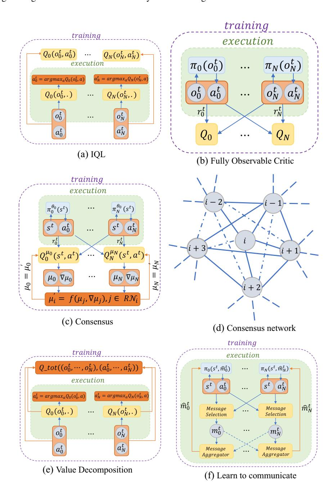

# **A review of cooperative multi-agent deep reinforcement learning**

**Afshin Oroojlooy1 · Davood Hajinezhad1**

Accepted: 23 August 2022 / Published online: 14 October 2022

© The Author(s), under exclusive licence to Springer Science+Business Media, LLC, part of Springer Nature 2022

#### **Abstract**

Deep Reinforcement Learning has made significant progress in multi-agent systems in recent years. The aim of this review article is to provide an overview of recent approaches on Multi-Agent Reinforcement Learning (MARL) algorithms. Our classification of MARL approaches includes five categories for modeling and solving cooperative multi-agent reinforcement learning problems: (I) independent learners, (II) fully observable critics, (III) value function factorization, (IV) consensus, and (IV) learn to communicate. We first discuss each of these methods, their potential challenges, and how these challenges were mitigated in the relevant papers. Additionally, we make connections among different papers in each category if applicable. Next, we cover some new emerging research areas in MARL along with the relevant recent papers. In light of MARL's recent success in real-world applications, we have dedicated a section to reviewing these applications and articles. This survey also provides a list of available environments for MARL research. Finally, the paper is concluded with proposals on possible research directions.

**Keywords** Reinforcement learning · Multi-agent systems · Cooperative learning

## **1 Introduction**

Multi-Agent Reinforcement Learning (MARL) algorithms are dealing with systems consisting of several agents (robots, machines, cars, etc.) which are interacting within a common environment. Each agent makes a decision in each time-step and works along with the other agent(s) to achieve an individual predetermined goal. The goal of MARL algorithms is to learn a policy for each agent such that all agents together achieve the goal of the system. Particularly, the agents are learnable units that aim to learn an optimal policy on the fly to maximize the longterm cumulative discounted reward through the interaction with the environment. Due to the complexities of the environments or the combinatorial nature of the problem, training the agents is typically a challenging task and several problems which MARL deals with them are categorized as NP-Hard problems, e.g. manufacturing scheduling [\[52,](#page-39-0) [62\]](#page-39-1), vehicle routing problem [\[181,](#page-43-0) [259\]](#page-45-0), some multi-agent games [\[13\]](#page-38-0) are only a few examples to mention.

With the motivation of recent success on deep reinforcement learning (RL)—super-human level control on Atari games [\[136\]](#page-42-0), mastering the game of Go [\[183\]](#page-43-1), chess [\[184\]](#page-43-2), robotic [\[95\]](#page-40-0), health care planning [\[119\]](#page-41-0), power grid [\[65\]](#page-40-1), routing [\[145\]](#page-42-1), and inventory optimization [\[150\]](#page-42-2), chip design [\[133\]](#page-41-1)—on one hand, and the importance of multi-agent system [\[107,](#page-41-2) [227\]](#page-44-0) on the other hand, several researches have been focused on deep MARL. One naive approach to solve these problems is to convert the problem to a singleagent problem and make the decision for all the agents using a centralized controller. However, in this approach, the number of actions typically exponentially increases, which makes the problem intractable. Besides, each agent needs to send its local information to the central controller and with increasing the number of agents, this approach becomes very expensive or impossible. In addition to the communication cost, this approach is vulnerable to the presence of the central unit and any incident that results in the loss of the network. Moreover, usually in multi-agent problems, each agent accesses only some local information, and due to privacy issues, they may not be allowed to share their information with the other agents.

There are several properties of the system that are important in modeling a multi-agent system: (i) centralized

Afshin Oroojlooy [oroojlooy@gmail.com](mailto: oroojlooy@gmail.com)

Davood Hajinezhad [davood.hajinezhad@sas.com](mailto: davood.hajinezhad@sas.com)

1 SAS Institute Inc., Cary, NC, USA

or decentralized control, (ii) fully or partially observable environment, (iii) cooperative or competitive environment. Within a centralized controller, a central unit takes the decision for each agent in each time step. On the other hand, in the decentralized system, each agent takes a decision for itself. Also, the agents might cooperate to achieve a common goal, e.g. a group of robots who want to identify a source or they might compete with each other to maximize their own reward, e.g. the players in different teams of a game. In each of these cases, the agent might be able to access the whole information and the sensory observation (if any) of the other agents, or on the other hand, each agent might be able to observe only its local information. In this paper, we have focused on the decentralized problems with the cooperative goal, and most of the relevant papers with either full or partial observability are reviewed.

There are several reviews on general MARL algorithms. Early papers like [\[29,](#page-39-2) [30,](#page-39-3) [131,](#page-41-3) [235\]](#page-45-1) provide reviews on cooperative games and general MARL algorithms published till 2012. Also, [\[43\]](#page-39-4) provide a survey over the utilization of transfer learning in MARL. [\[70\]](#page-40-2) review general multi-agent RL on competitive, cooperative, and mixed environments, by focusing on the general idea of each papers. In addition, a discussion on the practical challenges like the common implementation tricks, computational requirements, and open questions is provided. The paper does not cover much of theories on MARL, nor the the algorithm which are based on the theory of consensus. On the other hand, [\[258\]](#page-45-2) provide a comprehensive overview on the theoretical results, convergence, and complexity analysis of MARL algorithms on Markov/stochastic games and extensive-form games on competitive, cooperative, and mixed environments. In the cooperative setting, they have mostly focused on the theory of consensus and policy evaluation. In this paper, we did not limit ourselves to a given branch of cooperative MARL such as consensus, and we tried to cover most of the recent works on the cooperative Deep MARL. In [\[147\]](#page-42-3), a review is provided for MARL, where the focus is on deep MARL from the following perspectives: non-stationarity, partial observability, continuous state and action spaces, training schemes, and transfer learning. We provide a comprehensive overview of current research directions on the cooperative MARL under six categories, and we tried our best to unify all papers through a single notation. Since the problems that MARL algorithms deal with, usually include large state/action spaces and, the classical tabular RL algorithms are not efficient to solve them, we mostly focus on the approximated cooperative MARL algorithms.

The rest of the paper is organized as the following: in Section [2.1](#page-1-0) we briefly explain the single agent RL problem and some of its components. Then the multi-agent formulation is represented and some of the main challenges of multi-agent environment from the RL viewpoint is described in Section [2.2.](#page-5-0) In Section [3,](#page-6-0) we discuss the taxonomy and organization of the MARL algorithms we reviewed. Section [4](#page-8-0) explains the independent Q-learner type algorithm, Section [5](#page-10-0) reviews the papers with a fully observable critic model, Section [6](#page-14-0) includes the value decomposition papers, Section [7](#page-16-0) explains the consensus approach, Section [8](#page-19-0) reviews the learn-to-communicate approach, Section [9](#page-24-0) explains some of the emerging research directions, Section [10](#page-27-0) provides some applications of the multi-agent problems and MARL algorithms in real-world, Section [11](#page-34-0) very briefly mentions some of the available multi-agent environments, and finally Section [13](#page-36-0) concludes the paper.

#### **2 Background, single-agent RL formulation, and multi-agent RL notation**

In this section, we first go over some background of reinforcement learning and the common approaches to solve that for the single-agent problem in Section [2.1.](#page-1-0) Then, in Section [2.2](#page-5-0) we introduce the notation and definition of the Multi-agent sequential decision-making problem and the challenges that MARL algorithms need to address.

#### **2.1 Single agent RL**

RL considers a sequential decision making problem in which an agent interacts with an environment. The agent at time period  $t$  observes state  $s_t \in \mathcal{S}$  in which  $\mathcal{S}$  is the state space, takes action  $a_t \in \mathcal{A}(s_t)$  where  $\mathcal{A}(s_t)$  is the valid action space for state  $s_t$ , and executes that in the environment to receive reward  $r(s_t, a_t, s_{t+1}) \in \mathbb{R}$  and then transfers to the new state  $s_{t+1} \in \mathcal{S}$ . The process runs for the stochastic  $T$  time-steps, where an episode ends. Markov Decision Process (MDP) provides a framework to characterize and study this problem where the agent has full observability of the state.

The gorigin of the agent in an MDP is to determine a policy  $\pi : \mathcal{S} \rightarrow \mathcal{A}$ , a mapping of the state space  $\mathcal{S}$  to the action space  $\mathcal{A}^1$ , that maximizes the long-term cumulative discounted rewards:

$$J = \mathbb{E}_{\pi, s_0} \left[ \sum_{t=0}^{\infty} \gamma^t r(s_t, a_t, s_{t+1}) |a_t = \pi(\cdot | s_t) \right], \quad (1)$$

1A policy can be deterministic or stochastic. Action *at* is the direct outcome of a deterministic policy, i.e., *at* = *π(st)*. In stochastic policies, the outcome of the policy is the probability of choosing each of the actions, i.e., *π(a*|*st)* = *P r(at* = *a*|*st)*, and then an additional method is required to choose an action among them. For example, a greedy method chooses the action with the highest probability. In this paper, when we refer to an action resulted from a policy we mostly use the notation for the stochastic policy, *a* ∼ *π(*.|*s)*.

where,  $\gamma \in [0, 1]$  is the discounting factor. Accordingly, the value function starting from state  $s$  and following policy  $\pi$  denoted by  $V^\pi(s)$  is given by

$$V^\pi(s) = \mathbb{E}_\pi \left[ \sum_{t=0}^\infty \gamma^t r(s_t, a_t, s_{t+1}) | a_t \sim \pi(\cdot | s_t), s_0 = s \right], \quad (2)$$

and given action *a*, the Q-value is defined as

$$Q^\pi(s, a) = \mathbb{E}_\pi \left[ \sum_{t=0}^\infty \gamma^t r(s_t, a_t, s_{t+1}) | a_t \sim \pi(\cdot | s_t), s_0 = s, a_0 = a \right], \quad (3)$$

Given a known state transition probability distribution *p(st*+1|*st,at)* and reward matrix *r(st,at)*, Bellman [\[17\]](#page-38-1) showed that the following equation holds for all state *st* at any time step *t*, including the optimal values too:

$$V^\pi(s_t) = \sum_{a \in \mathcal{A}(s_t)} \pi(a|s_t) \sum_{s' \in \mathcal{S}} p(s'|s_t, a) [r(s_t, a) + \gamma V^\pi(s')], \quad (4)$$

where *s* denotes the successor state of*st* ; which will be used interchangeably with *st*+1 throughout the paper. Thorough maximizing over the actions, the optimal state-value and optimal policy can be obtained:

$$V^\pi^*(s_t) = \max_a \sum_{s'} p(s' | s_t, a) \left[ r(s_t, a) + \gamma V^{\pi^*}(s') \right]. \quad (5)$$

Similarly, the optimal Q-value for each state-action can be obtained by:

$$Q^{\pi^*}(s_t, a_t) = \sum_{s'} p(s' | s_t, a_t) \left[ r(s_t, a_t) + \gamma \max_{a'} Q^{\pi^*}(s', a') \right]. \quad (6)$$

One can obtain an optimal policy *π*∗ through learning directly *Qπ*∗ *(st,at)*. The relevant methods are called *valuebased* methods. However, in the real world usually the knowledge of the environment i.e., *p(s* |*st,at)* is not available and one cannot obtain the optimal policy using [\(5\)](#page-2-0) or [\(6\)](#page-2-1). In order to address this issue, learning the state-value, or the Q-value, through sampling has been a common practice. This approximation requires only samples of state, action, and reward that are obtained from the interaction with the environment. In the earlier approaches, the value for each state/state-action was stored in a table and was updated through an iterative approach. The *value iteration* and *policy iteration* are two famous algorithms in this category that can attain the optimal policy. However, these approaches are not practical for tasks with enormous state/action spaces due to the curse of dimensionality. This issue can be mitigated through *function approximation*, in which parameters of a function need to be learned by utilizing supervised learning approaches. The function approximator with parameters *θ* results in policy *πθ (a*|*s)*. The function approximator with parameters *θ* can be a simple linear regression model or a deep neural network. Given the function approximator, the goal of an RL algorithm can be re-written to maximize the utility function,

$$J(\theta) = \mathbb{E}_{a \sim \pi_\theta(\cdot | s), s \sim \rho_{\pi_\theta}} \sum_{t=0}^{\infty} \gamma^t r(s_t, a_t; \theta), \quad (7)$$

where the expectation is taken over the actions and the distribution for state occupancy.

In a different class of approaches, called *policybased*, the policy is directly learned which determines the probability of choosing an action for a given state. In either of these approaches, the goal is to find parameters *θ* to maximize utility function *J (θ )* through learning with sampling. We explain a brief overview of the value-based and policy-based approaches in Sections [2.1.1](#page-2-2) and [2.1.2,](#page-3-0) respectively. Note that there is a large body of literature on the single-agent RL algorithms, and we only reviewed those algorithms which are actively being used in multiagent literature. So, to keep the coherency, we prefer not to explore advanced algorithms like soft actor-critic (SAC) [\[67\]](#page-40-3) and TD3 [\[61\]](#page-39-5), which are less common in MARL literature. For more details about other single-agent RL algorithms see [\[110\]](#page-41-4) and [\[202\]](#page-44-1).

For all the above notations and descriptions, we assume full observability of the environment. However, in cases that the agent accesses only some part of the state, it can be categorized as a decision-making problem with partial observability. In such circumstances, MDP can no longer be used to model the problem; instead, partially observable MDPs (POMDP) is introduced as the modeling framework. This situation happens in a lot of multi-agent systems and will be discussed throughout the paper.

#### **2.1.1 Value approximation**

In value approximation, the goal is to learn a function to estimate *V (s)* or *Q(s, a)*. It is showed that with a large enough number of observations, a linear function approximation converges to a local optimal [\[19,](#page-38-2) [203\]](#page-44-2). Nevertheless, the linear function approximators are not powerful enough to capture all complexities of a complex environment. To address this issue, there has been a tremendous amount of research on non-linear function approximators and especially neural networks in recent years [\[20,](#page-38-3) [63,](#page-39-6) [135\]](#page-42-4).

Among the recent works on the value-based methods, the deep Q-network (DQN) algorithm [\[136\]](#page-42-0) attracted a lot of attention due to its human-level performance on the Atari-2600 games [\[16\]](#page-38-4), in which it only observes the

video of the game. DQN utilizes the experience replay [115] and a moving target network to stabilize the training. The experience replay holds the previous observation tuple  $(s_t, a_t, r_t, s_{t+1}, d_t)$  in which  $d_t$  determines if the episode ended with this observation. Then the approximator is trained by taking a random mini-batch from the experience replay. Utilizing the experience replay results in sample efficiency and stabilizing the training, since it breaks the temporal correlations among consecutive observations. The DQN algorithm uses a deep neural network to approximate the Q-value for each possible action  $a \in \mathcal{A}$ . The input of the network is a function of the state  $s_t$ , e.g., concatenation/average of the last four observed states. The original paper used a combination of convolutional neural network (CNN) and fully connected (FC) as the neural network approximator; although, it can be a linear or non-linear function approximator, like any combination of FC, CNN, or recurrent neural networks (RNN). The original DQN algorithm uses a function of state  $s_t$  as the input to a CNN and its output is the input to an FC neural network. This neural network with weights  $\theta$  is then trained by taking a mini-batch of size  $m$  from the experience replay to minimize the following loss function:

$$L(\theta) = \frac{1 - \sum_{i=1}^m (y_i - Q(s_i, a_i; \theta))^2, \quad (8)$$

$$y_i = \begin{cases} r_i, & d_i = \text{True}, \\ r_i + \gamma \max_{a'} Q(s'_i, a', \theta^-) & d_i = \text{False}, \end{cases} \quad (9)$$

wherere,  $\theta^-$  is the weights of the *target network* which is updated by  $\theta$  every  $C$  iterations.

Later, new DQN-based approaches were proposed for solving RL problems. For example, inspired by [68] which proposed double Q-learning, the Double-DQN algorithm proposed by [214] to alleviate the over-estimation issue of Q-values. Similarly, Dueling double DQN [230] proposed learning a network with two heads to obtain the advantage value  $A(s, a) = Q(s, a) - V(s)$  and  $V(s)$  and use that to get the Q-values. In addition, another extension of the DQN algorithm is proposed by combining recurrent neural networks with DQN. DRQN [69] is a DQN algorithm which uses a Long Short-Term Memory (LSTM) [72] layer instead of a fully connected network and is applied to a partially observable environment. In all these variants, usually, the  $\epsilon$ -Greedy algorithm is used to ensure the exploration. That is, in each time-step with a probability of  $\epsilon$  the action is chosen randomly, and otherwise, it is selected greedily by taking an `argmax` over the Q-values for the state. Typically, the value of  $\epsilon$  is annealed during the training. Choosing the hyper-parameters of the  $\epsilon$ -greedy algorithm, target update frequency, and the experience replay can widely affect the speed and quality of the training. For example, it is shown

that a large experience replay buffer can negatively affect performance. See [54, 118, 260] for more details.

In the final policy, which is used for scoring, usually the  $\epsilon$  is set to zero, which results in a deterministic policy. This mostly works well in practice; although, it might not be applicable to stochastic policies. To address this issue, softmax operator and Boltzmann softmax operator are added to DQN [116, 152] to get the probability of choosing each action,

$$\text{Boltzmann } (\mathcal{Q}(s_t, a)) = \frac{e^{\beta \mathcal{Q}(s_t, a)}}{\sum_{a \in \mathcal{A}(s_t)} e^{\beta \mathcal{Q}(s_t, a)}}, \forall u \in \mathcal{A}(s_t),$$

in which  $\beta$  is the temperature parameter to control the rate of stochasticity of actions. To use the Boltzmann softmax operator also one needs to find a reasonable temperature parameter value and as a result cannot be used to find the general optimal stochastic policy. To see other extensions of the value-based algorithm and other exploration algorithms see [110].

#### **2.1.2 Policy approximation**

In the value-based methods, the key idea is learning the optimal value-function or the Q-function, and from there a greedy policy could be obtained. In another direction, one can parametrize the policy, make a utility function, and try to optimize this function over the policy parameter through a supervised learning process. This class of RL algorithms is called policy-based methods, which provides a probability distribution over actions. For example, in the policy gradient method, a stochastic policy by parameters  $\theta \in \mathbb{R}^d$  is learned. First, we define

$$h(s_t, , a_t; \theta) = \theta^T \phi(s_t, a_t),$$

where,  $\phi(s_t,a_t) \in \mathbb{R}^d is called the *feature vector* of the state-action pair (s_t,a_t). Then, the stochastic policy can be obtained by:$ 

$$\pi(a_t | s_t; \theta) = \frac{e^{h(s_t, a_t; \theta)}}{\sum_b e^{h(s_t, b; \theta)}},$$

which is the softmax function. The goal is to directly learn the parameter  $\theta$  using a gradient-based algorithm. Let us define  $J(\theta)$  to measure the expected value for policy  $\pi_\theta$  for trajectory  $\tau = s_0, a_0, r_0, \dots, s_T, a_T, r_T$ :

$$J(\theta) = E_{\tau} \sum_{t=0}^T \gamma^t r(s_t, a_t)$$

Then the  *policy gradient theorem* provides an analytical expression for the gradient of  $J(\theta)$  as the following:

$$\nabla_{\theta} J(\theta) = \mathbb{E}_{\tau} \left[ \nabla_{\theta} \log p(\tau; \theta) G(\tau) \right], \quad (10)$$

$$\begin{aligned} &am &= \mathbb{E}_{\tau} \left[ \nabla_{\theta} \log p(\tau) / \theta \right], \\ &= \mathbb{E}_{a \sim \pi_{\theta}(\cdot|s), s \sim \rho_{\pi_{\theta}}} \left[ \nabla_{\theta} \log \pi(a|s; \theta) Q_{\pi_{\theta}}(s, a) \right]. \end{aligned} \quad (10)$$

, in which  $G(\tau)$  is the return of the trajectory. Then the policy-based methods update the parameter  $\theta$  as below:

$$\theta^{t+1} = \theta^t + \alpha \widehat{\nabla}_\theta J(\theta), \quad (12)$$

$$\theta^{}^{t+1} = \theta^t + \alpha \widehat{\nabla}_{\theta} J(\theta), \quad (12)$$
REINFORCE algorithm is one of the first policy-gradient algorithms [203]. Particularly, REINFORCE applies Monte Carlo method and uses the actual return  $G_t := \sum_{t'=1}^T \gamma^{t'} r(s_{t'}, a_{t'})$  as an approximation for  $G(\tau)$  in (10), and re-writes the gradient  $\nabla_{\theta} \log p(\tau; \theta)$  as  $\sum_{t=0}^T \nabla_{\theta} \log \pi_{\theta}(a_t | s_t)$ . This provides an unbiased estimation of the gradient; although, it has a high variance which makes the training quite hard in practice. To reduce the variance, it has been shown that subtracting a baseline  $b$  from  $G(\tau)$  is very helpful and is being widely used in practice. If the baseline is a function of state  $s_t$ , the gradient estimator will be still an unbiased estimator, which makes  $V(s)$  an appealing candidate for the baseline function. Intuitively, with a positive  $G_t - V(s_t)$ , we want to move toward the gradients since it results in a cumulative reward which is higher than the average cumulative reward for that state, and vice versa. There are several other extensions of REINFORCE algorithms, each tries to minimize the gradient estimation. Among them, REINFORCE with reward-to-go and baseline usually outperforms the REINFORCE with baseline. For more details about other extensions see [202].

REINFORCE uses the actual return from a random trajectory, which might introduce a high variance into the training. In addition, one needs to wait until the end of the episode to obtain the actual cumulative discounted reward. Actor-critic (AC) algorithm extends REINFORCE by eliminating this constraint and minimizes the variance of gradient estimation. In AC, instead of waiting until the end of the episode, a critic model is used to approximate the value of state  $s_t$  by  $Q(s_t, a_t) = r(s_t, a_t) + \gamma V(s_{t+1})$ . As a natural choice for the baseline, picking  $V(s_t)$  results in utilizing the advantage function  $A(s_t, a_t) = r(s_t, a_t) + \gamma V(s_{t+1}) - V(s_t)$ . The critic model is trained by calculating the TD-error  $\delta_t = r(s_t, a_t) + \gamma V_w(s_{t+1}) - V_w(s_t)$ , and updating  $w$  by  $w = w + \alpha_w \delta_t \nabla_w V_w(s_t)$ , in which  $\alpha_w$  is the critic's learning rate. Therefore, there is no need to wait until the end of the episode and after each time-step one can run a train-step. With AC, it is also straight-forward to train an agent for non-episodic environments.

Following this technique, several AC-based methods were proposed. Asynchronous advantage actor-critic (A3C) contains a master node connected to a few worker nodes

[137]. This a algorithm runs several instances of the actor-critic model and asynchronously gathers the gradients to update the weights of a master node. Afterward, the master node broadcasts the new weights to the worker node, and in this way, all nodes are updated asynchronously. Synchronous advantage actor-critic (A2C) algorithm uses the same framework but synchronously updates the weights.

Neither REINFORCE, AC, A2C, and A3C guarantee a steady improvement over the objective function. Trust region policy gradient (TRPO) algorithm [175] is proposed to address this issue. TRPO tries to obtain new parameters  $\theta'$  with the goal of maximizing the difference between  $J(\theta') - J(\theta)$ , where  $\theta$  is the parameter of the current policy. Under the trajectory generated from the new policy  $\pi_{\theta'}$ , it can be shown that

$$\begin{aligned} J(\theta') -J(\theta)) &= \mathbb{E}_{\tau \sim p_{\theta'}(\tau)} \left[ \sum_{t=0}^{\infty} \gamma^t A_{\pi_{\theta}}(s_t, a_t) \right] \\ &= \sum_{t=0}^{\infty} \mathbb{E}_{s_t \sim p_{\theta'}(s_t)} \left[ \mathbb{E}_{a_t \sim p_{\theta'}(a_t)} \left[ \frac{p_{\theta'}(a_t|s_t)}{p_{\theta}(a_t|s_t)} \gamma^t A_{\pi_{\theta}}(s_t, a_t) \right] \right], \quad (13a) \\ &\sim \sum_{t=0}^{\infty} \mathbb{E}_{s_t \sim p_{\theta}(s_t)} \left[ \mathbb{E}_{a_t \sim p_{\theta'}(a_t)} \left[ \frac{p_{\theta'}(a_t|s_t)}{p_{\theta}(a_t|s_t)} \gamma^t A_{\pi_{\theta}}(s_t, a_t) \right] \right], \quad (13c) \end{aligned}$$

where the expectation of  $s_t$  in (13b) is over the  $p_{\theta'}(s_t)$  though we do not have  $\theta'$ . To address this issue, TRPO approximates (13b) by substituting  $s_t \sim p_{\theta'}(s_t)$  with  $s_t \sim p_{\theta}(s_t)$  assuming that  $\pi_{\theta'}$  is close to  $\pi_{\theta}$ , resulting in (13c). Under the assumption  $|\pi_{\theta'}(a_t|s_t) - \pi_{\theta}(a_t|s_t)| \leq \epsilon$ ,  $\forall s_t$ , [175] show that

$$J(\theta') - J(\theta) \geq \sum_{t=0}^{\infty} \mathbb{E}_{s_t \sim p_\theta(s_t)} \left[ \mathbb{E}_{a_t \sim p_{\theta'}(a_t)} \left[ \frac{p_{\theta'}(a_t | s_t)}{p_\theta(a_t | s_t)} \gamma^t A_{\pi_\theta}(s_t, a_t) \right] \right] - \sum_t 2t\epsilon C \quad (14)$$

which  $C$  is a a function of  $r_{\max}$  and  $T$ . Thus, if  $\epsilon$  is small enough, TRPO guarantees monotonic improvement under the assumption of the closeness of the policies. TRPO uses Kullback–Leibler divergence  $D_{KL}(p_1(x)||p_2(x)) = \mathbb{E}_{x \sim p_1(x)} \left[ \log \frac{p_1(x)}{p_2(x)} \right]$  to measure the amount of changes in the policy update. Therefore, it sets  $|\pi_{\theta'}(a_t|s_t) - \pi_{\theta}(a_t|s_t)| \leq \sqrt{0.5} D_{KL}(\pi_{\theta'}(a_t|s_t)||\pi_{\theta}(a_t|s_t)) \leq \epsilon$  and solves a constrained optimization problem. For solving this optimization problem, TRPO approximates the objective function by using the first order term of the corresponding Taylor series. Similarly, the constraint is approximated using the second order term of the corresponding Taylor series. This results in a policy gradient update which involves calculating the inverse of the Fisher matrix ( $F^{-1}$ ) multiplier and a specific learning to make sure that the bound  $\epsilon$  is hold. Neural networks may have millions of parameters, which make it impossible to directly achieve

*F* −1. To address this issue, the conjugate gradient algorithm [\[71\]](#page-40-7) is used.

In general, despite TRPO's benefits, it is relatively a complicated algorithm, it is expensive to run, and it is not compatible with architectures including dropout kind of noises, or parameter sharing among different networks [\[176\]](#page-43-4). To address these issues, [\[176\]](#page-43-4) proposed proximal policy optimization (PPO) algorithm in which it avoids using the Fisher matrix and its computation burden. PPO defines *rt(θ )* = *πθ(at*|*st) πθ (at*|*st)* and it obtains the gradient update by

$$\mathbb{E}_{\tau_t \sim_{p_\theta} \left[ \sum_{t=0}^{\infty} \min(r_t(\theta) A_{\pi_\theta}(s_t, a_t), \text{clip}(r_t(\theta), 1 - \epsilon, 1 + \epsilon) A_{\pi_\theta}(s_t, a_t)) \right], \quad (15)$$

which in practice works as good as TRPO in most cases.

Despite the issue of data efficiency, policy-based algorithms provide better convergence guarantees over the value-based algorithms [\[2,](#page-38-5) [245,](#page-45-4) [257\]](#page-45-5). This is still true with the policy gradient which utilizes neural networks as function approximation [\[117,](#page-41-8) [224\]](#page-44-5). In addition, compared to the value-based algorithms, policy-based approaches can be easily applied to the continuous control problem. Furthermore, for most problems, we do not know the true form of the optimal policy, i.e., deterministic or stochastic. The policy gradient has the ability to learn either a stochastic or deterministic policy; however, in value-based algorithms, one needs to know the form of the policy at the algorithm's design time, which might be unknown. This results in two benefits of the policy-gradient method over value-based methods [\[202\]](#page-44-1): (i) when the optimal policy is a stochastic policy (like Tic-tac-toe game), policy gradient by nature is able to learn that. However, the value-based algorithms have no way of learning the optimal stochastic policy. (ii) if the optimal policy is deterministic, by following the policy gradient algorithms, there is a chance of converging to a deterministic policy. However, with a value-based algorithm, one does not know the true form of the optimal policy so that he cannot choose the optimal exploration parameter (like in greedy method) to be used in the scoring time. In the first benefit, note that one may use a softmax operator over the Q-value to provide the probabilities for choosing each action; but, the value-based algorithms cannot learn the probabilities by themselves as a stochastic policy. Similarly, one may choose a non-zero for the score time, but one does not know the optimal value for such , so this method may not result in the optimal policy. Also, on the second benefit note that the issue is not limited to the -greedy algorithm. With added soft-max operator to a value-based algorithm, we get the probability of choosing each action. Even in this setting, the algorithm is designed to get the true values for each action, and there is no known mapping of true values to the optimal probabilities for choosing each action, which does not necessarily result in 0 and 1 actions. Similarly, the other variants of the soft-max operator like Boltzmann softmax which uses a temperature parameter, do not help either. Although, the temperature parameter can help to get determinism; still in practice we do not if the optimal solution is deterministic to do that.

#### **2.2 Multi-agent RL notations and formulation**

We denote a multi-agent setting with tuple  $\langle N, \mathcal{S}, \mathcal{A}, R, P, \mathcal{O}, \gamma \rangle$ , in which  $N$  is the number of agents,  $\mathcal{S}$  is state space,  $\mathcal{A} = \{\mathcal{A}_1, \dots, \mathcal{A}_N\}$  is the set of actions for all agents,  $P$  is the transition probability among the states,  $R$  is the reward function, and  $\mathcal{O} = \{\mathcal{O}_1, \dots, \mathcal{O}_N\}$  is the set of observation spaces for all agents. Within any type of the environment, we use  $\mathbf{a}$  to denote the vector of actions for all agents,  $\mathbf{a}_{-i}$  is the set of all agents except agent  $i$ ,  $\tau_i$  represents observation-action history of agent  $i$ , and  $\boldsymbol{\tau}$  is the observation-action of all agents. Also,  $\mathcal{T}$ ,  $\mathcal{S}$ , and  $\mathcal{A}$  are the observation-action space, state space, and action space, respectively. Then, in a cooperative problem with  $N$  agents with full observability of the environment, each agent  $i$  at time-step  $t$  observes the global state  $s_t$  and uses the local stochastic policy  $\pi_i$  to take action  $a_i^t$  and then receives reward  $r_i^t$ . If the environment is *fully cooperative*, at each time step all agents observe a joint reward value  $r_t$ , i.e.,  $r_1^t = \dots = r_N^t = r^t$ . If the agents are not able to fully observe the state of the system, each agent only accesses its own local observation  $o_i^t$ .

Similar to the single-agent case, each agent is able to learn the optimal Q-value or the optimal stochastic policy. However, since the policy of each agent changes as the training progresses, the environment becomes non-stationary from the perspective of any individual agent. Basically, *P (s* |*s, ai,π*1*,...,πN )* = *P (s* |*s, ai,π* 1*,...,π N )* when any *πi* = *π i* so that we lose the underlying assumption of MDP. This means that the experience of each agent involves different co-player policies, so we cannot fix them and train an agent such that any attempt to train such models results in fluctuations of the training. This makes the model training quite challenging. Therefore, the adopted Bellman equation for MARL [\[57\]](#page-39-8) (assuming the full observability) also does not hold for the multi-agent system:

$$Q_i^*(s, a_i | \pi_{-i}) = \sum_{\mathbf{a}_{-i}} \pi_{-i}(\mathbf{a}_{-i}, s) \left[ r(s, a_i, \mathbf{a}_{-i}) + \gamma \sum_{s'} P(s' | s, a_i, \mathbf{a}_{-i}) \max_{a'_i} Q_i^*(s, a'_i) \right], \quad (16)$$

where  $\pi_{-i} = \prod_{j \neq i} \pi_j(a_j|s)$ . Due to the fact that  $\pi_{-i}$  changes over time as the policy of other agents changes,

in MARL one cannot obtain the optimal Q-value using the classic Bellman equation.

On the other hand, the policy of each agent changes during the training, which results in a mix of observations from different policies in the experience replay. Thus, one cannot use the experience replay without dealing with the non-stationarity. Without experience replay, the DQN algorithm [\[136\]](#page-42-0) and its extensions can be hard to train due to the sample inefficiency and correlation among the samples. The same issue exists within AC-based algorithms which use a DQN-like algorithm for the critic. Besides, in most problems in MARL, agents are not able to observe the full state of the system, which are categorized as decentralized POMDP (Dec-POMDP). Due to the partial observability and the non-stationarity of the local observations, Dec-POMDPs are even harder problems to solve and it can be shown that they are in the class of NEXP-complete problems [\[18\]](#page-38-6). A similar equation to [\(16\)](#page-5-1) can be obtained for the partially observable environment too.

In the Multi-agent RL, the noise and variance of the rewards increase which results in the instability of the training. The reason is that the reward of one agent depends on the actions of other agents, and the conditioned reward on the action of a single agent can exhibit much more noise and variability than a single agent's reward. Therefore, training a policy gradient algorithm also would not be effective in general.

Finally, we define the following notation which is used in a couple of papers in Nash equilibrium. A joint policy *π*∗ defines a Nash equilibrium if and only if:

$$\forall \pi_i \in \Pi_i, \forall s \in \mathcal{S}, v_i^{(\pi_i^*, \pi_{-i}^*)}(s) \geq v_i^{(\pi_i, \pi_{-i}^*)}(s); \forall i \in \{1, \dots, N\} \quad (17)$$

in which *v (πi,π*−*i) i (s)* is the expected cumulative long-term return of agent *i* in state *s* and *i* is the set of all possible policies for agent *i*. Particularly, it means that each agent prefers not to change its policy if it wants to attain the longterm cumulative discounted reward. Further, if the following holds for policy *π*ˆ :

$$v_i^{(\hat{\pi})}(s) \geq v_i^{(\pi_i)}(s), \quad \forall i \in \{1, \dots, N\}, \quad \forall \pi_i \in \Pi_i, \quad \forall s \in \mathcal{S},$$

policy *π*ˆ is called Pareto-optimal. We introduce notation for Nash equilibrium only as much that we needed for representing a few famous papers on the cooperative MARL. For more details on this topic see [\[243\]](#page-45-6).

## **3 Taxonomy**

In this section, we provide a high-level explanation about the taxonomy and the angle we looked at the MARL. For each class of algorithm, in Fig. [1](#page-7-0) we provide a high level schematic of the way that algorithm works and the way that agent interact with each other.

A simple approach to extend single-agent RL algorithms to multi-agent algorithms is to consider each agent as an independent learner. In this setting, the other agents' actions would be treated as part of the environment. This idea was formalized in [\[207\]](#page-44-6) for the first time where the Q-learning algorithm was extended for this problem which is called *independent Q-Learning (IQL)*. The biggest challenge for IQL is *non-stationarity*, as the other agents' actions toward local interests will impact the environment transitions. See the high level representation of the algorithms and agent interaction in Fig. [1a](#page-7-0).

To address the non-stationarity issue, one strategy is to assume that all critics observe the same state (global state) and actions of all agents, which we call it *fully observable critic* model. In this setting, the critic model learns the true state-value and when is paired with the actor can be used toward finding the optimal policy. When the reward is shared among all agents, only one critic model is required; however, in the case of private local reward, each agent needs to train a local critic model for itself. Also, Fig. [1b](#page-7-0) shows a schematic representation of algorithms in this class, where critic networks observe all the observation of other agents.)

Consider multi-agent problem settings, where the agents aim to maximize a single joint reward or assume it is possible to reduce the multi-agent problem into a single agent problem. A usual RL algorithm may fail to find the global optimal solution in this simplified setting. The main reason is that in such settings, the agents do not know the true share of the reward for their actions and as a result, some agents may get lazy over time [\[200\]](#page-43-5). In addition, exploration among the agents with poor policy aggravates the team reward, thus restrain the agents with good policies to proceed toward optimal policy. One idea to remedy this issue is to figure out the share of each individual agent into the global reward. This solution is formalized as the *Value Function Factorization*, where a decomposition function is learned from the global reward. Figure [1e](#page-7-0) displays the main elements of algorithms in this class.

Another drawback in the fully observable critic paradigm is the communication cost. In particular, with increasing the number of learning agents, it might be a prohibitive task to collect all state/action information in a critic due to communication bandwidth and memory limitations. The same issue occurs for the actor when the observation and actions are being shared. Therefore, the question is how to address this communication issue and change the topology such that the local agents can cooperate and communicate in learning optimal policy. The key idea is to put the learning agents on a sparsely connected network, where each agent can communicate with a small subset of agents. Then the agents seek an optimal solution under the constraint that this solution is in *consensus* with its neighbors. Through communications, eventually, the whole network reaches a unanimous policy which results in the optimal policy. A sample of agent-network and the high level scheme of the consensus algorithms are presented in Figs. [1d](#page-7-0) and [1c](#page-7-0).

For the consensus algorithms or the fully observable critic model, it is assumed that the agent can send their observation, action, or rewards to the other agents and the hope is that they can learn the optimal policy by having that information from other agents. But, one does not know the true information that is required for the agent to learn the optimal policy. In other words, the agent might be able to learn the optimal policy by sending and receiving a simple message instead of sending and receiving the whole observation, action, and reward information. So, another line of research which is called, *Learn to Communicate*, allows the agents to learn what to send, when to send, and send that to which agents. In particular, besides the action to the environment, the agents learn another action called communication action. Figure [1f](#page-7-0) shows the main idea in this class of algorithms and how the agent interact with each other.

Despite the fact that the above taxonomy covers a big portion of MARL, there are still some algorithms that either do not fit in any of these categories or are at the intersection

**Fig. 1** General schematic of algorithms and the relationship of the agents in each categories. In each figure the green box shows the participating elements in the execution, and all the blocks in the bigger purple box show the participating elements for the training purpose. For example, in [1a](#page-7-0), *at* 0 is only utilized during the training. The flow of the gradients in the training is also through the reverse side of the arrows. [1a](#page-7-0) shows the structure of IQL algorithm in which each agent learns a policy independent of other agents. A Similar schematic would be drawn for the independent actor-critic learners. [1b](#page-7-0) shows the schematic of fully observable critic algorithms where agents share the full state to learn a fully observable critic. [1c](#page-7-0) presents the way that agents share their critic weights (*μ*) or their gradients (∇*μ*) with their neighbors (*RN*). [1d](#page-7-0) also draws a realization of the random connection with a given rate in [0,1] among some of the agents (centric at agent *i*) at time *t*. The dotted lines among the agents show no-communication. The lines going out of the agents show their connection to the other agents. [1e](#page-7-0) is the schematic of elements in value decomposition algorithms in which *Qtot* is a conditional sum of the local *Q*-values. [1f](#page-7-0) displays the general schematic of the learn to communicate algorithms

of a few of them. In this review, we discuss some of these algorithms too.

In Table [1,](#page-9-0) a summary of different categories are presented. Notice that in the third column we provide only a few representative references. More papers will be discussed in the following sections.

## **4 Independent learners**

One of the first proposed approaches to solve the multiagent RL problem is to treat each agent independently such that it considers the rest of the agents as part of the environment. This idea is formalized in independent Q-Learning (IQL) algorithm [\[207\]](#page-44-6), in which each agent accesses its local observation and the overall agents try to maximize a joint reward. Each agent runs a separate Qlearning algorithm [\[231\]](#page-44-7) (or it can be the newer extensions like DQN [\[136\]](#page-42-0), DRQN [\[69\]](#page-40-5), etc.). IQL is an appealing algorithm since (i) it does not have the scalability and communication problem that the central control method encounters with increasing the number of agents, (ii) each agent only needs its local history of observations during the training and the inference time. Although it fits very well to the partially observable settings, it has the non-stationarity of environment issue. The tabular IQL usually works well in practice for small size problems [\[131,](#page-41-3) [250\]](#page-45-7); however, in the case of function approximation, especially deep neural network (DNN), it may not work very well. One of the main reasons for this weak performance is the need for the experience replay to stabilize the training with DNNs [\[57\]](#page-39-8), which does not work as intended in multi-agent settings.

There are several algorithms to improve the performance of IQL algorithm. In an extension of that, Distributed Qlearning [\[100\]](#page-41-9) considers a decentralized fully cooperative multi-agent problem such that all agents observe the full state of the system and do not know the actions of the other agents, although in the training time it assumes the joint action is available for all agents. The joint action is executed in the environment and it returns the joint reward that each agent receives. This algorithm updates the Q-values only when there is a guaranteed improvement, assuming that the low returns are the result of a bad exploration of the teammates. In other words, it maximizes over the possible actions for agent *i*, assuming other agents selected the local optimal action, i.e., for a given joint action *at* = *(at* 1*,...,at N )*, it updates the Q-values of agent *i* by:

---

$$q_i^{t+1}(s, a) = \left\{ q_i^t(s, a) \left[ \max \left\{ q_i^t(s, a), r(s_t, \mathbf{a}_t) + \gamma \max_{a' \in A} q_i^t \left( \delta(s_t, \mathbf{a}_t), a' \right) \right\} \right] \text{ if } s \neq s_t \text{ or } a \neq a_t, \text{ otherwise,} \right. \quad (18)$$

in which *qt i(s, a)* = max*a*={*a*1*,...,aN* }*,ai*=*a Q(s, a)* and *δ(st, at)* is the environment function which results in *st*+1. Therefore, Distributed Q-learning completely ignores the low rewards that causes an overestimated Q-values. This issue—in addition to the curse of dimensionality—results in poor performance in the problems with high dimension.

Hysteretic Q-learning [\[130\]](#page-41-10) considers the same problem and tries to obtain a good policy assuming that the low return might be the result of stochasticity in the environment so that it does not ignore them as Distributed Q-Learning does. In particular, when the TD-error is positive, it updates the Q-values by the learning rate *α*, and otherwise, it updates the Q-values by the learning rate *β<α*. Thus, the model is also robust to negative learning due to the teammate explorations. Bowling and Veloso [\[26\]](#page-38-7) also propose to use a variable learning rate to improve the performance of tabular IQL. In another extension for the IQL, [\[60\]](#page-39-9) propose to train one of the agents at each time and fix the policy of other agents within a periodic manner in order to stabilize the environment. So, during the training, other agents do not change their policies and the environment from the view-point of the single agent is stationary.

DQN algorithm [\[136\]](#page-42-0) utilized *experience reply* and *target network* and was able to attain super-human level control on most of the Atari games. The classical IQL uses the tabular version, so one naive idea could be using the DQN algorithm instead of each single Q-learner. Tampuu et al. [\[206\]](#page-44-8) implemented this idea and was one of the first papers which took the benefit of the neural network as a general powerful approximator in an IQL-like setting. Specifically, this paper analyzes the performance of the DQN in a decentralized two-agent game for both competitive and cooperative settings. They assume that each agent observes the full state (the video of the game), takes an action by its own policy and the reward values are also known to both agents. The paper is mainly built on the *Pong* game (from Atari-2600 environment [\[16\]](#page-38-4)) in which by changing the reward function the competitive and cooperative behaviors are obtained. In the competitive version, each agent that drops the ball loses a reward point, and the opponent wins the reward point so that it is a zero-sum game. In the cooperative setting, once either of the agents drops the ball, both agents lose a reward point. The numerical results show that in both cases the agents are able to learn how to play the game

**Table 1** A summary of the MARL taxonomy in this paper

| Categories                   | Description                                                                                                                     | References         |
|------------------------------|---------------------------------------------------------------------------------------------------------------------------------|--------------------|
| Independent Learners         | Each learning agent is an independent learner without considering its influence into the environment of other agents            | [57, 60, 206, 207] |
| Fully Observable Critic      | All critic models observe the same state (global state) in order to address the non-stationarity issue                          | [121, 129, 165]    |
| Value Function Factorization | Distinguish the share of each individual agent into the global reward to avoid having lazy agents                               | [164, 188, 200]    |
| Consensus                    | To avoid communication overhead, agent communicate through sparse communication network and try to reach consensus              | [32, 127, 256]     |
| Learn to Communicate         | To improve the communication efficiency, we allow the agents to learn what to send, when to send, and send that to which agents | [56, 88, 141]      |

very efficiently, that is in the cooperative setting, they learn to keep the ball for long periods, and in the competitive setting, the agents learn to quickly beat the competitor.

Experience replay is one of the core elements of the DQN algorithm. It helps to stabilize the training of the neural network and improves the sample efficiency of the history of observations. However, due to the non-stationarity of the environment, using the experience replay in a multi-agent environment is problematic. Particularly, the policy that generates the data for the experience replay is different than the current policy so that the learned policy of each agent can be misleading. In order to address this issue, [\[56\]](#page-39-11) disable the experience replay part of the algorithm, or in [\[107\]](#page-41-2) the old transitions are discarded and the experience replay uses only the recent experiences. Even though these approaches help to reduce the non-stationarity of the environment, but both limit the sample efficiency. To resolve this problem, [\[57\]](#page-39-8) propose two algorithms to stabilize the experience reply in IQL-type algorithms. They consider a fully cooperative MARL with local observation-action. In the first approach, each transition is augmented with the probability of choosing the joint action. Then, during the loss calculation, the importance sampling correction is calculated using the current policy. Thus, the loss function is changed to:

$$L(\theta_i) = \sum_{k=1}^b \frac{\pi_{-i}^{t_c}(\mathbf{a}_{-i}, s)}{\pi_{-i}^{t_i}(\mathbf{a}_{-i}, s)} \left[ \left( y_i^{DQN} - \mathcal{Q}(s, a_i; \theta_i) \right)^2 \right], \quad (19)$$

in which *θi* is the policy parameters for agent *i*, *tc* is the current time-step, and *ti* is the time of collecting *i*th sample. In this way, the effect of the transitions generated from dissimilar policies is regularized on gradients. In the second algorithm, named FingerPrint, they propose augmenting the experience replay with some parts of the policies of the other agents. However, the number of parameters inOmidshafiei et al. DNN is usually large and as a result, it is intractable in practice. Thus, they propose to augment each instance in the experience replay by the iteration number *e* and the of the -greedy algorithm. In the numerical experiments, they share the weights among the agent, while the id of each agent is also available as the input. They provide the results of two proposed algorithms plus the combination of them on the StarCraft game [\[166\]](#page-43-8) and compare the results by a classic experience replay and one no-experience replay algorithm. They conclude that the second algorithm obtains better results compared to the other algorithm.

Omidshafiei et al. [\[149\]](#page-42-9) propose another extension of the experience replay for the MARL. They consider multi-task cooperative games, with independent partially observable learners such that each agent only knows its own action, with a joint reward. An algorithm, called HDRQN, is proposed which is based on the DRQN algorithm [\[69\]](#page-40-5) and the Hysteretic Q-learning [\[130\]](#page-41-10). Also, to alleviate the non-stationarity of MARL, the idea of Concurrent Experience Replay Trajectories (CERTs) is proposed, in which the experience replay gathers the experiences of all agents in any period of one episode and also during the sampling of a mini-batch, it obtains the experiences of one period of all agents together. Since they use LSTM, the experiences in the experience replay are zeropadded (adds zero to the end of the experiments with smaller sizes to make the size of all experiments equal). Moreover, in the multi-task version of HRDQN, there are different tasks that each has its own transition probability, observation, and reward function. During the training, each agent observes the task ID, while it is not accessible in the inference time. To evaluate the model, a two-player game is utilized, in which agents are rewarded only when all the agents simultaneously capture the moving target. In order to make the game partially observable, a flickering screen is used such that with 30% chance the screen is flickering. The actions of the agents are moving north, south, west, east, or waiting. Additionally, actions are noisy, i.e. withx 10% probability the agent might act differently than what it wanted.

## **5 Fully observable critic**

Non-stationarity of the environment is the main issue in multi-agent problems and MARL algorithms. One of the common approaches to address this issue is using a fully observable critic. The fully observable critic involves the observations and actions of all agents and as a result, the environment is stationary even though the policy of other agents changes. In other words, *P (s* |*s, a*1*,..., aN ,π*1*,...,πN )* = *P (s* |*s, a*1*,...,aN ,π* 1*, ...,π N )* even if *πi* = *π i* , since the environment returns an equal nextstate regardless of the changes in the policy of other agents. Following this idea, there can be 1 or *N* critic models: (i) in a fully cooperative problems, one central critic is trained, and (ii) when each agent observes a local reward, each agent may need to train its own critic model, resulting to *N* critic models. In either case, once the critic is fully observable, the non-stationarity of critic is resolved and it can be used as a good leader for local actors.

Using this idea, [\[121\]](#page-41-11) propose a model-free multi-agent reinforcement learning algorithm to the problem in which agent *i* at time step *t* of execution accesses its own local observation *ot i*, local actions *at i* , and local rewards *rt i* . They consider cooperative, competitive, and mixed competitive and cooperative games, and proposed Multi-agent DDPG (MADDPG) algorithm in which each agent trains a DDPG algorithm such that the actor *i* with policy *πi(oi*; *θi)* and policy weights *θi* observes the local observations while the critic *Qμ i* is allowed to access the observations, actions, and the target policies of all agents in the training time. Then, the critic of each agent concatenates all state-actions together as the input and via the local reward, it obtains the corresponding Q-value. Either of *N* critics are trained by minimizing a DQN-like loss function:

$$L(\mu_i) = \mathbb{E}_{\boldsymbol{o}^t, a, r, r, \boldsymbol{o}^{t+1}} \left[ (Q_i(\boldsymbol{s}^t, a_1^t, \dots, a_N^t; \mu_i) - y)^2 \right],$$

$$y = r_i^t + \gamma Q_i \left( \boldsymbol{o}^t, \bar{a}_1^{t+1}, \dots, \bar{a}_N^{t+1}; \bar{\mu}_i \right) |_{\bar{a}_j^{t+1} = \bar{\pi}_j(o_j^{t+1})},$$
in which  $\boldsymbol{o}^t$  is observation of all agents  $\bar{\pi}_i$  is

in which *ot* is observation of all agents, *π*¯ *j* is the target policy, and *μ*¯*i* is the target critic. As a result, the *critic of each agent deals with a stationary environment*, and in the inference time, it only needs to access the local information. MADDPG is compared with the decentralized trained version of DDPG [\[113\]](#page-41-14), DQN [\[136\]](#page-42-0), REINFORCE [\[203\]](#page-44-2), and TRPO [\[175\]](#page-43-3) algorithms in a set of grounded communication environments from particle environment [\[67\]](#page-40-3), e.g., predator-prey, arrival task, etc. The continues space-action predator-prey environment from this environment is usually considered as a benchmark for MARL algorithms with local observation and cooperative rewards. In the most basic version of the predator-prey, there are two predators which are randomly placed in a 5×5 grid, along with one prey which also randomly is located in the grid. Each predator observes its direct neighbor cells, i.e., 3 × 3 cells, and the goal is to catch the prey together to receive a reward, and in all other situations, each predator obtains a negative reward.

Several extensions of MADDPG algorithm are proposed in the literature and we review some of them in the rest of this section. Ryu et al. [165] propose an actor-critic model with local actor and critic for a DEC-POMDP problem, in which each agent observes a local observation  $o_i$ , observes its own reward  $r_i : \mathcal{S} \times \mathcal{A}_1 \times \dots \times \mathcal{A}_N \rightarrow \mathbb{R}$ , and learns a deterministic policy  $\mu_{\theta_i} : \mathcal{O}_i \rightarrow \mathcal{A}_i$ . The goal for agent  $i$  is to maximize its own discounted return  $R_i = \sum_{i=0}^{\infty} \gamma^i r_i^t$ . An extension of MADDPG with a generative cooperative policy network, called MADDPG-GCPN, is proposed in which there is an extra actor network  $\mu_i^c$  to generate action samples of other agents. Then, the critic uses the experience replay filled with sampled actions from GCPN, and not from the actor of the other agents. So, there is no need to share the target policy of other agents during the training time. Further, the algorithm is modified in a way that the critic can use either immediate individual reward or the joint reward during the training. They presented a new version of the predator-prey game in which each agent receives an individual reward plus a shared one if they catch the prey. The experimental analysis on the predator-prey game and the problem of controlling energy storage systems shows that the standard deviation of obtained Q-values is lower in MADDPG-GCPN compared to MADDPG.

As another extension of MADDPG, [\[40\]](#page-39-12) consider multiagent cooperative problems with *N* agents and proposes three actor-critic algorithms based on MADDPG. The first one assumes that all agents know the global reward and share the weights among each other so that it includes one actor and one critic network. The second algorithm assumes the global reward is not shared and each agent updates its own critic using the local reward so that there are *N* critic networks. Although, agents share their weights so that there is only one actor network which means *N* + 1 networks are trained. The third algorithm also assumes non-shared global reward, though uses only two networks, one actor network and one critic network such that the critic has *N* heads in which head *i* ∈{1*,...,N*} provides the Q-value of the agent *i*. They compare the results of their algorithms on three new games with MADDPG, PPO [\[176\]](#page-43-4), and PS-TRPO algorithms (PS-TRPO is the TRPO algorithm [\[175\]](#page-43-3) with parameter sharing, see [\[198\]](#page-43-9) for more details).

Mao et al. [\[129\]](#page-41-12) present another algorithm based on MADDPG for a cooperative game, called ATT-MADDPG which considers the same setting as in [\[121\]](#page-41-11). It enhances the MADDPG algorithm by adding an attention layer in the critic network. In the algorithm, each agent trains a critic which accesses the actions and observations of all agents. To obtain the Q-value, an attention layer is added on the top of the critic model to determine the corresponding Q-value. In this way, at agent *i*, instead of just using [*ot* 1*,...,ot N* ] and [*at i,at* −*i*] for time step *t*, ATT-MADDPG considers *K* combinations of possible action-vector *at* −*i*, and obtains the corresponding *K* Q-values. Also, using an attention model, it obtains the weights of all *K* action-sets such that the hidden vector *ht i* of the attention model is generated via the actions of other agents (*at* −*i*). Then, the attention weights are used to obtain the final Q-value by a weighted sum of the *K* possible Q-values. Indeed, their algorithm combines the MADDPG with the k-head Q-value [\[215\]](#page-44-9). They provide some numerical experiments on cooperative navigation, predator-prey, a packet-routing problem, and compare the performance with MADDPG and few other algorithms. Moreover, the effect of small or large *K* is analyzed within each environment.

In [\[225\]](#page-44-10) again the problem setting is considered as the MADDPG, though they assume a limit on the communication bandwidth. Due to this limitation, the agents are not able to share all the information, e.g., they cannot share their locations on "arrival task" (from Multi-Agent Particle Environment [\[140\]](#page-42-10)), which limits the ability of the MADDPG algorithm to solve the problem. To address this issue, they propose R-MADDPG, in which a recurrent neural network is used to remember the last communication in both actor and critic. In this order, they modified the experience replay such that each tuple includes (*ot i,at i,ot*+1 *i ,rt i ,ht i,ht*+1 *i* ), in which *hi t* is the hidden state of the actor network. The results are compared with MADDPG over the "arrival task" with a communication bandwidth limit, where each agent can select either to send a message or not, and the message is simply the position of the agent. With the fully observable state, their algorithm works as well as MADDPG. On the other hand, within the partially observable environment, recurrent actor (with fully connected critic) does not provide any better results than MADDPG; though, applying both recurrent actor and recurrent critic, R-MADDPG obtains higher rewards than MADDPG.

Since MADDPG concatenates all the local observations in the critic, it faces the curse of dimensionality with increasing the number of agents. To address this issue, [\[79\]](#page-40-9) proposed Multiple Actor Attention-Critic (MAAC) algorithm which efficiently scales up with the number of agents. The main idea in this work is to use an attention mechanism [\[38,](#page-39-13) [82\]](#page-40-10) to select relevant information for each agent during the training. In particular, agent *i* receives the observations, *o* = *(o*1*,...,oN )*, and actions, *a* = *(a*1*,...,aN )* from all agents. The value function parameterized by *ψ*, *Qψ i (o, a)*, is defined as a function of agent *i*'s observation-action, as well as the information received from the other agents:

$$Q_i^\psi(o, a) = f_i(g_i(o_i, a_i), x_i),$$

where *fi* is a two-layer perceptron, *gi* is a one-layer embedding function, and *xi* is the contribution of other agents. In order to fix the size of *xi*, it is set equal to the weighted sum of other agents' observation-action:

$$x_i = \sum_{j \neq i} \alpha_{ji} v_j = \sum_{j \neq i} \alpha_{ji} h(Vg_j(o_j, a_j)),$$

where *vj* is a function of the embedding of agent *j* , encoded with an embedding function and then linearly transformed by a shared matrix *V* , and *h* is the activation function. Denoting *ej* = *gj (oj ,aj )*, using the query-key system [\[217\]](#page-44-11), the attention weight *αj* is proportional to:

$$\alpha_j \propto \exp(e_j^T W_k^T W_q e_i),$$

where *Wq* transforms *ei* into a "query" and *Wk* transforms *ej* into a "key". The critic step updates the *ψ* through minimizing the following loss function:

$$\mathcal{L}_{\mathcal{Q}}(\psi) = \sum_{i=1}^N \mathbb{E}_{(o,a,r,o') \sim D} \left[ (\mathcal{Q}_i^{\psi}(o, a) - y_i)^2 \right],$$

where,

$$y_i = r_i + \gamma \mathbb{E}_{a' \sim \pi_{\bar{\theta}}(o')} \left[ Q_i^{\bar{\psi}}(o', a') - \alpha \log(\pi_{\bar{\theta}}(a'_i|o'_i)) \right],$$
in which  $\bar{y}$  and  $\bar{\theta}$  are the parameters of the target critical

in which *ψ*¯ and *θ*¯ are the parameters of the target critics and target policies respectively. In order to encourage exploration, they also use the idea of soft-actor-critic (SAC) [\[67\]](#page-40-3). MAAC is compared with COMA [\[58\]](#page-39-14) (will be discussed shortly), MADDPG, and their updated version with SAC, as well as an independent learner with DDPG [\[113\]](#page-41-14), over two environments: treasure collection and rover-tower. MAAC obtains better results than the other algorithms such that the performance gap becomes shorter as the number of agents increases.

Jiang et al. [\[83\]](#page-40-11) assume a graph connection among the agents such that each node is an agent. A partially observable environment is assumed in which each agent observes a local observation, takes a local action, and receives a local reward, while agents can share their observations with their neighbors and the weights of all agents are shared. The goal of the problem is to maximize the sum of the reward of all agents. To solve this problem, a graph convolutional reinforcement learning algorithm for cooperative multiagent problems is proposed. The multi-agent system is modeled as a graph such that agents are the nodes, and each has some features which are the encoded local observations. In addition, a multi-head attention model is used as the convolution kernel to obtain the connection weights to the neighbor nodes. Finally, to learn the Q-function, an endto-end algorithm, named DGN, is proposed, which uses the centralized training and distributed execution (CTDE) approach. In addition to the general CTDE frameworks, during the training, DGN allows the gradients of one agent to flow K-neighbor agents and its receptive field to stimulate cooperation.

DGN consists of three phases: (i) an observation encoder, (ii) a convolutional layer, and (iii) Q-network. The encoder (which is a simple MLP, or convolution layer if it deals with images) receives observation  $o_i^t$  of agent  $i$  at time  $t$  and encodes it to a feature vector  $h_i^t$ . In phase (ii), the convolutional layer integrates the local observations of  $K$  neighbors to generate a latent feature  $h'_i^t$ . In order to obtain the latent vector, an attention model is used to make the input independent of the number of input features. The attention model gets all feature vectors of the  $K$ -neighbors, generates the attention weights, and then calculates the weighted sum of the feature vectors to obtain  $h'_i^t$ . Another convolution layer may be added to the model to increase the receptive field of each agent, such that  $h'_i^t$  are the inputs of that layer, and  $h''_i^t$  are the outcomes. Finally, in phase (iii), the Q-network provides the Q-value of each possible action. Based on the idea of DenseNet [76], the Q-network gathers observations and all the latent features and concatenates them for the input. (Note that this procedure is followed for each agent, and the weights of the network are shared among all agents.) In the loss function, besides the Q-value loss function, a penalized KL-divergence is added. This function measures the changes between the current attention weights and the next state attention weights and tries to avoid drastic changes in the attention weight. Using the trained network, in the execution, each agent  $i$  observes  $o_i^t$  plus the observation of its  $K$  neighbors ( $\{o_{tot}\}_{j \in \mathbb{N}(i)}^t$ ) to get an action. The results of their algorithm are compared with DQN, CommNet [197], and MeanField Q-Learning [244], on Jungle, Battle, and Routing environments.

Yang et al. [\[244\]](#page-45-9) considers the multi-agent RL problems in the case that there exists a huge number of agents collaborating or competing with each other to optimize some specific long-term cumulative discounted rewards. They propose *Mean Field Reinforcement Learning* framework, where every single agent only considers an average effect of its neighborhoods, instead of exhaustive communication with all other agents within the population. Two algorithms namely Mean Field Q-learning (MF-Q) and Mean Field Actor-Critic (MF-AC) are developed following the meanfield idea. The considered setting involves a single state which is visible to all agents, and the local reward and the local action of all agents are also visible to the others during the training. By applying Tylor' theorem, it is proved that *Qi (s, a)* can be approximated by *Qi (s, ai , a*¯*i )*, where *a* concatenates the action of all agents, *ai* is the action of agent *i*, and *a*¯*i* denotes the average action from the neighbors. Furthermore, utilizing the contraction mapping technique, it is shown that mean-field Q-values converge to the Nash Q-values under some particular assumptions. The proposed algorithms are tested on three different problems: Gaussian Squeeze and the Ising Model (a framework in statistical mechanics to mathematically model ferromagnetism), which are cooperative problems, and the battle game, which is a mixed cooperative-competitive game. The numerical results show the effectiveness of the proposed method in the case of many-agent RL problems.

Jakob et al. [\[58\]](#page-39-14) proposes COMA, a model with a single centralized critic which uses the global state, the vector of all actions, and a joint reward. This critic is shared among all agents, while the actor is trained locally for each agent with the local observation-action history. The joint reward is used to train *Q(st ,* [*at i,at* −*i*]*)*. Then, for the agent *i*, with the fixed *at* −*i* the actor uses a counterfactual baseline

$$b(s^t, t, a_{-i}^ t) = \sum_{\hat{a}_i^t} \pi_i(\hat{a}_i^t | o_i^t) Q(s^t, [\hat{a}_i^t, a_{-i}^t]),$$

to obtain contribution of action *at i* via advantage function *A(s, at i)* = *Q(s,* [*at* −*i,ai*]*)* − *b(st ,at* −*i)*. Also, each actor shares its weights with other agents, and uses gated recurrent unit (GRU) [\[37\]](#page-39-15) to utilize the history of the observation. They present the results of their algorithm on StarCraft game [\[166\]](#page-43-8) and compare COMA with central-V, central-QV, and two implementations of independent actor-critic (IAC).

Although there has been several papers which utilize a centralized critic model in multi-agent systems, [\[123\]](#page-41-15) show that centralized critic should not always be the first choice for a multi-agent algorithm. They present the different pros and cons of both centralized and decentralized critics. Specifically, they show that on problems with a joint reward, local observation, and local action the decentralized critic could result in a smaller variance of the policy, and better performance. However, the decentralized critic brings a bias into the model due to the fact that there are less-correct value functions with decentralized critics. It is concluded that in practice, this can be translated into a bias-variance trade-off.

Yang et al. [\[242\]](#page-45-10) consider a multi-agent cooperative problem in which in addition to the cooperative goal, each agent needs to attain some personal goals. Each agent observes a local observation, local reward corresponding to the goal, and its own history of actions, while the actions are executed jointly in the environment. This is a common situation in problems like autonomous car driving. For example, each car has to reach a given destination and all cars need to avoid the accident and cooperate in intersections. The authors propose an algorithm (centralized training, decentralized execution) called CM3, with two phases. In the first phase, one single network is trained for all agents to learn personal goals. The output of this network, a hidden layer, is passed to a given layer of the second network to initialize it, and the goal of the second phase is to attain the global goal. Also, since the collective optimal solution of all agents is not necessarily optimal for every individual agent, a credit assignment approach is proposed to obtain the global solution of all agents. This credit assignment, motivated by [\[58\]](#page-39-14), is embedded in the design of the second phase.

In t in the first phase of the algorithm, each agent is trained with an actor-critic algorithm as a single agent problem learning to achieve the given goal of the agent. In this order, the agent is trained with some randomly assigned goal very well, i.e., agent  $i$  wants to learn the local policy  $\pi$  to maximize  $J_i(\pi)$  for any arbitrary given goal. All agents share the weights of the policy, so the model is reduced to maximize  $J_{local}(\pi) = \sum_{i=1}^N J_i(\pi)$ . Using the advantage approximation, the update is performed by  $\nabla_{\theta} J_{local}(\pi) = \mathbb{E} \left[ \sum_{i=0}^N \nabla_{\theta} \log \pi_i(a_i | o_i, g_i) (R(s, a_i, g_i) + \gamma V(o_i^{t+1}, g_i) - V(o_i^t, g_i)) \right]$ , in which  $g_i$  is the goal of agent  $i$ . The second phase starts by the pre-trained agents, and trains a new global network in the multi-agent setting to achieve a cooperative goal by a comprehensive exploration. The cooperative goal is the sum of local rewards, i.e.,  $J_{global}(\pi) = \mathbb{E}_{\pi} \left[ \sum_{t=0}^{\infty} \gamma^t R_g^t \right]$ , in which  $R_g^t = \sum_{i=1}^N r(o_i^t, a_i^t, g_i)$ .

 $R_g^i = \sum_{i=1}^N r(o_i^t, a_i^t, g_i)$ . In the first phase, each agent only observes the part of the state that involves the required observation to complete the personal task. In the second phase, additional observations are given to each agent to achieve the cooperative goal. This new information is used to train the centralized critic and also used in the advantage function to update the actor's policy. The advantage function uses the counterfactual baseline [58], so that the global objective is updated by  $\nabla_{\theta} J_{global}(\pi) = \mathbb{E} \left[ \sum_{i=0}^N \nabla_{\theta} \log \pi_i(a_i | o_i, g_i) (Q(s, a, g) - b(s, a^{-i}, g)) \right]$ . Finally, a combined version of the local and global models is used in this phase to train the model with the centralized critic. They present the experiments on an autonomous vehicle negotiation problem and compare the results with COMA [58] and independent actor-critic learners model.

Guillaume et al. [\[170\]](#page-43-11) extend A3C [\[137\]](#page-42-6) algorithm for a centralized actor and a centralized critic. The proposed algorithm is based on centralized training and decentralized execution, in a fully observable environment. They consider a construction problem, TERMES [\[158\]](#page-42-11), in which each agent is responsible to gather, carry, and place some blocks to build a certain structure. Each agent observes the global state plus its own location, takes its own local action, and executes it locally (no joint action selection/execution). Each agent receives its local sparse reward, such that the reward is +1 if it puts down a block in a correct position and -1 if it picks up a block from a correct position. Any other actions receive 0 rewards. During the training, all agents share the weights (as it is done in A3C) for both actor and critic models to train a central agent asynchronously. In the execution time, each agent uses one copy of the learned policy without communicating with other agents. The goal of all agents is to achieve the maximum common reward. The learned policy can be executed in an arbitrary number of agents, and each agent can see the other agents as moving elements, i.e., as part of the environment.

Finally, in [\[94\]](#page-40-13) a multi-agent problem is considered under the following two assumptions: 1) The communication bandwidth among the agents is limited. 2) There exists a shared communication medium such that at each time step only a subset of agents are able to use it to broadcast their messages to the other agents. Therefore, communication scheduling is required to determine which agents are able to broadcast their messages. Utilizing the proposed framework, which is called SchedNet, the agents are able to schedule themselves, learn how to encode the received messages, and also learn how to pick actions based on these encoded messages.

SchedNet focuses on centralized training and distributed execution. Therefore, in training the global state is available to the critic, while the actor is local for each agent and the agents are able to communicate through the limited channel. To control the communication, a Medium Access Control (MAC) protocol is proposed, which uses a weight-based scheduler (WSA) to determine which nodes can access the shared medium. The local actor *i* contains three networks: 1) message encoder, which takes the local observation *oi* and outputs the messages *mi*. 2) weight generator, which takes the local observation *oi* and outputs the weight *wi*. Specifically, the *wi* determines the importance of observations in node *i*. 3) action selector. This network receives the observation *oi*, encoded messages *mi* plus the information from the scheduling module, which selects *K* agents who are able to broadcast their messages. Then maps this information to the action *ai*.

A centralized critic is used during the training to criticize the actor. In particular, the critic receives the global state of the environment and the weigh vector *W* generated by the wight generator networks as an input, and the output will be *Q(S, W )* as well as *V (S)*. The first one is used to update the actor wight *wi* while the second one is used for adjusting the weights of two other networks, namely action selector and message encoder. Experimental results on the predator-prey, cooperative-communication, and navigation task demonstrate that intelligent communication scheduling can be helpful in MARL.

## **6 Value function factorization**

Consider a cooperative multi-agent problem in which we are allowed to share all information among the agents and there is no communication limitation among the agents. Further, let's assume that we are able to deal with the huge action space. In this scenario, a centralized RL approach can be used to solve the problem, i.e., all state observations are merged together and the problem is reduced to a single agent problem with a combinatorial action space. However, [\[200\]](#page-43-5) shows that naive centralized RL methods fail to find the global optimum, even if we are able to solve the problems with such a huge state and action space. The issue comes from the fact that some of the agents may get lazy and not learn and cooperate as they are supposed to. This may lead to the failure of the whole system. One possible approach to address this issue is to determine the role of each agent in the joint reward and then somehow isolate its share out of it. This category of algorithms is called *Value Function Factorization*.

In POMDP settings, if the optimal reward-shaping is available, the problem reduces to train several independent learners, which simplifies the learning. Therefore, having a reward-shaping model would be appealing for any cooperative MARL. However, in practice it is not easy to divide the received reward among the agents since their contribution to the reward is not known or it is hard to measure. Following this idea, the rest of this section discusses the corresponding algorithms.

In the literature of tabular RL, there are two common approaches for reward shaping: (i) *difference rewards* [\[3\]](#page-38-8) which tries to isolate the reward of each agent from the joint reward, i.e. *r*ˆ*i* = *r* − *r*−*i*, where *r*−*i* denotes the other agents' share than agent *i* in the global reward, (ii) *Potential-based reward shaping* [\[146\]](#page-42-12). In this class of value function factorization methods, term *r* + *(s )* − *(s)* is used instead of mere *r*, in which *(s)* defines the desirability of the agent to be at state *s*. This approach is also extended for online POMDP settings [\[53\]](#page-39-16) and multiagent setting [\[47\]](#page-39-17), though defining the potential function is challenging and usually needs specific domain knowledge. In order to address this issue, [\[48\]](#page-39-18) combine these approaches and proposes two tabular algorithms. Following this idea, several value function factorization algorithms are proposed to automate reward-shaping and avoid the need for a field expert, which are summarized in the following.

Sunehag et al. [\[200\]](#page-43-5) consider a fully cooperative multiagent problem (so a single shared reward exists) in which each agent observes its own state and action history. An algorithm, called VDN, is proposed to decompose the value function for each agent. Intuitively, VDN measures the impact of each agent on the observed joint reward. It is assumed that the joint action-value function *Qtot* can be additively decomposed into *N* Q-functions for *N* agents, in which each Q-function only relies on the local state-action history, i.e.,

$$Q_{t = \sum_{i=1}^N Q_i(\tau_i, a_i, \theta_i) \quad (20)$$

In other words, for the joint observation-action history  $\tau$ , it assumes validity of the individual-global-max (IGM) condition. Individual action-value functions  $[\mathcal{Q}_i : \mathcal{T} \times \mathcal{A}]_{i=1}^N$  satisfies IGM condition for the joint action-value function  $\mathcal{Q}_{tot}$ , if:

$$\arg \max_{\mathbf{a}} Q_{tot}(\boldsymbol{\tau}, \mathbf{a}) = \begin{pmatrix} \operatorname{argmax}_{a_1} Q_1(\tau_1, a_1) \\ \vdots \\ \operatorname{argmax}_{a_N} Q_N(\tau_N, a_N) \end{pmatrix}, \quad (21)$$

in which *τ* is the vector of local observation-action history of all agents, and *a* is the vector of actions for all agents. Therefore, each agent observes its local state, obtains the Q-values for its action, selects an action, and then the sum of Q-values for the selected action of all agents provides the total Q-value of the problem. Using the shared reward and the total Q-value, the loss is calculated and then the gradients are backpropagated into the networks of all agents. In the numerical experiments, a recurrent neural network with dueling architecture [\[230\]](#page-44-4) is used to train the model. Also, two extensions of the model are analyzed: (i) shared the policy among the agent, by adding the one-hot-code of the agent id to state input, (ii) adding information channels to share some information among the agents. Finally, VDN is compared with independent learners, and centralized training, in three versions of the two-player 2D grid.

QMIX [\[164\]](#page-42-7) considers the same problem as VDN does, and proposed an algorithm which is in fact an improvement over VDN [\[200\]](#page-43-5). As mentioned, VDN adds some restrictions to have the additivity of the Q-value and further shares the action-value function during the training. QMIX also shares the action-value function during the training (a centralized training algorithm, decentralized execution); however, adds the below constraint to the problem:

$$\frac{\partial \mathcal{Q}_{tot}}{\partial \mathcal{Q}_i} \geq 0, \forall i \in \{1, \dots, n\}, \quad (22)$$

which enforces positive weights on the mixer network, and as a result, it can guarantee (approximately) monotonic improvement. Particularly, in this model, each agent has a *Qi* network and they are part of the general network (*Qtot*) that provides the Q-value of the whole game. Each *Qi* has the same structure as DRQN [\[69\]](#page-40-5), so it is trained using the same loss function as DQN. Besides the monotonicity constraint over the relationship between *Qtot* and each *Qi*, QMIX adds some extra information from the global state plus a non-linearity into *Qtot* to improve the solution quality. They provide numerical results on StarCraft II and compare the solution with VDN.

Even though VDN and QMIX cover a large domain of multi-agent problems, the assumptions for these two methods do not hold for all problems. To address this issue, [\[188\]](#page-43-7) propose QTRAN algorithm. The general settings are the same as VDN and QMIX (i.e., general DEC-POMDP problems in which each agent has its own partial observation, action history, and all agents share a joint reward). The key idea here is that the actual *Qtot* may be different than *N i*=1 *Qi(τi,ai,θi)*. However, they consider an alternative joint action-value *Q tot* , assumed to be factorizable by additive decomposition. Then, to fill the possible gap between *Qtot* and *Q tot* they introduce

$$V_{tot} = \max_{\mathbf{a}} Q_{tot}(\mathbf{\tau}, \mathbf{a}) - \sum_{i=1}^N Q_i(\tau_i, \bar{a}_i), \quad (23)$$

in which *a*¯*i* is argmax*a Qi(τi,a i)*. Given, *a***¯** =[¯*ai*] *N i*=1, they prove that

$$\sum_{i=1}^N \mathcal{Q}_i(\tau_i, a_i, \theta_i) - \mathcal{Q}_{tot}(\boldsymbol{\tau}, \mathbf{a}) + V_{tot}(\boldsymbol{\tau}, \mathbf{a}) = \begin{cases} 0 & \mathbf{a} = \bar{\mathbf{a}} \\ \geq 0 & \mathbf{a} \neq \bar{\mathbf{a}} \end{cases} \quad (24)$$

Based on this theory, three networks are built: individual *Qi*, *Qtot* , and the joint regularizer *Vtot* and three loss functions are demonstrated to train the networks. The local network at each agent is just a regular value-based network, with the local observation which provides the Q-value of all possible actions and runs locally at the execution time. Both *Qtot* and the regularizer networks use hidden features from the individual value-based network to help sample efficiency. In the experimental analysis, the comparisons of QTRAN with VDN and QMIX on Multi-domain Gaussian Squeeze [\[73\]](#page-40-14) and modified predator-prey [\[192\]](#page-43-12) is provided.

In another value decomposition method like QMIX, [\[193\]](#page-43-13) proposes an actor-critic framework, called valuedecomposition actor-critic (VDAC). Similar to QMIX, each agent *i* uses the local observation of the agent and obtains *V i (oi t)* which represents the local state value of agent *i* at time *t*. Also, *Vtot(st)* is the state value given the global state at time *t*. VDAC trains a local critic network for each agent, as well as a central critic *Vtot* model that learns the central state value. VDAC allows utilizing A2C training framework to efficiently gather samples. In addition it also enforces the monotonic improvement condition [\(25\)](#page-15-0),

$$\frac{\partial V_{lot}}{\partial V^i} \geq 0, \quad \forall i \in \{1, \dots, n\}. \quad (25)$$

Two variants of VDAC is proposed to hold [\(25\)](#page-15-0): VDAC-  sum and VDAC-mix. In VDAC-sum simply it sets *Vtot* = *i V i (Oi )* which satisfies [\(25\)](#page-15-0). The actor network involves an MLP, followed by an RNN, and then two MLPs. One

MLP for the local value  $V_{\theta_v}^i(o^i)$  and the other one leads to a softmax network to output  $\pi_{\theta}(o^i)$ . To train the critic model, loss  $L_t(\theta_v) = \left(y_t - \sum_i V_{\theta_v}^i(O_t^i)\right)^2$  isused and to train the policy network the regular policy gradient loss  $\mathbb{E}_{\pi} [\sum_i \Delta_{\theta} \log \pi(u^i | \tau^i) A(s, u)]$  is employed. In VDAC-mix, the actors has the same structure, but to get  $V_{tot}$  an MLP gets  $V^i$  as the input and returns  $V_{tot}$  where the weights of the MLP are forced to be non-negative by using ReLU activation function. To train the critic models, loss function  $L_t(\theta_v) = \left(y_t - f_{mix} \left(V_{\theta_v}^i(O_t^i)\right)\right)^2$  in which  $f_{mix}$  is the mixing network as described. The policy networks are updated the same way as in VDAC-sum. The weights of both the actor and critic models are shared among all agents. In addition, it is theoretically demonstrated that the proposed method is able to converge to a local optimum.

The performance of VDAC is compared to QMIX, COMA, and IAC in SMAC [\[166\]](#page-43-8) benchmark set which involves several games of StarCraft II, consisting of games with 2 to 24 agents.

Within the cooperative setting with the absence of joint reward, the reward-shaping idea can be applied too. Specifically, assume at time step *t* agent *i* observes its own local reward *rt i* . In this setting, [\[132\]](#page-41-16) considers a multiagent problem in which each agent observes the full state, takes its local action based on a stochastic policy. A general reward-shaping algorithm for the multi-agent problem is discussed and proof for obtaining the Nash equilibrium is provided. In particular, a meta-agent (MA) is introduced to modify the agent's reward functions to get the convergence to an efficient Nash equilibrium solution. The MA initially does not know the parametric reward modifier and learns it through the training. Specifically, MA wants to find the optimal variables *w* to reshape the reward functions of each agent, though it only observes the corresponding reward of chosen *w*. With a given *w*, the MARL algorithm can converge while the agents do not know anything about the MA function. The agents only observe the assigned reward by MA and use it to optimize their own policy. Once all agents execute their actions and receive the reward, the MA receives the feedback and updates the weight *w*.

Training the MA with a gradient-based algorithm is quite expensive, so in the numerical experiments, a Bayesian optimization with an expected improvement acquisition function is used. To train the agents, an actor-critic algorithm is used with a two-layer neural network as the value network. The value network shares its parameters with the actor network, and an A2C algorithm [\[137\]](#page-42-6) is used to train the actor. It is proved that under a given condition, a reward modifier function exists such that it maximizes the expectation of the reward modifier function. In other words, a Markov-Nash equilibrium (M-NE) exists in which each agent follows a policy that provides the highest possible

value for each agent. Then, convergence to the optimal solution is proved under certain conditions. To demonstrate the performance of their algorithm, a problem with 2000 agents is considered in which the desire location of agents changes through time.

#### **7 Consensus**

The ideadea of the centralized critic, which is discussed in Section 5, works well when there exists a small number of agents in the communication network. However, with increasing the number of agents, the volume of the information might overwhelm the capacity of a single unit. Moreover, in the sensor-network applications, in which the information is observed across a large number of scattered centers, collecting all this local information to a centralized unit, under some limitations such as energy limitation, privacy constraints, geographical limitations, and hardware failures, is often a formidable task. One idea to deal with this problem is to remove the central unit and allow the agents to communicate through a sparse network, and share the information with only a subset of agents, with the goal of reaching a consensus over a variable with these agents (called neighbors). Besides the numerous real-world applications of this setting, this is quite a fair assumption in the applications of MARL [83, 256]. By limiting the number of neighbors to communicate, the amount of communication remains linear in the order of the number of neighbors. In this way, each agent uses only its local observations, though uses some shared information from the neighbors to stay tuned with the network. Further, applying the consensus idea, there exist several works which prove the convergence of the proposed algorithms when the linear approximators are utilized. In the following, we review some of the leading and most recent papers in this area.

Varshavskaya et al. [216] study a problem in which each agent has a local observation, executes its local policy and receives a local reward. A tabular policy optimization agreement algorithm is proposed which uses Boltzmann's law (similar to soft-max function) to solve this problem. The agreement (consensus) algorithm assumes that an agent can send its local reward, a counter on the observation, and the taken action per observation to its neighbors. The goal of the algorithm is to maximize the weighted average of the local rewards. In this way, they guarantee that each agent learns as much as a central learner could, and therefore converges to a local optimum.

In [90, 91] the authors propose a decentralized multi-agent version of the tabular Q-learning algorithm called *QD*-learning. In this paper, the global reward is expressed as the sum of the local rewards, though each agent is only aware of its own local reward. In the problem setup, the

authors assume that the agents communicate through a time-invariant un-directed weakly connected network, to share their observations with their direct neighbors. All agents observe the global state and the global action, and the goal is to optimize the network-averaged infinite horizon discounted reward. The  $QD$ -learning works as follows. Assume that we have  $N$  agents in the network and agent  $i$  can communicate with its neighbors  $\mathcal{N}_i$ . This agent stores  $Q_i(s, a)$  values for all possible state-action pairs. Each update for the agent  $i$  at time  $t$  includes the regular Q-learning plus the deviation of the Q-value from its neighbor as below:

$$Q_i^{t+1}(s, a) = Q_i^t(s, a) + \alpha_{s,a}^t \left( r_i(s_t, a_t) + \gamma \min_{a' \in \mathcal{A}} Q_i^{t,i}(s_{t+1}, a') \right) - Q_i^t(s, a) - \beta_{s,a}^t \sum_{j \in \mathcal{N}_i^t} \left( Q_i^t(s, a) - Q_j^t(s, a) \right), \quad (26)$$

where  $\mathcal{A}$  is the set of all possible actions, and  $\alpha_{s,a}^t$  and  $\beta_{s,a}^t$  are the stepsizes of the  $QD$ -learning algorithm. It is proved that this method converges to the optimal Q-values in an asymptotic behavior under some much specific conditions on the step-sizes. In other words, under the given conditions, they prove that their algorithm obtains the result that the agent could achieve if the problem was solved centrally.

In [157] a distributed Actor-Critic (D-AC) algorithm is proposed under the assumption that the states, actions, and rewards are local for each agent; however, each agent's action does not change the other agents' transition models. The critic step is performed locally, meaning that each agent evaluates its own policy using the local reward receives from the environment. In particular, the state-action value function is parameterized using a linear function and the parameters are updated in each agent locally using the Temporal Difference algorithm together with the eligibility traces. The Actor step on the other hand is conducted using information exchange among the agents. First, the gradient of the average reward is calculated. Then a gradient step is performed to improve the local copy of the policy parameter along with a consensus step. A convergence analysis is provided, under diminishing step-sizes, showing that the gradient of the average reward function tends to zero for every agent as the number of iterations goes to infinity.

For teststing the proposed algorithm, a sensor network problem with multiple mobile nodes are considered. In particular, there are  $M$  target points and  $N$  mobile sensor nodes. Whenever one node visits a target point a reward will be collected. The ultimate goal is to train the moving nodes in the grid such that the long-term cumulative discounted reward becomes maximized. They have been considered a  $20 \times 20$  grid with three target points and sixteen agents. The numerical results prove that the reward improves over time while the policy parameters reach consensus.

Macua et al. [\[127\]](#page-41-13) propose a new algorithm, called Diffusion-based Distributed Actor-Critic (Diff-DAC) for single and multi-task multi-agent problems. In the setting, there are *N* agents in the network such that there is one path between any two agents, each is assigned either the same task or a different task than the others, and the goal is to maximize the weighted sum of the value functions over all tasks. Each agent runs its own instance of the environment with a specific task, without intervening with the other agents. For example, each agent runs a given cart-pole problem where the pole length and its mass are different for different agents. Basically, one agent does not need any information, like state, action, or reward of the other agents.

Agent *i* learns the policy with parameters *θi*, while it tries to reach consensus with its neighbors using diffusion strategy. In particular, the Diff-DAC trains multiple agents in parallel with different and/or similar tasks to reach a single policy that performs well on average for all tasks, meaning that the single policy might obtain a high reward for some tasks but performs poorly for the others. The problem formulation is based on the average reward, average value-function, and average probability transition. Based on that, they provide a linear programming formulation of the tabular problem and provide its Lagrangian relaxation and the duality condition to have a saddle point. A dual-ascent approach is used to find a saddle point, in which (i) a primal solution is found for a given dual variable by solving an LP problem, and then (ii) a gradient ascend is performed in the direction of the dual variables. These steps are performed iteratively to obtain the optimal solution.

In addition, the authors propose a practical algorithm utilizing a DNN function approximator. During the training of this algorithm, agent *i* first performs an update over the weights of the critic as well as the actor network using local information. Then, a weighted average is taken over the weights of both networks which assures these networks reach consensus. The algorithm is compared with a centralized training for the Cart-Pole game.

In [256] a multi-agent problem is considered with the following setup. There exists a common environment for all agents and the global state  $s$  is available to all of them, each agent takes its own local action  $a_i$ , and the global action  $a = [a_1, a_2, \dots, a_N]$  is available to all  $N$  agents, each agent receives  $r_i$  reward after taking an action and this reward is visible only in agent  $i$ . In this setup, the agents can do time-varying random communication with their direct neighbors ( $\mathcal{N}$ ) to share some information. Two AC-based algorithms are proposed to solve this problem. In the first algorithm, each agent has its own local approximation of the Q-function with weights  $w_i$ , though a fair approximation needs global reward  $r_t$  (not local rewards  $r_t^i, \forall i = 1, \dots, N$ ).

To address this issue, it is assumed that each agent shares parameter *wi* with its neighbors, and in this way a consensual estimate of *Qw* can be achieved. To update the critic, the temporal difference is estimated by

$$\delta_i^t = r_i^{t+1} - \mu_i^t + Q(s_{t+1}, a_{t+1}, w_i^t) - Q(s_t, a_t, w_i^t),$$

in which

$$\mu_i^t = (1 - \beta_{wt}^t)\mu_i^t + \beta_{wt}r_i^{t+1}, \quad (27)$$

i.e. the moving average of the agent *i* rewards with parameter *βit* , and the new weights *wi* are achieved locally. To achieve the consensus a weighted sum (with weights coming from the consensus matrix) of the parameters of the neighbors' critics are calculated as below:

$$w_i^{t+1} = \sum_{j \in \mathcal{N}_i} c_{ij} \tilde{w}_j^t. \quad (28)$$

This weighted sum provides the new weights of the critic *i* for the next time step. To update the actor, each agent observes the global state and the local action to update its policy; though, during the training, the advantage function requires actions of all agents, as mentioned earlier. In the critic update, the agents do not share any rewards info and neither actor policy; so, in some sense, the agents keep the privacy of their data and policy. However, they share the actions with all agents, so that the setting of the problem is pretty similar to MADDPG algorithm; although, MADDPG assumes the local observation in the actor. In the second algorithm, besides sharing the critic weights, the critic observes the moving average estimate for rewards of the neighbor agents and uses that to obtain a consensual estimate of the reward. Therefore, this algorithm performs the following update instead of [\(27\)](#page-17-0):

$$\tilde{\mu}_i^t = (1 - \beta_{wt}^t)\mu_i^t + \beta_{wt}r_i^{t+1},$$

in w which  $\tilde{\mu}_i^{\prime } = \sum_{j \in \mathcal{N}_i} c_{ij} \tilde{\mu}_j^{\prime }$ . Note that in the second algorithm agents share more information among their neighbors. From the theoretical perspective, The authors provide a global convergence proof for both algorithms in the case of linear function approximation.

In the numerical results, they provide the results on two examples: (i) a problem with 20 agents and |*S*|= 20, (ii) a completely modified version of cooperative navigation [\[121\]](#page-41-11) with 10 agents and |*S*|= 40, such that each agent observes the full state and they added a given target landmark to cover for each agent; so agents try to get closer to the certain landmark. They compare the results of two algorithms with the case that there is a single actor-critic model, observing the rewards of all agents, and the centralized controller is updated there. In the first problem, their algorithms converged to the same return value that the centralized algorithms achieve. In the second problem, it used a neural network and with that nonlinear approximation and their algorithms got a small gap compared to the solutions of the centralized version.

In [\[220\]](#page-44-13), a double-averaging scheme is proposed for the task of *policy evaluation* for multi-agent problems. The setting follows [\[256\]](#page-45-8), i.e., the state is global, the actions are visible to all agents, and the rewards are private and visible only to the local agent. In detail, first, the duality theory has been utilized to reformulate the multi-agent policy evaluation problem, which is supposed to minimize the mean squared projected Bellman error (MSPBE) objective, into a convex-concave with a finite-sum structure optimization problem. Then, in order to efficiently solve the problem, the authors combine the *dynamic consensus* [\[161\]](#page-42-14) and the SAG algorithm [\[173\]](#page-43-14). Under linear function approximation, it is proved that the proposed algorithm converges linearly under some conditions.

Zhang and Yang [\[255\]](#page-45-11) consider the multi-agent problem with continuous state and action space. The rest of the setting is similar to the [\[256\]](#page-45-8) (i.e., global state, global action, and local reward). Again, an AC-based algorithm is proposed for this problem. In general, for the continuous spaces, stochastic policies lead to a high variance in gradient estimation. Therefore, to deal with this issue the deterministic policy gradient (DPG) algorithm is proposed in [\[182\]](#page-43-15) which requires off-policy exploration. However, in the setting of [\[255\]](#page-45-11) the off-policy information of each agent is not known to other agents, so the approach used in DPG [\[113,](#page-41-14) [182\]](#page-43-15) cannot be applied here. Instead, a gradient update based on the expected policy-gradient (EPG) [\[41\]](#page-39-19) is proposed, which uses a global estimate of Q-value, approximated by the consensus update. Thus, each agent shares parameters *wi* of each Q-value estimator with its neighbors. Given these assumptions, the convergence guarantees with a linear approximator are provided and the performance is compared with a centrally trained algorithm for the same problem.

Following a similar setting as [201, 256] propose a new distributed off-policy actor-critic algorithm, such that there exists a global state visible to all agents, each agent takes an action which is visible to the whole network, and receives a local reward which is available only locally. The main difference between this work and [256] comes from the fact that the critic step is conducted in an off-policy setting using emphatic temporal differences  $ETD(\lambda)$  policy evaluation method [205]. In particular,  $ETD(\lambda)$  uses state-dependent discount factor ( $\gamma$ ) and state-dependent bootstrapping parameter ( $\lambda$ ). Besides, in this method there exists an interest function  $f : \mathcal{S} \rightarrow \mathbb{R}^+$  that takes into account the user's interest in specific states.

The algorithm steps are as the following: First, each agent performs a consensus step over the critic parameter. Since the behavior policy is different than the target policy for each agent, they apply importance sampling [\[96\]](#page-40-17) to reweight the samples from the behavior policy in order to correspond them to the target policy. Then, an inner loop starts to perform another consensus step over the importance sampling ratio. In the next step, a critic update using *ET D(λ)* algorithm is performed locally and the updated weights are broadcast over the network. Finally, each agent performs the actor update using local gradient information for the actor parameter. Following the analysis provided for *ET D(λ)* in [\[249\]](#page-45-12), the authors proved the convergence of the proposed method for the distributed actor-critic method when linear function approximation is utilized.

Zhang et al. [\[253\]](#page-45-13) propose a consensus RL algorithm, in which each agent uses its local observations as well as its neighbors within a given directed graph. The multi-agent problem is modeled as a control problem, and a consensus error is introduced. The control policy is supposed to minimize the consensus error while stabilizes the system and gets the finite local cost. A theoretical bound for the consensus error is provided, and the theoretical solution for having the optimal policy is discussed, which indeed needs environment dynamics. A practical actor-critic algorithm is proposed to implement the proposed algorithm. The practical version involves a neural network approximator via a linear activation function. The critic measures the local cost of each agent, and the actor network approximates the control policy. The results of their algorithm on leader-tracking communication problem are presented and compared with the known optimal solution.

In [\[126\]](#page-41-17), an off-policy distributed policy evaluation algorithm is proposed. In this paper, a linear function has been used to approximate the long-term cumulative discounted reward of a given policy (target policy), which is assumed to be the same for all agents, while different agents follow different policies along the way. In particular, a distributed variant of the Gradient Temporal Difference (GTD) algorith[m2](#page-18-0) [\[204\]](#page-44-16) is developed utilizing a primaldual optimization scenario. In order to deal with the offpolicy setting, they have applied the importance sampling technique. The state space, action space, and transition probabilities are the same for every node, while their actions do not influence each other. This assumption makes the problem stationary. Regarding the reward, it is assumed that there exists only one global reward in the problem. First, they showed that the GTD algorithm is a stochastic Arrow-Hurwic[z3](#page-18-1) [\[10\]](#page-38-9) algorithm applied to the dual problem of the original optimization problem. Then, inspiring from [\[34\]](#page-39-20), they proposed a diffusion-based distributed GTD algorithm.

2 GTD algorithm is proposed to stabilize the TD algorithm with linear function approximation in an off-policy setting.

3Arrow-Hurwicz is a primal-dual optimization algorithm that performs the gradient step on the Lagrangian over the primal and dual variables iteratively

It provides a mean square error performance analysis that proves that the proposed algorithm converges on a unique solution with a small enough but constant step size. In order to evaluate the performance of the proposed method, a 2-D grid world problem with 15 agents is considered. Two different policies are evaluated using distributed GTD algorithm. It is shown that the diffusion strategy helps the agents to benefit from the other agents' experiences.

Considering a setup similar to [\[126\]](#page-41-17), two multiagent policy evaluation algorithms over the time-varying communication network were proposed in [\[191\]](#page-43-16). A given policy is evaluated using samples derived from different policies of different agents (that is, off-policy). Similar to [\[126\]](#page-41-17), agent actions are expected not to interfere with each other. Weak convergence is provided for both algorithms.

Another variant of the distributed GTD algorithm was proposed in [\[105\]](#page-41-18). Each agent in the network is following a local policy *πi* and the goal is to evaluate the global long-term reward, which is the sum of the local rewards. In this work, it is assumed that each agent can observe the global joint state. A linear function, that combines the features of the states, is used to estimate the value function. The problem is modeled as a constrained optimization problem (consensus constraint), and then following the same procedure as [\[126\]](#page-41-17), a primal-dual algorithm was proposed to solve it. A rigorous convergence analysis based on the ordinary differential equation (ODE) [\[24\]](#page-38-10) is provided for the proposed algorithm. To keep the stability of the algorithm, they add some box constraints over the variables. Finally, under diminishing step-size, they prove that the distributed GTD (DGTD) converges with probability one. One of the numerical examples is a stock market problem, where *N* = 5 different agents have different policies for trading the stocks. DGTD is utilized to estimate the average long-term discounted profit of all agents. The results are compared with a single GTD algorithm in the case the sum of the reward is available.

Cassano et al. [\[32\]](#page-39-10) consider two different scenarios for the policy evaluation task: (i) each agent follows a policy (behavior policy) different than others, and the goal is to evaluate a target policy. In this case, each agent has only knowledge of its own state and reward, which is independent of the other agents' state and reward. (ii) The state is global and visible to all agents, the reward is local for each agent, and the goal is to evaluate the target team policy. They propose a Fast Diffusion for Policy Evaluation (FDPE) for the case with a finite data set, which combines off-policy learning, eligibility traces, and linear function approximation. This algorithm can be applied to both scenarios mentioned earlier. The main idea here is to apply a variance-reduced algorithm called AVRG [\[247\]](#page-45-14) over a finite data set to get a linear convergence rate. Further, they modified the cost function to control the bias term. In particular, they use

*h*-stage Bellman Equation to derive *H*-truncated *λ*weighted Mean Square Projected Bellman Error (*Hλ*-MSPBE) compare to the usual cases (e.g. [\[126\]](#page-41-17)) where they use Mean Square Projected Bellman Error (MSPBE). It is shown that the bias term can be controlled through *(H, λ)*.

A distributed off-policy actor-critic algorithm is proposed in [\[261\]](#page-45-15). As opposed to [\[256\]](#page-45-8), where the actor step is performed locally and the consensus update is proposed for the critic, in [\[261\]](#page-45-15) the critic is performed locally, and the agents asymptotically achieve consensus on the actor parameter. The state space and action space are continuous and each agent has the local state and action; however, the global state and the global action are visible to all agents. Both policy function and value function are linearly parameterized. A convergence analysis is provided for the proposed algorithm under diminishing step-sizes for both actor and critic steps. The effectiveness of the proposed method was examined in the distributed resource allocation problem.

## **8 Learn to communicate**

Agents can communicate in some environments, as described in Section [7.](#page-16-0) The consensus algorithm uses communication bandwidth to pass raw observations, policy weights/gradients, critics weights/gradients, or a combination thereof. Another approach to using communication bandwidth is to learn communication actions (such as messages) so that the agent can send the required information. This allows the agent to decide on when to send the message, the type of message, and the target agent. Communication actions usually do not interfere the environment, meaning that the message does not affect the following states or rewards.

Foerster et al. [\[92\]](#page-40-18) proposed one of the first learningto-communication algorithms in which a tabular Q-learning agent learns a message and communicates with other agents in a predator-prey environment. The same approach using tabular RL is adopted in [\[216\]](#page-44-12). In addition to this early work, there are some recent work in this area that use function approximations. This section describes some of the more relevant tasks in this area of study.

Foerster et al. [56] consider the problem of learning how to communicate in a fully collaborative multi-agent environment. Each agent has limited bandwidth to access local observations and communicate with other agents. Suppose that  $\mathcal{M}$  and  $\mathcal{U}$  denote message space and action space respectively. In each time-step, each agent takes action  $u \in \mathcal{U}$  which affects the environment, and decides for action  $m \in \mathcal{M}$  which does not affect the environment and only other agents observe it. The proposed algorithm follows the centralized learning decentralized execution

paradigm under which it is assumed in the training time agents do not have any restriction on the communication bandwidth. They propose two main approaches to solve this problem. Both approaches use DRQN [69] to address partial observability, and disabled experience replay to deal with the non-stationarity. The input of Q-network for agent  $i$  at time  $t$  includes  $o_i^t$ ,  $h_i^t$  (the hidden state of RNN),  $\{u_j^{t-1}\}_{j \in \{1, \dots, N\}}$ . When parameter sharing is used,  $i$  is also added in the input which helps learn specialized networks for agent  $i$  within parameter sharing. All of the input values are converted into a vector of the same size either by a look-up table or an embedding (separate embedding of each input element), and the sum of these *same-size vectors* is the final input to the network. The network returns  $|\mathcal{M}| + |\mathcal{U}|$  outputs for selecting actions  $u$  and  $m$ . The network includes two layers of GRU, followed by two MLP layers, and the final layer with  $|U| + |M|$  representing  $|U|$  Q-values.  $|M|$  is different on two algorithms and is explained in the following. First they propose *reinforced inter-agent learning* (RIAL) algorithm. To select the communication action, the network includes additional  $|M|$  Q-values to select discrete action  $m_i^t$ . They also proposed a practical version of RIAL in which the agents share the policy parameters so that RIAL only needs to learn one network.

The second algorithm is *differentiable inter-agent learning* (DIAL), where the message is continuous and the message recipient provides some feedback—in form of gradient—to the message sender, to minimize the DQN loss. In other words, the receiver obtains the gradient of its Qvalue w.r.t the received message and sends it back to the sender so that the sender knows how to change the message to optimize the Q-value of the receiver. Intuitively, agents are rewarded for the communication actions, if the receiver agent correctly interprets the message and acts upon that. The network also creates a continuous vector for the communication action so that there is no action selector for the communication action *mt i*, and instead, a regularizer unit discretizes it, if necessary. They provide numerical results on the switch riddle prisoner game and three communication games with mnist dataset. The results are compared with the no-communication and parameter sharing version of RIAL and DIAL methods.

Jorge et al. [\[88\]](#page-40-8) extend DIAL in three directions. (I) Allow communication of any size. (II) Gradually increase the noise of the communication channel to allow the agent to learn the symbolic language. (III) Do not share parameters with agents. They present the results of their algorithm in a version of "Guess Who?". A game in which two agents, "Asking" and "Answering", participate. The game revolves around guessing the real photo that the "Answering" agent knows, but the "Asking" agent has a *n* photo and asks a *n/*2 questions to get the correct photo. You have to guess. The "Answering" agent only returns a "yes / no" answer, and after the *n/*2 questions, the "Asking" agent infers the target image. The results of the algorithm with various parameters are displayed.

Following a similar line, [\[104\]](#page-41-19) considers a problem with two agents and one round of communication to learn an interpretable language between the sender and receiver agents. The sender receives the two images, recognizing the target image, and sends a message to the recipient along with the images. If the recipient guesses the correct photo, both will win the reward. Therefore, they must learn to communicate through messages. Individual agents use VGG ConvNet [\[185\]](#page-43-17) to convert the image to a vector. The sender builds a neural network on the input vector and selects one of the available symbols (the experiments use the values 10 and 100) as the message. The recipient embeds the message in the same size as the image vector and combines them via a neural network to get a guess. Both agents use the REINFORCE algorithm [\[236\]](#page-45-16) to train the model and do not share policies. Their results show a high success rate, indicating that the communication learned is interpretable.

Das et al. [\[45\]](#page-39-21) considers a two-agent game that is fully cooperative with the task of *image guessing*. In particular, the two bots, the questioner bot (Q-BOT) and the respondent bot (A-BOT), communicate in natural language, and Q-BOT's task is to infer invisible images from a series of images. In each round of the game, Q-BOT asks a question and A-BOT gives an answer. Q-BOT then updates that information and makes predictions about the image. The action space is common to both agents and the state is local to each agent, but consists of all possible output sequences under the token vocabulary *V* . For A-BOT, the state includes the image itself, as well as a series of questions and answers, and the captions provided to the Q-BOT. Q-BOT state does not include image information. In this game, both agents have one reward. Similar to [\[185\]](#page-43-17), use the REINFORCE algorithm [\[236\]](#page-45-16) to train both agents. [\[88\]](#page-40-8) allows "yes / no" actions within multiple communication rounds, [\[104\]](#page-41-19) consists of a single round of continuous messages, [\[45\]](#page-39-21) allows them. Note that they can be combined to create multiple rounds of continuous communication that are allowed.

Similarly, [\[141\]](#page-42-8) study a joint reward problem, in which each agent observes locations and communication messages of all agents. Each agent has a given goal vector *g* accessed only privately (like moving to or gazing at a given location), and the goal may involve interacting with other agents. Each agent chooses one physical action (e.g., moving or gazing to a new location) and chooses one of the *K* symbols from a given vocabulary list. The symbols are treated as abstract categorical variables without any predefined meaning and agents learn to use each symbol for a given purpose. All agents have the same action space and share their policies. Unlike [\[104\]](#page-41-19) there is an arbitrary number of agents and they do not have any predefined rules, like speaker and listener, and the goals are not specifically defined such as the correct utterance. The goal of the model is to maximize the reward while creating an interpretable and understandable language for humans. To this end, a soft penalty also is added to encourage small vocabulary sizes, which results in having multiple words to create a meaning. The proposed model uses the state variable of all agents and uses a fully connected neural network to obtain the embedding *s*. Similarly, *c* is obtained as an embedding of all messages. Then, it combines the goal of the agent *i*, *s*, and *c* through a fully connected neural network to obtain *ψu* and *ψc*. Then, the physical action *u* is equal to *ψu* + and the communication message is *c* ∼ *G(ψc)*, in which ∼ *N(*0*,* 1*)* and *G(c)* =− log *(*− log*(c))* is a Gumble-softmax estimator [\[80\]](#page-40-19). The results of the algorithm are compared with a no-communication approach in the mentioned game.

Sukhbaatar et al. [\[197\]](#page-43-10) consider a fully cooperative multi-agent problem in which each agent observes a local state and is able to send a continuous communication message to the other agents. They propose a model, called CommNet, in which a central controller takes the state observations and the communication messages of all agents, and runs multi-step communications to provide actions of all agents in the output. CommNet assumes that each agent receives the messages of all agents. In the first round, the state observations *si* of agent *i* are encoded to *h*0 *i* , and the communication messages *c*0 *i* are zero. Then in each round 0 *<t<K*, the controller concatenates all *ht*−1 *i* and *ct*−1 *i* , passes them into function *f(*.*)*, which is a linear layer followed by a non-linear function and obtains *ht i* and *ct i* for all agents. To obtain the actions, *hK i* is decoded to provide a distribution over the action space. Furthermore, they provide a version of the algorithm that assumes each agent only observes the messages of its neighbor. Note that, compared to [\[56\]](#page-39-11), commNet allows multiple rounds of communication between agents, and the number of agents can be different in different episodes. The performance of CommNet is compared with independent learners, the fully connected, and discrete communication over a traffic junction and Combat game from [\[196\]](#page-43-18).

To extend CommNet, [\[75\]](#page-40-20) propose Vertex Attention Interaction Network (VAIN), which adds an attention vector to learn the importance weight of each message. Then, instead of concatenating the messages together, the weighted sum of them is obtained and used to take the action. VAIN works well when there are sparse agents who interact with each agent. They compare their solution with CommNet over several environments.

In [\[156\]](#page-42-15) the authors introduce a bi-directional communication network (BiCNet) using a recurrent neural network such that heterogeneous agents can communicate with different sets of parameters. Then a multi-agent vectorized version of AC algorithm is proposed for a combat game. In particular, there exists two vectorized networks, namely actor and critic networks which are shared among all agents, and each component of the vector represents an agent. The policy network takes the shared observation together with the local information and returns the actions for all agents in the network. The Bi-directional recurrent network is designed in a way to be served as a local memory too. Therefore, each individual agent is capable of maintaining its own internal states besides sharing the information with its neighbors. In each iteration of the algorithm, the gradient of both networks is calculated and the weights of the networks get updated accordingly using the Adam algorithm. In order to reduce the variance, they applied the deterministic off-policy AC algorithm [\[182\]](#page-43-15). The proposed algorithm was applied to the multi-agent StarCraft combat game [\[166\]](#page-43-8). It is shown that BiCNet is able to discover several effective ways to collaborate during the game.

Singh et al. [\[186\]](#page-43-19) consider the multi-agent problem in which each agent has a local reward and observation. An algorithm called Individualized Controlled Continuous Communication Model (IC3Net) is proposed to learn to *what and when to communicate*, which can be applied to cooperative, competitive, and semi-cooperative environments[4](#page-21-0). IC3Net allows multiple continues communication cycles and in each round uses a gating mechanism to decide to communicate or not. The local observation *ot i* are encoded and passed to an LSTM model, which its weights are shared among the agents. Then, the final hidden state *ht i* of the LSTM for agent *i* in time step *t* is used to get the final policy. A Softmax function *f(*.*)* over *ht i* returns a binary action to decide whether to communicate or not. Considering message *ct i* of agent *i* at time *t*, the action *at i* and *ct*+1 *i* are:

$$g_i^{t+1} = f(h_i^t), \quad (29)$$

$$h_i^{t+1}, l_i^{t+1} = \text{LSTM}(e(o_i^t) + c_i^t, h_i^t, l_i^t), \quad (30)$$

$$1, l_i^{t+1} = \text{LSTM}(e(o_i) + c_i^t, h_i^t, l_i^t), \quad (30)$$

$$c_i^{t+} = \frac{1}{N-1} C \sum_{i \neq j} h_j^{t+1} g_j^{t+1}, \quad (31)$$

$$a_i^t = \pi(h_i^t), \quad (32)$$

in which *l t i* is the cell state of the LSTM cell, *C* is a linear transformator, and *e(*.*)* is an embedding function. Policy *π* and gating function *f* are trained using REINFORCE algorithm [\[236\]](#page-45-16). In order to analyze the performance of IC3Net, predator-pray, traffic junction [\[197\]](#page-43-10), and StarCraft with explore and combat tasks [\[166\]](#page-43-8) are considered.

4 Semi-cooperative environments are those that each agent looks for its own goal while all agents also want to maximize a common goal.

The results are compared with CommNet [\[197\]](#page-43-10), nocommunication model, and no-communication model with only global reward.

In [\[81\]](#page-40-21), the authors aim to avoid centralized learning in multi-agent RL problems when each agent observes local state *ot i*, takes a local action, and observes local reward *zt i* from the environment. The key idea is to define a reward called intrinsic reward for influencing the other agents' actions. In particular, each agent simulates the potential actions that it can take and measures the effect on the behavior of other agents by having the selected action. Then, the actions which have a higher effect on the action of other agents will be rewarded more. Following this idea, the reward function *rt i* = *αzt i* + *βct i* is used, where *ct i* is the casual influence reward on the other agents, *α*, and *β* are some trade-off weights. *ct i* is computed by measuring the KL difference in the policy of agent *j* when *ai* is known or is unknown as below:

$$c_i^t = \sum_{j \neq i} \left[ D_{KL} \left[ p(a_j^t | a_i^t, o_i^t) || p(a_j^t | o_i^t) \right] \right] \quad (33)$$

In order to measure the influence reward, two different scenarios are considered: (i) a centralized training, so each agent observes the probability of another agent's action for a given counterfactual, (ii) modeling the other agents' behavior. The first case can be easily handled by the [\(33\)](#page-22-0). In the second case, each agent is learning *p(at j* |*at i,ot i)* through a separate neural network. In order to train these neural networks, the agents use the history of observed actions and the cross-entropy loss functions. The proposed algorithm is analyzed on harvest and clean-up environments and is compared with an A3C baseline and baseline which allows agents to communicate with each other. This work is partly relevant to *Theory of Mind* which tries to explain the effect of agents on each other in multi-agent settings. To see more details see [\[162\]](#page-42-16).

Abhishek et al. [\[46\]](#page-39-22) propose an algorithm, called TarMAC, to learn to communicate in a multi-agent setting, where the agents *learn to what to sent* and also learn to *communicate to which agent*. They show that the learned policy is interpretable, and can be extended to competitive and mixed environments. To ensure that the message gets enough attention from the desired agent, each agent also encodes some information in the continuous message to define the type of agent that the message targets. In this way, the receiving agent can measure the relevance of the message to itself. The proposed algorithm follows centralized training decentralized execution paradigm. Each agent accesses a local observation and monitors the messages of all agents. The goal is to maximize the team's reward *R* while performing individual actions together within the area. Each agent sends a message including two parts, the signature *(kt i* ∈ *Rdk )* and the value *(vt i* ∈ *Rdv )*. The signature part provides the information of the intended agent to receive the message, and the value is the message. Each recipient *j* receives all messages and learns variable *qt j* ∈ *Rdk* to receive the messages. Multiplying *qt j* and *kt i* for all *i* ∈{1*,...,N*} results in the attention weights of *αij* for all messages from agents *i* ∈{1*,...,N*}. Finally, the aggregated message *ct i* is the weighted sum of the message values, where the weights are the obtained attention values. This aggregated message and the local observation *ot i* are the input of the local actor. Then, a regular actor-critic model is trained which uses a centralized critic. The actor is a single layer GRU layer, and the critic uses the joint actions {*a*1*,...,aN* } and the hidden state {*h*1*,...,hN* } to obtain the Q-value. Also, the actors share the policy parameters to speed up the training, and multi-round communication is used to increase efficiency. The proposed method (with no attention, no communication version of the algorithm) is compared with SHAPES [\[6\]](#page-38-11), traffic junction in which they control the cars, and House3D [\[240\]](#page-45-17) as well as the CommNet [\[197\]](#page-43-10) when it was possible.

Like DIAL, [\[59\]](#page-39-23) proposes centralized training and decentralized execution algorithms based on stochastic message coding / decoding, providing separate communication channels that are mathematically equal to those with additive noise. The proposed algorithm allows the gradient to be propagated through the channel from the recipient to the sender of the message. The algorithm framework is somewhat similar to DIAL [\[56\]](#page-39-11). However, unlike DIAL, the proposed algorithm is designed to work under additional communication noise.

In t in the algorithm, the sender agent generates a real-valued message  $z$  and passes it to a randomized encoder in which the encoder adds a uniform noise  $\epsilon \sim U(-1/M, 1/M)$  to the continues message to get  $\tilde{z}$ . Then, to get one of the  $M = 2^C$  possible discrete messages, where it is an integer version of the message by mapping it into  $2^C$  possible ranges. The discrete message  $m$  is sent to the receiver, where a randomized decoder tries to reconstruct the original continuous message  $z$  from  $m$ . The function uses the mapping of  $2^C$  possible ranges to extract message  $\hat{z}$ , and then deducts a uniform noise to get an approximation of the original message. The uniform noise in the decoder is generated from the same distribution which the sender used to add the noise to the message. It is proved that with this encoder/decoder,  $\hat{z} = z + \epsilon'$  that mathematically is equivalent to a system where the sender sends the real-valued message to the receiver through a channel which adds a uniform noise from a known distribution to the message. In addition, they have provided another version of the encoder/decoder functions to handle the case in which the noise distribution is unknown and it is a function of the message and the state variable, i.e.,  $\hat{m} = P(.|m, \mathcal{S})$ .

In the numerical experiments, the weights of the networks are trained using an actor-critic approach, in which the actors share their weights and the critic observes the entire state of the system. Two settings are examined for the algorithm's performance: (i) hidden-goal path-finding, in which each agent is given a target cell in a 2D grid and must reach that goal using five actions (advance in one of four directions or stay). Each agent keeps track of both its own position and other agents' objectives. As a result, they must communicate with other agents to learn where their own goal and other agents are located, (ii) coordinated multi-agent search, where there are two agents in a 2Dgrid problem and they are able to see all goals only when they are adjacent to the goal or on the goal cell. Therefore, the agents need to communicate with others to learn more about their objectives. The results of the proposed algorithm are compared with (i) reinforced communication learning (RCL) based algorithm (like RIAL in [\[56\]](#page-39-11) in which the communication action is treated like another action of the agent and is trained by RL algorithms) with noise, (ii) RCL without noise for all cases, (iii) real-valued message is passed to the agents, (iv) and no-communication for one of the environments.

Structured Attentive Reasoning Network (SARNet), a novel communication framework to learn how to communicate with other agents, was proposed by [\[163\]](#page-42-17). A reasoning unit then uses the prior memories as well as the output of the attention unit to extract the pertinent shared knowledge. They start by using an attention unit to understand which agents can be helpful for a given agent. The action is taken using the result and the most recent observation, *oit*. SARNet performs this operation using four blocks in four steps: (i) Thought Unit: embeds the local private observations *ot i* into an appropriate representations, (ii) Question Unit: generates the weights of communicated messages to the agent, (iii) Memory Unit: uses the obtained attention weights to obtain the final message via combining information from other agents and the agent's own memory, and (iv) Action Unit: provides the action.

In the Thought Unit, an MLP or an RNN is used to build the query *qt i* , key *kt i* , value *vt i* vectors, as well as the local vector *et i*, where the query *qt i* and the key *kt i* vectors are shared among all agents and are used in the attention mechanism in the Question unit. The value *vt i* vectors along with the attention weights are used in the Memory unit. The Question unit uses *kt j* for all agent and *qt i* to obtain the attention weights for agent *i*. The Memory unit first calculate *mit ij* = *mt*−1 *i vt j* to obtain a relative reasoning by using the new message and the memory of the previous step. Then, a network *W*[*d*2*v*×*dv* ] *r* is applied to *mit ij* + *vt j* which results in *mrt ij* which enables the model to consider the effect of the new messages and the interaction of the new messages and the old memories. The model learns the importance and interaction of each piece through the training process to maximize the cumulative discounted reward of the system. Finally, *mvt i* = *N j*=1*at ijmrt ij* applies the attention weights. Finally, the message *mt i* is obtained by *W*[*dv*×*dv* ] *m mvt i* . At the end, the Action unit passes [*et i,mt i*] through an MLP to get the action. The agents are trained by using the REINFORCE algorithm, where a centralized training and decentralized execution is utilized. So, the local observations and actions are shared among all agents during the training to address the non-stationarity of the environment in multi-agent systems.

SARNet is compared against TarMAC [\[46\]](#page-39-22), IC3Net [\[186\]](#page-43-19), CommNet [\[197\]](#page-43-10), and a set of independent agents based on R-MADDPG [\[226\]](#page-44-17) in a traffic junction and the OpenAI's multi-agent particle environments [\[121\]](#page-41-11).

All the papers described so far in this section assume the presence of communication messages and basically allow all agents to learn what to send. In another approach, [\[82\]](#page-40-10) fixes the message type so that each agent can only decide to initiate communication with the agent in the inbound field. They consider the problem of each agent observing local observations, performing local actions, and receiving local rewards. The point here is that if you have a large number of agents, it can be difficult for them to distinguish between valuable and shared information, so sharing information and communication with all agents can be useless. In this case, communication can interfere with learning. An algorithm called ATOC has been proposed to address this issue. This algorithm learns when attention units integrate shared information from other agents.

In ATOC, each agent encodes the local observation, i.e.  $h_i^t = \mu_I(o_i^t; \theta_\mu)$  in which  $\theta_\mu$  is the weights of a MLP. Every  $T$  time step, agent  $i$  runs an attention unit with input  $h_i^t$  to determine whether to communicate with the agents in its receptive field or not. If it decides to communicate, a communication group with at most  $m$  collaborator is created and does not chang for  $T$  time-steps. Each agent in this group sends the encoded information  $h_i^t$  to the communication channel, in which they are combined and  $\tilde{h}_i^t$  is returned for each agent  $i \in \mathcal{M}_i$ , where  $\mathcal{M}_i$  is the list of the selected agents for the communication channel. Then, agent  $i$  merges  $\tilde{h}_i^t$  with  $h_i^t$ , passes it to the MLP and obtains  $a_i^t = \mu_{II}(h_i^t, \tilde{h}_i^t; \theta_\mu)$ . Note that one agent can be added in two communication channels, and as a result, the information can be transferred among a larger number of agents. The actor and critic models are trained in the same way as the DDPG model, and the gradients of the actor ( $\mu_{II}$ ) are also passed in the communication channel, if relevant. Also, the difference of the Q-value with and without communication is obtained and is used to train the attention unit. Some numerical experiments on the particle environment are done and ATOC is compared with CommNet, BiCNet, and DDPG

(ATOC without any communication). Their experiments involve at least 50 agents so that MADDPG algorithm could not be a benchmark.

Most of the algorithms described focus on broadcast communication, meaning that each agent sends a message to everyone. This type of communication assumes that the information/messages of each agent are important to all agents. This is not the case in all cases and can lead to information redundancy and can interfere with the learning process. Some algorithms, such as TarMAC [\[46\]](#page-39-22), are considering using an attention network to address this issue, but all agents need to know how important they are to each other, which can be costly. Also, the implementation of these algorithms assumes the existence of unlimited bandwidth that may not be available. Therefore, in practice, communication restrictions may delay training/execution. ATOC [\[82\]](#page-40-10) also determines when to communicate with the predefined neighbor agents, but still has some problems with how to communicate from all-to-all.

To address these shortcomings, [\[51\]](#page-39-24) proposes Individually Inferred Communication (I2C). In this case, each agent knows which agent has relevant and influential information during communication. In other words, you will learn oneto-one communication, not all-to-all communication. This ability is achieved by knowing who to communicate with, using pre-learned knowledge using only local observations. It measures the impact of agent actions on the policies of other agents. If an agent makes significant changes to the policies of other agents, that agent is considered relevant and influential.

In I2C, a fully cooperative multi-agent system is considered in which each agent *i* observes a local observation *oi* and identifies the agents in its field of view based on *oi*. Then, for agent *j* with ID-vector *dj* which lives in its field of view, a belief network *bi(oi,dj )* determines whether to communicate with agent *j* . Then, upon asking agent *i* from agent *j* , it will receive message *mj* , which is an encoding of *oj* . Then, a message encoder *ei(mj )* returns encoded message *ci*. Finally policy *π(ai*|*oi,ci)* returns the probability distribution over the local action set. To update the policy, a central critic obtains the joint action-value function approximator to guide the local actors.

The main component of this architecture is to measure the importance of information from other agents. Based on this, the agent determines which agent will receive the message. To quantify this importance, you can measure the need to access the actions of other agents. Thorough the KL divergence one can obtain,

$$I_i^j = D_{KL}(P(a_i|\mathbf{a}_{-i}, \mathbf{o}) || P(a_i|\mathbf{a}_{-ij}, \mathbf{o})),$$

which defines the causal effect of agent *j* on agent *i*. To get the value of the mentioned probabilities, scoring of the central critic network is used such that

$$P(a_i | \mathbf{a}_{-ij}, \mathbf{o}) = \frac{\exp(\lambda Q(a_i, \mathbf{a}_{-i}, \mathbf{o}))}{\sum_{a'_i} \exp(\lambda Q(a'_i, \mathbf{a}_{-i}, \mathbf{o}))},$$
where  $\lambda$  is the temperature parameter and

where *λ* is the temperature parameter and *Q(o, a)* is the value of central critic for *(o, a)*. Probability *P (ai*|*a*−*ij , o)* can be obtained similarly. Once *I j i* is obtained, it will be added as a sample to a set, i.e., {*(oi,dj ), I j i* }. Then, a neural network by weights *θbi* is trained to predict a binary label *yj i* = 1 if *I j i* ≥ *δ*, in which *δ* is a hyper-parameter when the inputs are *(oi,dj )*. To gather required data for training this network, utilizing any pre-trained CTDE algorithm on the problem is sufficient.

To train the central critic network, a regular MSE loss is used. To train the policy network, a correlation regularization is used along with the policy gradient loss function. The idea behind the correlation regularization is to obtain *I j i* we use the full information of state and action, so for utilizing *I j i* we also need that level of information to get an accurate result. However, it is not possible to do so since the actor does not access the full information. To address this issue, a regularization which involves *DKL(πi(*.|*ci,oi)*||*P(*.|*a*−*i, o))* could enforce obtaining close policy *π* and the probability *P(*.|*a*−*i, o)* which is based on the full information. I2C is evaluated on cooperative navigation, predator prey, and traffic junction and compared with MADDPG, TarMAC, IC3Net, full-communicate agents, and randomcommunicate agents.

## **9 Other approaches and hybrid algorithms**

In this section, we discuss a few recent papers which either combine the approaches in Sections [5-](#page-10-0)[8](#page-19-0) or propose a model that does not quite fit in either of the previous sections.

de Witt et al. [\[174\]](#page-43-20) consider the problem that each agent observes a local observation, chooses an action that is unknown to other agents, and receives a common reward known to all agents. Furthermore, it is assumed that all agents have access to common knowledge, all agents know this information, all agents know that all agents know it, and so on. There may also be subgroups of agents that share more general knowledge, with agents in each group performing actions using centralized policies, and each agent having its own action in a distributed model. Subgroups of agents usually have more common knowledge, and the actions selected result in higher performance than the actions selected by a larger group. So it would be interesting to have a smaller group. However, there are many possible combinations of agents to form smaller groups such that there is a computational trade-off between the selection of smaller and larger subgroups. This paper proposes an algorithm to address this challenge.

The proposed algorithm, called MACKRL, provides a hierarchical RL that determines at each level of the hierarchy whether to choose actions that are common to the subgroups or to suggest splitting the agents into smaller subgroups. This algorithm is very costly to run due to the exponential increase in the number of common agents that can be considered and the difficulty of processing the algorithm. A pairwise version of the algorithm is proposed to address this issue. In this version, there are three levels of hierarchy, one is agent grouping, the second is action selection or subgrouping, and the last is action selection. It also introduces the Central-V algorithm for training a network of actors and critics.

In [\[180\]](#page-43-21) a different setting of the multi-agent system is considered. In this problem, a manager along with a set of self-interested agents (workers) with different skills and preferences work on a set of tasks. In this setting, the agents like to work on their preferred tasks (which may not be profitable for the entire project) unless they offered the right bonus for doing a different task. Furthermore, the manager does not know the skills and preferences (or any distribution of them) of each individual agent in advance. The problem goal is to train the manager to control the workers by inferring their minds and assigning incentives to them upon the completion of particular goals.

The approach ing includes three main modules. (i) Identification, which uses workers' performance history to recognize the identity of agents. In particular, the performance history of agent  $i$  is denoted by  $\mathbb{P}_i = \{P_i^t = (\rho_{igb}^t) : t = 1, 2, \dots, T\}$ , where  $\rho_{igb}^t$  is the probability of worker  $i$  finishes the goal  $g$  in  $t$  steps with  $b$  bonuses. In this module, these matrices are flattened into a vector and encoded to history representation denoted by  $h_i$ . (ii) Modeling the behavior of agents. A worker's mind is modeled by its performance, intentions, and skills. In mind tracker module, the manager encodes both current and past information to updates its beliefs about the workers. Formally, let's  $\Gamma_i^t = (s_i^\tau, a_i^\tau, g_i^\tau, b_i^\tau) : \tau = 1, 2, \dots, t$  denotes the trajectory of worker  $i$ . Then mind tracker module  $M$  receives  $\Gamma_i^t$  as well as history representation  $h_i$  from the first module and outputs  $m_i$  as the mind for agent  $i$ . (iii) Training the manager, which includes assigning the goals and bonuses to the workers. To this end, the manager needs to have all workers as a context defined as  $c^{t+1} = C(\{(s_i^{t+1}, m_i^t, h_i) : i = 1, 2, \dots, N\})$ , where  $C$  pools all workers information. Then utilizing both individual information and the context, the manager module provides the goal policy  $\pi^s$  and bonus policy  $\pi^b$  for all workers. All three modules are trained using the A2C algorithm. The proposed algorithm is evaluated in two environments: Resource Collection and Crafting in 2D Minecraft. The

results demonstrate that the manager can estimate the workers' mind through monitoring their behavior and motivate them to accomplish the tasks they do not prefer.

Next, we discuss MARL in a hierarchical setting. To do so, let us briefly introduce the hierarchical RL. In this setting, the problem is decomposed into a hierarchy of tasks such that easy-to-learn tasks are at the lower level of the hierarchy, and a strategy to select those tasks can be learned at a higher level of the hierarchy. Thus, in the hierarchical setting, the decisions at the high level are made less frequently than those at the lower level, which usually happens at every step. The high-level policy is mainly focused on long-run planning, which involves several onestep tasks at the low-level of the hierarchy. Following this approach, in single-agent hierarchical RL (e.g. [\[97,](#page-40-22) [218\]](#page-44-18)), a meta-controller at the high-level learns a policy to select the sequence of tasks, and a separate policy is trained to perform each task at the low-level.

For the hierarchical multi-agent systems, two possible scenarios are synchronous and asynchronous. In the synchronous hierarchical multi-agent systems, all high-level agents take action at the same time. In other words, if one agent takes its low-level actions earlier than other agents, it has to wait until all agents finish their lowlevel actions. This could be a restricted assumption if the number of agents is quite large. On the other hand, there is no restriction on asynchronous hierarchical multi-agent systems. Nonetheless, obtaining high-level cooperation in asynchronous cases is challenging. In the following, we study some recent papers in hierarchical MARL.

In [\[208\]](#page-44-19) a cooperative problem with sparse and delayed rewards is considered, in which each agent accesses a local observation, takes a local action, and submits the joint action into the environment to get the local rewards. Each agent has some low-level and high-level actions to take such that the problem of the task selection for each agent can be modeled as a hierarchical RL problem. To solve this problem, three algorithms are proposed: Independent hDQN (Ind-hDQN), hierarchical Communication networks (hCom), and hierarchical hQmix. Ind-hDQN is based on the hierarchical DQN (hDQN) [\[97\]](#page-40-22) and decomposes the cooperative problem into independent goals and then hierarchically learns them. To analyze Ind-hDQN, first, we describe hDQN—for the single-agent—and then explain Ind-hDQN for multi-agent setting. In hDQN, the metacontroller is modeled as a semi-MDP (SMDP) and the aim is to maximize

$$\tilde{r}_t = R(s_{t+\tau}|s_t, g_t) = r_t + \cdots + r_{t+\tau},$$

where, *gt* is the selected goal by the meta-controller and *τ* is the stochastic number of periods to achieve the goal. Via *r*˜*t* , a DQN algorithm learns the meta-controller policy. This policy decides which low-level task should be taken at each time step. Then, the low-level policy learns to maximize the goal-dependent reward *r*ˆ*t* . In Ind-hDQN it is assumed that agent *i* knows local observation *ot i*, its meta-controller learns policy *πi(gt i* |*ot i)*, and in the low-level it learns policy *π*ˆ*i(at i* |*gt i)* to interact with the environment. The low-level policy is trained by the environment's reward signals *rt i* and the meta-controller's policy is trained by the intrinsic reward *r*ˆ*t i* . Since Ind-hDQN trains independent agents, it can be applied to both synchronous and asynchronous settings.

In the second algorithm, named hCom, the idea of CommNet [\[197\]](#page-43-10) is combined with Ind-hDQN. In this way, Ind-hDQN's neural network is modified to include the average of the *h*th hidden layers of other agents, i.e., it is added as the *(h* + 1*)*th layer of each agent. Similar to Ind-hDQN, hCom works for both synchronous and asynchronous settings. The third algorithm, hQmix, is based on Qmix [\[164\]](#page-42-7) to handle the case that all agents share a joint reward *rt* . To this end, the Qmix architecture is added to the meta-controller and as a result, the Qmix allows training separated Q-values for each agent. This is possible by learning *Qtot* as is directed in the Qmix. hQmix only is applicable for synchronous settings, since *Qtot* is estimated over joint-action of all agents. In each of the proposed algorithms, the neural network's weights of the policy are shared among the tasks that have the same input and output dimensions. Moreover, the weights of the neural network are shared among the agents for the low-level policies. Thus, only one low-level network is trained; although, it can be used for different tasks and by all agents. In addition, a new experience replay, Augmented Concurrent Experience Replay (ACER), is proposed. ACER saves transition tuple *(ot i,gt i,r*˜*t i ,τ, ot*+*τ i )* for meta-controller and saves *AEi(t, τ )* ={*(ot*+*k i ,gt i,r*˜ *t*+*k i ,τ* −*k, ot*+*τ i )*} *τ*−1 *k*=0 to train the low-level policy. ACER also uses the idea of Concurrent Experience Replay Trajectories (CERTs) [\[149\]](#page-42-9) such that experiences are stored in the rows of episodes and columns of time steps to ensure availability of concurrent minibatches. They have analyzed their algorithm in Multiagent Trash Collection tasks (an extension of environment [\[128\]](#page-41-20)) and Fever Basketball Defense. In the experiments, the lowlevel learning is done for several homogeneous agents so that it can be considered as a single-agnet learning problem. The results are compared with Ind-DQN and Ind-DDQN with prioritized experience replay [\[172\]](#page-43-22).

In the literature of MARL, several papers consider the games with Nash equilibrium. In a multi-agent system, Nash equilibrium is achieved, if all agents get their own highest possible value-function and are not willing to change it. Here we only discuss a few recent papers since [\[98\]](#page-40-23) provide a detailed review of the older papers and [\[243\]](#page-45-6) present a full review from the game-theoretical perspective on the multi-agent formulation and MARL algorithms.

Zhang et al. [\[251\]](#page-45-18) discuss the coordination problem in the multi-agent cooperative domains with a fully observable state and continues actions to find the Pareto-optimal Nash-equilibrium. The paper proposes an algorithm named Sample Continuous Coordination with recursive Frequency Maximum Q-Value (SCC-rFMQ) which includes two main parts: (i) given state *s*, a set of discrete actions from the continues set *Ai(s)* are selected for agent *i*, (ii) the action evaluation and training the policy are performed. The first phase involves selecting a set of good actions which are seen before while performs exploration. In this way, it follows a Coordination Re-sample (CR) strategy that preserves *n/*3 best previous actions for each agent. The rest of the actions are selected according to the variable probability distribution, i.e. get actions randomly via *N (a*max*(s), σ )*, in which *a*max*(s)* is the action that gives maximum Qvalue for state *s*. Let use *a*∗*(s)* to denote the action of the best seen Q-value. If *a*max*(s)* = *a*∗*(s)*, exploration rate *σi(s)* is reset to the initial value of 1/3; otherwise if *V (s) < Qi(s, a*max*)*, CR shrinks *σi(s)* with a given rate; and expands it otherwise. Using the new *σi(s)*, new actions are selected with *N (a*max*,σ)* and resets *Ai(s)* and *Q(s, a)*.

Beside CR, [\[251\]](#page-45-18) also utilize rFMQ [\[131\]](#page-41-3), which extends Q-Learning with the frequency value *F (s, a)*. In this way, in addition to *Q(s, a)*, *Q*max*(s, a)* is also obtained and updated through the learning procedure. To select actions, an evaluation-value function *E(s, a)* is obtained to run greedily such that *E(s, a)* = *(*1 − *F (s, a))Q(s, a)* + *F (s, a)Q*max*(s, a)* and *F (s, a)* estimates the percentage of time that action *a* results in observing the maximum reward, for state *s*. The estimation of the frequency *F (s, a)* is recursively updated via a separate learning rate. In order to show the effectiveness of SCC-rFMQ, the results of a climbing game, a two-player game with Nash equilibrium are presented, as well as the boat navigation problem with two actions. SCC-rFMQ is compared with MADDPG, Sequential Monte Carlo Methods (SMC) [\[103\]](#page-41-21), and rFMQ [\[131\]](#page-41-3). SMC [\[103\]](#page-41-21) itself is an actor-critic algorithm with continues action space. In this algorithm, the actor takes action randomly such that the probability of extraction of each action is equal to the importance weight of the action. Also, the critic approximates an action-value function based on the observed reward of the playing action. Then, based on the function, the actor updates the policy distribution. In this way, for each state, the actor provides a probability distribution over the continuous action space, and based on the importance of sampling, the action is selected.

To deal with the curse of dimensionality in large-scale MARL, [\[86\]](#page-40-24) utilizes the graphs structures embedded in the MARL problem to propose a general framework for solving these problems in a cooperative setting. Besides the communication graph, they introduced three new graphs named coordination graph, observation graph, and reward graph. The key idea for defining different graphs is that different coupling factors in MARL may follow different graphs. Utilizing these new graphs, they define a new graph called a learning graph. The major characteristic of a learning graph is that it only requires a local value function, in contrast to some other MARL algorithms that need to access the global value function in learning. Moreover, the authors utilized a zeroth-order optimization algorithm for designing a distributed policy gradient-based algorithm. It is shown that by utilizing this zeroth-order method, the proposed learning framework exhibits a reduced variance in gradient estimation compared to the global value function approximation methods. The proposed framework was applied to the resource allocation problem.

In [\[229\]](#page-44-20) a combination of value function factorization (Section [6\)](#page-14-0) and fully observable critic (Section [5\)](#page-10-0) was introduced. In the proposed framework, which is called *Decomposed Off-Policy policy gradient* (DOP), the centralized critic is factorized as a weighted sum of local critics as below:

$$\mathcal{Q}_{tot}(\tau, a, \theta) = \sum_i k_i(\tau) \mathcal{Q}_i(\tau, a_i, \theta_i) + b(\tau), \quad (34)$$

where, *ki* ≥ 0 and *b* come from trainable networks, where the inputs are global state-action histories, and the individual critics update their gradients using the global temporal difference error. Utilizing the proposed decomposition, DOP was developed for both stochastic and deterministic policies. One of the major benefits of DOP is an efficient multi-agent off-policy policy evaluation step, compared to the previous multi-agent policy-gradient-based methods. Finally, empirical results on the StarCraft II micromanagement benchmark and multiagent particle environments were performed and the results were compared to COMPA and MADDPG algorithms.

In contrast to the DOP [\[229\]](#page-44-20), where the centralized critic is factorized as a weighted sum of local critics (see [\(34\)](#page-27-1)), [\[155\]](#page-42-18) proposes a new framework that utilizes a *nonmonotonic factorization* for the centralized critic to improve the results for the tasks that cannot be solved using monotonic factorizations. In this approach, which is called FACtored Multi-Agent Centralised policy gradients (FACMAC), the centralized critic is factorized as below:

$$Q_{tot}(\tau, a, s, \phi, \psi) = g_\psi \left( s, \{Q_i(\tau_i, a_i; \phi_i)\}_{i=1}^n \right), \quad (35)$$

 where *φ* and *φi* are parameters of the joint and local action-value functions, respectively, and *ψ* is the parameter of the nonlinear function *g*. The proposed FACMAC works for both continuous and discrete action spaces. To demonstrate the effectiveness of the FACMAC on more complex continuous domains, the authors introduced a new benchmark called Multi-Agent MuJoCo (MAMuJoCo). Additionally, they evaluate FACMAC on SMAC benchmark [\[167\]](#page-43-23) and compared the results with DOP [\[229\]](#page-44-20).

#### **10 Applications**

The multi-agent problem and MARL algorithms have numerous applications in the real world. In this section, we review some of the application-oriented papers, in which the problem is modeled as a multi-agent problem and an MARL is utilized to solve that. The main focus will be on describing the problem and what kind of approach is used to solve the problem so that there are not much of technical details about the problem and algorithm. Table [2](#page-28-0) provides a summary of some of the iconic reviewed papers in this section. As it is shown, the IQL approach is the most utilized approach in the application papers. For more details about each paper see the corresponding section.

#### **10.1 Web service composition**

A multi-agent Q-learning algorithm has been proposed in [\[222\]](#page-44-21) for *dynamic web service composition* problem. In this problem, there exists a sequence of tasks that need to be done to accomplish the web service composition problem. The key idea in this work is to decompose the main task into independent sub-tasks. Then a tabular-based Q-learning algorithm is applied to find the optimal strategy for the subtask. In addition, to improve the efficiency of the proposed method they proposed the experience-sharing strategy. In this case, there exists a supervisor agent, who is responsible to communicate with all other agents to spread the existing knowledge in a particular agent among all other ones.

## **10.2 Traffic control**

Prabuchandran et al. [\[159\]](#page-42-19) propose a tabular Q-learning algorithm to control *multiple traffic signals* on neighbor junctions to maximize the traffic flow. Each agent (the traffic light) accesses the local observations, including the number of lanes and the queue length at each lane, decides about the green light duration, and shares the queue length with its neighbors. The cost of each agent is the average of the queue length at its neighbors so that it tries to minimize the queue length of its own queue as well as all its neighbors. The algorithm is compared with two classical approaches in a simulated environment of two areas with 9 and 12 junctions in India. A similar problem with the RL approach is studied in [\[1\]](#page-38-12). Also, recently [\[254\]](#page-45-19) provided CityFlow, a new trafficsignal environment to be used for MARL research.

CityFlow has been used in many traffic signal control problems. In an intersection, there are some predefined sets of phases—determined based on the structure of

**Table2**Asummaryofapplicationsformulti-agentproblemswithMARLalgorithmswhicharereviewedinthispaper

| Category             | Problem                                                      | Goal                                         | Algorithm          |
|----------------------|--------------------------------------------------------------|----------------------------------------------|--------------------|
| Web service          | Task scheduling for web services [222]                       | Minimize time and cost                       | Tabular Q-learning |
| Traffic control      | Control multi traffic signals [159]                          | Minimize queue on a neighborhood             | Tabular Q-learning |
| Traffic control      | Control multi-intersection traffic signal [232]              | Minimize total travel time                   | IQL                |
| Traffic control      | Control multi-intersection traffic signal [66]               | Minimize cumulative delay                    | IQL with DDQN      |
| Traffic control      | Control multi-intersection traffic signals [39]              | Minimize queue                               | IAC                |
| Traffic control      | Control multi-intersection's traffic signal [233]            | Minimize queue                               | AC with attention  |
| Traffic control      | Control single and multi-intersection's traffic signal [262] | Minimize queue                               | IQL with ApeX-DQN  |
| Traffic control      | Ride-sharing management [114]                                | Improve resource utilization                 | Q-learning and AC  |
| Traffic control      | Air-traffic control [27]                                     | Conflict resolution                          | CTDE A2C           |
| Traffic control      | Bike re-balancing problem [241]                              | Improve trips frequency & bike usage         | tabular Q-learning |
| Resource allocation  | Online resource allocation [238, 239]                        | maximize the utility of server               | tabular Q-learning |
| Resource allocation  | Packet routing in wireless sensor networks [246]             | Minimize consumed energy                     | Q-learning         |
| Robot path planning  | Multi agent path finding with static obstacles [169]         | Find the shortest path                       | IAC with A3C       |
| Robot path planning  | Multi Agent path finding with dynamic obstacles [221]        | Find the shortest path                       | Double DQN         |
| Production systems   | Production control, job-shop scheduling [52]                 | Minimize average cycle time                  | DQN                |
| Production systems   | Transportation in semiconductor fabrication [4]              | Minimize retrieval time                      | AC                 |
| Image classification | Image classification with swarm of robots [143]              | Minimizing classification error              | REINFORCE          |
| Stock market         | Liquidating of a large amount of stock [12]                  | Maximize the liquidation sell value          | DDPG               |
| Stock market         | Buy or sell stocks [106]                                     | Maximize the profit                          | Q-learning         |
| Maintenance planning | Maintenance management [7]                                   | Minimize life-cycle cost                     | AC based           |
| Maintenance planning | Maintenance management [193]                                 | Minimize maintenance & lost production cost  | VDAC               |
| Maintenance planning | Maintenance management [151]                                 | Minimize fatigue & maximize power generation | IQL                |

the intersection—and the goal of the problem can be translated into deciding about the sequence of these phases to minimize the total travel of all vehicles. However, total travel time is not a direct function of state and actions in an intersection, so that usually auxiliary objective functions like minimizing queue length, waiting time, or delay time are considered. A variety of traffic statistics such as the number of moving/waiting cars in each lane, the queue length, the number of waiting cars in each lane, etc., can be used as the state *st* . The action set is usually defined as the set of all possible phases. Typically, the reward is defined as a combination of several components such as queue length, the waiting time of the cars, intersection pressure, etc. See [\[234\]](#page-45-25) for a detailed review.

Wei et al. [\[232\]](#page-44-22) consider the multi-intersection traffic signal control problem and propose an IQL type algorithm to solve it. Each intersection is considered as an RL agent, which observes the current phase, the number of cars on the outgoing road, and the number of cars in each segment of the incoming road. The action is to decide about the next active phase, and the reward of each intersection is the negative of the corresponding pressure. There is no parameter sharing among the agents, and each agent trains its own weights. Numerical experiments on several synthetic and real-world traffic cases are conducted to show the performance of the algorithm.

In a similar paper, [\[66\]](#page-40-25) consider the same problem and proposes an IQL based algorithm. To obtain the state, first, each intersection is divided into several chunks to build a matrix in which each chunk includes a binary variable indicating the existence of a vehicle. Then, to get the state of each intersection, the matrix of the considered intersection and its upstream and downstream intersections are obtained and concatenated together to mitigate the complexity of the multi-agent problem. The reward is defined as the difference between the waiting times of all vehicles between two consecutive cycles, and the action is the next phase to run. The goal of the model is to minimize the cumulative delay of all vehicles. To solve the problem an IQL approach is proposed in which the agents are trained with the double dueling deep Q network [\[230\]](#page-44-4) algorithm, where a CNN network along with an FC layer is used to obtain the advantage values. To explore the performance of the algorithm, a commercial traffic simulator, Aimsun Next [\[5\]](#page-38-17), is used as the environment and the real-world data from Florida is used in which eight traffic signals are controlled by the proposed algorithm.

Cooperation among the agents plays a pivotal role in the traffic signal control problem since the action of every individual agent will directly influence the other agents. There have been some efforts to remedy this issue. For example, [\[160\]](#page-42-22) consider a central controller that watches and controls all other agents. This strategy suffers from the curse of dimensionality. Another approach is to assume that agents could share their states among the neighbors [\[8\]](#page-38-18). For example, [\[39\]](#page-39-25) show that sharing local information could be very helpful while keeping the algorithm practical. They propose MA2C, a fully cooperative in which each intersection trains an independent advantage actor-critic where it allows sharing of the observations and probability simplex of the policy with the neighbor agents. So, the agent has some information about regional traffic and can try to alleviate that rather than focusing on a self-oriented policy to reduce the traffic in a single intersection. To balance the importance of the local and shared information, a spatial discount factor is considered to scale the effect of the shared observation and rewards. Each agent represents its state by the cumulative delay of the first vehicle at the intersection from time *t* − 1 to time *t*, as well as the number of approaching cars within a given distance to the intersection. Each agent chooses its next phase and reward locally by the weighted sum of the queue length along each incoming lane and the wait time of cars in each lane of the intersection. MA2C is evaluated on a large traffic grid with both synthetic and real-world traffic data and the results are compared with IA2C and IQL.

Even though some algorithms considered sharing some information among the agents, still it is not known how important that information is for each agent. To address this issue [\[233\]](#page-44-23) proposed CoLight, an attention-based RL algorithm. Each intersection learns weights for every other agent, and the weighted sum of the neighbors' states is used by each agent. In CoLight, the state includes the current one-hot-coded phase as well as the number of cars in each lane of the road, the action is choosing the next phase, and the goal is to minimize the average queue length at each intersection. All intersections share the parameters so only one network needs to be trained. Synthetic and real-world data-set is used to show the performance of the algorithm, including the traffic network in Jinan with 12 intersections, Hangzhou with 16 intersections, and Manhattan with 196 intersections.

None of the mentioned algorithms can address a citylevel problem, i.e., thousands of the intersection. The main issues are (i) the local reward maximization does not guarantee global reward, and gathering the required data is quite challenging, (ii) the action of each intersection affects the others so that the coordination is required to minimize the total travel time. To address these issues, [\[33\]](#page-39-26) proposed MPLight, an RL algorithm for large-scale traffic signal control systems. The state for each agent consists of the current phase and the 12 possible pressure values of the 12 traffic movements. The intersections with a smaller number of movements are zero-padded. The action is to choose one of eight possible phases, and the local reward is the pressure of the intersection. A DQN algorithm is proposed with parameter sharing among the intersections. Both synthetic and real-world data-sets are used, from which Manhattan with 2510 signals is the largest analyzed network.

In [\[262\]](#page-45-20) an RL-based algorithm, called FRAP, was proposed for the traffic signal control problem. The key property of FRAP is invariancy to symmetric operations such as rotation and flip. Toward this end, two principles of competition are utilized: (i) that larger traffic movement indicates higher demand, and (ii) the line with higher traffic (demand) is prioritized to the line with lower traffic. In FRAP, the state is defined as the phase and number of vehicles at each lane, the action is choosing the next phase, and the reward is the queue length. The proposed model includes three parts: (i) phase demand modeling, which provides the embedded sum of all green-traffic movements on each phase, (ii) phase pair embedding, in which the movement-conflict and phase-demand matrices are built and embedded to the required sizes, and (iii) phase pair competition, which runs two convolutions neural network and then some fully connected layers to obtain the final Q-values to choose the action.

In a related area, [\[114\]](#page-41-22) consider ride-sharing management problem and propose a customized Q-learning and an actor-critic algorithm for this problem. The algorithms are evaluated on a built simulation with Didi Chuxinghe, which is the largest ride-sharing company in China. The goal is to match the demand and supply to improve the utilization of transportation resources. In a similar direction, [\[27\]](#page-38-13) study the air-traffic control problem with a MARL algorithm to ensure the safe separation between aircraft. Each airplane, as a learning agent, shares the state information with *N* closest agents. Each state includes distance to the goal, speed, acceleration, distance to the intersection, and the distance to the *N* closest airplanes. Each agent decides about the change of speed from three possible choices and receives a penalty if it is in a close distance of another airplane. The goal of the model is to identify and address the conflicts between air-crafts in high-density intersections. The A2C algorithm is used, while a centralized training decentralized execution approach is followed. The actor and critic network share the weights. BlueSky air traffic control simulator is used as the environment and the results of a case with 30 airplanes are provided.

In [\[241\]](#page-45-21), a distributed tabular Q-learning algorithm was proposed for *bike rebalancing* problem. Using distributed RL, they improve the current solutions in terms of frequency of trips and the number of bikes are being moved on each trip. In the problem setup, the action is the number of bikes to move. The agents receive a positive reward if the bike stock is within a particular range, and a negative reward otherwise. Also, there exists a negative reward for every bike moves in each hour. Each agent acts independently; however, there exists a controller called a knowledge repository (KR) that shares the learning information among the agents. More specifically, the KR is designed to facilitate the transfer learning [\[102\]](#page-41-24) among the agents. Using only distributed RL the success ratio (the number of successfully rebalanced stations over the total stations) is improved about 10% to 35%. Furthermore, combining with the transfer learning, the algorithm rebalances the network 62.4% better than the one without transfer learning.

#### **10.3 Resource allocation**

Zhang et al. [\[252\]](#page-45-26) consider an online *distributed resource allocation* problem, such that each agent is a server and observes the information of its neighbors. In each time step, each agent receives a task and has to decide to allocate it locally, or has to pick a neighbor and send it to that neighbor. Once the task is finished, the agent is rewarded with some utility of the task. Due to the communication bandwidth constraints, the number of tasks that each agent can send to its neighbors is limited and the goal is to cooperatively maximize the utility of the whole cluster. An algorithm based on tabular Q-learning is proposed and its results are compared with a centralized controller's result. Wu et al. [\[239\]](#page-45-23) also consider a similar problem and propose another value-based algorithm. Moreover, in [\[238\]](#page-45-22) a similar problem is studied in which there are *n* schedulers who dispatches jobs of *k* customers in *m* machines. They also propose a value-based algorithm and use a gossip mechanism to transfer utilities among the neighbor agents.

In a similar domain, [\[246\]](#page-45-24) consider a packet routing problem in the wireless sensor networks, model it as a multiagent problem. In this problem, the sensor data should be sent to a base station to analyze them, though usually each sensory unit has a limited capacity to store data, and there are strict communication bandwidth limits. This problem has several applications in surveillance, video recording, processing and communicating. When a packet is sent from a given sensory unit, the distance to the destination and the size of the packet determines the required energy to send the packet, and one of the goals of the system is to minimize the sum of consumed energy. They propose an MARL algorithm based on the Q-learning in which each agent selects some cooperating neighbors in a given radius and then can communicate with them. The results are compared with several classical algorithms.

Dandanov et al. [\[44\]](#page-39-27) propose an RL algorithm to deal with the antenna tilt angle in mobile antenna, to get a compromise between the mobile coverage and the capacity of the network. The reward matrix of the problem is built and transition probability among the states are known so that optimal value for each state-action is achieved. In [\[25\]](#page-38-19), the mobile network optimization problem was modeled using the coordination graphs, and then MARL was applied to obtain the solution. To deal with the sample efficiency, a local value function is learned for each edge of the graph, while parameters are shared among graph edges. Therefore, the proposed RL algorithm is scalable across hundreds of learning agents.

#### **10.4 Robot path planning**

Multi-agent path finding (MAPF) problem is an NPhard problem [\[101,](#page-41-25) [125\]](#page-41-26). The goal is to find the path for several agents in a system with obstacles for going from a given source and destinations for each agent. The algorithms to solve MAPF, in general, can be categorized into three classes: coupled, decoupled, and dynamicallycoupled methods. The Coupled approaches treat MAPF as a single high-dimensional agent, which results in the exponential growth of complexity. On the other hand, decoupled approaches obtain a separate path for each agent, and adjust the paths with the goal of zero-collisions. Decoupled approaches are able to quickly obtain solutions for large problems [\[108,](#page-41-27) [213\]](#page-44-25). One of the common approaches to path adjustments is "velocity planning" [\[36,](#page-39-28) [42\]](#page-39-29), which modifies the velocity profile of each agent along with its path to avoid collisions. Similarly, priority planning can be used to allow utilizing the fastest path and speed for the agents with higher priority [\[31,](#page-39-30) [124\]](#page-41-28). Even though decoupled approaches can be used for a large number of agents, they are not very effective since they consider a small portion of the joint configuration space and search through low-dimensional spaces [\[168\]](#page-43-25). Dynamically coupled approaches are proposed to solve these issues. These approaches lie between coupled and decoupled approaches. For example, Conflict-Based Search (CBS) finds the optimal or semi-optimal paths without searching in high-dimensional spaces by building a set of constraints and planning for each agent [\[14,](#page-38-20) [179\]](#page-43-26). Also, allowing on-demand growth in the search space during planning [\[219\]](#page-44-26) is another approach. On the other hand, the location of obstacles may be considered static or dynamic [\[187\]](#page-43-27) which results in another two categorizations for algorithms, off-line and on-line planning, respectively.

Sartoretti et al. [\[169\]](#page-43-24) consider MAPF problem with static obstacles and proposed PRIMAL, an IQL based approach for decentralized MAPF. PRIMAL uses RL and imitation learning (IL) to learn from an expert centralized MAPF planner. With PRIMAL, the agents use RL to learn efficient single-agent path planning, and IL is used to efficiently learn actions that can affect other agents and the whole team's benefit. This eliminates the need for explicit communication among agents during the execution. They considered a grid-world discrete state, and have defined the local state of each agent as the all information of a 10×10 cell block centered where the agent is located, along with the unit vector directing toward the goal. Actions are four possible moving (if they are allowed) plus staying still, and the reward is a penalty for each move and a higher penalty for staying still. Also, the collision results in a penalty and reaching the goal has a large positive reward. An algorithm based on A3C is used to train each agent locally, which may results in selfish behavior on each agent, leading to locally optimized actions for each agent. To address this issue three methods are proposed: (i) blocking penalty, (ii) imitation learning, (iii) randomized the size and obstacle density of the world. To use IL, a good heuristic algorithm is used to generate trajectories which are used along with the RL generated trajectories to train the model. It is shown that each of the three methods needs to be in the model and removing either of them results in a big loss in the accuracy of the model. The model is compared with the heuristic approaches which access the full observation of the environment. They also implemented PRIMAL on a small fleet of autonomous ground vehicles in a factory mockup.

Wang et al. [\[221\]](#page-44-24) proposed globally guided reinforcement learning (G2RL) that uses a reward structure to generalize to any arbitrary environments. G2RL first calls a global guidance algorithm to get a path for each agent and then during the robot motion, a local double deep Q-Learning (DDQN) [\[214\]](#page-44-3) based planner is used to generate actions to avoid the static and dynamic obstacles. The global guidance algorithm observes the whole map and all static obstacles. To make the RL agent capable of performing enough exploration, a dense reward function is proposed which encourages the agent to explore freely and tries to not force the agent to strictly follow the global guidance. The global motion planning is calculated once and remains the same during the motion. The dynamic obstacles may move in each time-step and their location become known to the agents when they are within a given distance to the agent. Similar to [\[169\]](#page-43-24), the agent has five possible actions. The goal is to minimize the number of steps which all agent need to go from the start point to the end point.

To train the RL agent, on each agent the local observation is passed into a transformer function, and the output is passed into a CNN-LSTM-FC network to get the action. In the local observation, the static obstacle, the dynamic obstacle, and the proposed route by the global guidance are depicted with different colors. The agent uses the Double-DQN algorithm to obtain its local actions. Since an IQL-based approach is used to train the agent, it can be used in a system with any number of agents. PRIMAL is compared with several central controller type algorithms to demonstrate its performance in different cases.

A Graph Neural Network (GNN) approach for multirobot systems was proposed in [\[23\]](#page-38-21). In this task, the author explores the network of robots within an ad hoc communication network and proposes a fully decentralized RL algorithm that can be applied to real-world robot problems. To demonstrate the effectiveness of the proposed framework, they have a network of five robots that are expected to walk narrow passages and reach a given position through collision-free trajectories. The state consists of the position of the robot and the distance to the target position. The action is the desired velocity of the robot, and the reward is designed to guide the robot to the target position as quickly as possible without collision.

Similarly, in [\[109\]](#page-41-29), another GNN-based approach was proposed for the multi-robot path planning problem. The key difference between this work and [\[23\]](#page-38-21) is utilizing an attention mechanism to improve the message aggregation mechanism. While in the original work a simple message passing protocol is applied, in the new one a message aware graph attention network is added to determine the importance of the messages received from different neighbors. The authors demonstrated the effectiveness of the proposed techniques on multiple scenarios in path planning problems.

## **10.5 Production systems**

In [\[52\]](#page-39-0), a cooperative MARL is proposed for production control problem. The key idea in this paper is to use a decentralized control system to reduce the problem complexity and add the capability of real-time decision makings. However, this causes local optimal solutions. To overcome this limitation, cooperative behavior is considered for agents. To perform the idea, a central module that contains a deep Q-learning algorithm is considered. This DQN module, plus a decentralized multi-agent system (MAS) communicates to the manufacturing system (i.e., environment). The MAS module consists of two types of agents, namely, order agents and machine agents. The order agents make scheduling decisions based on the work plan, and the machine agents keep the machine's information. These agents can collect some local data and the order agents have the capability of making some local decisions following the instructions from the DQN module. For each released order *i*, the subsequent *g* orders are grouped and denoted by *Gi*. The state is defined as the data related to the orders and the action represents the available machine tools for processing particular orders. The reward contains local rewards and global rewards. The local reward is defined in a way to encourage order agents for choosing the fastest route, whereas the global reward takes higher values when the deviation between the actual lead time and the target lead time is smaller. The proposed framework is tested on a job shop problem with three processing steps and the results are compared to a capacity-based solution.

One of the other studied problems with MARL is the overhead hoist transportation (OHT) problem in semiconductor fabrication (FAB) systems. Three main problems exist in FAB systems: (i) The dispatching problem looks for the assignment of idle OHTs to new loads, like moving a bundle of wafers. The goal of this problem is to minimize average delivery time or to maximize the resource utilization ratio for material handling. In this problem, several constraints like deadlines or job priorities should be considered. (ii) The problem of determining the optimal path of the OHTs moving from a source machine to a destination machine. The goal of this problem is usually to minimize the total travel time or the total tardiness. (iii) The rebalancing problem, which aims to reallocate idle OHTs over different sections of the FAB system. The goal is to minimize the time between the assignment of the load to an OHT and the start of the delivery, which is called retrieval time.

Kyuree and Jinkyoo [\[4\]](#page-38-14) consider the third problem and propose a reinforcement learning algorithm based on the graph neural networks to minimize the average retrieval time of the idle OHTs. Each agent is considered as the area that contains two machines to perform a process on the semiconductor. Each agent decides to move or not move an idle OHT from its zone to its neighboring zone. The local state of agent *i* at time *t* includes (i) the number of the idle OHTs at time *t* in zone *i*, (ii) the number of working idle OHTs at time *t* in zone *i*, (iii) and the number of loads waiting on zone *i* at time *t*. The observation of agent *i* at time *t* includes the *s j t* for all neighbor zones *j* which share their state with zone *i*. Then, a graph neural network is used to embed the observation of each agent to a vector of a given size. In the graph, each node represents a zone, and the node feature is the state of that zone. The edge of the graph is the number of OHTs moving from one node to another. The policy is a function of the embedded observation, including the state of the neighbor zones. An actor-critic algorithm is proposed, in which the policy parameters are shared among all the agents and the critic model uses the global state of the environment. Several numerical experiments are presented to show the effectiveness of the proposed model compared to some heuristic models.

## **10.6 Image classification**

In [\[143\]](#page-42-20) the authors show that a decentralized multiagent reinforcement learning can be used for image classification. In their framework, multiple agents receive partial observations of the environment, communicate with the neighbors on a communication graph, and relocate to update their locally available information. Using an extension of the REINFORCE algorithm, an algorithm is proposed to update the prediction and motion planning modules in an end-to-end manner. The result on the MNIST data-set is provided in which each agent only observes a few pixels of the image and has used an LSTM network to learn the policy. A similar problem and approach are followed in [\[144\]](#page-42-23) on the MNIST data-set.

#### **10.7 Stock market**

Wenhang and Xiao-yang [\[12\]](#page-38-15) consider the liquidation of a large amount of stock in a limited time *T* . The liquidation process usually is done with the cooperation of several traders/brokers and massively impacts the market. The problem becomes more complex when other entities want to liquidate the same stock in the market. This problem can be modeled as a multi-agent system with (i) competitive objectives: when each agent wants to sell its own stock with the highest price, (ii) cooperative objective: when several agents want to cooperatively sell the stock of one customer at the highest price. The problem is modeled as a multiagent system in which each agent has to select to sell *a* ∈ [0*,* 1] percent of stocks in each time step. If the agent selects to sell nothing, it takes the risk of dropped prices and at the end of *T* periods, the trader has to sell all remaining stocks even with zero price. An adapted version of the DDPG algorithm is proposed to solve this problem.

In a related problem, [\[106\]](#page-41-23) proposed MQ-Trader, which makes buy and sell suggestions in the stock exchange market. MQ-Trader consists of four cooperative Q-learning agents: buy and sell signal agents, which determine a binary action for buy/discard or sell/hold, respectively. These agents want to determine the right time to buy or sell stocks. The other agents, buy and sell order agents, decide about the buy price and sell price, respectively. These agents cooperate to maximize profitability. The intuition behind this system is to effectively divide the complex stock trading problem into simpler sub-problems. So, each agent needs to learn specialized knowledge for itself, i.e., buy/sell and price decisions. The state for the signal agents is represented by a matrix which is filled with a function of long time price history data. On the other hand, the order agents do not need the long history of the price and use the history of prices in the day to determine the price. The action for the order agents is to choose a best-price ratio over the moving average of the price. And, the reward is given as the obtained profit following the action. The performance of the algorithm is analyzed on KOSPI 200 which includes 200 major stocks in the Korea stock exchange market and its results are compared with some existing benchmarks.

### **10.8 Maintenance management**

As an application in civil engineering, [\[7\]](#page-38-16) propose a MARL algorithm for efficient maintenance management of structures, e.g. bridges, hospitals, etc. Each structure has *m>* 1 components and the maintenance plan has to consider all of them. The goal is to find the optimal maintenance plan for the whole structure, not the optimal policy for separated components. It is assumed that all components observe the global state, and a shared reward is known for all agents. An actor-critic algorithm called Deep Centralized Multi-agent Actor-Critic (DCMAC) is proposed to solve this problem. DCMAC assumes that given the global state, actions of different components are conditionally independent. This way the authors deal with the non-stationary issue in multi-agent systems. Therefore, a centralized value-function is trained. Also, a centralized actor network outputs a set of actions{|*A*1|*,...,* |*Am*|}, each for one component as well as one set of available actions describing the decisions for the subsystem. This algorithm particularly extends the policy gradient algorithm to the cases with a large number of discrete actions. Since the proposed algorithm is in off-policy setting, an important sampling technique is applied to deal with this issue. Under particular valid assumptions on engineering systems, the proposed algorithm can be extended to the case of Partially Observable MPD (POMDP)s. In the numerical experiments, they cover a broad range of engineering systems including (i) a simple stationary parallel series MDP system, (ii) a non-stationary system with k-out-of-n modes in both MPD and POMDP environments, and (iii) a bridge truss system subject to non-stationary corrosion, simulated through an actual nonlinear structural model, in a POMDP environment. The results prove the effectiveness of the proposed algorithm.

Now consider the maintenance scheduling problem in a manufacturing system with several machines in which the output of each machine is the input to the next machine, i.e., a multi-machine serial network. Assume the system involves *n* machines and *n* − 1 buffers and the machines go out of service with a given probability distribution based on the machine type and its health condition, independent of each other. With a maintenance activity, the health of the machine becomes better, i.e., closer to the health status of a brand-new machine.

Although, several papers [\[55,](#page-39-31) [77,](#page-40-26) [78,](#page-40-27) [228\]](#page-44-27) assume maintenance restores the status of the machine to its perfect condition, the level of health after a maintenance activity depends on the type of the maintenance task. A non-perfect maintenance activity needs a smaller cost and causes a smaller amount of time, whereas on the other side of the spectrum perfect maintenance needs a higher amount of time and cost. Besides, with either predictive or emergency maintenance, the whole production line is stopped which may cause a major loss. So, it is important to have an efficient preventive maintenance schedule to minimize the maintenance cost as well as the downtime of the line. Nevertheless, prioritizing either of those objectives results in a different objective function in maintenance scheduling problem, e.g., minimizing the maintenance cost rate, maximizing the machine availability, and maximizing machine reliability.

Modeling this problem as an MDP with a centralized RL agent has been a common practice in the literature [\[35,](#page-39-32) [55,](#page-39-31) [77,](#page-40-26) [78,](#page-40-27) [120,](#page-41-30) [228,](#page-44-27) [248\]](#page-45-27). Although popular, this approach does not work for large problems and the provided instances were ranging from two-machine-one-buffer to six-machine-fivebuffer. [\[194\]](#page-43-28) models this maintenance problem as a DEC-POMDP and uses VDAC [\[193\]](#page-43-13) which follows a centralized training and decentralized execution paradigm via valuedecomposition to train the agents. In the proposed POMDP, the state for each machine is defined as the age of the machine and its direct adjacent(s), the number of items in the buffer of the machine, the remained size of the buffer on direct adjacent machines, and the maintenance duration of the machine and its direct adjacent machines. The action space of each machine involves the level of the maintenance, leading to *a* different actions, in the span of "do nothing" to "overhaul". The reward at each time-step is the sum of the maintenance cost, lost production cost due to the stopped line, and the emergency maintenance cost of all machines. In addition, they have adjusted VDAC [\[193\]](#page-43-13) with adding a masking scheme that is used to allow choosing only from the valid actions at each state. For example, it does not allow choosing any maintenance action if the machine is already under maintenance.

The performance of VDAC is explored in a six-machinefive-buffer serial production line and ten-machine-ninebuffer serial production line problems. The algorithm is compared with an adapted version of DQN algorithm proposed in Huang et al. (2020). In addition, some classical policies like run-to-fail, opportunistic maintenance, and opportunistic group maintenance algorithms are used as benchmarks. The numerical experiments show that the VDAC provides the highest production profit by increasing the number of production while mitigating the number of stopping due to random failures. VDAC is able to learn a trade-off between the number of preventive maintenance and production loss, and it outperforms other algorithms.

In a similar problem, [\[151\]](#page-42-21) consider a problem with the trade-off of production and maintenance. In more detail, they study the problem of controlling the wind turbine in a wind farm where there is a trade-off between the generated power and the fatigue of the wind turbines. The MDP is defined based on some specific field information. The state variable includes variables like the angular velocity, the resultant wind speed of the turbine, etc. The action for each turbine is the pitch and yaw angles. Since the goal is to maximize the total power generation of the farm and minimize the total damage of the rotor blades, the reward is defined based on a formula of those elements and it is shared among all agents. An IQL approach is proposed to solve this problem where the agents observe the global state and the weights of the agents are shared. To measure the performance of the proposed algorithm, it is used with an environment based on the data of a real-world wind turbine farm with 21 turbines. The results show that it outperforms all the benchmarks and the real-world reward such that the power generation is increased by 19% and the life-span of the rotor is improved by three years.

## **11 Environments**

Environments are core elements to train any non batch-MARL algorithm. Basically, the environment provides the scope of the problem and different problems/environments have been the motivation for developing the new RL algorithms. Interacting with the real world is usually expensive, time-consuming, or sometimes impossible. Thus, using the simulator of environments is the common practice. Using simulators helps to compare different algorithms and indeed provides a framework to compare different algorithms. With these motivations, several-single agent environments are developed. Among them, Arcade which provides Atari-2600 [\[16\]](#page-38-4), MoJoCo (simulates the detailed physics movements of human and some animals body) [\[211\]](#page-44-28), OpenAI Gym which gathers these together [\[28\]](#page-38-22), PyGame Learning Environment (similar to Arcade) [\[209\]](#page-44-29), OpenSim (builds musculoskeletal structures of human) [\[177\]](#page-43-29), DeepMind Lab (3D navigation and puzzlesolving) [\[15\]](#page-38-23), ViZDoom (3D Shooting and Navigation Doom using only the visual information) [\[93\]](#page-40-28), Malmo (based on Minecraft) [\[87\]](#page-40-29), MINOS (Home indoor 3D Navigation) [\[171\]](#page-43-30), House3D (3D Navigation in indoor area) [\[240\]](#page-45-17), and MazeLab [\[263\]](#page-45-28) just are few to mention. Either of these environments at least include standard step and reset functions, such that env.reset() returns a random initial state and env.step(*at*) returns *st*+1*,rt,dt,* dict in which dict is some additional information. This is a general structure which makes it possible to reproduce a given trajectories with a given policy.

In the multi-agent domain, there is a smaller number of available environments. In addition, there is a broad range of possible settings for sharing information among different agents. For example, some environments involve communication actions, some share the joint reward, some share the global state and each of these cases need special algorithms and not all of the algorithms in Sections [5](#page-10-0)[-9](#page-24-0) can be applied to each of these problems. Considering these limitations, there is a smaller number of environments in each setting. Among those, StarCraft II [\[166\]](#page-43-8) has achieved a lot of attention in the recent years [\[57,](#page-39-8) [58,](#page-39-14) [156,](#page-42-15) [164,](#page-42-7) [186,](#page-43-19) [212\]](#page-44-30). In this game, each agent only observes its own local information and receives a global reward, though different versions of the game with the globally observable state are also available. Finding dynamic goals also has been a common benchmark for both discrete and continuous action spaces. Multi-agent particle environment [\[140\]](#page-42-10) gathers a list of navigation tasks, e.g., the predator-prey for both discrete and continuous actions. Some of the games allow choosing a communication action too. Harvest-gathering [\[81\]](#page-40-21) is a similar game with communication-action. Neural MMO [\[195\]](#page-43-31) provides MMORPGs (Massively Multiplayer Online Role-Playing Games) environment like Pokemon in which agents learn combat and navigation while there is a large population of the same agents with the same goal. In the area of traffic management, [\[254\]](#page-45-19) provided CityFlow, a new traffic-signal environment to be used for MARL researches. In addition, [\[237\]](#page-45-29) introduced a framework to control cars within a mixed system of the human-like driver and AI agents. In the same direction as of those real-world like environments, [\[122\]](#page-41-31) introduce a simulator of stock market for multi-agent systems.

In addition to the mentioned environments which are proposed by different papers, few projects gathered some of the environments together to provide a similar framework like OpenAI Gym for the multi-agent system. Shuo [\[84\]](#page-40-30) provide 12 environments navigation/maze-like games. Unity [\[89\]](#page-40-31) is a platform to develop single/multiagent games which can be simple grid-world or quite complex strategic games with multiple agents. The resulted game can be used as an environment for training machine learning agents. The framework supports cooperative and competitive multi-agent environments. Unity gives the ability to create any kind of multi-agent environment that is intended; although it is not specifically designed for multiagent systems. Arena [\[189\]](#page-43-32) extends the Unity engine and provides a specific platform to define and build new multiagent games and scenarios based on the available games. The framework includes 38 multi-agent games from which 27 are new games. New scenarios or games can be built on top of these available games. Designing the games involve a GUI-based configurable social tree, and reward function can be selected from five reward scheme that are proposed to cover most of the possible cases in competitive/cooperative games. Similarly, Ray platform [\[142\]](#page-42-24) also recently started to support multi-agent environments, and some of the known algorithms are also added in rllib repository [\[111,](#page-41-32) [112\]](#page-41-33). Ray supports entering/leaving the agents from the problem which is a common case in traffic control suites. In Table [3,](#page-36-1) a list of popular environments for different application is represented.

## **12 Potential research directions**

**Off-policy MARL** In RL, off-policy refers to learning about a policy (called target policy), while the learning agent is behaving under a different policy (called behavior policy). This method is of great interest because it can learn about an optimal policy while it explores and also learns about multiple policies only by following a single policy. While the former advantage is helpful in both single and multiagent settings, the latter one seems to be more fit for the multi-agent setting. In MARL literature, there exist a few algorithms utilizing the off-policy [\[126,](#page-41-17) [201,](#page-44-14) [255\]](#page-45-11); however, there is still room for research on off-policy in MARL algorithm design, theory, and applications.

**Safe MARL** Safe RL is defined as the training of agent to learn a policy that maximizes the long-term cumulative discounted reward while ensures reasonable performance in order to respect safety constraints and avoid catastrophic situations during the training as well as execution of the policy. The main approaches in safe RL are based on introducing the risk concept in optimality conditions and regulating the exploration process to avoid undesirable actions. There is numerous research in safe RL for singleagent RL. See a comprehensive review in [\[64\]](#page-40-32). Nonetheless, the research on safe MARL is very scarce. For example, in [\[178\]](#page-43-33), a safe RL algorithm is proposed for Multi-Agent Autonomous Driving. Similarly, in [\[50\]](#page-39-33) a framework for the constrained cooperative multi-agent games is proposed, in which to ensure the safety a constraints optimization method is utilized. To solve the problem a Lagrangian relaxation along with the actor-critic algorithm is proposed. Given the current limited research on this topic, another straightforward research direction for MARL would be the Safe MARL in order to provide more applicable policies in this setup.

**Heterogeneous MARL** Most of the works we studied above are homogeneous MARL, meaning that all the agents in the network are identical in terms of ability and skill. However, in real-world applications, we likely face a multi-agent problem where agents have different skills and abilities. Therefore, an additional problem here would be how different agents should utilize the other agents' abilities to learn a more efficient policy. As a special case, consider the human-machine interaction. Particularly, humans are able to solve some RL problems very quickly using their experience and cognitive abilities. For example, in a 2D small space, they can find a very good approximation of the shortest path very quickly no matter how complex is the search space. On the other hand, machines have the ability to solve more complex problems in high-dimensional spaces.

**Table 3** A list of environments

| Table 3 A list of environments    |                   |                                                       |
|-----------------------------------|-------------------|-------------------------------------------------------|
| for MARL applications Application | Environments      |                                                       |
| Games                             | Harvest-gathering | [81] , Neural MMO [195] , ,MARLENV [134] ,            |
|                                   | StarCraft         | II [166] , Particle [140] , Unity [13, 89, 99, 148] , |
|                                   | PettingZoo        | [85, 210]                                             |
| Production Systems                | Tecnomatix        | [11] , Arena [189]                                    |
| Robotics                          | [153,             | 154]                                                  |
| Stock Market                      | [106,             | 122]                                                  |
| Traffic                           | CityFlow          | [237, 254] , Aimsun Next [5]                          |
| Power grid                        | [21,              | 223]                                                  |
| Vehicle Rescheduling              | [139]             |                                                       |
| Maintenance planning              | [7,               | 190]                                                  |

However, optimality comes at the cost of computational complexity so that oftentimes only a feasible solution is possible. The question that needs to be answered in this problem is the following: Is it possible to develop MARL algorithms that combine heterogeneous agents' abilities toward maximizing the long-term gain? Moreover, can this be done in a principled way that comes with performance guarantees?

**Optimization in MARL** Without a doubt *optimization* is an indispensable part of the RL problems. Any progress in optimization methods may lead to more efficient RL and in turn MARL algorithms. In recent years, there has been a flurry of research on designing optimization algorithms for solving complex problems including nonconvex and nonsmooth optimization problems for multi-agent and distributed systems [\[22,](#page-38-26) [49,](#page-39-34) [74\]](#page-40-34). However, the literature of MARL still lacks those algorithms. Future research directions on MARL from the optimization perspective can be divided into two main branches: First, applying the existing optimization algorithms (or adapt them when necessary) to multi-agent problems. For instance, TRPO [\[175\]](#page-43-3), which has been shown to be very efficient in single-agent RL problems, might be helpful for multi-agent problems as well. Second, focusing on the theory part of the algorithms. Despite the decent performance of the numerical methods, which utilize the neural networks in MARL, there exists a huge gap between such numerical performance and some kind of convergence analysis. Therefore, this might be the time to think out of the box and focus on the theory part of the neural networks too.

**Inverse MARL** One of the most vital components of RL is *reward* specification. While in some problems such as games it is trivial, in many other applications pre-specifying reward function is a cumbersome procedure and may lead to poor results. In such circumstances, modeling a skillful agent's behavior is utilized for ascertaining the reward function. This is called *Inverse Reinforcement Learning*. While this area attained significant attention in the singleagent RL problems [\[9\]](#page-38-27), there is no remarkable contribution regarding the inverse RL for MARL. Therefore, a potential research avenue in MARL would be inverse MARL, how to define relevant components, address the possible challenges, and extend it to the potential applications.

**Model-based MARL** Despite the numerous success stories for model-free RL and MARL, a very typical limitation of these algorithms is sample efficiency. Indeed, these algorithms require a tremendous number of samples to reach good performance. On the other hand, *model-based* RL has been shown to be very successful in a great range of applications [\[138\]](#page-42-30). For this type of RL algorithms, first, the environment model is learned, and then this model is utilized for prediction and control. In single-agent RL, there exists a significant amount of research regarding the model-based RL methods; see for instance [\[199\]](#page-43-35); however, their extension to MARL has not been explored widely. Therefore, investigating model-based MARL is another worthwhile research direction.

## **13 Conclusion**

In this review, we categorize MARL algorithms into five groups, namely independent-learners, fully observable critic, value function decomposition, consensus, and learn to communicate. Then we provide an overview of the most recent papers in these classes. For each paper, first, we have highlighted the problem setup, such as the availability of global state, global action, reward, and the communication pattern among the agents. Then, we presented the key idea and the main steps of the proposed algorithm. Finally, we listed the environments which have been used for evaluating the performance of the algorithm. In addition, among the broad range of applications of MARL for real-world problems, we picked a few representative ones and showed how MARL can be utilized for solving such complicated problems.

**Table 4** The proposed algorithms for MARL and the relevant setting

|                               |     |        |      |      | State      | Action     | Reward     |
|-------------------------------|-----|--------|------|------|------------|------------|------------|
| Reference                     | Com | ComLim | AC/Q | Conv | (Trn, Exe) | (Trn, Exe) | (Trn, Exe) |
| IQL [207]                     | 0   | 0      | Q    | 0    | (L,L)      | (L,L)      | (G,G)      |
| [100]                         | 0   | 0      | Q    | 0    | (G,G)      | (L,L)      | (G,G)      |
| [130]                         | 0   | 0      | Q    | 0    | (G,G)      | (G,L)      | (G,G)      |
| [206]                         | 0   | 0      | Q    | 0    | (G,G)      | (L,L)      | (G,G)      |
| [149]                         | 0   | 0      | Q    | 0    | (G,G)      | (G,L)      | (G,G)      |
| [60]                          | 0   | 0      | Q    | 0    | (G,G)      | (G,L)      | (G,G)      |
| Fully Observable Critic [225] | 1   | 1      | AC   | 0    | (G,L)      | (G,L)      | (L,L)      |
| [58]                          | 0   | 0      | AC   | 0    | (G,L)      | (G,L)      | (G,G)      |
| [165]                         | 0   | 0      | AC   | 0    | (G,L)      | (G,L)      | (L/G,L/G)  |
| [170]                         | 0   | 0      | AC   | 0    | (G,G)      | (L,L)      | (L,L)      |
| [40]                          | 0   | 0      | AC   | 0    | (L,L)      | (L,L)      | (L/G,L/G)  |
| [242]                         | 0   | 0      | AC   | 0    | (L,L)      | (L,L)      | (L,L)      |
| [83]                          | 1   | 0      | Q    | 0    | (L,L)      | (L,L)      | (L,L)      |
| [79]                          | 1   | 0      | AC   | 0    | (G,L)      | (G,L)      | (G,L)      |
| [244]                         | 1   | 0      | AC/Q | 1    | (G,G)      | (G,L)      | (G,L)      |
| [94]                          | 1   | 1      | AC   | 0    | (G,L)      | (G,L)      | (G,G)      |
| [121]                         | 0   | 0      | AC   | 0    | (G,L)      | (G,L)      | (L,L)      |
| [129]                         | 0   | 0      | AC   | 0    | (G,L)      | (G,L)      | (L,L)      |
| VD [164]                      | 0   | 0      | Q    | 0    | (G,L)      | (G,L)      | (G,G)      |
| [200]                         | 0   | 0      | Q    | 0    | (L,L)      | (L,L)      | (G,G)      |
| [132]                         | 0   | 0      | Q    | 1    | (L,L)      | (L,L)      | (G,G)      |
| [188]                         | 0   | 0      | Q    | 1    | (L,L)      | (L,L)      | (G,G)      |
| [193]                         | 0   | 0      | Q    | 1    | (L,L)      | (L,L)      | (G,G)      |
| [229]                         | 0   | 0      | AC   | 1    | (L,L)      | (L,L)      | (G,G)      |
| [155]                         | 0   | 0      | AC   | 0    | (L,L)      | (L,L)      | (G,G)      |
| Consensus [256]               | 1   | 0      | AC   | 1    | (G,G)      | (G,L)      | (L,L)      |
| [90]                          | 1   | 0      | Q    | 1    | (G,G)      | (L,L)      | (L,L)      |
| [105]                         | 1   | 0      | Q    | 1    | (G,G)      | (L,L)      | (L,L)      |
| [126]                         | 1   | 0      | Q    | 0    | (L,L)      | (L,L)      | (G,G)      |
| [127]                         | 1   | 0      | AC   | 0    | (L,L)      | (L,L)      | (L,L)      |
| [32]                          | 1   | 0      | Q    | 1    | (L/G,L/G)  | (L,L)      | (L/G,L/G)  |
| [255]                         | 1   | 0      | AC   | 1    | (G,G)      | (G,L)      | (L,L)      |
| [261]                         | 1   | 0      | AC   | 1    | (G,G)      | (G,G)      | (L,L)      |
| Learn to comm [216]           | 1   | 0      | AC   | 1    | (L,L)      | (L,L)      | (L,L)      |
| [156]                         | 1   | 0      | AC   | 0    | (G,G)      | (G,G)      | (L,L)      |
| [56]                          | 1   | 0      | Q    | 0    | (L,L)      | (L,L)      | (G,G)      |
| [197]                         | 1   | 0      | AC   | 0    | (L,L)      | (L,L)      | (G,G)      |
| [186]                         | 1   | 0      | AC   | 0    | (L,L)      | (L,L)      | (L,L)      |
| [104]                         | 1   | 0      | AC   | 0    | (G,G)      | (L,L)      | (G,G)      |

In Table [4](#page-37-0) a summary the of most influential papers in each category is presented. In this summary, we have gathered the general settings of the considered problem and the proposed algorithm to show the gaps and the possible research directions. For example, the table shows that with value decomposition (VD), there is not any research that considers the local states, the local actions, and the local policies. In this table, the third column, *com*, shows the communication status, i.e., 0 means there is no communication among the agents, and 1 otherwise. In the fourth column, AC means the proposed algorithm is actor-critic based, and *Q* is used when the proposed algorithm is value-based. In the fifth column, *conv* stands for the convergence. Here, 1 is for the case that the

**Table 4** (continued)

|       |   |   |    |   | State | Action | Reward |
|-------|---|---|----|---|-------|--------|--------|
| [45]  | 1 | 0 | AC | 0 | (L,L) | (G,G)  | (L,L)  |
| [163] | 1 | 0 | AC | 0 | (G,L) | (G,L)  | (L,L)  |
| [51]  | 1 | 0 | AC | 0 | (G,L) | (G,L)  | (G,G)  |

AC stands for all actor-critic and policy gradient-based algorithms, Q represents any value-based algorithm, Com stands for communication, Com = 1 means the agents communicate directly, and Com = 0 means otherwise, ComLim stands for communication bandwidth limit, ComLim = 1 means there is a limit on the bandwidth, and ComLim = 0 means otherwise, Conv stands for convergence, and Conv = 1 means there is a convergence analysis for the proposed method, and Conv = 0 means otherwise, the tuple (Trn,Exe) shows the way that state, reward, or action are shared in (training, execution), e.g., (G,L) under state means that during the training the state is observable globally and during the execution, it is only accessible locally to each agent

convergence analysis is provided and otherwise it is 0. In the last three columns tuple (Trn, Exe) stands for (Training and Execution) and G and L are for the *global* and *local* availability respectively, and determine whether state,

- action, and policy of each agent is known to other agents. **References**
  - 1. Monireh A, Nasser M, Ana LC B (2011) Traffic light control in non-stationary environments based on multi agent q-learning. In: 2011 14th international IEEE conference on intelligent transportation systems (ITSC), pp 1580–1585. <https://doi.org/10.1109/ITSC.2011.6083114>
  - 2. Alekh A, Sham M K, Jason D L, Gaurav M (2020) Optimality and approximation with policy gradient methods in markov decision processes. In: Conference on learning theory. PMLR, pp 64–66
  - 3. Adrian K A, Kagan T (2004) Unifying temporal and structural credit assignment problems
  - 4. Kyuree A, Jinkyoo P (2021) Cooperative zone-based rebalancing of idle overhead hoist transportations using multiagent reinforcement learning with graph representation learning. IISE Trans 0(0):1–17. [https://doi.org/10.1080/24725854.2020.](https://doi.org/10.1080/24725854.2020.1851823) [1851823](https://doi.org/10.1080/24725854.2020.1851823)
  - 5. Aimsun (2019) Aimsun next 8.4 user's manual. In: Aimsun SL
  - 6. Andreas J, Rohrbach M, Darrell T, Klein D (2016) Neural module networks. In: Proceedings of the IEEE conference on computer vision and pattern recognition, pp 39–48
  - 7. Andriotis CP, Papakonstantinou KG (2019) Managing engineering systems with large state and action spaces through deep reinforcement learning. Reliab Eng Syst 191:106483
  - 8. Arel I, Liu C, Urbanik T, Kohls AG (2010) Reinforcement learning-based multi-agent system for network traffic signal control. IET Intell Transp Syst 4(2):128–135
  - 9. Arora S, Prashant D (2021) A survey of inverse reinforcement learning Challenges, methods and progress. Artif Intell, pp 103500
- 10. Arrow JA, Hurwicz L, Uzawa H (1958) Studies in linear and non-linear programming. Stanford University Press
- 11. Steffen B (2015) Tecnomatix plant simulation: Modeling and programming by means of examples. In: Springer
- 12. Wenhang B, Xiao-yang L (2019) Multi-agent deep reinforcement learning for liquidation strategy analysis. In: Workshops at the Thirty-Sixth ICML Conference on AI in Finance
- 13. Nolan B, Jakob N F, Sarath C, Neil B, Marc L, H F S, Emilio P, Vincent D, Subhodeep M, Edward H et al (2020) The hanabi challenge: a new frontier for ai research. Artif Intell 280:103216
- 14. Max B, Guni S, Roni S, Ariel F (2014) Suboptimal variants of the conflict-based search algorithm for the multi-agent pathfinding problem. In: Seventh annual symposium on combinatorial search. Citeseer
- 15. Charles B, Joel Z L, Denis T, Tom W, Marcus W, Heinrich K, Andrew L, Simon G, V´ıctor V, Amir S et al (2016) Deepmind lab. arXiv[:1612.03801](http://arxiv.org/abs/1612.03801)
- 16. Bellemare MG, Naddaf Y, Veness J, Bowling M (2013) The arcade learning environment: an evaluation platform for general agents. J Artif Intell Res 47:253–279
- 17. Richard B (1957) A markovian decision process. J Math Mech, pp 679–684
- 18. Bernstein DS, Givan R, Immerman N, Zilberstein S (2002) The complexity of decentralized control of markov decision processes. Math Oper Res 27(4):819–840
- 19. Dimitri P B, John N T (1996) Neuro-Dynamic Programming. Athena Scientific, Belmont, MA
- 20. Bhatnagar S, Precup D, Silver D, Sutton RS, Maei HR, Szepesvari C. (2009) Convergent temporal-difference learning ´ with arbitrary smooth function approximation. In: Advances in neural information processing systems, pp 1204–1212
- 21. David B, Xiangyu Z, Dylan W, Deepthi V, Rohit C, Jennifer K, Ahmed S Z (2021) Powergridworld: a framework for multi-agent reinforcement learning in power systems arXiv[:2111.05969](http://arxiv.org/abs/2111.05969)
- 22. Bianchi P, Jakubowicz J (2012) Convergence of a multiagent projected stochastic gradient algorithm for non-convex optimization. IEEE Trans Autom Control 58(2):391–405
- 23. Jan B, Steven Morad JG, Qingbiao L, Amanda P (2021) A framework for real-world multi-robot systems running decentralized gnn-based policies. arXiv[:2111.01777](http://arxiv.org/abs/2111.01777)
- 24. Borkar VS, Meyn SP (2000) The o.d.e. method for convergence of stochastic approximation and reinforcement learning. SIAM J Control Optim 38(2):447–469
- 25. Bouton M, Farooq H, Forgeat J, Bothe S, Shirazipour M, Karlsson P (2021) Coordinated reinforcement learning for optimizing mobile networks, arXiv[:2109.15175](http://arxiv.org/abs/2109.15175)
- 26. Bowling M, Veloso M (2002) Multiagent learning using a variable learning rate. Artif Intell 136(2):215–250
- 27. Marc B, Peng W (2019) Autonomous air traffic controller: a deep multi-agent reinforcement learning approach. In: Reinforcement learning for real life workshop in the 36th international conference on machine learning, long beach
- 28. Greg B, Vicki C, Ludwig P, Jonas S, John S, Jie T, Wojciech Zaremba (2016) Openai gym

- 29. Lucian B, Robert B, Bart De S et al (2008) A comprehensive survey of multiagent reinforcement learning. IEEE Trans Syst, Man, Cybern, Part C (Appl Rev) 38(2):156–172
- 30. Bus¸oniu L, Babuska R, Bart DS (2010) Multi-agent reinforce- ˇ ment learning: An overview. In: Innovations in multi-agent systems and applications-1. Springer, pp 183–221
- 31. Cap M, Nov ´ ak P, Seleck`y M, Faigl J, Jiff V. (2013) Asyn- ´ chronous decentralized prioritized planning for coordination in multi-robot system. In: IEEE/RSJ international conference on intelligent robots and systems. IEEE, pp 3822–3829
- 32. Cassano L, Yuan K, Sayed AH (2021) Multiagent fully decentralized value function learning with linear convergence rates. IEEE Trans Auto Cont 66(4):1497–1512. <https://doi.org/10.1109/TAC.2020.2995814>
- 33. Chen HWC, Nan Xu, Zheng G, Yang M, Xiong Y, Kai X, Li Z (2020) Toward a thousand lights: decentralized deep reinforcement learning for large-scale traffic signal control. In: Proceedings of the thirty-fourth AAAI conference on artificial intelligence
- 34. Chen J, Sayed AH (2012) Diffusion adaptation strategies for distributed optimization and learning over networks. IEEE Trans Signal Process 60(8):4289–4305
- 35. Chen Y, Liu Yu, Xiahou T (2021) A deep reinforcement learning approach to dynamic loading strategy of repairable multistate systems. IEEE Trans Reliability
- 36. Yu Fan C, Miao L, Michael E, How JP (2017) Decentralized non-communicating multiagent collision avoidance with deep reinforcement learning. In: 2017 IEEE international conference on robotics and automation (ICRA). IEEE, pp 285–292
- 37. Kyunghyun C, Bart van M, G¨ulc¸ehre C¸ , Dzmitry B, Fethi B, Holger S, Yoshua B (2014) Learning phrase representations using rnn encoder-decoder for statistical machine translation. In: EMNLP, pp 1724–1734. [http://aclweb.org/anthology/D/D14/](http://aclweb.org/anthology/D/D14/D14-1179.pdf) [D14-1179.pdf.](http://aclweb.org/anthology/D/D14/D14-1179.pdf) Accessed 28 July 2019
- 38. Jinyoung C, Beom-Jin L, Byoung-Tak Z (2017) Multi-focus attention network for efficient deep reinforcement learning. In: Workshops at the thirty-first AAAI conference on artificial intelligence
- 39. Chu T, Wang J, Codeca L, Li Z (2019) Multi-agent deep ` reinforcement learning for large-scale traffic signal control. IEEE Trans Intell Transp Syst 21(3):1086–1095
- 40. Chu X, Ye H (2017) Parameter sharing deep deterministic policy gradient for cooperative multi-agent reinforcement learning. arXiv:1710.00336
- 41. Kamil C, Shimon W (2020) Expected policy gradients for reinforcement learning, vol 21, pp 1–51. [http://jmlr.org/papers/](http://jmlr.org/papers/v21/18-012.html) [v21/18-012.html.](http://jmlr.org/papers/v21/18-012.html) Accessed 28 Feb 2021
- 42. Cui R, Bo G, Ji G (2012) Pareto-optimal coordination of multiple robots with safety guarantees. Auton Robot 32(3):189–205
- 43. Silva FLD, Costa AHR (2019) A survey on transfer learning for multiagent reinforcement learning systems. J Artif Intell Res 64:645–703
- 44. Dandanov N, Al-Shatri H, Klein A, Poulkov V (2017) Dynamic self-optimization of the antenna tilt for best trade-off between coverage and capacity in mobile networks. Wirel Pers Commun 92(1):251–278
- 45. Das A, Kottur S, Moura JoseMF, Lee S, Batra D (2017) Learning ´ cooperative visual dialog agents with deep reinforcement learning. In: Inproceedings of the IEEE international conference on computer vision, pp 2951–2960
- 46. Abhishek D, Theophile G, Joshua R, Dhruv B, Devi P, Mike ´ R, Joelle P (2019) TarMAC: Targeted multi-agent communication. In: Kamalika Chaudhuri, Ruslan Salakhutdinov (eds) Proceedings of the 36th international conference on machine learning, volume 97 of proceedings of machine learning research. PMLR, long beach, California, pp 1538–1546, 09–15 Jun, [http://](http://proceedings.mlr.press/v97/das19a.html) [proceedings.mlr.press/v97/das19a.html.](http://proceedings.mlr.press/v97/das19a.html) Accessed 28 Oct 2019
  - 47. Sam D, Daniel K (2011) Theoretical considerations of potentialbased reward shaping for multi-agent systems. In: The 10th international conference on autonomous agents and multiagent systems-volume 1. International foundation for autonomous agents and multiagent systems, pp 225–232
  - 48. Devlin S, Yliniemi L, Kudenko D, Kagan T (2014) Potentialbased difference rewards for multiagent reinforcement learning
  - 49. Lorenzo PD, Scutari G (2016) Next: in-network nonconvex optimization. IEEE Trans Signal Inf Process Over Netw 2(2):120–136
  - 50. Raghuram Bharadwaj D, D Sai Koti R, Prabuchandran KJ, Shalabh B. (2019) Actor-critic algorithms for constrained multiagent reinforcement learning. In: Proceedings of the 18th international conference on autonomous agents and multiagent systems. Richland, SC, AAMAS?19. International foundation for autonomous agents and multiagent systems, pp 1931–1933
  - 51. Ding Z, Huang T, Zongqing Lu (2020) Learning individually inferred communication for multi-agent cooperation. Adv Neural Inf Process Syst 33:22069–22079
  - 52. Dittrich M-A, Fohlmeister S (2020) Cooperative multi-agent system for production control using reinforcement learning. CIRP Ann 69(1):389–392
  - 53. Eck A, Soh L-K, Devlin S, Kudenko D (2016) Potential-based reward shaping for finite horizon online pomdp planning. Auton Agent Multi-Agent Syst 30(3):403–445
  - 54. William F, Prajit R, Rishabh A, Yoshua B, Hugo L, Mark R, Will D (2020) Revisiting fundamentals of experience replay. In: International conference on machine learning. PMLR, pp 3061– 3071
  - 55. Fitouhi M-C, Nourelfath M, Gershwin SB (2017) Performance evaluation of a two-machine line with a finite buffer and condition-based maintenance. Reliab Eng Syst 166:61–72
  - 56. Foerster J, Assael IA, Freitas Nandode, Whiteson S (2016) Learning to communicate with deep multi-agent reinforcement learning. Adv Neural Inf Process Syst:2137–2145
  - 57. Jakob F, Nantas N, Gregory F, Triantafyllos A, Philip HS T, Pushmeet K, Shimon W (2017) Stabilising experience replay for deep multi-agent reinforcement learning. In: Proceedings of the 34th international conference on machine learning-volume 70. JMLR. org, pp 1146–1155
  - 58. Jakob NF, Gregory F, Triantafyllos A, Nantas N, Shimon W (2018) Counterfactual multi-agent policy gradients. In: Thirtysecond AAAI conference on artificial intelligence
  - 59. Freed B, Sartoretti G, Jiaheng H, Choset H (2020) Communication learning via backpropagation in discrete channels with unknown noise. In: Proceedings of the AAAI conference on artificial intelligence, vol 34, pp 7160–7168
  - 60. Fuji T, Ito K, Matsumoto K, Yano K (2018) Deep multi-agent reinforcement learning using dnn-weight evolution to optimize supply chain performance. In: Proceedings of the 51st Hawaii international conference on system sciences, vol 8
  - 61. Fujimoto S, Hoof H, Meger D (2018) Addressing function approximation error in actor-critic methods. In: International conference on machine learning. PMLR, pp 1587–1596
  - 62. Gabel T, Riedmiller M (2007) On a successful application of multi-agent reinforcement learning to operations research benchmarks. In: 2007 IEEE international symposium on approximate dynamic programming and reinforcement learning. IEEE, pp 68–75
  - 63. Gao Q, Hajinezhad D, Zhang Y, Kantaros Y, Zavlanos MM (2019) Reduced variance deep reinforcement learning with temporal logic specifications. In: Proceedings of the 10th

- ACM/IEEE international conference on cyber-physical systems. ACM, pp 237–248
- 64. Garcıa J, Fernandez F (2015) A comprehensive survey on safe ´ reinforcement learning. J Mach Learn Res 16(1):1437–1480
- 65. Glavic M, Fonteneau R, Ernst D (2017) Reinforcement learning for electric power system decision and control: past considerations and perspectives. IFAC-PapersOnLine 50(1):6918–6927
- 66. Gong Y, Abdel-Aty M, Cai Q, Md SR (2019) Decentralized network level adaptive signal control by multi-agent deep reinforcement learning. Transp Res Interdiscip Perspect 1:100020
- 67. Haarnoja T, Zhou A, Abbeel P, Levine S (2018) Soft actorcritic: Off-policy maximum entropy deep reinforcement learning with a stochastic actor. In: International conference on machine learning. PMLR, pp 1861–1870
- 68. Hado VH (2010) Double q-learning. In: Advances in neural information processing systems, pp 2613–2621
- 69. Hausknecht M, Stone P (2015) Deep recurrent q-learning for partially observable mdps. In: 2015 AAAI fall symposium series
- 70. Hernandez-Leal P, Kartal B, Taylor ME (2019) A survey and critique of multiagent deep reinforcement learning. Auton Agent Multi-Agent Syst 33(6):750–797
- 71. Hestenes MR, Stiefel E et al (1952) Methods of conjugate gradients for solving linear systems. NBS Washington, DC, vol 49
- 72. Hochreiter S, Schmidhuber J (1997) Long short-term memory. Neural comput 9(8):1735–1780
- 73. HolmesParker C, Taylor ME, Zhan Y, Tumer K (2014) Exploiting structure and agent-centric rewards to promote coordination in large multiagent systems. In: Adaptive and learning agents workshop
- 74. Hong M, Hajinezhad D, Zhao M-M (2017) Prox-pda: the proximal primal-dual algorithm for fast distributed nonconvex optimization and learning over networks. In: Proceedings of the 34th international conference on machine learning-volume 70. JMLR. org, pp 1529–1538
- 75. Yedid H (2017) Vain: attentional multi-agent predictive modeling. In: Guyon I, Luxburg UV, Bengio S, Wallach H, Fergus R, Vishwanathan S, Garnett R (eds) Advances in neural information processing systems 30. Curran Associates, Inc., pp 2701–2711. [http://papers.nips.cc/paper/6863-vain-attentional-multi-agent](http://papers.nips.cc/paper/6863-vain-attentional-multi-agent-predictive-modeling.pdf)[predictive-modeling.pdf.](http://papers.nips.cc/paper/6863-vain-attentional-multi-agent-predictive-modeling.pdf) Accessed 28 Oct 2019
- 76. Huang G, Liu Z, Maaten LVD, Weinberger KQ (2017) Densely connected convolutional networks. In: Proceedings of the IEEE conference on computer vision and pattern recognition, pp 4700– 4708
- 77. Huang J, Chang Q, Chakraborty N (2019) Machine preventive replacement policy for serial production lines based on reinforcement learning. In: 2019 IEEE 15th international conference on automation science and engineering (CASE). IEEE, pages 523–528
- 78. Huang J, Chang Q, Arinez J (2020) Deep reinforcement learning based preventive maintenance policy for serial production lines. Expert Syst Appl 160:113701
- 79. Shariq I, Fei S (2019) Actor-attention-critic for multi-agent reinforcement learning. In: Chaudhuri K, Salakhutdinov R (eds) Proceedings of the 36th international conference on machine learning, volume 97 of proceedings of machine learning research. PMLR, long beach, California, USA, 09–15 Jun, pp 2961–2970. <http://proceedings.mlr.press/v97/iqbal19a.html>
- 80. Eric J, Gu S, Poole B (2016) Categorical reparameterization with gumbel-softmax. In: ICLR
- 81. Natasha J, Angeliki L, Edward H, Caglar G, Pedro O, Dj S, Joel ZL, Nando DF (2019) Social influence as intrinsic motivation for multi-agent deep reinforcement learning. In: Chaudhuri K, Salakhutdinov R (eds) Proceedings of the 36th international conference on machine learning, volume 97 of proceedings of machine learning research. PMLR, long beach, California, USA, 09–15 Jun pp 3040–3049. [http://proceedings.mlr.press/](http://proceedings.mlr.press/v97/jaques19a.html) [v97/jaques19a.html.](http://proceedings.mlr.press/v97/jaques19a.html) Accessed 28 Oct 2019
  - 82. Jiang J, Zongqing Lu (2018) Learning attentional communication for multi-agent cooperation. In: Advances in neural information processing systems, pp 7254–7264
  - 83. Jiang J, Chen D, Tiejun H, Zongqing L (2020) Graph convolutional reinforcement learning. In: International conference on learning representations. [https://openreview.net/forum?](https://openreview.net/forum?id=HkxdQkSYDB) [id=HkxdQkSYDB.](https://openreview.net/forum?id=HkxdQkSYDB) Accessed 15 May 2020
  - 84. Shuo J (2019) Multi-Agent Reinforcement Learning Environment. [https://github.com/Bigpig4396/Multi-Agent-Reinforcement-Lea](https://github.com/Bigpig4396/Multi-Agent-Reinforcement-Learning-Environment)[rning-Environment](https://github.com/Bigpig4396/Multi-Agent-Reinforcement-Learning-Environment) Accessed 2019-07-28
  - 85. Jiang S, Amato C (2021) Multi-agent reinforcement learning with directed exploration and selective memory reuse. In: Proceedings of the 36th annual ACM symposium on applied computing, pp 777–784
  - 86. Jing G, Bai H, George J, chakrabortty A, Piyush K S (2022) A scalable graph-theoretic distributed framework for cooperative multi-agent reinforcement learning. arXiv[:2202.13046](http://arxiv.org/abs/2202.13046)
  - 87. Johnson M, Hofmann K, Hutton T, Bignell D (2016) The malmo platform for artificial intelligence experimentation. In: IJCAI, pp 4246–4247
  - 88. Jorge E, Kageb ˚ ack M, Johansson FD, Gustavsson E (2016) ¨ Learning to play guess who? and inventing a grounded language as a consequence. arXiv[:1611.03218](http://arxiv.org/abs/1611.03218)
  - 89. Arthur J, Berges V-P, Vckay E, Gao Y, Henry H, Mattar M, Lange D (2018) Unity: a general platform for intelligent agents. arXiv[:1809.02627](http://arxiv.org/abs/1809.02627)
  - 90. Kar S, Moura JoséMF, H Vincent P (2013a) QD-learning: a collaborative distributed strategy for multi-agent reinforcement learning through consensus + innovations. IEEE Trans Signal Process 61(7):1848–1862
  - 91. Kar S, Moura MFJ, Poor HV (2013b) Distributed reinforcement learning in multi-agent networks. In: 2013 5th IEEE international workshop on computational advances in multi-sensor adaptive processing (CAMSAP). IEEE, pp 296–299
  - 92. Kasai T, Tenmoto H, Kamiya A (2008) Learning of communication codes in multi-agent reinforcement learning problem. In: IEEE conference on soft computing in industrial applications. IEEE, pp 1–6
  - 93. Kempka M, Wydmuch M, Runc G, Toczek J, Jaskowski W ´ (2016) ViZDoom: A Doom-based AI research platform for visual reinforcement learning. In: IEEE conference on computational intelligence and games. IEEE, Santorini, The best paper award, pp 341–348
  - 94. Kim D, Moon S, Hostallero D, Kang WJ, Lee T, Son K, Yi Y (2019) Learning to schedule communication in multi-agent reinforcement learning. In: International conference on learning representations. [https://openreview.net/forum?id=SJxu5iR9KQ.](https://openreview.net/forum?id=SJxu5iR9KQ) Accessed 07 March 2020
  - 95. Kober J, Andrew Bagnell J, Jan P (2013) Reinforcement learning in robotics a survey. Int J Robot Res 32(11):1238–1274
  - 96. Kroese DP, Rubinstein RY (2012) Monte carlo methods. Wiley Interdiscip Rev Comput Stat 4(1):48–58
  - 97. Kulkarni TD, Narasimhan K, Saeedi A, Josh T. (2016) Hierarchical deep reinforcement learning: integrating temporal abstraction and intrinsic motivation. In: Advances in neural information processing systems, pages 3675–3683
  - 98. Lanctot M, Zambaldi V, Gruslys A, Lazaridou A, Tuyls K, Perolat J, Silver D, Graepel T (2017) A unified game- ´ theoretic approach to multiagent reinforcement learning. In: Advances in neural information processing systems, pp 4190– 4203

- 99. Lanctot M, Lockhart E, Lespiau J-B, Zambaldi V, Upadhyay S, Perolat J, Srinivasan S, Timbers F, Tuyls K, Omidshafiei S ´ et al (2019) Openspiel: a framework for reinforcement learning in games. arXiv[:1908.09453](http://arxiv.org/abs/1908.09453)
- 100. Lauer M, Riedmiller M (2000) An algorithm for distributed reinforcement learning in cooperative multi-agent systems. In: Proceedings of the seventeenth international conference on machine learning. Citeseer
- 101. LaValle SM (2006) Planning algorithms. Cambridge university press
- 102. Lazaric A (2012) Transfer in reinforcement learning: a framework and a survey. In: Reinforcement learning. Springer, pp 143– 173
- 103. Lazaric A, Restelli M, Bonarini A (2008) Reinforcement learning in continuous action spaces through sequential monte carlo methods. In: Advances in neural information processing systems, pp 833–840
- 104. Lazaridou A, Peysakhovich A, Baroni M (2017) Multi-agent cooperation and the emergence of (natural) language. In: ICLR
- 105. Donghwan L, Hyung-Jin Y, Naira H (2018) Primal-dual algorithm for distributed reinforcement learning: distributed GTD. 2018 IEEE Conf Decis Control (CDC):1967–1972
- 106. Lee J, Park J, Jangmin O, Lee J, Hong E (2007) A multiagent approach to q-learning for daily stock trading. IEEE Trans Syst Man Cybern A: Syst Hum 37(6):864–877
- 107. Multi-agent reinforcement learning in sequential social dilemmas (2017)
- 108. Leroy S, Laumond J-P, Simeon T (1999) Multiple path ´ coordination for mobile robots A geometric algorithm. In: IJCAI, vol 99 pp 1118–1123
- 109. Li Q, Lin W, Liu Z, Prorok A (2021) Message-aware graph attention networks for large-scale multi-robot path planning. IEEE Robot Autom Lett 6(3):5533–5540
- 110. Yuxi L (2017) Deep reinforcement learning: an overview. arXiv[:1701.07274](http://arxiv.org/abs/1701.07274)
- 111. Liang E, Liaw R, Nishihara R, Moritz P, Fox R, Gonzalez J, Goldberg K, Stoica I (2017) Ray RLlib: a composable and scalable reinforcement learning library. In: Deep reinforcement learning symposium (DeepRL @ NeurIPS)
- 112. Liang E, Liaw R, Nishihara R, Moritz P, Fox R, Goldberg K, Gonzalez J, Jordan M, Stoica I (2018) RLlib: abstractions for distributed reinforcement learning. In: Dy J, Krause A (eds) Proceedings of the 35th international conference on machine learning, volume 80 of proceedings of machine learning research. PMLR, 10–15 Jul, pp 3053–3062. [http://proceedings.mlr.press/](http://proceedings.mlr.press/v80/liang18b.html) [v80/liang18b.html.](http://proceedings.mlr.press/v80/liang18b.html) Accessed 23 Nov 2019
- 113. Lillicrap T, Hunt JJ, Pritzel A, Heess N, Erez T, Tassa Y, Silver D, Wierstra D (2016) Continuous control with deep reinforcement learning. In: ICLR (Poster)
- 114. Lin K, Zhao R, Zhe X, Zhou J (2018) Efficient large-scale fleet management via multi-agent deep reinforcement learning. In: Proceedings of the 24th ACM SIGKDD international conference on knowledge discovery & data mining. ACM, pp 1774–1783
- 115. Lin L-J (1992) Self-improving reactive agents based on reinforcement learning, planning and teaching. Mach Learn 8(3- 4):293–321
- 116. Lipton ZC, Gao J, Li L, Li X, Ahmed F, Li D (2016) Efficient exploration for dialog policy learning with deep bbq networks & replay buffer spiking. coRR abs/1608.05081
- 117. Liu B, Cai Q, Yang Z, Wang Z (2019) Neural trust region/proximal policy optimization attains globally optimal policy. In: Wallach H, Larochelle H, Beygelzimer A, d' Alche-Buc F, Fox E, Garnett R (eds) Advances in ´ neural information processing systems. Curran Associates Inc., volume 32. [https://proceedings.neurips.cc/paper/2019/file/](https://proceedings.neurips.cc/paper/2019/file/227e072d131ba77451d8f27a b9afdfb7-Paper.pdf) [227e072d131ba77451d8f27ab9afdfb7-Paper.pdf.](https://proceedings.neurips.cc/paper/2019/file/227e072d131ba77451d8f27a b9afdfb7-Paper.pdf) Accessed 12 Apr 2020
  - 118. Ruishan L, James Z (2018) The effects of memory replay in reinforcement learning. In: 2018 56th annual allerton conference on communication, control, and computing (Allerton). IEEE, pp 478–485
  - 119. Liu Y, Logan B, Liu N, Zhiyuan X, Tang J, Wang Y (2017) Deep reinforcement learning for dynamic treatment regimes on medical registry data. In: 2017 IEEE international conference on healthcare informatics (ICHI). IEEE, pp 380–385
  - 120. Liu Y, Chen Y, Jiang T (2020) Dynamic selective maintenance optimization for multi-state systems over a finite horizon: a deep reinforcement learning approach. Eur J Oper Res 283(1):166– 181
  - 121. Lowe R, Yi W, Tamar A, Harb J, Abbeel OpenAIP., Mordatch I (2017) Multi-agent actor-critic for mixed cooperativecompetitive environments. In: Advances in neural information processing systems, pp 6382–6393
  - 122. Lussange J, Lazarevich I, Bourgeois-Gironde S, Palminteri S, Gutkin B (2021) Modelling stock markets by multi-agent reinforcement learning. Comput Econ 57(1):113–147
  - 123. Xueguang L, Yuchen X, Brett D, Chris A (2021) Contrasting centralized and decentralized critics in multi-agent reinforcement learning. In: AAMAS
  - 124. Ma H, Tovey C, Sharon G, Kumar TK, Koenig S (2016) Multi-agent path finding with payload transfers and the packageexchange robot-routing problem. In: Proceedings of the AAAI Conference on Artificial Intelligence, vol 30
  - 125. Ma H, Harabor D, Stuckey PJ, Li J, Koenig S (2019) Searching with consistent prioritization for multi-agent path finding. In: Proceedings of the AAAI conference on artificial intelligence, vol 33, pp 7643–7650
  - 126. Sergio Valcarcel M, Jianshu C, Santiago Z, Ali H S (2015) Distributed policy evaluation under multiple behavior strategies. IEEE Trans Auto Cont 60(5):1260–1274. <https://doi.org/10.1109/TAC.2014.2368731>
  - 127. Macua SV, Tukiainen A, Hernandez DG-O, Baldazo D, de Cote ´ EM, Zazo S (2018) Diff-dac: Distributed actor-critic for average multitask deep reinforcement learning. In: Adaptive learning agents (ALA) conference
  - 128. Makar R, Mahadevan S, Ghavamzadeh M (2001) Hierarchical multi-agent reinforcement learning. In: Proceedings of the fifth international conference on autonomous agents. ACM, pp 246– 253
  - 129. Mao H, Zhang Z, Xiao Z, Gong Z (2019) Modelling the dynamic joint policy of teammates with attention multi-agent ddpg. In: Proceedings of the 18th international conference on autonomous agents and multiagent systems. International foundation for autonomous agents and multiagent systems, pp 1108–1116
  - 130. Matignon L, Laurent G, Fort-Piat NL (2007) Hysteretic q-learning: an algorithm for decentralized reinforcement learning in cooperative multi-agent teams. In: IEEE/RSJ international conference on intelligent robots and systems. IROS'07, pp 64– 69
  - 131. Matignon L, Laurent GJ, Fort-Piat NL (2012) Independent reinforcement learners in cooperative markov games: a survey regarding coordination problems. Knowl Eng Rev 2(1):1–31
  - 132. Mguni D, Jennings J, Macua SV, Ceppi S, de Cote EM (2018) Controlling the crowd: inducing efficient equilibria in multiagent systems. In: Advances in neural information processing systems 2018 MLITS workshop
  - 133. Mirhoseini A, Goldie A, Yazgan M, Jiang J, Songhori E, Wang S, Lee Y-J, Johnson E, Pathak O, Nazi A et al (2021) A graph placement methodology for fast chip design. Nature 594(7862):207–212

- 134. ML2 (2021) Marlenv, multi-agent reinforcement learning environment. [http://github.com/kc-ml2/marlenv.](http://github.com/kc-ml2/marlenv) Accessed 12 March 2020
- 135. Mnih V, Kavukcuoglu K, Silver D, Graves A, Antonoglou I, Wierstra D, Riedmiller M (2013) Playing atari with deep reinforcement learning. Adv Neural Inf Process Syst. Deep learning workshop
- 136. Mnih V, Kavukcuoglu K, Silver D, Rusu AA, Veness J, Bellemare MG, Graves A, Riedmiller M, Fidjeland AK, Ostrovski G et al (2015) Human-level control through deep reinforcement learning. Nature (7540):529–533
- 137. Mnih V, Badia AP, Mirza M, Graves A, Lillicrap T, Harley T, Silver D, Kavukcuoglu K (2016) Asynchronous methods for deep reinforcement learning. In: International conference on machine learning, pp 1928–1937
- 138. Moerland TM, Broekens J, Jonker CM (2020) Model-based reinforcement learninga survey. arXiv[:2006.16712](http://arxiv.org/abs/2006.16712)
- 139. Mohanty S, Nygren E, Laurent F, Schneider M, Scheller C, Bhattacharya N, Watson J, Egli A, Eichenberger C, Baumberger C et al (2020) Flatland-rl: Multi-agent reinforcement learning on trains. arXiv[:2012.05893](http://arxiv.org/abs/2012.05893)
- 140. Mordatch I, Abbeel P (2018a) Emergence of grounded compositional language in multi-agent populations. In: Proceedings of the AAAI conference on artificial intelligence, vol 32
- 141. Mordatch I, Abbeel P (2018b) Emergence of grounded compositional language in multi-agent populations. In: Thirty-second AAAI conference on artificial intelligence
- 142. Moritz P, Nishihara R, Wang S, Tumanov A, Liaw R, Liang E, Elibolm M, Yang Z, Paul W, Jordan M et al (2018) Ray: a distributed framework for emerging fAIg applications. In: 13th {*USENIX*} symposium on operating systems design and implementation (fOSDIg 18), pp 561–577
- 143. Mousavi HK, Nazari M, Taka´c M, Motee N (2019) Multi- ˇ agent image classification via reinforcement learning. In: 2019 IEEE/RSJ international conference on intelligent robots and systems (IROS), pp 5020–5027. [https://doi.org/10.1109/](https://doi.org/10.1109/IROS40897.2019.8968129) [IROS40897.2019.8968129](https://doi.org/10.1109/IROS40897.2019.8968129)
- 144. Mousavi HK, Liu G, Yuan W, Takac M, Munoz-Avila H, ´ Motee N (2019) A layered architecture for active perception: Image classification using deep reinforcement learning. CoRR, arXiv[:1909.09705](http://arxiv.org/abs/1909.09705)
- 145. Nazari M, Oroojlooy A, Snyder L, Takac M. (2018) Reinforce- ´ ment learning for solving the vehicle routing problem
- 146. Ng AY, Harada D, Russell SJ (1999) Policy invariance under reward transformations: theory and application to reward shaping. In: Proceedings of the sixteenth international conference on machine learning, ISBN 1-55860-612-2. ICML '99, pp 278–
  - 287. [http://dl.acm.org/citation.cfm?id=645528.657613.](http://dl.acm.org/citation.cfm?id=645528.657613) Morgan Kaufmann Publishers Inc., CA. Accessed 28 July 2019
- 147. Nguyen TT, Nguyen ND, Nahavandi S (2020) Deep reinforcement learning for multiagent systems: a review of challenges, solutions, and applications. IEEE Trans Cybern 50(9):3826– 3839
- 148. Noren JFW (2020) Derk gym environment. ´ [https://gym.](https://gym.derkgame.com) [derkgame.com.](https://gym.derkgame.com) Accessed 01 Sept 2021
- 149. Omidshafiei S, Pazis J, Amato C, How JP, Vian J (2017) Deep decentralized multi-task multi-agent reinforcement learning under partial observability. In: Proceedings of the 34th international conference on machine learning-volume 70. JMLR. org, pp 2681–2690
- 150. Oroojlooyjadid A, Nazari M, Snyder L, Taka´c M (2017) A deep ˇ q-network for the beer game: deep reinforcement learning for inventory optimization. Manuf Serv Oper Manag 0(0):null, 0. <https://doi.org/10.1287/msom.2020.0939.>
- 151. Padullaparthi VR, Nagarathinam S, Vasan A, Menon V, Sudarsanam D (2022) Falcon-farm level control for wind turbines using multi-agent deep reinforcement learning. Renew Energy 181:445–456
- 152. Pan L, Cai Q, Meng Q, Chen W, Huang L (2020) Reinforcement learning with dynamic boltzmann softmax updates. In: Christian Bessiere (ed) Proceedings of the twenty-ninth international joint conference on artificial intelligence. International joint conferences on artificial intelligence organization, IJCAI-20, Main track, pp 1992–1998. <https://doi.org/10.24963/ijcai.2020/276>
- 153. Panerati J, Zheng H, Zhou SQ, Xu J, Prorok A, Schoellig AP (2021) Learning to fly–a gym environment with pybullet physics for reinforcement learning of multiagent quadcopter control. In: 2021 IEEE/RSJ international conference on intelligent robots and systems (IROS). IEEE, pp 7512– 7519
- 154. Papoudakis G, Christianos F, Schafer L, Albrecht SV (2021) ¨ Benchmarking multi-agent deep reinforcement learning algorithms in cooperative tasks. In: Thirty-fifth conference on neural information processing systems datasets and benchmarks track (Round 1). [https://openreview.net/forum?id=cIrPX-Sn5n.](https://openreview.net/forum?id=cIrPX-Sn5n) Accessed 21 Nov 2021
- 155. Bei P, Tabish R, Christian Schroeder de W, Pierre-Alexandre K, Philip T, Wendelin B, Shimon W (2021) Facmac: Factored multiagent centralised policy gradients. Adv Neural Inf Process Syst, vol 34
- 156. Peng P, Wen Y, Yang Y, Yuan Q, Tang Z, Long H, Wang J (2017) Multiagent bidirectionally-coordinated nets: emergence of human-level coordination in learning to play starcraft combat games
- 157. Pennesi P, Paschalidis IC (2010) A distributed actor-critic algorithm and applications to mobile sensor network coordination problems. IEEE Trans Auto Cont 55(2):492–497. ISSN 0018- 9286. <https://doi.org/10.1109/TAC.2009.2037462>
- 158. Petersen K (2012) Termes: an autonomous robotic system for three-dimensional collective construction. Robot: Sci Syst VII, pp 257
- 159. Prabuchandran KJ, Hemanth Kumar AN, Bhatnagar S (2014) Multi-agent reinforcement learning for traffic signal control. In: 17th international IEEE conference on intelligent transportation systems (ITSC). IEEE, pp 2529–2534
- 160. Prashanth LA, Bhatnagar S (2010) Reinforcement learning with function approximation for traffic signal control. IEEE Trans Intell Transp Syst 12(2):412–421
- 161. Guannan Q, Na L (2017) Harnessing smoothness to accelerate distributed optimization. IEEE Trans Cont Netw Syst 5(3):1245–1260
- 162. Rabinowitz N, Perbet F, Song F, Zhang C, Eslami SMA, Botvinick M (2018) Machine theory of mind. In: Dy J, Krause A (eds) Proceedings of the 35th international conference on machine learning, volume 80 of proceedings of machine learning research. PMLR, Stockholmsmassan, Stockholm Sweden, 10–15 Jul, pp 4218–4227. [http://proceedings.mlr.press/v80/](http://proceedings.mlr.press/v80/rabinowitz18a.html) [rabinowitz18a.html](http://proceedings.mlr.press/v80/rabinowitz18a.html)
- 163. Rangwala M, Williams R (2020) Learning multi-agent communication through structured attentive reasoning. Adv Neural Inf Process Syst 33:10088–10098
- 164. Rashid T, Samvelyan M, Schroeder C, Farquhar G, Foerster J, Whiteson S (2018) QMIX: Monotonic value function factorisation for deep multi-agent reinforcement learning. In: Dy J, Krause A (eds) Proceedings of the 35th international conference on machine learning, volume 80 of proceedings of machine learning research. PMLR, Stockholmsmassan, Stockholm Sweden, 10–15 Jul, pp 4295–4304. [http://proceedings.mlr.press/v80/](http://proceedings.mlr.press/v80/rashid18a.html) [rashid18a.html.](http://proceedings.mlr.press/v80/rashid18a.html) Accessed 27 Feb 2019

- 165. Ryu H, Shin H, Park J (2018) Multi-agent actor-critic with generative cooperative policy network. arXiv[:1810.09206](http://arxiv.org/abs/1810.09206)
- 166. Samvelyan M, Rashid T, de Witt CS, Farquhar G, Nardelli N, Rudner TGJ, Hung Ch-M, Torr PHS, Foerster J, Whiteson S (2019a) The StarCraft multi-agent challenge. arXiv[:1902.04043](http://arxiv.org/abs/1902.04043)
- 167. Samvelyan M, Rashid T, De Witt CS, Farquhar G, Nardelli N, Rudner TGJ, Hung C-M, Torr PHS, Foerster J, Whiteson S (2019b) The starcraft multi-agent challenge. arXiv[:1902.04043](http://arxiv.org/abs/1902.04043)
- 168. Sanchez G, Latombe J-C (2002) Using a prm planner to compare centralized and decoupled planning for multi-robot systems. In: Proceedings 2002 IEEE international conference on robotics and automation (Cat. No. 02CH37292), vol 2, pp 2112–2119
- 169. Sartoretti G, Kerr J, Shi Y, Wagner G, Kumar TKS, Koenig S, Choset H (2019a) Primal: pathfinding via reinforcement and imitation multi-agent learning. IEEE Robot Auto Lett 4(3):2378– 2385
- 170. Guillaume S, Yue W, William P, TK SK, Sven K, Howie C (2019b) Distributed reinforcement learning for multirobot decentralized collective construction. In: Distributed Autonomous Robotic Systems. Springer, pp 35–49
- 171. Savva M, Chang AX, Dosovitskiy A, Funkhouser T, Koltun V (2017) MINOS: multimodal indoor simulator for navigation in complex environments. arXiv[:1712.03931](http://arxiv.org/abs/1712.03931)
- 172. Schaul T, Quan J, Antonoglou I, Silver D (2016) Prioritized experience replay. In: ICLR (Poster)
- 173. Schmidt M, Roux NL, Bach F (2017) Minimizing finite sums with the stochastic average gradient. Math Program 162(1-2):83– 112
- 174. de Witt CS, Foerster J, Farquhar G, Torr P, Boehmer W, Whiteson S (2019) Multi-agent common knowledge reinforcement learning. Adv Neural Inf Process Syst 32:9927–9939
- 175. Schulman J, Levine S, Abbeel P, Jordan M, Moritz P (2015) Trust region policy optimization. In: International conference on machine learning, pp 1889–1897
- 176. Schulman J, Levine S, Abbeel P, Jordan M, Moritz P (2015) Trust region policy optimization. In: International conference on machine learning, pp 1889–1897
- 177. Seth A, Sherman M, Reinbolt JA, Delp SL (2011) Opensim: a musculoskeletal modeling and simulation framework for in silico investigations and exchange. Procedia Iutam 2:212–232
- 178. Shalev-Shwartz S, Shammah S, Shashua A (2016) Safe, multi-agent, reinforcement learning for autonomous driving. arXiv[:1610.03295](http://arxiv.org/abs/1610.03295)
- 179. Sharon G, Stern R, Felner A, Sturtevant NR (2015) Conflictbased search for optimal multi-agent pathfinding. Artif Intell 219:40–66
- 180. Shu T, Tian Y (2019) M3RL: mind-aware multi-agent management reinforcement learning. In: International conference on learning representations. [https://openreview.net/forum?](https://openreview.net/forum?id=BkzeUiRcY7) [id=BkzeUiRcY7.](https://openreview.net/forum?id=BkzeUiRcY7) Accessed 18 Jan 2020
- 181. Silva MAL, de Souza SR, Souza MJF, Bazzan ALC (2019) A reinforcement learning-based multi-agent framework applied for solving routing and scheduling problems. Expert Syst Appl 131:148–171
- 182. David S, Guy L, Nicolas H, Thomas D, Daan W, Martin R (2014) Deterministic policy gradient algorithms. In: Xing EP, Jebara T (eds) Proceedings of the 31st international conference on machine learning, volume 32 of proceedings of machine learning research. PMLR, Bejing, 22–24 Jun, pages 387–395, [http://proceedings.mlr.press/v32/silver14.html.](http://proceedings.mlr.press/v32/silver14.html) Accessed 28 July 2019
- 183. David S, Huang A, Maddison CJ, Guez A, Sifre L, Den Driessche GV, Schrittwieser J, Antonoglou I, Panneershelvam V, Lanctot M et al (2016) Mastering the game of go with deep neural networks and tree search. Nature 529(7587):484
- 184. Silver D, Schrittwieser J, Simonyan K, Antonoglou I, Huang A, Guez A, Hubert T, Baker L, Lai M, Bolton A et al (2017) Mastering the game of go without human knowledge. Nature 550(7676):354
- 185. Simonyan K, Zisserman A (2015) Very deep convolutional networks for large-scale image recognition. In: International conference on learning representations
- 186. Singh A, Jain T, Sukhbaatar S (2018) Learning when to communicate at scale in multiagent cooperative and competitive tasks. In: ICLR
- 187. Smierzchalski R, Michalewicz Z (2005) Path planning in dynamic environments. In: Innovations in robot mobility and control. Springer, pp 135–153
- 188. Son K, Kim D, Kang WJ, Hostallero ED, Yi Y (2019) Qtran: learning to factorize with transformation for cooperative multi-agent reinforcement learning. In: Proceedings of the 31st international conference on machine learning, proceedings of machine learning research. PMLR
- 189. Song Y, Wojcicki A, Lukasiewicz T, Wang J, Aryan A, Xu Z, Xu M, Ding Z, Wu L (2020) Arena: a general evaluation platform and building toolkit for multiagent intelligence. Proc AAAI Conf Artif Intell 34(05):7253– 7260. [https://doi.org/10.1609/aaai.v34i05.6216.](https://doi.org/10.1609/aaai.v34i05.6216) [https://ojs.aaai.](https://ojs.aaai.org/index.php/AAAI/article/view/6216) [org/index.php/AAAI/article/view/6216](https://ojs.aaai.org/index.php/AAAI/article/view/6216)
- 190. Sorensen J, Mikkelsen R, Henningson D, Ivanell S, Sarmast S, Andersen S (2015) Simulation of wind turbine wakes using the actuator line technique. Philosophical Trans Series Math Phys Eng Sci. vol 373(02). <https://doi.org/10.1098/rsta.20140071>
- 191. Stankovic M, Stankovi ´ c S (2016) Multi-agent temporal- ´ difference learning with linear function approximation: weak convergence under time-varying network topologies. In: 2016 American control conference (ACC), pp 167–172. <https://doi.org/10.1109/ACC.2016.7524910>
- 192. Stone P, Veloso M (2000) Multiagent systems: a survey from a machine learning perspective. Auton Robot 8(3):345– 383
- 193. Su J, Adams S, Beling PA (2021) Value-decomposition multiagent actor-critics. In: Proceedings of the AAAI conference on artificial intelligence, vol 35, pp 11352–11360
- 194. Su J, Huang J, Adams S, Chang Q, Beling PA (2022) Deep multi-agent reinforcement learning for multi-level preventive maintenance in manufacturing systems. Expert Syst Appl 192:116323
- 195. Suarez J, Du Y, Isola P, Mordatch I (2019) Neural mmo: a massively multiagent game environment for training and evaluating intelligent agents. arXiv[:1903.00784](http://arxiv.org/abs/1903.00784)
- 196. Sukhbaatar S, Szlam A, Synnaeve G, Chintala S, Fergus R (2015) Mazebase: a sandbox for learning from games. arXiv[:1511.07401](http://arxiv.org/abs/1511.07401)
- 197. Sukhbaatar S, Fergus R et al (2016) Learning multiagent communication with backpropagation
- 198. kthankar G, Rodriguez-Aguilar JA (2017) Autonomous agents and multiagent systems. In: AAMAS 2017 workshops, best papers, Sao Paulo, Brazil, 8-12 May 2017. Revised selected ˜ papers, vol 10642. Springer
- 199. Sun W, Jiang N, Krishnamurthy A, Agarwal A, Langford J (2019) Model-based rl in contextual decision processes: pac bounds and exponential improvements over model-free approaches. In: Conference on learning theory. PMLR, pp 2898– 2933
- 200. Sunehag P, Lever G, Gruslys A, Czarnecki WM, Zambaldi V, Jaderberg M, Lanctot M, Sonnerat N, Leibo JZ, Tuyls K et al (2018) Value-decomposition networks for cooperative multi-agent learning based on team reward. In: Proceedings of the 17th international conference on autonomous agents and

- multiagent systems, pp 2085–2087. International foundation for autonomous agents and multiagent systems
- 201. Suttle W, Yang Z, Zhang K, Wang Z, Bas¸ar T, Liu J (2020) A multi-agent off-policy actor-critic algorithm for distributed reinforcement learning. IFAC-PapersOnLine. ISSN 2405-8963. 21th IFAC World Congress 53(2):1549–1554. [https://doi.org/10.1016/j.ifacol.2020.12.2021.](https://doi.org/10.1016/j.ifacol.2020.12.2021) [https://www.](https://www.sciencedirect.com/science/article/pii/S2405896320326562) [sciencedirect.com/science/article/pii/S2405896320326562](https://www.sciencedirect.com/science/article/pii/S2405896320326562)
- 202. Sutton RS, Barto AG (2018) Reinforcement learning: an introduction. MIT Press
- 203. Sutton RS, McAllester DA, Singh SP, Mansour Y (2000) Policy gradient methods for reinforcement learning with function approximation. In: Advances in neural information processing systems, pp 1057–1063
- 204. Sutton RS, Maei HR, Precup D, Bhatnagar S, Silver D, Szepesvari C, Wiewiora E (2009) Fast gradient-descent ´ methods for temporal-difference learning with linear function approximation. In: Proceedings of the 26th annual international conference on machine learning, ICML '09, pages 993–1000, New York. ACM. ISBN 978-1-60558-516-1. <https://doi.org/10.1145/1553374.1553501>
- 205. Sutton RS, Rupam Mahmood A, White M (2016) An emphatic approach to the problem of off-policy temporal-difference learning. J Mach Learn Res 17(1):2603–2631
- 206. Tampuu A, Matiisen T, Kodelja D, Kuzovkin I, Korjus K, Aru J, Aru J, Vicente R (2017) Multiagent cooperation and competition with deep reinforcement learning. Plos one 12(4):e0172395
- 207. Tan M (1993) Multi-agent reinforcement learning: independent vs. cooperative agents. In: Proceedings of the tenth international conference on machine learning, pp 330–337
- 208. Tang H, Hao J, Lv T, Chen Y, Zhang Z, Jia H, Ren CYZ, Fan C, Wang L (2018) Hierarchical deep multiagent reinforcement learning. arXiv[:1809.09332](http://arxiv.org/abs/1809.09332)
- 209. Tasfi N (2016) Pygame learning environment. [https://github.](https://github.com/ntasfi/PyGame-Learning-Environment) [com/ntasfi/PyGame-Learning-Environment.](https://github.com/ntasfi/PyGame-Learning-Environment) Accessed 28 July 2019
- 210. Terry JK, Black BJ, Grammel N, Jayakumar M, Hari A, Sullivan R, Santos L, Dieffendahl C, Horsch C, Perez-Vicente RDL, Williams NL, Lokesh Y, Ravi P (2021) Pettingzoo: gym for multi-agent reinforcement learning. In: Beygelzimer A, Dauphin Y, Liang P, Wortman Vaughan J (eds) Advances in neural information processing systems. [https://openreview.net/forum?](https://openreview.net/forum?id=fLnsj7fpbPI) [id=fLnsj7fpbPI.](https://openreview.net/forum?id=fLnsj7fpbPI) Accessed 17 March 2022
- 211. Todorov E, Erez T, Tassa Y (2012) Mujoco: a physics engine for model-based control. In: 2012 IEEE/RSJ international conference on intelligent robots and systems, pp 5026–5033
- 212. Usunier N, Synnaeve G, Lin Z, Chintala S (2017) Episodic exploration for deep deterministic policies for starcraft micromanagement. In: International conference on learning representations. [https://openreview.net/forum?id=r1LXit5ee.](https://openreview.net/forum?id=r1LXit5ee) Accessed 28 July 2019
- 213. Berg JVD, Guy SJ, Lin M, Manocha D (2011) Reciprocal n-body collision avoidance. In: Robotics research. Springer pp 3–19
- 214. Van Hasselt H, Guez A, Silver D (2016) Deep reinforcement learning with double q-learning. In: Thirtieth AAAI conference on artificial intelligence
- 215. Seijen HV, Fatemi M, Romoff J, Laroche R, Barnes T, Tsang J (2017) Hybrid reward architecture for reinforcement learning. In: Advances in Neural Information Processing Systems, pp 5392–5402
- 216. Varshavskaya P, Kaelbling LP, Rus D (2019) Efficient distributed reinforcement learning through agreement. In: Distributed autonomous robotic systems 8. Springer, pp 367–378
- 217. Vaswani A, Shazeer N, Parmar N, Uszkoreit J, Jones L, Gomez AN, Łukasz K, Polosukhin I (2017) Attention is all you need. In: Advances in neural information processing systems, pp 5998– 6008
- 218. Vezhnevets AS, Osindero S, Schaul T, Heess N, Jaderberg M, Silver D, Kavukcuoglu K (2017) Feudal networks for hierarchical reinforcement learning. In: Proceedings of the 34th international conference on machine learning-vol 70. JMLR. org, pp 3540–3549
- 219. Wagner G, Choset H (2015) Subdimensional expansion for multirobot path planning. Artif Intell 219:1–24
- 220. Wai HT, Yang Z, Wang PZ, Hong M (2018) Multi-agent reinforcement learning via double averaging primal-dual optimization. In: Advances in neural information processing systems, pp 9649–9660
- 221. Wang B, Liu Z, Li Q, Prorok A (2020a) Mobile robot path planning in dynamic environments through globally guided reinforcement learning. IEEE Robotics and Automation Letters 5(4):6932–6939
- 222. Wang H, Wang X, Hu X, Zhang X, Gu M (2016a) A multiagent reinforcement learning approach to dynamic service composition. Inf Sci 363:96–119
- 223. Wang J, Xu W, Gu Y, Song W, Green TC (2021) Multiagent reinforcement learning for active voltage control on power distribution networks. In: Beygelzimer A, Dauphin y, Liang P, Vaughan JW (eds) Advances in neural information proce[ssing systems.](https://openreview.net/forum?id=hwoK62_GkiT) https://openreview.net/forum?id=hwoK62 GkiT. Accessed 23 Jan 2022
- 224. Wang L, Cai Q, Yang Z, Wang Z (2020b) Neural policy gradient methods: Global optimality and rates of convergence. In: International conference on learning representations. [https://](https://openreview.net/forum?id=BJgQfkSYDS) [openreview.net/forum?id=BJgQfkSYDS.](https://openreview.net/forum?id=BJgQfkSYDS) Accessed 02 July 2020
- 225. Wang RE, Everett M, How JP (2019a) R-maddpg for partially observable environments and limited communication. In: Reinforcement learning for real life workshop in the 36th international conference on machine learning, Long Beach
- 226. Wang RE, Everett M, How JP (2019b) R-maddpg for partially observable environments and limited communication. ICML 2019 Workshop RL4reallife
- 227. Wang S, Wan J, Zhang D, Li D, Zhang C (2016b) Towards smart factory for industry 4.0: a self-organized multi-agent system with big data based feedback and coordination. Comput Netw 101:158–168
- 228. Wang X, Wang H, Qi C (2016c) Multi-agent reinforcement learning based maintenance policy for a resource constrained flow line system. J Intell Manuf 27(2):325–333
- 229. Wang Y, Han B, Wang T, Dong H, Zhang C (2020c) Dop: Off-policy multi-agent decomposed policy gradients. In: International conference on learning representations
- 230. Wang Z, Schaul T, Hessel M, Hasselt H, Lanctot M, Freitas N (2016d) Dueling network architectures for deep reinforcement learning. In: Balcan MF, Weinberger KQ (eds) Proceedings of The 33rd international conference on machine learning, vol 48 of Proceedings of machine learning research, pp 1995–2003, New York, New York, USA, 20–22 Jun. PMLR. [http://proceedings.](http://proceedings.mlr.press/v48/wangf16.html) [mlr.press/v48/wangf16.html.](http://proceedings.mlr.press/v48/wangf16.html) Accessed 28 July 2019
- 231. Watkins CJ, Dayan P (1992) Q-learning. Mach Learn 8(3- 4):279–292
- 232. Wei H, Chen C, Zheng G, Kan W, Gayah V, Xu K, Li Z (2019a) Presslight: learning max pressure control to coordinate traffic signals in arterial network. In: Proceedings of the 25th ACM SIGKDD international conference on knowledge discovery & data mining, KDD '19, pp 1290–1298
- 233. Wei H, Nan Xu, Zhang H, Zheng G, Zang X, Chen C, Zhang W, Zhu Y, Xu K, Li Z (2019b) Colight: Learning network-level cooperation for traffic signal control. In: Proceedings of the 28th ACM international conference on information and knowledge management, pp 1913–1922

- 234. Wei H, Zheng G, Gayah V, Li Z (2019c) A survey on traffic signal control methods. arXiv[:1904.08117](http://arxiv.org/abs/1904.08117)
- 235. Weiß G (1995) Distributed reinforcement learning. In: Luc Steels (ed) The Biology and technology of intelligent autonomous agents, pp 415–428. Berlin, Heidelberg. Springer Berlin Heidelberg
- 236. Williams R (1992) Simple statistical gradient-following algorithms for connectionist reinforcement learning. Mach Learn 8(3-4):229–256
- 237. Wu C, Kreidieh A, Parvate K, Vinitsky E, Bayen AM (2017) Flow: Architecture and benchmarking for reinforcement learning in traffic control. arXiv[:1710.05465](http://arxiv.org/abs/1710.05465)
- 238. Wu J, Xu X (2018) Decentralised grid scheduling approach based on multi-agent reinforcement learning and gossip mechanism. CAAI Trans Intell Technol 3(1):8–17
- 239. Wu J, Xu X, Zhang P, Liu C (2011) A novel multi-agent reinforcement learning approach for job scheduling in grid computing. Futur Gener Comput Syst 27(5):430–439
- 240. Wu Y, Wu Y, Gkioxari G, Tian Y (2018) Building generalizable agents with a realistic and rich 3d environment. [https://](https://openreview.net/forum?id=rkaT3zWCZ) [openreview.net/forum?id=rkaT3zWCZ.](https://openreview.net/forum?id=rkaT3zWCZ) Accessed 28 July 2019
- 241. Ian X (2018) A distributed reinforcement learning solution with knowledge transfer capability for a bike rebalancing problem. arXiv[:1810.04058](http://arxiv.org/abs/1810.04058)
- 242. Yang J, Nakhaei A, Isele D, Fujimura K, Zha H (2020) Cm3: Cooperative multi-goal multi-stage multi-agent reinforcement learning. In: International conference on learning representations. [https://openreview.net/forum?id=S1lEX04tPr.](https://openreview.net/forum?id=S1lEX04tPr) Accessed 08 Nov 2020
- 243. Yang Y, Wang J (2020) An overview of multi-agent reinforcement learning from game theoretical perspective. arXiv[:2011.00583](http://arxiv.org/abs/2011.00583)
- 244. Yang Y, Luo R, Li M, Zhou M, Zhang W, Wang J (2018a) Mean field multi-agent reinforcement learning. In: Dy J, Krause A (eds) Proceedings of the 35th international conference on machine learning, vol 80. of Proceedings of machine learning research, pp 5571–5580. Stockholmsmassan, Stockholm Sweden, 10–15 Jul PMLR
- 245. Yang Z, Zhang K, Hong M (2018b) Tamer bas¸ar. A finite sample analysis of the actor-critic algorithm. In: IEEE Conference on decision and control (CDC). IEEE, pp 2759–2764
- 246. Dayong Y, Zhang M, Yang Y (2015) A multi-agent framework for packet routing in wireless sensor networks. Sensors 15(5):10026–10047
- 247. Ying B, Yuan K, Sayed AH (2018) 2018 Convergence of variance-reduced learning under random reshuffling. In: IEEE International conference on acoustics, speech and signal processing (ICASSP). IEEE, pp 2286–2290
- 248. Yousefi N, Tsianikas S, Coit DW (2020) Reinforcement learning for dynamic condition-based maintenance of a system with individually repairable components. Qual Eng 32(3):388–408
- 249. Yu H (2015) On convergence of emphatic temporal-difference learning. In: Conference on learning theory, pp 1724–1751
- 250. Zawadzki E, Lipson A, Leyton-Brown K (2014) Empirically evaluating multiagent learning algorithms. arXiv[:1401.8074](http://arxiv.org/abs/1401.8074)
- 251. Zhang C, Li X, Hao J, Chen S, Tuyls K, Xue W, Feng Z (2018a) Scc-rfmq learning in cooperative markov games with

continuous actions. In: Proceedings of the 17th international Conference on Autonomous Agents and MultiAgent systems.

- International foundation for autonomous agents and Multiagent systems, pp 2162–2164
- 252. Zhang C, Lesser V, Shenoy P (2009) A multi-agent learning approach to online distributed resource allocation. In: Twentyfirst international joint conference on artificial intelligence
- 253. Zhang H, Jiang H, Luo Y, Xiao G (2017) Data-driven optimal consensus control for discrete-time multi-agent systems with unknown dynamics using reinforcement learning method. IEEE Trans Ind Electron 64(5):4091–4100. <https://doi.org/10.1109/TIE.2016.2542134>
- 254. Zhang H, Feng S, Liu C, Ding Y, Zhu Y, Zhou Z, Zhang W, Yong Yu, Jin H, Li Z (2019) Cityflow: A multi-agent reinforcement learning environment for large scale city traffic scenario. In: The world wide web conference. ACM, pp 3620–3624
- 255. Zhang K, Yang Z (2018b) Tamer Basar Networked multi-agent reinforcement learning in continuous spaces. In: 2018 IEEE Conference on decision and control (CDC), IEEE. pp 2771–2776
- 256. Zhang K, Yang Z, Liu H, Zhang T, Basar T (2018c) Fully decentralized multi-agent reinforcement learning with networked agents. In: Dy J, Krause A (eds) Proceedings of the 35th international conference on machine learning, vol 80. of proceedings of machine learning research. PMLR, 10–15 Jul, Stockholmsmassan, Stockholm Sweden pp 5872–5881
- 257. Zhang K, Koppel A, Zhu H, Basar T (2020a) Global convergence of policy gradient methods to (almost) locally optimal policies. SIAM J Control Optim 58(6):3586–3612
- 258. Zhang K, Yang Z, Basar T (2021) Multi-Agent Reinforcement Learning: A Selective Overview of Theories and Algorithms, pp 321–384. Springer, Cham. [https://doi.org/10.1007/978-3-030-](https://doi.org/10.1007/978-3-030-60990-0_12) [60990-0](https://doi.org/10.1007/978-3-030-60990-0_12) 12
- 259. Ke Z, He F, Zhang Z, Xi L, Li M (2020b) Multi-vehicle routing problems with soft time windows: A multi-agent reinforcement learning approach. Transp Res C: Emerg Technol 121:102861
- 260. Zhang S, Sutton RS (2017) A deeper look at experience replay. arXiv[:1712.01275](http://arxiv.org/abs/1712.01275)
- 261. Zhang Y, Zavlanos MM (2019) Distributed off-policy actor-critic reinforcement learning with policy consensus. In: 2019 IEEE 58th Conference on decision and control (CDC), pp 4674–467. <https://doi.org/10.1109/CDC40024.2019.9029969>
- 262. Zheng G, Xiong Y, Zang X, Feng J, Wei H, Zhang H, Li Y, Kai XU, Li Z (2019) Learning phase competition for traffic signal control. In: Proceedings of the 28th ACM international conference on information and knowledge management, pp 1963–1972
- 263. Zuo X (2018) Mazelab: a customizable framework to create maze and gridworld environments. [https://github.com/zuoxingdong/](https://github.com/zuoxingdong/mazelab) [mazelab.](https://github.com/zuoxingdong/mazelab) Accessed 28 July 2019

**Publisher's note** Springer Nature remains neutral with regard to jurisdictional claims in published maps and institutional affiliations.

Springer Nature or its licensor holds exclusive rights to this article under a publishing agreement with the author(s) or other rightsholder(s); author self-archiving of the accepted manuscript version of this article is solely governed by the terms of such publishing agreement and applicable law.