# **Anti-conflict AGV path planning in automated container terminals based on multi-agent reinforcement learning**

**Hongtao Hu, Xurui Yang, Shichang Xiao & Feiyang Wang**

**To cite this article:** Hongtao Hu, Xurui Yang, Shichang Xiao & Feiyang Wang (2021): Anti-conflict AGV path planning in automated container terminals based on multi-agent reinforcement learning, International Journal of Production Research, DOI: [10.1080/00207543.2021.1998695](https://www.tandfonline.com/action/showCitFormats?doi=10.1080/00207543.2021.1998695)

**To link to this article:** <https://doi.org/10.1080/00207543.2021.1998695>

Published online: 16 Nov 2021.

[Submit your article to this journal](https://www.tandfonline.com/action/authorSubmission?journalCode=tprs20&show=instructions) 

Article views: 1051

[View related articles](https://www.tandfonline.com/doi/mlt/10.1080/00207543.2021.1998695) 

[View Crossmark data](http://crossmark.crossref.org/dialog/?doi=10.1080/00207543.2021.1998695&domain=pdf&date_stamp=2021-11-16)

# **Anti-conflict AGV path planning in automated container terminals based on multi-agent reinforcement learning**

Hongtao Hu[a,](#page-1-0) Xurui Yan[gb,](#page-1-1) Shichang Xia[oa](#page-1-0) and Feiyang Wang[a](#page-1-0)

aSchool of Logistics Engineering, Shanghai Maritime University, Shanghai, People's Republic of China; bInstitute of Logistics Science & Engineering, Shanghai Maritime University, Shanghai, People's Republic of China

#### **ABSTRACT**

AGV conflict prevention path planning is a key factor to improve transportation cost and operation efficiency of the container terminal. This paper studies the anti-conflict path planning problem of Automated Guided Vehicle (AGV) in the horizontal transportation area of the Automated Container Terminals (ACTs). According to the characteristics of magnetic nail guided AGVs, a node network is constructed. Through the analysis of two conflict situations, namely the opposite conflict situation and same point occupation conflict situation, an integer programming model is established to obtain the shortest path. The Multi-Agent Deep Deterministic Policy Gradient (MADDPG) method is proposed to solve the problem, and the Gumbel-Softmax strategy is applied to discretize the scenario created by the node network. A series of numerical experiments are conducted to verify the effectiveness and the efficiency of the model and the algorithm.

#### **ARTICLE HISTORY**

Received 1 September 2020 Accepted 10 October 2021

#### **KEYWORDS**

Automated container terminal; AGV path planning; Anti-conflict; reinforcement learning; policy gradient

# **1. Introduction**

As a hub of maritime and land transportation, the container terminal is also a transfer station for exchanging transportation modes in container transportation. With the development of trade globalisation, the container transportation industry has been booming in recent years, and the terminal throughput has been growing rapidly, which puts forward higher requirements for port transportation. Therefore, the automated container terminal (ACT), such as Shanghai Yangshan Deepwater Port phase IV, began to develop rapidly. Compared with the traditional terminals, ACT is more efficient and can meet the higher throughput of the terminal. With the development of ACTs, how to improve the automation level and port operation efficiency has become an important issue.

As shown in Figure [1,](#page-2-0) the ACT is generally divided into three areas, namely, quay crane operation area on quayside, yard operation area on landside and horizontal transportation area. The automated guided vehicle (AGV) is important transport equipment connecting the landside and seaside of the ACT, which mainly drives in the horizontal transportation area. AGV drives along the specified path to transport containers from the seaside to yard or from yard to the seaside.

The delay of AGV arriving at the seaside or yard area increases the waiting time of loading and unloading equipment, which further increases the operation cost. Therefore, the reasonable planning of AGV's driving path and the optimisation of AGV conflict can not only reduce the transportation cost of AGV but also improve the operation efficiency of the entire automated terminal. Therefore, this paper studies the AGV path planning in the scenario of automated container terminal, and reduces the port traffic accident rate by planning the non-conflict path for AGV, so as to improve the reliability of the port transportation system and enhance the operation level of the ACT.

The contribution of this study mainly lies in the following aspects:

- (1) A node network is constructed according to the distribution of magnetic nails and driving rules of AGVs in the horizontal transportation area. By analyzing the opposite conflict situation and same point occupation conflict situation, an integer programming (IP) model is established, which aims to obtain the shortest path of AGV and can generate conflict free paths for multiple AGVs at the same time;

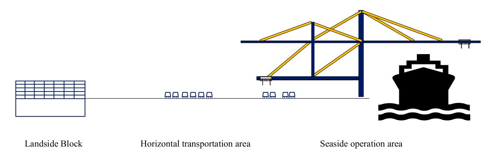

**Figure 1.** The layout of an ACT.

- (2) A method based on the Multi-Agent Deep Deterministic Policy Gradient (MADDPG) strategy in reinforcement learning is developed to solve the AGV path planning problem. Since the scenarios created by the node network are discrete and the MADDPG algorithm is used for a continuous scenario, the Gumbel-Softmax technique is applied to discretize the problem.

The remainder of the paper is organised as follows: Section 2 gives a brief review of the related literature. Section 3 addresses the port layout and task definition and establishes the integer programming model. The Multi-Agent Reinforcement learning algorithm is introduced in section 4. Section 5 shows the results of numerical experiments. Section 6 draws some conclusions and puts forward some suggestions for future research.

# **2. Literature review**

This section summarises the literature related to the AGV path planning problem and related research on reinforcement learning.

# *2.1. AGV path planning problem*

Vehicle path planning involves planning a reasonable path for vehicles from the starting point to the target point to meet the objectives of minimum path length or shortest time. As one of the methods to improve AGV operation efficiency, the path planning problem has been studied by many scholars. Qiu et al. [\(2002\)](#page-16-0) and Fazlollahtabar and Saidi-Mehrabad [\(2015\)](#page-15-0) provided a comprehensive review of methodologies to optimise AGV dispatching and routing problems, respectively. Considering the application scenario of AGVs, the literature on AGV path planning will be reviewed from two aspects: general scenario and port scenario.

# *2.1.1. AGV path planning in the general scenario*

AGV is used as material handling equipment in manufacturing systems, warehouses, and transportation systems.

Many previous researchers have explored the AGV path planning for flexible manufacturing systems, AGVs are responsible for performing material delivery tasks between workstations. Ghasemzadeh, Behrangi, and Azgomi [\(2009\)](#page-15-1) investigated a multi-AGV path search method to avoid network congestion based on a static network graph in the flexible manufacturing system. Nishi, Hiranaka, and Grossmann [\(2011\)](#page-16-1) studied scheduling and conflict-free routing of AGV, set AGV capacity to prevent collision in both paths and nodes. Hu et al. [\(2020\)](#page-15-2) proposed a new real-time scheduling method based on deep reinforcement learning to reduce the completion time and delay rate of AGVs in the flexible shop floor. Drótos et al. [\(2021\)](#page-15-3) proposed a centralised control method, by which the vehicle scheduling was optimised to ensure the conflict free route control of a large fleet of AGVs in the factory scenario. Zhang et al. [\(2021\)](#page-16-2) used the topology map approach to represent the manufacturing workshop transportation network, established an energy-saving path planning model, and proposed a two-stage solution method and particle swarm optimisation algorithm to solve the problem. Farooq et al. [\(2021\)](#page-15-4) investigated the path planning problem of AGV in the production system of textile spinning flow shop, a simplified scheduling model was established to meet the real-time application requirements, and the simulation experiment was carried out with an improved genetic algorithm.

With the development of technology, the application of AGV is gradually extended to other scenarios, such as warehouse and transportation system. Adamo et al. [\(2018\)](#page-15-5) studied the vehicle path and the speed on each arc of the path in the transportation network, so as to avoid vehicle conflict and save energy at the same time, a branch and bound algorithm was proposed to improve the solution efficiency. Fransen et al. [\(2020\)](#page-15-6) proposed a dynamic path planning method for a mobile sorting system, established a graph-representation of grid system layout, and its vertex weight updates with time, so as to avoid deadlock. An et al. [\(2020\)](#page-15-7) studied the conflict path planning of automatic vehicles in a traffic scenario, established the conflict point network and a space–time routing framework, the Dijkstra algorithm with time windows and the k-shortest path (KSP) algorithm were developed to solve this problem.

# *2.1.2. AGV path planning in port scenario*

The horizontal transportation area of an ACT includes roads and intersections. Therefore, many scholars regard the horizontal transportation area of ports as a highway traffic network and use zone control strategy to study path planning, which divide the planning area into multiple non-overlapping areas and restrict the existence of only one vehicle in any area at any time. Kim, Jeon, and Ryu [\(2006\)](#page-15-8) used the grid method and reserved graph technology to study the collision and deadlock of two AGVs during turning. Ho and Liao [\(2009\)](#page-15-9) designed a dynamic zone strategy based on a network guide path to solve the AGV path planning problem in a fixed zone. Li et al. [\(2016\)](#page-15-10) proposed a flow control strategy to avoid AGV congestion in the local area and reduce the probability of collision avoidance. Hu, Dong, and Xu [\(2020\)](#page-15-11) used a topology diagram to study the multi-AGV dispatching and routing problem of the container terminal and proposed a three-stage decomposition algorithm, which combines the A∗ algorithm with the time-window method for AGV path planning.

In addition, some scholars have studied the anticollision problem of AGV path planning in the port, and the effectiveness of the proposed method is verified by simulation. Lehmann, Grunow, and Gunther [\(2006\)](#page-15-12) proposed two different methods to detect AGV deadlock, and their effectiveness was verified by simulation. Park, Kim, and Lee [\(2009\)](#page-16-3) proposed a grid-based deadlock representation, which prevented deadlock by imposing constraints on vehicle movement, simulation results show that this method can significantly improve the operation performance of container terminals. Li et al. [\(2018\)](#page-15-13) developed the probability formula of AGV catch-up conflict and studied the influence of travel time uncertainty on AGV catch-up conflict through simulation.

The truck conflict problem in the traditional container terminal is also useful for solving the AGV conflict prevention path planning problem. Bai et al. [\(2015\)](#page-15-14) developed a set-covering model for the vehicle routing problem based on a novel route representation and a

**Table 1.** Comparison of the AGV path planning in shop floor scenario and ACT scenario.

| Methodology                          | scenarios                                                                                                                        |                                                                                                                                                                                                                  |
|--------------------------------------|----------------------------------------------------------------------------------------------------------------------------------|------------------------------------------------------------------------------------------------------------------------------------------------------------------------------------------------------------------|
|                                      | Shop-floor                                                                                                                       | ACT                                                                                                                                                                                                              |
| <b>Method to describe the system</b> | Paths are described as <b>a mesh</b> or <b>a grid</b> , which is usually considered to be a regular network with nodes and arcs. | <b>Zone control strategy</b> (divide the planning area into multiple non-overlapping areas and restrict the existence of only one vehicle in any area at any time); <b>Grid</b> (network with nodes and arcs) |
| <b>Task</b>                          | Material delivery tasks between workstations. <b>One path consists of a series of tasks.</b>                                     | Container trans-portation between the seaside and landside. <b>One path only completes one task.</b>                                                                                                             |
| <b>Mathematical model</b>            | Mathematical models are <b>rarely established.</b>                                                                               | <b>Conflict avoidance is rarely considered in mathematical models.</b>                                                                                                                                           |
| <b>Objective</b>                     | Minimise the <b>delay time</b>                                                                                                   | Minimise the <b>path length</b> or <b>time</b>                                                                                                                                                                   |
| <b>Solution method/ algorithm</b>    | <b>Simulation, heuristic algorithm</b>                                                                                           | <b>Simulation, heuristic algorithm</b>                                                                                                                                                                           |

container-flow mapping. Zhen [\(2016\)](#page-16-4) studied the truck congestion in the yard and established a combination of probabilistic and physics-based models for truck interruptions. Jin, Lee, and Cao [\(2016\)](#page-15-15) built an integer programming model considering the traffic congestion in the yard and solved the congestion problem by limiting the lane capacity. Li et al. [\(2020\)](#page-15-16) studied the vehicle routing problem with discrete demand and multiple time windows, a branch-and-price-and-cut algorithm is proposed to solve the problem.

The above literature solves the problem of multi AGV path planning in different environments and realises collision avoidance to a certain extent. Table [1](#page-3-0) shows the summary and comparison of the problem, modelling and solution of AGV path planning in the shop floor scenario and the ACT scenario in the existing literature. It can be seen that although there are some commonalities in different scenarios, such as the method to describe the system and the solution method. However, due to the different tasks of AGV in different scenarios, the focus of modelling is different. In a shop-floor system, AGV path planning is usually combined with task scheduling, which is limited by the production process. The path between workstations is usually fixed, after the task sequence is determined, the AGV path is also determined. However, in the ACT, it is still necessary to plan the path for each AGV to complete the task after the task assignment.

Reinforcement learning was initially applied in the game field (Brockman et al. [2016\)](#page-15-17), such as maze exploration, swing arm balance, robot control, etc. In the research of multi-agent reinforcement learning method, Vinitsky et al. [\(2018\)](#page-16-5) used the Arcade learning environment to create a hybrid autonomous traffic controller, which has good performance in hybrid autonomous traffic; Dandanov et al. [\(2017\)](#page-15-18) proposed a reinforcement learning method using base station antenna for capacity and coverage optimisation in the mobile network, which can reduce the overall operation cost and complexity of power grid, and improve network performance.

It is extremely challenging for algorithm development in a multi-agent environment, because the dynamic change of environment violates Markov hypothesis when observing a multi-agent environment from the perspective of a single agent (Sutton and Barto [2014\)](#page-16-6), and Markov hypothesis is the premise of its effectiveness in algorithms such as Q-learning (Watkins and Dayan [1992\)](#page-16-7) and DQN (Mnih et al. [2015\)](#page-16-8). Therefore, many algorithms for multi-agent research have been proposed. Foerster et al. [\(2016\)](#page-15-19) studied two learning methods: RIAL and DIAL, which solved the problem of information sharing between agents in the step of maximising sharing utility by using the idea of centralised learning and distributed execution and introduced a new environment for the study of communication protocol learning methods. Foerster et al. [\(2018\)](#page-15-20) proposed a reinforcement learning method with learning with opponent-learning awareness (LOLA), which can enable multi-agent to cooperate in repeated prisoner's dilemma environment. Samvelyan et al. [\(2019\)](#page-16-9) solved the optimal extraction method of decentralised strategy in centralised learning through QMIX network and verified the efficiency of the algorithm in StarCraft II.

Some scholars apply Reinforcement learning to the field of traffic control. Chen et al. [\(2020\)](#page-15-21) developed a novel framework to utilise the short-term accuracy of mathematical models and high-quality future forecasting of machine learning, and the practicability and feasibility of this method are proved by a practical bus dispatching problem. Lu, Zhang, and Yang [\(2020\)](#page-16-10) proposed a "learning improvement" method to solve the vehicle routing problem, which combines operational research with the learning ability of reinforcement learning. Zhang et al. [\(2020\)](#page-16-11) proposed the Multi-Agent Attention Model to solve the vehicle routing problem, a series of experiment results validate the robustness of the proposed method.

Based on the above summary of the historical developments for the research stream on the AGV path planning problem and reinforcement learning, scholars have done a lot of research on the AGV path planning problem. Their research inspired us. The difference between their research and our research are in the following aspects.

Firstly, in previous study, the zone control strategy has its limitations. For example, if there is a load imbalance between vehicles in different zones, it can not always meet the transportation needs of the system (Ho and Liao [2009\)](#page-15-9). Many studies describe the system as a grid, with nodes representing tasks and arcs representing a path. However, AGVs do not occupy nodes or arcs, but fields. The path planning of AGV in the port is real-time, and the time accuracy considered in the path planning is very small. The long path represented by an arc in the grid can not meet the requirements of AGV for the realtime path. Therefore, a new method is needed to describe the AGV path planning problem, which can describe the path more precisely, to meet the actual requirements of ACT.

In addition, although the driving rules of the ACT are complex, the driving direction of the port road is pre-specified, the existing studies rarely consider the limitations of driving direction. Previous literature reduces the probability of AGV conflict by adjusting the speed, increasing the penalty function, and predicting the conflict. Or the initially generated paths do not have anticonflict characteristics and need to be adjusted to find an alternative path. However, there are few studies on generating conflict-free paths for multiple AGVs at the same time. A mathematical model needs to be established considering the characteristics of ACT to set the constraints, in which the constraints of path conflict should also be considered.

The literature on AGV path planning is mostly solved by simulation or heuristic algorithms. Some scholars use reinforcement learning/machine learning to solve VRP problem and compare it with traditional commercial solvers and heuristic algorithms. The experimental results show that reinforcement learning/machine learning has a better solution effect. As an extension of the application of reinforcement learning, there is little literature on conflict-free path planning problems, which needs further research. The reinforcement learning algorithm to solve conflict-free path planning problems needs further study.

The anti-conflict path planning problem of AGV in the ACT needs to consider the characteristics of the ACT

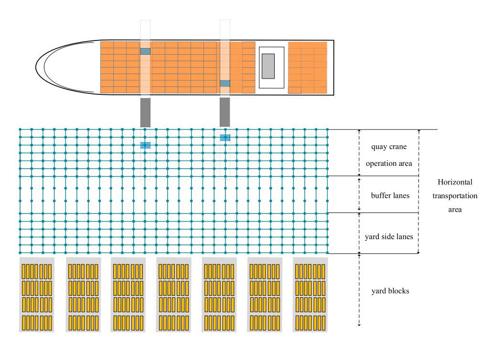

**Figure 2.** The node network of the terminal.

and the demand for solution efficiency in the practical application, so as to provide decision support for the operation of the ACT. In this paper, a new method for describing the AGV path planning problem is proposed considering the characteristics of the ACT, and an integer programming model is established to find the shortest path for multi-AGVs at the same time, and also takes into account the driving direction of AGVs and the conflict between paths. To effectively solve this problem, reinforcement learning based on the multi-agent deep deterministic policy gradient (MADDPG) is designed.

# **3. Problem description and mathematical model**

# *3.1. Problem description*

The main steps of AGV operation are as follows: firstly, receive the container operation task instruction; then, plan a reasonable path to the loading/unloading position of the operation task instruction; next, work with the handling equipment to load the container to the AGV/unload the container from the AGV, so as to complete the loading/unloading operation; finally, wait for the next task instruction.

The task assignment of AGVs is completed in the upper-level decision. Since the AGV path planning problem is an optimisation problem of the operational level, the planning horizon is relatively short. In this case, most AGV can only complete one task during the planning horizon. In this research, we only consider the path planning for the first task of each AGV during such short planning horizon. For a longer planning horizon, our algorithm can be incorporated into a rolling horizon optimisation approach.

Planning the shortest path for each AGV while ensuring that there is no conflict between the paths is the key factor affecting the operation efficiency of the terminal. This paper takes Shanghai Yangshan Deepwater Port phase IV as the research object, which is the largest automated container terminal in the world. There are 61,199 magnetic nails buried in the underground of Yangshan phase IV so that AGV can sense its position and guide AGV to drive.

# *3.1.1. Development of port layout*

The horizontal transportation area of the ACT is an area with regular shape and unmanned operation. Unlike the general manufacturing system, there are no obstacles or workstations in this area. In order to precisely describe the AGV path planning problem in the ACT, according to the characteristics of magnetic nail guided driving, a node network of port layout is constructed, as shown in Figure [2.](#page-5-0) After the task assignment, AGV needs to go through several nodes to complete the task.

Ignoring the acceleration and deceleration of the AGV during driving, the horizontal distance between the nodes is the distance that the AGV drives at the maximum speed per second, while the vertical nodes count as one node per lane. As shown in Figure [2,](#page-5-0) the horizontal transportation area of the ACT is generally divided

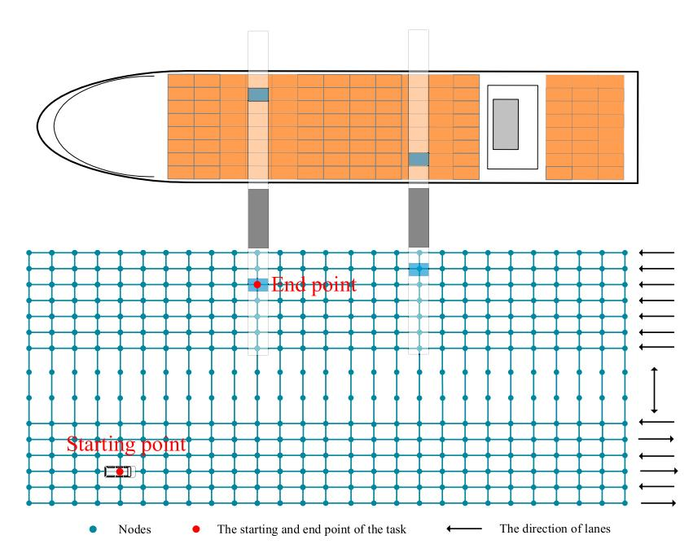

**Figure 3.** The driving rules of AGV.

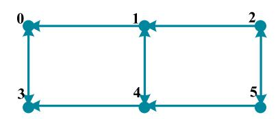

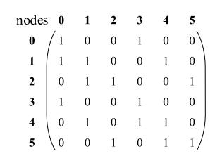

**Figure 4.** Example of the adjacency matrix.

into the following three parts: quay crane operation area, buffer lanes, and yard side lanes. In this paper, the anticonflict AGV path planning in the horizontal transportation area is investigated.

# *3.1.2. Driving rules*

AGV can only be located at a certain node at any time and stay at the current position or drive to the adjacent nodes allowed by the rules at any time. Each node can hold at most one AGV. AGVs are not allowed to travel outside the network. As shown in Figure [3,](#page-6-0) in the horizontal direction, there are seven one-way lanes in the quay crane operation area, and six one-way lanes arranged alternately in the lane at the yard side; the nodes in the vertical direction are bidirectional.

The adjacency matrix is set according to the driving rules of the ACT to constrain the driving direction of AGV in the mathematical model. Figure [4\(](#page-6-1)a) shows the driving rules when there are 6 nodes. The adjacent nodes can pass through each other in the vertical direction, and only the right node can reach the adjacent left node in the

horizontal direction. Figure [4\(](#page-6-1)b) shows the corresponding adjacency matrix. 1 means it can be reached, 0 means it can not be reached. Taking the first line as an example, node 0 can only reach node 0 (indicating that the AGV can stay at this node) and node 3.

# *3.1.3. The definition of task*

Generally, the tasks of ACTs are divided into loading tasks and unloading tasks. The loading task is that the AGV picks up the container and transports it to the designated quay crane operation position through the horizontal transportation area, while the unloading task is the opposite.

Due to the short period of AGV path planning, the task definition in this paper is different from the traditional definition of loading and unloading tasks. In other words, this paper does not distinguish whether the task is a loading task or an unloading task, only the starting and end points of AGV tasks are considered. And the AGV path planning is to generate the path from the current position to the end point.

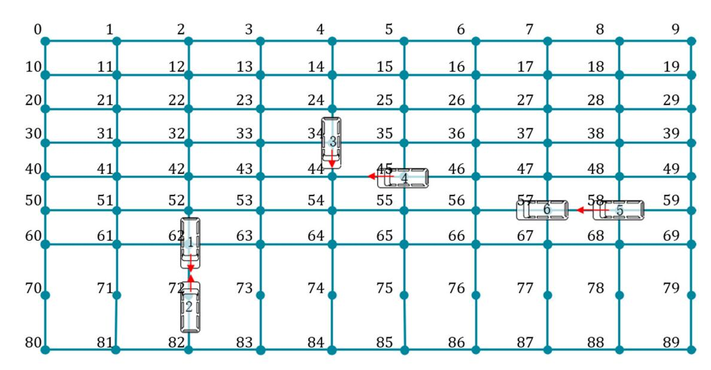

**Figure 5.** The conflict situations of AGVs.

# *3.1.4. Conflict situation*

According to the node network of port layout and the real situation of the ACT, two conflict situations are shown in Figure [5:](#page-7-0) opposite conflict and same point occupation conflict. AGV1 and AGV2 show the situation of opposite conflict: AGV 1 drives from node 62 to node 72, while AGV 2 drives from node 72 to node 62. There are two kinds of cases for same point occupation conflict: in case 1, AGV 3 drives from node 34 to node 44, while AGV 4 drives from node 45 to node 44; and in case 2, AGV 5 drives from node 58 to node 57, while AGV 6 stops at node 57 (waiting in place due to avoiding other AGVs or loading and unloading operations).

# *3.2. Mathematical model*

In this section, assumptions, notations, model formulation, and linearisation of the model are demonstrated, respectively.

# *3.2.1. Assumptions*

The following assumptions have been made when formulating the model.

- (1) The initial position of AGV and task assignment are known;
- (2) We consider AGV planning problem within a short period, and only one task is assigned to each AGV;
- (3) The maximum battery capacity of AGV is enough to ensure the energy consumption of the assigned task;
- (4) The conflict between the lane inside the yard and AGV-mate exchange area is not considered.

# *3.2.2. Notations*

In this section, indices, sets, parameters, and decision variables of the model are demonstrated, respectively.

### **Indices:**

| <i>i</i> , <i>j</i> , <i>m</i> , <i>n</i> | index of nodes.      |
|-------------------------------------------|----------------------|
| <i>k</i>                                  | index of AGVs.       |
| <i>t</i>                                  | index of time steps. |

### **Sets:**

| K   | the | set    | of  | AGVs, | K =         | K 1 ∪   | K         | 2 |     |            |
|-----|-----|--------|-----|-------|-------------|---------|-----------|---|-----|------------|
| K 1 | the | set    | of  | AGVs  | with        | tasks   |           |   |     |            |
| K 2 | the | set    | of  | AGVs  | without     | tasks   |           |   |     |            |
| N   | the | set    | of  | nodes | (indexed    | by      | i         | , | j ) |            |
| Ns  | the | set    | of  | AGV   | starting    | points, |           |   | N   | s ∈ N      |
| Ne  | the | set    | of  | AGV   | end         | points, | N         | e | ∈   | N          |
| k   | the | set    | of  | nodes | of AGV      | k ,     | excluding |   |     | its start |
|     | ing | points |     | and   | end points, |         | Nr        |   |     |            |
|     |     |        |     |       |             |         | k         |   | =   | N \ ( n s  |
|     |     |        |     |       |             |         |           |   |     | k ∪ ne     |
|     |     |        |     |       |             |         |           |   |     | k )        |
| T   | the | set    | of  | time  | steps,      | T ={    | 1, 2,     |   |     | , t max }  |
| T  | T  | =      | T \ | t max |             |         |           |   |     |            |

### **Parameters:**

#### **Decision variables:**

 $\alpha_{kij}$  a b binary variable, equals 1 if node  $i$  is passed through immediately before node  $j$  by AGV  $k$ , 0 otherwise,  $i, j \in N, i \neq j, k \in K$ 

 $\beta_{kit}$  a binary variable, equals 1 if AGV  $k$  is at node  $i$  at time  $t$ , 0 otherwise,  $i \in N, k \in K, t \in T$ 

## *3.2.3. Model formulation*

$$\text{min} \quad 0.5 \sum_{i \in N} \sum_{t \in T'} \sum_{k \in K} |\beta_{kit} - \beta_{ki(t+1)}| \quad (1)$$

subject to:

$$\sum_{j \in N} \alpha_{k, n_k^s, j} = 1, \forall k \in K \quad (2)$$

$$\sum_{i \in N, i \neq j} \alpha_{kij} = \sum_{m \in N, m \neq j} \alpha_{kjm}, \forall k \in K, j \in N_k^r \quad (3)$$

$$\sum_{i \in N} \alpha_{k,i,n_k^e} = 1, \forall k \in K \quad (4)$$

$$\alpha_{kij} \leq C_{ij}, \forall k \in K, i, j \in N, i \neq j \quad (5)$$

$$\beta_{k,n_k^s}^s = 1, \forall k \in K \quad (6)$$

$$\beta_{k,n_k^s} = 1, \forall k \in K_2, t \in T \quad (7)$$

$$\sum_{i \in N} \beta_{kit} = 1, \forall k \in K, t \in T \quad (8)$$

$$\sum_{k \in K} \beta_{kit} \leq 1, \forall i \in N, t \in T \quad (9)$$

$$\beta_{kit} \leq \sum_{j \in N} C_{ij} \cdot \beta_{kj(t+1)}, \forall k \in K, i \in N, t \in T' \quad (10)$$

$$(t+1) \cdot |\beta_{k,n_k^e,t+1} - \beta_{k,n_k^e,t}| \leq l_k, \forall k \in K_1, t \in T' \quad (11)$$

$$\begin{aligned} C_{i j \cdot (\beta_{nit} \cdot \beta_{mjt} + \beta_{mi(t+1)} \cdot \beta_{nj(t+1)}) &\leq 1, \\ \forall m, n \in K, m \neq n, t \in T', i, j \in N, i \neq j \end{aligned} \quad (12)$$

$$\sum_{i \in N} \alpha_{kij} \leq \sum_{t \in T} \beta_{kjt}, \forall k \in K, j \in N \quad (13)$$

$$\alpha_{kij} \in \{0, 1\}, \forall k \in K, i, j \in N \quad (14)$$

$$\beta_{kit} \in \{0, 1\}, \forall k \in K, i \in N, t \in T \quad (15)$$

Objective (1) is to minimise the path length. By minimising the number of nodes AGV pass through, the shortest path is obtained. Constraints (2) guarantee that there is one and only one connection point after the starting point of AGV *k*. Constraints (3) are flow balance constraints except starting and end point. Constraints (4) guarantee that there is one and only one connection point before the end point of AGV *k*. Constraints (5) ensure that the nodes must be connected before AGV can pass through. Constraints (6) ensure that the AGV is located at the specified initial position at the initial moment. Constraints (7) guarantee that the AGV without tasks stays at the starting point. Constraints (8) guarantee that at any given time step, the AGV will only be at one certain node. Constraints (9) limit the number of AGVs that can be held by any node at any time, mainly to prevent the occupying of the same point. Constraints (10) ensure the moving rule of AGVs, that is, AGV can only drive to the node connected with the current node. Constraints (11) ensure that the AGV must reach the destination within the specified time. Constraints (12) prevent the opposite conflict, that is, two AGVs can't drive to each other's current node at the next time step. Constraints (13) are the relationship between two decision variables. Constraints (14) and (15) are the integer restrictions of the decision variables.

# *3.2.4. Linearisation*

Since the objective function (1), constraints (11), and constraints (12) are all nonlinear functions, new auxiliary decision variables will be defined to linearise the original model. Then the model can be transformed into:

$$\min \quad 0.5 \sum_{i \in N} \sum_{t \in T'} \sum_{k \in K} \omega_{kit} \quad (16)$$

subject to:

Constraints (2)-(10), (13)-(15)

$$\omega_{kit} \geq \beta_{kit} - \beta_{ki(t+1)}, \forall k \in K, i \in N, t \in T' \quad (17)$$

$$\omega_{kit} \geq \beta_{ki(t+1)} } - \beta_{kit}, \forall k \in K, i \in N, t \in T' \quad (18)$$

$$(t+1) \cdot \tau_{k,n_{k,t}^e} \leq l_k, \forall k \in K, t \in T' \quad (19)$$

$$\tau_{k, n_{k,t}^e \geq \beta_{k,n_{k,t}^e+1} - \beta_{k,n_{k,t}^e}, \forall k \in K, t \in T' \quad (20)$$

$$\tau_{k,n_k^e,t} \geq \beta_{k,n_k^e,t} - \beta_{k,n_k^e,t+1}, \forall k \in K, t \in T' \quad (21)$$

$$C_{ij} \cdot (\varphi_{nmijt} + \varphi_{nmij(t+1)}) \leq 1, \forall m, n \in K, m \neq n, t \in T',$$

$$i, j \in N, i \neq j \quad (22)$$

$$\varphi_{nmijt} \geq \beta_{nit}+\beta_{mjt}-1, \forall m, n \in K, m \neq n, t \in T,$$

$$i, j \in N, i \neq j \quad (23)$$

$$\varphi_{nmijt} \geq \beta_{mit} + \beta_{njt} - 1, \forall m, n \in K, m \neq n, t \in T,$$

$$i, j \in N, i \neq j \quad (24)$$

$$\omega_{kit} \in \{0, 1\}, \forall k \in K, i \in N, t \in T \quad (25)$$

$$\tau_{k,n_k^e,t} \in \{0, 1\}, \forall k \in K, t \in T \quad (26)$$

$$\varphi_{nmijt} \in \{0, 1\}, \forall m, n \in K, m \neq n, t \in T, i, j \in N, i \neq j \quad (27)$$

The new auxiliary decision variable  $\omega_{kit}$  is defined to substitute parts  $|\beta_{kit} - \beta_{ki(t+1)}|$ . The objective function (1) is linearised by constraints (16), (17), and (18). The new auxiliary decision variable  $\tau_{k,n_k^t}$  and  $\varphi_{nmijt}$  are

defined to substitute parts |β*k*,*ne k*,*t*+1 − β*k*,*ne k*,*t*| and β*nit* · β*mjt*, respectively. Constraints (19)–(21) and constraints (22)–(24) are the linearised formulas of constraints (11) and constraints (12), respectively. Constraints (25)–(27) are the integer restrictions of the new auxiliary decision variables.

# **4. Multi-agent reinforcement learning algorithm**

Compared with the grid method in general scenarios using nodes to represent workstations, the node is used to represents the position of AGV at each time step in the modelling method proposed in this paper, which is larger in scale, more complex, and requires higher efficiency of the algorithm. The existing literature on AGV path planning is mostly solved by simulation or heuristic algorithms. In order to further improve the solution efficiency and meet the requirements of the ACT for solution quality, a multi-agent reinforcement learning method Based on multi-agent deep deterministic policy gradient (MADDPG) is proposed to solve the AGV path planning problem in the terminal.

# *4.1. Algorithm introduction*

Reinforcement learning is one of the paradigms of machine learning. Agents interact with the environment by trial and error and guide their behaviour through reward and punishment mechanism to obtain the maximum reward. The common model is the standard Markov decision process (MDP). In the path planning of the single AGV, the task path of each AGV can be described as a MDP.

Since the the environment of multi-agent violates the Markov hypothesis, we call Markov decision processes as partially observable Markov games. For a Markov game with  $K$  agents, whose state set is  $S$ , we give the following definition:  $A_1, \dots, A_K$  is the action set of  $K$  agents,  $O_1, \dots, O_K$  is the observation set of  $K$  agents. Each agent  $k$  obtains the next action through random policy  $\pi_k: O_k \times A_k \mapsto [0, 1]$ , and the whole process can be described by transfer equation:  $\Gamma: S \times A_1 \times \dots \times A_K \mapsto S$ . Each agent  $k$  obtains the reward of executing the action in the current state through the reward function:  $r_k: S \times A_k \mapsto \mathbb{R}$ . The goal of each agent  $k$  is to maximise the total expected reward:  $R_t = \sum_{t=0}^T \gamma^t r_k^t$ , where  $\gamma$  is the discount factor, which ranges from 0 to 1. The smaller the value of  $\gamma$  is, the greater the impact of the reward brought by the current action is, while the larger the value of  $\gamma$  is, the greater the impact of the reward brought by the future action is.

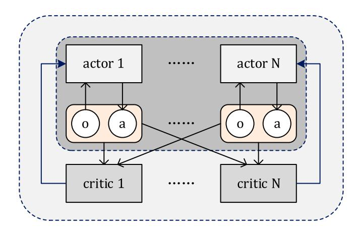

**Figure 6.** The actor-critic structure of the agents.

However, the traditional reinforcement learning methods such as Q-learning or policy gradient algorithm cannot be well applied to the multi-agent environment, since the strategy of each agent changes with the training process. For a single agent, the environment becomes unstable, which affects the learning stability of the model directly invoking the historical data in the experience pool for training. On the other hand, the high square error brought by multi-agent has a certain impact on the traditional algorithm. Therefore, Lowe et al. [\(2017\)](#page-16-12) proposed a multi-agent deep deterministic policy gradient (MADDPG). In this algorithm: 1. The agent can make the next action through its local information; 2. It does not need the derivative property of environment interaction, and the interaction method between agents does not need to be specially set; 3. It can be used in a competitive environment or cooperative environment, and the application scenarios are very wide.

As shown in Figure [6,](#page-9-0) each agent has an actor-critic structure. Through the actor network, AGV can make an action according to the current state, while the critic network scores the actor's performance according to the state and action, and feeds back to the actor network, so that the actor can adjust its strategy according to the score, and strive for better performance next time. In addition, each critic network can receive the information of all agents and make better evaluations for its corresponding agents.

In the Q-learning method, *Q*π (*s*, *a*) usually represents the action-value function of policy π, which is used to estimate how good an agent is to select an action in a certain state. For an environment with *K* agents, suppose that the parameter of the policy is given as θ = {θ1, ... , θ*K*},π ={π1, ... , π*K*} is the set of policy functions of the agent. The centralised action value function is *Q*π *k* (*x*, *a*1, ... , *aK*), its input is the actions of all agents (*a*1, ... , *aK*), and the additional information *x*, which contains the observations of all agents, and output is the *Q*-value of agent *k*.

In a polocy gradient algorithm, the parameter  $\theta$  of policy  $\pi$  is usually adjusted directly to maximise the objective function  $J(\theta) = \mathbb{E}_{s \sim p^\pi, a \sim \pi_\theta}[R]$ , where  $p^\pi$  is the state distribution. In the multi-agent environment, the expectation of the policy gradient of each agent  $k$  is  $J(\theta_k) = \mathbb{E}[R_k]$ , which can be written as follows:

$$\nabla_{\theta_k} J(\theta_k) = \mathbb{E}_{s \sim p^\pi, a \sim \theta_\theta} [\nabla_{\theta_k} \log \pi_k(a_k|s_k) Q_k^\pi(x, a_1, \dots, a_K)] \quad (28)$$

The gradient extended to the deterministic policy *µ*θ*k* (abbreviated as *µk*) can be expressed as follows:

$$\nabla_{\theta_k} J(\boldsymbol{\mu}_k) = \mathbb{E}_{x, a \sim \mathbf{D}}[\nabla_{\theta_k} \boldsymbol{\mu}_k(a_k | o_k)]$$

$$\nabla_{a_k} Q_k^{\boldsymbol{\mu}}(x, a_1, \dots, a_K)|_{a_k=\boldsymbol{\mu}_k(o_k)}] \quad (29)$$

 $D$  is the refore a buffer, stored the experience of all agents in tuple form  $(x, x', a_1, \dots, a_K, r_1, \dots, r_K)$ . The loss function is expressed as  $\mathcal{L}(\theta)$ , which is used to approximate the real  $Q$  function by sampling:

$$\mathcal{L}(\theta_k) = \mathbb{E}_{x,a,r,x'}[(Q_k^\mu(x, a_1, \dots, a_K) - y)^2],$$

$$y = r_k + \gamma Q_k^{\mu'}(x', a_1', \dots, a_K')|_{a_l'=\mu_l'(a_l)} \quad (30)$$

Multiple samples are integrated during the training, which can improve the stability of learning. If the number of random samples in an iteration is *C*, the loss function after integration is:

$$\mathcal{L}(\theta_k) = \frac{1}{C} \sum_j (y^j - Q_k^\mu(x^j, a_k^j, \dots, a_K^j))^2 \quad (31)$$

The integration gradient of *J* function is:

$$\nabla_{\theta_k} J \approx \frac{1}{C}{j} \sum_j \nabla_{\theta_k} \boldsymbol{\mu}_k(o_k^l) \nabla_{a_k} Q_k^{\boldsymbol{\mu}}(x^l, a_k^l, \dots, a_K^l)|_{a_l'=\boldsymbol{\mu}_l'(o_l)} \quad (32)$$

# *4.2. Environment creation*

We use *s t k* to represent the position of the AGV *k* at time *t* and *at k* to represent the action of the AGV*k* after time *t*. Therefore, the complete path of a task of any AGV can be represented by a tuple (*s* 1 *k*, *a*1 *k*,*s* 2 *k*, *a*2 *k*, ... ,*s T k* ), where *T* represents the end time of the task. In the problem description, we have given clear AGV task definition and driving rules, so we can set the multi-AGV path planning as a cooperative environment. To describe the flow direction of the lanes, the power direction attribute is given to each node according to the layout of the port, only when the velocity direction of AGV is consistent with the

power direction can the driving rules be met. Judgment is made when AGV random sampling action is carried out. When the velocity direction of the AGV is contrary to the power direction of the node, velocity drops to 0, the AGV will stop at the node, wait for the next action at the next time step, and increase the corresponding penalty in the reward function.

The conflict risk between AGV *k* and *k* can be obtained through the distance function:

$$d(s_k^t, s_{k'}^t) > d_{\min} \quad (33)$$

*d*min is the shortest distance between two AGVs. For example, *d*min = 1 means that there is one unit distance between two AGVs. When the distance between two AGVs is less than the threshold *d*min, the repulsive force between AGVs will be generated until the AGVs in the next state meet the minimum distance requirement.

*rt k*(*s t k*, *at k*) is used to represent the immediate reward of the AGV when it acts at time *t*, that is, the distance from AGV to the task point is taken as the main reward, and the extra penalty value is given if the AGVs are too close or violate the traffic rules.

$$r_k^t(s_k^t, a_k^t) = \begin{cases} -10 & \text{when AGV conflicts} \\ -5 & \text{when AGV violates driving rules} \\ -1 & \text{every step of AGV} \end{cases} \quad (34)$$

# *4.3. Network structure*

As shown in Figure [7,](#page-11-0) the orange arrow indicates the direction of the data flow, and the gray arrow indicates the direction of the information flow. Agent\_0 and Agent\_1 represent AGV vehicle 0 and vehicle 1; agent\_0\_1 and agent\_1\_1 represents the task end point of vehicle 0 and 1 respectively. It can be seen that the whole network structure has a brain, which transmits the next action to the vehicle through calculation. The information flow between the vehicle and the task points feeds back the immediate reward of the current direction of the vehicle.

# *4.4. Gumbel-Softmax sampling method*

Since the traditional MADDPG needs the action space to be continuous, and the port driving environment constructed in this paper is discrete, which requires the discretization of action space. The Gumbel-Softmax strategy (Jang, Gu, and Poole [2016\)](#page-15-22) can not only meet the requirements of discrete action in the terminal environment but also maintain the conductibility of the action space. The specific process of Gumbel-Softmax sampling strategy is as follows:

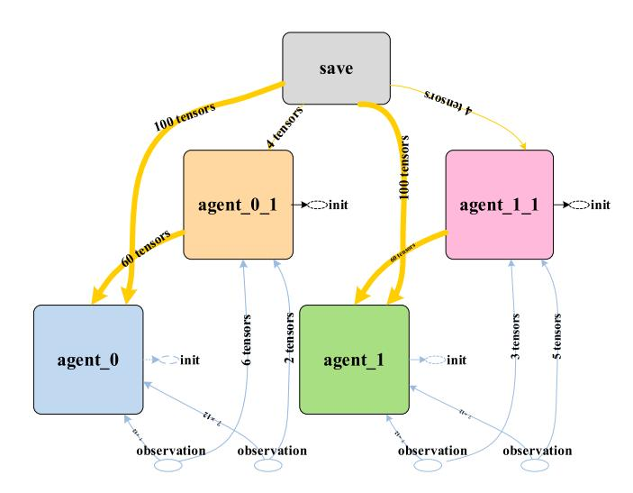

**Figure 7.** The network structure.

- (1) For an  $n$ -dimensional vector  $\mathbf{v}$  of Multi-Layer Perceptron (MLP) output,  $n$  independent samples  $\varepsilon_1, \varepsilon_2, \dots, \varepsilon_n$  with uniform distribution  $U(0, 1)$  are generated;
- (2)  $G_i$  is a random variable of the standard Gumbel distribution, which is calculated by formula  $G = -\log(-\log(\varepsilon_i))$ ;
- (3) A new value vector is obtained by corresponding addition  $\mathbf{v}' = [\mathbf{v}_1 + G_1, \mathbf{v}_2 + G_2, \dots, \mathbf{v}_n + G_n]$ ;
- (4) The final category is obtained by calculing the probability by Softmax function  $\sigma_\tau(\mathbf{v}'_l) = e^{\frac{v'_l}{\tau}}$

# *4.5. Algorithm procedure*

As shown in Figure 8, the behaviour policy is applied to the sampling data, which is represented by  $\varphi$ . In MADDPG, Uhlenbeck-Ornstein random process (UO process) (Toda 1958) is conducted as the noise of the input data. The UO process has a good correlation in time sequence, which can make agents better explore the environment with momentum attribute.

**Table 2.** Algorithm Procedure: MADDPG in AGV path planning.

### Algorithm: MADDPG in AGV path planning

Input: AGV historic route

Output: Model parameter  $\theta$ , Decision function  $\mu$ 

- **for** episode = 1 to *Mdo*  Initialise a random process *H* for action exploration  Receive initial state *x*  **fort** = 1 to max-episode-length **do**    for each AGV *k*, select action  $a_k = \mu_{\theta_k}(a_k) + H_k$ , w.r.t. the current policy and exploration    Execute actions  $a = (a_1, a_2, \dots, a_k)$  and observe reward *r* and new state *x'*    Store  $(x, a, r, x')$  in replay buffer **D**     $x \leftarrow x'(9)$
- 8:  $x \leftrightarrow x'(9)$   
   9: **for** agent  $k = 1$  to  $Kdo$   
   10: Sample a random minibatch of  $C$  samples  $(x', a', r', x'')$  from  $D$   
   11: Set  $y' = r'_k + \gamma Q_k^{\mu'(x'', a', \dots, a_N')|_{a'_k = \mu_k'(a'_k)}$   
   12: Update critic by minimising the loss  
   $\mathcal{L}(\theta_k) = \frac{1}{C} \sum_i (y' - Q_k^\mu(x', a'_k, \dots, a'_k))^2$
- $\mathcal{L}(\theta_k) = \frac{1}{C} \sum_j (y^j - Q_k^\mu(x^j, a_k^j, \dots, a_k^j))^2$ 

  13: Update actor using the sampled policy gradient:

  $$\nabla_{\theta_k} \approx \frac{1}{C} \sum_j \nabla_{a_k} \mu_k(a_k^j) \nabla_{a_k} Q_k^\mu(x^j, a_k^j, \dots, a_k^j)|_{a_k^j}$$
- $\nabla_{\theta_k} J \approx \frac{1}{C} \sum_j \nabla_{\theta_k} \mu_k(a_k^j) \nabla_{a_k} Q_k^\mu(x'_j, a_k', \dots, a_k')|_{a_j'=\mu_j'(a_j)}$ 

  14: **end for**

  15: Update target network parameters for each agent  $k$ :

   $\theta'_k \leftarrow \eta \cdot \theta_k + (1 - \eta)\theta'_k$ 

  16: **end for**

  17: **end for**

The procedure of the algorithm ism is illustrated in Table 2. Random sampling is carried out by  $\varphi$  policy without historical data. After getting the initial position of AGVs and the end position of tasks, the initial time update is carried out. After each time update, the current status of each AGV is obtained by random sampling, and all AGV positions at the next time step are obtained by the environment, that is, the AGV status at the next time step.

After getting the experience pool of historical data, the learning process begins. Firstly,  $C$  samples were randomly selected from the historical data experience pool  $D$ . In the process of random sampling, the mini-batch technique (Fujii 2018) in machine learning is used to reduce the number of samples needed for learning, so as to reduce the calculation time and amount. Iterating through the critic and actor network of each AGV, the

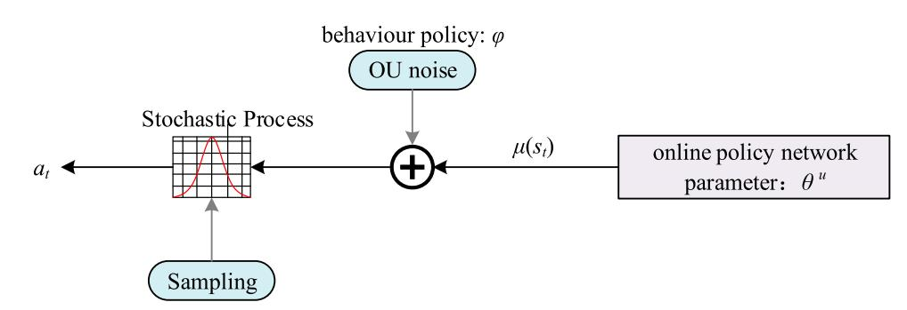

**Figure **Figure 8.** The process of sampling data.**

average approximatioion  $Q$  function error  $\mathcal{L}(\theta_k)$  of the  $F$  samples extracted in the current iteration is reduced by the training of the critic network, and then the deterministic policy gradient  $\nabla_{\theta_k} J$  of each AGV is updated with the same idea. After completing these two steps, update the  $\theta_k'$  and the data in the experience pool. And repeat the sampling to the training process, until the training episode reaches the specified number of episodes  $M$ , the training is terminated.

# **5. Numerical experiment**

In this Section, a series of numerical experiments are conducted to evaluate the effectiveness of the proposed model and solution method.

# *5.1. Parameter setting*

In this section, the AGV path optimisation problem in the horizontal transport area corresponding to one berth position is considered, small-scale and large-scale cases are used to verify the feasibility and effectiveness of the model and the algorithm. In this paper, the parameter is set as: ρ = 0.1. The smaller ρ is, the higher the spatial dispersion is. Other relevant parameters are based on the Shanghai Yangshan Deepwater Port phase IV. The coastline of the port is 2350 m long and the width of the operation area in front of the port is 120.5m. The maximum driving speed of AGV is 6m/s in horizontal direction and 8m/s in vertical direction.

The number of nodes ranges from 45 to 135, the number of AGVs ranges from 2 to 5, and the duration ranges from 15 to 25. Among them, the cases with nodes between 45 and 75 are small-scale ones, and those between 90 and 135 are large-scale ones.

# *5.2. Benchmarks*

We compare the MADDPG with the commonly-used baseline IBM ILOG CPLEX and the time-window based Dijkstra algorithm.

# (1) ILOG CPLEX

IBM ILOG CPLEX Optimisation Studio is a prescriptive analytics solution that enables rapid development and deployment of decision optimisation models using mathematical and constraint programming, which are widely used to solve integer programming problems. The mathematical model was programmed by C# and solved by ILOG CPLEX 12.5.

# (2) The time-window based Dijkstra algorithm

**Table 3.** Algorithm Procedure: The time-window based Dijkstra algorithm.

**Algorithm**: The time-window based Dijkstra algorithm in AGV path planning

1: Initialise the adjacency matrix *Cij* and node matrix *Hit* to record the weather node *i* is occupied in time *t* 2: Generate AGV priority list *Kp* 3: **While ()** 4: Plan a path *P* for the AGV *k* = 1 using the Dijkstra algorithm and update the node matrix *Hit* 5: Plan a path *P'* for the AGV *k*' using the Dijkstra algorithm and record the time of all nodes occupied by *P'* to generate new matrix *H* 6: *Same point occupation conflict detection*: Compare two matrixes whether there is conflict: if there is a conflict, mark the conflict node as unavailable and go to Step 5 if there is no conflict, go to *Opposite collision detection* 7: *Opposite collision detection*: Checks whether the adjacent node of the current node is occupied at the current time: if there is a conflict, mark the conflict node as unavailable and go to Step 5 if there is no conflict, *k'* = *k'*+1, update the node matrix *Hit*, go to Step 5 8: if all path planning has been completed **break**;

The time-window based Dijkstra algorithm was first proposed by (Kim and Tanchoco [1991\)](#page-15-24). At first, it was to search the optimal path without conflict in the bidirectional graph according to the system traffic conditions. As a predictive anti-conflict algorithm, the time-window method has been studied by many researchers (An et al. [2020\)](#page-15-7). In this paper, the Dijkstra algorithm and the timewindow method are combined to plan the conflict free path for AGVs. The specific implementation steps are as shown in Table [3.](#page-12-0) Because of the randomness of the heuristic algorithm, we set up to run each case 10 times, and take its average value as the result of the case. The time-window based Dijkstra algorithm was programmed by Python (3.5.4).

# (3) MADDPG

We use the data generated by random sampling to train the network. When the training time reaches about 4 h, the training results tend to be stable. The dependencies needed to create the MADDPG algorithm environment are: Python (3.5.4), OpenAI gym (0.10.5), TensorFlow (1.8.0), NumPy (1.14.5). Experiments are run on an Intel Core i7 (Nvidia GeForce RTX 2080 SUPER(8GB)) computer with 32G RAM and 3.6 GHz CPU.

# *5.3. Experimental results of small-scale cases*

The specific information about small-scale cases is shown in Table [4.](#page-13-0)

We compared the numerical experimental results of the MADDPG with the result directly solved by the CPLEX solver and the Dijkstra algorithm. The smallscale experimental results shown in Table [5](#page-13-1) verify the

**Table 4.** Details of small-scale cases.

| Case ID |                |           |    |                  |                 |
|---------|----------------|-----------|----|------------------|-----------------|
|         | Number of      |           |    |                  |                 |
|         | Nodes (15 ∗ n) |           |    |                  |                 |
|         |                | Number of |    |                  |                 |
|         |                |           |    | (starting        | point,          |
|         |                |           |    | end              | point)          |
| S1      | 45             | 2         | 15 | (11,33),         | (34,10)         |
| S2      | 45             | 2         | 15 | (5,36),          | (40,7)          |
| S3      | 45             | 2         | 15 | (45,13),         | (6,41)          |
| S4      | 45             | 3         | 15 | (3,27),          | (4,28), (5,29)  |
| S5      | 45             | 3         | 15 | (29,38),         | (41,9), (38,8)  |
| S6      | 60             | 2         | 20 | (55,24),         | (3,46)          |
| S7      | 60             | 2         | 20 | (6,18),          | (44,26)         |
| S8      | 60             | 3         | 20 | (57,18),         | (11,10), (59,7) |
| S9      | 75             | 2         | 20 | (72,49),         | (7,15)          |
| S10     | 75             | 3         | 20 | (4,50), (49,23), | (62,28)         |

effectiveness of the model and the algorithms. It can be seen from the table that the feasible solution of case S5 is not obtained under the Dijkstra algorithm. The reason is that when the rule-based Dijkstra algorithm is used for multi-AGV path planning, the AGV with high priority can choose the path first, which will reduce the solution space of AGV with low priority for path planning, and even can not produce a feasible path.

The performance comparison results are also shown in Table [5.](#page-13-1) It is obvious that although the Dijkstra algorithm has greatly improved the solving time, its solution quality is poor, and the average GAP between the Dijkstra algorithm and CPLEX is 12.30%. The MAD-DPG algorithm has high solution quality, which the average GAP between MADDPG and CPLEX is only 0.73%, and its solution time is also in an acceptable range.

# *5.4. Experimental results of large-scale cases*

The specific information about large-scale cases is shown in Table [6.](#page-13-2)

Table [7](#page-14-0) shows the numerical experimental results of large-scale cases of three methods. With the scale of the

**Table 6.** Details of large-scale cases.

| Case ID | Number of Nodes (15*n) | Number of AGVs | Time period | (starting point, end point)                    |
|---------|------------------------|----------------|-------------|------------------------------------------------|
| L1      | 90                     | 2              | 25          | (50,3), (16,20)                                |
| L2      | 90                     | 3              | 25          | (6,88), (2,73), (69,19)                        |
| L3      | 105                    | 3              | 25          | (16,57), (96,18), (59,19)                      |
| L4      | 105                    | 4              | 25          | (27,73), (101,5), (18,62), (30,58)             |
| L5      | 105                    | 5              | 25          | (17,84), (57,40), (27,94), (6,55), (32,71)     |
| L6      | 120                    | 4              | 25          | (7,61), (70,108), (33,110), (85,45)            |
| L7      | 120                    | 5              | 25          | (28,113), (47,105), (62,19), (63,56), (118,71) |
| L8      | 135                    | 3              | 25          | (70,131), (11,63), (8,109)                     |
| L9      | 135                    | 4              | 25          | (51,62), (38,66), (133,10), (106,45)           |
| L10     | 135                    | 5              | 25          | (3,64), (42,73), (95,11), (49,111), (34,132)   |

problem is expanded, it is difficult for CPLEX to get a feasible solution, while the Dijkstra algorithm and MAD-DPG can obtain the feasible solutions. Moreover, with the increase of the number of nodes and AGVs, the solution space expands, and the Dijkstra algorithm no longer fails to obtain a feasible solution.

The performance comparison results of the three algorithms are also shown in the table. In large-scale cases, both the Dijkstra algorithm and MADDPG have a great improvement in the solving time. However, compared with the average GAP of the Dijkstra algorithm of 6.9%, MADDPG can guarantee the quality of the solution better, and its average GAP is only 1.61%.

# **6. Conclusions**

This paper focuses on the application of machine learning in the real scenario to solve a challenging optimisation problem, i.e. path planning in the context of port

**Table 5.** The small-scale experimental results.

| Case ID | OBJ1  | CPLEX Time 1 (s) | OBJ 2 | Dijkstra Time 2 (s) | GAP1   | OBJ3  | MADDPG Time 3 (s) | GAP2  |
|---------|-------|------------------|-------|---------------------|--------|-------|-------------------|-------|
| S1      | 18    | 1826.04          | 20    | 0.003               | 11.11% | 18    | 49.24             | 0.00% |
| S2      | 22    | 1743.56          | 24    | 0.003               | 9.09%  | 22    | 65.71             | 0.00% |
| S3      | 25    | 1835.29          | 27    | 0.003               | 8.00%  | 25    | 43.15             | 0.00% |
| S4      | 24    | 43216.63         | 27    | 0.004               | 12.50% | 24    | 90.04             | 0.00% |
| S5      | 27    | 8789.60          |       |                     |        | 28    | 105.56            | 3.70% |
| S6      | 22    | 43243.79         | 24    | 0.005               | 9.09%  | 22    | 62.33             | 0.00% |
| S7      | 10    | 643.86           | 12    | 0.005               | 20.00% | 10    | 29.41             | 0.00% |
| S8      | 25    | 14357.39         | 28    | 0.006               | 12.00% | 25    | 85.98             | 0.00% |
| S9      | 11    | 729.80           | 13    | 0.009               | 18.18% | 11    | 98.37             | 0.00% |
| S10     | 28    | 9677.16          | 31    | 0.01                | 10.71% | 29    | 128.89            | 3.57% |
| AVG.    | 21.20 | 12606.31         | 20.60 | 0.01                | 12 30% | 20.60 | 74.54             | 0 73% |

$$\text{GAP}^1 = (\text{OBJ}^2 - \text{OBJ}^1) / \text{OBJ}^1} \times 100\%.$$

**GAP2** = (OBJ3 − OBJ1)/ OBJ1× 100%.

**Table 7.** The large-scale experimental results.

| Case ID | OBJ1  | CPLEX Time 1 | (s) OBJ 2 | Dijkstra Time 2 (s) | GAP1   | OBJ3  | MADDPG Time 3 | (s) GAP2 |
|---------|-------|--------------|-----------|---------------------|--------|-------|---------------|----------|
| L1      | 16    | 3861.40      | 18        | 0.01                | 12.50% | 16    | 133.77        | 0.00%    |
| L2      | 40    | 41588.91     | 43        | 0.02                | 7.50%  | 42    | 174.49        | 5.00%    |
| L3      | 32    | 22685.35     | 34        | 0.03                | 6.25%  | 32    | 230.07        | 0.00%    |
| L4      | 43    | 36221.94     | 46        | 0.03                | 6.98%  | 45    | 322.12        | 4.65%    |
| L5      |       |              | 62        | 0.04                |        | 58    | 784.51        |          |
| L6      | 37    | 39752.67     | 39        | 0.05                | 5.41%  | 37    | 297.65        | 0.00%    |
| L7      |       |              | 59        | 0.06                |        | 53    | 553.61        |          |
| L8      | 36    | 14982.77     | 37        | 0.05                | 2.78%  | 36    | 315.44        | 0.00%    |
| L9      |       |              | 57        | 0.06                |        | 57    | 668.13        |          |
| L10     |       |              | 55        | 0.07                |        | 50    | 891.78        |          |
| AVG.    | 34.00 | 26515.51     | 45.00     | 0.04                | 6 90%  | 42.60 | 437.16        | 1 61%    |

**GAP1** = (OBJ2 − OBJ1)/ OBJ1× 100%.

**GAP2** = (OBJ3 − OBJ1)/ OBJ1× 100%.

transportation. A new method for describing the AGV path planning problem in the ACT is presented, that is, the node network is established according to the distribution of port magnetic nails. This description method can meet the real-time and precise requirements of AGV path planning in ACT. To model the anti-conflict AGV path planning problem, an integer programming model is established, in which the driving rules of the ACT are represented through the adjacency matrix, and the conflicting paths are prevented by relevant constraints.

Because the proposed description method has the characteristics of large scale and complexity, in order to improve the solution efficiency and meet the requirements of the ACT for solution quality at the same time, a method based on the Multi-Agent Deep Deterministic Policy Gradient strategy in reinforcement learning is proposed to find a better solution for the constructed model. Each agent is given an actor-critic structure so that each AGV can adjust its strategy to achieve better performance. The Gumbel-Softmax strategy is applied to discretize the action space to solve the requirement of traditional MADDPG for continuity of action space. At last, a series of numerical experiments are conducted to verify the effectiveness and the efficiency of the model and the algorithm. Compared with the CPLEX and the time-window based Dijkstra algorithm, MADDPG can obtain a better solution based on considering time efficiency, which provides a new solution method for AGV anti-conflict path planning research. The proposed algorithm can take into account both efficiency and performance, a path planning solution with near optimal performance can be obtained with higher computational efficiency.

Further research on AGV path planning can be studied from the following aspects: AGV conflict prevention path planning considering yard exchange area and the application of deep reinforcement learning in the cooperative transportation of port equipment.

# **Data availability statement**

The authors confirm that the data supporting the findings of this study are available within the article [and/or] its supplementary materials.

# **Disclosure statement**

No potential conflict of interest was reported by the author(s).

# **Funding**

This work was supported by National Natural Science Foundation of China: [Grant Number 71771143]; Soft Science Key Project of Shanghai Science and Technology Innovation Action Plan: [Grant Number 20692193300]; China: [Grant Number 20SG46].

# **Notes on contributors**

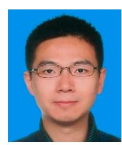

*Hongtao Hu* received his B.S. degree from Fudan University, China and PhD. degree from Shanghai Jiaotong University, China, and then went to the National University of Singapore, Singapore, as a research fellow for two years. Now he is a professor and vice president at the school of logistics engineering, Shanghai Maritime University, China. His main research fields include port and shipping management and optimization, supply chain network design and optimization, production and logistics system optimization. He has published more than 30 papers, appeared in international journals such as International Journal of Production Research, Transportation Research Part C: emerging technologies, Computers & Industrial Engineering, etc.

*Xurui Yang* received her B.S. degree from Shanghai University of Engineering Science, China and M.S. degree from University of Duisburg-Essen, Germany. Now she is a Ph.D. candidate at the institute of logistics science & engineering, Shanghai Maritime University, China. Her main research fields include port operation management and optimization, operation research optimization algorithm.

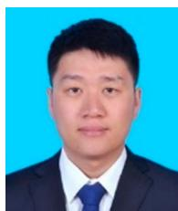

*Shichang Xiao* received his B.S. degree from Henan University of Technology, China, M.S. degree from Xi'an University of Technology, China and PhD. degree from Northwestern Polytechnical University, China, during which he studied at the University of Michigan, Ann Arbor, USA, for one year. Now he is a lecturer

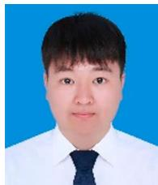

- at the school of logistics engineering, Shanghai Maritime University, China. His main research fields include logistics and manufacturing system modeling, automated container terminal scheduling, job shop scheduling, operation research optimization algorithm. He has published more than 10 papers, appeared in international journals such as Computers & Operations Research, Energies, etc. machine learning. **References** Adamo, T., T. Bektas, G. Ghiani, E. Guerriero, and E. Manni. [2018.](#page-2-1) "Path and Speed Optimization for Conflict-Free Pickup and Delivery Under Time Windows." *Transportation Science* 52 (4): 739–755. An, Y.L., M. Li, X. Lin, F. He, and H.L. Yang. [2020.](#page-3-1) "Spacetime Routing in Dedicated Automated Vehicle Zones." *Transportation Research Part C: Emerging Technologies* 120: 102777. Bai, R. B., N. Xue, J. J. Chen, and G. W. Roberts. [2015.](#page-3-2) "A Setcovering Model for a Bidirectional Multi-Shift Full Truckload Vehicle Routing Problem." *Transportation Research Part B-Methodological* 79: 134–148. Brockman, G., V. Cheung, L. Pettersson, J. Schneider, J. Schulman, J. Tang, and W. Zaremba. [2016.](#page-4-0) "OpenAI Gym." *arXiv:1606.01540*, Jun 5. Chen, B., R. Bai, J. Li, Y. Liu, N. Xue, and J. F. Ren. [2020.](#page-4-1) "A Multiobjective Single Bus Corridor Scheduling Using Machine Learning-Based Predictive Models." *International Journal of Production Research*. doi[:10.1080/00207543.2020.1766716.](https://doi.org/10.1080/00207543.2020.1766716) Dandanov, Nikolay, Hussein Al-Shatri, Anja Klein, and Vladimir Poulkov. [2017.](#page-4-2) "Dynamic Self-Optimization of the Antenna Tilt for Best Trade-off Between Coverage and Capacity in Mobile Networks." *Wireless Personal Communications* 92 (1): 251–278. Drótos, M., P. Györgyi, M. Horváth, and T. Kis. [2021.](#page-2-2) "Suboptimal and Conflict-Free Control of a Fleet of AGVs to Serve Online Requests." *Computers & Industrial Engineering* 152: 106999. Farooq, B., J. S. Bao, H. Raza, Y. C. Sun, and Q. W. Ma. [2021.](#page-2-3) "Flow-shop Path Planning for Multi-Automated Guided Vehicles in Intelligent Textile Spinning Cyber-Physical Production Systems Dynamic Environment." *Journal of Manufacturing Systems* 59: 98–116. Fazlollahtabar, H., and M. Saidi-Mehrabad. [2015.](#page-2-4) "Methodologies to Optimize Automated Guided Vehicle Scheduling and Routing Problems: A Review Study." *Journal of Intelligent & Robotic Systems* 77 (3): 525–545. Foerster, J., Y. Assael, N. De Freitas, and S. Whiteson. [2016.](#page-4-3) "Learning to Communicate with Deep Multi-Agent Reinforcement Learning." *In Advances in Neural Information Processing Systems*, 2137–2145. Foerster, J., R. Chen, M. Al-Shedivat, S. Whiteson, P. Abbeel, and I. Mordatch. [2018.](#page-4-4) "Learning with Opponent-Learning Awareness." *International Foundation for Autonomous Agents and Multiagent Systems* 19: 122–130. Fransen, K. J. C., J. A. W. M. van Eekelen, A. Pogromsky, M. A.
  - A. Boon, and I. J. B. F. Adan. [2020.](#page-3-3) "A Dynamic Path Planning Approach for Dense, Large, Grid-Based Automated Guided Vehicle Systems." *Computers & Operations Research* 123: 105046. Fujii, K. [2018.](#page-11-3) "Mathematical Reinforcement to the Minibatch of Deep Learning." *Advances in Pure Mathematics* 08 (03): 307–320. Ghasemzadeh, H., E. Behrangi, and M. A. Azgomi. [2009.](#page-2-5) "Conflict-free Scheduling and Routing of Automated Guided Vehicles in Mesh Topologies." *Robotics and Autonomous Systems* 57 (6-7): 738–748. Ho, Y. C., and T. W. Liao. [2009.](#page-3-4) "Zone Design and Control for Vehicle Collision Prevention and Load Balancing in a Zone Control AGV System." *Computers & Industrial Engineering* 56 (1): 417–432. Hu, Y. J., L. C. Dong, and L. Xu. [2020.](#page-3-5) "Multi-AGV Dispatching and Routing Problem Based on a Three-Stage Decomposition Method." *Mathematical Biosciences and Engineering* 17 (5): 5150–5172. Hu, H., X.L. Jia, Q.X. He, S.F. Fu, and K. Liu. [2020.](#page-2-6) "Deep Reinforcement Learning Based AGVs Real-Time Scheduling with Mixed Rule for Flexible Shop Floor in Industry 4.0." *Computers & Industrial Engineering* 149: 106749. Jang, E., S. Gu, and B. Poole. [2016.](#page-10-0) "Categorical Reparameterization with Gumbel-Softmax." *International Conference on learning representations*, *arXiv*: 1611.01144. Jin, J. G., D. H. Lee, and J. X. Cao. [2016.](#page-3-6) "Storage Yard Management in Maritime Container Terminals." *Transportation Science* 50 (4): 1300–1313. Kim, K. H., S. M. Jeon, and K. R. Ryu. [2006.](#page-3-7) "Deadlock Prevention for Automated Guided Vehicles in Automated Container Terminals." *Or Spectrum* 28 (4): 659–679. Kim, C. W., and J. M. A. Tanchoco. [1991.](#page-12-1) "Conflict-free Shortest-Time Bidirectional AGV Routeing." *International Journal of Production Research* 29 (12): 2377–2391. Lehmann, M., M. Grunow, and H. O. Gunther. [2006.](#page-3-8) "Deadlock Handling for Real-Time Control of AGVs at Automated Container Terminals." *Or Spectrum* 28 (4): 631–657. Li, Q., A. Pogromsky, T. Adriaansen, and J. T. Udding. [2016.](#page-3-9) "A Control of Collision and Deadlock Avoidance for Automated Guided Vehicles with a Fault-Tolerance Capability." *International Journal of Advanced Robotic Systems* 13: 1–24. doi:10.5772/62685. Li, J. L., H. Qin, R. Baldacci, and W. B. Zhu. [2020.](#page-3-10) "Branchand-price-and-cut for the Synchronized Vehicle Routing Problem with Split Delivery, Proportional Service Time and Multiple Time Windows." *Transportation Research Part E-Logistics and Transportation Review* 140: 101955. doi:10195510.1016/j.tre.2020.101955. Li, J. J., B. W. Xu, O. Postolache, Y. S. Yang, and H. F. Wu. [2018.](#page-3-11) "Impact Analysis of Travel Time Uncertainty on AGV

*Feiyang Wang* received his B.S. degree from Nanjing University of Finance & Economics, China. Now he is a graduate student at the school of logistics engineering, Shanghai Maritime University, China. His main research fields include port operation management and optimization,

Catch-Up Conflict and the Associated Dynamic Adjustment." *Mathematical Problems in Engineering* 2018 (5): 1–11. doi:10.1155/2018/4037695.

Lowe, R., Y. Wu, A. Tamar, J. Harb, P. Abbeel, and I. Mordatch. [2017.](#page-9-1) "Multi-agent Actor-Critic for Mixed Cooperative-Competitive Environments." *In Advances in Neural Information Processing Systems*, 30 (2017): 6379–6390.

Lu, H., X. Zhang, and S. Yang. [2020.](#page-4-5) "A Learning-Based Iterative Method for Solving Vehicle Routing Problems." *International Conference on learning representations*, published online.

Mnih, V., K. Kavukcuoglu, D. Silver, et al. [2015.](#page-4-6) "Human-level Control Through Deep Reinforcement Learning." *Nature* 518 (7540): 529–533.

Nishi, T., Y. Hiranaka, and I. E. Grossmann. [2011.](#page-2-7) "A Bilevel Decomposition Algorithm for Simultaneous Production Scheduling and Conflict-Free Routing for Automated Guided Vehicles." *Computers & Operations Research* 38 (5): 876–888.

Park, J. H., H. J. Kim, and C. Lee. [2009.](#page-3-12) "Ubiquitous Software Controller to Prevent Deadlocks for Automated Guided Vehicle Systems in a Container Port Terminal Environment." *Journal of Intelligent Manufacturing* 20 (3): 321–325.

Qiu, L., W. J. Hsu, S. Y. Huang, and H. Wang. [2002.](#page-2-8) "Scheduling and Routing Algorithms for AGVs: a Survey." *International Journal of Production Research* 40 (3): 745–760.

Samvelyan, M., T. Rashid, C. S. Witt, and G. Farquhar. [2019.](#page-4-7) "The StarCraft Multi-Agent Challenge." *Proceedings of the 18th International Conference on Autonomous Agents and MultiAgent Systems*, 13–17.

Sutton, R. S., and A. G. Barto. [2014.](#page-4-8) *Reinforcement Learning: An Introduction*. London: The MIT Press.

Toda, M. [1958.](#page-11-4) "On the Theory of the Brownian Motion." *Journal of the Physical Society of Japan* 13 (11): 1266–1280.

Vinitsky, Eugene, Aboudy Kreidieh, Luc Le Flem, Nishant Kheterpal, Kathy Jang, Cathy Wu, Fangyu Wu, Richard Liaw, Eric Liang, and Alexandre M. Bayen. [2018.](#page-4-9) "Benchmarks for Reinforcement Learning in Mixed-Autonomy Traffic." *Proceedings of The 2nd Conference on Robot Learning, PMLR* 87: 399–409.

Watkins, C., and J. Dayan. [1992.](#page-4-10) "Q -learning." *Machine Learning* 8 (3-4): 279–292.

Zhang, K., F. He, Z. C. Zhang, X. Lin, and M. Li. [2020.](#page-4-11) "Multivehicle Routing Problems with Soft TimeWindows: A Multi-Agent Reinforcement Learning Approach." *Transportation Research Part C-Emerging Technologies* 121: 102861.

Zhang, Z.W., L.H. Wu, W.Q. Zhang, T. Peng, and J. Zheng. [2021.](#page-2-9) "Energy-efficient Path Planning for a Single-Load Automated Guided Vehicle in a Manufacturing Workshop." *Computers & Industrial Engineering* 158: 107397.

Zhen, L. [2016.](#page-3-13) "Modeling of Yard Congestion and Optimization of Yard Template in Container Ports." *Transportation Research Part B-Methodological* 90: 83–104.