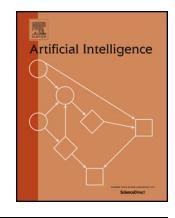

# Conflict-based search for optimal multi-agent pathfinding

Guni Sharon a*,*∗, Roni Stern a, Ariel Felner a, Nathan R. Sturtevant b

a *Information Systems Engineering, Ben Gurion University, Be'er Sheba, 85104, Israel*

b *Department of Computer Science, University of Denver, Denver, CO, USA*

#### a r t i c l e i n f o a b s t r a c t

#### *Article history:*

Received 16 September 2013

Received in revised form 23 November 2014

Accepted 25 November 2014

Available online 2 December 2014

#### *Keywords:*

Heuristic search

Multi-agent

Pathfinding

In the *multi-agent pathfinding* problem (MAPF) we are given a set of agents each with respective start and goal positions. The task is to find paths for all agents while avoiding collisions. Most previous work on solving this problem optimally has treated the individual agents as a single 'joint agent' and then applied single-agent search variants of the A\* algorithm.

In this paper we present the Conflict Based Search (CBS) a new optimal multi-agent pathfinding algorithm. CBS is a two-level algorithm that does not convert the problem into the single 'joint agent' model. At the high level, a search is performed on a *Conflict Tree* (CT) which is a tree based on conflicts between individual agents. Each node in the CT represents a set of constraints on the motion of the agents. At the low level, fast singleagent searches are performed to satisfy the constraints imposed by the high level CT node. In many cases this two-level formulation enables CBS to examine fewer states than A\* while still maintaining optimality. We analyze CBS and show its benefits and drawbacks. Additionally we present the *Meta-Agent CBS* (MA-CBS) algorithm. MA-CBS is a generalization of CBS. Unlike basic CBS, MA-CBS is not restricted to single-agent searches at the low level. Instead, MA-CBS allows agents to be merged into small groups of joint agents. This mitigates some of the drawbacks of basic CBS and further improves performance. In fact, MA-CBS is a framework that can be built on top of any optimal and complete MAPF solver in order to enhance its performance. Experimental results on various problems show a speedup of up to an order of magnitude over previous approaches.

© 2014 Elsevier B.V. All rights reserved.

# **1. Introduction**

Single-agent pathfinding is the problem of finding a path between two vertices in a graph. It is a fundamental and important problem in AI that has been researched extensively, as this problem can be found in GPS navigation [\[49\],](#page-25-0) robot routing [\[8,3\],](#page-25-0) planning [\[6,23\],](#page-25-0) network routing [\[7\],](#page-25-0) and many combinatorial problems (e.g., puzzles) as well [\[28,27\].](#page-25-0) Solving pathfinding problems optimally is commonly done with search algorithms based on the A\* algorithm [\[22\].](#page-25-0) Such algorithms perform a best-first search that is guided by *f (n)* = *g(n)* + *h(n)*, where *g(n)* is the cost of the shortest known path from the start state to state *n* and *h(n)* is a heuristic function estimating the cost from *n* to the nearest goal state. If the heuristic function *h* is *admissible*, meaning that it never overestimates the shortest path from *n* to the goal, then A\* (and other algorithms that are guided by the same cost function) are guaranteed to find an optimal path from the start state to a goal state, if one exists [\[11\].](#page-25-0)

\* Corresponding author.

*E-mail addresses:* [gunisharon@gmail.com](mailto:gunisharon@gmail.com) (G. Sharon), [roni.stern@gmail.com](mailto:roni.stern@gmail.com) (R. Stern), [felner@bgu.ac.il](mailto:felner@bgu.ac.il) (A. Felner), [sturtevant@cs.du.edu](mailto:sturtevant@cs.du.edu) (N.R. Sturtevant).

The *multi-agent pathfinding* (MAPF) problem is a generalization of the single-agent pathfinding problem for *k >* 1 agents. It consists of a graph and a number of agents. For each agent, a unique start state and a unique goal state are given, and the task is to find paths for all agents from their start states to their goal states, under the constraint that agents cannot collide during their movements. In many cases there is an additional goal of minimizing a cumulative cost function such as the sum of the time steps required for every agent to reach its goal. MAPF has practical applications in video games, traffic

Algorithms for solving MAPF can be divided into two classes: *optimal* and *sub-optimal* solvers. Finding an optimal solution for the MAPF problem is NP-hard [\[56\],](#page-26-0) as the state space grows exponentially with the number of agents. Sub-optimal solvers are usually used when the number of agents is large. In such cases, the aim is to quickly find a path for the different agents, and it is often intractable to guarantee that a given solution is optimal.

The problem addressed in this paper is to find an *optimal solution* to the MAPF problem. Optimal solvers are usually applied when the number of agents is relatively small and the task is to find an optimal, minimal-cost solution. This can be formalized as a global, single-agent search problem. Therefore, the traditional approach for solving MAPF optimally is by using A\*-based searches [\[35,45\].](#page-25-0) A node in the search tree consists of the set of locations for all the agents at time *t*. The start state and goal state consist of the initial and goal locations of the different agents, respectively. Given a graph with branching factor *b*, there are *O(b)* possible moves for any single agent and thus the branching factor for an A\* search is *O(bk)* which is exponential in the number of agents. Naturally, search algorithms that are based on A\* can solve this problem optimally, but they may run for a very long time or exhaust the available memory.

The first part of the paper gives a survey on MAPF research. We classify all existing work to two main categories, optimal and sub-optimal. We then further classify the different approaches for solving this problem sub-optimally. This is done through a consistent terminology that helps these classifications. In the second part of the paper we introduce a new approach for optimally solving MAPF. First, we present a novel *conflict-based formalization* for MAPF and a corresponding new algorithm called Conflict Based Search (CBS). CBS is a two-level algorithm, divided into high-level and low-level searches. The agents are initialized with default paths, which may contain conflicts. The *high-level search* is performed in a *constraint tree* (CT) whose nodes contain time and location constraints for a single agent. At each node in the CT, a *low-level search* is performed for all agents. The low-level search returns single-agent paths that are consistent with the set of constraints given at any CT node. If, after running the low level, there are still *conflicts* between agents, i.e. two or more agents are located in the same location at the same time, the associated high-level node is declared a non-goal node and the high-level search continues by adding more nodes with constraints that resolve the new conflict.

We study the behavior of our CBS algorithm and discuss its advantages and drawbacks when compared to A\*-based approaches as well as other approaches. Based on characteristics of the problem, we show cases where CBS will be significantly more efficient than the previous approaches. We also discuss the limitations of CBS and show circumstances where CBS is inferior to the A\*-based approaches. Experimental results are provided which support our theoretical understandings. While CBS is ineffective in some cases, there are many cases where CBS outperforms EPEA\* [\[15,20\],](#page-25-0) the state-of-the-art A\*-based approach for this problem. Specifically, we experimented on open grids as well as on a number of benchmark game maps from Sturtevant's pathfinding database [\[47\].](#page-25-0) Results show the superiority of CBS over the A\*-based approaches and ICTS [\[42\],](#page-25-0) another recent approach, on many of these domains.

Next, we mitigate the worst-case performance of CBS by generalizing CBS into a new algorithm called Meta-agent CBS (MA-CBS). In MA-CBS the number of conflicts allowed between any pair of agents is bounded by a predefined parameter *B*. When the number of conflicts exceeds *B*, the conflicting agents are merged into a *meta-agent* and then treated as a joint composite agent by the low-level solver. In the low-level search, MA-CBS uses any possible complete MAPF solver to find paths for the meta-agent. Thus, MA-CBS can be viewed as a solving framework where low-level solvers are plugged in. Different *merge policies* give rise to different special cases. The original CBS algorithm corresponds to the extreme case where *B* =∞ (never merge agents), and the Independence Detection (ID) framework [\[45\]](#page-25-0) is the other extreme case where *B* = 0 (always merge agents when conflicts occur). Finally, we present experimental results for MA-CBS that show the superiority of MA-CBS over the other approaches on all domains. In addition, in [Appendix A](#page-23-0) we introduce a variant of CBS which has memory requirements that are linear in the depth of the CT.

Preliminary versions of this research have appeared previously [\[38,39\].](#page-25-0) This paper contains a more comprehensive description of the CBS algorithm and the MA-CBS framework, with broader theoretical analysis and experimental comparisons to other MAPF algorithms.

### **2. Problem definition and terminology**

Many variants of the MAPF problem exist. We now define the problem and later describe the algorithms in the context of a general, commonly used variant of the problem [\[45,46,42,38,39\].](#page-25-0) This variant is as general as possible to allow CBS to be applicable and it includes many sub-variants. Then, in Section [6.1](#page-14-0) we describe the specific sub-variant used in our experimental setting. Finally, in Section [7](#page-16-0) we briefly discuss how our new algorithm can be modified to other MAPF variants.

- **(1)** A directed graph *G(V , E)*. The vertices of the graph are possible locations for the agents, and the edges are the possible transitions between locations.
- **(2)** *k* agents labeled *a*1*,a*2 *...ak*. Every agent *ai* has a start vertex, *starti* ∈ *V* and a goal vertex, *goali* ∈ *V* .

Time is discretized into time points. At time point *t*0 agent *ai* is located in location *starti* .

# *2.2. Actions*

Between successive time points, each agent can perform a *move* action to a neighboring vertex or a *wait* action to stay idle at its current vertex. There are a number of ways to deal with the possibility of a chain of agents that are *following* each other in a given time step. This may not be allowed, may only be allowed if the first agent of the chain moves to an unoccupied location or it may be allowed even in a cyclic chain which does not include any empty location. Our algorithm is applicable across all these variations.

# *2.3. MAPF constraints*

The main constraint in MAPF is that each vertex can be occupied by at most one agent at a given time. There can also be a constrain disallowing more than one agent to traverse the same edge between successive time steps. A *conflict* is a case where a constraint is violated.

# *2.4. MAPF task*

A solution to the MAPF problem is a set of non-conflicting paths, one for each agent, where a path for agent *ai* is a sequence of {*move, wait*} actions such that if *ai* performs this sequence of actions starting from *starti* , it will end up in *goali* .

### *2.5. Cost function*

We aim to solve a given MAPF instance while minimizing a global cumulative cost function. We describe the algorithms in this paper in the context of a common cost function that we call the *sum-of-costs* [\[12,45,42,38,39\].](#page-25-0) *Sum-of-costs* is the summation, over all agents, of the number of time steps required to reach the goal for the last time and never leave it again. Finding the optimal solution, i.e., the minimal sum-of-costs, has been shown to be NP-hard [\[56\].](#page-26-0)

Other cost functions have also been used in the literature. *Makespan*, for example, is another common MAPF cost function which minimizes the total time until the last agent reaches its destination (i.e., the maximum of the individual costs). Another cost function is called *Fuel* [\[16\],](#page-25-0) corresponding to the total amount of distance traveled by all agents (equivalent to the fuel consumed). The Fuel cost function is in a fact the sum-of-costs of all agents where only move actions incur costs but wait actions are free. In addition, giving different weights to different agents is also possible. In Section [7](#page-16-0) we show how our algorithms can be modified for such cost functions.

Some variants of MAPF do not have a global cost function to optimize, but a set of individual cost functions, one for every agent [\[29\].](#page-25-0) In such variants a solution is a vector of costs, one per agent. This type of cost function is part of the broader field of *multi-objective optimization*, and is beyond the scope of this paper. In other MAPF variants the agents may be self-interested, and the task is to devise a mechanism that will cause them to cooperate [\[5\].](#page-25-0) In this work we assume that the agents are fully collaborative and are not self-interested.

Yu and Lavelle [\[54\]](#page-26-0) studied an MAPF variant in which instead of assigning each agent with a goal position a set of goal positions is given and the task is to find a solution that brings each of the agents to any goal position. They showed that this MAPF variant is solvable in polynomial time using network flows.

#### *2.6. Distributed vs. centralized*

MAPF problems can be categorized into two groups: *distributed* and *centralized*. In a distributed setting, each agent has its own computing power and different communication paradigms may be assumed (e.g., message passing, broadcasting etc.). A large body of work has addressed the distributed setting [\[18,21,2\].](#page-25-0) By contrast, the centralized setting assumes a single central computing power which needs to find a solution for all agents. Equivalently, the centralized setting also includes the case where we have a separate CPU for each of the agents but full knowledge sharing is assumed and a centralized problem solver controls all the agents. The scope of this paper is limited to centralized approaches, and we cover many of them in the next section.

# *2.7. An example of an MAPF problem*

[Fig. 1](#page-3-0) shows an example 2-agent MAPF instance that will be used throughout the paper. Each agent (mouse) must plan a full path to its respective piece of cheese. Agent *a*1 has to go from *S*1 to *G*1 while agent *a*2 has to go from *S*2 to *G*2. Both agents have individual paths of length 3: *S*1*, A*1*, D, G*1 and *S*2*, B*1*, D, G*2, respectively. However, these paths have a

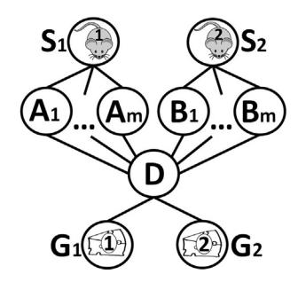

**Fig. 1.** An example of an MAPF instance with 2 agents. The mice, 1 and 2, must reach the pieces of cheese 1 and 2, respectively.

conflict, as they both include state *D* at time point *t*2. One of these agents must wait one time step. Therefore, the optimal solution cost, *C*∗, is 7 in this example.

# **3. Survey of centralized MAPF algorithms**

Work assuming a centralized approach can be divided into three classes. The first class of solvers, used in recent work, reduce MAPF to other problems that are well studied in computer science. The second class of solvers consists of MAPFspecific sub-optimal solvers. The third class of solvers is the class of optimal solvers. The focus of this paper is on optimal solvers, but we include a brief survey of the other classes below.

# *3.1. Reduction-based solvers*

This class of solvers, used in recent work, reduces MAPF to other problems that are well studied in computer science. Prominent examples include reducing to Boolean Satisfiability (SAT) [\[50\],](#page-25-0) Integer Linear Programming (ILP) [\[55\]](#page-26-0) and Answer Set Programming (ASP) [\[13\].](#page-25-0) These methods return the optimal solution and are usually designed for the *makespan* cost function. They are less efficient or even not applicable for the sum of cost function. In addition, these algorithms are usually highly efficient only on small problem instances. On large problem instances the translation process from an MAPF instance to the required problem has a very large, yet polynomial, overhead which makes these approaches inefficient.

# *3.2. MAPF-specific sub-optimal solvers*

Algorithms of this class are usually highly efficient but do not guarantee optimality and even completeness in some cases. They are commonly used when the number of agents is large and the optimal solution is intractable. MAPF-specific sub-optimal solvers can be further classified to sub-classes.

# *3.2.1. Search-based suboptimal solvers*

Search-based solvers usually aim to provide a high quality solution (close to optimal) but they are not complete for many cases. These solvers differ by the way they treat conflicts between agents. A prominent example of a search-based sub-optimal algorithm is *Hierarchical Cooperative A\** (HCA\*) [\[43\].](#page-25-0) In HCA\* the agents are planned one at a time according to some predefined order. Once the first agent finds a path to its goal, that path is written (*reserved*) into a global *reservation table*. More specifically, if the path found for any agent *ai* is *v*0 *i* = *starti, v*1 *i , v*2 *i ,..., vl i* = *goali* , then the algorithm records that state *v j i* is occupied by agent *ai* at time point *tj* . Reservation tables can be implemented as a matrix of #*vertices* × #*timesteps*, or in a more compact representation such as a hash table for the items that have been reserved. When searching for a path for a later agent, paths chosen by previous agents are blocked. That is, the agent may not traverse locations that are in conflict with previous agents. An approach similar to HCA\* was presented earlier for multi-agent motion planning [\[14\].](#page-25-0) Windowed-HCA\* (WHCA\*) [\[43\],](#page-25-0) one of several HCA\* variants, only performs cooperative pathfinding within a limited window, after which other agents are ignored. A perfect single-agent heuristic is most often used to guide this search. Because HCA\* is designed for games with limited memory, the heuristic cannot be pre-computed and must be calculated at runtime.

Later work extended HCA\* by abstracting the size of the state space to reduce the runtime cost of building the heuristics [\[48\].](#page-25-0) Finally, WHCA\* was enhanced such that the windows are dynamically placed only around known conflicts and agents are prioritized according to the likelihood of being involved in a conflict [\[4\].](#page-25-0) The HCA\* idea has a few drawbacks. First, when too many agents exist, deadlocks may occur, and HCA\* is not guaranteed to be complete. Second, HCA\* does not provide any guarantees on the quality of its solution, and thus the solutions may be far from optimal. Finally, HCA\* may even slow the search significantly. This is particularly true with the windowed variant of HCA\*, WHCA\*. Because individual agents are independently looking for solutions of minimal length, agents may unnecessarily collide when significant free space is available, incurring significant computational costs to resolve. The reservation table idea has also been used for

managing traffic junctions where cars (agents) must cross a junction without causing collisions [\[12\].](#page-25-0) That system solves the online version of the problem, where cars arrive at a junction and once they cross it they disappear.

# *3.2.2. Rule-based suboptimal solvers*

Rule-based approaches include specific movement rules for different scenarios and usually do not include massive search. The agents plan their route according to the specific rules. Rule-based solvers favor completeness at low computational cost over solution quality.

TASS [\[25\]](#page-25-0) and Push and Swap (and its variants) [\[30,37,10\]](#page-25-0) are two recently proposed rule-based MAPF sub-optimal algorithms that run in polynomial time.1 Both algorithms use a set of "macro" operators. For instance, the push and swap algorithm uses a "swap" macro, which is a set of operators that swaps location between two adjacent agents. Both TASS and Push and Swap do not return an optimal solution and guarantee completeness for special cases only. TASS is complete only for tree graphs while Push and Rotate [\[10\],](#page-25-0) a variant of Push and Swap, is complete for graphs where at least two vertices are always unoccupied, i.e., *k* ≤|*V* | − 2.

Predating all of this work is a polynomial-time algorithm that is complete for all graphs [\[9,34\].](#page-25-0) This previous work focuses on a specific variant of MAPF called the *pebble motion coordination* problem (PMC). PMC is similar to MAPF where each agent is viewed as a pebble and each pebble needs to be moved to its goal location.

# *3.2.3. Hybrid solvers*

Some suboptimal solvers are hybrids and include specific movement rules as well as significant search. For example, if the graph is a grid then establishing flow restrictions similar to traffic laws can simplify the problem [\[52,24\].](#page-26-0) Each row/column in the grid is assigned two directions. Agents are either suggested or forced to move in the designated directions at each location in order to significantly reduce the chance of conflicts and the branching factor at each vertex. These approaches prioritize collision avoidance over shorter paths and work well in state spaces with large open areas. These approaches are not complete for the general case, as deadlocks may occur in bottlenecks.

Another hybrid solver was presented by Wang and Botea [\[53\].](#page-26-0) The basic idea is to precompute a full path (*Pi*) for each agent (*ai*). For each pair of successive steps (*p j, p j*+1 ∈ *P* ) an alternative sub-path is also pre-computed. If the original computed path of agent *ai* is blocked by another agent *a j* , we redirect agent *ai* to a bypass via one of the alternative paths. The main limitation of this approach is that it is only proven to be complete for grids which have the *slidable* property (defined in [\[53\]\)](#page-26-0). It is not clear how to generalize this algorithm to grids that are not *slidable*.

Ryan introduced a search-based approach for solving MAPF problems which uses abstraction to reduce the size of the state-space [\[35\].](#page-25-0) The input graph *G* is partitioned into subgraphs with special structures such as cliques, halls and rings. Each structure represents a certain topology (e.g., a hall is a singly-linked chain of vertices with any number of entrances and exits). Each structure has a set of rule-based operators such as *Enter* and *Leave*. Once a plan is found in the abstract space, a solution is derived using the rule based operators. A general way to use these abstractions is by solving the entire MAPF problem as a Constraint Satisfaction Problem (CSP). Each special subgraph adds constraints to the CSP solver, making the CSP solver faster [\[36\].](#page-25-0) The efficiency of subgraph decomposition (in terms of runtime) depends on the partitioning of the input graph. Finding the optimal partitioning is a hard problem and not always feasible. Open spaces are not suitable for partitioning by the defined structures making this algorithm less effective on graphs with open spaces.

#### *3.3. Optimal MAPF solvers*

Optimal MAPF solvers usually search a global search space which combines the individual states of all *k* agents. This state space is denoted as the *k-agent state space*. The states in the *k*-agent state space are the different ways to place *k* agents into |*V* | vertices, one agent per vertex. In the start and goal states agent *ai* is located at vertices *starti* and *goali* , respectively. Operators between states are all the non-conflicting actions (including *wait*) that all agents have. Given this general state space, any A\*-based algorithm can be used to solve the MAPF problem optimally.

We use the term *bbase* to denote the branching factor of a single agent, that is, the number of locations that a single agent can move to in one time-step. This paper focuses on 4-connected grids where *bbase* = 5, since every agent can move to the four cardinal directions or wait at its current location. The maximum possible branching factor for *k* agents is *bpotential* = *bbase k*. When expanding a state in a *k*-agent state space, all the *bpotential* combinations may be considered, but only those that have no conflicts (with other agents or with obstacles) are *legal* neighbors. The number of legal neighbors is denoted by *blegal*. *blegal* = *O(bbase k)*, and thus for worst-case analysis one can consider *blegal* to be in the same order as *bpotential*, i.e., exponential in the number of agents (*k*). On the other hand, in dense graphs (with many agents and with a small number of empty states), *blegal* can be much smaller than *bpotential*. In general, identifying the *blegal* neighbors from the possible *bpotential* neighbors is a Constraint Satisfaction Problem (CSP), where the variables are the agents, the values are the actions they take, and the constraints are to avoid conflicts. Hereafter we simply denote *blegal* by *b*.

1 An approach similar to TASS was presented earlier for tunnel environments [\[32\].](#page-25-0)

To solve MAPF more efficiently with A\*, one requires a non-trivial admissible heuristic. A simple admissible heuristic is to sum the individual heuristics of the single agents such as Manhattan distance for 4-connected grids or Euclidean distance for Euclidean graphs [\[35\].](#page-25-0) HCA\* improves on this by computing the optimal distance to the goal for each agent, ignoring other agents. As this task is strictly easier than searching with additional agents, it can be used as an admissible heuristic. HCA\* performed this computation incrementally for each agent, while Standley performed the computation exhaustively a

We denote this heuristic as the *sum of individual costs* heuristic (SIC). Formally, the SIC heuristic is calculated as follows. For each agent *ai* we assume that no other agent exists and calculate its optimal individual path cost from all states in the state space to *goali*; this is usually done by a reverse search from the goal. The heuristic taken in the multi-agent A\* search is the sum of these costs over all agents. For the example problem in [Fig. 1,](#page-3-0) the SIC heuristic is 3 + 3 = 6. Note that the *maximum* of the individual costs is an admissible heuristic for the makespan variant described above, in which the task is

For small input graphs, the SIC heuristic for any problem configuration can be stored as a lookup table by precalculating the *all-pairs shortest-path* matrix for the input graph *G*. For larger graphs we calculate the shortest path from each state only to the goal states of a given instance. This, however, must be recomputed for each problem instance with respect to each

A\* always begins by *expanding* a state and inserting its successors into the open list (denoted OPEN). All states expanded are maintained in a closed list (denoted CLOSED). Because of this, A\* for MAPF suffers from two drawbacks. First, the size of the state space is exponential in the number of agents (*k*), meaning that CLOSED cannot be maintained in memory for large problems. Second, the branching factor of a given state may be exponential in *k*. Consider a state with 20 agents on a 4-connected grid. Each agent may have up to 5 possible moves (4 cardinal directions and wait). Fully generating all the 520 = 9*.*53 × 1014 neighbors of even the start state could be computationally infeasible. The following enhancements have

# *3.3.3. Reducing the effective number of agents with Independence Detection*

Since the state space of MAPF is exponential in the number of agents, an exponential speedup can be obtained by reducing the number of agents in the problem. To this end Standley introduced the *Independence Detection* framework

|   | Algorithm |          | 1: The    | ID framework.                          |
|---|-----------|----------|-----------|----------------------------------------|
|   | Input :   | An       | MAPF      | instance                               |
| 1 | Assign    | each     | agent     | to a singleton group                   |
| 2 | Plan a    | path     | for each  | group                                  |
| 3 | repeat    |          |           |                                        |
| 4 |           | validate | the       | combined solution                      |
| 5 | if        | Conflict | found     | then                                   |
| 6 |           | Merge    | two       | conflicting groups into a single group |
| 7 |           | Plan     | a path    | for the merged group                   |
| 8 | until No  |          | conflicts | occur ;                                |
| 9 | return    | paths    | of all    | groups combined                        |

Two groups of agents are *independent* if there is an optimal solution for each group such that the two solutions do not conflict. ID attempts to detect independent groups of agents. Algorithm 1 provides the pseudo-code for ID. First, every agent is placed in its own group (line 1). Each group is solved separately using A\* (line 2). The solution returned by A\* is optimal with respect to the given group of agents. The paths of all groups are then checked for validity with respect to each other. If a conflict is found, the conflicting groups are merged into one group and solved optimally using A\* (lines 6–7). This process of replanning and merging groups is repeated until there are no conflicts between the plans of all groups. The resulting groups are independent w.r.t. each other. Note that ID is not perfect, in the sense that more independent subgroups may lay undetected in the groups returned by ID.

Since the complexity of an MAPF problem in general is exponential in the number of agents, the runtime of solving an MAPF problem with ID is dominated by the running time of solving the largest independent subproblem [\[45\].](#page-25-0) ID may identify that a solution to a *k*-agent MAPF problem can be composed from solutions of several independent subproblems. We use *k* to denote the *effective number of agents* which is number of agents in the largest independent subproblem (*k* ≤ *k*). As the problem is exponential in the number of agents, ID reduces the exponent from *k* to *k* .

Consider A\* + ID on our example problem in [Fig. 1](#page-3-0) (Section [2.7\)](#page-2-0), but with an additional agent. Assume that the third agent *a*3 is located at state *D* and that its goal state is *S*1. ID will work as follows. Individual optimal paths of cost 3 are found for agents *a*1 (path *S*1*, A*1*, D, G*1) and *a*2 (path *S*2*, B*1*, D, G*2), and a path of cost 2 is found for agent *a*3 (path *D, A*2*, S*1). When validating the paths of agents *a*1 and *a*2, a conflict occurs at state *D*, and agents *a*1 and *a*2 are merged into one group. A\* is called upon this group and returns a solution of cost 7 (agent *a*2 waits one step at *B*1). This solution is now validated with the solution of agent *a*3. No conflict is found and the algorithm halts. The largest group invoked by A\* was of size 2. Without ID, A\* would have to solve a problem with 3 agents. Thus, the worst-case branching factor was reduced from *bbase* 3 to *bbase* 2.

It is important to note that the ID framework can be implemented on top of any optimal MAPF solver (one that is guaranteed to return an optimal solution) in line 7. Therefore, ID can be viewed as a general framework that utilizes an MAPF solver. Hence, ID is also applicable with the algorithm proposed in this paper (CBS) instead of with A\*. Indeed, in the experimental evaluation of CBS we ran ID on top of CBS.

# *3.3.4. Enhancements to ID*

In order to improve the chance of identifying independent groups of agents, Standley proposed a tie-breaking rule using a *conflict avoidance table* (CAT) as follows. The paths that were found for the agents are stored in the CAT. When a newly formed, merged group is solved with A\* (line 7), the A\* search breaks ties in favor of states that will create the fewest conflicts with the existing planned paths of other groups (agents that are not part of the merged group), as stored in the CAT. The outcome of this improvement is that the solution found by A\* using the *conflict avoidance* tie-breaking is less likely to cause a conflict with the other agents. As a result, agents paths are more likely to be independent, resulting in substantial speedup.

Standley also presented an enhanced version of ID (EID) [\[45\].](#page-25-0) In this version, once two groups of agents are found to conflict, a *resolve conflict* procedure is called prior to merging the groups. EID tries to resolve the conflict by attempting to replan one group to avoid the plan of the other group, and vice-versa. To maintain optimality, the cost of the plan found during the replanning must be exactly at the same cost as the original optimal solution for that group. If the conflict between the groups was not resolved, the groups are merged and solved together as in the basic ID. If the resolve procedure is able to solve the conflict, the groups are not merged and the main loop continues.

# *3.3.5. M\**

An algorithm related to ID is M\* [\[51\].](#page-25-0) It is an A\*-based algorithm that dynamically changes the branching factor based on conflicts. In general, expanded nodes generate only one child in which each agent makes its optimal move towards the goal. This continues until a conflict occurs between *q* ≥ 2 agents at node *n*. In this case there is a need to locally increase the search dimensionality. M\* traces back from *n* up through all the ancestors of *n* until the root node and all these nodes are placed back in OPEN. If one of these nodes is expanded again it will generate *bq* children where the *q* conflicting agents make all possible moves and the *k* − *q* non-conflicting agents make their optimal move.

An enhanced version, called *Recursive M\** (RM\*) [\[51\]](#page-25-0) divides the *q* conflicting agents into subgroups of agents each with independent conflicts. Then, RM\* is called recursively on each of these groups. A variant called ODRM\* [\[17\]](#page-25-0) combines Standley's Operator Decomposition (see Section 3.3.7) on top of RM\*.

# *3.3.6. Avoiding surplus nodes*

Under some restrictions, A\* is known to expand the minimal number of nodes required to find an optimal solution [\[11\].](#page-25-0) There is no such statement regarding the number of nodes *generated* by A\*. Some of the nodes must be generated in order for an optimal solution be found. Nodes with *f > C*∗, known as *surplus nodes* [\[15\],](#page-25-0) are not needed in order to find an optimal solution.

Surplus nodes are all nodes that were generated but never expanded. The number of generated nodes is the number of expanded nodes times the branching factor. Thus, in MAPF, where the branching factor is exponential in the number of agents, the number of surplus nodes is potentially huge, and avoiding generating them can yield a substantial speedup [\[20,](#page-25-0) [19\].](#page-25-0) The challenge is how to identify surplus nodes during the search. Next, we describe existing techniques that attempt to detect surplus nodes.

#### *3.3.7. Operator decomposition*

The first step towards reducing the amount of surplus nodes was introduced by Standley in his *operator decomposition* technique (OD) [\[45\].](#page-25-0) Agents are assigned an arbitrary (but fixed) order. When a regular A\* node is expanded, OD considers and applies only the moves of the first agent. Doing so introduces an *intermediate node*. At intermediate nodes, only the moves of a single agent are considered, generating further intermediate nodes. When an operator is applied to the last agent, a regular node is generated. Once the solution is found, intermediate nodes in OPEN are not developed further into regular nodes, so that the number of regular surplus nodes is significantly reduced.

# *3.3.8. Enhanced partial expansion*

Enhanced partial expansion A\* (EPEA\*) [\[20\]](#page-25-0) is an algorithm that avoids the generation of surplus nodes and, to the best of our knowledge, is the best A\*-based solver for MAPF. EPEA\* uses a priori domain knowledge to avoid generating surplus nodes. When expanding a node, *N*, EPEA\* generates only the children *Nc* with *f (Nc )* = *f (N)*. The other children of *N* (with *f (Nc )* = *f (N)*) are discarded. This is done with the help of a domain-dependent *operator selection function* (OSF). The OSF returns the exact list of operators which will generate nodes with the desired *f* -value (i.e., *f (N)*). *N* is then re-inserted into the open list with *f* -cost equal to that of the next best child. *N* might be re-expanded later, when its new *f* -value becomes

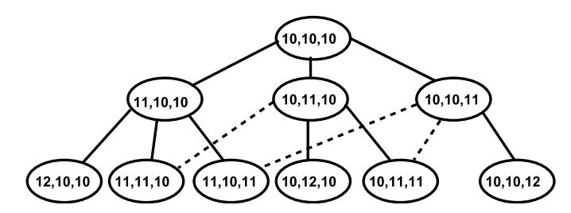

**Fig. 2.** ICT for three agents.

the best in the open list. This avoids the generation of surplus nodes and dramatically reduces the number of generated nodes.

In MAPF problems, when using the SIC heuristic, the effect on the *f* -value of moving a single agent in a given direction can be efficiently computed. Exact details of how this OSF for MAPF is computed and implemented can be found in [\[20\].](#page-25-0)

#### *3.3.9. The increasing cost tree search*

We recently presented a novel approach for solving MAPF instances optimally searching a tree called the *increasing cost tree* (ICT) using a corresponding search algorithm, called the *increasing cost tree search* (ICTS) [\[40,42\].](#page-25-0) ICTS is a two-level search algorithm.

*High level:* At its *high level*, ICTS searches the *increasing cost tree* (ICT). Every node in the ICT consists of a *k*-ary vector [*C*1*,... Ck*] which represents *all* possible solutions in which the individual path cost of agent *ai* is exactly *Ci* . The root of the ICT is [*opt*1*,..., optk*], where *opti* is the optimal individual path cost for agent *ai* , i.e. the shortest path length from *si* to *gi* while ignoring other agents. A child in the ICT is generated by increasing the cost limit for one of the agents by one (or some unit cost). An ICT node [*C*1*,.., Ck*] is a *goal* if there is a complete non-conflicting solution such that the cost of the individual path for *ai* is exactly *Ci* . Fig. 2 illustrates an ICT with 3 agents, all with optimal individual path costs of 10. The total cost of a node is *C*1 +*...*+ *Ck*. For the root this is exactly the SIC heuristic of the start state, i.e., *SIC(start)* = *opti* +*opt*2 +*...*+*optk*. We use *Δ* to denote the depth of the lowest cost ICT goal node. The size of the ICT tree is exponential in *Δ*. Since all nodes at the same height have the same total cost, a breadth-first search of the ICT will find the optimal solution.

*Low level:* The low level acts as a goal test for the high level. For each ICT node [*C*1*,.., Ck*] visited by the high level, the *low level* is invoked. The task of the low level is to find a non-conflicting complete solution such that the cost of the individual path of agent *ai* is exactly *Ci* . For each agent *ai* , ICTS stores *all* single-agent paths of cost *Ci* in a special compact data-structure called a *multi-value decision diagram* (MDD) [\[44\].](#page-25-0) The low level searches the cross product of the MDDs in order to find a set of *k* non-conflicting paths for the different agents. If such a non-conflicting set of paths exists, the low level returns *true* and the search halts. Otherwise, *false* is returned and the high level continues to the next high-level node (of a different cost combination).

*Pruning rules:* Special pruning techniques were introduced for high-level nodes [\[42\].](#page-25-0) These techniques search for a sub-solution for *i* agents, where *i < k*. If there exists a sub-group for which no valid solution exists, there cannot exist a valid solution for all *k* agents. Thus, the high-level node can be declared as a non-goal without searching for a solution in the *k*-agent path space. The enhanced version of ICTS (ICTS + pruning) [\[41,42\]](#page-25-0) showed up to two orders of magnitude speedup over Standley's A\* approach (A\* + OD + ID) [\[45\].](#page-25-0)

# **4. The conflict based search algorithm (CBS)**

We now turn to describe our new algorithm, the *conflict based search algorithm* (CBS). Later, in Section [8,](#page-17-0) we present a generalization to CBS called *meta-agent conflict based search* (MA-CBS). In addition, a memory efficient variant of CBS is presented in [Appendix A.](#page-23-0)

Recall that the state space spanned by A\* in MAPF is exponential in *k* (the number of agents). By contrast, in a singleagent pathfinding problem, *k* = 1, and the state space is only linear in the graph size. CBS solves MAPF by decomposing it into a large number of constrained single-agent pathfinding problems. Each of these problems can be solved in time proportional to the size of the map and length of the solution, but there may be an exponential number of such single-agent problems.

# *4.1. Definitions for CBS*

The following definitions are used in the remainder of the paper.

- We use the term *path* only in the context of a single agent and use the term *solution* to denote a set of *k* paths for the given set of *k* agents.
- A *constraint* is a tuple *(ai, v,t)* where agent *ai* is prohibited from occupying vertex *v* at time step *t*. During the course of the algorithm, agents will be associated with constraints. A *consistent path* for agent *ai* is a path that satisfies all its

constraints. Likewise, a *consistent solution* is a solution that is made up from paths, such that the path for any agent *ai* is consistent with the constraints of *ai* .

- A *conflict* is a tuple *(ai,a j, v,t)* where agent *ai* and agent *a j* occupy vertex *v* at time point *t*. A solution (of *k* paths) is *valid* if all its paths have no conflicts. A consistent solution can be *invalid* if, despite the fact that the individual paths are consistent with the constraints associated with their agents, these paths still have conflicts.

The key idea of CBS is to grow a set of constraints and find paths that are consistent with these constraints. If these paths have conflicts, and are thus invalid, the conflicts are resolved by adding new constraints. CBS works in two levels. At the high level, conflicts are found and constraints are added. The low level finds paths for individual agents that are consistent with the new constraints. Next, we describe each part of this process in more detail.

# *4.2. High level*

In the following section we describe the high-level process of CBS and the search tree it searches.

# *4.2.1. The constraint tree*

At the high level, CBS searches a tree called the *constraint tree* (CT). A CT is a binary tree. Each node *N* in the CT consists of:

- 1. **A set of constraints** (*N.constraints*). Each of these constraints belongs to a single agent. The root of the CT contains an empty set of constraints. The child of a node in the CT inherits the constraints of the parent and adds one new constraint for one agent.
- 2. **A solution** (*N.solution*). A set of *k* paths, one path for each agent. The path for agent *ai* must be consistent with the constraints of *ai* . Such paths are found by the low-level search.
- 3. **The total cost (***N.cost***)** of the current solution (summed over all the single-agent path costs). This cost is referred to as the *f* -value of node *N*.

Node *N* in the CT is a goal node when *N.solution* is valid, i.e., the set of paths for all agents has no conflicts. The high level performs a best-first search on the CT where nodes are ordered by their costs. In our implementation, ties are broken in favor of CT nodes whose associated solution contains fewer conflicts. Further ties were broken in a FIFO manner.

# *4.2.2. Processing a node in the CT*

Given the list of constraints for a node *N* of the CT, the low-level search is invoked. The low-level search (described in detail below) returns one shortest path for each agent, *ai* , that is consistent with all the constraints associated with *ai* in node *N*. Once a consistent path has been found for each agent (with respect to its own constraints) these paths are then *validated* with respect to the other agents. The *validation* is performed by iterating through all time steps and matching the locations reserved by all agents. If no two agents plan to be at the same location at the same time, this CT node *N* is declared as the goal node, and the current solution (*N.solution*) that contains this set of paths is returned. If, however, while performing the *validation*, a conflict *C* = *(ai,a j, v,t)* is found for two or more agents *ai* and *a j* , the validation halts and the node is declared a non-goal node.

## *4.2.3. Resolving a conflict*

Given a non-goal CT node *N* whose solution *N.solution* includes a *conflict Cn* = *(ai,a j, v,t)* we know that in any valid solution, at most one of the conflicting agents (*ai* and *a j*) may occupy vertex *v* at time *t*. Therefore, at least one of the constraints *(ai, v,t)* or *(a j, v,t)* must be added to the set of constraints in *N.constraints*. To guarantee optimality, both possibilities are examined and node *N* is split into two children. Both children inherit the set of constraints from *N*. The left child resolves the conflict by adding the constraint *(ai, v,t)* and the right child adds the constraint *(a j, v,t)*.

Note that for a given CT node *N*, one does not have to save all its cumulative constraints. Instead, it can save only its latest constraint and extract the other constraints by traversing the path from *N* to the root via its ancestors. Similarly, with the exception of the root node, the low-level search should only be performed for agent *ai* which is associated with the newly added constraint. The paths of other agents remain the same as no new constraints are added for them.

# *4.2.4. Conflicts of k >* 2 *agents*

It may be the case that while performing the validation between the different paths a *k-agent conflict* is found for *k >* 2. There are two ways to handle such *k*-agent conflicts. We can generate *k* children, each of which adds a constraint to *k* − 1 agents (i.e., each child allows only one agent to occupy the conflicting vertex *v* at time *t*). Or, an equivalent formalization is to only focus on the first two agents that are found to conflict, and only branch according to their conflict. This leaves further conflicts for deeper levels of the tree. This is illustrated in [Fig. 3.](#page-9-0) The top tree represents a variant of CT where *k*-way branching is allowed for a single conflict that includes *k*-agents for the case where *k* = 3. Each new successor adds *k* − 1 (= 2) new constraints (on all agents but one). The bottom tree presents a binary CT for the same problem. Note that the bottom middle state is a duplicate state, and if duplicate detection is not applied there will be two occurrences of this node

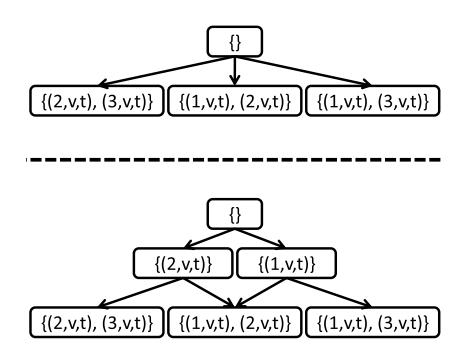

**Fig. 3.** A *(k* = 3*)*-way branching CT (top) and a binary CT for the same problem (bottom).

instead of one. As can be seen the size of the deepest layer in both trees is identical. The complexity of the two approaches is similar, as they both will end up with *k* nodes, each with *k* − 1 new constraints. For simplicity we implemented and describe only the second option.

# *4.2.5. Edge conflicts*

For simplicity we described only conflicts that occur in vertices. But if according to the problem definition agents are not allowed to cross the same edge at opposite direction then *edge conflicts* can also occur. We define an *edge conflict* to be the tuple *(ai,a j, v*1*, v*2*,t)* where two agents "swap" locations (*ai* moves from *v*1 to *v*2 while *a j* moves from *v*2 to *v*1) between time step *t* to time step *t* + 1. An edge constraint is defined as *(ai, v*1*, v*2*,t)*, where agent *ai* is prohibited of starting to move along the edge from *v*1 to *v*2 at time step *t* (and reaching *v*2 at time step *t* + 1). When applicable, edge conflicts are treated by the high level in the same manner as vertex conflicts.

# *4.2.6. Pseudo-code and example*

Algorithm 2 presents the pseudo code for CBS, as well as the more advanced MA-CBS that will be explained later in Section [8.](#page-17-0) Lines 11–18 are only relevant for MA-CBS. For now, assume that the *shouldMerge()* function (in line 11) always returns *false*, skipping lines 11–18. The high level has the structure of a best-first search.

# **Algorithm 2:** High level of CBS (and MA-CBS).

**Input**: MAPF instance *Root.constraints* =∅ *Root.solution* = find individual paths by the low level() *Root.cost* = *SIC(Root.solution)* insert *Root* to OPEN **while** OPEN *not empty* **do** *P* ← best node from OPEN // *lowest solution cost* Validate the paths in *P* until a conflict occurs. **if** *P has no conflict* **then return** *P.solution* // *P is goal* C ← first conflict (*ai,a j, v,t*) in *P* **if** *shouldMerge(ai,a j) // Optional, MA-CBS only* **then** *a*{*i,j*} = *merge(ai,a j, v,t)* Update *P.constraints*(external constraints). Update *P.solution* by invoking low level(*a*{*i,j*}) Update *P.cost* **if** *P.cost <* ∞ *// A solution was found* **then** Insert *P* to OPEN continue // go back to the while statement **foreach** *agent ai in C* **do** *A* ← new node *A.constraints* ← *P.constraints* + *(ai, v,t) A.solution* ← *P.solution* Update *A.solution* by invoking low level(*ai*) *A.cost* = *SIC(A.solution)* **if** *A.cost <* ∞ *// A solution was found* **then** Insert *A* to OPEN

We describe CBS using our example from [Fig. 1](#page-3-0) (Section [2.7\)](#page-2-0), where the mice need to get to their respective pieces of cheese. The corresponding CT is shown in [Fig. 4.](#page-10-0) The root contains an empty set of constraints. In line 2 the low level

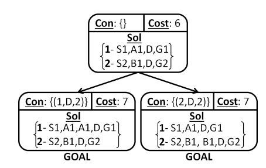

**Fig. 4.** An example of a *Constraint Tree* (CT).

returns an optimal solution for each agent, *S*1*, A*1*, D, G*1 for *a*1 and *S*2*, B*1*, D, G*2 for *a*2. Thus, the total cost of this node is 6. All this information is kept inside this node. The root is then inserted into OPEN and will be expanded next.

When validating the two-agent solution given by the two individual paths (line 7), a conflict is found when both agents arrive at vertex *D* at time step 2. This creates a conflict (*a*1*,a*2*, D,* 2) (line 10). As a result, the root is declared as a non-goal and two children are generated in order to resolve the conflict (line 19). The left child, adds the constraint *(a*1*, D,* 2*)* while the right child adds the constraint *(a*2*, D,* 2*)*. The low-level search is now invoked (line 23) for the left child to find an optimal path that also satisfies the new constraint. For this, *a*1 must wait one time step either at *A*1 or at *S*1 and the path *S*1*, A*1*, A*1*, D, G*1 is returned for *a*1. The path for *a*2, *S*2*, B*1*, D, G*2 remains unchanged in the left child. The total cost for the left child is now 7. In a similar way, the right child is generated, also with cost 7. Both children are inserted to OPEN (line 26). In the next iteration of the while loop (line 5) the left child is chosen for expansion, and the underlying paths are validated. Since no conflicts exist, the left child is declared a goal node (line 9) and its solution is returned as an optimal solution.

# *4.3. Low level: find paths for CT nodes*

The low-level search is given an agent, *ai* , and the set of constraints associated with *ai* . It performs a search in the underlying graph to find an optimal path for agent *ai* that satisfies all its constraints while completely ignoring the other agents. The search space for the low-level search has two dimensions: the spatial dimension and the time dimension.2 Any single-agent pathfinding algorithm can be used to find the path for agent *ai* , while verifying that the constraints are satisfied. We implemented the low-level search of CBS with A\* which handled the constraints as follows. Whenever a state *(v,t)* is generated where *v* is a location and *t* a time step and there exists a constraint (*ai, v,t*) in the current CT (high-level) node, this state is discarded. The heuristic we used is the shortest path in the spatial dimension, ignoring other agents and constraints.

For cases where two low-level A\* states have the same *f* -value, we used a tie-breaking policy based on Standley's tie-breaking *conflict avoidance table* (CAT) (described in Section [3.3.4\)](#page-6-0). States that contain a conflict with a smaller number of other agents are preferred. For example, if states *s*1 = *(v*1*,t*1*)* and *s*2 = *(v*2*,t*2*)* have the same *f* value, but *v*1 is used by two other agents at time *t*1 while *v*2 is not used by any other agent at time *t*2, then *s*2 will be expanded first. This tie-breaking policy improves the total running time by a factor of 2 compared to arbitrary tie breaking. Duplicate states detection and pruning (DD) speeds up the low-level procedure. Unlike single-agent pathfinding, the low-level state-space also includes the time dimension and dynamic 'obstacles' caused by constraints. Therefore, two states are considered duplicates if both the position of *ai* and the time step are identical in both states.

# **5. Theoretical analysis**

In this section we discuss theoretical aspects of CBS. We begin with a proof that CBS returns the optimal solution followed by a proof of completeness. We then discuss the pros and cons of CBS when compared to other algorithms. All claims in this section assume the sum-of-costs cost function. Adapting these claims to other cost functions is discussed in Section [7.](#page-16-0)

# *5.1. Optimality of CBS*

We start by providing several supporting claims for the optimality proof.

**Definition 1.** For a given node *N* in the constraint tree, let *CV(N)* be the set of *all* solutions that are: (1) *consistent* with the set of constraints of *N* and (2) are also *valid* (i.e., without conflicts).

2 The spatial dimension itself may contain several internal dimensions. For example a 2D map contains two dimensions. A *k*-dimensional graph along with the time dimension results in a search space with *k* + 1 dimensions.

If *N* is not a goal node, then the solution at *N* will not be part of *CV(N)* because the solution is not valid. For example, consider the root node. The root has no constraints thus *CV(root)* equals to the set of all possible valid solutions. If the solution chosen for the root is not valid and thus is not part of *CV(root)*, the root will not be declared a goal.

**Definition 2.** We say that node *N permits* a solution *p* if *p* ∈ *CV(N)*.

The root of the CT, for example, has an empty set of constraints. Any valid solution satisfies the empty set of constraints. Thus the root node *permits* all valid solutions.

The cost of a solution in *CV(N)* is the sum of the costs of the individual agents. Let *minCost(CV(N))* be the minimum cost over all solutions in *CV(N)*. In the case of *CV(N)* =∅ then *minCost(CV(N))* =∞.

**Lemma 1.** *The cost of a node N in the CT is a lower bound on minCost(CV(N)).*

**Proof.** Since *N.cost* is the sum of all the optimal consistent single agent solutions, it has the minimum cost among all consistent solutions. By contrast, *minCost(CV(N))* has the minimum cost among all consistent and valid solutions. Since the set of all consistent and valid solutions is a subset of all consistent solutions, it must be that *N.cost* ≤ *minCost(CV(N))*. ✷

**Lemma 2.** *For each valid solution p, there exists at least one node N in* OPEN *such that N permits p.*

**Proof.** By induction on the expansion cycle: In the base case OPEN only contains the root node, which has no constraints. Consequently, the root node *permits* all valid solutions. Now, assume this is true after the first *i* − 1 expansions. During expansion *i* assume that node *N* is expanded. The successors of node *N*–*N*1 and *N*2 are generated. Let *p* be a valid solution. If *p* is permitted by another node in OPEN, we are done. Otherwise, assume *p* is permitted by *N*. We need to show that *p* must be permitted by at least one of its successors. The new constraints for *N*1 and *N*2 share the same time and location, but constrain different agents. Suppose a solution *p* permitted by *N* has agent *a*1 at the location of the constraint. Agent *a*1 can only be constrained at one of *N*1 and *N*2, but not both, so one of these nodes must permit *p*. Thus, the induction holds. ✷

**Consequence:** at all times at least one CT node in OPEN *permits* the optimal solution (as a special case of Lemma 2).

**Theorem 1.** *CBS returns an optimal solution.*

**Proof.** When a goal node *G* is chosen for expansion by the high level, all valid solutions are *permitted* by at least one node from OPEN (Lemma 2). Let *p* be a valid solution (with cost *p.cost*) and let *N(p)* be the node that *permits p* in OPEN. Let *N.cost* be the cost of node *N*. *N(p).cost* ≤ *p.cost* (Lemma 1). Since *G* is a goal node, *G.cost* is a cost of a valid solution. Since the high-level search explores nodes in a best-first manner according to there cost we get that *G.cost* ≤ *N(p).cost* ≤ *p.cost*. ✷

*5.2. Completeness of CBS*

The state space for the high-level search of CBS is infinite as constraints can be added for an infinite number of time steps. This raises the issue of completeness. Completeness of CBS includes two claims:

**Claim a:** CBS will return a solution if one exists.

**Claim b:** CBS will identify an unsolvable problem.

We will now show that claim *a* is always true while claim *b* requires a test independent to CBS.

*5.2.1. Claim a*

**Theorem 2.** *For every cost C, there is a finite number of CT nodes with cost C.*

**Proof.** Assume a CT node *N* with cost *C*. After time step *C* all agents are at their goal position. Consequently, no conflicts can occur after time step *C*. Since constraints are derived from conflicts, no constraints are generated for time steps greater than *C*. As the cost of every CT node is monotonically non-decreasing, all of the predecessors of the CT node *N* have cost ≤*C*. Hence, neither *N* nor any of its predecessors can generate constraints for time step greater than *C*. Since there is a finite number of such constraints (at most *k* ·|*V* | · *C* constraints on vertices and *k* ·|*E*| · *C* constraints on edges), there is also a finite number of CT nodes that contain such constraints. ✷

**Theorem 3.** *CBS will return a solution if one exist.*

**Fig. 5.** An example of an unsolvable MAPF instance.

**Proof.** CBS uses a systematic best-first search, and the costs of the CT nodes are monotonically non-decreasing. Therefore, for every pair of costs *X* and *Y* , if *X < Y* then CBS will expand all nodes with cost *X* before expanding nodes of cost *Y* . Since for each cost there is a finite number of CT nodes [\(Theorem 2\)](#page-11-0), then the optimal solution must be found after expanding a finite number of CT nodes. ✷

#### *5.2.2. Claim b*

Claim *b*, does not always hold for CBS. For example, consider the problem presented in Fig. 5 where two agents need to switch locations. The CT will grow infinitely, adding more and more constraints, never reaching a valid solution. Fortunately, Yu and Rus [\[57\]](#page-26-0) have recently presented an algorithm that detects weather a given MAPF instance is solvable or not. Running their algorithm prior to CBS would satisfy claim *b* as CBS will be called only if the instance is solvable.

#### *5.3. Comparison with other algorithms*

This section compares the work done by CBS to that of A\* when both aim to minimize the sum-of-costs function and both use the SIC heuristic. Assume we use A\* for MAPF. Let *χ* be the set of (multi-agent) A\* nodes with *f &lt; C*∗ when A\* is executed with the SIC heuristic. Also, let *X* =|*χ*|. It is well known that A\* must expand all nodes in *χ* in order to guarantee optimality [\[11\].](#page-25-0)

In prior work we analyzed the worst case behavior of A\* and ICTS [\[42\].](#page-25-0) A\* generates, in the worst case, up to *X* ×*(bbase) k* nodes. ICTS searches, in the worst case, up to *X* × *kΔ* low-level nodes (where *Δ* is the depth of the lowest cost ICT goal node). Note that the low-level nodes visited by ICTS are states in the *k*-agent MDD search space, which is similar but not the same as the nodes visited by A\*. For more details, see [\[42\].](#page-25-0) We limit the discussion here to comparing CBS only to A\*, as the relation between A\* and ICTS was already studied [\[42\].](#page-25-0) Let *Υ* be the set of nodes with *cost < C*∗ in the CT and let *Y* =|*Υ* |. As a best-first search guided by the *cost* of nodes and since *cost* is monotonically non-decreasing, CBS must expand all the nodes in *Υ* . We restrict ourselves to giving an upper bound on *Y* . As the branching factor of the CT is 2, 2*d* nodes must be expanded in the worst case where *d* is the depth of the CT once a solution is found. At each node of the CT exactly one constraint is added. In the worst case an agent will be constrained to avoid every vertex except one at every time step in the solution. The total number of time steps summed over all agents is *C*∗. Thus, an upper bound on *Y* , the number of CT nodes that CBS must expand, is 2|*V* |×*C*∗ . For each of these nodes the low level is invoked and expands at most |*V* | × *C*∗ (single-agent) states for each time step. Let *Y* be the number of states expanded in the underlying graph (low-level states). *Y* = *O(*2|*V* |×*C*∗ ×|*V* | × *C*∗*)*. Note that we counted low-level nodes that are expanded within expanded high-level nodes. If we also want to consider the generated high-level nodes we should multiple this by 2 as each expanded CT node generates 2 new nodes. Again, in practice *Y* and *Y* can be significantly smaller.

CBS performs a high-level search in the CT and then a low-level search in the underlying graph and expands a total of *Y* low-level states. Thus, if *Y X*, that is, if the number of states expanded in all the single-agent searches is much smaller than the number of (multi-agent) A\* states with *f < C*∗, then CBS will outperform A\* and vice-versa. One may be surprised by this result, showing that CBS can potentially consider less states than A\*, as A\* is known to be "optimally efficient" in the sense that it expands only the set of nodes necessary to find optimal solution. The "optimally efficient" property of A\*, however, is only true if comparing A\* with another BFS searching the same state space, using the same, consistent, heuristic function, and ignoring the impact of tie-breaking between states with the same *f* values [\[11\].](#page-25-0) CBS, searches a completely different state space than the traditional A\*, and thus can be arbitrarily better than A\*.

Next we show special cases where *Y X* (bottleneck) and where *X Y* (open space). The overall trend seems to be typical for MAPF, where the topology of the domain greatly influences the behavior of algorithms.

### *5.3.1. Example of CBS outperforming A\* (bottlenecks)*

Our example of [Fig. 1](#page-3-0) (Section [2.7\)](#page-2-0) demonstrates a case where *Y X*, i.e., a case where CBS expands fewer nodes than A\*. As detailed above, CBS generates a total of three CT nodes (shown in [Fig. 4](#page-10-0) in Section [4.2.6\)](#page-9-0). At the root, the low level is invoked for the two agents. The low-level search finds an optimal path for each of the two agents (each of length 3), and expands a total of 8 low-level states for the CT root. Now, a conflict is found at *D*. Two new CT children nodes are generated. In the left child the low-level searches for an alternative path for agent *a*1 that does not pass through *D* at time step 2. *S*1 plus all *m* states *A*1*,..., Am* are expanded with *f* = 3. Then, *D* and *G*1 are expanded with *f* = 4 and the search halts and returns the path *S*1*, A*1*, A*1*, D, G*1.

Thus, at the left child a total of *m* + 3 nodes are expanded. Similar, *m* + 3 states are expanded for the right child. Adding all these to the 8 states expanded at the root we get that a total of *Y* = 2*m* + 14 low-level states are expanded.

Now, consider A\* which is running in a 2-agent state space. The root (*S*1*, S*2) has *f* = 6. It generates *m*2 nodes, all in the form of *(Ai, B j)* for *(*1 ≤ *i, j* ≤ *m)*. All these nodes are expanded with *f* = 6. Now, node *(A*1*, D)* with *f* = 7 is expanded

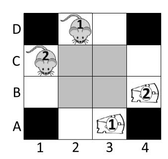

**Fig. 6.** A pathological case where CBS is extremely inefficient.

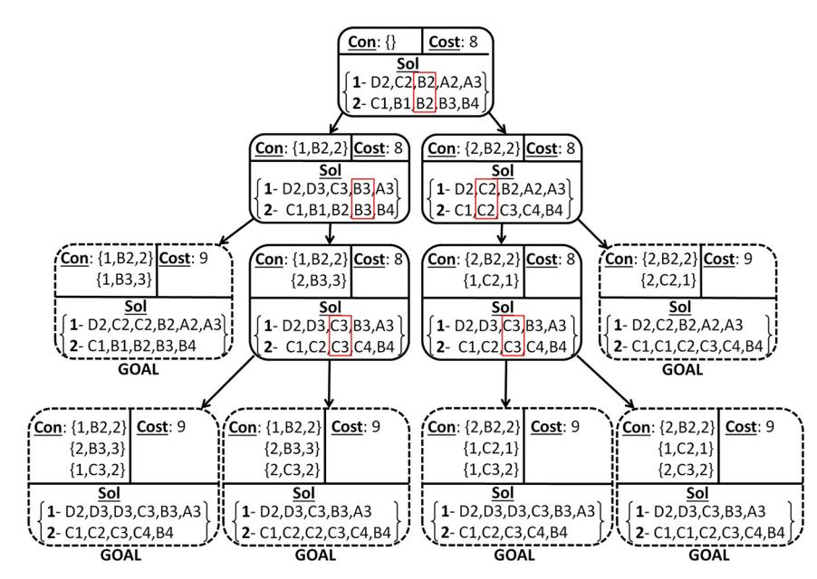

**Fig. 7.** The CT for the pathological case where CBS is extremely inefficient.

(agent *a*1 waits at *A*1). Then nodes *(D, G*2*)* and *(G*1*, G*2*)* are expanded and the solution is returned. So, in total A\* expanded *X* = *m*2 + 3 nodes. For *m* ≥ 5 this is larger than 2*m* + 14 and consequently, CBS will expand fewer nodes. A\* must expand the Cartesian product of single agent paths with *f* = 3. By contrast, CBS only tried two such paths to realize that no solution of cost 6 is valid.

Furthermore, the constant time per (low-level) node of CBS is much smaller than the constant time per node of A\* for two reasons: A\* expands multi-agent nodes while CBS expands single-agent states. Second, the open list maintained by CBS is much smaller because the single agent search space is linear in the size of the input graph. By contrast the open list for A\* deals with the multi-agent state space which is exponentially larger. Consequently, insertion and extraction of nodes from the open list is faster in CBS. CBS also incurs overhead directly at the high-level nodes. Each non-goal high-level node requires validating the given solution and generating two successors. The number of high-level nodes is very small compared to the low-level nodes. Consequently, the overhead of the high-level is negligible.

# *5.3.2. Example of A\* outperforming CBS (open space)*

Fig. 6 presents a case where *Y X* and A\* will outperform CBS. There is an open area in the middle (in gray) and all agents must cross this area. For each agent there are four optimal paths of length 4 and thus the SIC heuristic of the start state is 8. However, each of the 16 combinations of these paths has a conflict in one of the gray cells. Consequently, *C*∗ = 9 as one agent must wait at least one step to avoid collision. For this problem A\* will expand 5 nodes with *f* = 8: {*(D*2*, C*1*),(D*3*, C*2*),(D*3*, B*1*),(C*2*, B*1*),(C*3*, B*2*)*} and 3 nodes with *f* = 9 {*(B*3*, B*2*),(A*3*, B*3*),(A*3*, B*4*)*} until the goal is found and a total of 8 nodes are expanded.

Now, consider CBS. CBS will build a CT which is shown in Fig. 7. The CT consists of 5 non-goal CT nodes with cost 8, and 6 goal CT nodes (dashed outline) with cost 9. The root CT node will run the low-level search for each agent to a total of 8 low-level expansions. Each non-goal CT node except the root will run the low-level search for a single agent to a total of 4 low-level expansions. Each goal CT node will expand 5 low-level nodes. In total, CBS will expand 8 + 4 · 4 + 6 · 5 = 54 low-level nodes.

Since the *Conflict Tree* grows exponentially in the number of conflicts encountered, CBS behaves poorly when a set of agents is *strongly coupled*, i.e., when there is a high rate of internal conflicts between agents in the group.

While it is hard to predict the performance of the algorithms in actual domains, the above observations can give some guidance. If there are more bottlenecks, CBS will have advantage over the A\*-based approaches as it will rule out the *f* -value where agents conflict in the bottleneck very quickly and then move to solutions which bypass the bottlenecks. If there are more open spaces, A\* will have the advantage over CBS as it will rule out conflicted solutions very fast. Next, we show experimental results supporting both cases.

# **6. CBS empirical evaluation**

CBS, as well as the other algorithms presented in this paper, is applicable to many variants of the MAPF problem. Next, we describe the MAPF variant and experimental setting used for our empirical analysis. This specific MAPF variant and setting was chosen to conform with prior work [\[42,38,39,45,46\].](#page-25-0)

# *6.1. Experimental problem settings*

At each time step all agents can simultaneously perform a move or wait action. Our implementation assumes that both moving and waiting have unit cost. We also make the following two assumptions:

- 1. The agents never disappear. Even if an agent arrived at its goal it will block other agents from passing through it.
- 2. Wait actions at the goal cost zero only if the agent never leaves the goal later. Otherwise, they cost one.

In addition, in our experimental setting agents are allowed to *follow* each other. That is, agent *ai* can move from *x* to *y* if, at the same time, agent *a j* also moves from *y* to *z*. Following [\[45,42,55,13\],](#page-25-0) we allow agents to follow each other in a cyclic chain. We believe that this policy is more suited to represent a multi-robot scenario, as indeed robots can move simultaneously in a circle (without an empty space). Not allowing following in a chain is more common in the pebble motion literature [\[9\],](#page-25-0) where pebbles are moved one after the other, and thus at least one empty space is needed to initiate a movement. Edge conflicts are also prohibited. That is agent *ai* is prohibited to move from *x* to *y* if at the same time agent *a j* moves from *y* to *x*. Our implementation does not use a duplicate detection and pruning procedure (DD) at the high level as we found it to have a large overhead with negligible improvement. The low level, on the other hand, does use DD.

The specific global cumulative cost function used in our experiments is the *sum-of-costs* function explained in Section [2.4.](#page-2-0) If, for instance, it takes agents *a*1 and *a*2 2 and 3 time steps to reach their goal respectively, then the sum-of-costs for these two agents is 2 + 3 = 5. Note that for each agent the number of time steps are counted until the time step in which it arrives at its goal without moving away. An agent that reaches its goal but later on is forced to move away might cause a dramatic increase in the total cost. To remedy this we used the same mechanism of EPEA\* [\[15\]](#page-25-0) which generates high-level nodes one at a time according to their *f* -value.

For an admissible heuristic for the low-level search we used the SIC heuristic (see Section [3.3.1\)](#page-5-0) in all our experiments.

# *6.2. Experimental results*

We implemented and experimented with A\*, EPEA\*, ICTS + pruning (denoted ICTS) and CBS. For ICTS, we used the *all triples pruning* [\[42\],](#page-25-0) which has been found to be very effective. All algorithms, excluding ICTS, are based on the SIC heuristic. ICTS uses more advanced pruning that could potentially apply to CBS and A\* as advanced heuristics in the future. Despite this, CBS without this advanced heuristic still outperforms ICTS in many scenarios.

# *6.2.1.* 8 × 8 *4-connected grid*

We begin with an 8 × 8 4-connected open grid where the number of agents ranges from 3 to 21. We set a time limit of 5 minutes. If an algorithm could not solve an instance within the time limit it was halted and *fail* was returned. Our aim here is to study the behavior of the different algorithms for a given number of agents. When the ID framework is applied to *k* agents (whose start and goal locations are randomized) the resulting *effective* number of agents, *k* , is noisy and its variance is very large. Therefore, for this experiment we followed [\[42\]](#page-25-0) and created problem instances where all agents are dependent, according to the ID framework.3 In such cases *k* ≡ *k* and running the ID framework is superfluous.

[Fig. 8](#page-15-0) shows the success rate, i.e., the percentage of instances that could be solved under 5 minutes by the different algorithms when the number of agents increases. In these simple problems A\* is clearly inferior, and CBS holds a slight advantage over the other approaches.

[Table 1](#page-15-0) presents the number of nodes generated and the run time averaged over 100 instances. For the case of CBS both the high-level (hl) nodes and low-level (ll) states are reported. "NA" denotes problems where A\* obtained less than 80% success rate (more than 20% fail) for a given number of agents. The count column states the number of instances solved by

3 Such experiments were called type 2 experiments in [\[42\].](#page-25-0)

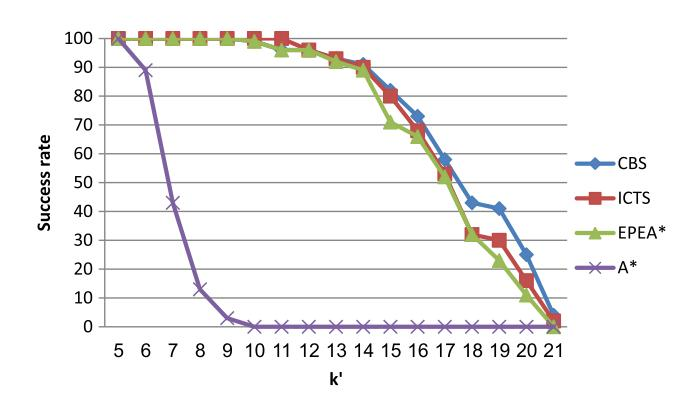

**Fig. 8.** Success rate vs. number of agents 8 × 8 grid.

**Table 1** Nodes generated and running time on 8 × 8 grid.

| k  | #Generated Count | nodes A* | EPEA*  | CBS(hl) | CBS(ll) | Run-time A* | (ms) EPEA* | ICTS   | CBS    | p-val |
|-----|------------------|----------|--------|---------|---------|-------------|------------|--------|--------|-------|
| 3   | 100              | 640      | 15     | 10      | 490     | 8           | 0          | 1      | 7      | 0.01  |
| 4   | 100              | 3965     | 25     | 24      | 1048    | 207         | 1          | 1      | 14     | 0.02  |
| 5   | 100              | 21,851   | 35     | 51      | 2385    | 3950        | 3          | 1      | 32     | 0.01  |
| 6   | 89               | 92,321   | 39     | 45      | 1354    | 37,398      | 4          | 8      | 20     | 0.09  |
| 7   | 100              | NA       | 88     | 117     | 3994    | NA          | 15         | 20     | 60     | 0.00  |
| 8   | 100              | NA       | 293    | 266     | 8644    | NA          | 75         | 100    | 148    | 0.00  |
| 9   | 100              | NA       | 1053   | 1362    | 45,585  | NA          | 444        | 757    | 879    | 0.01  |
| 10  | 99               | NA       | 2372   | 3225    | 111,571 | NA          | 1340       | 3152   | 2429   | 0.02  |
| 11  | 94               | NA       | 7923   | 8789    | 321,704 | NA          | 8157       | 7318   | 7712   | 0.44  |
| 12  | 92               | NA       | 13,178 | 12,980  | 451,770 | NA          | 13,787     | 19,002 | 12,363 | 0.36  |
| 13  | 86               | NA       | 14,989 | 15,803  | 552,939 | NA          | 18,676     | 28,381 | 16,481 | 0.50  |
| 14  | 83               | NA       | 13,872 | 21,068  | 736,278 | NA          | 15,407     | 35,801 | 24,441 | 0.14  |
| 15  | 71               | NA       | 22,967 | 24,871  | 826,725 | NA          | 33,569     | 54,818 | 30,509 | 0.45  |
| 16  | 64               | NA       | 26,805 | 24,602  | 822,771 | NA          | 41,360     | 65,578 | 34,230 | 0.32  |
| 17  | 49               | NA       | 25,615 | 17,775  | 562,575 | NA          | 42,382     | 75,040 | 25,653 | 0.22  |

all algorithms within the time limit. Average results are presented only for those instances. Similar to [\[42\]](#page-25-0) we do not report the number of nodes for the ICTS variants because this algorithm is not based solely on search.

The results of EPEA\* and CBS are relatively similar. To investigate the statistical significance of the differences between them, we performed a paired t-test on the runtime results of these two algorithms. The resulting p-values are shown in the "p-val" column. As can be seen, for larger problem sizes the significance of the difference between the algorithms becomes smaller (high p-value corresponds to smaller significance). This is because some problems are very difficult to solve, while other problems are easy and can be solved fast. This fact, together with the exponential nature of MAPF, results in high variance of the runtime results. Clearly, pure A\* is the worst algorithm while EPEA\* is the strongest A\* variant. CBS is faster than ICTS for more than 11 agents. Note that although CBS generates more nodes than EPEA\*, it is still faster in many cases (*k >* 14) due to the fact that the constant time per node of the low-level CBS (single-agent state, small open list) is much smaller than that of EPEA\* (multiple agents, large open list). CBS was faster than EPEA\* and ICTS by up to a factor of 2 and 3 respectively.

#### *6.2.2. DAO maps*

We also experimented on 3 benchmark maps from the game *Dragon Age: Origins* [\[47\].](#page-25-0) Here we aimed to show the overall performance of the evaluated algorithms. Unlike the results above, here we perform ID on top of each of the evaluated algorithms. The different algorithms are given a problem instance with a given number of *k* agents, where the start and goal locations are uniformly randomized. ID breaks these problems into subproblems and executes the associated algorithm on each subproblem separately. We show results only for the three strongest algorithms: EPEA\*, ICTS and CBS.

[Fig. 9](#page-16-0) (right) shows the success rates given the number of agents for the three maps. Here the results are mixed and there is no global winner. One can clearly see that ICTS is always better than EPEA\*. The performance of CBS on these maps supports our theoretical claims that CBS is very effective when dealing with corridors and bottlenecks but rather inefficient in open spaces. For den520d (top) there are no bottlenecks but there are large open spaces; CBS was third. For ost003d (middle) there are few bottlenecks and small open spaces; CBS was intermediate in most cases. Finally, for brc202b (bottom) there are many narrow corridors and bottlenecks but very few open spaces, thus CBS was best. Note that while both den520 and ost003 have open spaces they differ in the number of bottlenecks.

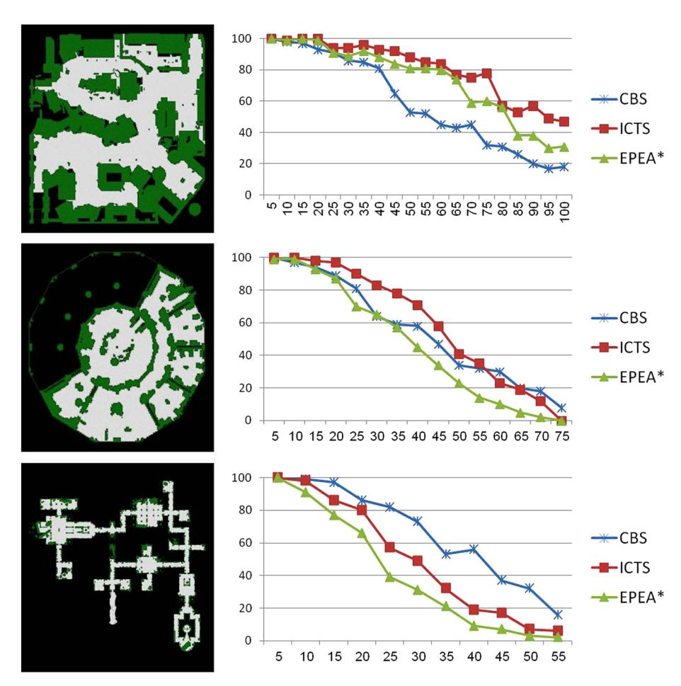

**Fig. 9.** The success rate of the different algorithms all running on top of ID for different DAO maps den520d (top), ost003d (middle), brc202d (bottom).

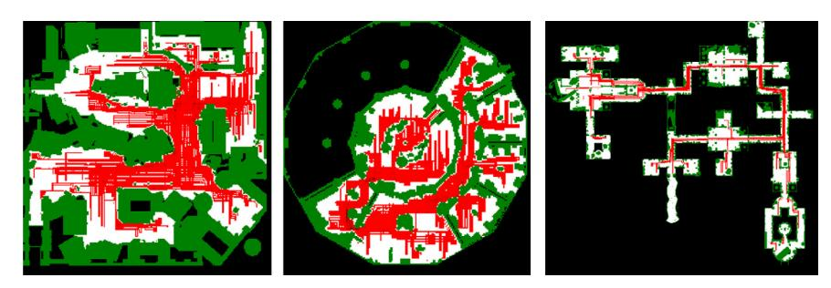

**Fig. 10.** DAO maps den520d (left), ost003d (middle), brc202d (right) and their conflicting locations.

Fig. 10 illustrates the conflicts encountered during the solving process of CBS. A cell where a conflict occurred in is colored red. The darkness of the red corresponds to the number of conflicts occurred in a cell. Darker red implies more conflicts. As can be seen in open spaces (den520d, ost003d) the conflicts are spread and cover a large portion of the map. By contrast, in brc202d the conflicts are concentrated in the corridors and bottlenecks. This illustrates how open spaces encourage more conflict and thus are less suitable for CBS.

Let SoC denote the sum-of-costs function as defined in Section [2.4.](#page-2-0) Up until now we focused on the task of minimizing the SoC function. Nevertheless, CBS can be generalized to other cost functions as follows.

### *7.1. High level*

Generalizing CBS to the *makespan* cost function requires a single change to the high level – computing the cost of CT nodes according to the makespan of their corresponding solution instead of SoC (line 24 in [Algorithm 2,](#page-9-0) Section [4.2.6\)](#page-9-0). More generally, let *Φ* be a function assigning costs to MAPF solutions. To find a solution that minimizes *Φ*, we modify CBS to compute the cost of every CT node, *N*, to be *Φ(N.solution)*. We denote an execution of CBS with cost function *Φ* as *CBSΦ* .

#### *7.2. Low level*

Recall that each high-level node, *N*, keeps a multi-agent solution, *N.solution*. Each multi-agent solution is composed of *k* single-agent paths. The low level solver, as defined above for our cost function (SoC), returns a single agent path for a given agent. The single-agent path returned by the low-level must be optimal in the sense that it keeps *Φ(N.solution)* to a minimum. It is possible, however, to improve the low-level for a given cost function. During the low-level search we suggest breaking ties according to the minimal number of conflicts encountered with other agents. This can be done using a *conflict avoidance table* (CAT) described above.

# *7.3. Optimality*

With minor modifications, the optimality proof for the sum of cost function (presented in Section [5.1\)](#page-10-0) holds for *CBSΦ* for a very wide range of cost functions. *Φ* is called admissible if *Φ(N)* ≤ *minCost(CV(N))* for every CT node *N*.

**Theorem 4.** If  $\Phi$  is admissible then  $CBS^\Phi$  is guaranteed to return the optimal solution.

**Proof.** *CBSΦ* performs a best-first search according to *Φ*. By definition, any solution in the CT subtree below *N* cannot have a solution of cost smaller than *minCost(CV(N))*. BFS guided by an admissible evaluation function is guaranteed to return the optimal solution [\[11\].](#page-25-0) ✷

SoC, makespan, and fuel cost functions are all admissible, as adding more constraints in subsequent CT nodes cannot lead to a solution with a lower cost. Therefore, according to Theorem 4, *CBSΦ* would return optimal solutions for all these cost functions.

# *7.4. Completeness*

The proof of completeness provided in Section [5.2](#page-11-0) holds for any cost function *Φ* as long as there is a finite number of solutions per given cost according to *Φ*. This condition holds for any cost function that has no zero cost actions. SoC and makespan are examples of such functions. The fuel cost function, on the other hand, does not have this property. For the fuel cost function there can be an infinite number of high-level nodes with a given cost as wait actions do not cost anything. Since the fuel cost function does not satisfy the above condition it calls for a slightly different approach. In their paper Yu and Rus [\[57\]](#page-26-0) suggest that for any solvable MAPF instance no more than *O(*|*V* | 3*)* single agent steps are required for all agents to reach their goal. This fact can be utilized to our needs as follows. For each node *N*, if *SoC(N) >* |*V* | 4, the node can safely be ignored. A solution larger than |*V* | 4 (according to SoC) must contain a time step where all agents perform a wait action simultaneously. In this case, there is a cheaper solution where this time step is removed.

# **8. Meta-agent conflict based search (MA-CBS)**

We now turn to explain a generalized CBS-based framework called meta-agent conflict based search (MA-CBS). First we provide motivation for MA-CBS by focusing on the behavior of the basic version of CBS that was described above.

# *8.1. Motivation for meta-agent CBS*

As explained previously, CBS is very efficient (compared to other approaches) for some MAPF problems and very inefficient for others. This general tendency for different MAPF algorithms to behave differently for different environments or topologies was discussed previously [\[42,38,39\].](#page-25-0) Furthermore, a given domain might have different areas with different topologies. This calls for an algorithm that will dynamically change its strategy based on the exact task and on the area it currently searches. There is room for a significant amount of research in understanding the relation between map topologies and MAPF algorithms performance. MA-CBS is a first step towards dynamically adapting algorithms.

As was shown in the previous section, CBS behaves poorly when a set of agents is *strongly coupled*, i.e., when there is a high rate of internal conflicts between agents in the set. In such cases, basic CBS may have to process a significant number of conflicts in order to produce the optimal solution. MA-CBS remedies this behavior of CBS by automatically identifying sets of strongly coupled agents and merging them into a *meta-agent*. Then, the high-level CBS continues, but this meta-agent is treated, from the CBS perspective, as a single agent. Consequently, the low-level solver of MA-CBS must be an MAPF solver, e.g., A\*+OD [\[45\],](#page-25-0) EPEA\* [\[15\],](#page-25-0) M\* [\[51\].](#page-25-0) Thus, MA-CBS is in fact a framework that can be used on top of another MAPF solver. Next, we provide the technical details of MA-CBS.

#### *8.2. Merging agents into a meta-agent*

The main difference between basic CBS and MA-CBS is the new operation of merging agents into a *meta-agent*. A metaagent consists of *M* agents. Thus, a single agent is just a meta-agent of size 1. Returning to [Algorithm 2](#page-9-0) (Section [4.2.6\)](#page-9-0), we introduce the merging action which occurs just after a new conflict is found (line 10). At this point MA-CBS has two options:

- **Branch:** In this option, we branch into two nodes based on the new conflict (lines 19–26). This is the option that is always performed by basic CBS.
- **Merge:** MA-CBS has another option, to perform the merging of two conflicting (meta) agents into a single meta-agent (lines 12–18).

The merging process is done as follows. Assume a CT node *N* with *k* agents. Suppose that a conflict was found between agents *a*1 and *a*2, and these two agents were chosen to be merged. We now have *k*−1 agents among them a new *meta-agent* of size 2, labeled *a*{1*,*2}. This meta-agent will never be split again in the subtree of the CT below *N*; it might, however, be merged with other (meta-) agents to form new meta-agents. Since nothing changed for the other agents that were not merged, we now only call the low-level search again for this new meta-agent (line 14). The low-level search for a meta-agent of size *M* is in fact an optimal MAPF problem for *M* agents and should be solved with an optimal MAPF solver. Note that the *f* -cost of this CT node may increase due to this merge action, as the optimal path for a meta-agent may be larger than the sum of optimal paths of each of these agents separately. Thus, the *f* -value of this node is recalculated and stored (line 15). The node is then added again into OPEN (line 17).

MA-CBS has two important components (in addition to the CBS components): a *merging policy* to decide which option to choose (branch or merge) (line 11), and a *constraint-merging mechanism* to define the constraints imposed on the new meta-agent (line 13). This constraint-merging mechanism must be designed such that MA-CBS still returns an optimal solution. Next, we discuss how to implement these two components.

#### *8.3. Merge policy*

We implemented the following merging policy. Two agents *ai,a j* are merged into a meta-agent *a*{*i,j*} if the number of conflicts between *ai* and *a j* recorded during the search exceeds a parameter *B*. We call *B* the *conflict bound parameter* and use the notation MA-CBS*(B)* to denote MA-CBS with a bound of *B*. Note that basic CBS is in fact MA-CBS*(*∞*)*. That is, we never choose to merge and always branch according to a conflict.

To implement this *conflict bound oriented* merging policy, a conflict matrix *CM* is maintained. *CM*[*i, j*] accumulates the number of conflicts between agents *ai* and *a j* seen thus far by MA-CBS. *CM*[*i, j*] is incremented by 1 whenever a new conflict between *ai* and *a j* is found [\(Algorithm 2,](#page-9-0) Section [4.2.6,](#page-9-0) line 10). Now, if *CM*[*i, j*] *> B* the *shouldMerge()* function (line 11) returns true and *ai* and *a j* are merged into *a*{*i,j*}. If a conflict occurs between two meta-agents, *a*1 and *a*2, because of two simple agents, *at* ∈ *a*1 and *ak* ∈ *a*2, *CM*[*t,k*] is incremented by 1 and the *shouldMerge()* function will return true if *CM*[*x, y*] *> B* over all *x* ∈ *a*1*, y* ∈ *a*2. This policy is simple and effective. However, other merging policies are possible and could potentially obtain a significant speed up.

To illustrate MA-CBS, consider again the example shown in [Fig. 1](#page-3-0) (Section [2.7\)](#page-2-0). Assume that we are using MA-CBS*(*0*)*. In this case, at the root of the CT, once the conflict *(a*1*,a*2*, D,* 2*)* is found, *shouldMerge()* returns *true* and agents *a*1 and *a*2 are merged into a new meta-agent *a*{1*,*2}.

Next, the low-level solver is invoked to solve the newly created meta-agent and a (conflict-free) optimal path for the two agents is found. If A\* is used, a 2-agent A\* will be executed for this. The high-level node is now re-inserted into OPEN, its *f* -value is updated from 8 to 9. Since it is the only node in OPEN it will be expanded next. On the second expansion the search halts as no conflicts exist – there is only one meta-agent which, by definition, contains no conflicts. Thus, the solution from the root node is returned. By contrast, for MA-CBS*(B)* with *B >* 0, the root node will be split according the conflict as described above in Section [4.2.6.](#page-9-0)

# *8.4. Merging constraints*

Denote a meta-agent by *x*. We use the following definitions:

- A *meta constraint* for a meta-agent *x* is a tuple *(x, x*ˆ*, v,t)* where a subset of agents *x*ˆ ⊆ *x* are prohibited from occupying vertex *v* at time step *t*.
- Similarly, a *meta conflict* is a tuple *(x, y, v,t)* where an individual agent *x* ∈ *x* and an individual agent *y* ∈ *y* both occupy vertex *v* at time point *t*.

Consider the set of constraints associated with (meta-) agents *ai* and *a j* before the merge. They were generated due to conflicts between agents. These conflicts (and therefore the resulting constraints) can be divided to three groups.

- 1. **internal:** conflicts between *ai* and *a j* .
- 2. **external(i):** conflicts between *ai* and any other agent *ak* (where *k* = *j*).
- 3. **external(j):** conflicts between *a j* and any other agent *ak* (where *k* = *i*).

Since *ai* and *a j* are now going to be merged, internal conflicts should not be considered as *ai* and *a j* will be solved in a coupled manner by the low level. Thus, we only consider external constraints from that point on.

# *8.4.1. Merging external constraints*

Assume that agents *ai* and *a j* are to be merged into a new meta agent *a*{*i,j*} and that *ai* has the external constraint *(ai, v,t)*. This constraint means that further up in the CT, *ai* had a conflict with some other agent *ar* at location *v* at time *t* and therefore *ai* is not allowed to be located at location *v* at time *t*.

The new meta agent must include all external constraints. Assume an external constraint *(ai, v,t)*. After merging *ai* and *a j* this constraint should apply only to the original agent, *ai* , and not apply to the entire meta-agent, i.e., {*ai*} ∪{*a j*}.

Therefore, the merged constraint is in the form of *(a*{*i,j*}*,ai, v,t)*. This is done in line 13 of [Algorithm 2](#page-9-0) (Section [4.2.6\)](#page-9-0). When merging *ai* and *a j* one would be tempted to introduce a meta constraint *(a*{*i,j*}*,*{*ai*} ∪{*a j*}*, v,t)* where both agents *ai* and *a j* are prohibited from location *v* at time *t*. However, this might break the optimality of the algorithm because of the following scenario. Assume a 3-agent problem where in the optimal solution agent *a*3 must go through vertex *v* at time step *t*. Calling MA-CBS to solve this problem creates the root CT node. Assume that in the path chosen for each agent in the root CT node both agents *a*1 and *a*2 are assigned vertex *v* at time step *t*. Next, MA-CBS branches according to the conflict *(a*1*,a*2*, v,t)*. Two new CT nodes are generated {*N*1*, N*2}. In *N*1 (*N*2) agent *a*1 (*a*2) is constrained from taking *v* at time *t*. Next, agent *a*1 (*a*2) is merged with agent *a*3 at node *N*1 (*N*2). If we allow the constraints imposed on agents *a*1 and *a*2 to apply to agent *a*3 we will block the optimal solution in both *N*1 and *N*2 which are the only two nodes in OPEN.

By contrast, assume a conflict *(x, y, v,t)* is detected between *x* and *y*, after the meta-agent *x* was created. The exact identity of the conflicting agents *x* ∈ *x* and *y* ∈ *y* is irrelevant. The constraint on both meta-agents should include the entire meta-agent, i.e. *(x, v,t)* or similarly on *y* (line 20 of [Algorithm 2,](#page-9-0) Section [4.2.6\)](#page-9-0). Doing so will preserve completeness as all possible solutions exist where either all agents in *x* or *y* are constrained from being at *v* at time *t*.

# *8.5. The low-level solver*

The low level finds a path for a given agent. In case of a meta-agent the low level needs to solve an instance of MAPF that is given by internal agents that make up the meta-agent. Any MAPF solver that possess the following three attributes may be used at the low level:

- 1. **Completeness** the solver must return a solution if one exists else it must return false.
- 2. **Constraint handling** the solver must never return a solution that violates a constraint.
- 3. **Optimality** the solver must return the optimal solution.

Many known MAPF algorithms are suitable for the low-level of MA-CBS, e.g., A\*+OD [\[45\],](#page-25-0) EPEA\* [\[15\],](#page-25-0) M\* [\[51\].](#page-25-0) ICTS [\[42\]](#page-25-0) and CBS in their basic form are not suitable for the low level as they cannot detect an unsolvable problem instance. In Section [5.2](#page-11-0) we presented a way to deal with this issue by applying an algorithm that detects unsolvable MAPF instances [\[57\].](#page-26-0) This method, however, is not directly applicable for the constrained MAPF instance passed to the low-level solver. Interestingly, MA-CBS with a merge bound smaller than infinity can be configured to serve as a low-level solver, resulting in a recursive structure of MA-CBS. To avoid cases where an MA-CBS solver calls another MA-CBS solver ad infinitum, using MA-CBS as a low-level solver requires increasing the merge threshold between successive recursive calls. The manner in which the threshold is increased is a deep question that requires extensive research.

# *8.6. Completeness and optimality of MA-CBS*

The proof of completeness provided in Section [5.2](#page-11-0) also holds for MA-CBS as is. In order to prove the optimality of MA-CBS we will use the supporting claims and lemmas defined and proven in Section [5.1.](#page-10-0) All lemmas from Section [5.1](#page-10-0) hold for the MA-CBS case. The proofs are not affected from the option to merge agents. The only exception is [Lemma 2](#page-11-0) which says: *"For each valid solution p, there exists at least one node N such that N permits p."* The proof was by induction on a branching action. However, for MA-CBS, expanding a high-level node can result in merging agents rather than branching. We thus complete the proof by handling the merge action case. In this case, node *N* is expanded, a merging action is performed and node *N* is re-inserted into OPEN. Any valid solution in *VS(N)* must remain in the new *VS(N)* after the expansion process since no new constraints were added.

### *8.7. MA-CBS as a continuum*

As explained above, the extreme case of MA-CBS*(*∞*)* is equivalent to basic CBS. We now note that the other extreme case, MA-CBS(0) is equivalent to the basic *independence detection* mechanism introduced by Standley [\[45\]](#page-25-0) (see Section [3.3.3\)](#page-5-0). In MA-CBS(0) we merge agents as soon as a conflict occurs. In the root node MA-CBS(0) solves each agent separately. Then, MA-CBS(0) expands the CT root node. When validating this node a conflict between the solutions of the single agents is found (if one exists). The conflicting agents will be merged as *B* = 0. The combined group will be solved using the low-level MAPF solver. Next, the root will be re-inserted into OPEN and a validation occurs. Since *B* = 0 the branching option will never be chosen and conflicts are always solved by merging the conflicted (meta) agents. Thus, this variant will only have one CT node which is being re-inserted into OPEN, merging agents that conflict until no conflicts occur. This is identical to the behavior of ID.

The enhanced ID version explained in Section [3.3.4](#page-6-0) tries to resolve conflicts by replanning a path to one of the conflicting agents. This re-planning is a reminiscent of MA-CBS(1) as once a conflict is found, we try to bypass it by branching. If more conflicts are found, the agents are merged.

Thus, MA-CBS*(B)* is a continuum which has these two previous algorithms as extreme cases. However, MA-CBS(*B*) with varying values of *B* can be significantly better than ID, when it solves agents that are only loosely coupled, by adding constraints to these agents separately. For example, in the case of a bottleneck (such as [Fig. 1,](#page-3-0) Section [2.7\)](#page-2-0) where the individual solutions of the agents conflict, ID (≡ MA-CBS(0)) will merge these agents to a single group and solve it in a coupled manner. By contrast, MA-CBS(*B*) (with *B >* 0) can avoid this bottleneck by adding a single constraint to one of the agents. Therefore, using MA-CBS(*B*) and choosing a suitable value of *B* ≥ 0 adds much more flexibility and may significantly outperform ID. This is clearly seen in the experimental results section described next.

#### **9. MA-CBS experimental results**

In this section we study the behavior of MA-CBS empirically on three standard benchmark maps from the game *Dragon Age: Origins* [\[47\].](#page-25-0) Recall that each of the three maps, shown again in [Fig. 11,](#page-22-0) represents a different topology. Map den520d (top) has many large open spaces and no bottlenecks, map ost003d (middle) has a few open spaces and a few bottlenecks and map brc202d (bottom) has almost no open spaces and many bottlenecks. Our main objective was to study the effect of the *conflict bound* parameter *B* on the performance of MA-CBS. We ran MA-CBS(*B*) in our experiments with *B* = 0*,* 1*,* 5*,* 10*,* 100*,* 500 and ∞. Since MA-CBS is a framework that can run on top of any A\*-based solver, we experimented with two such solvers: A\* and Enhanced Partial Expansion A\* (EPEA\*) [\[15\].](#page-25-0) Both solvers used the SIC heuristic (defined above). A\* was chosen as a baseline, while EPEA\* was chosen since it is currently the state-of-the-art A\*-based MAPF solver.

For each of the maps we varied the number of agents *k*. We ran our algorithms on 100 random instances for each value of *k*. If an algorithm did not solve a given problem instance within five minutes it was halted. The numbers reported are an average over all instances solved by all the algorithms that managed to solve more than 70% of the instances. If an algorithm solved less then 70% we report its average results as a lower bound (including instances where the solver was halted due to time limit). These cases were denoted by "*>*" in the tables below.

[Tables 2 and 3](#page-21-0) show runtime in ms for the experiments described above. The *k* column denotes the number of agents in the experiment. MA-CBS(*x*) is denoted by B(*x*). For a given number of agents, the result of the best-performing algorithm is given in bold. [Table 3](#page-21-0) shows results for the case where A\* was used for the low-level search while [Table 2](#page-21-0) report results when EPEA\* was used. Each frame in the tables presents a different map.

The results clearly show that as the problems become harder (longer time to solve) MA-CBS with non-extreme values, i.e., with *B* = 0 and *B* = ∞, is able to solve most instances faster than MA-CBS(0) (ID) and MA-CBS(∞) (basic CBS). The new variants achieved up to an order of magnitude speed-up over MA-CBS(∞) (e.g. in den520d for 35 and 40 agents with EPEA\* as the low-level solver) and up to a factor of 4 over MA-CBS(0) (e.g., in ost003d with 25 agents).

Next, consider the effect of increasing the number of agents *k* for the den520d map where EPEA\* was used [\(Table 2](#page-21-0) first frame). Instances with few agents (*k <* 25) were solved faster using MA-CBS with large *B* values. As the problems become denser (*k >* 30) MA-CBS with smaller *B* values is faster. In addition, the relative performance of basic CBS (≡ MA-CBS(∞)) and MA-CBS(500) with respect to the best variant degrades. This is explained as follows. In dense problem instances, where there are many agents relative to the map size, many conflicts occur. Recall that basic CBS is exponential in the number of conflicts encountered. Thus, increasing the number of agents degrades the relative performance of MA-CBS with large *B* values (which behaves closer to basic CBS) compared to variants with small *B* values. In separate experiments (not reported here) in the extreme scenario, where *k* =|*V* | − 1, we observed that MA-CBS(0) performs best.

Now, consider the results where A\* was used as a low-level solver [\(Table 3\)](#page-21-0). Here, we see the same general trend as observed in the results for EPEA\*. However, the best-performing value of *B* was larger than that of MA-CBS with EPEA\* [\(Table 2\)](#page-21-0). For example, in the den520d map with 30 agents, MA-CBS(5) with A\* as the low-level solver did not obtain a significant speedup over CBS. For EPEA\* as the low-level solver, MA-CBS(5) obtained an order of magnitude speedup over CBS. The same tendency can also be observed in the other maps. The reason is that for a relatively weak MAPF solver, such as A\*, solving a large group of agents is very inefficient. Thus, we would like to avoid merging agents and run in a more decoupled manner. For these cases a higher *B* is preferred. On the other hand, with a faster MAPF solver, such as EPEA\*, a lower value of *B* would perform better. In MA-CBS(∞) the low level is never invoked for meta-agents (only for single

**Table 2** Run-time (ms) on DAO problems. EPEA\* as low-level solver.

| k  | den520d B(0) | B(1)     | B(5)     | B(10)  | B(100) | B(500) | B( ∞ )   |
|----|--------------|----------|----------|--------|--------|--------|----------|
| 5  | 899          | 190      | 180      | 181    | 180    | 180    | 256      |
| 10 | 1633         | 1782     | 470      | 467    | 469    | 469    | 632      |
| 15 | 1621         | 2241     | 1708     | 1702   | 1713   | 1738   | 1807     |
| 20 | 3393         | 3725     | 1527     | 1515   | 1553   | 1555   | 1867     |
| 25 | 7675         | 8327     | 1701     | 1620   | 1731   | 2071   | 3264     |
| 30 | 12,574       | 13,308   | 3955     | 3773   | 5276   | 16,191 | > 38,707 |
| 35 | 15,736       | 12,655   | 4974     | 4993   | 7199   | 18,998 | > 50,050 |
| 40 | 14,635       | 15,452   | 4860     | 4971   | 7686   | 20,860 | > 50,891 |
| k  | ost003d      |          |          |        |        |        |          |
|    | B(0)         | B(1)     | B(5)     | B(10)  | B(100) | B(500) | B( ∞ )   |
| 5  | 187          | 231      | 168      | 168    | 169    | 169    | 222      |
| 10 | 1718         | 1983     | 764      | 753    | 757    | 757    | 935      |
| 15 | 4888         | 4593     | 1597     | 1592   | 1568   | 1570   | 1909     |
| 20 | 10,463       | 13,426   | 3701     | 3654   | 3623   | 3598   | 4119     |
| 25 | > 60,140     | > 58,902 | > 28,881 | 15,109 | 18,159 | 35,536 | > 73,860 |
| 30 | > 84,473     | > 80,248 | > 30,781 | 25,860 | 27,525 | 46,328 | > 92,209 |
| 35 | > 90,703     | > 81,633 | > 39,660 | 21,466 | 28,241 | 47,544 | > 95,262 |
| k  | brc202d      |          |          |        |        |        |          |
|    | B(0)         | B(1)     | B(5)     | B(10)  | B(100) | B(500) | B( ∞ )   |
| 5  | 1834         | 2351     | 1286     | 1276   | 1268   | 1267   | 1664     |
| 10 | 6034         | 8059     | 4580     | 4530   | 4498   | 4508   | 5495     |
| 15 | 12,354       | 15,389   | 6903     | 6871   | 6820   | 6793   | 8685     |
| 20 | > 70,003     | > 73,511 | 35,095   | 21,729 | 19,846 | 31,229 | > 43,625 |

**Table 3** Run-time (ms) on DAO problems. A\* as low-level solver.

| k  | den520d B(0) | B(1)      | B(5)      | B(10)    | B(100) | B(500) | B( ∞ )   |
|----|--------------|-----------|-----------|----------|--------|--------|----------|
| 5  | 223          | 273       | 218       | 220      | 219    | 222    | 219      |
| 10 | 1099         | 1458      | 553       | 552      | 549    | 552    | 546      |
| 15 | 1182         | 1620      | 1838      | 1810     | 1829   | 1703   | 1672     |
| 20 | 4792         | 4375      | 1996      | 2011     | 2020   | 1857   | 1708     |
| 25 | 7633         | 14,749    | 2193      | 2255     | 2320   | 2888   | 3046     |
| 30 | > 62,717     | > 60,214  | 8082      | 8055     | 8107   | 8013   | 7745     |
| 35 | > 65,947     | > 51,815  | 13,670    | 13,587   | 15,981 | 28,274 | > 45,954 |
| 40 | > 81,487     | > 82,860  | 18,473    | 18,399   | 20,391 | 31,189 | > 45,857 |
| k  | ost003d      |           |           |          |        |        |          |
|    | B(0)         | B(1)      | B(5)      | B(10)    | B(100) | B(500) | B( ∞ )   |
| 5  | 470          | 631       | 220       | 218      | 220    | 219    | 222      |
| 10 | 8192         | 16,270    | 1006      | 995      | 981    | 977    | 935      |
| 15 | 8971         | 15,679    | 1640      | 1619     | 1624   | 1551   | 1458     |
| 20 | 29,507       | 47,204    | 3293      | 3234     | 3208   | 3074   | 3000     |
| 25 | > 122,166    | > 125,417 | > 73,014  | > 53,481 | 28,443 | 38,422 | > 59,923 |
| 30 | > 162,290    | > 170,094 | > 63,963  | > 51,167 | 29,912 | 43,405 | > 69,681 |
| k  | brc202d      |           |           |          |        |        |          |
|    | B(0)         | B(1)      | B(5)      | B(10)    | B(100) | B(500) | B( ∞ )   |
| 5  | 7382         | 12,200    | 1682      | 1665     | 1640   | 1657   | 1664     |
| 10 | 22,554       | 39,346    | 5372      | 5312     | 5263   | 5226   | 5318     |
| 15 | 47,822       | 84,460    | 8851      | 8746     | 8736   | 8701   | 8681     |
| 20 | > 116,675    | > 159,039 | > 51,592  | 24,011   | 24,817 | 31,069 | > 34,726 |
| 25 | > 197,268    | > 223,838 | > 146,301 | > 85,891 | 63,162 | 63,835 | > 66,178 |

agents). Consequently, running A\* or EPEA\* at the low level makes no difference. The difference in runtime is accounted for a different set of problems that were taken into account. For B(5) EPEA\* could solve many more problems compared to A\* (the harder problems). Since these problems are accounted for in [Table 1](#page-15-0) the runtime results are higher compared to Table 2.

[Fig. 11](#page-22-0) shows the *success rate*, i.e., the number of instances solved before the timeout, for MA-CBS with *B* = 0*,* 1*,* 10*,* 100 and ∞. The low-level solver was set to EPEA\*, hence *B* = 0 is denoted by EPEA\*. Additionally, for comparison we also report

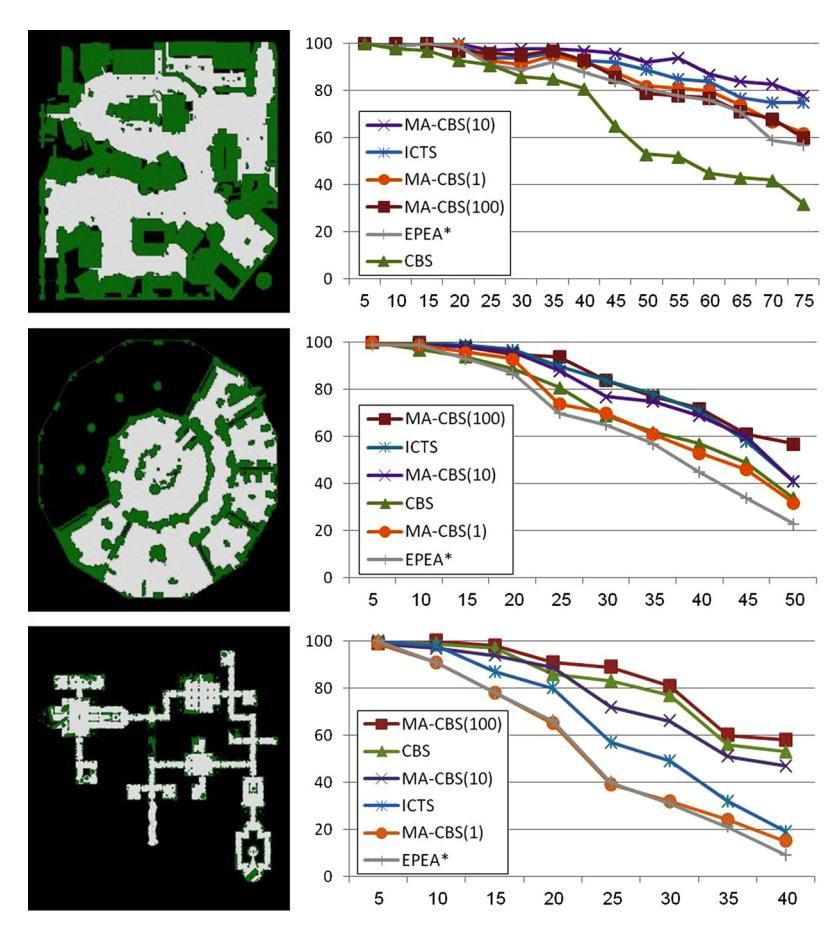

**Fig. 11.** Success rate of the MA-CBS on top of ID with EPEA\* as the low-level solver.

the success rate of the best ICTS variant [\[42\].](#page-25-0) Note that the legends are ordered according to the performance in the given map.

As can be seen, in all the experiments MA-CBS with intermediate values, 0 *< B <* ∞, is able to solve more instances than both extreme cases, i.e., EPEA\* (≡ MA-CBS(0)) and basic CBS (≡ MA-CBS(∞)). Additionally, MA-CBS with intermediate values also outperforms the ICTS solver. Consider the performance of MA-CBS variants with *B <* ∞ in comparison with the basic CBS (*B* =∞). Basic CBS performs very poorly for den520d (top), somewhat poorly for ost003d (middle) but rather well for brc202d (bottom). This is because in maps with no bottlenecks and large open spaces, such as den520d, CBS will be inefficient, since many conflicts will occur in many different locations. This phenomenon is explained in the pathological example of CBS given in [Fig. 6](#page-13-0) (Section [5.3.2\)](#page-13-0). Thus, in den520d the benefit of merging agents is high, as we avoid many conflicts. By contrast, for maps without large open spaces and many bottlenecks, such as brc202d, CBS encounters few conflicts, and thus merging agents result in only a small reduction in conflicts. Indeed, as the results show, for brc202d the basic CBS (MA-CBS(∞)) achieves almost the same performance as setting lower values of *B*.

In problems with a higher conflict rate it is, in general, more helpful to merge agents, and hence lower values of *B* perform better. B-CBS(10) obtained the highest success rates, for example, in den520d (top). By contrast, B-CBS(100) obtained the highest success rates in ost003d and brc202d.

# *9.1. Conclusions from experiments*

The experiments clearly show that there is no universal winner. The performance of each of the known algorithms depends greatly on problem features such as: density, topology of the map, the initial heuristic error and the number of conflicts encountered during the CBS solving process. It is not yet fully understood how these different features are related to the performance of each algorithm, a point we intend to research in the future. At the same time, we are trying to come up with new features to assess the performance of each algorithm prior to search. Nevertheless, we present the following general trends that we observed:

- MA-CBS with intermediate *B* values *(*0 *< B <* ∞*)* outperforms previous algorithm A\*, EPEA\* and CBS. It also outperforms ICTS in most cases.

- • **Density.** In dense maps with many agents, low values of *B* are more efficient.
- **Topology.** In maps with large open spaces and few bottlenecks, low values of *B* are more efficient.
- **Low-level solver.** If a weak MAPF solver (e.g., plain A\*) is used for the low-level search, high values of *B* are preferred.

#### **10. Summary, conclusions, and future work**

In this paper we deal with the *multi-agent pathfinding problem* (MAPF). We provided a short survey on previous work on the MAPF problem, introducing a categorization that helps classify all previous work to the following classes:

- 1. Optimal solvers [\[45,15,42,38,39\]](#page-25-0)
- 2. Sub-optimal search-based solvers [\[43,12\]](#page-25-0)
- 3. Sub-optimal procedure-based solvers [\[9,30,25,37,10\]](#page-25-0)
- 4. Sub-optimal hybrid solvers [\[52,24,53,35\]](#page-26-0)

Next, the CBS algorithm was introduced. CBS is a novel optimal MAPF solver. CBS is unique in that all low-level searches are performed as single-agent searches, yet it produces optimal solutions. The performance of CBS depends on the structure of the problem. We have demonstrated cases with bottlenecks [\(Fig. 1,](#page-3-0) Section [2.7\)](#page-2-0) where CBS performs well, and open spaces [\(Fig. 6,](#page-13-0) Section [5.3.2\)](#page-13-0) where CBS performs poorly. We analyzed and explained these cases and how they affect CBS's performance.

We then turned to present the MA-CBS framework, a generalization of the CBS algorithm. MA-CBS can be used on top of any MAPF solver, which will be used as a low-level solver. Furthermore, MA-CBS can be viewed as a generalization of the Independence Detection (ID) framework introduced by Standley [\[45\].](#page-25-0)

MA-CBS serves as a bridge between CBS and other optimal MAPF solvers, such as A\*, A\* + OD [\[45\]](#page-25-0) and EPEA\* [\[15\].](#page-25-0) It starts as a regular CBS solver, where the low-level search is performed by a single agent at a time. If MA-CBS identifies that a pair of agents conflicts often, it groups them together. The low-level solver treats this group as one composite agent, and finds solutions for that group using the given MAPF solver (e.g., A\*). As a result, MA-CBS is flexible and can enjoy the complementary benefits of both CBS and traditional optimal solvers by choosing when to group agents together. As a simple yet effective mechanism for deciding when to group agents, we introduced the conflict bound parameter *B*. The *B* parameter corresponds to the tendency of MA-CBS to create large groups of agents and solve them as one unit. When *B* = 0 MA-CBS converges to ID and when *B* =∞ MA-CBS is equivalent to CBS. Setting 0 *< B <* ∞ gives MA-CBS flexibility, so that in cases where only few conflicts occur, MA-CBS can act like CBS, while if conflicts are common, MA-CBS can converge to a single meta-agent problem that includes all or most of the conflicting agents. Experimental results in testbed map problems support our theoretical claims. The domains presented have different rates of open spaces and bottlenecks. MA-CBS with a high *B* value (100, 500) outperforms other algorithms in cases where corridors and bottlenecks are more dominant. In addition, experimental results showed that MA-CBS with non-extreme values of *B* (i.e., neither *B* = 0 nor *B* =∞) outperforms both CBS and other state-of-the-art MAPF algorithms. The results lead to the conclusion that in the general case, it is most beneficial to group agents to a certain extent. This results in a faster solving process when compared to never grouping agents, as in CBS, and to grouping all agents, as in all previous optimal solvers.

There are many open challenges for work on MAPF in general as well as on the CBS and MA-CBS algorithms:

- 1. Currently no heuristic guides the search in the high-level constraint tree. Coming up with an admissible heuristic for the high level could potentially result in a significant speed up.
- 2. Further work could be done to understand the effect of the *B* parameter on MA-CBS, which might give insight into how *B* could be varied dynamically.
- 3. Using a single *B* parameter for merging agents is relatively simple; it is an open question whether more sophisticated merging policies could significantly improve performance. For instance, merging might be based on areas of the map instead of on individual agents.
- 4. Following Ferner et al. [\[17\]](#page-25-0) it would be valuable to experiment and compare different low-level solvers including ICTS [\[42\],](#page-25-0) ODrM\* [\[17\],](#page-25-0) Boolean Satisfiability (SAT) [\[50\],](#page-25-0) Integer Linear Programming (ILP) [\[55\]](#page-26-0) and Answer Set Programming (ASP) [\[13\].](#page-25-0)
- 5. On a larger scale, the use of constraints overlaps with work on CSP and SAT, a connection that has not been wellexplored. There are theoretical connections between these fields [\[33\]](#page-25-0) that need more study.

# **Acknowledgement**

This research was supported by the Israel Science Foundation (ISF) grant 305/09 to Ariel Felner.

Many recently presented optimal MAPF solvers require an exponential amount of memory. For A\* variants, the memory is used to store OPEN and CLOSED. For ICTS, the memory is used for the ICT. Both are exponential (ICTS in *Δ* and A\*

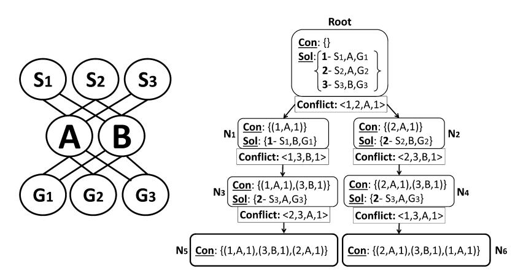

**Fig. 12.** Example MAPF instance where CBS has cycles.

variants in *k*). In domains with no transpositions, this memory problem can be easily solved by running Iterative-Deepening A\* (IDA\*) [\[26\].](#page-25-0) However, the efficiency of IDA\* degrades substantially as it encounters more duplicate nodes. In domains such as maps and grids – the most common domain for MAPF – duplicate nodes are very frequent. For example, in a 4-connected grid the number of unique states at radius *r* from a given location is *O(r*2*)* but the number of paths is *O(*4*r)*. Thus, all previous optimal MAPF solvers were memory-intensive. Next, we describe how MA-CBS can be modified to be an effective optimal solver that requires memory of size *O(k* · *C*∗ ·|*V* |*)*, that is the product of the number of agents, *k*, the cost of the optimal solution cost, *C*∗ and the size of the input graph, |*V* |.

Unlike A\* and its variants, CBS searches a conceptually different state space – the constraint space. Nevertheless, duplicate state may be encountered also in this space. Fig. 12 showed an MAPF instance (left) and a corresponding CT with a duplicate state (right). In this problem there are three agents. Each has a starting location, *Si*, and a goal location, *Gi* . The root of the CT has no constraints and the solution found for agents (*a*1, *a*2, *a*3) is {*S*1*, A, G*1*,S*2*, A, G*2*,S*3*, B, G*3}. The root contains a conflict *(a*1*,a*2*, A,* 1*)* and a new CT node *N*1 is created with the constraint *(a*1*, A,* 1*)*. *N*1 contains the conflict *(a*1*,a*3*, B,* 1*)*. Therefore another CT node *N*2 is created with the constraint *(a*2*, A,* 1*)* but it contains the conflict *(a*2*,a*3*, B,* 1*)*. Next, CT node *N*1 is expanded, creating CT node *N*3 with the constraints *(a*1*, A,* 1*)*, *(a*3*, B,* 1*)*. Then, CT node *N*2 is expanded generating CT node *N*4 with the constraints *(a*2*, A,* 1*)*, *(a*3*, B,* 1*)*. CT node *N*3 creates CT node *N*5 with the constraints *(a*1*, A,* 1*)*, *(a*3*, B,* 1*)*, *(a*2*, A,* 1*)*. CT node *N*4 creates CT node *N*6 with the constraint *(a*2*, A,* 1*)*, *(a*3*, B,* 1*)*, *(a*1*, A,* 1*)*. As can be seen CT nodes *N*5 and *N*6 contain the same set of constraints and are thus duplicates.

Even though the above example proves duplicates may exist in the constraint tree, in practice, on 4-connected grids, we encountered very few duplicates. We ran all the experiments reported in this paper using a duplicate detection mechanism. The results, with and without duplicate detection, were almost identical in all parameters due to the low amount of duplicates. Consequently, we experimented with Iterative-Deepening as the high-level search algorithm. Iterative-Deepening is a depth first search that requires memory linear in the depth of the solution. The resulting average run time was about 12% higher For Iterative-Deepening compared to best-first search as the high-level solver.

# *A.1. Domains with many duplicate states*

Despite the fact that 4-connected grids have very few duplicate states, other domains such as random graphs may contain many duplicates. For these domains DFID will be inefficient as the high-level solver. To solve this problem we developed a new CT branching technique which will completely prevent duplicates. In CBS, when a conflict *(a*1*,a*2*, v,t)* is found the node is split into two children while adding constraint *(a*1*, v,t)* in one child and *(a*2*, v,t)* in the other child. For the memory efficient variant we define a new constraint *(ai, v,t)* which means that agent *ai* **must** be at location *v* at time step *t*. Now, when a conflict *(a*1*,a*2*, v,t)* is found three children are generated. The first child adds the constraints {*(a*1*, v,t),(a*2*, v,t)*}, i.e., *a*1 cannot be located in *v* at time *t* but *a*2 *must* be at *v* at time *t*. The second adds the constraints {*(a*2*, v,t),(a*1*, v,t)*}, i.e., *a*2 cannot be located in *v* at time *t* but *a*1 *must* be at *v* at time *t*. The third child adds the constraints {*(a*1*, v,t),(a*2*, v,t)*}, i.e., neither *a*1 nor *a*2 are allowed to be in *v* at time *t*.

This mechanism prevents the possibility of duplicates occurrences while still maintaining optimality and completeness. For memory restricted environments and domains that contain many duplicates we suggest using this formalization along with DFID as the high-level CT search algorithm.

# **References**

[1] Maren [Bennewitz,](http://refhub.elsevier.com/S0004-3702(14)00138-6/bib44424C503A6A6F75726E616C732F7261732F42656E6E657769747A42543032s1) Wolfram Burgard, Sebastian Thrun, Finding and optimizing solvable priority schemes for decoupled path planning techniques for teams of [mobile](http://refhub.elsevier.com/S0004-3702(14)00138-6/bib44424C503A6A6F75726E616C732F7261732F42656E6E657769747A42543032s1) robots, Robot. Auton. Syst. 41 (2) (2002) 89–99. [2] Subhrajit [Bhattacharya,](http://refhub.elsevier.com/S0004-3702(14)00138-6/bib626861747461636861727961323031306469737472696275746564s1) Vijay Kumar, Maxim Likhachev, Distributed optimization with pairwise constraints and its application to multi-robot path planning, in: Robotics: Science and Systems, 2010, [pp. 87–94.](http://refhub.elsevier.com/S0004-3702(14)00138-6/bib626861747461636861727961323031306469737472696275746564s1)

- [3] Subhrajit [Bhattacharya,](http://refhub.elsevier.com/S0004-3702(14)00138-6/bib62686174746163686172796132303132746F706F6C6F676963616Cs1) Maxim Likhachev, Vijay Kumar, Topological constraints in search-based robot path planning, Auton. Robots 33 (3) (2012) [273–290.](http://refhub.elsevier.com/S0004-3702(14)00138-6/bib62686174746163686172796132303132746F706F6C6F676963616Cs1) [4] Zahy Bnaya, Ariel Felner, [Conflict-oriented](http://refhub.elsevier.com/S0004-3702(14)00138-6/bib626E6179613230313469637261s1) windowed hierarchical cooperative A\*, in: International Conference on Robotics and Automation (ICRA), [2014.](http://refhub.elsevier.com/S0004-3702(14)00138-6/bib626E6179613230313469637261s1) [5] Zahy Bnaya, Roni Stern, Ariel Felner, Roie Zivan, Steven Okamoto, Multi-agent path finding for self interested agents, in: Symposium on [Combinatorial](http://refhub.elsevier.com/S0004-3702(14)00138-6/bib626E617961323031336D756C7469s1) Search [\(SOCS\),](http://refhub.elsevier.com/S0004-3702(14)00138-6/bib626E617961323031336D756C7469s1) 2013. [6] Blai Bonet, Héctor Geffner, [Planning](http://refhub.elsevier.com/S0004-3702(14)00138-6/bib44424C503A6A6F75726E616C732F61692F426F6E6574473031s1) as heuristic search, Artif. Intell. 129 (1) (2001) 5–33. [7] Josh Broch, David A. Maltz, David B. Johnson, Yih-Chun Hu, Jorjeta Jetcheva, A [performance](http://refhub.elsevier.com/S0004-3702(14)00138-6/bib42726F63683A313939383A50434D3A3238383233352E323838323536s1) comparison of multi-hop wireless ad hoc network routing protocols, in: Proceedings of the [International](http://refhub.elsevier.com/S0004-3702(14)00138-6/bib42726F63683A313939383A50434D3A3238383233352E323838323536s1) Conference on Mobile Computing and Networking, ACM, 1998, pp. 85–97. [8] Benjamin Cohen, Sachin Chitta, Maxim Likhachev, [Single- and](http://refhub.elsevier.com/S0004-3702(14)00138-6/bib636F68656E3230313373696E676C65s1) dual-arm motion planning with heuristic search, Int. J. Robot. Res. (2013). [9] Paul Spirakis, Daniel Kornhauser, Gary Miller, [Coordinating](http://refhub.elsevier.com/S0004-3702(14)00138-6/bib6B6F726E68617573657231393834636F6F7264696E6174696E67s1) pebble motion on graphs, the diameter of permutation groups, and applications, in: Symposium on Foundations of Computer Science, IEEE, 1984, [pp. 241–250.](http://refhub.elsevier.com/S0004-3702(14)00138-6/bib6B6F726E68617573657231393834636F6F7264696E6174696E67s1) [10] Boris de Wilde, Adriaan W. ter Mors, Cees Witteveen, Push and rotate: cooperative [multi-agent](http://refhub.elsevier.com/S0004-3702(14)00138-6/bib44424C503A636F6E662F6174616C2F57696C64654D573133s1) path planning, in: AAMAS, 2013, pp. 87–94. [11] Rina Dechter, Judea Pearl, [Generalized](http://refhub.elsevier.com/S0004-3702(14)00138-6/bib415354523835s1) best-first search strategies and the optimality of A\*, J. ACM 32 (3) (1985) 505–536. [12] Kurt M. Dresner, Peter Stone, A multiagent approach to autonomous intersection [management,](http://refhub.elsevier.com/S0004-3702(14)00138-6/bib647265736E657232303038614D756C74696167656E74s1) J. Artif. Intell. Res. 31 (2008) 591–656. [13] Esra Erdem, Doga G. Kisa, Umut Oztok, Peter Schueller, A general formal framework for [pathfinding](http://refhub.elsevier.com/S0004-3702(14)00138-6/bib657264656D3230313367656E6572616Cs1) problems with multiple agents, in: AAAI, 2013. [14] Michael Erdmann, Tomas [Lozano-Perez,](http://refhub.elsevier.com/S0004-3702(14)00138-6/bib44424C503A6A6F75726E616C732F616C676F726974686D6963612F4572646D616E6E4C3837s1) On multiple moving objects, Algorithmica 2 (1–4) (1987) 477–521. [15] Ariel Felner, Meir Goldenberg, Guni Sharon, Roni Stern, Tal Beja, Nathan R. Sturtevant, Jonathan Schaeffer, Robert Holte, [Partial-expansion](http://refhub.elsevier.com/S0004-3702(14)00138-6/bib46656C6E657232303132s1) A\* with selective node [generation,](http://refhub.elsevier.com/S0004-3702(14)00138-6/bib46656C6E657232303132s1) in: AAAI, 2012. [16] Ariel Felner, Roni Stern, Sarit Kraus, Asaph Ben-Yair, Nathan S. Netanyahu, PHA\*: finding the shortest path with A\* in an unknown physical [environment,](http://refhub.elsevier.com/S0004-3702(14)00138-6/bib44424C503A6A6F75726E616C732F636F72722F6162732D313130372D30303431s1)
- J. Artif. Intell. Res. 21 (2004) [631–670.](http://refhub.elsevier.com/S0004-3702(14)00138-6/bib44424C503A6A6F75726E616C732F636F72722F6162732D313130372D30303431s1) [17] Cornelia Ferner, Glenn Wagner, Howie Choset, ODrM\* optimal multirobot path planning in low dimensional search spaces, in: [International](http://refhub.elsevier.com/S0004-3702(14)00138-6/bib44424C503A636F6E662F696372612F4665726E657257433133s1) Conference on Robotics and Automation (ICRA), 2013, [pp. 3854–3859.](http://refhub.elsevier.com/S0004-3702(14)00138-6/bib44424C503A636F6E662F696372612F4665726E657257433133s1) [18] Arnon Gilboa, Amnon Meisels, Ariel Felner, Distributed navigation in an unknown physical [environment,](http://refhub.elsevier.com/S0004-3702(14)00138-6/bib44424C503A636F6E662F6174616C2F47696C626F614D463036s1) in: AAMAS, ACM, 2006, pp. 553–560. [19] Meir Goldenberg, Ariel Felner, Roni Stern, Jonathan Schaeffer, A\* variants for optimal multi-agent pathfinding, in: Symposium on [Combinatorial](http://refhub.elsevier.com/S0004-3702(14)00138-6/bib44424C503A636F6E662F736F63732F476F6C64656E626572674653533132s1) Search [\(SOCS\),](http://refhub.elsevier.com/S0004-3702(14)00138-6/bib44424C503A636F6E662F736F63732F476F6C64656E626572674653533132s1) 2012. [20] Meir [Goldenberg,](http://refhub.elsevier.com/S0004-3702(14)00138-6/bib4550454A414952s1) Ariel Felner, Roni Stern, Guni Sharon, Nathan R. Sturtevant, Robert C. Holte, Jonathan Schaeffer, Enhanced partial expansion A\*, J. Artif. Intell. Res. 50 (2014) [141–187.](http://refhub.elsevier.com/S0004-3702(14)00138-6/bib4550454A414952s1) [21] Devin K. Grady, Kostas E. Bekris, Lydia E. Kavraki, [Asynchronous](http://refhub.elsevier.com/S0004-3702(14)00138-6/bib44424C503A636F6E662F776166722F4772616479424B3130s1) distributed motion planning with safety guarantees under second-order dynamics, in: Algorithmic [Foundations](http://refhub.elsevier.com/S0004-3702(14)00138-6/bib44424C503A636F6E662F776166722F4772616479424B3130s1) of Robotics IX, Springer, 2011, pp. 53–70. [22] Peter E. Hart, Nils J. Nilsson, Bertram Raphael, A formal basis for the heuristic [determination](http://refhub.elsevier.com/S0004-3702(14)00138-6/bib415354523638s1) of minimum cost paths, Syst. Sci. Cybern. 4 (2) (1968) [100–107.](http://refhub.elsevier.com/S0004-3702(14)00138-6/bib415354523638s1) [23] Malte Helmert, Understanding Planning Tasks: Domain Complexity and Heuristic [Decomposition,](http://refhub.elsevier.com/S0004-3702(14)00138-6/bib44424C503A626F6F6B732F73702F48656C6D65727432303038s1) vol. 4929, Springer, 2008. [24] Renee Jansen, Nathan R. Sturtevant, A new approach to cooperative pathfinding, in: AAMAS, 2008, [pp. 1401–1404.](http://refhub.elsevier.com/S0004-3702(14)00138-6/bib6A616E73656E32303038614E6577417070726F616368s1) [25] Mokhtar M. Khorshid, Robert C. Holte, Nathan R. Sturtevant, A [polynomial-time](http://refhub.elsevier.com/S0004-3702(14)00138-6/bib44424C503A636F6E662F736F63732F4B686F727368696448533131s1) algorithm for non-optimal multi-agent pathfinding, in: Symposium on [Combinatorial](http://refhub.elsevier.com/S0004-3702(14)00138-6/bib44424C503A636F6E662F736F63732F4B686F727368696448533131s1) Search (SOCS), 2011. [26] Richard E. Korf, Depth-first [iterative-deepening:](http://refhub.elsevier.com/S0004-3702(14)00138-6/bib424649443835s1) an optimal admissible tree search, Artif. Intell. 27 (1) (1985) 97–109. [27] Richard E. Korf, Finding optimal solutions to Rubik's cube using pattern databases, in: AAAI/IAAI, 1997, [pp. 700–705.](http://refhub.elsevier.com/S0004-3702(14)00138-6/bib44424C503A636F6E662F616161692F4B6F72663937s1) [28] Richard E. Korf, Larry A. Taylor, Finding optimal solutions to the twenty-four puzzle, in: AAAI, 1996, [pp. 1202–1207.](http://refhub.elsevier.com/S0004-3702(14)00138-6/bib4F50543234s1) [29] Steven M. LaValle, Seth A. Hutchinson, Optimal motion planning for multiple robots having [independent](http://refhub.elsevier.com/S0004-3702(14)00138-6/bib6C6176616C6C6539366F7074696D616C6D6F74696F6Es1) goals, Robot. Autom. 14 (6) (1998) 912–925. [30] Ryan Luna, Kostas E. Bekris, Efficient and complete centralized [multi-robot](http://refhub.elsevier.com/S0004-3702(14)00138-6/bib6C756E6132303131656666696369656E74s1) path planning, in: Intelligent Robots and Systems (IROS), 2011, [pp. 3268–3275.](http://refhub.elsevier.com/S0004-3702(14)00138-6/bib6C756E6132303131656666696369656E74s1) [31] Lucia Pallottino, Vincenzo Giovanni Scordio, Antonio Bicchi, Emilio Frazzoli, [Decentralized](http://refhub.elsevier.com/S0004-3702(14)00138-6/bib44424C503A6A6F75726E616C732F74726F622F50616C6C6F7474696E6F5342463037s1) cooperative policy for conflict resolution in multivehicle systems, Robotics 23 (6) (2007) [1170–1183.](http://refhub.elsevier.com/S0004-3702(14)00138-6/bib44424C503A6A6F75726E616C732F74726F622F50616C6C6F7474696E6F5342463037s1) [32] Mike Peasgood, John McPhee, Christopher M. Clark, Complete and scalable multi-robot planning in tunnel [environments,](http://refhub.elsevier.com/S0004-3702(14)00138-6/bib70656173676F6F6432303036636F6D706C657465s1) Comput. Sci. Softw. Eng. [\(2006\)](http://refhub.elsevier.com/S0004-3702(14)00138-6/bib70656173676F6F6432303036636F6D706C657465s1) 75. [33] Jussi Rintanen, Planning with SAT, admissible heuristics and A\*, in: IJCAI, 2011, [pp. 2015–2020.](http://refhub.elsevier.com/S0004-3702(14)00138-6/bib44424C503A636F6E662F696A6361692F52696E74616E656E3131s1) [34] Gabriele Röger, Malte Helmert, Non-optimal multi-agent pathfinding is solved (since 1984), in: Symposium on [Combinatorial](http://refhub.elsevier.com/S0004-3702(14)00138-6/bib726F676572323031326E6F6Es1) Search (SOCS), 2012. [35] Malcolm R.K. Ryan, Exploiting subgraph structure in [multi-robot](http://refhub.elsevier.com/S0004-3702(14)00138-6/bib7279616E323030386578706C6F6974696E67s1) path planning, J. Artif. Intell. Res. 31 (2008) 497–542. [36] Malcolm R.K. Ryan, [Constraint-based](http://refhub.elsevier.com/S0004-3702(14)00138-6/bib44424C503A636F6E662F696372612F5279616E3130s1) multi-robot path planning, in: International Conference on Robotics and Automation (ICRA), 2010, pp. 922–928. [37] Qandeel Sajid, Ryan Luna, Kostas E. Bekris, Multi-agent pathfinding with [simultaneous](http://refhub.elsevier.com/S0004-3702(14)00138-6/bib73616A6964323031326D756C7469s1) execution of single-agent primitives, in: Symposium on Combi[natorial](http://refhub.elsevier.com/S0004-3702(14)00138-6/bib73616A6964323031326D756C7469s1) Search (SOCS), 2012. [38] Guni Sharon, Roni Stern, Ariel Felner, Nathan R. Sturtevant, [Conflict-based](http://refhub.elsevier.com/S0004-3702(14)00138-6/bib636F6E662F616161692F4342533132s1) search for optimal multi-agent path finding, in: AAAI, 2012. [39] Guni Sharon, Roni Stern, Ariel Felner, Nathan R. Sturtevant, Meta-agent [conflict-based](http://refhub.elsevier.com/S0004-3702(14)00138-6/bib636F6E662F536F43532F4342533132s1) search for optimal multi-agent path finding, in: Symposium on [Combinatorial](http://refhub.elsevier.com/S0004-3702(14)00138-6/bib636F6E662F536F43532F4342533132s1) Search (SOCS), 2012. [40] Guni Sharon, Roni Stern, Meir Goldenberg, Ariel Felner, The increasing cost tree search for optimal multi-agent pathfinding, in: IJCAI, 2011, [pp. 662–667.](http://refhub.elsevier.com/S0004-3702(14)00138-6/bib49435453s1) [41] Guni Sharon, Roni Stern, Meir Goldenberg, Ariel Felner, Pruning techniques for the increasing cost tree search for optimal multi-agent [pathfinding,](http://refhub.elsevier.com/S0004-3702(14)00138-6/bib4943545370s1) in: Symposium on [Combinatorial](http://refhub.elsevier.com/S0004-3702(14)00138-6/bib4943545370s1) Search (SOCS), 2011. [42] Guni Sharon, Roni Stern, Meir Goldenberg, Ariel Felner, The increasing cost tree search for optimal multi-agent [pathfinding,](http://refhub.elsevier.com/S0004-3702(14)00138-6/bib44424C503A6A6F75726E616C732F61692F536861726F6E5347463133s1) Artif. Intell. 195 (2013) [470–495.](http://refhub.elsevier.com/S0004-3702(14)00138-6/bib44424C503A6A6F75726E616C732F61692F536861726F6E5347463133s1) [43] David Silver, Cooperative pathfinding, in: Artificial Intelligence and Interactive Digital [Entertainment](http://refhub.elsevier.com/S0004-3702(14)00138-6/bib73696C76657232303035636F6F7065726174697665s1) (AIIDE), 2005, pp. 117–122. [44] Arvind Srinivasan, Timothy Ham, Sharad Malik, Robert K. Brayton, Algorithms for discrete function [manipulation,](http://refhub.elsevier.com/S0004-3702(14)00138-6/bib44424C503A636F6E662F69636361642F5372696E69766173616E4B4D423930s1) in: International Conference on Computer Aided Design (ICCAD), 1990, [pp. 92–95.](http://refhub.elsevier.com/S0004-3702(14)00138-6/bib44424C503A636F6E662F69636361642F5372696E69766173616E4B4D423930s1) [45] Trevor S. Standley, Finding optimal solutions to cooperative [pathfinding](http://refhub.elsevier.com/S0004-3702(14)00138-6/bib44424C503A636F6E662F616161692F5374616E646C65793130s1) problems, in: AAAI, 2010. [46] Trevor S. Standley, Richard E. Korf, Complete algorithms for cooperative pathfinding problems, in: IJCAI, 2011, [pp. 668–673.](http://refhub.elsevier.com/S0004-3702(14)00138-6/bib44424C503A636F6E662F696A6361692F5374616E646C65794B3131s1) [47] Nathan R. Sturtevant, [Benchmarks](http://refhub.elsevier.com/S0004-3702(14)00138-6/bib73747572746576616E743230313262656E63686D61726B73s1) for grid-based pathfinding, Comput. Intell. AI Games 4 (2) (2012) 144–148. [48] Nathan R. Sturtevant, Michael Buro, Improving [collaborative](http://refhub.elsevier.com/S0004-3702(14)00138-6/bib73747572746576616E746275726Fs1) pathfinding using map abstraction, in: Artificial Intelligence and Interactive Digital Entertainment (AIIDE), 2006, [pp. 80–85.](http://refhub.elsevier.com/S0004-3702(14)00138-6/bib73747572746576616E746275726Fs1) [49] Nathan R. Sturtevant, Robert Geisberger, A comparison of high-level approaches for speeding up [pathfinding,](http://refhub.elsevier.com/S0004-3702(14)00138-6/bib44424C503A636F6E662F61696964652F53747572746576616E74473130s1) in: Artificial Intelligence and Interactive Digital [Entertainment](http://refhub.elsevier.com/S0004-3702(14)00138-6/bib44424C503A636F6E662F61696964652F53747572746576616E74473130s1) (AIIDE), 2010. [50] Pavel Surynek, Towards optimal cooperative path planning in hard setups through satisfiability solving, in: The Pacific Rim [International](http://refhub.elsevier.com/S0004-3702(14)00138-6/bib737572796E656B32303132746F7761726473s1) Conference on Artificial Intelligence (PRICAI), 2012, [pp. 564–576.](http://refhub.elsevier.com/S0004-3702(14)00138-6/bib737572796E656B32303132746F7761726473s1) [51] Glenn Wagner, Howie Choset, M\*: a complete multirobot path planning algorithm with [performance](http://refhub.elsevier.com/S0004-3702(14)00138-6/bib44424C503A636F6E662F69726F732F5761676E6572433131s1) bounds, in: Intelligent Robots and Systems (IROS), 2011, [pp. 3260–3267.](http://refhub.elsevier.com/S0004-3702(14)00138-6/bib44424C503A636F6E662F69726F732F5761676E6572433131s1)

[52] Ko-Hsin Cindy Wang, Adi Botea, Fast and [memory-efficient](http://refhub.elsevier.com/S0004-3702(14)00138-6/bib57616E67423038s1) multi-agent pathfinding, in: ICAPS, 2008, pp. 380–387. [53] Ko-Hsin Cindy Wang, Adi Botea, Mapp: a scalable multi-agent path planning algorithm with tractability and [completeness](http://refhub.elsevier.com/S0004-3702(14)00138-6/bib44424C503A6A6F75726E616C732F6A6169722F57616E67423131s1) guarantees, J. Artif. Intell. Res. 42 (1) (2011) [55–90.](http://refhub.elsevier.com/S0004-3702(14)00138-6/bib44424C503A6A6F75726E616C732F6A6169722F57616E67423131s1) [54] Jingjin Yu, Steven M. LaValle, Multi-agent path planning and network flow, in: Algorithmic [Foundations](http://refhub.elsevier.com/S0004-3702(14)00138-6/bib44424C503A636F6E662F776166722F59754C3132s1) of Robotics X – Proceedings of the Tenth Workshop on the Algorithmic Foundations of Robotics, WAFR 2012, June 13–15, 2012, MIT, Cambridge, [Massachusetts,](http://refhub.elsevier.com/S0004-3702(14)00138-6/bib44424C503A636F6E662F776166722F59754C3132s1) USA, 2012, pp. 157–173. [55] Jingjin Yu, Steven M. LaValle, Planning optimal paths for multiple robots on graphs, in: [International](http://refhub.elsevier.com/S0004-3702(14)00138-6/bib797532303133706C616E6E696E67s1) Conference on Robotics and Automation (ICRA), 2013, [pp. 3612–3617.](http://refhub.elsevier.com/S0004-3702(14)00138-6/bib797532303133706C616E6E696E67s1) [56] Jingjin Yu, Steven M. LaValle, Structure and [intractability](http://refhub.elsevier.com/S0004-3702(14)00138-6/bib44424C503A636F6E662F616161692F59754C3133s1) of optimal multi-robot path planning on graphs, in: AAAI, 2013. [57] Jingjin Yu, Daniela Rus, Pebble motion on graphs with rotations: efficient feasibility tests and planning [algorithms,](http://refhub.elsevier.com/S0004-3702(14)00138-6/bib5975527573313457414652s1) in: Eleventh Workshop on the Algorithmic [Foundations of](http://refhub.elsevier.com/S0004-3702(14)00138-6/bib5975527573313457414652s1) Robotics, 2014.