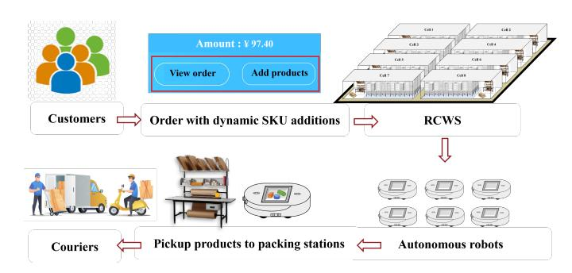
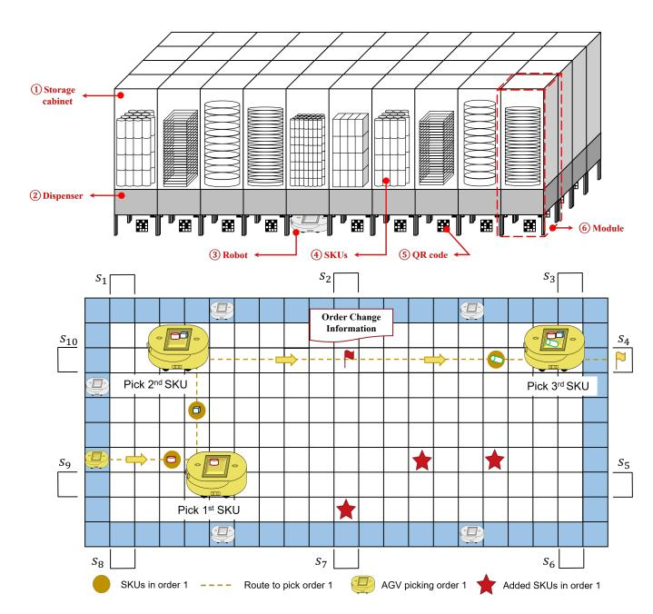
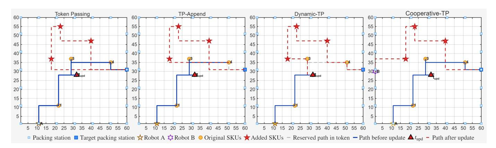
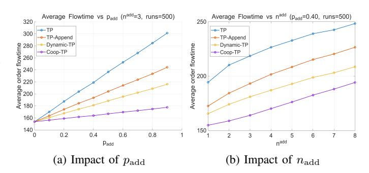

# Dynamic Multi-Agent Pickup and Delivery in Robotic Cellular Warehousing Systems

Cheng Ren, *Member, IEEE*, Ming Li, *Member, IEEE*, Xinping Guan, *Fellow, IEEE*, and George Q. Huang, *Fellow, IEEE*

*Abstract*—Robotic Cellular Warehousing Systems (RCWS) give rise to multi-agent pickup and delivery (MAPD) processes in which robots sequentially collect multiple stock-keeping units (SKUs) for each order. Unlike classical MAPD formulations that assume static tasks, real warehouse operations often involve dynamic order evolution, where new SKUs may be appended to an order while it is being executed. Motivated by this practical requirement, this letter formulates the Dynamic Multi-Agent Pickup and Delivery problem considering internal order evolution for the first time. Building on the token passing (TP) mechanism, we propose two event-triggered online replanning algorithms. The first, Dynamic-TP, enables an event-triggered dynamic response by allowing robots to replan from their current execution states through priority-aware token acquisition after order updates. The second, Cooperative-TP, further enables idle robots to assist newly added SKUs while preserving the original order ownership. Simulation results demonstrate that the proposed methods significantly reduce order flowtime compared with static and non-cooperative baselines, thereby improving system-level efficiency in RCWS.

*Index Terms*—Multi-agent pickup and delivery, Robotic cellular warehousing system, Dynamic order, Online replanning

## I. INTRODUCTION

Recently, robotic cellular warehousing systems (RCWS) have emerged as a promising architecture, consisting of multiple modular units known as RubikCells [1]. As shown in Fig. 1, when a robot receives an order containing multiple stockkeeping units (SKUs), it navigates to the corresponding storage modules, collects all required SKUs, and delivers them to the assigned packing station [2]. This type of order-fulfillment process in the RCWS can be naturally formulated as a multiagent pickup and delivery (MAPD) problem, which is an extension of the multi-agent path finding (MAPF) problem [3].

In classical MAPF settings, each agent is typically assigned a single start location and a single goal location, and the objective is to compute collision-free paths for all agents [4]. MAPD further integrates task assignment with path planning, requiring agents to pick up an item from the start location and deliver them to the designated destination [5]. In contrast to standard MAPD, each order in RCWS consists of multiple SKUs distributed across different storage locations within the same RubikCell. As a result, a single robot must sequentially visit multiple pickup locations before completing the delivery, which naturally leads to a multi-goal MAPD problem [6]. Moreover, although existing MAPD methods can accommodate multiple pickup locations within an order, they generally assume that the set of pickup locations remains fixed throughout execution [7]. However, unlike the static

Fig. 1: Overview of order fulfillment process in one RCWS.

assumptions commonly made in previous work, real-world ondemand orders are inherently dynamic and uncertain.

For example, Fig. 1 illustrates a typical user interface that allows customers to modify their orders before finalization [8]. These dynamic updates alter both the number and spatial distribution of SKUs to be retrieved, thereby invalidating the original pickup sequence of robots. Consequently, robots must promptly incorporate newly added SKUs into ongoing execution through route replanning and coordination while preserving feasibility and avoiding collisions. Otherwise, delayed incorporation of newly added SKUs may increase the completion time of the affected orders, thereby degrading overall order fulfillment efficiency. This raises a fundamental question: how can the warehouse control system respond to uncertain SKU additions while maintaining efficient multirobot coordination?

Accordingly, this letter focuses on a new form of MAPD in which ongoing orders may evolve during execution through the addition of new SKUs, rather than through the arrival of new tasks. Main contributions are summarized as follows.

- 1) This letter formalizes the *Dynamic Multi-Agent Pickup and Delivery (Dynamic-MAPD)* problem, in which already assigned orders may evolve during execution through the addition of new SKUs. Unlike classical MAPD with fixed task contents, Dynamic-MAPD captures the execution-time evolution of ongoing orders.
- 2) This letter proposes a Dynamic Token Passing (Dynamic-TP) algorithm with event-triggered SKU-level path replanning. Newly added SKUs are integrated with the remaining uncollected SKUs, enabling the bound robot to replan a path from its current execution state.
- 3) This letter further develops a Cooperative Token Passing (Cooperative-TP) algorithm that selectively assigns newly added SKUs to idle robots when parallel execu-

tion is predicted to reduce the updated order's completion time, while preserving its primary robot ownership.

The remainder of this letter is organized as follows. Section II reviews related work. Section III formulates the Dynamic-MAPD problem. Section IV presents the proposed two algorithms. Section V provides simulation results and performance analysis. Finally, Section VI concludes the letter.

#### II. RELATED WORK

Most follow-up research on MAPD has been motivated by robotic mobile fulfillment systems (RMFS), where robots operate under a goods-to-person (G2P) paradigm [9]. Chen *et al.* jointly optimize order assignment and path planning via a cost-based integrated approach [10]. Li *et al.* extend MAPD to the double-deck RMFS architecture, coupling shelf relocation and robot navigation [11]. Zhao *et al.* propose a novel human–robot collaborative order-picking optimization problem in RMFS with multiple picking stations and present a learning-based local search algorithm [12].

Unlike the G2P picking mode in RMFS, researchers have generalized MAPD to robot-to-goods (R2G) like operations, which are naturally aligned with RCWS scenarios. Ma *et al.* first formalize the MAPD problem and proposed the Token Passing (TP) and Token Passing with Task Swaps algorithms, which establish a benchmark for MAPD in R2G settings [5].

Several MAPD variants further incorporate realistic constraints such as energy awareness, recharging, and distributed coordination. Bavaro *et al.* integrate recharging decisions into the token-passing framework [13], and Camisa *et al.* introduce a distributed MAPD formulation that achieves scalability via primal decomposition [14]. More recent formulations introduce practical considerations such as task deadlines [15], external agents sharing the same environment [16], and execution delays [17]. Makino *et al.* introduce the MAPD with task deadlines, where each order is associated with a deadline. They propose deadline-aware token passing and its taskswapping variant Dynamic-TPTS to reduce tardiness in online environments [15]. Bonalumi *et al.* study MAPD with external agents, where a team of robots must accomplish delivery tasks while sharing the environment with independent external agents whose behaviors are unknown, and proposed modelingbased approaches to anticipate conflicts and plan collision-free paths [16]. Lodigiani *et al.* address MAPD with delays, where robots may not perfectly follow their planned paths due to runtime disturbances [17].

Furthermore, multi-goal MAPD [18], [19] extends each task to a sequence of destinations, representing multi-SKU orders that must be picked before delivery. Xu *et al.* design a large neighborhood search strategy to scale multi-goal MAPD to large warehouses [18], and Zhong *et al.* analyze its theoretical complexity and provided optimality bounds [19]. Kudo *et al.* extend the conventional single-task MAPD formulation to a multi-task setting, where each agent can be assigned multiple tasks simultaneously under payload constraints [20].

Dynamic pickup and delivery have been widely studied in the vehicle routing problem (VRP) literature [21]. While both VRP and MAPD are defined on graphs, they differ in key

TABLE I: Comparison of MAPD Variants and This Work

| Reference | Order dynamics |               | Research            |               | focus        |               |
|-----------|----------------|---------------|---------------------|---------------|--------------|---------------|
| [10]      | Static         | Capacitated   | task allocation     | with          | cost-based   | optimization  |
| [11]      | Static         | Double-deck   | MAPD                | with          | shelf        | relocation    |
| [13]      | Static         | Battery-aware | MAPD                | with          | recharge     | scheduling    |
| [14]      | Static         | Distributed   | MAPD                | with scalable |              | decomposition |
| [15]      | Static         |               | Task deadline-aware |               | MAPD         |               |
| [16]      | Static         |               | MAPD with           | external      | agents       |               |
| [17]      | Static         |               | MAPD with           | execution     | delays       |               |
| [18]      | Static         | Multi-goal    | MAPD with           | large         | neighborhood | search        |
| [19]      | Static         | Theoretical   | analysis            | of            | multi-goal   | MAPD          |
| [20]      | Static         | Multi-order   | planning            | with          | TSP-based    | routing       |
| Ours      | Dynamic        | Dynamic       | orders and          | event-driven  |              | token passing |

aspects. VRP typically assumes independent vehicles on road networks without explicit collision avoidance, whereas MAPD involves tightly coupled multi-robot coordination in a shared workspace with spatial–temporal conflicts. Moreover, VRP is defined on sparse road networks, while warehouse environments are dense grid-like graphs with frequent interactions. Therefore, VRP-based methods cannot be directly applied without incorporating collision-aware multi-agent planning.

To the best of our knowledge, no prior MAPD study has systematically addressed execution-time SKU additions within ongoing orders. Conventional TP sequentially assigns fixed tasks to agents through a shared token that stores task assignments and reserved paths [5], but does not consider changes to an order after its execution has begun. This work fills this gap by formulating the Dynamic-MAPD problem and proposing an event-triggered TP framework that enables timely responses to evolving orders.

#### III. DYNAMIC MAPD PROBLEM FORMULATION

Fig. 2 displays a schematic diagram of the RCWS and RubikCell. Each RubikCell stores a set of SKUs in a grid layout. Multiple robots operate beneath modular storage dispensers to fulfill multi-SKU orders. Each RubikCell is represented by an undirected grid graph  $G = (V, E)$ , where each vertex  $v = (x, y) \in V$  corresponds to a storage cabinets, and each edge  $e \in E$  connects two adjacent vertices satisfying  $|x - x'| + |y - y'| = 1$ , enforcing four-directional (north, east, south, west) movement while excluding diagonal connections. The storage area of a RubikCell is modeled as a rectangular grid of size  $N = L_x \times L_y$ , where  $L_x$  and  $L_y$  denote the numbers of storage cabinets along the horizontal and vertical directions, respectively. Let  $\mathcal{M} = \{m_1, \dots, m_J\}$  denote the set of storage modules, where module  $m_j$  is located at vertex  $v_{m_j} \in V$  and stores one product type. A set of  $I$  packing stations  $\mathcal{S} = \{S_1, \dots, S_I\}$  are placed along the boundaries for order delivery.

The robot set is  $\mathcal{A} = \{a_1, \dots, a_n\}$ , where robot  $a_i$  has an initial position  $p_i(0) \in V$ . Since each robot completes its assigned order by delivering the picked SKUs to a packing station, we assume that each robot is initially located at a packing station, i.e.  $p_i(0) \in \mathcal{S}, \forall a_i \in \mathcal{A}$ . At discrete time  $t$ , the position of robot  $a_i$  is  $p_i(t)$ , and its executed path is denoted by  $\mathcal{P}_i(t) = \{p_i(0), p_i(1), \dots, p_i(t)\}$ .

Let  $\mathcal{O} = \{O_1, \dots, O_K\}$  denote the set of all orders released to the system. Each order  $O_k \in \mathcal{O}$  is represented as the set of

Fig. 2: RubikCell and an order with dynamic additions.

storage locontents corresponding to its required SKUs:

$$O_k = \{plausible{p_{k,1}, p_{k,2}, \dots, p_{k,n_k}}, \quad (1)$$

where  $n_n_k is the number of products initially included in order _O_k. To capture the dynamic nature of the warehouse, each order can receive additional SKUs during execution. Let _n_k(t) ~ Bernoulli(p_{add,k}) be the indicator of whether order _O_k receives new products at time t, where p_{add,k} ∈ (0,1) denotes the probability that order _O_k is augmented with additional SKUs at a given time step. Conditional on _n_k(t) = 1, the number of added products is n_k^add such as red five-pointed stars in Fig. 2. Their storage locations {u_k,1, ..., u_k,n_k^add} are sampled i.i.d. from a spatial distribution π_k(·) defined on V. The newly added SKUs at update time t are denoted by$ 

$$\Delta O_k(t) = \{u_{k,1}, \dots, u_{k,n_k^{\text{add}}}\}, \quad (2)$$

and and the updated order becomes

$$O_k^{\text{new}}}(t) = O_k^{\text{rem}} \cup \Delta O_k(t), \quad (3)$$

where  $O_k^{\text{rem}}$  is the remaining uncollected SKUs before the update. In practical warehouse operations, different orders may have distinct delivery deadlines according to their service types. For instance, some customer orders correspond to instant delivery, requiring immediate fulfillment, while others represent scheduled deliveries that can be dispatched later. Accordingly, each order  $O_k$  is associated with a delivery deadline  $d_k$ , representing its required completion time.

**Assumption 1 (Perfect synchronization).** The system controller is instantly notified of dynamic order updates and synchronizes the corresponding order information to the shared token without communication delay or data loss.

**Assumption 2 (Single Update per Order).** Each order is allowed to receive at most one dynamic SKU addition during its execution. Once the order update is processed, no further modifications are permitted until the order is completed.

Although Assumptption 2 considers at most one update per order for clarity, the proposed framework can be naturally

extended to multiple upupates. Each new SKU addition can be treated as an independent dynamic event, and the event-triggered coordination mechanism can be applied iteratively.

**Definition 1.** (*(Dynamic-MAPD Problem).* The Dynamic Multi-Agent Pickup and Delivery problem is defined on a graph-based multi-agent system where each order  $O_k$  consists of a set of goal locations to be visited before delivery. During execution, the goal set of  $O_k$  may dynamically change, e.g., through the addition of new goals. The objective is to minimize the total order flowtime while ensuring motion feasibility, collision avoidance, and delivery deadlines.

In the RCWS, these goal locations correspond to SKU storage locations within a RubikCell, and  $\Delta O_k(t)$  represents newly added SKUs during order execution. Let  $\pi$  denote a coordination policy that determines task assignment and path replanning decisions. Let  $T_k$  denote the completion time of order  $O_k$ , defined as the time when all SKUs associated with  $O_k$ , including any dynamically added ones, have been picked and delivered to the designated packing station. The Dynamic-MAPD problem aims to minimize the total order flowtime, which is equivalently the sum of order completion times:

$$\min_{\pi} \sum_{k=1}^K T_k, \quad (4)$$

subject to the following constraints.

(C1) 
$$p_i(t+1) \in \mathcal{N}(p_i(t)), \quad \forall i, t$$
,

(C2) 
$$p_i(t) \neq p_j(t), \quad \forall i \neq j, \forall t,$$

(C3) 
$$(p_i(t), p_i(t+1)) \neq (p_j(t+1), p_j(t)), \quad \forall i \neq j, \forall t,$$

(C4) 
$$T_T T_k \leq d_k, \quad \forall k.$$

Conon-constraint (C1)-(C3) ensure discrete motion feasibility and collision avoidance, including both vertex conflicts and edge swap conflicts, while (C4) enforces order deadline constraints.

## IV. EVENT-TRIGGERED TOKEN PASSING

In this section, n, we extend the classical TP scheme to address the proposed Dynamic-MAPD problem by introducing an event-triggered token-access mechanism. At  $t = 0$ , the initially released orders are assigned to available robots using the conventional TP mechanism [5]. Each robot acquires the token, selects an unassigned order, and computes a collision-free pickup-and-delivery route. The resulting order-robot assignments and reserved routes are stored in the shared token, providing the initial execution plan.

During execution, the addition of new SKUs to ongoing orders triggers the proposed dynamic response mechanism. If multiple orders are updated simultaneously, they access the token in ascending order of their remaining time to deadline, defined as  $\Delta d_k(t) = d_k - t$ . After obtaining the token, the bound robot merges the newly added SKUs with the remaining uncollected SKUs of its original order and replans a collision-free route from its current state to collect these SKUs and reach a packing station, while respecting the routes reserved in the token. The updated path is then stored in the token and executed directly without invoking an additional round of

conventional TP. This event-triggered procedure enables newly added SKUs to be incorporated timely into ongoing order execution rather than being deferred until the original order is completed. Specifically, two execution modes are developed to handle dynamic order updates as follows.

**Definition 2** (Binding Mode). *Each order  $O_k$  is permanently bound to one robot  $a_i$  once execution begins. Any newly added items  $\Delta O_k(t)$  must be collected by the same robot.*

**Definition 3** (Cooperative Mode). *When new pickups  $\Delta O_k(t)$  appear, idle robots may temporarily assist the execution process by serving individual pickup locations if they can reach them earlier than the primary robot. All collected SKUs are ultimately delivered to the same packing station.*

Both Dynamic-TP and Cooperative-TP preserve the deadlock-free execution and completeness properties of classical TP under the well-formed MAPD assumptions [5]. Specifically, the number of orders and update events is finite, the shared token is accessed mutually exclusively, and every committed route is generated by the same reservation-based  $\text{Path1}(\cdot) / \text{Path2}(\cdot)$  procedures used in classical TP. The proposed deadline-aware rule only determines the processing order of simultaneously triggered updates. It does not exclude any affected robot from token access, because all updates in the finite priority queue are processed sequentially. Hence, the proposed event-triggered mechanism does not introduce conflicting path reservations or starvation among updated orders. If  $\text{Path1}(\cdot)$  temporarily fails, the robot moves to a non-task endpoint through  $\text{Path2}(\cdot)$ , and the unfinished order remains eligible for subsequent replanning. Therefore, every finite set of initially released and dynamically updated orders is eventually completed on a well-formed instance.

#### *A. Dynamic Token Passing*

Dynamic-TP handles dynamically evolving orders under a binding policy through an event-triggered token-access mechanism. The system operates over an unbounded execution horizon starting from  $t = 0$  until all assigned orders are completed. Initially, the shared token  $\mathcal{T}$  is constructed to store the initial task assignments and reserved paths of all robots (Line 1). Robots then execute their reserved paths synchronously, advancing step by step according to the paths.

When an order update occurs, the robot selected to acquire the token immediately performs local replanning from its current execution state. The remaining products of its original order are merged with the newly added products, and a new collision-free path to a packing station is computed with respect to the paths stored in the token. The updated path is then written back to the token, ensuring global consistency.

At each time step, the warehouse control system monitors the order update indicators  $\gamma_k(t)$ . If no update occurs, robots continue executing their current paths without replanning. At each time step, Dynamic-TP first monitors the update indicators  $\{\gamma_k(t)\}$  of all orders (Line 3). Based on the detected update events, the updated-order index set  $\mathcal{K}_{\text{upd}}(t)$  is constructed, and the corresponding set of affected robots  $\mathcal{A}_{\text{upd}}(t)$  is identified according to the order-robot binding pol-

# Algorithm 1: Dynamic Token Passing

**Input:**  $G G = (V, E)$ ; robots  $\mathcal{A}$ ; stations  $\mathcal{S}$ ; token  $\mathcal{T}$ , deadlines  $\{d_k\}$ 

**Ounified order:** Updated reserved paths  $\{P_i^{\text{res}}\}$  stored in  $\mathcal{T}$   
 1 Initialize token  $\mathcal{T}$  with initial assignments and routes;  
 2 Initialize the unfinished-order index set  $\mathcal{U} \leftarrow \emptyset$ ;  
 3 **while** *there exists unfinished orders* **do**

4 Monitor indicators  $\{\gamma_k(t)\}$  for all orders  $\{O_k\}$ ;

5 Construct the updated-order index set

$$\mathcal{K}_{}}_{\text{upd}}(t) \triangleq \{k \mid \gamma_k(t) = 1\};$$
**6 if**  $\mathcal{K}_{\text{upd}}(t) \cup \mathcal{U} \neq \emptyset$  **then**

7 | **foreach**  $k \in \mathcal{K}_{\text{upd}}(t)$  **do**

8 Merge order ing items:  
 $O_k^{\text{new}}(t) \leftarrow O_k^{\text{rem}} \cup \Delta O_k(t)$ 

|  |  |  |
|---------------|---------------|---------------|
| 9             |               | end           |

foreach  $k \in \mathcal{K}_{\text{upd}}(t) \cup \mathcal{U}$  do

11 Compute the remaining time to deadline.  
 $\Delta d_k(t) \leftarrow d_k - t$ ;

|  |  |  |
|---------------|---------------|---------------|
| 12            |               | end           |

13 Build a priority queue  $\mathcal{Q}$  from  $\mathcal{K}_{\text{upd}}(t) \cup U$ ,  
sorted by ascending  $\Delta d_k(t)$ ;

14                      **while  $\mathcal{Q} \neq \emptyset$  do**

15 Select the most urgent order index

 $k^* \leftarrow \arg \min_{k \in \mathcal{Q}} \Delta d_k(t)$ ; Let

 $a_{i^*} \leftarrow a(k^*)$  be its bound robot;

16 Robot  $a_{i*}$  acquires token  $\mathcal{T}$ ;

17 Attempt to replan from current position to complete  $O_{k^{\text{new}}}^{\text{new}}(t)$  w.r.t. reserved paths in

18if  $Path1(\cdot)$  succeeds then  
 19 Commit the resulting complete reserved  
 path  $\mathcal{P}_{i\star}^{\text{res}}$  into  $\mathcal{T}$ ;

Remove  $k^*$  from  $\mathcal{U}$  if present;

|  |  |  |  |  |
|---------------|---------------|---------------|---------------|---------------|
| 21            |               |               | end           |               |

|  |  |  |  |
|---------------|---------------|---------------|---------------|
| 22            |               |               | else          |

23                                   Apply Path2(..) to generate a feasible partial path to a safe endpoint;

24 Commit the partial reserved path  $\mathcal{P}_{i, \text{res}}^{\text{res}}$  into  $\mathcal{T}$ ;

25                      Add  $k^*$  to  $\mathcal{U}$  for future replanning ing if not already present;

|  |  |  |  | <b>26</b> |            |
|--|--|--|--|-----------|------------|
|  |  |  |  |           | <b>end</b> |

27 Release token  $\mathcal{T}$ ;

28 Remove  $k^*$  from the priority queue  $\mathcal{Q}$ ;

|  |  |  |
|---------------|---------------|---------------|
| 29            | <b>end</b>    |               |

| 30 | <b>end</b>                                                      |
|----|-----------------------------------------------------------------|
| 31 | Robots advance one time step along their latest reserved paths; |

32 **end**

icy (Lines 4-5). For each newly updated order  $k \in \mathcal{K}_{\text{upd}}(t)$ , the newly added products  $\Delta O_k(t)$  are merged with the remaining uncollected SKUs  $O_k^{\text{em}}$  to form the updated order  $O_k^{\text{new}}(t)$ . Meanwhile,  $\Delta d_k(t)$  is computed to quantify the urgency of replanning (Lines 6-9). To coordinate both newly updated orders and orders whose replanning was not completed at previous time steps, the priority queue  $\mathcal{Q}$  is initialized us-

the pickup location. Instead of relying on a single pickup-time comparison, Cooperative-TP evaluates the overall completion

time under cooperation versus non-cooperation, which is more

The complete procedure of Cooperative-TP is summarized in Algorithm 2. When an order update  $\Delta O_k(t_{\text{upd}})$  occurs, Cooperative-TP first identifies the bound robot  $a_i$  executing order  $O_k$ , as well as the set of idle robots  $\mathcal{A}_{\text{idle}}$  that are currently waiting at packing stations (Line 1-2). The delivery station of the order remains fixed to the original station  $S_k$ .

For the bound robot  $a_i$ , Cooperative-TP constructs a baseline estimate assuming no cooperation. A tentative collision-free path  $P_i^{\text{base}}$  is computed using the underlying grid-based planner (e.g., A\*) to complete both the remaining items  $O_k^{\text{rem}}$  and the newly added items  $\Delta O_k(t_{\text{upd}})$ . The corresponding estimated remaining time is  $\text{ETA}_i^{\text{base}} = \frac{|P_i^{\text{base}}|}{v}$ , where  $v$  is the robot speed. In parallel, a tentative path  $P_i^{\text{rem}}$  is computed assuming that  $a_i$  only serves the remaining items  $O_k^{\text{rem}}$ , with the corresponding estimated remaining time  $\text{ETA}_i^{\text{rem}} = \frac{|P_i^{\text{rem}}|}{v}$  (Lines 5–6). For each idle robot  $a_j \in A_{\text{idle}}$ , Cooperative-TP constructs an additional pickup route  $P_j^{\text{add}}$  that starts from the current packing station of  $a_j$ , visits all pickup locations in  $\Delta O_k(t)$ , and delivers them to  $S_k$ , while avoiding reserved paths in the token. The corresponding estimated time is  $\text{ETA}_j^{\text{add}} = \frac{|P_j^{\text{add}}|}{v}$  (Lines 7–10).

Cooperation is a activated if there exists an idle robot  $a_j^*$  such that the estimated completion time under cooperation

$$\max \left( \text{ETA}_{j^*}^{\text{add}}, \text{ETA}_i^{\text{rem}} \right) < \text{ETA}_i^{\text{base}} \quad (5)$$

where the left-hand side represents the completion time under parallel execution of the two robots, determined by the slower one. When this condition is satisfied, the newly added SKUs

Fig. 3: Representative case illustratinting how different strategies handle a dynamic order update.

 $\Delta O_k(t_{\text{upd}})$  are reassigned to  $a_{j*}$  and removed from the task sequence of the bound robot  $a_i$ .

When the cooperation condition is satisfied, the primary robot  $a_i$  continues to serve the remainining SKUs  $O_k^{\text{rem}}$ , while the newly added SKUs  $\Delta O_k(t_{\text{upd}})$  are assigned to the selected idle robot  $a_{j*}$ . The selected robot is then inserted into the replanning set to compute its collision-free path using `Path1(.)` (Lines 11–15).

## *C. Computational Complexity Analysis*

Let  $C_{\text{plan}}$  denote the computational cost of one single-robot path-planning call in the underlying MAPF planner. Each invocation of  $\text{Path1}(\cdot)$  or  $\text{Path2}(\cdot)$  corresponds to one A\* search. When the time-expanded graph contains  $N$  searchable nodes,  $C_{\text{plan}} = \mathcal{O}(N \log N)$ . For Dynamic-TP, a dynamic order update first triggers a  $\text{Path1}(\cdot)$  call for the affected robot. If it fails,  $\text{Path2}(\cdot)$  and subsequent replanning may be required. Let  $R_{\text{upd}}^{(u)}$  denote the actual number of planning calls associated with update event  $u$ . Its computational complexity is therefore  $\mathcal{O}(R_{\text{upd}}^{(u)} C_{\text{plan}})$ , and the total complexity for  $U$  update events is  $\mathcal{O}\left(\sum_{u=1}^U R_{\text{upd}}^{(u)} C_{\text{plan}}\right)$ . In our simulations, the average number of planning calls per update is  $\bar{R} = 1.04$ , with only 4% of update events requiring more than one call and an observed maximum of two calls. Thus,  $R_{\text{upd}}^{(u)}$  behaves as a small empirical constant in the considered settings, and the observed average complexity per update remains  $\mathcal{O}(N \log N)$ .

For Cooperative-TP, besides replanning the updated route of the bound robot, the algorithm evaluates candidate pickup routes for idle robots. Let  $n_{\text{idle}}^{(u)}$  denote the number of idle robots at update event  $u$ . Since a constant number of routes are evaluated for the bound robot and one candidate route is evaluated for each idle robot, the computational complexity per update is  $\mathcal{O}((2 + n_{\text{idle}}^{(u)})C_{\text{plan}})$ . Accordingly, the total complexity for  $U$  update events is  $\mathcal{O}\left(\sum_{u=1}^U (2 + n_{\text{idle}}^{(u)})C_{\text{plan}}\right)$ .

# V. SIMULATION RESULTS

We evaluate the proposed methods in a grid-based RCWS environment that follows the RubikCell structure. Simulations are conducted on two cell sizes ( $60 \times 60$  and  $40 \times 80$ ) to study the influence of spatial scale. For each parameter setting, we generate 500 random instances and run all four strategies on

the same instances for fair comparison. Reported values are averages over all trials. Dynamic parameters ( $p_{\text{add}}, n_{\text{add}}$ ), and system size  $N$  are varied across experiments to study dynamic intensity, scalability, and the effect of cooperative behavior. We develop a simulation framework in MATLAB R2025b, which faithfully models the dynamics of multi-SKU order generation and grid-based motion planning within RubikCells. The simulation is executed on a labtop with an AMD Ryzen 7 5800H processor (3.20 GHz) and 16 GB RAM.

All initial SKUs are randomly placed at storage locations. The initial number of each order is 3. Robots begin at any packing station and are assigned to their initial orders by a static token-passing initialization. During execution, each order may receive a dynamic SKU update at most once. For each experimental setting, we vary  $p_{\text{add}}$  or  $n_{\text{add}}$  while keeping other parameters fixed. Unless otherwise stated, robots and orders are initialized in a one-to-one manner. The average flowtime per order is used as the performance metric.

We evaluate four tasksk planning strategies in the simulation study. Among them, Dynamic-TP (D-TP) and Cooperative-TP (C-TP) are proposed in Section IV, while Token Passing (TP) and TP-Append (TP-A) are included as baseline methods.

- **Token Passing:** The standard TP algorithm without any dynamic-handling mechanism. When new SKUs appear, they are treated as a new order that is permanently assigned to the same robot. After completing its original order and returning to the packing station, the robot starts a new TP cycle to serve the appended SKUs.
- **TP-Append:**: A naive dynamic-handling strategy. The robot first follows its original route to collect all initially assigned SKUs. After completing these pickups, it replans a new route from the location of the last originally assigned SKU to retrieve the appended SKUs.

# *A. Representative Case Study*

We firepresent a representative execution case to illustrate how Dynamic-TP and Cooperative-TP handle a dynamic order update differently. We consider a  $60 \times 60$  RubikCell instance, as shown in Fig. 3, where a robot 'A' is executing an order  $O_k$  consisting of multiple SKUs. At time  $t_{\text{upd}}$ , marked by a triangular flag in the figure, a set of new SKUs  $\Delta O_k(t_{\text{upd}})$  is appended to the ongoing order. The original SKUs are located

along the planned route of robot 'A', whereas the newly added SKUs are spatially distributed in the cell.

In the baseline TP strategy, the robot continues to follow its original reserved path without reacting to the update event. The newly added SKUs are therefore deferred and cannot be integrated into the current execution, leading to an incomplete handling of the updated order within this execution window. This results in a long detour, since the robot must revisit distant regions of the cell after already approaching the target packing station. Under TP-Append, the robot 'A' completes all originally assigned SKUs first and then serves the newly appended SKUs as a suffix. As illustrated by the red dashed path segment, replanning is only triggered after the last original SKU is collected.

In contrast, Dyet, Dynamic-TP allows immediate replanning upon detecting the update at  $t_{\text{upd}}$ . Robot 'A' reorders the remaining original SKUs together with the newly added ones, enabling it to visit a nearby added SKU immediately after the update. As shown in the figure, this early insertion avoids unnecessary backtracking and shortens the overall route compared with TP-A. Finally, Cooperative-TP exploits spatial and temporal heterogeneity among robots. While Robot 'A' continues to serve the remaining original SKUs, an idle robot Robot 'B', initially waiting at a packing station on the left boundary, is assigned to collect all newly added SKUs and deliver them directly to the target packing station. The cooperative route of Robot B is shown as a red dashed path. By parallelizing the workload, C-TP significantly reduces the completion time of the updated order compared with single-robot strategies.

# *B. General Performance Evaluation*

Table II reportsits the average order flowtime under different update probabilities  $p_{\text{add}}$  and appended SKU numbers  $n_{\text{add}}$ . Several consistent quantitative trends can be observed from Table II. First, for all strategies and both layouts, the average order flowtime increases monotonically with respect to both  $p_{\text{add}}$  and  $n_{\text{add}}$ . For example, under the TP baseline on the  $60 \times 60$  layout, the average flowtime increases from  $152.65$  at  $(p_{\text{add}}, n_{\text{add}}) = (0.1, 1)$  to  $321.25$  at  $(0.9, 5)$ , corresponding to an increase of more than 110%. This confirms that higher update frequency and larger update magnitude jointly impose substantially heavier replanning and travel burdens.

Second, TP-A consistently outperforms the baseline TP across all configurations. For example, in  $p_{\text{add}} = 0.5$  and  $n_{\text{add}} = 3$  in the layout of  $40 \times 80$ , TP-A achieves a reduction from 221.34 to 190.13, resulting in a relative improvement of approximately 14.1%. This indicates that directly appending newly arrived SKUs to the ongoing task list effectively avoids the costly restart of a full token cycle.

Third, D-TP further reduces the flowtime by dynamically inserting newly added SKUs into the remaining route and replanning from the robot's current position. Compared with TP-A, D-TP achieves additional reductions ranging from 6% to 12% in most settings. For example, under  $(p_{\text{add}}, n_{\text{add}}) = (0.7, 4)$  on the  $60 \times 60$  layout, the average flowtime decreases from 227.46 (TP-A) to 203.24 (D-TP).

TABLE II: Averarge order flowtime under different update probabilities  $p_{\text{add}}$  and appended SKU numbers  $n_{\text{add}}$ .

| p add n add |        |        |        |        |        |        |        |        |
|-------------|--------|--------|--------|--------|--------|--------|--------|--------|
|             |        | 60     | × 60   |        |        | 40     | × 80   |        |
|             | TP     | TP-A   | D-TP   | C-TP   | TP     | TP-A   | D-TP   | C-TP   |
| 1           | 152.65 | 147.53 | 145.17 | 142.36 | 151.66 | 145.78 | 142.98 | 140.53 |
| 2           | 156.91 | 152.06 | 149.14 | 146.02 | 150.81 | 145.87 | 143.54 | 140.16 |
| 3           | 162.13 | 154.91 | 151.73 | 146.78 | 156.31 | 149.54 | 146.97 | 142.25 |
| 4           | 162.34 | 156.61 | 153.24 | 148.24 | 156.94 | 151.73 | 148.75 | 144.75 |
| 5           | 164.93 | 158.88 | 154.52 | 149.10 | 159.29 | 153.51 | 149.34 | 144.15 |
| 1           | 172.24 | 156.69 | 151.88 | 143.33 | 166.91 | 152.20 | 147.34 | 140.91 |
| 2           | 184.73 | 167.48 | 158.45 | 146.56 | 181.40 | 163.69 | 156.11 | 145.38 |
| 3           | 189.13 | 174.02 | 164.47 | 151.91 | 188.10 | 170.50 | 160.91 | 148.07 |
| 4           | 198.88 | 181.07 | 170.29 | 156.26 | 193.43 | 175.78 | 166.14 | 153.74 |
| 5           | 196.84 | 181.71 | 172.00 | 160.00 | 197.52 | 181.30 | 169.12 | 156.18 |
| 1           | 193.64 | 169.31 | 160.22 | 147.27 | 190.46 | 165.20 | 154.52 | 141.82 |
| 2           | 208.16 | 181.87 | 168.47 | 149.19 | 206.60 | 180.19 | 165.54 | 148.56 |
| 3           | 223.80 | 194.04 | 178.22 | 156.17 | 221.34 | 190.13 | 175.09 | 154.72 |
| 4           | 231.73 | 204.24 | 187.44 | 165.43 | 230.29 | 201.20 | 183.64 | 162.68 |
| 5           | 239.11 | 211.07 | 193.44 | 172.41 | 234.23 | 206.76 | 187.81 | 168.97 |
| 1           | 214.05 | 179.68 | 165.49 | 145.41 | 207.93 | 172.53 | 159.80 | 143.05 |
| 2           | 237.17 | 198.28 | 179.11 | 152.47 | 234.33 | 194.32 | 176.17 | 150.67 |
| 3           | 254.38 | 214.41 | 192.88 | 163.97 | 251.92 | 210.77 | 189.61 | 160.39 |
| 4           | 267.13 | 227.46 | 203.24 | 174.50 | 263.92 | 222.74 | 197.60 | 169.46 |
| 5           | 284.93 | 243.98 | 217.82 | 188.22 | 276.16 | 236.93 | 211.08 | 181.06 |
| 1           | 232.98 | 187.40 | 171.50 | 148.19 | 224.06 | 180.98 | 164.59 | 141.64 |
| 2           | 268.27 | 215.74 | 192.48 | 157.61 | 260.71 | 210.07 | 185.89 | 153.91 |
| 3           | 284.72 | 233.05 | 206.79 | 169.22 | 285.55 | 232.19 | 204.94 | 167.63 |
| 4           | 306.70 | 256.61 | 225.06 | 184.34 | 300.98 | 250.21 | 217.33 | 177.79 |
| 5           | 321.25 | 271.15 | 237.33 | 200.31 | 315.26 | 264.04 | 230.66 | 192.66 |

Fig. 4: Overview of dynamanic order fulfillment performance.

Most notably, Coop-TP consistently achieves the lowest flowtime across all tested configurations and layouts. The performance gap between Coop-TP and the non-cooperative strategies becomes increasingly pronounced as either  $p_{\text{add}}$  or  $n_{\text{add}}$  grows. Under high dynamic intensity, the relative improvement is particularly significant. For instance, at  $(p_{\text{add}}, n_{\text{add}}) = (0.9, 5)$  on the  $60 \times 60$  layout, Coop-TP reduces the average flowtime to 200.31, compared with 237.33 for D-TP and 321.25 for TP. Similar trends are observed on the  $40 \times 80$  layout, demonstrating that Coop-TP of idle robots effectively mitigates long detours caused by late order updates, especially in larger and more dynamic warehouses.

These numerical results are consistent with the trends illustrated in Fig. 4. Fig. 4 (a) reports the average flowtime

TABLE III: Average online runtime per update event (ms).

| Robots | Dynamic-TP (ms) | Cooperative-TP (ms) |
|--------|-----------------|---------------------|
| 45     | 21.74           | 92.06               |
| 50     | 20.53           | 170.34              |
| 55     | 26.81           | 326.05              |
| 60     | 25.46           | 430.43              |
| 65     | 25.86           | 525.45              |
| 70     | 24.28           | 639.58              |

when the probability of triggering a dynamic update event,  $p_{\text{add}}$ , varies from 0 to 0.9, while the number of appended SKUs per event is fixed to 3. Fig. 4 (b) evaluates the effect of the number of appended SKUs per update event,  $n_{\text{add}}$ , while fixing the update probability. The figures provide an overview of how the flowtime scales with the update probability and the number of appended SKUs. Together, they demonstrate that cooperative handling of dynamic order updates significantly improves system performance in RCWS.

## *C. Runtime Analysis*

In addition to solution quality, we analyze the online computational overhead of the proposed mechanisms when order updates occur. Table III reports the average runtime required to handle an order update. For Dynamic-TP and Cooperative-TP, this runtime includes the A\*-based replanning or cooperative evaluation triggered immediately after the update arrives.

Then experiment is conducted on a  $60 \times 60$  grid map with 40 active orders, where each order initially contains three SKUs. Order updates occur with probability  $p_{\text{add}} = 0.5$ , and each update introduces  $n_{\text{add}} = 3$  additional SKUs. The number of robots varies from 45 to 70, ensuring that dedicated idle robots are available for cooperative handling.

Dynamic-TP performs immediate replanning for the affected robot by merging the remaining and newly added SKUs and computing updated routes using A\*. As a result, the runtime remains relatively stable at approximately 20–27 ms across different robot numbers. This is because the replanning process is localized to the robot that receives the update and does not depend on the number of idle robots in the system.

In contrast, the runtime of Cooperative-TP increases significantly as the number of robots grows. This behavior arises because the algorithm evaluates multiple idle robots as potential helpers for handling the newly added SKUs. As the robot population increases, the number of candidate idle robots also grows, leading to more A\*-based path evaluations during the cooperative decision process. Consequently, the average runtime increases from approximately 92 ms at 45 robots to about 640 ms at 70 robots.

These results reveal a clear trade-off between computational overhead and coordination flexibility. Dynamic-TP achieves fast online response by restricting replanning to the bound robot, while Cooperative-TP incurs higher computational cost due to the additional evaluation of idle robots for cooperative task handling. Nevertheless, even in the largest configuration considered in our experiments, the average update-handling runtime remains below one second. This sub-second response time indicates that both mechanisms can operate within the real-time requirements of practical robotic warehouse systems.

#### VI. CONCLUSION

This paper introduces the Dynamic-MAPD problem to explicitly model online task replanning under dynamically evolving orders in RCWS. To address this problem, we develop an event-triggered token passing framework that enables timely and consistent replanning upon order updates. Within this framework, Dynamic-TP allows robots to update their routes directly from current positions, while a cooperative extension further leverages idle robots to handle newly added items. Future work will investigate richer dynamic order patterns, real-world implementations, and more flexible SKU-level task assignment strategies beyond the initial one-order-to-one-robot assignment paradigm.

#### REFERENCES

- [1] B. J. Ma, Y.-H. Kuo, Y. Jiang, and G. Q. Huang, "Rubikcell: Toward robotic cellular warehousing systems for e-commerce logistics," *IEEE Transactions on Engineering Management*, 2023. [2] B. J. Ma, S. Pan, B. Zou, Y.-H. Kuo, and G. Q. Huang, "Operating policies for robotic cellular warehousing systems," *Transportation Research Part E: Logistics and Transportation Review*, vol. 194, p. 103875, 2025. [3] R. Stern, N. Sturtevant, A. Felner, S. Koenig, H. Ma, T. Walker, J. Li,
- D. Atzmon, L. Cohen, T. Kumar *et al.*, "Multi-agent pathfinding: Definitions, variants, and benchmarks," in *Proceedings of the International Symposium on Combinatorial Search*, vol. 10, no. 1, 2019, pp. 151–158. [4] Z. Zhao, S. Li, S. Liu, M. Zhou, X. Li, and X. Yang, "Lexicographic dual-objective path finding in multi-agent systems," *IEEE Transactions on Automation Science and Engineering*, vol. 22, pp. 6223–6233, 2024. [5] H. Ma, J. Li, T. Kumar, and S. Koenig, "Lifelong multi-agent path finding for online pickup and delivery tasks," *arXiv preprint arXiv:1705.10868*, 2017. [6] J. Gao, Y. Li, X. Li, K. Yan, K. Lin, and X. Wu, "A review of graph-based multi-agent pathfinding solvers: From classical to beyond classical," *Knowledge-Based Systems*, vol. 283, p. 111121, 2024. [7] O. Salzman and R. Stern, "Research challenges and opportunities in multi-agent path finding and multi-agent pickup and delivery problems," in *Proceedings of the 19th International Conference on Autonomous Agents and MultiAgent Systems*, 2020, pp. 1711–1715. [8] N. Boysen, R. De Koster, and F. Weidinger, "Warehousing in the ecommerce era: A survey," *European Journal of Operational Research*, vol. 277, no. 2, pp. 396–411, 2019. [9] Z. Zhao, J. Cheng, J. Liang, S. Liu, M. Zhou, and Y. Al-Turki, "Order picking optimization in smart warehouses with human-robot collaboration," *IEEE Internet of Things Journal*, 2024. [10] Z. Chen, J. Alonso-Mora, X. Bai, D. D. Harabor, and P. J. Stuckey, "Integrated task assignment and path planning for capacitated multiagent pickup and delivery," *IEEE Robotics and Automation Letters*, vol. 6, no. 3, pp. 5816–5823, 2021. [11] B. Li and H. Ma, "Double-deck multi-agent pickup and delivery: Multirobot rearrangement in large-scale warehouses," *IEEE Robotics and Automation Letters*, vol. 8, no. 6, pp. 3701–3708, 2023. [12] Z. Zhao, B. Cao, J. Liang, S. Liu, and M. Zhou, "Learning-based approach to integrated operational optimization problems in robot-assisted multistation warehouse systems," *IEEE Transactions on Systems, Man, and Cybernetics: Systems*, 2025. [13] M. Bavaro and F. Amigoni, "Multi-agent pickup and delivery with batteries," in *2025 European Conference on Mobile Robots (ECMR)*. IEEE, 2025, pp. 1–8. [14] A. Camisa, A. Testa, and G. Notarstefano, "Multi-robot pickup and delivery via distributed resource allocation," *IEEE Transactions on Robotics*, vol. 39, no. 2, pp. 1106–1118, 2022. [15] H. Makino and S. Ito, "Online multi-agent pickup and delivery with task deadlines," in *2024 IEEE/RSJ International Conference on Intelligent Robots and Systems (IROS)*. IEEE, 2024, pp. 8428–8434. [16] L. Bonalumi, B. Flammini, D. Azzalini, and F. Amigoni, "Multi-agent pickup and delivery with external agents," *Robotics and Autonomous Systems*, vol. 191, p. 105000, 2025. [17] G. Lodigiani, N. Basilico, and F. Amigoni, "Robust multi-agent pickup and delivery with delays," in *2023 European Conference on Mobile Robots (ECMR)*. IEEE, 2023, pp. 1–8.

[18] Q. Xu, J. Li, S. Koenig, and H. Ma, "Multi-goal multi-agent pickup and delivery," in *2022 IEEE/RSJ International Conference on Intelligent Robots and Systems (IROS)*. IEEE, 2022, pp. 9964–9971. [19] X. Zhong, J. Li, S. Koenig, and H. Ma, "Optimal and boundedsuboptimal multi-goal task assignment and path finding," in *2022 International Conference on Robotics and Automation (ICRA)*. IEEE, 2022, pp. 10 731–10 737. [20] F. Kudo and K. Cai, "A tsp-based online algorithm for multi-task multiagent pickup and delivery," *IEEE Robotics and Automation Letters*, 2023. [21] J. Cai, Q. Zhu, Q. Lin, L. Ma, J. Li, and Z. Ming, "A survey of dynamic pickup and delivery problems," *Neurocomputing*, vol. 554, p. 126631, 2023.