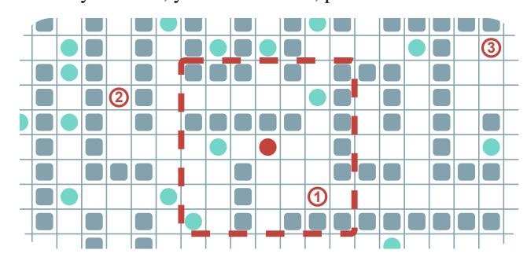
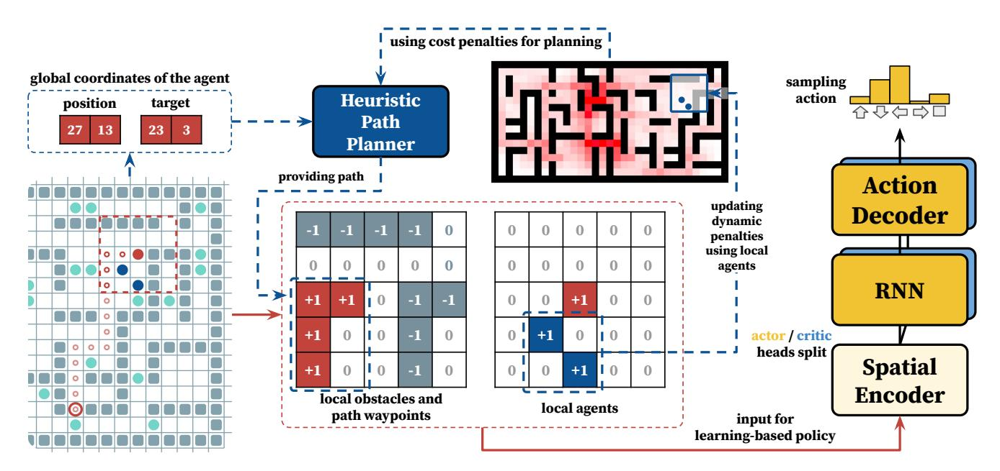

# Learn to Follow: Decentralized Lifelong Multi-Agent Pathfinding via Planning and Learning

Alexey Skrynnik1,2, Anton Andreychuk1 , Maria Nesterova2,3 , Konstantin Yakovlev1,2, Aleksandr Panov1,3

1AIRI, Moscow, Russia

2Federal Research Center for Computer Science and Control of Russian Academy of Sciences, Moscow, Russia

3MIPT, Dolgoprudny, Russia

skrynnikalexey@gmail.com, andreychuk@airi.net, minesterova@yandex.ru, yakovlev@isa.ru, panov@airi.net

#### Abstract

Multi-agent Pathfinding (MAPF) problem generally asks to find a set of conflict-free paths for a set of agents confined to a graph and is typically solved in a centralized fashion. Conversely, in this work, we investigate the decentralized MAPF setting, when the central controller that possesses all the information on the agents' locations and goals is absent and the agents have to sequentially decide the actions on their own without having access to the full state of the environment. We focus on the practically important lifelong variant of MAPF, which involves continuously assigning new goals to the agents upon arrival to the previous ones. To address this complex problem, we propose a method that integrates two complementary approaches: planning with heuristic search and reinforcement learning through policy optimization. Planning is utilized to construct and re-plan individual paths. We enhance our planning algorithm with a dedicated technique tailored to avoid congestion and increase the throughput of the system. We employ reinforcement learning to discover the collision avoidance policies that effectively guide the agents along the paths. The policy is implemented as a neural network and is effectively trained without any reward-shaping or external guidance. We evaluate our method on a wide range of setups comparing it to the state-of-the-art solvers. The results show that our method consistently outperforms the learnable competitors, showing higher throughput and better ability to generalize to the maps that were unseen at the training stage. Moreover our solver outperforms a rulebased one in terms of throughput and is an order of magnitude faster than a state-of-the-art search-based solver. The code is available at https://github.com/AIRI-Institute/learn-to-follow.

# Introduction

Multi-agent pathfinding (MAPF) (Stern et al. 2019) is a challenging problem that has been getting increasing attention recently. It is often studied in the AI community with the following assumptions. The agents are confined to a graph, and at each timestep, an agent can either move to an adjacent vertex or stay at the current one. A central controller possesses information about the graph and the agents' start and goal locations. This unit is in charge of constructing a set of conflict-free plans for all the agents. Thus, a typical setting for MAPF can be attributed as *centralized* and *fully observable*.

Figure 1: An example of a decentralized LMAPF instance. Agents are depicted as filled circles. The dashed line illustrates the red agent's ego-centric field-of-view, where the other observed agents are colored in teal. The red circles with numbers represent the goals that the agent needs to reach. The next goal is only revealed to the agent when the current one is achieved.

In many real-world domains, however, it is not possible, from the engineering perspective, to design such a central controller that has a stable connection to all the agents (robots) and obtains a full knowledge of the environment all the time. For example, consider a fleet of service robots delivering some items in a human-shared environment, e.g., the robots delivering medicine in the hospital. Each of these robots is likely to have access to the global map of the environment (e.g., the floor plan), possibly refined through the robot's sensors. However, the connection to the central controller may not be consistent. Thus, the latter may not have accurate data on the robots' locations and, consequently, cannot provide valid MAPF solutions. In such scenarios, *decentralized approaches* to the MAPF problems, when the robots themselves have to decide their future paths based on their local observations, as depicted in Fig. 1, are essential. In this work, we aim to develop such an efficient decentralized approach.

It is natural to frame the decentralized MAPF problem as a sequential decision-making problem where, at each timestep, each agent must choose and execute an action that will advance it toward its goal while ensuring that the other agents can also reach their goals. The result of solving this problem is a policy that, at each moment, specifies which action to execute. To form such a policy, learnable methods are commonly used, such as reinforcement learning (RL), which is particularly beneficial in tasks with incomplete information (Mnih et al. 2015; Rashid et al. 2018; Hafner et al. 2021). However, even state-of-the-art RL methods generally struggle with solving long-horizon problems with the involved causal structure (Milani et al. 2020; Hafner et al. 2023), and they are often inferior to the search-based, planning methods when solving problems with hard combinatorial structure (Kansky et al. 2023).

Indeed, numerous learnable methods tailored to MAPF settings are already known, such as PRIMAL (Sartoretti et al. 2019), PRIMAL2 (Damani et al. 2021), DHC (Ma, Luo, and Ma 2021), PICO (Li et al. 2022), SCRIMP (Wang et al. 2023) to name a few. These methods either rely on the complex training procedures that typically involve manual reward-shaping, external demonstrations etc., or on communication (data sharing) between the agents. Moreover, these methods often do not generalize well, i.e. their performance degrades significantly when they solve problem instances on the maps that are not alike the ones used for training.

To this end, we suggest that the MAPF problem should not be solved directly by RL, but rather in combination and vivid interaction with a heuristic search algorithm. This idea is put into practice via the following pipeline. Each agent plans an individual path to its goal by a heuristic search algorithm without taking the other agents into account. Moreover, an additional technique is introduced for planning that is dedicated specifically to dispersing the agents over the workspace via penalizing the paths that are likely to cause deadlocks. Upon path construction, a learnable policy, developed through decentralized training, is then invoked to follow the planned path, making necessary detours to avoid collisions and allow other agents to progress towards their goals.

Empirically, we compare our method, which we name FOLLOWER, to a range of both learnable and non-learnable state-of-the-art competitors and show that it *i*) consistently outperforms the learnable competitors in terms of solution quality; *ii*) better generalizes to the unseen environments compared to the other learnable solvers; *iii*) outperforms a state-of-the-art rule-based centralized solver in terms of solution quality; *iv*) scales much better to the large numbers of agents in terms of computation time compared to the stateof-the-art search-based centralized solver.

# Related Works

Lifelong MAPF LMAPF is an extension of MAPF when the new goals are assigned to the agents when they reach their current ones. Similarly, in (online) multi-agent pickup and delivery (MAPD), agents are continuously assigned tasks comprising two locations that the agent has to visit in a strict order: pickup location and delivery location. Typically, the assignment problem is not considered in LMAPF/MAPD. However, some works also consider task assignment, such as (Liu et al. 2019; Chen et al. 2021).

Ma et al. (2017) propose several variants to tackle MAPD differing in the amount of data the agents share. Yet, even the decoupled (as attributed by the authors) algorithms based on Token Swapping rely on global information, i.e., the one provided by the central unit. An enhanced Token Swapping variant that considers kinematic constraints was introduced in (Ma et al. 2019b). In (Okumura et al. 2019) an efficient rule-based re-planning approach to solve MAPF that is naturally capable of solving LMAPF/MAPD problems is introduced – PIBT (Priority Inheritance with Backtracking). It does not rely on the several restrictive assumptions of Token Swapping and is empirically shown to outperform the latter. We compare with PIBT and demonstrate that our method provides solutions of the better quality.

Finally, one of the most recent and effective LMAPF solvers is the RHCR (Rolling-Horizon Collision Resolution) algorithm presented in (Li et al. 2021). It draws upon the idea of bounded planning, i.e., constructing not a complete plan but rather its initial part. RHCR is a centralized solver that relies on the full knowledge of the agents' locations, current paths, goals, etc. In this work, we empirically compare with RHCR and show that our method scales better to large number of agents when the computation time is capped.

Decentralized MAPF This setting entails that the paths/actions of the agents are not decided by a central unit but by the agents themselves. Numerous approaches, especially the ones tailored to the robotics applications, boil this problem down to reactive control (Lumelsky and Harinarayan 1997; Van den Berg, Lin, and Manocha 2008; Zhu, Brito, and Alonso-Mora 2022). These methods, however, are often prone to deadlocks. Several MAPF algorithms can also be implemented in a decentralized manner. For example, Wang and Botea (2011) introduce MAPP algorithm that relies on individual pathfinding for each agent and a set of rules to determine priorities and choose actions to avoid conflicts when they occur along the paths. In general, most rule-based MAPF solvers, like the previously mentioned PIBT (Okumura et al. 2019), or another seminal MAPF solver Push And Rotate (de Wilde, ter Mors, and Witteveen 2013), can be implemented in such a way that each agent locally decides its actions. However, in this case, the implicit assumption is that the agents can communicate to share relevant information (or that they have access to the global MAPFrelated data). By contrast, our work assumes that the agents cannot reliably communicate with each other or a central unit, which significantly increases the complexity of the problem.

Learnable MAPF This direction has recently received an increased attention. In (Sartoretti et al. 2019), a seminal PRIMAL method was introduced. It utilizes reinforcement learning and imitation learning to solve MAPF in a decentralized fashion. Later in (Damani et al. 2021), it was enhanced and tailored explicitly to LMAPF. The new version was named PRIMAL2. Since numerous learningbased MAPF solvers have emerged, it has become common to compare against PRIMAL/PRIMAL2 (we also compare with it in our work). For example, Riviere et al. (2020) propose another learning-based approach tailored explicitly to agents with a non-trivial dynamic model, such as quadrotors. Ma, Luo, and Ma (2021) describe DHC – a method that efficiently utilizes the agents' communications to solve

dececentralized MAPF. Another communication-based learnable approach, PICO, is presented in (Li et al. 2022) and yet another in the most recent paper by (Wang et al. 2023). Overall, currently, there is a wide range of learnable decentralized MAPF solvers. In this work, we compare our method with the state-of-the-art learnable competitors and show that the former produces better quality solutions and better generalizes to the unseen maps.

**MARL and HRL** Multi-Agent Reinforcement Learning (MARL) (Wong et al. 2023) is a separate direction in RI that specifically considers the multi-agent setting. Mainly, MARL approaches consider game environments (like Starcraft (Samvelyan et al. 2019)) in which pathfinding is not of primary importance. However, several MARL methods, such as QMIX (Rashid et al. 2018) and MAPPO (Yu et al. 2022), have been adapted specifically for the MAPF task (Skrynnik et al. 2021). However, they rely on information sharing between the agents.

Learnable low-level policies and heuristic sub-goal allocation procedures s are commonplace in many hierarchical RL (HRL) approaches tailored to single-agent problems. However, such techniques are rarely explored in MARL (Wang et al. 2022). Existing studies primarily demonstrate their results within simplistic environments (Tang et al. 2018), leaving ample room for further research. Among these, PoEM (Liu et al. 2016), a method closely related to ours, utilizes preexisting demonstrations to identify sub-goals, implying that its application is limited without such demonstrations. In contrast to our approach, all the methods we are aware of present their findings using scenarios with a few agents.

#### Background

**Multi-agent Pathfinding** In (Classical) Multi-agent pathfinding (Stern et al. 2019), the timeline is discretized to timesteps and the workspace, where  $M$  agents operate, is discretized to a graph  $G = (V, E)$ , whose vertices correspond to the locations and the edges to the transitions between these locations.  $M$  start and goal vertices are given, and each agent  $i$  has to reach its goal  $g_i \in V$  from the start  $s_i \in V$ . At each timestep, an agent can either stay in its current vertex or move to an adjacent one. An individual plan for an agent  $p_i^1$  is a sequence of actions that transfers it between two designated vertices. The plan's cost is equal to the number of actions comprising it.

The MAPF problem asks to find a set of  $M$  plans s.t. each agent reaches the goal without colliding with the others. Formally, two collisions are typically distinguished: a vertex collision, where the agents occupy the same vertex at the same timestep, and an edge collision, where the agents use the same edge at the same timestep.

*Lifelong MAPF* (LMAPF) is a variant of MAPF where immediately after an agent reaches its goal, it is assigned to another one (via an external assignment procedure) and has to continue its operation.

1In MAPF literature, a plan is typically denoted with  $\pi$ . However, in RL, this is reserved to denote the policy. As we use both MAPF and RL approaches in this work, we denote a plan as  $p$ .

**Thenvironmental LMAPF Problem** Let a set of agents operate in the shared environment, represented as a graph  $G = (V, E)$ . The timeline is discretized into the timesteps  $T = 0, 1, \dots, T_{max}$ , where  $T_{max}$  is the episode length. Each agent is located initially at the start vertex and is assigned to the current goal vertex. If it reaches the latter before the episode ends, it is immediately assigned another goal vertex. We assume that the *goal assignment* unit is external to the system, and the agents' behavior does not affect the goal assignments. Each agent is allowed to perform the following actions: wait at the current vertex and move to an adjacent vertex. The duration of each action is uniform, i.e., one timestep. We assume that the outcomes of the actions are deterministic and no inaccuracies occur when executing the actions.

Each agent has a a complete knowledge of the graph  $G$ . However, it observes the other agents only *locally*. When observing them, no communication occurs. Thus, an agent does not know the current goals or intended paths of the other agents. It only observes their locations. The observation function can be defined differently depending on the type of graph. In our experiments, we use 4-connected grids and assume that an agent observes the other agents in the area of the size  $m \times m$ , centered at the agent's current position.

Our task is to construme an individual policy  $\pi$  for each agent, i.e., the function that takes as input a graph (global information) and (a history of) observations (local information) and outputs a distribution over actions. Equipped with such policy, an agent at each time step samples an action from the distribution suggested by  $\pi$  and executes it in the environment. This continues until timestep  $T_{max}$  is reached when the episode ends. Upon that, we compute the *throughput* as the ratio of the number of goals achieved by all agents to episode length. We use it to compare different policies: we assert that  $\pi_1$  outperforms  $\pi_2$  if the throughput of the former is higher.

**Partially Observable Markov Decision Process** We consider a partially observable multi-agent Markov decision process defined as  $M = \langle S, A, U, P, R, O, \mathcal{O}, \gamma \rangle$ . At each timestep, each agent  $u \in U$ , with  $U = \{1, \dots, n\}$ , chooses an action  $a^{(u)} \in A$ . These actions form a joint action  $\mathbf{j} \in \mathbf{J} = A^n$ , influencing the environment's state transition as per the function  $P(s'|s, \mathbf{j}) : S \times \mathbf{J} \times S \rightarrow [0, 1]$ .

After that, each agent receives an individual observation  $o^{(u)} \in O$  based on on the global observation function  $\mathcal{O}(s, a)$  :  $S \times A \rightarrow O$ , and an individual scalar reward  $R(s, u, \mathbf{j})$  :  $S \times U \times \mathbf{J} \rightarrow \mathbb{R}$ , which depends on the current state, joint action and may be different for different agents. Discount factor  $0 \leq \gamma \leq 1$  determines the importance of future rewards.

To make kee decisions, each agent maintains an action-observation history  $\tau^{(u)} \in T = (O \times A)^*$ . The latter is used to condition a stochastic policy  $\pi^{(u)}(a^{(u)} | \tau^{(u)}) : T \times A \rightarrow [0, 1]$ . The aim is to obtain (to learn) a policy  $\pi^{(u)}$  for each individual agent that maximizes the expected cumulative reward over time.

1In MAPF literature, a plan is typically denoted with  $\pi$ . However, in RL, this is reserved to denote the policy. As we use both MAPF and RL approaches in this work, we denote a plan as  $p$ .

Figure 2: The general pipeline of the FOLLOWER approach. The action selection policy for each agent is decentralized and consists of two modules: Heuristic Path Planner, which addresses the long-term path planning problem, and Learnable Follower, which addresses the short-term conflict resolution task.

#### Learn to Follow

The suggested approach, which we dub FOLLOWER, is comprised of the two complementary modules combined into a coherent pipeline shown in Fig. 2. First, a *Heuristic Path Planner* is used to construct an individual path to the goal. Then, a *Learnable Follower* is invoked to follow this path.

#### Heuristic Path Planner

The aim of this module is to build a path from the current location of the agent to the goal. The static obstacles are taken into account, while the other agents are not; therefore, the constructed path may go through them. The rationale behind this is that the collision avoidance will be handled later on by the path following policy.

A crucial design choice is which individual path to build. On the one hand, paths with the minimal length are desirable. On the other hand, when the number of agents is high and each agent is following its shortest path, a congestion often arises in the bottleneck parts of the map, such as corridors or doors. This degrades the overall performance dramatically. To this end, we suggest searching not for the shortest paths but rather for the evenly dispersed paths. Intuitively, we wish to distribute the agents across the map to decrease congestion and increase the throughput. This technique is implemented as follows.

Instead of assuming that the transition costs used by a search algorithm (we use A\* in our experiments) are uniform, we compute the individual varying transition costs associated with the cells. The individual cost of a transition to a cell is the sum of two components, the static and the dynamic one:

$$cost(c, t) = cost_{st}(c) + cost_{dyn}(c(c, t). \quad (1)$$

The static cost component depends solely on the topology of the map and does not change through the episode. The dynamic cost component, conversely, is based on the history of the observations of the agent and is dynamically updated.

To estimate the static cost of each cell, we, first, compute the average cost of the paths starting in this cell and ending in all other free cells (we use BFS algorithm for that):

$$\text{avg\_cost}(c) = \sum_{c' \in V_{\text{free}}(c)} \frac{\text{path\_cost}(c, c')}{|V_{\text{free}}(c)|}, \quad (2)$$

where  $V_{free}(c)$  denotes the vertices reachable from  $c$ .

Intuitively, the lower values of *avg\_cost(c)* indicate that a higher number of (the shortest) paths pass through *c*, and, thus, the latter is a potential congestion attractor. Consecutively, the transition to *c* should be penalized. This is implemented as follows:

$$cost_{st}(c) = \frac{\max_{c' \in V}(avg_{-cost}(c'))}{avg_{-cost}(c)}, \quad (3)$$

In other words, the static transition cost to a cell is 1 only if it is the "most rarely used" cell of the grid, while the transition costs to the other (more frequently used) cells are higher.

The dynamic cost,  $cost_{dyn}(c, t)$ , is based on the personal experience of an agent and changes during the episode. It is computed as follows.

$$cost_{dyn}(c(t) = \sum_{t' \in [0,t]} AgentAtCell(c,t'), \quad (4)$$

where *AgentAtCell*(*c*,*t'*) is a function that returns 1 if some agent was observed (by the current agent) at cell *c* at timestep *t'* and returns 0 otherwise.

Intuitively, the dynamic cost penalizes transitions to the cells that are frequently used by the other agents. Indeed, each agent maintains its own dynamic costs. Moreover, to avoid the negative impact of over-accumulating the dynamic penalties, whenever an agent reaches its goal it resets the dynamic costs of all grid cells.

Empirically, both the precomputed transition costs and the individual dynamic costs contribute toward greater efficiency of our solver as will be shown later.

#### Learnable Follower

This module implements a learnable policy tailored to follow the provided path while avoiding the collisions with the other agents. The policy function is approximated by a (deep) neural network and, as the agents are assumed to be homogeneous, a single network is utilized during training (a technique referred to as *policy sharing*).

The input to to the neural network represents the local observation of an agent and is comprised of a  $2 \times m \times m$  tensor, where  $m$  is the observation range. The channels of the tensor encode the locations of the static obstacles combined with the current path and the other agents; see Fig. 2.

The input goes through the *Spatial Encoder* first, and then the network is split into the actor and critic heads, with the *RNN blocks* designed to memorize the observation history. The output of the actor is the *Action Decoder*, which produces an action distribution. The *Critic Head* generates a value estimate, which is needed for training purposes only.

The pipepleine employs a policy optimization algorithm, rewarding the agent with  $+r$  for reaching the first waypoint (i.e. the next grid cell on the constructed path). If the agent deviates from or approaches the waypoint, the heuristic path planner is reactivated. This is advantageous in situations where taking a detour to avoid congestion with other agents is beneficial in achieving the overall goal. The focus on reaching the first waypoint provides a dense reward signal. While the agent is rewarded for reaching the nearest waypoint, its decision-making extends beyond the immediate vicinity of that waypoint. It's important to note that the FOLLOWER aims to maximize rewards by navigating through multiple waypoints en route to the global goal. It takes into account potential long-term cumulative rewards, such as allowing another agent to pass and then following the path, instead of obstructing each other.

The task of the learning process is to optimize the shared policy  $\pi_\theta^u$  (i.e. the same policy for each agent) to maximize the expected cumulative reward. During the training process, rollouts (sequences of observations, rewards, and actions) are gathered from multiple environments with varying numbers of agents. The shared policy  $\pi_\theta$  (actor network) is continually updated using the PPO clipped loss (Schulman et al. 2017).

In practice, the observation history  $\tau^u$  is effectively modeled using a recurrent neural network (RNN) integrated into the actor and critic heads. The actor network is parameterized by  $\theta$ , while the critic network is parameterized by  $\phi$ .

In our aproposition, we specifically utilize the GRU architecture (Chung et al. 2014).

During the decentralized inference, each agent uses a copy of the trained weights, and the other parameters remain unchanged. The proposed FOLLOWER scheme, despite its simplicity, allows the agent to separate the two components of the overall policy transparently and does not require the involvement of any expert data for training. Finally, the reward function used is simple and does not require involved manual shaping.

# Experimental Evaluation

To evaluate the efficiency of the proposed method, we conduct a set of experiments, comparing it with the state-of-the-art LMAPF algorithms on different maps. The training and evaluation of the presented approaches is held in fast and scalable POGEMA2 environment.

The path planner of FOLOWER is based on A\*. The learnable policy is implemented as the neural network of the following architecture. The *Spatial Encoder* is a ResNet (He et al. 2016) with an additional Multi-Layer Perceptron (MLP) in the output layer. The *Action Decoder* and the *Critic Head* are recurrent neural networks, based on the GRU. The total number of parameters is 5M. Moreover, we developed an additional fast variant of FOLOWER, FOLLOWERLITE, which has only 3,678 parameters, excludes the RNN component (see the Arxiv version of the paper for more details3) and is implemented fully in C++.

For training the episode length was set to 512. The agent's field-of-view was  $11 \times 11$ , the number of agents varied in range: 128, 256. The reward  $r$  was a small positive number, i.e.  $r = 0.01$ . More details about tuning the hyperparameters are reported in the Arxiv version of the paper. Upon fixing the parameters, the final policy of FOLLOWER is trained for 1 billion steps using a single NVIDIA A100 in approximately 18 hours. FOLLOWERLITE is trained for 20 million steps with a single NVIDIA TITAN RTX GPU in approximately 30 minutes.

### Comparison With the Learnable Methods

In the first series of experiments, we compare our method with the state-of-the-art learnable MAPF solvers SCRIMP (Wang et al. 2023), PRIMAL2 (Damani et al. 2021) and PICO (Li et al. 2022). PRIMAL2 is a semi-nal approach specpecifically tailored for solving LMAPF problems. SCRIMP and PICO are the decentralized MAPF solvers that were (straightforwardly) adopted by us to handle LMAPF setting. In the experiments we utilize the environmental conflict-handling mechanism from PRIMAL2 – when two or more agents decide to move to the same cell, only one of them succeeds while the rest stay put. Noteworthy, SCRIMP has a dedicated negotiation procedure for conflict resolution, which we did not modify.

As learnable methods assume training on a certain type of maps, we use the maps suggested by the authors of the respective baselines for a fair comparison. Specifically, we

2[https://github.com/AIRI-Institute/pogema](https://github.com/AIRIRI-Institute/pogema)3