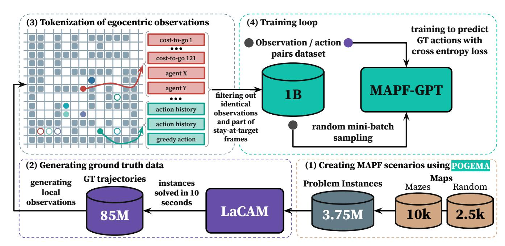
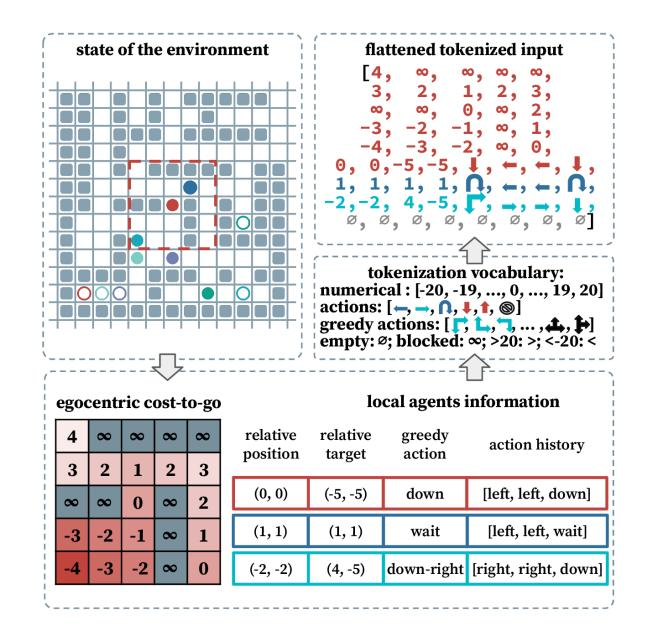
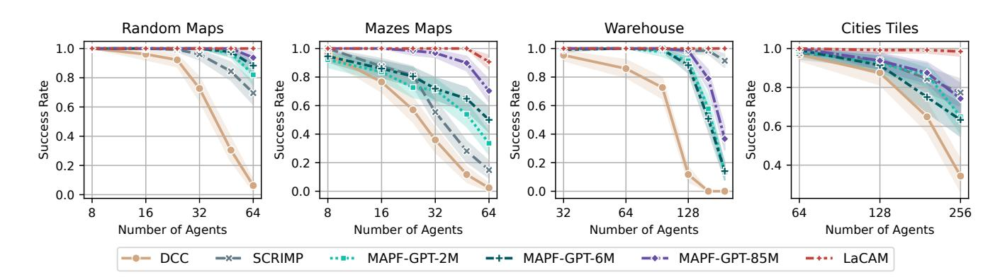
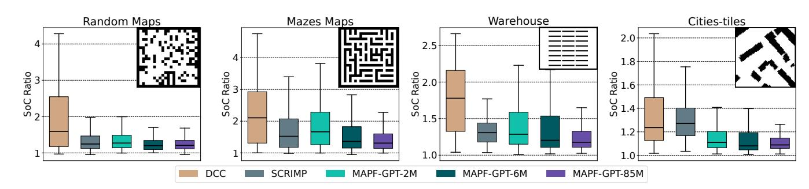
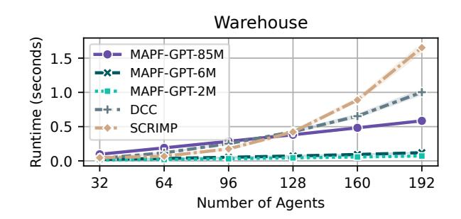

# MAPF-GPT: Imitation Learning for Multi-Agent Pathfinding at Scale

Anton Andreychuk1\*, Konstantin Yakovlev2,1, Aleksandr Panov1,2,3, Alexey Skrynnik1,2,3\*

1AIRI, Moscow, Russia

2Federal Research Center "Computer Science and Control" of the Russian Academy of Sciences, Moscow, Russia

3Moscow Institute of Physics and Technology, Dolgoprudny, Russia andreychuk@airi.net, yakovlev@isa.ru, panov@airi.net, skrynnikalexey@gmail.com

### Abstract

Multi-agent pathfinding (MAPF) is a problem that generally requires finding collision-free paths for multiple agents in a shared environment. Solving MAPF optimally, even under restrictive assumptions, is NP-hard, yet efficient solutions for this problem are critical for numerous applications, such as automated warehouses and transportation systems. Recently, learning-based approaches to MAPF have gained attention, particularly those leveraging deep reinforcement learning. Typically, such learning-based MAPF solvers are augmented with additional components like single-agent planning or communication. Orthogonally, in this work we rely solely on imitation learning that leverages a large dataset of expert MAPF solutions and transformer-based neural network to create a foundation model for MAPF called MAPF-GPT. The latter is capable of generating actions without additional heuristics or communication. MAPF-GPT demonstrates zero-shot learning abilities when solving the MAPF problems that are not present in the training dataset. We show that MAPF-GPT is able to outperform the state-of-the-art learnable MAPF solvers on a diverse range of problem instances and is computationally efficient during inference.

Project Page — https://sites.google.com/view/mapf-gpt/

# Introduction

Multi-agent pathfinding (MAPF) (Stern et al. 2019) is a combinatorial computational problem that asks to find a set of paths for the agents that operate in a shared environment, such that accurately following these paths does not lead to collisions and, preferably, each agent reaches its specified goal as soon as possible. On the one hand, even under simplified assumptions, such as a graph representation of the workspace, discretized time, uniform duration of actions, optimally solving MAPF is NP-Hard (Surynek 2010). On the other hand, efficient MAPF solutions are highly demanded in numerous real-world applications, such as automated warehouses (Li et al. 2021), railway scheduling (Svancara and Bartak 2022), transportation systems (Li ´ et al. 2023), etc. This has resulted in a noticeable surge of interest in MAPF and the emergence of a large body of research devoted to this topic.

\*These authors contributed equally. Copyright © 2025, Association for the Advancement of Artificial Intelligence (www.aaai.org). All rights reserved.

Recently, learning-based MAPF solvers have come on stage (Skrynnik et al. 2021; Alkazzi and Okumura 2024; Skrynnik et al. 2023). They mostly rely on deep reinforcement learning and typically involve additional components to enhance their performance, such as single-agent planning, inter-agent communication, etc. Meanwhile, in the realm of machine learning, currently, the most impressive progress is driven by self-supervised learning (at scale) on expert data and employing transformer-based architectures (Vaswani et al. 2023). It is this combination that recently led to the creation of the seminal large-language models (LLMs) and (large) vision-language models (VLMs) that achieve an unprecedented level of performance in text, image and video generation (Dubey et al. 2024; Liu et al. 2024; Zhu et al. 2024). Moreover, such data-driven approach has become widespread in robotics, where an imitation policy is trained based on a variety of expert trajectories (Chen et al. 2021; Chi et al. 2023). Thus, in this work we are motivated by the following question: *Is it possible to create a strong learnable MAPF solver (that outperforms state-of-the-art competitors) purely on the basis of supervised learning (at scale) on expert data omitting additional decision-aiding routines?* Our answer is positive.

To create our learning-based MAPF solver, which we name MAPF-GPT, we, first, design a vocabulary of terms, called *tokens* in machine learning, that are used to describe any observation an individual agent may perceive and any action it may perform. Next, we create a diverse dataset of expert data, i.e., successful MAPF solutions, utilizing a state-of-the-art MAPF solver. Consequently, we convert these MAPF solutions into sequences of *observation-action* tuples, encoded with our tokens, and utilize a transformerbased non-autoregressive neural network to learn to predict the correct action provided with the observation. In our extensive empirical evaluation, we show that MAPF-GPT notably overpasses the current best-performing learnable-MAPF solvers (without any usage of additional planning or communication mechanisms), especially when it comes to out-of-distribution evaluation, i.e., evaluating the solvers on the problem instances that are not similar to the ones used for training (a common bottleneck for learning-based solvers). We also report ablation studies and evaluate MAPF-GPT in another type of MAPF, i.e. the Lifelong MAPF (both in zeroshot and fine-tuning regimes).

To summarize, we make the following contributions:

- We present the largest MAPF dataset for decisionmaking, containing 1 billion observation-action pairs.
- We develop an original tokenization procedure to describe agent observations and use it to create MAPF-GPT, a novel learning-based, decentralized MAPF solver built on a state-of-the-art transformer-based neural network. Trained with imitation learning, MAPF-GPT serves as a foundation model for MAPF tasks, demonstrating zero-shot learning abilities on unseen maps.
- We extensively study MAPF-GPT and compare it with state-of-the-art decentralized learning-based approaches, showing MAPF-GPT's high performance across a wide range of tasks, along with better runtime efficiency.

# Related Works

Multi-agent pathfinding Several orthogonal approaches to tackle MAPF can be distinguished. First, dedicated rule-based MAPF solvers exist that are tailored to obtaining MAPF solutions fast, yet no bounds on their costs are guaranteed (Okumura 2023; Li et al. 2022). Second, reduction-based approaches to obtain optimal MAPF solutions are widespread. They convert MAPF to some other well-established computer science problem, e.g., minimumflow on graphs, boolean satisfiability (SAT), and employ an off-the-shelf solver to obtain the solution of this problem (Yu and LaValle 2013; Surynek et al. 2016). Next, a plethora of search-based MAPF solvers exist (Sharon et al. 2015, 2013; Wagner and Choset 2011). They explicitly rely on graph-search techniques to obtain MAPF solutions and often may provide certain desirable guarantees, e.g., optimal or bounded suboptimal solutions. Meanwhile, simplistic search-based planners that lack strong guarantees, like prioritized planning (Ma et al. 2019), are also widespread.

Recently, learning-based MAPF solvers gained attention. One of the first such successful solvers was PRIMAL (Sartoretti et al. 2019) that demonstrated how MAPF problem can be solved in a decentralized manner utilizing machine learning. The recent learnable MAPF solvers such as SCRIMP (Wang et al. 2023), DCC (Ma, Luo, and Pan 2021), Follower (Skrynnik et al. 2024a), to name a few, typically rely on reinforcement learning *and* on additional modules, like the communication one, to solve the problem at hand. Orthogonally to these approaches, we rely purely on imitation learning from expert data.

Offline reinforcement learning Offline deep reinforcement learning develops a policy based on previously collected data without interacting with the environment while training (Levine et al. 2020). This allows getting a robust policy due to the utilization of large amounts of precollected data. There are numerous effective offline RL approaches, such as CQL (Kumar et al. 2020), IQL (Kostrikov, Nair, and Levine 2022), TD3+BC (Fujimoto and Gu 2021). Modern approaches often involve transformers as the architectural backbone. One popular approach is the Decision Transformer (DT) (Chen et al. 2021), which models the behavior of an expert by conditioning on the desired outcomes, thereby integrating reward guidance directly into the decision-making process. In multi-agent scenarios, there is less diversity in offline RL methods; however, a multi-agent adaptation of the DT exists, known as MADT (Meng et al. 2021).

Multi-agent imitation learning (MAIL) Imitation learning and learning from demonstration are actively used in multi-agent systems (Tang et al. 2024; Liu and Zhu 2024). MAIL refers to the problem of agents learning to perform a task in a multi-agent system through observing and imitating expert demonstrations without any knowledge of a reward function from the environment. It has gained particular popularity in the tasks of controlling urban traffic and traffic lights at intersections (Bhattacharyya et al. 2018; Huang et al. 2023) due to the presence of a large amount of data collected in real conditions and a high-quality simulator (such as Sumo (Lopez et al. 2018)). Among the methods in the field of MAIL, it is possible to note works using the Bayesian approach (Yang et al. 2020), generative adversarial methods (Song et al. 2018; Li et al. 2024), statistical tools for capturing multi-agent dependencies (Wang et al. 2021), low-rank subspaces (Shih, Ermon, and Sadigh 2022), latent multi-agent coordination models (Le et al. 2017), decision transformers (Meng et al. 2021), etc. Demonstrations are often used for pre-training in game tasks, such as training models for chess (Silver et al. 2016; Ruoss et al. 2024), and in MAPF tasks, as exemplified by SCRIMP (Wang et al. 2023). However, despite the listed works in this area, a single foundation model has not yet been proposed, the imitation learning, which already gives high results in multi-agent tasks and does not require an additional stage of online learning in the environment. This is largely due to the complexity of the behavioral multi-agent policies in various tasks (such as in StarCraft (Samvelyan et al. 2019) and traffic control) and the lack of large datasets of expert trajectories, which are necessary for effective training of foundation models. In this regard, the MAPF task is a convenient testbed for investigating transformer foundation models in a multi-agent setting, which will provide additional insights for creating such models in other applications, and our work also provides a large dataset for training MAPF models.

# Background

**Multi-agent pathfinding**  The classical variant of the MAPF problem is defined by a tuple  $(n, \mathcal{G} = (\mathcal{V}, \mathcal{E}), S = \{s_1, \dots, s_n \mid s_i \in \mathcal{V}\}, G = \{g_1, \dots, g_n \mid g_i \in \mathcal{V}\})$ , where  $n$  is the number of agents acting in the shared workspace which is represented as an undirected graph  $\mathcal{G}$ . At each time step, an agent is assumed to either move from one vertex to the other or wait at the current vertex. The duration of both actions is uniform and equals 1 time step. The plan for the  $i$ -th agent,  $pl_i$ , is a sequence of moves, s.t., each move starts where the previous one ends. Two distinct plans have a vertex (or edge) conflict if, at any time step, the agents occupy the same vertex (or traverse the same edge in opposite directions) at that time.

The task is to find a set of  $n$  plans,  $Pl = \{pl_1, \dots, pl_n\}$ , s.t. each  $pl_i$  starts at  $s_i$ , ends at  $g_i$  and each pair of plans in  $Pl$  is conflict-free. The objective to be minimized is typically

defined as  $SoC(Pl) = \sum_{i=1}^n cost(pl_i)$  (called the *Sum-Of-Costs*) or as  $MS(Pl) = \max_{i=1,\dots,n} cost(pl_i)$  (called the *Makespan*), where  $cost(pl_i)$  is the cost of the individual plan which equals the time step when the agent reaches its goal vertex (and does not move awaNotably, two assumptptions on how agents behave when they reach their goals are common in MAPF: stay-at-target and disappear-at-target. In the latter case, the agent is assumed to disappear upon reaching its target and, thus, is not able to cause any further conflicts. In this work, we study MAPF under the first assumption (which is intuitively more restrictive).

**MAPF as a sequential decision-making problem** Despite MAPF being typically considered to be a planning problem as defined above, it can also be considered as a sequential decision-making (SDM) problem. Within the SDM framework, the problem is to construct *a policy*,  $\pi$ , that is a function that maps the c current state (the current positions of all agents in the graph) to a (joint) action  $\mathbf{a} = a_i \times \dots \times a_n$ , where  $a_i \in A_i$  and  $A_i$  is the set of possible actions for agent  $i$ . When  $\pi$  is obtained, it is invoked sequentially until either all agents reach their goals or the threshold on the number of time steps,  $t_{max}$ , is reached.

For better scalability, the decision-making policy might be decentralized, i.e., each agent chooses its action independently of the other agents. In practice, decentralized agents typically don't have access to the global state of the environment, i.e., positions of the other agents, but rather rely on local observation,  $o_t$ . For example, if the underlying graph is a 4-connected grid, then the local observation may be a  $(2r + 1) \times (2r + 1)$  patch of the grid centered at the agent's current position (where  $r$  is the observation radius) and the latter observes only the agents that are within this patch. A sequence of individual observations and actions forms the agent's history:  $h_t = \{o_1, a_1, o_2, a_2, \dots, o_{t-1}, a_{t-1}, o_t\}$ , where  $o_k$  and  $a_k$  denote the action and the observation at time step  $k$ . This history is typically used to reconstruct a Markovian state of the environment via some approximator  $f: s_t \approx f(h_t)$  (e.g.  $f$  can be represented as a neural network).

Overall, in the decentralized partially observable setting, the problem is to construct  $n$  individual policies of the form:

$$\pi_i(s_t) \rightarrow \mathbf{P}(A_i)$$

where  $\mathbf{P}(A_i)$  – is the probability distribution over the actions. The exact action to be executed at the current time step is considered to be sampled from this distribution.

In this work, we follow a common assumption in MAPR that the agents are homogeneous and cooperative. Thus instead of obtaining  $n$  distinct individual policies  $\pi_i$ , we aim to obtain a single individual policy  $\pi$  that governs the behavior of each agent.

**Imitation learning** To construct (learn) a decision making policy  $\pi$ , imitation learning relies on an expert policy  $\pi^b$ , which is used to collect a set of trajectories:  $\mathcal{D} = \{traj\}$ , where each trajectory is composed of the observations and actions:  $traj = \{o_1^b, a_1^b, \dots, o_L^b, a_L^b\}$ . Intuitively, in MAPF

context,  $\mathcal{D}$ D represents the expert knowledge on how an agent should behave under different circumstances (it can be obtained running a well-established MAPF solver on a range of problem instances).

Denote now by  $\pi_\theta$  a target policy parameterized by  $\theta$ . The problem of obtaining (learning) this policy from the available data is reduced to the following optimization problem for the parameters  $\theta$ :

$$\theta^* = \arg \min_{\theta} \mathbb{E}_{traj \sim \mathcal{D}} \sum_{j=0}^L \mathcal{L}(a_j, a_j^b),$$

where  $a_j \sim \pi_\theta(s_j)$ ,  $a_j^b \sim \pi_\theta(s_j^b)$ , and  $\mathcal{L}$  is a loss function, which is selected depending on the action space. In the considered case, when the action space is discrete, cross-entropy is widely used as  $\mathcal{L}$ .

#### Method

Our approach, MAPF-GPT, is to learn to imitate an expert in solving MAPF. The learning phase of MAPF-GPT consists of the four major steps: creating MAPF scenarios, generating ground truth solutions, tokenizing these solutions, and executing the main training loop – see Figure 1. We will now sequentially describe these steps.

#### Creating MAPF Scenarios

A large, curated dataset is crucial for any data-driven method including ours. To create the set of training instances we used POGEMA (Skrynnik et al. 2025), a versatile tool for developing learnable MAPF solvers that includes utilities to generate maze-like maps and maps with random obstacles, as well as to create MAPF instances from them (i.e. assigning start-goal locations). For our purposes we generate 10K of maze-like maps and 2.5K random maps and further created 3.75M different problem instances on these maps. The size of the maps varies from  $17 \times 17$  to  $21 \times 21$ , the number of the agents is 16, 24, or 32. Please note that as we aim to create an individual policy to solve MAPF in a decentralized fashion (i.e. each agent makes its own decision on how to move based on its local observation) it is not the size of the maps that actually matters but rather the density, i.e., the ratio of the free space to the space occupied by the agents. We use moderate and considerably high densities to make the agents face challenging patterns requiring coordination (especially on the maze-like maps).

### Generating Ground Truth Data

To create expert data, we use a recent variant of LaCAM (Okumura 2024, 2023), a state-of-the-art MAPF solver that is tailored to quickly find a solution and iteratively enhance it while having a time budget. As we need to solve a large number of MAPF instances (i.e. 3.75M) we set this time budget to be 10 seconds.

The output of LaCAM on a single MAPF instance is the set of the individual plans. We further trace each plan and reconstruct an agent's (local) observations in order to form observation-action pairs. We use the following post-processing to filter out some of them. First, if several pairs

Figure 1: The general pipeline of the MAPF-GPT: (1) Creating MAPF scenarios. (2) Generating ground truth data, i.e. MAPF solutions using an expert solver. (3) Transforming the solutions to the observation-action pairs and tokenization of the observations, which converts them into a format suitable for transformer architectures. (4) Executing the training loop, where observation/action pairs are sampled from the dataset, and the model is trained using cross-entropy loss.

share the exactly the same observation we keep only one of them (picked randomly). Second, we observe that the fraction of the pairs when an agents waits at the goal is very high, because in many cases numerous agents wait for long times for other agents to reach their goals and just stand still. In fact, almost 40% of the actions in the original expert data are the waiting ones. To remove this imbalance we discard 80% of wait-at-target actions. We end up with 900M observationaction pairs from the maze-like maps, and 100M – from the random ones. A 9:1 proportion is chosen due to the maze maps possessing more challenging layouts with numerous narrow passages that require a high degree of cooperation between the agents.

We believe that the obtained dataset composed of 1B observation-action pairs is currently the largest dataset of such kind and may bring value to the other researchers developing learnable MAPF solvers. Additional technical details are presented in the arXiv version of the paper.

#### Tokenization

Tokenization can be thought of as the process of transforming the data, observation-action pairs in our case, into the sequence of special symbols, tokens, to be further fed to the neural network that is trained to predict a single token, i.e. action, from the sequence of the input tokens, i.e. the ones that encode the observation. The input tokens are typically referred to as the *context*. We now wish to describe how our context, i.e. the observation, is structured.

The local observation of an agent at a certain time step while following its (expert) path is composed of two parts.

Figure 2: The tokenization process for the MAPF-GPT model uses a vocabulary of 67 tokens, with an input of 256 tokens. Fewer tokens are shown for clarity and visibility.

The first one relates to the map in the vicinity of the agent, i.e. which parts are traversable, which are not, and going to which areas moves the agent closer to its goal. As we used grids to represent the environment the local field-of-view is composed of a square patch of the cells centered at the agent's current position. For each traversable cell we com-

pute its cost-to-go value, i.e. the cost of the shortest path to the cell from the goal location. As the cost of this path might be arbitrarily, we normalize it. I.e. the cost-to-go value is set to 0 for the cell the agent is currently in,  $(x_{cur}, y_{cur})$ . The values for the other traversable cells within the field-of-view are computed as cost-to-go( $x, y$ ) – cost-to-go( $x_{cur}, y_{cur}$ ), where the coordinates are absolute w.r.t. the global coordinate frame. The blocked cells are assigned infinite values.

The second part of the observation contains data about the agent itself and the nearby ones. The information about each agent consists of the coordinates of its current and goal locations, actions history, i.e., the actions that were made in the previous  $k$  steps, and an action that is preferable w.r.t. the agent's individual cost-to-go map – the so-called greedy action. Please note that there may be cases where more than one action leads to a decrease in cost-to-go. Thus, we use special markers to indicate these multi-direction greedy actions (e.g., “up-right”).

The input of the model consists of 256 tokens that encode the local observation of the agent. For the first part, i.e., cost-to-go values, we use the  $11 \times 11greedy dy action. Thus, we are able to encode the information about at most 13 agents, including the egocentric one. The rest of 5 tokens in the input are encoded with the empty token. In case there are not enough agents in the local field of view, the information about missing agents is also filled with empty tokens. The information about agents is sorted based on the distance to the egocentric agent, i.e., the information about the egocentric agent itself always goes first, as its distance is always 0.

Information in the observation includeds both numerical values, such as cost-to-go values or coordinates, and some literal ones that, for example, correspond to the actions. We have chosen the range  $[-20, 20]$  for the numerical values, i.e., 41 different tokens. This range was chosen due to the size of the maps used in the training dataset, which is at most  $21 \times 21$ . However, the cost-to-go values might go beyond this range. For this purpose, we utilize 2 additional tokens for the values that are beyond 20 or below  $-20$ . The coordinates also might be clipped if their values go outside this range. There is also a token that corresponds to the  $\infty$  value for blocked cells. The agents are allowed to perform 5 actions – to move into 4 directions and to wait in place. We have also added one additional token to encode the empty action, i.e., when there are not enough actions performed at the beginning of the episode. The information about the next greedy action cannot be directly encoded with a single token utilizing the tokens that represent the actions due to the fact that there might be two or more directions that reduce the cost-to-go value. To cover all possible cases, such

as up-up-right, left-down-right, etc., we have added 16 more tokens. The last one is an empty token used for padding to 256 tokens. In total the vocabulary consists of 67 different tokens.

#### Model Training

As the model backbone, we used a modern decoder-only transformer (Brown et al. 2020). We used a softmax layer to parameterize the discrete probability distribution. To sample an action, we then used multinomial sampling. The length of the input sequence (context size) of the model is 256. The output size of the model is 5 since each agent has 5 available discrete actions. We used learnable position embeddings. We don't use causal masking, which is common practice in the NLP (Radford et al. 2019), since the model predicts only a single action ahead in a non-autoregressive manner. To speed up training, we used the flash attention technique (Dao 2024).

We usensure models of different sizes (i.e. number of parameters) in our work. Specifically, our largest model contains 85M parameters. We also consider much smaller models that contain 6M and 2M parameters.

**Training protocol** The model was trained to replicate the behavior of the expert policy using cross-entropy loss (i.e., log-loss) via mini-batch stochastic gradient descent, optimized with AdamW (Loshchilov and Hutter 2019). The target label for this loss is a ground-truth action index provided by the expert policy, LaCAM. LaCAM is a centralized solver that builds a path for all agents during the whole episode, leveraging information about the full environment state. In contrast, the trainable model relies solely on a local observation  $o$  of each agent  $u$ .

$$-\log \mathbf{p}_\theta \left( a_u^{LaCAM}(s) \mid o_u \right). \quad (1)$$

Once trained, this policy enables the sampling of actions from it. While an alternative could be to pick the action with the highest probability, we use sampling, recognizing the decentralized nature of the policy. Sampling selects actions based on the probability distribution given by the policy:

$$\hat{a}^u(o_u) \sim \mathbf{p}_\theta(o_u) \quad (2)$$

where  $\mathbf{p}_\theta(o_u)$  represents the probability distribution over actions computed by the model for the observation  $o_u$ .

We used 2000 warm-up iterations and cosine annealing (Loshchilov and Hutter 2017), with a gradient clipping value of 1.0 and a weight decay parameter of 0.1. The entire 1B dataset was used to train the 85M model, which underwent 1M iterations with a batch size of 512, resulting in 15.625 epochs based on the gradient accumulation steps, set at 16. For training the 6M and 2M models, we used portions of the 1B dataset – 150M and 40M, respectively. Additional details about the parameters influencing the training process are provided in the arXiv version of the paper.

# Experimental Evaluation

**Main results** In the first series of experiments, we compare 3 variants of MAPF-GPT varying in the number of

Figure 3: Success rate of the evaluated MAPF solvers on different maps. The shaded area indicates 95% confidence intervals.

Figure 4: Quality of the obtained solutions relative to the ones of LaCAM (lower is better).

parameters in their neural networks (2M, 6M, 85M) with the state-of-the-art learnable MAPF solvers: DCC (Ma, Luo, and Pan 2021) and SCRIMP (Wang et al. 2023)1 . We use the pre-trained weights for DCC and SCRIMP. These weights were obtained by the authors while training on the random maps. Additionally, we present the results of LaCAM (Okumura 2024), which served as the expert centralized solver for data collection. For evaluation we used Random, Mazes, Warehouse, Cities-tiles maps (the latter two are out-of-distribution for all learnable solvers). All maps and instances utilized during the evaluation were taken from (Skrynnik et al. 2025). The details on the maps and problem instances are given in the arXiv version of the paper.

The results are presented in Figure 3, where the success rate of all solvers is shown2 . Clearly, all variants of MAPF-GPT outperform both DCC and SCRIMP on Random and Mazes maps. On Cities-tiles the success rate of MAPF-GPT-85M is better than the one of DCC and is on par with SCRIMP. On Warehouse the latter solver is superior to all others when the number of agents exceeds 128. A possible explanation is that SCRIMP utilizes the so-called

Please note that while a plethora of learnable MAPF solvers exist, only a few are tailored to the studied setting: MAPF with non-disappearing agents.

Please note that the version of the paper reviewed and accepted to AAAI'25 contained different results for SCRIMP. This is due to a technical error occurred when running SCRIMP on our test instances. Unfortunately, the error was identified by us only after the AAAI'25 conference.

value-based tie-breaking mechanism, allowing the agents to iteratively re-select the actions, and this mechanism turns out to pe particularly valuable to the Warehouse setup.

Figure 4 shows the Sum-of-Costs (SoC) achieved by the solvers relative to the SoC of LaCAM (the lower - the better). As can be seen, MAPF-GPTs outperform the other approaches and their performance correlates with the number of model parameters. Interestingly, there are some rare cases on Random maps where DCC and MAPF-GPT-85M outperformed LaCAM in terms of SoC. The same situation is observed for MAPF-GPT-6M on Mazes maps.

**Ablation study** In this experiment, we study how each part of the information influences the performance of the MAPF-GPT agent. To address this, we trained a 6M parameter model with certain pieces of information masked that were provided to the original model. We examine four different cases: if there is no goal information for all agents (no-Goal), if there is no greedy action provided (noGA), if there is no action history (noAH), and if the agent is trained without cost-to-go information (still retaining information about obstacles). We used an additional type of map, Puzzles, for this experiment. These maps are quite small ( $5 \times 5$ ) and are specifically designed to assess the capability of algorithms in solving complex scenarios where agents need to execute cooperative actions. The results are presented in Table 1.

As can be seen, the 6M model without masking shows better results on the Random and Puzzles maps. The

| Scenario     | 6M    | noGoal | noGA  | noAH  | noC2G |
|--------------|-------|--------|-------|-------|-------|
| Random       | 97.6% | 95.7%  | 97.0% | 95.6% | 25.8% |
| Mazes        | 74.6% | 71.6%  | 37.6% | 85.8% | 15.1% |
| Warehouse    | 94.1% | 92.8%  | 87.7% | 94.8% | 11.5% |
| Cities-tiles | 82.0% | 88.4%  | 79.1% | 82.2% | 10.2% |
| Puzzles      | 94.0% | 92.7%  | 92.7% | 91.5% | 52.5% |

Table 1: Success rates of different versions of MAPF-GPT-6M on all sets of maps from POGEMA benchmark.

model trained without goal information shows better results on the Cities-tiles maps, with 88.4% compared to 82.0% for the original model. This improvement is likely due to the large map sizes, where most conflicts arise during the agents' movement toward their goals, making the exact goal coordinates less critical. Additionally, the functionality was compensated by the greedy action, which indicates the direction to the goal.

Surprisingly, the model trained without action history shows better performance on the Mazes and Warehouse instances. This suggests that action history is not crucial for behavioral cloning, as LaCAM does not rely on it. Despite these results, we argue for retaining movement history information in the agent's observation, which could be essential for further fine-tuning (we leave this for future work).

Masking greedy action and cost-to-go information degrades the performance of the model on all testing tasks, highlighting their crucial role in effective pathfinding and conflict resolution.

LifeLong MAPF In addition to evaluating MAPF-GPT on the MAPF instances it was trained on, we also assessed its performance in the Life-Long MAPF (LMAPF) setup. Unlike regular MAPF problems, in LMAPF, each agent receives a new goal location every time it reaches its current one. In this setup, the primary objective is throughput, which is defined as the average number of goals reached by all agents per time step.

We evaluated MAPF-GPT in both zero-shot and finetuned configurations. To fine-tune the model, we generated an additional dataset using Mazes maps. For expert data, we employed the RHCR approach (Li et al. 2021), as LaCAM is not well-suited for LMAPF. The dataset contains 90 million observation-action pairs. We used MAPF-GPT-6M for this experiment.

The results are presented in Table 2. Even the zero-shot model is able to compete with other existing learning-based

| Scenario     | 6M    | 6M tuned | RHCR  | Follower | MATS-LP |
|--------------|-------|----------|-------|----------|---------|
| Random       | 1.497 | 1.507    | 2.164 | 1.637    | 1.674   |
| Mazes        | 0.908 | 1.087    | 1.554 | 1.140    | 1.125   |
| Warehouse    | 1.113 | 1.270    | 2.352 | 2.731    | 1.701   |
| Cities-tiles | 2.840 | 2.994    | 3.480 | 3.271    | 3.320   |

Table 2: Average throughput (higher is better) of MAPF-GPT-6M both in zero-shot mode and after fine-tuning compared to RHCR, Follower and MATS-LP.

approaches, such as Follower (Skrynnik et al. 2024a) and MATS-LP (Skrynnik et al. 2024b). Moreover, in all cases, fine-tuning improved the results of MAPF-GPT-6M.

These results demonstrate the ability of MAPF-GPT to perform *zero-shot* learning, i.e., the ability to solve types of problems that it was not initially designed for (e.g., solving LMAPF instead of MAPF), and that *fine-tuning* MAPF-GPT is indeed possible, i.e., additional training on new types of tasks increases its performance in solving these tasks.

Runtime In this experiment, we compare the runtime of the considered solvers. The results are presented in Figure 5; each data point indicates the average time spent deciding the next action for all agents. All MAPF-GPT models scale linearly with the increasing number of agents. The largest model, MAPF-GPT-85M, shows a slightly higher runtime than DCC and SCRIMP on the instances with up to 96 agents. However, beyond 128 agents, the runtime of MAPG-GPT-85M is better, as it depends linearly on the number of agents. Notably, the MAPF-GPT-2M and MAPF-GPT-6M models are more than 13 times faster than SCRIMP and 8 times faster than DCC for 192 agents setup.

Figure 5: Runtime of MAPF-GPT, DCC, and SCRIMP models on the Warehouse map. The plot shows the average time required to decide the next action for all agents as the number of agents increases.

# Conclusion

In this work, we studied the MAPF problem as a sequential decision-making task. We proposed the approach to derive an individual policy based on state-of-the-art machine learning techniques, specifically (supervised) imitation learning from expert data – MAPF-GPT. To train MAPF-GPT, we created the comprehensive dataset of expert MAPF solutions, transformed these solutions into observation-action pairs, tokenized them, and trained several transformer models (with varying numbers of parameters) on this data. Empirically, we demonstrate that even with a quite moderate number of parameters, such as 2M, MAPF-GPT significantly outperforms modern learnable MAPF competitors across the wide range of setups. Our results provide a clear positive answer to the question, "Is it possible to create a strong learnable MAPF solver purely through imitation learning?". The limitations of our approach are discussed in the arXiv version of the paper.

- References Alkazzi, J.-M.; and Okumura, K. 2024. A Comprehensive Review on Leveraging Machine Learning for Multi-Agent Path Finding. *IEEE Access*. Bhattacharyya, R. P.; Phillips, D. J.; Wulfe, B.; Morton, J.; Kuefler, A.; and Kochenderfer, M. J. 2018. Multi-agent imitation learning for driving simulation. In *2018 IEEE/RSJ International Conference on Intelligent Robots and Systems (IROS)*, 1534–1539. IEEE. Brown, T.; Mann, B.; Ryder, N.; Subbiah, M.; Kaplan, J. D.; Dhariwal, P.; Neelakantan, A.; Shyam, P.; Sastry, G.; Askell, A.; Agarwal, S.; Herbert-Voss, A.; Krueger, G.; Henighan, T.; Child, R.; Ramesh, A.; Ziegler, D.; Wu, J.; Winter, C.; Hesse, C.; Chen, M.; Sigler, E.; Litwin, M.; Gray, S.; Chess, B.; Clark, J.; Berner, C.; McCandlish, S.; Radford, A.; Sutskever, I.; and Amodei, D. 2020. Language Models are Few-Shot Learners. In Larochelle, H.; Ranzato, M.; Hadsell, R.; Balcan, M.; and Lin, H., eds., *Advances in Neural Information Processing Systems*, volume 33, 1877–1901. Curran Associates, Inc. Chen, L.; Lu, K.; Rajeswaran, A.; Lee, K.; Grover, A.; Laskin, M.; Abbeel, P.; Srinivas, A.; and Mordatch, I. 2021. Decision transformer: Reinforcement learning via sequence modeling. *Advances in neural information processing systems*, 34: 15084–15097. Chi, C.; Feng, S.; Du, Y.; Xu, Z.; Cousineau, E.; Burchfiel, B.; and Song, S. 2023. Diffusion Policy: Visuomotor Policy Learning via Action Diffusion. In *Proceedings of Robotics: Science and Systems (RSS)*. Dao, T. 2024. FlashAttention-2: Faster Attention with Better Parallelism and Work Partitioning. In *The Twelfth International Conference on Learning Representations*. Dubey, A.; Jauhri, A.; Pandey, A.; Kadian, A.; Al-Dahle, A.; Letman, A.; Mathur, A.; Schelten, A.; Yang, A.; Fan, A.; et al. 2024. The llama 3 herd of models. *arXiv preprint arXiv:2407.21783*. Fujimoto, S.; and Gu, S. S. 2021. A minimalist approach to offline reinforcement learning. *Advances in neural information processing systems*, 34: 20132–20145. Huang, C.; Zhao, J.; Zhou, H.; Zhang, H.; Zhang, X.; and Ye,
- C. 2023. Multi-agent Decision-making at Unsignalized Intersections with Reinforcement Learning from Demonstrations. In *2023 IEEE Intelligent Vehicles Symposium (IV)*, 1–6. IEEE. Kostrikov, I.; Nair, A.; and Levine, S. 2022. Offline Reinforcement Learning with Implicit Q-Learning. In *International Conference on Learning Representations*. Kumar, A.; Zhou, A.; Tucker, G.; and Levine, S. 2020. Conservative q-learning for offline reinforcement learning. *Advances in Neural Information Processing Systems*, 33: 1179–1191. Le, H. M.; Yue, Y.; Carr, P.; and Lucey, P. 2017. Coordinated multi-agent imitation learning. In *International Conference on Machine Learning*, 1995–2003. PMLR. Levine, S.; Kumar, A.; Tucker, G.; and Fu, J. 2020. Offline reinforcement learning: Tutorial, review, and perspectives on open problems. *arXiv preprint arXiv:2005.01643*. Li, J.; Chen, Z.; Harabor, D.; Stuckey, P. J.; and Koenig,
  - S. 2022. MAPF-LNS2: Fast repairing for multi-agent path finding via large neighborhood search. In *Proceedings of the AAAI Conference on Artificial Intelligence*, volume 36, 10256–10265. Li, J.; Lin, E.; Vu, H. L.; Koenig, S.; et al. 2023. Intersection coordination with priority-based search for autonomous vehicles. In *Proceedings of the 37th AAAI Conference on Artificial Intelligence (AAAI 2023)*, 11578–11585. Li, J.; Tinka, A.; Kiesel, S.; Durham, J. W.; Kumar, T. S.; and Koenig, S. 2021. Lifelong multi-agent path finding in large-scale warehouses. In *Proceedings of the 35th AAAI Conference on Artificial Intelligence (AAAI 2021)*, 11272– 11281. Li, W.; Huang, S.; Qiu, Z.; and Song, A. 2024. GAILPG: Multi-Agent Policy Gradient with Generative Adversarial Imitation Learning. *IEEE Transactions on Games*. Liu, H.; Li, C.; Wu, Q.; and Lee, Y. J. 2024. Visual instruction tuning. *Advances in neural information processing systems*, 36. Liu, S.; and Zhu, M. 2024. Learning multi-agent behaviors from distributed and streaming demonstrations. *Advances in Neural Information Processing Systems*, 36. Lopez, P. A.; Behrisch, M.; Bieker-Walz, L.; Erdmann, J.; Flotter ¨ od, Y.-P.; Hilbrich, R.; L ¨ ucken, L.; Rummel, J.; Wag- ¨ ner, P.; and Wießner, E. 2018. Microscopic traffic simulation using sumo. In *2018 21st international conference on intelligent transportation systems (ITSC)*, 2575–2582. IEEE. Loshchilov, I.; and Hutter, F. 2017. SGDR: Stochastic Gradient Descent with Warm Restarts. In *International Conference on Learning Representations*. Loshchilov, I.; and Hutter, F. 2019. Decoupled Weight Decay Regularization. In *International Conference on Learning Representations*. Ma, H.; Harabor, D.; Stuckey, P. J.; Li, J.; and Koenig, S. 2019. Searching with consistent prioritization for multiagent path finding. In *Proceedings of the AAAI conference on artificial intelligence*, volume 33, 7643–7650. Ma, Z.; Luo, Y.; and Pan, J. 2021. Learning selective communication for multi-agent path finding. *IEEE Robotics and Automation Letters*, 7(2): 1455–1462. Meng, L.; Wen, M.; Yang, Y.; Le, C.; Li, X.; Zhang, W.; Wen, Y.; Zhang, H.; Wang, J.; and Xu, B. 2021. Offline pre-trained multi-agent decision transformer: One big sequence model tackles all smac tasks. *arXiv preprint arXiv:2112.02845*. Okumura, K. 2023. Lacam: Search-based algorithm for quick multi-agent pathfinding. In *Proceedings of the AAAI Conference on Artificial Intelligence*, volume 37, 11655– 11662. Okumura, K. 2024. Engineering LaCAM*: Towards Realtime, Large-scale, and Near-optimal Multi-agent Pathfinding. In *Proceedings of the 23rd International Conference on Autonomous Agents and Multiagent Systems*, 1501–1509. Radford, A.; Wu, J.; Child, R.; Luan, D.; Amodei, D.; and Sutskever, I. 2019. Language Models are Unsupervised Multitask Learners. *OpenAI blog*.

- Ruoss, A.; Deletang, G.; Medapati, S.; Grau-Moya, J.; Wenliang, L. K.; Catt, E.; Reid, J.; Lewis, C. A.; Veness, J.; and Genewein, T. 2024. Amortized Planning with Large-Scale Transformers: A Case Study on Chess. In *The Thirty-eighth Annual Conference on Neural Information Processing Systems*. Samvelyan, M.; Rashid, T.; Schroeder de Witt, C.; Farquhar, G.; Nardelli, N.; Rudner, T. G.; Hung, C.-M.; Torr, P. H.; Foerster, J.; and Whiteson, S. 2019. The StarCraft Multi-Agent Challenge. In *Proceedings of the 18th International Conference on Autonomous Agents and MultiAgent Systems*, 2186–2188. Sartoretti, G.; Kerr, J.; Shi, Y.; Wagner, G.; Kumar, T. S.; Koenig, S.; and Choset, H. 2019. Primal: Pathfinding via reinforcement and imitation multi-agent learning. *IEEE Robotics and Automation Letters*, 4(3): 2378–2385. Sharon, G.; Stern, R.; Felner, A.; and Sturtevant, N. R. 2015. Conflict-based search for optimal multi-agent pathfinding. *Artificial intelligence*, 219: 40–66. Sharon, G.; Stern, R.; Goldenberg, M.; and Felner, A. 2013. The increasing cost tree search for optimal multi-agent pathfinding. *Artificial intelligence*, 195: 470–495. Shih, A.; Ermon, S.; and Sadigh, D. 2022. Conditional imitation learning for multi-agent games. In *2022 17th ACM/IEEE International Conference on Human-Robot Interaction (HRI)*, 166–175. IEEE. Silver, D.; Huang, A.; Maddison, C. J.; Guez, A.; Sifre, L.; Van Den Driessche, G.; Schrittwieser, J.; Antonoglou, I.; Panneershelvam, V.; Lanctot, M.; et al. 2016. Mastering the game of Go with deep neural networks and tree search. *nature*, 529(7587): 484–489. Skrynnik, A.; Andreychuk, A.; Borzilov, A.; Chernyavskiy, A.; Yakovlev, K.; and Panov, A. 2025. POGEMA: A Benchmark Platform for Cooperative Multi-Agent Pathfinding. In *The Thirteenth International Conference on Learning Representations*. Skrynnik, A.; Andreychuk, A.; Nesterova, M.; Yakovlev, K.; and Panov, A. 2024a. Learn to Follow: Decentralized Lifelong Multi-agent Pathfinding via Planning and Learning. In *Proceedings of the 38th AAAI Conference on Artificial Intelligence (AAAI 2024)*. Skrynnik, A.; Andreychuk, A.; Yakovlev, K.; and Panov, A. 2024b. Decentralized Monte Carlo Tree Search for Partially Observable Multi-Agent Pathfinding. In *Proceedings of the AAAI Conference on Artificial Intelligence*, volume 38, 17531–17540. Skrynnik, A.; Andreychuk, A.; Yakovlev, K.; and Panov,
- A. I. 2023. When to switch: planning and learning for partially observable multi-agent pathfinding. *IEEE Transactions on Neural Networks and Learning Systems*. Skrynnik, A.; Yakovleva, A.; Davydov, V.; Yakovlev, K.; and Panov, A. I. 2021. Hybrid policy learning for multi-agent pathfinding. *IEEE Access*, 9: 126034–126047. Song, J.; Ren, H.; Sadigh, D.; and Ermon, S. 2018. Multiagent generative adversarial imitation learning. *Advances in neural information processing systems*, 31. Stern, R.; Sturtevant, N. R.; Felner, A.; Koenig, S.; Ma, H.; Walker, T. T.; Li, J.; Atzmon, D.; Cohen, L.; Kumar, T. S.; et al. 2019. Multi-agent pathfinding: Definitions, variants, and benchmarks. In *Proceedings of the 12th Annual Symposium on Combinatorial Search (SoCS 2019)*, 151–158. Surynek, P. 2010. An optimization variant of multi-robot path planning is intractable. In *Proceedings of the 24th AAAI Conference on Artificial Intelligence (AAAI 2010)*, 1261– 1263. Surynek, P.; Felner, A.; Stern, R.; and Boyarski, E. 2016. Efficient SAT approach to multi-agent path finding under the sum of costs objective. In *Proceedings of the 22nd European Conference on Artificial Intelligence (ECAI 2016)*, 810–818. IOS Press. Svancara, J.; and Bartak, R. 2022. Tackling Train Routing ´ via Multi-agent Pathfinding and Constraint-based Scheduling. In *Proceedings of The 14th International Conference on Agents and Artificial Intelligence (ICAART 2022)*, 306–313. Tang, J.; Swamy, G.; Fang, F.; and Wu, Z. S. 2024. Multi-Agent Imitation Learning: Value is Easy, Regret is Hard. *arXiv preprint arXiv:2406.04219*. Vaswani, A.; Shazeer, N.; Parmar, N.; Uszkoreit, J.; Jones, L.; Gomez, A. N.; Kaiser, L.; and Polosukhin, I. 2023. Attention Is All You Need. arXiv:1706.03762. Wagner, G.; and Choset, H. 2011. M*: A complete multirobot path planning algorithm with performance bounds. In *Proceedings of The 2011 IEEE/RSJ International Conference on Intelligent Robots and Systems (IROS 2011)*, 3260– 3267. Wang, H.; Yu, L.; Cao, Z.; and Ermon, S. 2021. Multiagent imitation learning with copulas. In *Machine Learning and Knowledge Discovery in Databases. Research Track: European Conference, ECML PKDD 2021, Bilbao, Spain, September 13–17, 2021, Proceedings, Part I 21*, 139–156. Springer. Wang, Y.; Xiang, B.; Huang, S.; and Sartoretti, G. 2023. SCRIMP: Scalable communication for reinforcement-and imitation-learning-based multi-agent pathfinding. In *2023 IEEE/RSJ International Conference on Intelligent Robots and Systems (IROS)*, 9301–9308. IEEE. Yang, F.; Vereshchaka, A.; Chen, C.; and Dong, W. 2020. Bayesian multi-type mean field multi-agent imitation learning. *Advances in Neural Information Processing Systems*, 33: 2469–2478. Yu, J.; and LaValle, S. M. 2013. Multi-agent path planning and network flow. In *Algorithmic Foundations of Robotics X: Proceedings of the Tenth Workshop on the Algorithmic Foundations of Robotics*, 157–173. Springer. Zhu, D.; Chen, J.; Shen, X.; Li, X.; and Elhoseiny, M. 2024. MiniGPT-4: Enhancing Vision-Language Understanding with Advanced Large Language Models. In *The Twelfth International Conference on Learning Representations*.$