# **Multi-Vehicle Routing Problems with Soft Time Windows: A Multi-Agent Reinforcement Learning Approach**

Ke Zhanga , Meng Lia , Zhengchao Zhanga , Xi Lina , Fang Heb

*aDepartment of Civil Engineering, Tsinghua University, Beijing 100084, P.R. China*

*bDepartment of Industrial Engineering, Tsinghua University, Beijing 100084, P.R. China* **Abstract** algorithmic performance are investigated. Soft time window; Multi-Agent

Multi-vehicle routing problem with soft time windows (MVRPSTW) is an indispensable constituent in urban logistics distribution system. In the last decade, numerous methods for MVRPSTW have sprung up, but most of them are based on heuristic rules which require huge computation time. With the rapid increasing of logistics demand, traditional methods incur the dilemma of computation efficiency. To efficiently solve the problem, we propose a novel reinforcement learning algorithm named Multi-Agent Attention Model in this paper. Specifically, the vehicle routing problem is regarded as a vehicle tour generation process, and an encoder-decoder framework with attention layers is proposed to generate tours of multiple vehicles iteratively. Furthermore, a multi-agent reinforcement learning method with an unsupervised auxiliary network is developed for model training. By evaluated on three synthetic networks with different scale, the results demonstrate that the proposed method consistently outperforms traditional methods with little computation time. In addition, we validate the extensibility of the well-trained model by varying the number of customers and capacity of vehicles. Finally, the impact of parameters settings on the

**Keywords:** Reinforcement learning; Vehicle routing problem; Attention mechanism;

 Corresponding author. Email: *[mengli@tsinghua.edu.cn](mailto:mengli@tsinghua.edu.cn)*.

### **1 INTRODUCTION**

City logistics have become active research fields in both industrial and academic with the rapidly development of urbanization over the last few decades. Nowadays, the logistics demand is growing fast worldwide. In China, the express delivery market recorded over 50 billion orders in 2018 (increase 26.6% from last year) [\(State Post](#page-26-0)  [Bureau of China, 2019\)](#page-26-0). In Germany and the US, it is expected that the parcel delivery market will be growing annually at between 7% to 10% in mature markets, and deliveries volumes in 2025 could reach roughly 5 billion and 25 billion parcels respectively [\(Joerss et al., 2016\)](#page-25-0). The rapid growth of logistics industry brings new challenges to the operation of large-scale systems for serving massive requests within a short period of time.

Vehicle routing problem (VRP) is one of the most important topics in urban logistics, where numerous customers are to be served by the fleet of vehicles with limited capacity, and the fleet manager aims to minimize the service cost under some service constraints [\(Toth et al., 2002;](#page-26-1) [Kumar et al., 2012\)](#page-25-1). In real applications, VRPs always involve a fleet of vehicles set off from a depot to serve many customers with various demands and within specific time window constraints. The given time windows can sometimes be violated, but with associated penalties (e.g., compensation to customers, customers' negative evaluations, etc.); such constraint is often called a *soft time window* constraint. As a result, the problem to be investigated is called Multiple Vehicle Routing Problem with Soft Time Windows (MVRPSTW) [\(Lau et al., 2003\)](#page-25-2).

MVRPSTW is a well-known NP-Hard problem which has drawn enormous attention from many researchers during the last decades. Although many heuristic algorithms have been proposed to deal with MVRPSTW, such as Iterated Local Search [\(Ibaraki et al., 2008\)](#page-24-0), Genetic Algorithm [\(Louis et al., 1999;](#page-25-3) [Wang et al., 2008\)](#page-25-4), Tabu Search method [\(Lim et al., 2004\)](#page-25-5) and Adaptive Large Neighborhood Search [\(Tas et al.,](#page-26-2)  [2014\)](#page-26-2), providing fast and reliable solutions is still a challenging task. Moreover, the heuristic algorithms are hard to solve the scenario in a short span of time with the proliferation of demands, making them unable to support large-scale applications. On the other hand, the canonical mixed-integer programming (MIP) method is hardly a good option for this problem due to the existence of soft time windows, i.e., the mathematical structure of penalty term brings nonlinearity, and resolving such nonlinearity requires introducing huge number of binary variables.

Recently, machine-learning-based methods are becoming increasingly prominent in numerous research fields owing to their excellent learning ability [\(Angra et al., 2017\)](#page-24-0). Deep reinforcement learning (DRL) particularly shows great power in solving complex time-dependent operation problems because it benefits from the parameter training process, which learns the solution space characteristics and establishes a parameterized computation graph to emulate the constraints of original problems [\(Arulkumaran et al.,](#page-24-1)  [2017\)](#page-24-1). In detail, DRL utilizes a self-driven learning procedure that only requires the reward calculation based on the generated outputs. Once a generated sequence is feasible and its reward is derived, the desired meta algorithm can be learned. [\(Bello et](#page-24-2)  [al., 2016\)](#page-24-2). It provides a general framework for optimizing decisions in dynamic environments which can help to solve combination optimization problems. Significant attention has also been attracted to model the VRP utilizing DRL framework. Several highly related researches are listed as follow:

[Vinyals et al. \(2015\)](#page-26-3) proposes a pointer network to solve the travel salesman problem (TSP) by generating a permutation of the input routes with the attention mechanism. Bello [et al. \(2016\)](#page-24-2) introduces neural combinatorial optimization, a framework to tackle TSP with reinforcement learning and neural networks. Experiments demonstrate that their method nearly achieves the optimal results on Euclidean graphs with up to 100 customers. [Nazari et al. \(2018\) a](#page-25-4)pplies a policy gradient algorithm [\(Silver](#page-26-4)  [et al., 2014\)](#page-26-4) to solve VRP which consists of a recurrent neural network (RNN) decoder coupled with an attention mechanism. After training, the model can find near-optimal solutions for VRP with split deliveries which is also available for stochastic variant instances of similar size in real time without retraining. [Khalil et al. \(2017\)](#page-25-6) combines deep Q-learning (DQN) algorithm [\(Mnih et al., 2015\)](#page-25-7) and graph embedding [\(Dai et al.,](#page-25-8)  [2016\)](#page-25-8) to address TSP problem. They trained the model to construct a solution in which nodes are inserted into a partial tour, and the action is determined by the output of a graph embedding network capturing the current state of the solution. [Kool et al. \(2018\)](#page-25-9) proposes an encoder-decoder framework with multi-head attention layers [\(Vaswani et](#page-26-5)  [al., 2017\)](#page-26-5) to solve VRP and use reinforce gradient estimator with a simple baseline [\(Williams, 1992\)](#page-27-0) based on a deterministic greedy rollout to train the model. The training strategy is more efficient than the manner of value function.

To sum up, these pioneering studies have gained fruitful results in the field of single vehicle dispatching problem, mainly by applying reinforcement learning on combination optimization problems. Those research works make use of the generalization capability of artificial intelligence to develop vehicle routes with satisfactory performances. However, few studies have attempted at employing machinelearning-based method to solve VRPs with multiple vehicles and soft time windows; tackling this type of problem needs to resolving the following difficulties: i) the existence of multiple vehicles requires suitable methodological development to handle the multi-agent coordination in a time-dependent environment; ii) the settings of soft time window must be appropriately incorporated into the methodological framework; iii) the method should be able to solve problems with considerable scale; and iv) the method should reach a high-quality solution with acceptable computational effort.

In this work, we propose a novel reinforcement learning architecture named multiagent attention model (MAAM) based on recent advances in deep learning techniques to efficiently solve MVRPSTW. First, we construct an encoder-decoder framework with multi-head attention layers to iteratively develop routes for vehicles in the system and utilize a deep reinforcement learning strategy to determine the model parameters. Particularly, a new multi-agent reinforcement learning method based on multiple vehicles context embedding is proposed to handle the interactions among vehicles and customers. After lengthy offline training, the model can be online deployed without retrain for any new problem. Contrasting to solve a complex problem without explicit analytical form, this method is quite appealing since it only requires a verifier to find feasible solutions and the corresponding rewards signal to demonstrate how well the

model is working. Our numerical experiments indicate that our framework significantly performs better than well-known classical heuristics designed for the MVRPSTW. Additionally, we validate the transferability of the proposed model with extensive case studies, indicating that the new instance with different number of customers and vehicle capacity does not require retraining to obtain desirable solutions.

The rest of this paper is organized as follows. Section 2 states some preliminaries and defines the problem in detail. Section 3 describes the overall architecture and mathematical formulations of the proposed MAAM. In Section 4, the model performance is evaluated by comprehensive case studies. Furthermore, we analyze the parameter settings and discuss the transferability of a well-trained model with varying customer number and vehicle capacity. Finally, we conclude the paper and outline the future work in Section 5.

## 2 PROBLEM DEFINITION

We first describe the notations of variables used herein. The road network can be regarded as a fully connected graph with randomly generated depot and customers in the Euclidean plane. Let  $G(\mathcal{B})$  be a connected graph where  $\mathcal{B} = \{v_0, v_1, \dots, v_N\}$ .  $v_0$  is the depot with coordinate  $\mathbf{x}_0$ ,  $v_i (i \neq 0)$  denotes a customer with coordinate  $\mathbf{x}_i$ , demand  $d_i$ , time windows  $(e_i, l_i)$ , early and late penalty coefficients  $\alpha_i$ ,  $\beta_i$ . Given a fleet of identical vehicles, each with capacity  $Q$ , the MVRPSTW problem instance  $(\mathbf{v}, \mathbf{d}, \mathbf{e}, \mathbf{l}, \boldsymbol{\alpha}, \boldsymbol{\beta})$  signed as  $s$  assigns  $M$  capacitated vehicles to serve all customer requests, and the goal of the problem is to find a set of minimum cost vertex-disjoint routes  $\mathbf{r}[\mathbf{m}]$  ( $m = 1, 2, \dots, M$ ) for each vehicle starting and ending both at depot  $v_0$ . Under this circumstance, each customer  $v_i$  is served only once by one of the vehicles within its time windows. Figure 1 gives an overview of the problem scenario.

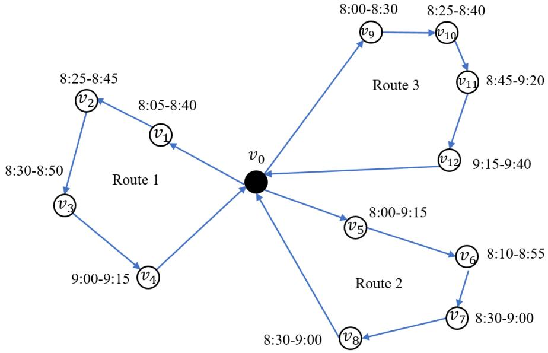

Figure 1: Illustration of VRP

Table 1 summarizes the notations adopted to define the problem. Since each vehicle is dedicated to a unique route, a total number of  $M$  routes will be generated, and they only connect to each other at the depot. All distances are represented by Euclidean distance in the plane, and the speed of all vehicles is assumed to be identical (i.e. it takes one unit of time to travel one unit of distance). Remaining capacity  $\hat{d}_{m,t}$  of  $m^{th}$  vehicle at timestep  $t$  must be greater than zero which means that no vehicles can be overloaded. The problem is to find a solution  $\mathbf{r}[\mathbf{1}, \mathbf{M}] = (\mathbf{r}[\mathbf{1}], \mathbf{r}[\mathbf{2}], \dots, \mathbf{r}[\mathbf{M}])$  with minimal total cost, which is defined as:

$$\text{Cost}(\mathbf{r}[\mathbf{1}, \mathbf{M}]) = d_{sum}(\mathbf{r}[\mathbf{1}, \mathbf{M}]) + p_{sum}(\mathbf{r}[\mathbf{1}, \mathbf{M}]), \quad (1)$$

where  $d_{sum}(\mathbf{r}[\mathbf{1}, \mathbf{M}]) = \sum_{m=1}^M \sum_{b=1}^{|\mathbf{r}[\mathbf{m}]|-1} \|\mathbf{x}_{\mathbf{r}[m][b]}, \mathbf{x}_{\mathbf{r}[m][b+1]}\|_2$  is the total travel cost of all vehicles,  $p_{sum}(\mathbf{r}[\mathbf{1}, \mathbf{M}]) = \sum_{m=1}^M \sum_{i=1}^N [I_{(e_i > \tilde{t}_i)} * \alpha_i * (e_i - \tilde{t}_i) + I_{(\tilde{t}_i > l_i)} * \beta_i * (\tilde{t}_i - l_i)]$  denotes the total penalty for time window constraints, where  $\tilde{t}_i$  represents the time when a vehicle serves customer  $i$ ; the penalty is a piecewise linear function with the arrival time, illustrated in Figure 2. Arriving earlier at any customer is considered as early arrival penalty in the MVRPSTW, which is usually much smaller than the late arrival penalty.

Table 1: Nomenclatures

| Symbols         | Definition                                                   |
|-----------------|--------------------------------------------------------------|
| $x_i$           | Coordinate of customer $i$                                   |
| $d_i$           | Demand of customer $i$                                       |
| $M$             | Vehicle number                                               |
| $r[1, m]$       | Tours of $1^{th}, \dots, m^{th}$ vehicle                     |
| $r[m][t]$       | Customer served by $m^{th}$ vehicle at timestep $t$          |
| $c[t]$          | The customers have been served at timestep $t$               |
| $\tilde{t}_i$   | Total travel time while one vehicle arriving at customer $i$ |
| $\hat{d}_{m,t}$ | Remaining capacity of $m^{th}$ vehicle at timestep $t$ .     |
| $[e_i, l_i]$    | Time window of customer $i$                                  |
| $\alpha_i$      | Early penalty coefficients for customer $i$                  |
| $\beta_i$       | Late penalty coefficients for customer $i$                   |

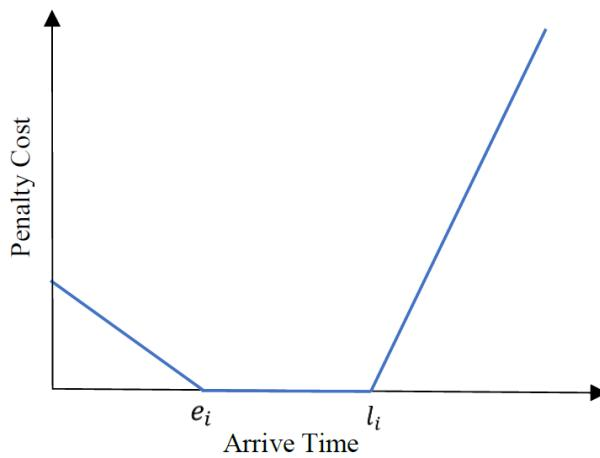

Figure 2: Penalty function for the MVRPSTW

### 3 MULTI-AGENT ATTENTION MODEL

In this subsection, we propose the novel multi-agent attention model (MAAM) which is essentially an attention-based encoder-decoder structure. Following the way of deep reinforcement learning (DRL), we regard the MVRPSTW problem as a dynamic route generation problem, which treats the solution as a sequence of decisions. The details of proposed model are presented as follows.

#### 3.1 Overview of MAAM

As shown in Figure 3, the encoder produces the embedding of the depot and all customers. Then the decoder incorporates the outputs of encoder, mask matrix for constraints and context embedding as inputs, and consequently it produces a sequence  $\mathbf{r}[\mathbf{1}, \mathbf{M}]$  of input customers, one customer for one vehicle at a timestep. When a sub-tour has been constructed, the problem at that time is to find a path from the last customer for each vehicle's sub-tour through all unvisited customers to the depot. At the time, the requests of other customers already visited are irrelevant to the decision-making. Our model defines a stochastic policy  $p(\mathbf{r}[\mathbf{1}, \mathbf{M}]|s)$  for selecting a solution  $\mathbf{r}[\mathbf{1}, \mathbf{M}]$  given a problem instance  $s$  which is defined in Section 2. It is factorized and parameterized by  $\theta$  as

$$p_\theta(\mathbf{r}[\mathbf{1}, \mathbf{M}]|s) = \prod_{t=1}^n p_\theta(\mathbf{r}[\mathcal{M}(t)][\mathbf{t}]|s, \mathbf{c}[\mathbf{t} - \mathbf{1}]) \quad (2)$$

In Eq.(2),  $\mathcal{M}(t) = t \pmod{M}$ , which means the remainder of timestep  $t$  devide to vehicle number  $M$ .  $p_\theta(\mathbf{r}[\mathcal{M}(t)][\mathbf{t}]|s, \mathbf{c}[\mathbf{t} - \mathbf{1}])$  represents the probability of choosing customer  $\mathbf{r}[\mathcal{M}(t)][\mathbf{t}]$  at timestep  $t$  for vehicle  $\mathcal{M}(t)$  given problem instance  $s$  and customers have been served at timestep  $t - 1$ .  $n$  represents the timestep while all customers have been served.  $p_\theta(\mathbf{r}[\mathbf{1}, \mathbf{M}]|s)$  represents the stochastic policy for selecting solution, and it also plays a critical role in the training method.

Rather than focusing on training a separate policy for every problem instance, we propose a structure that performs well on any problem sampled from a given distribution. This means that if we generate a new MVRPSTW instance with the same features

including number of customers as well as the distribution of locations and time windows, we can apply well-trained model to solve new problem in a short time period. The training policy can be viewed as a black-box heuristic which is able to generate a high-quality solution within reasonable time. The well-trained model produces the solution as a sequence of consecutive actions without the need to retrain for every new problem instance.

The specific components of the MAAM are demonstrated as follows.

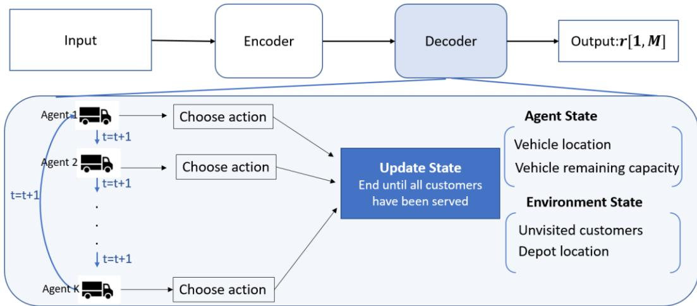

Figure 3: The Multi-Agent Attention Model

### 3.2 Encoder Framework

The encoder framework is similar with Kool et al. (2018), which stays invariant to the input order. Firstly, it computes initial customer embedding  $h_i^{(0)}$  through a learnable linear projection with parameters  $W^1$  and  $b^1$ :

$$h_i^{(0)} = W^1 \cdot [x_i, d_i, e_i, l_i] + b^1 \quad (3)$$

where  $x_i, d_i, e_i, l_i$  are defined in Section 2 and the operator  $[\cdot, \cdot]$  concatenates two tensors along the same dimensions.

The embedding is updated using multiple attention layers. Each attention layer carries out a multi-head attention and a feed-forward operation. The attention mechanism can be interpreted as a weighted message passing algorithm between customers in a graph (Vaswani et al., 2017). The weight of the message value that a

customer receives from other customers depends on the compatibility of its query with the key of the neighbor. Formally, a single attention function is given by

$$u_{i,j} = \frac{\mathbf{q}_i^T \mathbf{k}_j}{\sqrt{d_k}} \quad (4)$$

$$\mathbf{h}'_i = \text{softmax}(u_{i,j}) \mathbf{v}_j = \sum_j \frac{e^{u_{i,j}}}{\sum_{j'} e^{u_{i,j'}}} \mathbf{v}_j \quad (5)$$

where  $\mathbf{k}_i = \mathbf{W}^K \mathbf{h}_i^{(0)}$ ,  $\mathbf{v}_i = \mathbf{W}^V \mathbf{h}_i^{(0)}$  and  $\mathbf{q}_i = \mathbf{W}^Q \mathbf{h}_i^{(0)}$  are the key, value and query for each customer by projecting the embedding  $\mathbf{h}_i^{(0)}$ .  $u_{i,j}$  calculates the compatibility of the query  $\mathbf{q}_i$  of customer  $i$  with the key  $\mathbf{k}_j$  of customer  $j$  in the way of scaled dot-product.  $d_k$  is the vertical dimension of  $\mathbf{h}_i^{(0)}$ , which is used to scale dot products and avoid an overflow of numerical calculations.  $\mathbf{h}'_i$  is the output of attention function.

Furthermore, multi-head self-attention is employed for feature augmentation, which allows the model to attend to information jointly from different representation subspaces at different positions (Vaswani et al., 2017). In detail, we compute the attention value  $Z$  times with different parameters with each result represented by  $\mathbf{h}'_{iz}$  for  $z \in \{1, 2, \dots, Z\}$ . The final multi-head attention value for customer  $i$  is a function of  $\mathbf{h}_1^{(0)}, \mathbf{h}_2^{(0)}, \dots, \mathbf{h}_n^{(0)}$ :

$$\mathcal{F}_i(\mathbf{h}_1^{(0)}, \mathbf{h}_2^{(0)}, \dots, \mathbf{h}_n^{(0)}) = \sum_{z=1}^Z \mathbf{W}_z^0 \mathbf{h}'_{iz} \quad (6)$$

The remainder of attention layer is a feed-forward operation  $F$  with skip-connection:

$$\hat{\mathbf{h}}_i = \mathbf{h}_i^{(0)} + \mathcal{F}_i(\mathbf{h}_1^{(0)}, \mathbf{h}_2^{(0)}, \dots, \mathbf{h}_n^{(0)}) \quad (7)$$

$$\mathbf{h}_i^{(1)} = \hat{\mathbf{h}}_i + \varphi(\hat{\mathbf{h}}_i) \quad (8)$$

where the operation  $\varphi$  is defined as:

$$\varphi(\hat{\mathbf{h}}_i) = \mathbf{W}_1^f \text{ReLu}(\mathbf{W}_2^f \hat{\mathbf{h}}_i + \mathbf{b}_0^f) + \mathbf{b}_1^f \quad (9)$$

We compute Eq. (6)-(8)  $\lambda$  times to acquiquire  $\{\mathbf{h}_i^{(\lambda)}, i = 1, \dots, n\}$ . Finally, the encoder computes an aggregated embedding of all customers as the mean of the final output layer:

$$\bar{\mathbf{h}}^{(N)} = \frac{1}{n} \sum_{i=1}^N \mathbf{h}_i^{(\lambda)} \quad (10)$$

### **3.3 Decoder Framework**

In decoder part, we design the state, environment, action space, and reward in an explicit manner, and model each agent by deep neural networks. We regard vehicles as agents which perceive the state from the environment and each other. Then they decide a sequential action set based on the knowledge obtained through this perception. The action taken affects the environment, and consequently changes the state in which the agent is. Every agent within the DRL system has a goal state that must be achieved. The goal of the agent is to maximize such long-term reward, by learning a good policy which is a mapping from perceived states to actions (Arel et al., 2010). In order to approach the problem with reinforcement learning, the following subsections provide the principles and fundamental components of reinforcement learning for the route generation policy, including the environment and its states, action set, reward function and algorithm.

At timestep  $t$ , the decoder outputs the next customer to serve based on the embedding from the encoder and the previous outputs  $\mathbf{c}[t - 1]$ . The main objective of the agent is to select a sequence of actions up to the goal state, which maximizes the reinforcement accumulated over time. Thus, a decision policy is generated, characterized by the mapping of states and actions. The decoder process will be end until all customers have been served.

### *(1) State*

The global state can be divided into environment state and agent state. Environment state contains the final embedding of customers  $\bar{\mathbf{h}}^{(N)}$  and the already visited customers. The agent state consists of the current vehicle location and its remaining capacity. At each decoding timestep, the vehicle chooses the customers to visit in the next step. After

visiting customer  $i$ , the remaining capacity  $\hat{d}_{m,t}$  of vehicle  $m$  is updated as follows:

$$\hat{d}_{m,t} = \max(0, \hat{d}_{m,t-1} - d_i) \quad (11)$$

In order to utilize information of state, we define multiple vehicles context embedding  $\mathbf{h}_t^{(c)}$  for the decoder at timestep  $t$  which comes from the encoder and the vehicle output up to timestep  $t$ :

$$\mathbf{h}_t^{(c)} = [\bar{\mathbf{h}}^{(N)}; \mathbf{h}_{r_{t-1},1}^{(N)}; \hat{d}_{1,t}; \mathbf{h}_{r_{t-1},2}^{(N)}; \hat{d}_{2,t}; \dots; \mathbf{h}_{r_{t-1},M}^{(N)}; \hat{d}_{M,t}] \quad (12)$$

## (2) Action

Action for each vehicle represents the choice of next customer to be visited at timestep  $t$ . Firstly, we compute a new multiple vehicles context embedding  $\mathbf{h}_t^{(c)'}$  using the multi-head attention mechanism:

$$\mathbf{h}_t^{(c)'} = \text{MHA}(\mathbf{h}_t^{(c)}) \quad (13)$$

Then compute the compatibility of the query  $\mathbf{q}_{(c)}$  with all customers:

$$\mathbf{q}_{(c)} = \mathbf{W}^Q \mathbf{h}_t^{(c)'} \quad (14)$$

$$\mathbf{k}_i = \mathbf{W}^K \mathbf{h}_i^{(\lambda)} \quad (15)$$

$$u_{i,m,t} = \tanh\left(\frac{\mathbf{q}_{(c)}^T \mathbf{k}_i}{\sqrt{d_k}}\right) \quad (16)$$

Similar to [Bello et al. \(2016\)](#), the decoder observes a mask to know which customers have been visited. We mask (set  $u_{i,m,t} = -\infty$ ) customers which has been visited before timestep  $t$ , or its demand exceeds the vehicle remaining capacity.

Finally, we regard these compatibilities as unnormalized log probabilities and compute the probability of choosing customer  $i$  at timestep  $t$  for vehicle  $m$  through the softmax function:

$$p_{i,m,t} = \text{softmax}(u_{i,m,t}) = \frac{e^{u_{i,m,t}}}{\sum_j e^{u_{j,m,t}}} \quad (17)$$

According to the probability  $p_{i,m,t}$ , we use sampling decoding in training process and greedy decoding in test process to choose action. Greedy decoding means to select

the best action with maximum probability at each timestep and sampling decoding means to sample several solutions and report the best.

### (3) Reward

A reward function defines the goal of a reinforcement learning problem (Sutton and Barto, 1998). The reward function  $R(\mathbf{r}[\mathbf{1}, \mathbf{M}])$  is specified by:

$$R(\mathbf{r}[\mathbf{1}, \mathbf{M}]) = -\text{Cost}(\mathbf{r}[\mathbf{1}, \mathbf{M}]) \quad (18)$$

## 3.4 Training Method

We parameterize the stochastic policy with parameters  $\theta$ , which is the vector of all trainable variables used in encoder and decoder framework. To train the network, we use well-known policy gradient approaches. Policy gradient methods iteratively use an estimated gradient of the expected return to update the policy parameters. We optimize the parameter by the reinforce gradient estimator (Williams, 1992) with baseline  $R(\mathbf{r}^{BL}[\mathbf{1}, \mathbf{M}])$ :

$$\nabla_{\theta} L(\theta|s) = -E_{\mathbf{r} \sim p_{\theta}(\cdot|s)}[(R(\mathbf{r}[\mathbf{1}, \mathbf{M}]) - R(\mathbf{r}^{BL}[\mathbf{1}, \mathbf{M}])) \nabla_{\theta} \log p_{\theta}(\mathbf{r}[\mathbf{1}, \mathbf{M}]|s)] \quad (19)$$

In Eq.(19),  $R(\mathbf{r}[\mathbf{1}, \mathbf{M}])$  is the cost of a solution from a deterministic sample decoding of the model according to the probability distribution  $p_{i,m,t}$ , which obtains a solution through sampling.  $R(\mathbf{r}^{BL}[\mathbf{1}, \mathbf{M}])$  is the cost of a solution from a deterministic greedy decoding of baseline model. Baseline is used to estimate the difficulty of the problem instance  $s$  and eliminate variance in the training process, such that it can relate to the cost to estimate the advantage of the solution selected by the model (Mnih et al., 2015, Kool et al., 2018). We stabilize the baseline by freezing the greedy rollout policy  $p_{\theta BL}$ . Every epoch we compare the current training model with the baseline model and replace the parameters  $p_{\theta BL}$  only if the improvement is significant according to a paired t-test ( $= 5\%$ ). Furthermore, we use the Adam optimizer to train parameter by minimizing  $\nabla_{\theta} L(\theta|s)$ .

The training steps of the MAAM is illustrated in Algorithm 1.

---

**Algorithm 1**

---

---

**Input** Generated problem instances  $s = (v, d, e, l, \alpha, \beta)$ 

**Output** solution  $\mathbf{r}[\mathbf{1}, \mathbf{M}]$ 

**Procedure** MAAM training process

1: Initialize parameters  $\theta$ ,  $\theta^{BL}$ 

2: Compute customer embedding  $\mathbf{h}_t^{(\lambda)}$  and aggregated embedding  $\tilde{\mathbf{h}}^{(N)}$  by Eqs.(3)-  
(10) in Encoder layer

3: **for each** epoch **do**:

4:     **for each** batch **do**:

5:          $t = 0$ 

6:         **for each** vehicle  $\mathbf{m}$  ( $1 \leq \mathbf{m} \leq \mathbf{M}$ ) **do**:

7:             Compute multiple vehicles context embedding  $\mathbf{h}_t^{(c)}$  by Eq.(12)

8:             Compute a new context embedding  $\mathbf{h}_t^{(c)'}$  by Eq.(13)

9:             Compute the output probability vector  $p_{m,k,t}$  by Eqs. (14)-(17)

10:         Agent  $\mathbf{m}$  chooses action  $\mathbf{r}[\mathbf{m}][t]$  using sample decoding

11:         Update state

12:          $t = t + 1$ 

13:         **until** all customers have been served

14:         Compute reward  $\mathbf{R}$  for solution  $\mathbf{r}[\mathbf{1}, \mathbf{M}]$ 

15:         Compute reward  $\mathbf{R}^{BL}$  for solution  $\mathbf{r}^{BL}[\mathbf{1}, \mathbf{M}]$  using greedy decoding

16:         Compute reinforce gradient estimator with baseline  $\mathbf{R}^{BL}$  by Eq.(18)  
            and update the parameters through the Adam optimizer

17:         **If** *PairedTTest* ( $p_\theta, p_{\theta^{BL}}$ )  $< 5\%$ 

18:              $\theta^{BL} = \theta$ 

19:         **End**

20: **End Procedure**

---

### 3 CASE STUDY

#### 3.1 Experiment Setting

##### (1) Small-scale case

We assume that the customers locations, demands and time windows are randomly generated from uniform distribution. Specifically, the depot location and twenty customers are randomly generated in the square  $[0,10] \times [0,10]$ . Such simulation

settiting on Euclidean plane can be utilized on unmanned aerial vehicle delivery. Vehicle capacity is set as 60. Time window is randomly generated from  $[0,10]$ . Early and late penalty coefficients  $\alpha_i$ ,  $\beta_i$  are randomly generated from  $[0,0.2]$  and  $[0,1]$  separately. Each customer demand is randomly generated from  $[0,10]$  for two vehicles and  $[0,15]$  for three vehicles. We evaluate our model on 1000 instances. It is worth mentioning that the total demands are controlled to less than the total capacity of all vehicles to ensure feasible solution.

### *(2) Medium-scale case*

In the medium-scale case, we randomly generate 50 customers. Vehicle capacity is set as 150. Time window is randomly generated from  $[0,20]$ . Each customer demand is randomly generated from  $[0,10]$  for two vehicles,  $[0,15]$  for three vehicles,  $[0,20]$  for four vehicles and  $[0,25]$  for five vehicles. Other parameter settings are similar to small-scale instance.

### *(3) Large-scale case*

In this case we randomlyly generate 100 customers. Vehicle capacity is set as 300. Time window is randomly generated from [0,40]. Other parameter settings (including vehicle numbers and customer demand) are similar to those in medium-scale instance.

# **3.2 Benchmarks**

We directly compare the MAAM with two wo conventional heuristic methods.

# *(1) Genetic algorithm*

The genetic algorithm (GA) is a prevalent method for solving both constrained and unconstrained optimization problems, based on the natural selection process similar to biological evolution. GA repeatedly modifies a population of individual solutions. At each step, GA selects individuals at random from the current population to be parents and uses them to produce the children for the next generation. Over successive generations, the population evolves toward an optimal solution (Ombuki et al., 2006).

We adopt two s sets of parameters:  $GA^1$  with population size 100 and iteration number 300;  $GA^2$  with population size 300 and iteration number 1000. Additionally, we

set crossover rate as 0.80 and mutation rate as 0.05.

### *(2) Iterated local search algorithm*

To provide the best possible result, iterative local search algorithms (ILS) move iteratively from one possible solution to a neighbor solution and so on until the best possible set of results is achieved. The algorithm keeps picking up solutions and their neighbors until there are no more improving configurations in the neighborhood, thus sticking to a locally optimal solution. Furthermore, we make use of iterated local search to curb the tendency of falling into the locally optimal points. However, it is impossible to quickly traverse all solutions in the neighborhood in consideration of computational complexity, so we set the termination criterion as a predetermined maximum iteration number. In this sense, the algorithm presents the best possible results within a stipulated amount of iterations [\(Lourenço et al., 2003,](#page-25-10) [Ibaraki et al., 2008\)](#page-24-0).

We adopt two sets of parameters: ILS1with iteration number 100, ILS2with iteration number 500.

# *(3) Multi-Agent Attention model*

We train thow the model for 100 epochs with randomly generated data under learning rate as  $10^{-4}$ . In every epoch 1,280,000 instances for small-scale instance and 640,000 instances for medium-scale and large-scale instance are processed. The batch size is set as 512 for small-scale instance and medium-scale instance and 256 for large-scale instance. Our experiments are performed on a computing platform as follows: NVIDIA Quadro P5000 with 16 GB memory, Intel(R) Xeon(R) CPU E5-2673 v3 @2.40 GHz with 256 GB RAM. We set the dimension of initial customer embedding layer as 128, the number of layers  $A$  as 3, the number of attention heads  $Z$  as 8 in the encoder. The following parameter sensitivity analysis demonstrates the parameter setting is a good trade-off between quality of the results and computational complexity.

# **3.3 Results**

Table 2 shows the total costs of each method under three different scale testing scenarios. The following conclusions can be drawn from the results:

- i. As shown in Table 2(a), all methods achieve similar results on small-scale problem. However, GAs perform extremely worse in comparison to other algorithms with growing problem size. ILSs perform better than GAs and ILS2 is better than ILS1 because we allow more iterations for the formers.
- ii. Our proposed model achieves the best performances compared with other baselines both in solution quality and computation efficiency under all scenarios. In fact, ILS fails to locate even sub-optimal solutions on large-scale problem, whereas our model can provide high-quality solutions with only a few seconds. Unlike most classical heuristic methods, it is robust to the changes of predefined conditions, e.g., when a customer changes its demand value or relocates to a different position, it can automatically adapt the solution.
- iii. The computation time of our framework almost keeps the same with everincreasing problem size which is extremely faster than the heuristics. In contrast, the run time for heuristics methods exponentially increase with the number of customers, which is because the characteristics of the solution space from either empirical data or previous calculations are not reserved. Classical heuristic method must resolve the problem with any change of the preconditions. This observation proves the superiority of our method.

Table 2. Performance comparison for MVRPSTW

*(a) Comparison on small-scale instance*

|             | Vehicle | Cost        | Time          | Vehicle | Cost        | Time          |
|-------------|---------|-------------|---------------|---------|-------------|---------------|
|             |         | 58.7        | 5(min)        |         | 67.0        | 4(min)        |
|             |         | 56.5        | 18(min)       |         | 66.8        | 14(min)       |
|             |         | 58.8        | 3(min)        | 3       | 65.9        | 3(min)        |
|             |         | 57.3        | 12(min)       |         | 64.8        | 10(min)       |
| <b>MAAM</b> |         | <b>55.6</b> | <b>1(sec)</b> |         | <b>64.3</b> | <b>1(sec)</b> |

*(b) Comparison on medium-scale instance*

|             | Vehicle | Cosost       | Time          | Vehicle | Cost         | Time          |
|-------------|---------|--------------|---------------|---------|--------------|---------------|
|             |         | 148.4        | 23(min)       |         | 134.5        | 22(min)       |
|             |         | 115.7        | 1.5(hrs)      |         | 118.0        | 1.3(hrs)      |
|             |         | 108.0        | 14(min)       | 3       | 102.2        | 18(min)       |
|             |         | 102.4        | 1.1(hrs)      |         | 100.3        | 1(hrs)        |
| <b>MAAM</b> |         | <b>87.6</b>  | <b>2(s)</b>   |         | <b>93.5</b>  | <b>2(s)</b>   |
|             |         | 156.3        | 18(min)       |         | 157.8        | 15(min)       |
|             |         | 127.6        | 1(hrs)        |         | 129.6        | 56(min)       |
|             |         | 113.7        | 7(min)        | 5       | 121.6        | 6(min)        |
|             |         | 112.1        | 45(min)       |         | 120.3        | 41(min)       |
| <b>MAAM</b> |         | <b>101.9</b> | <b>2(sec)</b> |         | <b>112.1</b> | <b>2(sec)</b> |

*(c) Comparison on large-scale instance*

| GA ILS 1 | Vehicle | Cost 278.7 | Time 6.2(hrs) | Vehicle | Cost 267.5 | Time 5.4(hrs) |
|----------|---------|------------|---------------|---------|------------|---------------|
|          | 2       | 181.6      | 1.1(hrs)      | 3       | 161.6      | 56(min)       |
| MAAM     |         | 131.5      | 5(sec)        |         | 132.3      | 5(sec)        |
| GA       |         | 263.5      | 4.5(hrs)      |         | 281.4      | 4.1(hrs)      |
| ILS 1    |         |            |               |         |            |               |
|          | 4       | 177.8      | 35(min)       | 5       | 187.9      | 34(min)       |
| MAAM     |         | 139.4      | 4(sec)        |         | 146.5      | 4(sec)        |

In order to show the train process in detail, we visualize the reward during the training process in Figure 4. "20C-2V" represents the MVRPSTW problem with 20 customers and 2 vehicles as a simplified expression. We can find that the curve converges gradually with the increase of epoch. In addition, with the increase of the number of customers, the training loss becomes more unstable. Furthermore, the trained model can already present a fine result while training for 20 epochs, which means we can sharply reduce the training time if the requirements for solution quality are not strongly demanding.

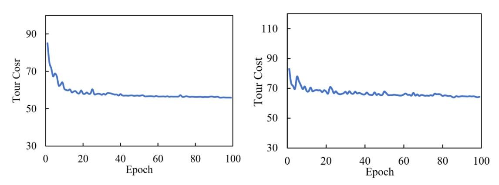

(a) Tour cost for 20C-2V and 20C-3V

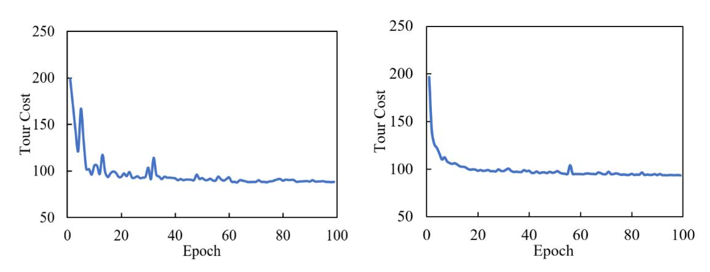

(b) Tour cost for 50C-2V and 50C-3V

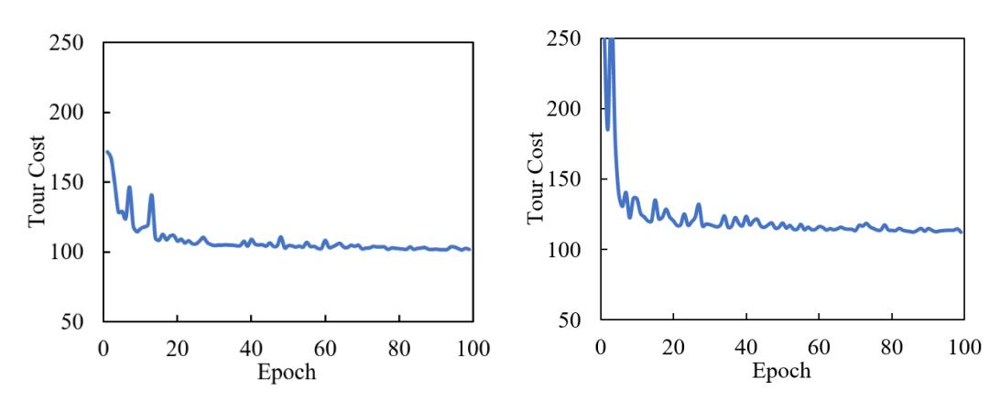

(c) Tour cost for 50C-4V and 50C-5V

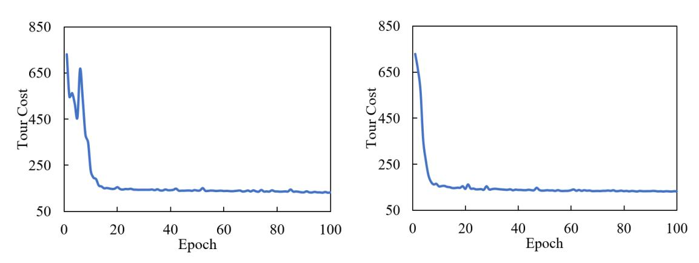

(d) Tour cost for 100C-2V and 100C-3V

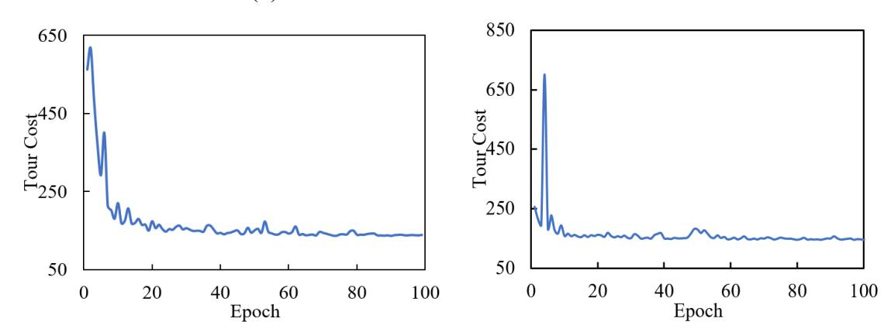

(e) Tour cost for 100C-4V and 100C-5V

Figure 4: Tour cost curves in training process

## **4.2 Method Transferability**

In real world, the number of customer requests and vehicle capacity always exhibit fluctuations over time, which requires the model to be able to deal with such stochasticity. To resolve this problem, we only need to add some virtual customers in the original stage. To be more specific, we have a well-trained model for 100 customers, but at some day there are only 98 requests, and in such case we add two virtual customers with zero demand and the same location and time window with any existing customer to satisfy the number constraints. To verify the transferability of our model, we designed two experiments in this section. In the first experiment, we use the welltrained 50C-2V model and evaluate its performance on 40C-2V, 48C-2V, 46C-2V, 44C-2V, 42C-2V, and 40C-2V cases. Furthermore, we use the well-trained 100C-2V model and evaluate its performance on the problem with different number of customers varying from 90 to 98. As shown in Table 3, our method consistently outperforms ILS1 in the term of solution quality and computation time.

Table 3. Performance of well-trained model on variable customer numbers

*(a) 50 vehicles well-trained model*

| Customer | Cost  | Time Customer | Cost  | Time    |
|----------|-------|---------------|-------|---------|
| ILS 1    |       |               |       |         |
|          | 108.0 | 14(min)       |       |         |
|          |       |               | 105.0 | 14(min) |
| MAAM     | 87.6  | 2(sec)        | 85.6  | 2(sec)  |
| ILS 1    |       |               |       |         |
|          | 99.8  | 13(min)       |       |         |
|          |       |               | 96.0  | 13(min) |
| MAAM     | 83.8  | 2(sec)        | 82.0  | 2(sec)  |
| ILS 1    |       |               |       |         |
|          | 92.0  | 12(min)       |       |         |
|          |       |               | 88.9  | 11(min) |
| MAAM     | 80.5  | 2(sec)        | 79.1  | 2(sec)  |

*(b)100 vehicle well-trained model*

| Customer | Cost  | Time Customer | Cost  | Time     |
|----------|-------|---------------|-------|----------|
| ILS 1    |       |               |       |          |
|          | 181.6 | 1.1(hrs)      |       |          |
|          |       |               | 179.9 | 1.1(hrs) |
| MAAM     | 131.5 | 5(sec)        | 129.8 | 5(sec)   |
| ILS 1    |       |               |       |          |
|          | 172.4 | 1.1(hrs)      |       |          |
|          |       |               | 168.4 | 1(hrs)   |
| MAAM     | 127.5 | 5(sec)        | 125.4 | 5(sec)   |
| ILS 1    |       |               |       |          |
|          | 163.0 | 58(min)       |       |          |
|          |       |               | 159.8 | 56(min)  |
| MAAM     | 124.1 | 4(sec)        | 122.5 | 4(sec)   |

In the second experiment, the generality of our model is tested when the capacity of vehicles is varying. The vehicle capacity is fixed in training process, as a result we need to adjust demands of customers in inverse proportion to the change of capacity, e.g., we multiply all demands by 0.5 if the vehicle capacity is doubled. We use the welltrained models for 50C-2V to generate a solution for the same problem with different vehicle capacities ranging from 120 to 180. Then we use the models trained for 100C-2V to solve the problem with different vehicle capacities ranging from 270 to 330. Table 4 shows that the well-trained method receives good results compared with iterated located search.

Overall, the comparison results in two experiments indicate that when the problems are close in terms of the number of customer and vehicle capacity, our well-trained model can still produce significantly better vehicle routes. This demonstrates that our model is robust to the variation of problem instances, e.g., when several customers cancel their demands or vehicle capacity is adjusted.

Table 4. Performance of well-trained model on variable vehicle capacity

*(a) 50 vehicles well-trained model*

|       | Capacity | Cost  | Time   | Customer | Cost  | Time    |
|-------|----------|-------|--------|----------|-------|---------|
| ILS 1 |          |       |        |          |       |         |
|       |          | 114.3 | 9(min) |          |       |         |
|       |          |       |        |          | 107.2 | 16(min) |
| MAAM  |          | 87.8  | 2(sec) |          | 87.5  | 2(sec)  |

*(b) 100 vehicle well-trained model*

|       | Capacity | Cost  | Time    | Customer | Cost  | Time     |
|-------|----------|-------|---------|----------|-------|----------|
| ILS 1 |          |       |         |          |       |          |
|       |          | 189.8 | 52(min) |          |       |          |
|       |          |       |         |          | 181.1 | 1.2(hrs) |
| MAAM  |          | 132.3 | 5(sec)  |          | 132.0 | 5(sec)   |

## **4.3 Sensitivity Analyses**

In this section, we analyze the parameter sensitivity in the proposed model, which could greatly influence the solution quality of our MAAM. Three parameters are investigated in this section: the dimension of initial customer embedding in encoder framework, the number of encoder layers, and the number of attention heads.

Firstly, we retrain network by setting the embedding dimension of customer as 64, 128, 256 and assess the corresponding performance. The reward curves are depicted in Figure 5(a). It is obvious that the model tends to converge faster with the increase of the embedding dimension. This is because some useful information will be neglected in low dimensional space, which leads to deteriorated algorithm output. The training time with dimensions of 256 and 128 are 670 seconds and 590 seconds respectively.

curves are de demonstrated in Figure 5(b). This shows that an overly shallow structure (i.e. two layers) makes it difficult to capture the information among customers, but deeper neural network does not always give a better result.

Finanally, we evaluate the influences of the multi-head attention mechanism with different numbers of the attention heads  $Z$ . The variation curves of the rewards with the attention head number are plotted in Fig 5(c). There is an obvious improvement when adding the attention head from two to four. This may be caused by the fact that the self-attention mechanism can effectively represent the probability of a relationship between the terms of customer embedding and find a new representation for each of the terms in the sequence for decision. It is worth pointing out that the profit becomes inconspicuous with more attention heads, whereas the computational time rises vastly. The comparison results demonstrate the effectiveness of applying multi-head self-attention to extract the features.

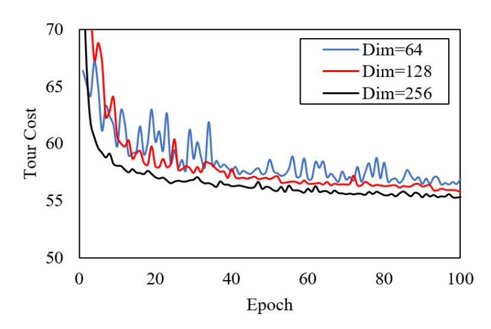

(a) Dimenession of initial customer embedding in encoder framework

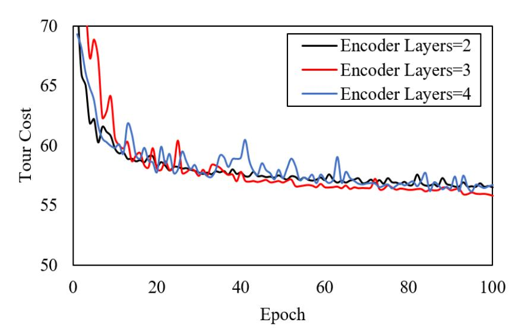

(b) Number of Encoder layers

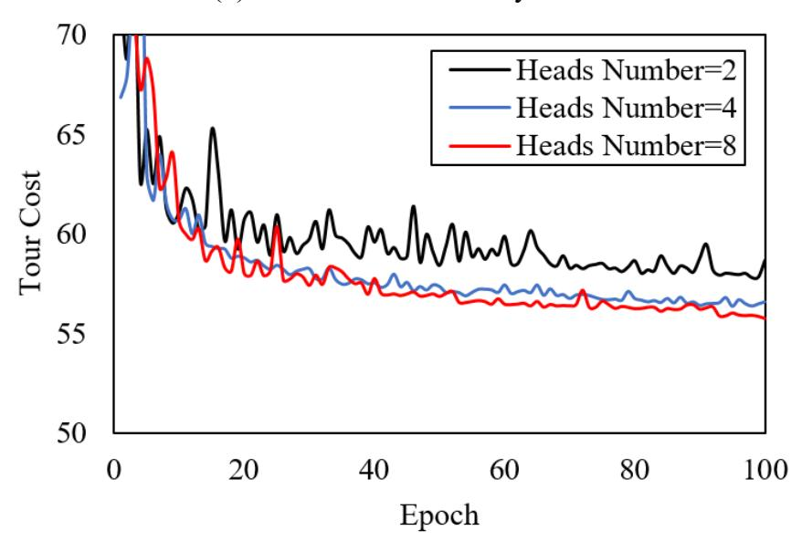

(c) Number of attention heads

Figure 5. Sensitivity analyses in MAAM parameters

### **4 CONCLUSIONS**

In this paper, we propose a novel reinforcement learning algorithm named multiagent attention model (MAAM) to solve MVRPSTW. According to the results of simulation experiments on three synthetic networks with different scale, our proposed MAAM consistently outperforms traditional methods with negligible computation time, and that suggests the successful adoption of deep reinforcement learning (DRL) for VRPs with complicated practical constraints. The fact that our approach can solve similar-sized instances without retraining for every new instance makes it easy to be implemented in practice. Moreover, unlike many time-consuming classical heuristics, our proposed method has superior performances in both solution quality and efficiency. In addition, we find our well-trained model has certain level of transferability to solve problem with fluctuations in customer number and vehicle capacity, and the transferability extends the applicability of model to handle more realistic cases.

In the future research, it will be an important topic to utilize machine-learning-based method to solve more combinatorial optimizing problems of practical importance, e.g., VRPs with multiple depots, multiple periods, heterogeneous vehicle fleet, etc. Extending the methodology to solve huge-scale problems with thousands of vehicles and customer requests is also of great interest. A more challenging task is to generalize the learning framework into online problems, i.e., to deal with the possibilities of realtime requests as well as stochastic traffic conditions.

# **ACKNOWLEDGMENTS**

?

# **REFERENCES**

Angra, Sheena, and Sachin Ahuja., 2017. Machine learning and its applications: A review. In: 2017 International Conference on Big Data Analytics and Computational Intelligence (ICBDAC). IEEE, pp. 57-60. Arel, I., Liu, C., Urbanik, T., & Kohls, A. G., 2010. Reinforcement learning-based multiagent system for network traffic signal control. IET Intelligent Transport Systems. 4(2), 128-135. Arulkumaran, K., Deisenroth, M. P., Brundage, M., & Bharath, A. A., 2017. Deep reinforcement learning: A brief survey. IEEE Signal Processing Magazine. 34(6), 26-38. Bello, I., Pham, H., Le, Q. V., Norouzi, M., & Bengio, S.,2016. Neural combinatorial optimization with reinforcement learning. Avaiable from: arXiv: 1611.09940.

Dai H, Dai B, Song L.,2016. Discriminative embeddings of latent variable models for structured data. In: International conference on machine learning, pp. 2702-2711. He, K., Zhang, X., Ren, S., & Sun, J., 2016. Identity mappings in deep residual networks. In: European conference on computer vision, pp. 630-645. Joerss, M., Schröder, J., Neuhaus, F., Klink, C., Mann, F., 2016. Parcel Delivery: The Future of Last Mile. Transport and Logistics. Khalil E, Dai H, Zhang Y, et al.,2017. Learning combinatorial optimization algorithms over graphs. In: Advances in Neural Information Processing Systems, 6348-6358. Kool, W., van Hoof, H., & Welling, M., 2018. Attention solves your TSP, approximately. Avaiable from: arXiv: 1803.08475. Kumar S N, Panneerselvam R., 2012. A survey on the vehicle routing problem and its variants. Intelligent Information Management. 4(03), 66. Lau, H. C., Sim, M., & Teo, K. M., 2003. Vehicle routing problem with time windows and a limited number of vehicles. European journal of operational research. 148(3), 559-569. Ibaraki, T., Imahori, S., Nonobe, K., Sobue, K., Uno, T., & Yagiura, M., 2008. An iterated local search algorithm for the vehicle routing problem with convex time penalty functions. Discrete Applied Mathematics. 156(11), 2050-2069. Lim A, Wang F., 2004. A smoothed dynamic tabu search embedded GRASP for m-VRPTW. In: 16th IEEE International Conference on Tools with Artificial Intelligence. IEEE, 704-708. Louis S J, Yin X, Yuan Z Y., 1999. Multiple vehicle routing with time windows using genetic algorithms. In: Proceedings of the 1999 Congress on Evolutionary Computation- CEC99. IEEE, 3, 1804-1808. Lourenço, Helena R., Olivier C. Martin, and Thomas Stützle., 2003. Iterated local search. Handbook of metaheuristics. Springer, 320-353. Mnih V, Kavukcuoglu K, Silver D, et al., 2015. Human-level control through deep reinforcement learning. Nature. 518(7540): 529. MohammadReza Nazari, Afshin Oroojlooy, Lawrence Snyder, and Martin Takac.,2018.

Reinforcement learning for solving the vehicle routing problem. In Advances in Neural Information Processing Systems, pp. 9860–9870.

Ronald JWilliams.,1992. Simple statistical gradient-following algorithms for connectionist reinforcement learning. Machine learning. 8(3-4), 229–256.

Silver, D., Lever, G., Heess, N., Degris, T., Wierstra, D., & Riedmiller, M., 2014. Deterministic Policy Gradient Algorithms. In International Conference on Machine Learning, pp. 387-395.

Taş D, Dellaert N, van Woensel T, et al.,2014. The time-dependent vehicle routing problem with soft time windows and stochastic travel times. Transport. Res. Part C: Emerg. Technol. 48, 66-83.

Toth, P., & Vigo, D. (Eds.), 2002. The vehicle routing problem. Society for Industrial and Applied Mathematics.

Ombuki, B., Ross, B. J., & Hanshar, F., 2006. Multi-objective genetic algorithms for vehicle routing problem with time windows. Applied Intelligence. 24(1), 17-30.

Oriol Vinyals, Meire Fortunato, and Navdeep Jaitly., 2015. Pointer networks. In: Advances in Neural Information Processing Systems, pp. 2692–2700.

Sergey Ioffe and Christian Szegedy. Batch normalization., 2015. Accelerating deep network training by reducing internal covariate shift. In International Conference on Machine Learning, pp. 448–456.

State Post Bureau of China (SPBC)., 2019. Chinese Statistic Bulletin of Post Business in 2018. Available from: State Post Bureau of China, Beijing, China (In Chinese). http://www.spb.gov.cn/xw/dtxx\_15079/201905/t20190510\_1828821.html.

Sutton, R.S., Barto, A.G., 1998. Reinforcement learning: an introduction. IEEE Trans. Neural Netw. 9 (5), 1054.

Vaswani, A., Shazeer, N., Parmar, N., Uszkoreit, J., Jones, L., Gomez, A. N., ... & Polosukhin, I., 2017. Attention is all you need. In: Advances in neural information processing systems, pp. 5998-6008.

Wang X, Xu C, Hu X., 2008. Genetic algorithm for vehicle routing problem with time windows and a limited number of vehicles. In: 2008 International Conference on Management Science and Engineering 15th Annual Conference Proceedings, IEEE, pp. 128-133.

Weaver L, Tao N.,2001. The optimal reward baseline for gradient-based reinforcement learning. In: Proceedings of the Seventeenth conference on Uncertainty in artificial intelligence, pp. 538-545.

Williams, R. J., 1992. Simple statistical gradient-following algorithms for connectionist reinforcement learning. Machine learning. 8(3-4), 229-256.