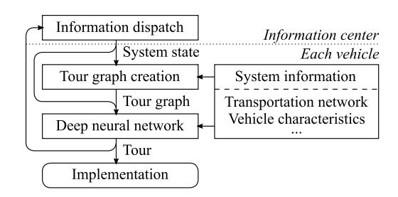
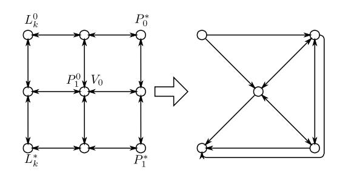
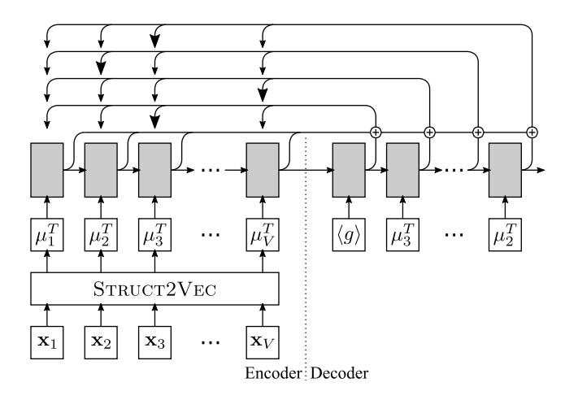
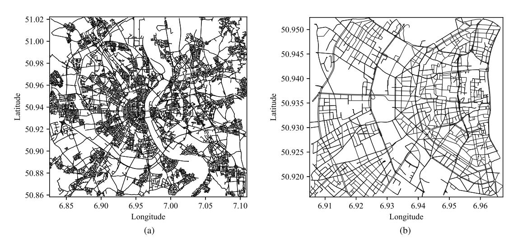
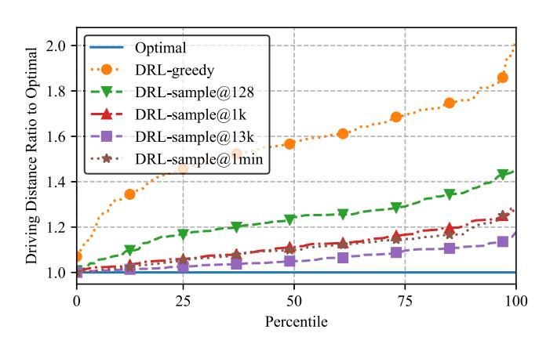
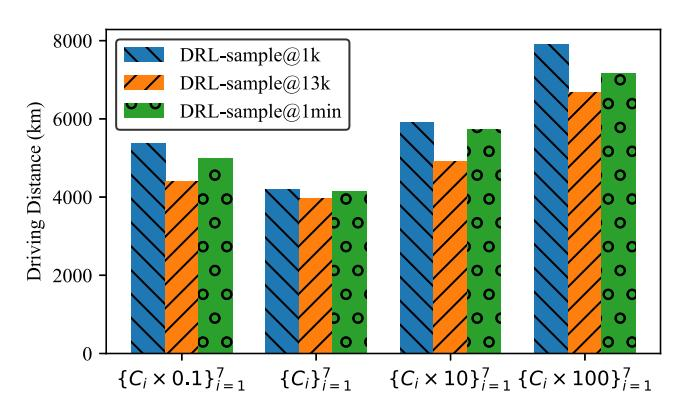
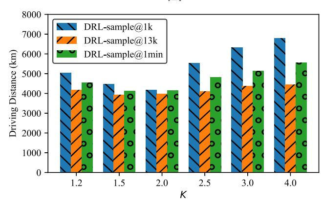

# Online Vehicle Routing With Neural Combinatorial Optimization and Deep Reinforcement Learning

James J. Q. Y[u](https://orcid.org/0000-0002-6392-6711) , *Member, IEEE*, Wen Yu , *Senior Member, IEEE*, and Jiatao Gu

*Abstract***— Online vehicle routing is an important task of the modern transportation service provider. Contributed by the ever-increasing real-time demand on the transportation system, especially small-parcel last-mile delivery requests, vehicle route generation is becoming more computationally complex than before. The existing routing algorithms are mostly based on mathematical programming, which requires huge computation time in city-size transportation networks. To develop routes with minimal time, in this paper, we propose a novel deep reinforcement learning-based neural combinatorial optimization strategy. Specifically, we transform the online routing problem to a vehicle tour generation problem, and propose a structural graph embedded pointer network to develop these tours iteratively. Furthermore, since constructing supervised training data for the neural network is impractical due to the high computation complexity, we propose a deep reinforcement learning mechanism with an unsupervised auxiliary network to train the model parameters. A multisampling scheme is also devised to further improve the system performance. Since the parameter training process is offline, the proposed strategy can achieve a superior online route generation speed. To assess the proposed strategy, we conduct comprehensive case studies with a real-world transportation network. The simulation results show that the proposed strategy can significantly outperform conventional strategies with limited computation time in both static and dynamic logistic systems. In addition, the influence of control parameters on the system performance is investigated.**

*Index Terms***— Online vehicle routing, logistic system, neural combinatorial optimization, deep reinforcement learning, intelligent transportation.**

## I. INTRODUCTION

**I** NTELLIGENT transportation system (ITS) is an essential constituting component of future sustainable smart cities [1], [2]. Contributed by the advanced sensing, computation, and communications techniques, ITS is expected to be a feasible solution to accommodate the ever-increasing volume of transportation demand with environmentally friendly approaches [3]. Electric vehicles (EVs), a kind of vehicles powered by electric engines instead of fossil fuel-driven combustion engines, are among the most influential components that can effectively reduce the carbon footprint of

Manuscript received June 13, 2018; revised January 8, 2019; accepted March 31, 2019. Date of publication April 17, 2019; date of current version October 2, 2019. The Associate Editor for this paper was E. Kaisar. *(Corresponding author: James J. Q. Yu.)* J. J. Q. Yu is with the Department of Computer Science and Engineering, Southern University of Science and Technology, Shenzhen 518055, China (e-mail: yujq3@sustech.edu.cn).

W. Yu is with the Department of Automatic Control, National Polytechnic Institute (CINVESTAV-IPN), Mexico City 07360, Mexico.

J. Gu is with the Department of Electrical and Electronic Engineering, The University of Hong Kong, Hong Kong.

Digital Object Identifier 10.1109/TITS.2019.2909109

the transportation sector [4]. Recent academic research and industrial investigations suggest that EVs will revolutionize the automobile industry in the next decade [3], [5].

At the same time, small-parcel last mile delivery by ground transportation is becoming a more significant burden to modern transportation systems in recent years due to the proliferation of e-commerce demands [6]. It is expected that the parcel delivery market will be growing annually at between 7% to 10% in mature markets, and at more than 300% in developing markets with huge demographic dividend, e.g., China and India [6]. The growth of this market is also accompanied by the customer desire for fast home delivery at low prices. This introduces challenges to ITS for entertaining the massive requests on faster traffic, and to the logistics industry for developing cost-efficient parcel delivery solutions [6].

The size, growth, and cost-awareness are providing ample grounds for future developments of small-parcel last mile delivery considering ITS techniques. Research effort has been devoted in devising new logistic systems and strategies to embrace the new challenges, e.g., [7], [8]. For instance, an autonomous vehicle logistic system (AVLS) was recently proposed to employ electric-driven autonomous vehicles (AVs) as logistic carriers [9]. As a green logistic system, AVLS greatly benefits from the unmanned and "green" nature of battery-driven AVs, as well as renewable generations to reduce the cost while being eco-friendly. Additionally, the system also brings other merits to the greater smart cities context, e.g., mitigating renewable fluctuations [9].

However, there exists a significant research gap in the last mile delivery investigations. While existing research can accommodate a large volume of logistic requests, the system response time is typically disappointing in city-size transportation systems. As a result, it is hard to achieve fast home delivery for future smart cities, and the system cannot adapt to online changes and updates in a timely manner. This issue is mainly contributed by the excessive computational complexity in calculating (sub-)optimal routes for logistic carriers (e.g., [9]–[11]), which are customarily developed by vehicle routing problems (VRPs) and their variants. A recent survey on city VRP, i.e., [8], shows that a majority of the current vehicle routing research formulates the problem as a mixed integer program (MIP), which is NP-hard [8]. While current commercial optimization solvers can effectively solve such problems, the investigated instance sizes are typically small. Otherwise, the computation time may increase exponentially. Furthermore, other problem formulation techniques summarized in [8], e.g., statistics, stochastic modeling, and dynamic programming, incur similar or even larger computational complexity than MIP, rendering significant route generating and system response time. This is a problem related to not only small-parcel last mile delivery with EVs, but also all time-sensitive VRP applications, e.g., [12], [13]. A new online strategy that can route vehicles with minimal computation time is required by smart cities to fully enjoy the benefits of modern ITS.

The prospects of a fast route generation algorithm make artificial intelligence technique, especially machine learning a compelling solution. There are some results published in the literature. For instance, [14] proposed a neural networkbased intelligent system to predict energy consumption and travel time for route construction. Reference [15] performed a thorough parametric study of using four heuristic and meta-heuristic algorithms to solve vehicle routing problems with time windows. Reference [16] also presented a metalearning approach to help select appropriate meta-heuristics for solving this problem. All these work makes use of the generalization capability of artificial intelligence to develop vehicle routes with satisfactory performance. Nonetheless, the proposed methods still suffer from the computational complexity issue brought by city-size large transportation networks.

In this work, we propose an online routing strategy based on recent advances in deep learning techniques. We take the system model of AVLS as an example and construct a deep neural network model to iteratively develop routes for vehicles in the system. Furthermore, since constructing the model training cases with optimization-based approaches is impractical due to the significant computation time, we propose a deep reinforcement learning (DRL) strategy to determine the model parameters. The proposed strategy is especially appealing to time-sensitive vehicle routing applications, since the route generation (inference) process is extremely fast. While the parameter training process is time consuming, it can be conducted offline. Additionally, rather than training separate models for every problem instance as similarly did in optimization-based strategies, this methodology can perform well on any problem given that they follow similar transportation network characteristics. Hence, trained models can address dynamic systems, rendering conventional repetitive problem-solving process obsolete.

The main contribution is summarized as follows:

- We propose a distributed neural optimization strategy to generate online vehicular routes in green logistic systems with minimal computation time. The strategy makes use of a heuristic and deep neural networks to achieve this objective.
- We devise a deep reinforcement learning algorithm to determine the neural network model parameters without knowledge of optimal solutions to the training data. A multisampling tour construction algorithm is also proposed to further improve the system performance.
- We validate the performance of the proposed strategy with extensive case studies. We also investigate the sensitivity of control parameters in the system.

TABLE I DEFINED SYMBOLS IN GREEN LOGISTIC SYSTEM ONLINE ROUTING

| Symbol                     | Definition                                                                  |
|----------------------------|-----------------------------------------------------------------------------|
| $\mathbb{T}, \Delta T$     | Discrete time view and time slot length.                                    |
| $G$                        | The transportation network graph.                                           |
| $\mathcal{V}$              | Set of nodes (PoIs) in the transportation system.                           |
| $\mathcal{E}$              | Set of geographical vehicular roads connecting these PoIs.                  |
| $D_{ij}, T_{ij}$           | Estimated travel distance (km) and time (h) of $(i, j) \in \mathcal{E}$ .   |
| $\mathcal{K}$              | Set of vehicles in the system.                                              |
| $L_k^0, L_k^*$             | Initial and stopping locations of vehicle $k$ .                             |
| $\overline{E}_k, E_k^0$    | Battery size and initial energy of $k$ in kWh.                              |
| $R_k, \eta_k$              | Charging rate (kW) and efficiency (%) of $k$ .                              |
| $E_{k,ij}$                 | Consumed energy of $k$ to drive on $(i, j) \in \mathcal{E}_k$ in kWh.       |
| $\mathcal{C}_k$            | Logistic capacity of $k$ in per units.                                      |
| $\mathcal{Q}_k$            | Set of logistic requests that $k$ is currently serving.                     |
| $\mathcal{Q}$              | Set of logistic requests to be served by any vehicle.                       |
| $P_q^0, P_q^*$             | Pickup and delivery location of any request $q$ in the system.              |
| $\mathcal{C}_q$            | Logistic capacity required on vehicles to serve $q$ in per units.           |
| $T_q$                      | Delivery deadline for $q$ .                                                 |
| $\mathcal{G}, \mathcal{D}$ | Sets of renewable generations and depots.                                   |
| $V_g, V_d$                 | Location of $g \in \mathcal{G}$ and $d \in \mathcal{D}$ .                   |
| $\Omega_g, \Omega$         | Maximum charging energy of $g$ in time slot $t$ in kWh.                     |
| $x_g^k$                    | Binary indicator on whether $g$ will be delivered by $k$ .                  |
| $y_g^{ij}$                 | Binary indicator on whether $k$ will drive along $(i, j) \in \mathcal{E}$ . |

- The proposed strategy is not limited to green logistic systems. The design principle can be employed to solve VRP and other constrained combinatorial optimization problems.

The rest of this paper is organized as follows. We first give the system models of green logistic systems components in Section II, and discuss the formulation and requirements of the online routing problem. Section III presents the proposed distributed neural optimization strategy. We elaborate on the proposed DRL algorithm in Section IV. In Section V, the system performance is evaluated by comprehensive case studies. Finally, this paper is concluded in Section VI.

## II. GREEN LOGISTIC SYSTEM AND ONLINE ROUTING

In this section, the mathematical models for green logistic systems are firstly presented. Then we discuss the formulation and concerns on the online vehicle routing problem.

# *A. System Models*

In this work, we formulate green logistic systems based on the previous work [9]. There are generally five basic components that are essential for routing vehicles in green logistic systems, namely, transportation network, vehicles, logistic requests (requests for short in the sequel), renewable generations, and depots. Table I summarizes the symbols adopted to define their models.

1) *Transportation Network*: We consider a discrete time view  $\mathbb{T}$ , which divide the time horizon into slots of length  $\Delta T$  [9]. We first define the transportation network as a directed graph  $G(\mathcal{V}, \mathcal{E})$ . Each vertex  $i \in \mathcal{V}$  in the graph denotes a point-of-interest (PoI), which is comprised of road intersections, vehicle and charging facility (renewable generations and depots) locations, and request pickup/delivery locations. Each edge  $(i, j) \in \mathcal{E}$  represents the geographical vehicular roads connecting these PoIs, and is associated with a length  $D_{ij}$  and an estimated travel time  $T_{ij}$ . Given a transportation

network, the corresponding graph G can be constructed in a two-step process. First, all PoIs in the network are extracted, and corresponding nodes are created in the graph. Then each road is included in the network by creating an edge from its starting node to its ending one.

2) *Autonomous Vehicles*: We use  $\mathcal{K}$  to denote all vehicles in the system, each of which has independent properties, e.g., battery capacity and charged energy. At planning time, each vehicle  $k \in \mathcal{K}$  starts from location  $L_k^0 \in \mathcal{V}$  to serve requests, and it will stop at  $L_k^* \in \mathcal{V}$  after all services. Each vehicle1 is equipped with a battery of size  $\overline{E}_k$ , which has  $E_k^0$  initial energy at the planning time. Vehicles use energy to drive on roads in the transportation network, and we use  $E_{k,ij}$  to denote the consumed energy for  $k$  to drive on road  $(i, j)$ . They can get charged at either renewable generations or depots at the rate  $R_k$ , and the charging efficiency is denoted by  $\eta_k$ . Finally,  $k$  has a logistic capacity represented by  $\overline{C}_k$ , and it initially has a set of on-board requests  $\mathcal{Q}_k$  to be delivered.

*3) Logistic Requests:* The requests can be parameterized by the following attributes. We use  $\mathcal{Q}$  to denote the current requests in the system that have not been picked up by any vehicles. For each request  $q \in \mathcal{Q} \cup \bigcup_{k \in \mathcal{K}} \mathcal{Q}_k$  in the system, we use  $P_q^0$  and  $P_q^*$  to denote its pickup and delivery locations, respectively. The request requires capacity  $C_q$  in order to be loadaded on an arbitrary vehicle, and it needs to be delivered before time  $T_q$ .

4) *Renewable Generation and Depots:* In green logistic systems, vehicles can get charged at depots  $d \in \mathcal{D}$  and renewable generations  $g \in \mathcal{G}$ , each of which is located at  $V_d$  (depot) or  $V_g$  (renewable generation). Vehicles can freely charge energy from depots, which directly draw power from the grid. Additionally, we follow the configurations in [9], [17] and consider that each  $g$  can provide at most  $\Omega_{g,t}$  energy to charge vehicles in time slot  $t$ . All other models of the system is identical to [9]. While renewable generations have limited charging capacity, returning to the few depots can be inefficient for vehicles. How to optimally route vehicles to serve requests with constraints while maintaining sufficient energy in batteries is a key problem in green logistic systems and other EV-driven logistic systems [9].

# *B. Online Routing in Green Logistic Systems*

We focus s on developing an online routing strategy for green logistic systems, which guides the vehicles to traverse the transportation network, pickup and deliver requests as possible, and get charged as deemed necessary. By intuition, this can be achieved by formulating an optimization problem regardless of the computation time. Whenever the system changes (e.g., new request submitted, renewable generation and traffic condition updated), the optimization is solved to develop the new vehicular routes. Let  $x_q^k$  be a binary indicator on whether request  $q \in \mathcal{Q}$  is delivered by vehicle  $k$ , and  $y_{ij}^k$  be a binary indicator on whether  $k$  will drive along road  $(i, j)$ . The objective of green logistic systems routing

can be formulated as

$$\text{maxintende } C \sum_{k \in \mathcal{K}} \sum_{q \in \mathcal{Q}} x_q^k - \sum_{k \in \mathcal{K}} \sum_{(i,j) \in \mathcal{E}} D_{ij} y_{ij}^k, \quad (1)$$

where *C* is a large constant value. This objective function tries to maximize the number of delivered logistic requests while minimizing the total driving distance of all vehicles.2 To develop feasible routing plans for all vehicles, system constraints must be respected. In particular, they can be classified in the following categories, and the respective mathematical formulations were discussed in [9], [18]:

- The developed routes must be connected.
- The on-board requests must be delivered.
- The request delivery time must be earlier than the respective deadline.
- The logistic capacity on each vehicle cannot exceeds its limit during the whole trip.
- The on-board battery cannot be depleted or over-charged during the whole trip.
- The renewable energy charging limit must be respected.

To develop closed-form expressions for these constraints, additional binary and continuous variables are required in the formulation [9], [18].

Nonetheless, the problem is NP-hard [8]. It cannot be efficiently solved on problem instances of practical sizes, e.g., hundreds of vehicles in a large transportation network with tens of thousands of PoIs as demonstrated in [9]. Therefore, such a problem formulation can only develop offline routing plans given static system properties, which is a strong assumption that greatly undermines the practicality of green logistic systems [9]. By "online", the routing strategy should be able to cope with dynamic systems in which existing requests can be canceled, new requests can be submitted, renewable generation outputs can be updated, etc. It needs to respond to these changes immediately, or at least with insignificant delay.

Over the last few years, new methods have been devised to address combinatorial optimization problems with recent advances in deep learning techniques, which are generally called *neural combinatorial optimization* [19]. By tailoring the parameters in deep neural networks, this approach can effectively migrate the computational burden from the online mathematical programming-based solution development phase to a new offline model training phase. Consequently, the decisionmaking process can be drastically accelerated, in which the quality of solutions are highly dependent on the neural network architecture and model training method [20], [21]. In this work, we adopt the recent progress on neural combinatorial optimization and develop a neural optimization-based online routing strategy for green logistic systems.

# III. DISTRIBUTED NEURAL OPTIMIZATION STRATEGY

In this section, we first propose a distributed neural optimization strategy to solve the online routing problem. Then we elaborate on the formulation of each component in the strategy.

1In this work, we consider all vehicles in green logistic systems are batterydriven. Other vehicles can also be easily adopted in this work by changing the energy-related definitions to their fuel-based counterparts.

2There are two other routing objectives in [9]. Both of them can be adopted in this work with minor modifications.

Fig. 1. Flow chart of distributed neural optimization strategy for online routing in green logistic systems.

#### *A. Proposed Strategy*

In the online routing problem, given the transportation network  $G$ , we are concerned with finding a sequence of locations  $\pi$ , termed a *tour*, for each vehicles subject to constraints. These tours are designed such that all request pickup/delivery locations are visited once with the minimum driving distance. When deem necessary, some of the charging facilities can also be visited, which, together with request pickup/delivery locations, are termed as *stops*. In each pair of connected stops in a tour, each vehicle drives along an optimal route considering the driving distance and energy consumption constraints.

In the proposed neural optimization strategy, we adopt an information center solely for information dispatch. At the beginning of each time slot, the information center informs each vehicle of the current dynamic system state, symbolized by  $\mathcal{S}$ , including the available requests, renewable generation outputs, the next stop of other vehicles in the system, and their battery charging demands if available. Then the vehicle constructs a new tour graph using the system state, and the graph is input into a deep neural network to develop its own future tour. Finally, the vehicle reports its tour to the control center, and drives towards the next stop in the tour along the tour graph in this time slot. This process is depicted in Fig. 1.

## *B. Tour Graph Creation*

After receiving the dynamic system state, each vehicle will first create a tour graph for the subsequent deep neural network. While it is possible to input all nodes in a transportation network into the deep learning model, the solution quality deteriorates when the number of nodes exceeds 100 according to [19], [22], which correspond to a very small transportation network. In the meantime, vehicles in the system are actually more concerned with whether they will pickup/deliver a request or stop to charge as their next objectives. Given determined objectives, it is relatively trivial to develop detailed routes. Base on the above idea, we propose a method to reduce the transportation network to a much smaller tour graph for each vehicle.

We firefer summarize the possible stops for a vehicle  $k$ . According to the models in Section II-A, the vehicle is interested in stopping at any of the following locations as the next stop, which are categorized into five groups:

- Delivery locations of on-board requests:  $\{P_q^* | q \in \mathcal{Q}_k\}$ .
  Pickup locations of other requests:  $\{P_q^0 | q \in \mathcal{Q}\}$
- 2) Pickup lp locations of other requests:  $\{P_q^0 | q \in \mathcal{Q}\}$ .

Fig. 2. 2. An example of tour graph creation.

- 3) Delivery locations of other requests:  $\{P_q^* | q \in \mathcal{Q}\}$ .
  4) All charging facilities:  $\{V_d | d \in \mathcal{D}\} \cup \{V_s | s \in \mathcal{G}\}$
- 4) All charging facilities:  $\{V_d | d \in \mathcal{D}\} \cup \{V_g | g \in \mathcal{G}\}$ .
  5) Destination of  $k$ :  $L^*$
- 5) Destination of  $k$ :  $L_k^*$ .

All other nodes in  $\mathcal{V}$  only serve as connecting points at which  $k$  has no explicit intention to stop. Therefore, we can enumerate all possible tours among these stops and construct the tour graph for  $k$  as  $G_k^S(\mathcal{V}_k^S, \mathcal{E}_k^S)$ . In this graph, the nodes include previously summarized stops3 and the current vehicle location  $L_k^0$ . Then the edges can be heuristically created as follows:

- Connect  $L_k^0$  to locations in Groups 1, 2, and 4.
- Connect all locations in Groups 1–4 with each other.
- Con Connect all locations in Groups 1, 3, and 4 to  $L_k^*$ .

Fig. 2 gives an example of how to create a tour graph given a transportation network model. Finally, the shortest route of each edge  $(i, j) \in \mathcal{E}_k^S$  with respect to the transportation network  $G$  is calculated using existing path-finding algorithms, e.g.,  $A^*$  search algorithm. The driving distance, energy consumption, and estimated travel time of the route are recorded as three weight attributes of the edge, denoted by  $w_{ij}^k$ ,  $u_{ij}^k$ , and  $t_{ij}^k$ , respectively.

# *C. Deep Neural Network Architecture*

Then main objective of the deep neural network is to take the system state and vehicle tour graph as inputs to develop a tour, which has a minimal total travel distance. Inspired by [19], we design a pointer network (PTRNET) [22] with structural graph embedding (STRUCT2VEC) [23] to progressively develop a complete tour for each vehicle.

Fig. 3 presents the architecture of the proposed deep neural network. This network comprises two sub-networks, namely an encoder and a decoder. The encoder network first takes the system information, system state, and the previously developed graph as inputs to embed the system into feature embeddings for each node in  $\mathcal{V}_k^S$  using STRUCT2VEC. More specifically, STRUCT2VEC extracts the features of nodes recursively according to the corresponding graph structure. Given a graph  $G_k^S$ , STRUCT2VEC first initializes a  $p$ -dimensional feature embedding  $\mu_i^0 = \mathbf{0}$  for each  $i \in \mathcal{V}_k^S$ . Then all embeddings are updated synchronously and iteratively by

$$\mu_i^{r+1} \leftarrow f(\mathbf{x}_i, \{\mu_j^r\}_{j \in \mathcal{N}(i)}, \{w_{ij}^k\}_{j \in \mathcal{N}(i)}, \{u_{ij}^k\}_{j \in \mathcal{N}(i)},$$

$$\{t_{ij}^k\}_{j \in \mathcal{N}(i); \Theta}, \quad (2)$$

3In implementation, charging facility nodes are duplicated in the graph as  $\{V'_d | d \in \mathcal{D}\} \cup \{V'_g | g \in \mathcal{G}\}$ , which represent that vehicles park at the location without charging. This does not influence the strategy design.

Fig. 3. Proposed PTRNET and STRUCT2VEC-based deep neural network for vehicular tour generation.  $V = |\mathcal{V}_k^S|$ . A bigger arrow suggests that the pointing node has the highest probability of being selected according to the softmax operator in (5b).

where  $r$  is then number of iterations,  $\mathbf{x}_i$  is a  $q$ -dimensional node features of  $i$ ,  $\mathcal{N}(i)$  is the neighbors of  $i$  in  $G_k^S$ , and  $f(\cdot, \Theta)$  is a generic nonlinear mapping parameterized by  $\Theta$ . This embedding update rule implies that the feature embeddings are calculated based on the graph topology. The node features  $\mathbf{x}_i$  can be propagated to the other neighbor nodes by  $f(\cdot, \Theta)$ . In this work, this nonlinear propagation function is defined as

$$\begin{aligned} \mu_i^{r+1} &\leftarrow \text{ReLU}(\theta_1 \sum_{j \in \mathcal{N}(i)} \mu_j^r + \theta_2 \sum_{j \in \mathcal{N}(i)} \text{ReLU}(\theta_3 w_{ij}^k) \\ &\quad + \theta_4 \sum_{j \in \mathcal{N}(i)} \text{ReLU}(\theta_5 w_{ij}^k) \\ &\quad + \theta_6 \sum_{j \in \mathcal{N}(i)} \text{ReLU}(\theta_7 t_{ij}^k) + \theta_8 \mathbf{x}_i), \end{aligned} \quad (3)$$

where  $\theta_1, \theta_2, \theta_4, \theta_6 \in \mathbb{R}^{p \times p}$ ,  $\theta_3, \theta_5, \theta_7 \in \mathbb{R}^p$ , and  $\theta_8 \in \mathbb{R}^{p \times 4}$  are the model parameters (previously summarized as  $\Theta$ ), and  $\text{ReLU}(z) = \max\{0, z\}$  is the element-wise rectified linear unit.

The embembedding for each node in  $\mathcal{V}_k^\mathcal{S}$  is computed by (3) for  $R$  iterations, where  $R$  is typically a small value, e.g.,  $R = 4$  [24]. Then the node embeddings are input into a PTRNET recurrent neural network [20], [22], which consists of long short-term memory (LSTM) cells [25] that take the input data to develop a series of  $p$ -dimensional latent memory states  $\{C_i^{\text{enc}} \in \mathbb{R}^p\}_{i=1}^{|\mathcal{V}_k^\mathcal{S}|}$  as follows:

$$F_i = \sigma(W_f \cdot [h_{i-1}, \mu_i^R] + b_f), \quad (4a)$$

$$I_i = \sigma(W_i \cdot [h_{i-1}, \mu_i^R] + b_i), \quad (4b)$$

$$\tilde{C}_i} = \tanh(W_C \cdot [h_{i-1}, \mu_i^R] + b_C), \quad (4c)$$

$$C_i^{\text{enc}} = F_i * C_{i-1}^{\text{enc}} + I_i * \tilde{C}_i, \quad (4\text{d})$$

$$O_i = \sigma(W_o \cdot [h_{i-1}, \mu_i^R] + b_o), \quad (4e)$$

$$h_i = o_i * \tanh(C_i^{\text{enc}}), \quad (4\text{f})$$

where  $\sigma(z) = 1/(1 + e^{-z})$  is the sigmoid function,  $*$  is element-wise multiplication,  $W_f, W_i, W_C, W_o$  are the model weight parameters, and  $b_f, b_i, b_C, b_o$  are the model bias parameters. The embedding of  $L_k^0$  is input into the network

first, then those of other stops are input by a random order. Given all node embeddings, the encoder produces an encode of the graph structure and node features as  $C_{\mathcal{D}_k^{\text{enc}}}^{\text{enc}}$ , which is input into the decoder as the initial cell memory state.

Subsequently, we also adopt LSTMs cells to construct the recurrent neural network model of the decoder in PTRNET, which decodes the encoder output to the stops in tours. The decoder, similar to encoder, also maintains its latent memory states  $\{C_i^{\text{dec}} \in \mathbb{R}^p\}_{i=1}^{|\mathcal{V}_k^S|}$  calculated by (4) with  $C_i^{\text{enc}}$  replaced by  $C_i^{\text{dec}}$ . The input of the first step in the decoder ( $\langle g \rangle$  in Fig. 3) is a  $p$ -dimensional vector treated as a trainable parameter of the whole neural network. Then the decoder iteratively constructs a complete tour. In the  $i$ -th step, the decoder makes use of the encoder memory states  $\{C_j^{\text{enc}}\}_{j=1}^{|\mathcal{V}_k^S|}$ , its own current decoder state  $C_i^{\text{dec}}$ , and the already constructed partial tour  $\pi(\langle i \rangle)$  to produce a distribution over the next node to stop by in the tour. This process mimics the attention mechanism in sequence-to-sequence learning [26], which can be formally expressed as follows using defined symbols:

$$a_j = \begin{cases} v^\top \cdot \tanh(W^{\text{enc}} C_j^{\text{enc}} + W^{\text{dec}} C_i^{\text{dec}}) \\ \text{if vehicle } k \text{ can reach } j \text{ given } \pi(< i) \\ -\infty \text{ otherwise,} \end{cases} \quad \forall j = 1, 2, \dots, |\mathcal{V}_k^\mathcal{S}|, \quad (5a)$$

$$A(\{C_j^{\text{enc}}\}_{j=1}^{|\mathcal{V}_k^\mathcal{S}|}, C^{\text{dec}}; W^{\text{enc}}, W^{\text{dec}}, v) \triangleq \text{softmax}(a), \quad (5b)$$

where  $v \in \mathbb{R}^P$  is an attention vector, and  $W^{\text{enc}}, W^{\text{dec}} \in \mathbb{R}^{P \times P}$  are attention matrices.  $A(\cdot \cdot \cdot)$  is the attention function, and  $\text{softmax}(\cdot)$  is the softmax function, also known as normalized exponential function. In Fig. 3, the node with the highest softmax probability is pointed by a bigger arrow. Consequently, our PTRNET assigns the probability of visiting the next stop  $\pi(i)$  as

$$p(\pi(i)|\pi(< i), \mathcal{S}) \triangleq A(\{C_j^{\text{enc}}\}_{j=1}^{|\mathcal{V}_k^{\mathcal{S}}|}, C^{\text{dec}}). \quad (6)$$

This p probability distribution stands for the degree to which stop the decoder is pointing upon seeing a partial tour  $\pi(< i)$  given system state  $\mathcal{S}$ . When determining the next stop  $\pi(i)$  based on  $\pi(< i)$ , all available stops are randomly selected based on the probability distribution  $p(\pi(i)|\pi(< i), \mathcal{S})$ . Consequently, the probability of a tour can be obtained using the chain rule:

$$p(\pi | \mathcal{S}) = \prod_{i=1}^{|\mathcal{V}_k^S|} p(\pi(i) | \pi(< i), \mathcal{S}), \quad (7)$$

whose right-hand-side components are represented with individual softmax modules to construct a complete tour [19].

In this PTRNET, constructing appropriate node feature vectors  $\mathbf{x}_i$  is critical to the system performance. These vectors should include all necessary information of the vehicles, logistic requests, and charging facilities. In this work, we construct the vectors according to the type of nodes as classified in Section III-B. Particularly, the current location of vehicle  $k$ , i.e.,  $L_k^0$ , is encoded as  $\langle \bar{E}_k, E_k^0, \bar{C}_k, \sum_{k \in \mathcal{Q}_k} C_q \rangle$ .

Then delivery location for  $q \in \mathcal{Q} \cup \mathcal{Q}_k$  is encoded as  $\langle T_q, -C_q \rangle$ . The pickup location for request  $q \in \mathcal{Q}$  is encoded as  $\langle T_q - T_{ij}, C_q, \mathcal{D}^{\mathcal{K}}, T_{ij}, D_{ij}, E_{k,ij}, H_q \rangle$ , where  $i = P_q^0$ ,  $j = P_q^*$ ,  $T_{ij}, D_{ij}, E_{k,ij}$  are the travel time, distance, and energy consumption for  $k$  to drive from  $P_q^0$  to  $P_q^*$  on  $G^4$ , respectively, and  $H_q \in \mathbb{B}$  indicates whether  $q$  will be picked up by other vehicles at their next stop. Finally, the charging facilities  $c \in \mathcal{G} \cup \mathcal{D}$  are encoded as  $\langle \eta \tilde{\Omega}_{V_c}, \eta R_k \rangle$ , where  $\tilde{\Omega}_{V_c}$  is the available charging energy if  $k$  drives to  $V_c$  immediately. As to  $L_k^*$ , no special node features are assigned, rendering  $\mathbf{x}_{L_k^*} = \emptyset$ .

In this design,  $\mathbf{x}_i$  for different nodes are of various lengths. Hence, the model parameter  $\theta_8$  in (3) is extended to four variants, i.e.,  $\theta_8^0 \in \mathbb{R}^{p \times 4}$ ,  $\theta_8^{\text{del}} \in \mathbb{R}^{p \times 2}$ ,  $\theta_8^{\text{pck}} \in \mathbb{R}^{p \times 7}$ , and  $\theta_8^{\text{chg}} \in \mathbb{R}^{p \times 2}$ . Their inner products with the node features of  $L_k^0$ , delivery locations, pickup locations, and charging facilities defined above are regarded as the last element of (3), respectively. Consequently, given the current system state and trained model parameters, the proposed deep neural network can develop a tour  $\pi$  comprised of next stops on the transportation network.

On One more thing to note is that the design of PTRNET is actually topology-agnostic thanks to the recurrent link in LSTM and STRUCT2VEC embedding [19], [22]. This means that we can actually train the model parameters with relatively small-scaled data for faster training, and the system can be used to address large problem instances with similar graph characteristics. This idea partially incentivizes the incorporation of DRL into parameter training, which will be elaborated on next.

# IV. DEEP REINFORCEMENT LEARNING

In Section III we propopose a deep neural network which takes the transportation network node features as inputs and generates a complete tour  $\pi$  of these nodes with well-trained model parameters. The neural system aims to solve the computational burden issue in large online vehicle routing problems. Typically, the network parameters in such systems can be well trained using a supervised loss function evaluating the cross entropy between the network's output probabilities and the optimal solution to the original problem [22]. However, this training approach is undesirable for neural combinatorial optimizations [19]. In such training process, a great number of training cases constituted by both the system data (network, vehicles, requests, etc.) and the corresponding optimal solution is required. Nonetheless, the optimal solutions cannot be easily obtained without extensive computation. Additionally, as the vehicle routing problem is NP-hard, using exact solvers to construct a training data set at a considerable size requires huge computation time, rendering the approach impractical. Alternatively, DRL can be employed as the training paradigm of the proposed deep neural network model. Unlike supervised learning, DRL does not heavily rely on the optimal solutions, but instead uses a reward mechanism to incentivize the algorithm to achieve better solutions. Since we can construct

a relatively simple-to-evaluate algebraic reward mechanism based on the objective and constraints of the original route optimization problem, the computational complexity can be greatly reduced. We adopt the model-free policy-based reinforcement learning technique to determine the model parameters, namely,  $\theta$  matrices in (3),  $W$  and  $b$  matrices in (4), and  $\nu$  and  $W$  matrices in (5). We use the symbol  $\Upsilon$  to represent the collection of all model parameters.

## *A. Reward Function*

We firepresent the quality (“desireness”) of tours with respect to various system states. This function later solely guides the reinforcement learning algorithm to adjust  $\Upsilon$  such that the reward can be maximized. Therefore, this reward function should consider the training objective of the routing optimization problem, while imposing penalties to constraint violations. The reward function benefits from the NP-completeness characteristic of the optimization problem, i.e., polynomial time for verifying a solution, thus resolving the computationally expensive nature of supervised learning with optimal routes. We define the reward function of the online routing problem as follows5:

$$J(\Upsilon|\mathcal{S}) = \mathbb{E}_{\pi \sim p_{\Upsilon}(\cdot|\mathcal{S})}[O(\pi|\mathcal{S}) - P(\pi|\mathcal{S})], \quad (8)$$

$$J(\Upsilon|\mathcal{S}) = \mathbb{E}_{\pi \sim p_{\Upsilon}(\cdot|\mathcal{S})}[O(\pi|\mathcal{S}) - P(\pi|\mathcal{S})], \quad (8)$$
and during training, the training cases can be drawn from a distribution  $\mathcal{P}$ , which yields random system states and subsequently random tour graphs. Note that  $\mathcal{P}$  can generate much smaller tour graphs than the real-world problem instances, given that they share similar characteristics, e.g., request frequency, traffic flow properties, etc. The total training objective involves Monte Carlo sampling from this distribution, i.e. [19],

$$J(\Upsilon) = \mathbb{E}_{\mathcal{S} \sim \mathcal{P}} J(\Upsilon|\mathcal{S}). \quad (9)$$

In (8),  $O(\pi|\mathcal{S})$  and  $P(\pi|\mathcal{S})$  are the objective reward and constraint penalty functions, respectively:

$$O(\pi |\mathcal{S}|) = \sum_{q \in \mathcal{Q}} x_q^k - C_1 \sum_{(i,j) \in \mathcal{E}_\pi(L_k^*)} w_{ij}, \quad (10a)$$

$$\begin{aligned} P(\pi | \mathcal{S}) &= C_2 \sum_{q \in \mathcal{Q} \cup \mathcal{Q}_k} \max\{tP_q^*, k - T_q, 0\} \\ &+ C_3 \sum_{i \in \pi} \max\{c_{i,k} - \overline{C}_k, 0\} + C_4 \times c_{L_k^*,k} \\ &+ C_5 \sum_{i \in \pi} \max\{-e_{i,k}, 0\} + C_6 \sum_{i \in \pi} \max\{e_{i,k} - \overline{E}_k, 0\} \\ &+ C_7 \sum_{i \in \pi \cap \{V_g | g \in \mathcal{G}\}} \max\{R_k \times |\{j \in \pi | j = i\}| - \tilde{\Omega}_i, 0\}, \end{aligned} \tag{10b}$$

where

$$x_q^k = \begin{cases} 1 & P_q^* \in \pi \\ 0 & \text{otherwise} \end{cases}, \quad \forall q \in \mathcal{Q}, \quad (10c)$$

4The values for  $T_{ij}, D_{ij}, E_{k,ij}$  are actually recorded in  $t_{ij}^k, w_{ij}^k, u_{ij}^k$  when creating the tour graph for  $k$ , respectively.

 ${}^5p_{\Upsilon}(\cdot|\mathcal{S})$  is the probability distribution of  $p(\pi|\mathcal{S})$  parameterized by  $\Upsilon$  but without a deterministic  $\pi$ . See [19] for more detailed explanations.

and

$$\mathcal{E}_\pi(i) = \{(\pi(j), \pi(j+1)) | j = 1, 2, \dots, |\pi(< i)|\}, \quad (10d)$$

$$t_{P_q^*, k} = \sum_{(i,j) \in \mathcal{E}_\pi(P_q^*)} t_{ij}^k, \quad (10e)$$

$$c_{i,k} = \sum_{j \in \pi($$

$$e_{i,k} = E_k^0 - \sum_{(i,j) \in \mathcal{E}_\pi(i)} u_{ij}^k + \eta R_k \times |\{i \in \pi \cap (\{V_d|d \in \mathcal{D}\} \cup \{V_g|g \in \mathcal{G}\})\}| \quad (10g)$$

$$\times |\{i \in \pi \cap (\{V_d | d \in \mathcal{D}\} \cup \{V_g | g \in \mathcal{G}\})\}| \quad (10g)$$
where  $\mathcal{E}_\pi(i)$  is the connected edges in a tour  $\pi$  until arriving at stop  $i$ ,  $t_{P_q^*,k}$  is the arrival time of  $k$  at the delivery location of  $q$ ,  $c_{i,k}$  is the used logistic capacity on  $k$  at  $i$ , and  $e_{i,k}$  is the battery energy of  $k$  at  $i$ , respectively.

In the objective reward function (10a), successfully delivering a request can increase the reward value by one, and traversing the transportation network reduces the reward value with respect to the total driving distance and a reward coefficient  $C_1$ , which is a control parameter. Then in the constraint penalty function (10b), the penalty term with coefficient  $C_2$  increases the penalty value if requests are delivered later than respective deadlines. The next term with  $C_3$  penalizes the total reward if the on-board logistic capacity exceeds the limit. The term with  $C_4$  penalizes the reward if there are still on-board requests when arriving at the final location. The next two terms with  $C_5$  and  $C_6$  coefficients reduce the reward if the battery is depleted or over-charged, respectively. And the final term with  $C_7$  coefficient limits the energy usage at renewable generation. These two functions cooperate to reward the training process upon delivering requests, and penalize the algorithm when any previously summarized constraint is violated.

#### *B. Policy Gradients Network Parameter Optimization*

In this work, we follow policy gradient and stochastic gradient descent methods to train the model parameters  $\Upsilon$  using (8). The gradient of (8) can be formulated using the REINFORCE algorithm [27] as follows:

$$\nabla_{\Upsilon} J(\Upsilon|\mathcal{S}) = \mathbb{E}_{\pi \sim p_{\Upsilon}(\cdot|\mathcal{S})} \left[ (O(\pi|\mathcal{S}) - P(\pi|\mathcal{S}) - b(\mathcal{S})) \times \nabla_{\Upsilon} \log p_{\Upsilon}(\pi|\mathcal{S}) \right], \quad (11)$$

$$\times \nabla_{\Upsilon} \log p_{\Upsilon}(\pi | \mathcal{S})], \quad (11)$$
where  $b(\mathcal{S})$  is a baseline function which estimates the expected reward function value on system state  $\mathcal{S}$  independent of  $\pi$  [27]. This gradient function can be approximated with Monte Carlo sampling as follows:

$$\nabla_{\Upsilon} J(\Upsilon) \approx \frac{1}{B} \sum_{i=1}^B} [(O(\pi_i | \mathcal{S}_i) - P(\pi_i | \mathcal{S}_i) - b(\mathcal{S}_i)) \times \nabla_{\Upsilon} \log p_{\Upsilon}(\pi_i | \mathcal{S}_i)], \quad (12)$$

where  $B$  is the number of i.i.d. samples  $\mathcal{S}_1, \mathcal{S}_2, \dots, \mathcal{S}_B \sim \mathcal{P}$ , and  $\pi_i \sim p_{\mathcal{Y}}(\cdot|\mathcal{S}_i)$ . From (12) it can be observed that given a well-formed  $b(\mathcal{S})$  function, the gradient of (8) can be easily computed. According to [19], a parametric formulation of  $b(\mathcal{S})$  can typically outperform the traditional and popular exponential moving average approaches. Hence, we follow [19] and

#### **Algorithm 1:** PTRNET and CRITNET Training

**Data:**  $\mathcal{P}, B$   
**Result:**  $\Upsilon$ 

**Result:**  $\Upsilon,\Upsilon'$ 

1 Initialize PTRNET parameters  $\Upsilon$  and CRITNET parameters  $\Upsilon'$ .

**while** *pall parameters not converge* **do**

| 2 | Sample $\mathcal{S}_i \sim \mathcal{P}$ , $i = 1, 2, \dots, B$ .  |
|---|-------------------------------------------------------------------|
|   | Sample $\pi_i \sim pr(\cdot   \mathcal{S}_i)$ , $i = 1, 2, \dots$ |

Sample  $\pi_i \sim p_{\Upsilon}(\cdot | \mathcal{S}_i)$ ,  $i = 1, 2, \dots, B$ .  
 Calculate  $b_i \leftarrow b_{wi}(\mathcal{S}_i)$ ,  $i = 1, 2, \dots, B$ 

Calculate  $b_i \leftarrow b_{Y'}(S_i)$ ,  $i = 1, 2, \dots, B$  with CRITNET.  
 $g_{\infty} \leftarrow \frac{1}{B} \sum_{i=1}^B [(Q(\pi_i|S_i) - P(\pi_i|S_i) - b(S_i)) \times$ 

$$g_{\Upsilon} \leftarrow\frac{1}{B}\sum_{i=1}^B\left[(O(\pi_i|S_i)-P(\pi_i|S_i)-b(S_i))\times \nabla_{\Upsilon}\log p_{\Upsilon}(\pi_i|S_i)\right].$$

$$\begin{aligned} \nabla_{\Upsilon} \log p_{\Upsilon}(\pi_i | \mathcal{S}_i) \Big]. \\ \mathcal{L}_{\Upsilon'} &\leftarrow \frac{1}{B} \sum_{i=1}^B \|b_i - (O(\pi_i | \mathcal{S}_i) - P(\pi_i | \mathcal{S}_i))\|_2^2. \\ \text{Update } \Upsilon &\leftarrow \text{ADAM}(\Upsilon, g_{\Upsilon}). \\ \text{Update } \Upsilon$$

$$\begin{aligned}\mathcal{L}_{\Upsilon'} &\leftarrow \frac{1}{B} \sum_{i=1}^B ||b_i - (O(\pi_i|S_i) - \tau_i)|| \\ \text{Update } \Upsilon &\leftarrow \text{ADAM}(\Upsilon, g_\Upsilon). \\ \text{Update } \Upsilon' &\leftarrow \text{ADAM}(\Upsilon', \nabla_{\Upsilon'}, \mathcal{L}_{\Upsilon'}$$

### 3 end

construct an auxiliary neural network to learn the expected reward values given arbitrary  $\mathcal{S}$ . This network is called a critic network (CRITNET) and is parameterized by  $\Upsilon'$ . CRITNET makes use of the encoder network of the proposed PTRNET as depicted in Fig. 3, whose latent memory states  $\{C_i^{\text{enc}}\}_{i=1}^{|\mathcal{V}_k^S|}$  are subsequently processed by another LSTM processing block and decoded by two fully-connected ReLU layers [19]. The output of CRITNET is a scalar estimating  $b(\mathcal{S})$  given  $\mathcal{S}$  as the network input. This output acts similar to the purpose of the optimal objective function values in a supervised learning paradigm. Due to the relatively computationally efficient nature of forward propagating a neural network (CRITNET in particular), such method greatly reduces the computation time.

Finally, we adopt the asynchronous advantage actor-critic training method [28] to train the proposed PTRNET and CRITNET asynchronously. The pseudo-code of the training process is described in Algorithm 1. In the algorithm, the model parameters are updated iteratively. In each iteration, new tour graphs (constructed by system states as described in Section III-B) are firstly sampled from  $\mathcal{P}$  (line 3), whose tours are then developed using PTRNET (line 4). The estimated reward value of these states are also generated using CRITNET at the same time (line 5). Then the gradient of PTRNET is calculated using (12) (line 6), and the mean squared error objective of CRITNET is computed by  $\frac{1}{B} \sum_{i=1}^B \|b_i - (O(\pi_i |\mathcal{S}_i) - P(\pi_i |\mathcal{S}_i))\|_2^2$  (line 7). Lastly, the model parameters are updated using the Adam optimizer [29] (lines 8 and 9) with a mini-batch size  $B$ . This finishes one iteration of the training algorithm. The algorithm terminates when the parameters are converged, or a pre-defined maximum number of iterations is reached.

# *C. Multisampling Tour Construction*

Using adjusted PTRNET parameters, we can adopt (3)–(7) to iteratively construct one tour given an established tour graph. In the meantime, this process is stochastic due to the softmax function in (5), which yields the probabilities of all stops as the next one given a partial tour. An intuitive solution to develop deterministic tour is to select the stop with

Fig. 4. Two-level transportation networks of Cologne. (a) Cologne city transportation network. (b) Cologne center network for training PTRNET and CRITNET.

the largest p probability after softmax, which is termed *greedy search*. Nonetheless, as will be shown in Section V, this greedy search approach leads to unsatisfactory performance. This is because that the immediate optimal stop of a partial tour may not necessarily be the best one considering the complete tour. Hence, we propose a multisampling tour construction approach, termed *sampling search*, to develop the final tour  $\pi$  given system states  $\mathcal{S}$  and trained PTRNET parameters  $\Upsilon$ . This approach samples  $M$  candidate tours with respect to the probabilities developed by the stochastic policy  $p(\pi(i)|\pi(< i), \mathcal{S})$  given in (6). These candidates are then evaluated by the reward function (8), and the one with the largest reward is retained. In this process, we do not enforce that all candidates are different. Instead, a softmax temperature parameter  $K$  is adopted to control the diversity. This is achieved by changing the right-hand-side of (5b) to  $\text{softmax}(a/K)$ . When  $K > 1$ , the probability distribution developed by the softmax function is less “steep”. Thus the candidates are more divergent. The effectiveness of this multisampling tour construction approach will be demonstrated in the following section.

# V. CASE STUDIES

In this work, we propose a DRL-based distributed neural optimization strategy to develop online vehicular routes with minimal computation time. To fully evaluate the performance of the proposed strategy, we conduct comprehensive case studies with a real-world transportation network and traffic data. We first investigate the solution quality of the routes developed by the proposed strategy, and compare it with existing baseline strategies. Subsequently, we assess the performance of the proposed and baseline strategies in addressing problem instances with dynamic changes. Finally, we examine the sensitivity of control parameters in the proposed strategy.

# *A. Test Settings*

In this work, we adopt the transportation network and traffic data of Cologne, Germany in all case studies. We obtain

the map data of the city from OpenStreetMap [30] using OSMnx [31] as shown in Fig. 4a. The real-time traffic speed of each road in the network is obtained from [32], which contains 3.54billion GPS and speed records of more than 700 000 vehicle trips during 23hours in a typical working day. We operate a green logistic system from 6:00 in the morning to 22:00 or all requests are delivered, whichever is earlier. The time horizon is divided into five-minute segments, and the real-time traffic speed of any arbitrary road is obtained by averaging all speed records that can be fitted to the road in the corresponding time segment using the GPS records.

Similar to prervious work [9], we consider vehicles with heterogeneous configurations in the system. Specifically, we adopt the battery charging and capacity configurations of Nissan LEAF [33], Tesla Model S [34], and Tesla Model X [35]. The charging efficiency of each vehicle is a random value from 0.8 to 0.9, and each vehicle has a random initial state-of-charge from 0.2 to 0.9 [9]. The energy consumed for driving on an arbitrary road  $(i, j)$  is set to a random value from  $0.3D_{ij}$  to  $1.0D_{ij}$ , which roughly resembles the trend in [36, eq. (1)]. Each vehicle has a random logistic capacity from 50 units and 100 units, and initially one to three random requests have been loaded on-board as  $\mathcal{Q}_k$  for each vehicle [9].

Additionally, all r requests in the system are randomly generated. The pickup and delivery locations are randomly selected from any POIs in the transportation network, and the delivery deadline is set to a random value from one to five hours after the request is created. Each request requires a random logistic capacity from 5 units to 20 units for delivery. We randomly allocate  $\lceil |\mathcal{V}|/4000 \rceil$  depots and  $\lceil |\mathcal{V}|/400 \rceil$  renewable generations in the transportation network. Furthermore, we adopt the Eastern and Western Wind Integration Data Set by National Renewable Energy Laboratory [37] to set the charging energy data of each renewable generations in the network, in which the generation profile is scaled down to less than 50 kW in accordance with [9], [38].

In all c case studies, we adopt LSTM cells with 128 hidden units in PTRNET, and use mini-batches of 128 sequences [19].

Whence the training PTRNET with DRL and CRITNET, we construct  $\mathcal{P}$  as follows. We first extract the Cologne center network as shown in Fig. 4b from the complete transportation network. During the training process, mini-batches of  $B = 128$  inputs are generated on-the-fly with this small transportation network. We randomly generate three to five requests in each input, and the resulting test case is used to construct a tour graph to guide the parameter tuning of PTRNET and CRITNET using Algorithm 1. The training time is approximately 22 h.

Furthermore, we experiment different tour construction approaches proposed in Section IV-C, and label the greedy search approach with *DRL-greedy*. We also test *M* ∈ {128, 1280, 12 800}, which are labeled with *DRL-sample @128*, *DRL-sample@1k*, and *DRL-sample@13k*, respectively. Finally, we try sampling vehicular tours for one minute, and the best tour is labeled with *DRL-sample@1min*. All tours are sampled in parallel with 16 concurrent processes.

The proposed neural network is modeled with PyTorch, and all simulations are conducted on multiple computing servers, each equipped with two Intel Xeon E5-2683v4 CPUs at 3.00 GHz and 128GB RAM. nVidia GTX 1080 Ti GPUs are employed for neural network computing acceleration. Finally, parameters *t* = 1 min, {*Ci*} 7 *i*=1 ={10−4, 10−2, 10−2, 10−1, 10−1, 10−1, 10−2}, and *K* = 2. The latter two are empirically set, whose sensitivity will be investigated in Section V-D.

# *B. Solution Quality and Computation Time*

We first investigate the solution quality of the proposed neural optimization strategy. We randomly generate 100 cases on the Cologne transportation network as shown in Fig. 4a, each of which has 100 random vehicles serving 200 random requests. For the proposed strategy, we employ all DRL approaches defined in Section V-A on each test case to develop vehicular tours for each vehicle in parallel. Additionally, for comparison, we adopt the conventional mathematical programming approach proposed in [9], [18] on each of the test cases. As this work is dedicated to propose an online routing strategy that has a fast system response time, we consider the intermediate solutions developed by the mathematical program after searching for 1 min, 10 min and 60 min, and label them with *MIP@1min*, *MIP@10min*, and *MIP@60min*, respectively. In the tests, the formulation of the mathematical program, particularly a mixed-integer program, is identical to the defined Problem 1 in [9]. Lastly, the global optimal solution, labeled with *Optimal*, is obtained by solving the mathematical program offline upon optimal or reaching 6 h computation time, whichever is earlier. The mathematical program is solved with Gurobi solver [39], and the results are presented in Table II.

From the comparison, it can be observed that the proposed DRL-based neural optimization strategy can develop significantly better vehicle routes with the same amount of computation time. For instance, given one minute of time, the proposed strategy (DRL-sample@1min) significantly outperform the conventional mathematical programming-based approach (MIP@1min). In fact, MIP@1min fails to locate even sub-optimal solutions, and DRL can even develop better solutions with only few seconds. This is because the

TABLE II PERFORMANCE COMPARISON OF ROUTING IN GREEN LOGISTIC SYSTEMS

| Strategy          | Result Served | Distance    | Communication |
|-------------------|---------------|-------------|---------------|
| Optimal           | 200.00        | 4738.29 km  | 6.00 h        |
| DRL-greedy        | 196.17        | 5855.68 km  | 0.51 s        |
| DRL-sample @ 128  | 200.00        | 4612.84 km  | 3.96 s        |
| DRL-sample @ 18   | 200.00        | 4183.75 km  | 38.12 s       |
| DRL-sample @ 13k  | 200.00        | 3966.61 km  | 379.44 s      |
| DRL-sample @ 1min | 200.00        | 4139.84 km  | 60.00 s       |
| MIP@ 1min         | 200.00        | 10156.06 km | 60.00 s       |
| M-MOEA/D@ 1min    | 198.03        | 4385.92 km  | 60.00 s       |
| MIP@ 10min        | 200.00        | 6150.25 km  | 600.00 s      |
| M-MOEA/D@ 10min   | 199.56        | 4004.19 km  | 600.00 s      |
| MIP@ 60min        | 200.00        | 3878.55 km  | 1.00 h        |
| M-MOEA/D@ 60min   | 200.00        | 3936.62 km  | 100.1 h       |

mathematical programming-based approach cannot learn the characteristics of the solution space from either empirical data or previous calculations. Each time a new problem instance is presented, the approach searches for the optimal solution without any prior knowledge. On the other hand, the proposed neural optimization strategy benefits from the parameter training process, which extracts the solution space characteristics and establishes a parameterized computation graph to emulate the mathematical relationship defined by the original optimization problem. In addition, since the online tour inference process involves only algebraic calculations, the computation time is greatly improved.

Besides the exact solution methods compared, we also employ recent advances in meta-heuristics to handle the same problem for a thorough comparison. Typically speaking, exact solution methods and meta-heuristics stand on the two ends of the spectrum: the former focuses on solution optimality, while the latter strives for fast sub-optimal solution generation. In this test, we employ an evolutionary algorithm with decomposition called M-MOEA/D [40] to solve the same routing problem, according to the analysis and suggestion by [16]. Nonetheless, as the algorithm was not designed considering vehicle batteries and charging, we assume that *Ek*,*ij* ≡ 0 for M-MOEA/D. Please note that the assumption is invalid for the proposed solution approach, and this assumption grants unfair advantage to M-MOEA/D. Similar to the previous mathematical program, we also snapshot the optimal solution from the evolutionary population after searching for 1 min, 10 min and 60 min, labeled with M-MOEA/D@1min, M-MOEA/D@10min, M-MOEA/D@60min, respectively. The results are also presented in Table II. From the results it is clear that the proposed approach can again outperform M-MOEA/D in terms of both solution quality and computational time, even when the compared algorithm is solving a much simpler problem. In addition, the employed evolutionary algorithm occasionally develops infeasible solutions which miss few logistic requests. The comparison indicate that the proposed neural combinatorial optimization approach can better solve this vehicle routing problem with constraints.

We present a more detailed analysis on the solution quality of our strategy in Fig. 5, in which we sort the ratios to the optimal driving distance of different tour construction configurations. The results accords with Table II that the multisampling tour construction scheme can effectively improve

Fig. 5. Sorted driving distance ratios to optimality.

TABLE III PERFORMANCE COMPARISON ON MANUAL SPEED CHANGES

| Strategy        | Original distance | Distance after speed change |
|-----------------|-------------------|-----------------------------|
| Despatche@1k    | 4188.75 km        | 4210.10 km                  |
| DRL-sample@1k   | 3966.61 km        | 4002.33 km                  |
| DRL-sample@1min | 4139.84 km        | 4168.02 km                  |

the solution quality. Meanwhile, the quality is not linearly dependent to the computation time, i.e., number of samples generated. It is clear that sampling different tours from the softmax function in (5) suffers from diminishing return. There is a trade-off between the solution quality and the computation time, which can be easily controlled by system operators (via parameter *M*) considering real-world system concerns.

Finally, it is worth investigation how the strategy performs if the traffic conditions drastically deviate from the training and testing conditions. Specifically, we randomly select 20% of all roads in the 100 random cases and set their traffic speeds to 20% of the original values. All other simulation configurations are kept identical to previous tests, and the results are presented in Table III. From the results, it is clear that only approximately 1% more travel distance is required despite that the average network traffic speed is significantly reduced. Additionally, while not presented in the table, the strategy can still serve all requests. This indicates that the strategy can deal with different traffic conditions satisfactorily.

# *C. Dynamic Scenarios*

In the previous section, we employ a series of static scenarios to evaluate the solution quality of the proposed strategy. Nonetheless, in practice, it is highly possible that the system is dynamic, e.g., requests changes and renewable output updates. In this section, we study how such changes will influence the performance of the proposed distributed neural optimization strategy. Similar to Section V-B, we generate 100 random cases, each of which has 100 random vehicles and 100 initial random requests. We construct a dynamic green logistic system for each test case by emulating the arrival of new random requests with a Poisson process with number of occurrence λ = 0.2 at a 1 min interval. Furthermore, each renewable generation updates its output in every minute by changing the available energy to a random value between

TABLE IV PERFORMANCE COMPARISON OF ONLINE ROUTING IN DYNAMIC GREEN LOGISTIC SYSTEMS

| Strategy        | Request Several | Distance | Avg. Water  |         |
|-----------------|-----------------|----------|-------------|---------|
| DRL-sample@1k   | 247.28          |          | 6391.71 km  | 252.50  |
| DRL-sample@13k  | 278.55          |          | 7070.67 km  | 590.85  |
| DRL-sample@1min | 261.34          |          | 7057.08 km  | 280.43  |
| MIP@1min        | 195.53          |          | 11742.12 km | 5447.45 |
| MIP@10min       | 232.81          |          | 8204.57 km  | 897.82  |

0.9*g*,*t* and 1.1*g*,*t*. All cases starts from 6:00 in the morning, and the performance metrics are summarized at 22:00. The adopted strategies are requested to make fast decisions and serve as many requests as possible.

The simulation results are summarized in Table IV. In this table, we present the average number of requests can be served, the total driving distance of all vehicles, and the average waiting time of new Poisson arrival requests before being picked up. We employ strategies with average computation times from 30 s to 10 min for comparison. Table IV clearly demonstrates the efficacy of the proposed strategy. Specifically, the strategy can serve more requests than the mathematical programming-based strategy with a shorter driving distance and request waiting time. From the table it can be implied that increasing the computation time for the mathematical programming-based strategy may potentially lead to more requests being served. However, the increase is likely to be not significant enough to compensate the longer request waiting time. Therefore, the proposed strategy outperforms the conventional routing strategy for green logistic systems when the system is dynamic.

# *D. Parameter Sensitivity Analysis*

In the proposed online routing strategy, there are two sets of control parameters that may influence the solution quality. In this section, we investigate the system sensitivity on them.

We start with {*Ci*}7 *i*=1, which define the landscape of model parameter searching space defined by (10). We re-train PTRNET and CRITNET using {*Ci* ×0.1}7 *i*=1, {*Ci* ×10}7 *i*=1, and {*Ci* ×100} 7 *i*=1, and assess the performance deviations using the same testing configurations as in Section V-B. The simulation results are depicted in Fig. 6. From the figure it is clear that the {*Ci*}7 *i*=1 values adopted in previous sections are the bestperforming set. This is because while small {*Ci*}7 *i*=1 values lead to a smoother parameter searching space, the number of local optimums is not reduced. Since the penalty function (10b) yields weak penalty values upon constraint violation, it cannot provide effective guidance for the employed Adam solver to find the global optima, rendering inferior system performance. On the other hand, large {*Ci*}7 *i*=1 values artificially create steep "traps" at local optimums. This makes the reward for DRL training more sparse than small {*Ci*}7 *i*=1 values. Thus the parameter searching is more momentum-dependent, which does not work well in the proposed neural optimization strategy.

Similarly, we test the sensitivity of parameter *K*, which controls the sample diversity in the multisampling tour construction scheme. Since *K* is unrelated with the training process,

Fig. 6. Sensitivity of parameters {*Ci*}7 *i*=1.

Fig. 7. Sensitivity of parameter *K*.

we adopt the fine-tuned model used in previous case studies, and assess the impact of *K* values on the proposed strategy with various sampling configurations. Specifically, we set *K* ∈ {1.2, 1.5, 2.0, 2.5, 3.0, 4.0}, and the results are demonstrated in Fig. 7. It can be generally concluded that *K* = 2 is the best performing value for parameter *K* for the tested three configurations of the proposed online routing strategy. Besides this conclusion, there are also some other observations on the characteristics of these configurations. Comparing with DRLsample@1k and DRL-sample@1min, DRL-sample@13k is more robust to bad *K* values. While a large *K* results in more flattened softmax probability in (5b), a small *K* leads to concentrated samples in the distribution. Nonetheless, drawing more samples from the distribution always has a higher probability of selecting shorter tours. This conclusion can also explain the other results in the figure, where DRL-sample@1k is influenced the most by *K* since it construct the least number of tours.

# VI. CONCLUSIONS

In this work, we propose a new deep reinforcement learningbased neural combinatorial optimization strategy to develop vehicle routing plans with minimal computation time for online transportation services in large networks, which is difficult for conventional route generation algorithms. We take AVLS as an example, and transform its online routing problem into the neural optimization counterpart. To develop solutions to the problem, we design a pointer network with structural graph embedding to construct vehicular tours iteratively. Since parameter training is offline, the route generation incurs minimal computation time, making the strategy promising for online vehicle routing in large transportation networks. Nonetheless, it is impractical to construct a supervised training data set for the neural network in the typical way by explicitly solving the problem instances to optimal due to the high computational complexity. As an alternative, we devise a deep reinforcement learning mechanism to fine-tune the neural network model parameters. To achieve this objective, we employ an auxiliary critic neural network to estimate the expected output of training data. Both the pointer network and the critic network are trained using asynchronous advantage actor-critic method. Lastly, we propose a multisampling tour construction scheme to decode vehicular tours from the probability distribution output of the pointer network. This scheme can effectively improve the system performance.

We conduct comprehensive case studies to evaluate the performance of the proposed strategy using the transportation network and dynamic traffic conditions in Cologne, Germany. The simulation results show that the proposed strategy can develop outstanding vehicular tours compared with conventional mathematical programming-based strategies given limited computation time, which is a dominating constraint in online routing services. Additionally, the solution quality improvement is further enhanced if the system is subjected to changes such as new requests and updated renewable generation output. We also analyze the impact of control parameters on the system performance. The proposed strategy can serve as a guideline of future related research on deep learning-based routing problem.

The future work can go in two directions. On the one hand, it is possible to employ other advanced deep neural network and deep reinforcement learning techniques in the proposed strategy to further improve the system performance. On the other hand, the propose strategy is not limited to online routing in green logistic systems. It is interesting to further extend the strategy in solving other large-scale vehicle routingrelated or combinatorial optimization problems.

## REFERENCES

[1] F.-Y. Wang, "Parallel control and management for intelligent transportation systems: Concepts, architectures, and applications," *IEEE Trans. Intell. Transp. Syst.*, vol. 11, no. 3, pp. 630–638, Sep. 2010. [2] A. Zanella, N. Bui, A. Castellani, L. Vangelista, and M. Zorzi, "Internet of things for smart cities," *IEEE Internet Things J.*, vol. 1, no. 1, pp. 22–32, Feb. 2014. [3] A. A. Juan, C. A. Mendez, J. Faulin, J. de Armas, and S. E. Grasman, "Electric vehicles in logistics and transportation: A survey on emerging environmental, strategic, and operational challenges," *Energies*, vol. 9, no. 2, p. 86, 2016. [4] G. Duarte, C. Rolim, and P. Baptista, "How battery electric vehicles can contribute to sustainable urban logistics: A real-world application in Lisbon, Portugal," *Sustain. Energy Technol. Assessments*, vol. 15, pp. 71–78, Jun. 2016. [5] D. Mohr, H.-W. Kaas, P. Gao, D. Wee, and T. Müller, "Automotive revolution: Perspective towards 2030: How the convergence of disruptive technology-driven trends could transform the auto industry," McKinsey Company, New York, NY, USA, Tech. Rep., 2016. [6] M. Joerss, J. Schröder, F. Neuhaus, C. Klink, and F. Mann, "Parcel delivery—The future of last mile," McKinsey Company, New York, NY, USA, Tech. Rep., Sep. 2016. [7] A. Simroth and H. Zahle, "Travel time prediction using floating car data applied to logistics planning," *IEEE Trans. Intell. Transp. Syst.*, vol. 12, no. 1, pp. 243–253, Mar. 2011.

[8] G. Kim, Y.-S. Ong, C. K. Heng, P. S. Tan, and N. A. Zhang, "City vehicle routing problem (City VRP): A review," *IEEE Trans. Intell. Transp. Syst.*, vol. 16, no. 4, pp. 1654–1666, Aug. 2015. [9] J. J. Q. Yu and A. Y. S. Lam, "Autonomous vehicle logistic system: Joint routing and charging strategy," *IEEE Trans. Intell. Transp. Syst.*, vol. 19, no. 7, pp. 2175–2187, Jul. 2018. [10] C. Lee, K. Lee, and S. Park, "Robust vehicle routing problem with deadlines and travel time/demand uncertainty," *J. Oper. Res. Soc.*, vol. 63, no. 9, pp. 1294–1306, 2012. [11] P. Jaillet, J. Qi, and M. Sim, "Routing optimization under uncertainty," *Oper. Res.*, vol. 64, no. 1, pp. 186–200, 2016. [12] A. E. Gegov, "Hierarchical dispatching control of urban traffic systems," *Eur. J. Oper. Res.*, vol. 71, no. 2, pp. 235–246, 1993. [13] S. Kim, M. E. Lewis, and C. C. White, "Optimal vehicle routing with real-time traffic information," *IEEE Trans. Intell. Transp. Syst.*, vol. 6, no. 2, pp. 178–188, Jun. 2005. [14] M. Masikos, K. Demestichas, E. Adamopoulou, and M. Theologou, "Machine-learning methodology for energy efficient routing," *IET Intell. Transp. Syst.*, vol. 8, no. 3, pp. 255–265, May 2014. [15] P. Nowakowski, K. Szwarc, and U. Boryczka, "Vehicle route planning in e-waste mobile collection on demand supported by artificial intelligence algorithms," *Transp. Res. D, Transp. Env.*, vol. 63, pp. 1–22, Aug. 2018. [16] A. E. Gutierrez-Rodríguez, S. E. Conant-Pablos, J. C. Ortiz-Bayliss, and H. Terashima-Marín, "Selecting meta-heuristics for solving vehicle routing problems with time windows via meta-learning," *Expert Syst. Appl.*, vol. 118, pp. 470–481, 2019. [17] W. Shi, X. Xie, C.-C. Chu, and R. Gadh, "Distributed optimal energy management in microgrids," *IEEE Trans. Smart Grid*, vol. 6, no. 3, pp. 1137–1146, May 2015. [18] J. J. Q. Yu, "Two-stage request scheduling for autonomous vehicle logistic system," *IEEE Trans. Intell. Transp. Syst.*, to be published. [19] I. Bello, H. Pham, Q. V. Le, M. Norouzi, and S. Bengio, "Neural combinatorial optimization with reinforcement learning," in *Proc. Int. Conf. Learn. Represent.*, Toulon, France, Apr. 2017, Art. no. 09940. [20] I. Goodfellow, Y. Bengio, and A. Courville, *Deep Learning*, F. Bach, Ed. Cambridge, MA, USA: MIT Press, 2016. [21] J. J. Q. Yu, A. Y. S. Lam, D. J. Hill, Y. Hou, and V. O. K. Li, "Delay aware power system synchrophasor recovery and prediction framework," *IEEE Trans. Smart Grid*, to be published. [22] O. Vinyals, M. Fortunato, and N. Jaitly, "Pointer networks," in *Proc. Adv. Neural Inf. Process. Syst.*, Montreal, QC, Canada, Dec. 2015, pp. 2692–2700. [23] H. Dai, B. Dai, and L. Song, "Discriminative embeddings of latent variable models for structured data," in *Proc. Int. Conf. Mach. learn.*, New York, NY, USA, Jun. 2016, pp. 2702–2711. [24] H. Dai, E. B. Khalil, Y. Zhang, B. Dilkina, and L. Song, "Learning combinatorial optimization algorithms over graphs," in *Proc. Adv. Neural Inf. Proc. Syst.*, Long Beach, CA, USA, Dec. 2017, pp. 6348–6358. [25] S. Hochreiter and J. Schmidhuber, "Long short-term memory," *Neural Comput.*, vol. 9, no. 8, pp. 1735–1780, Nov. 1997. [26] D. Bahdanau, K. Cho, and Y. Bengio, "Neural machine translation by jointly learning to align and translate," in *Proc. Int. Conf. Learn. Represent.*, San Diego, CA, USA, Dec. 2015, pp. 0473–1409. [27] R. J. Williams, "Simple statistical gradient-following algorithms for connectionist reinforcement learning," in *Machine Learning* New York, NY, USA: Springer, 1992, pp. 229–256. [28] V. Mnih *et al.*, "Asynchronous methods for deep reinforcement learning," in *Proc. Mach. Learn. Res.*, New York, NY, USA, Dec. 2016, pp. 1928–1937. [29] D. P. Kingma and J. Ba, "Adam: A method for stochastic optimization," in *Proc. 3rd Int. Conf. Learn. Represent.*, San Diego, CA, USA, Dec. 2015. [30] (Dec. 2017). *OpenStreetMap*. [Online]. Available: http://www. openstreetmap.org/ [31] G. Boeing, "OSMnx: New methods for acquiring, constructing, analyzing, and visualizing complex street networks," *Comput. Env. Urban Syst.*, vol. 65, pp. 126–139, Sep. 2017. [32] S. Uppoor, O. Trullols-Cruces, M. Fiore, and J. M. Barcelo-Ordinas, "Generation and analysis of a large-scale urban vehicular mobility dataset," *IEEE Trans. Mobile Comput.*, vol. 13, no. 5, pp. 1061–1075, May 2014. [33] (Dec. 2017). *Nissan LEAF Electric Car*. [Online]. Available: https://www.nissanusa.com/electric-cars/leaf/ [34] (Dec. 2017). *Model S—Tesla*. [Online]. Available: https://www. tesla.com/models [35] (Dec. 2017). *Model X—Tesla*. [Online]. Available: https://www. tesla.com/modelx [36] C. De Cauwer, J. Van Mierlo, and T. Coosemans, "Energy consumption prediction for electric vehicles based on real-world data," *Energies*, vol. 8, no. 8, pp. 8573–8593, Aug. 2015. [37] (Dec. 2017). *Eastern and Western Data Sets—Grid Modernization— NREL*. [Online]. Available: https://www.nrel.gov/grid/eastern-westernwind-data.html [38] K. Strunz, E. Abbasi, and D. N. Huu, "DC microgrid for wind and solar power integration," *IEEE J. Emerg. Sel. Topics Power Electron.*, vol. 2, no. 1, pp. 115–126, Mar. 2014. [39] (Dec. 2017). *Gurobi optimization—The State-of-the-Art Mathematical Programming Solver*. [Online]. Available: http://www.gurobi.com/ [40] Y. Qi, Z. Hou, H. Li, J. Huang, and X. Li, "A decomposition based memetic algorithm for multi-objective vehicle routing problem with time windows," *Comput. Oper. Res.*, vol. 62, pp. 61–77, Oct. 2015. **James J. Q. Yu** (S'11–M'15) received the B.Eng. and Ph.D. degrees in electrical and electronic engineering from The University of Hong Kong, Hong Kong, in 2011 and 2015, respectively. From 2015 to 2018, he was a Post-Doctoral Fellow at The University of Hong Kong. He is currently an Assistant Professor with the Department of Computer Science and Engineering, Southern University of Science and Technology, Shenzhen, China, and an honorary Assistant Professor with the Department of Electrical and Electronic Engineering, The University of Hong Kong. He is also the Chief Research Consultant of GWGrid Inc., Zhuhai, and Fano Labs, Hong Kong. His research interests include smart city and urban computing, deep learning, intelligent transportation systems, and smart energy systems. He is an Associate Editor of the *IET Smart Cities Journal*. **Wen Yu** (M'97–SM'04) received the B.S. degree from Tsinghua University, Beijing, China, in 1990, and the M.S. and Ph.D. degrees (both in electrical engineering) from Northeastern University, Shenyang, China, in 1992 and 1995, respectively. Since 1996, he has been with the National Polytechnic Institute (CINVESTAV-IPN), Mexico City, Mexico, where he is currently a Professor and the Department Chair of the Automatic Control Department. From 2002 to 2003, he held research position at the Mexican Institute of Petroleum. He was a Senior Visiting Research Fellow of Queen's University Belfast, Belfast, U.K., from 2006 to 2007, and a Visiting Associate Professor with the University of California, Santa Cruz, CA, USA, from 2009 to 2010. He has published over 100 research papers in reputed journals. His Google Scholar h-index is 37, and the number of citations is 5 100. He serves as an Associate Editor for the IEEE TRANSACTIONS ON CYBERNETICS,NEUROCOMPUTING, and the JOURNAL OF INTELLIGENT AND FUZZY SYSTEMS. He is a member of the Mexican Academy of Sciences. **Jiatao Gu** received the B.Eng. degree from Tsinghua University in 2014. He is currently pursuing the Ph.D. degree in electrical and electronic engineering with The Hong Kong University. He joined the Facebook Artificial Intelligence Research in 2018. He was a Research Intern at Salesforce Research, Microsoft Research, and a Visiting Student at New York University. His research interests include natural language processing and deep learning, especially on neural machine translation. He has published papers in top computer science conferences, e.g., ACL, EMNLP, NAACL, EACL, AAAI, and ICLR.

