

International Journal of Production Economicsjournal homepage: <http://www.elsevier.com/locate/ijpe>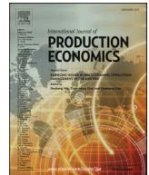

ReviewOrder picker routing in warehouses: A systematic literature reviewMakusee Masaea,b, Christoph H. Glocka, Eric H. Grossea,\*a Institute of Production and Supply Chain Management, Technische Universität Darmstadt, Hochschulstr. 1, 64289, Darmstadt, Germanyb Department of Mathematics and Statistics, Faculty of Science, Prince of Songkla University, Hat Yai, Songkhla, 90110, ThailandARTICLE INFOKeywords:Order picking  
Order picker routing  
Routing policy  
Warehousing  
Systematic literature review

ABSTRACTOrder picking has often been described as one of the most labor- and time-consuming internal logistics processes. In manual picker-to-parts order picking systems, order pickers often spend a significant amount of time on travelling through the warehouse to reach storage positions where required items are stored. To reduce the cost of order picking, researchers have developed various optimal and heuristic routing policies in the past. This paper presents the results of a systematic review of research on order picker routing. First, it identifies order picker routing policies in a systematic search of the literature and then develops a conceptual framework for categorizing the various policies. Order picker routing policies identified during the literature search are then descriptively analyzed and discussed in light of the developed framework. The paper also derives insights into the frequencies of usage of the different routing policies available in the literature and applies a citation analysis to identify seminal works that shaped the literature on order picker routing. The paper concludes with an outlook on future research opportunities.

1. IntroductionAmong the various warehousing processes that have to be completed in a company, order picking, which is commonly defined as the process of retrieving items from their storage locations in response to customer orders, is considered one of the most time-consuming and work-intensive ones. Some authors estimated that it accounts for up to 55% of the total warehouse operating costs (Tompkins et al., 2010), which illustrates that order picking is an important lever for increasing warehousing efficiency. In practice, most order picking warehouses are operated according to the picker-to-parts principle and with a high share of manual work (De Koster et al., 2007; Van Gils et al., 2018), mainly because humans can more flexibly react to changes occurring in the order picking process than machines due to their cognitive and motor skills (Grosse et al., 2015, 2017).

To lower the cost of order picking, researchers have proposed mathematical models in the past that assist practitioners in optimizing order picking operations. The most important decision problems that have to be solved to improve the efficiency of order picking include the design of the warehouse layout, the assignment of items to storage locations, the batching of orders, and the routing of the order picker through the warehouse (e.g., De Koster et al., 2007; Grosse et al., 2017; Van Gils et al., 2018). The design of the warehouse layout specifies the

configuration of the warehouse, such as the number, length, and width of aisles, for example. The storage assignment determines how to allocate items to storage locations in the warehouse, and it often utilizes item characteristics for the assignment, such as pick frequency or volume. Order batching, in turn, restructures incoming orders, for example by splitting up large orders into smaller ones or by combining small orders in a single large order that can then be picked in a single picking tour (Cergibozan and Tasan, 2016). The routing policy, which is a solution to a special case of the well-known travelling salesman problem (TSP), finally determines the order picker's tour through the warehouse and the sequence in which s/he retrieves requested items from the storage locations. As some researchers estimated that travel time may account for more than 50% of the total order picking time (De Koster et al., 2007; Tompkins et al., 2010), the order picker routing problem has received special attention in the past (Grosse et al., 2017). The objective of order picker routing policies is usually to minimize travel time or travel distance (De Koster et al., 2007; Van Gils et al., 2018).

Prior research on the order picker routing problem developed both optimal and heuristic routing policies. There is a discussion in the literature about whether heuristic or optimal routing policies should be used in industry. Some researchers argued that heuristic routing policies are easier to apply in practice, and that optimal policies may confuse the order pickers, encouraging them to deviate from the optimal route (see

\* Corresponding author.

E-mail addresses: [makusee@pscm.tu-darmstadt.de](mailto:makusee@pscm.tu-darmstadt.de) (M. Masae), [glock@pscm.tu-darmstadt.de](mailto:glock@pscm.tu-darmstadt.de) (C.H. Glock), [grosse@pscm.tu-darmstadt.de](mailto:grosse@pscm.tu-darmstadt.de) (E.H. Grosse).

Gademann and Velde (2005), Elbert et al. (2017); Glock et al. (2017) and the references cited therein). Other researchers have shown that optimal policies still perform very well even if they are subject to higher deviations than heuristic policies (Elbert et al., 2017). Aside from behavioral aspects involved in routing order pickers through the warehouse, efficient algorithms that can calculate optimal routes are not available for every warehouse layout and order picking scenario yet (see De Koster and Van der Poort, 1998; Roodbergen and De Koster, 2001a; De Koster et al., 2007), which may prevent warehouse managers from improving their order picking operations in case they should be interested in doing so. An overview of order picker routing policies that supports practitioners in selecting suitable routing policies or that highlights for which order picking scenarios further policies need to be developed has, however, not been prepared so far.

The research at hand presents a systematic review of order picker routing policies with the following objectives:

1. 1. Give a comprehensive overview of and characterize routing policies that have been discussed in the literature.
2. 2. Show how frequently the routing policies have been used in the scientific literature in the past.
3. 3. Identify seminal works that shaped the literature on order picker routing.
4. 4. Identify warehouse layouts and order picking scenarios discussed in the literature where optimal and/or heuristic routing policies have not yet been proposed.

The intention of this review is also to stimulate further research on order picker routing policies to extend the portfolio of routing algorithms available to practitioners, which could in turn encourage a more extensive use of such policies in practice. Order picker routing is connected to other order picking planning problems (e.g., order batching, zoning, storage assignment). This review does not discuss these interdependencies in detail. We argue that improving order picker routing by itself is worthwhile as more efficient order picker routing policies help leveraging the performance of integrated policies that take account of more than a single planning problem as well. For example, if we consider the joint order batching and order picker routing problem, after solving the batching problem, routes still have to be found for each batch. Hierarchical approaches for solving the joint order batching and order picker routing problem that could directly benefit from improvements in order picker routing policies are quite popular in the literature, see, e.g., Ho and Tseng (2006), Tsai et al. (2008), Chen et al. (2015), and Li et al. (2017). The reader is referred to the review of Van Gils et al. (2018) on the combination of order picking planning problems.

The remainder of this paper is structured as follows. The next section first summarizes a seminal policy for optimally routing order pickers through a conventional warehouse. Section 3 then develops a conceptual framework for categorizing the literature on order picker routing policies. Section 4 outlines the methodology of this review and descriptively analyzes the results of the literature search. Section 5 presents the results of the literature review, and Section 6 summarizes the main insights obtained in this review. Section 7 concludes the paper.

## 2. Order picker routing in a warehouse: the problem

Generally, the problem of routing an order picker through a warehouse is either a variant of the classical travelling salesman problem (TSP; no capacity constraint; e.g., Ratliff and Rosenthal, 1983; Scholz et al., 2016) or the capacitated vehicle routing problem (CVRP; with capacity constraint that also requires batching of orders; e.g., Glock and Grosse, 2012; Scholz et al., 2017). Both problems are NP hard (Theys et al., 2010). Procedures for optimally solving the order picker routing problem make use of the special distances matrices that result from the structure of the warehouse aisles, which in many cases make it possible

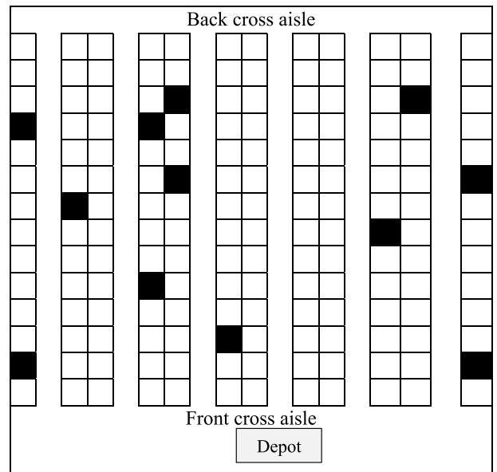

Fig. 1. Conventional warehouse with a single block (Ratliff and Rosenthal, 1983).

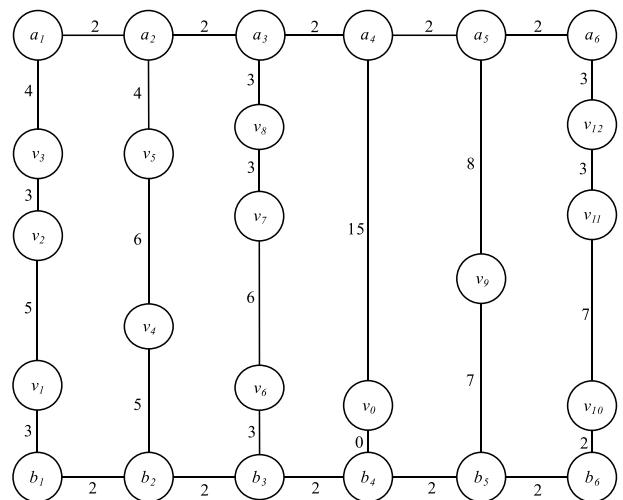

Fig. 2. Graph representation  $G$ , where  $m = 12$  and  $n = 6$  (Ratliff and Rosenthal, 1983).

to efficiently solve the problem. A seminal work that optimally solved the order picker routing problem is the one of Ratliff and Rosenthal (1983), referred to as RR in the following, that proposed an algorithm with a time complexity that is linear in the number of aisles. Methods for efficiently solving the order picker routing problem are usually dedicated to specific warehouse layouts, and they can no longer be used in a different application.

RR focused on a conventional warehouse with a single block as illustrated in Fig. 1. Since the method proposed by RR has frequently been extended in the past to other warehouse layouts and/or other order picking scenarios, we briefly summarize it in the following:

Consider a customer order containing  $m$  items to be picked in a conventional warehouse with  $n$  aisles. First, define a graph representation  $G$  of the warehouse (Fig. 2 contains a graph representation of the example presented in Fig. 1 with  $m = 12$  and  $n = 6$ ). The vertices  $v_i$ ,  $i = 1, 2, \dots, m$ , represent the locations of the requested items, and the vertex

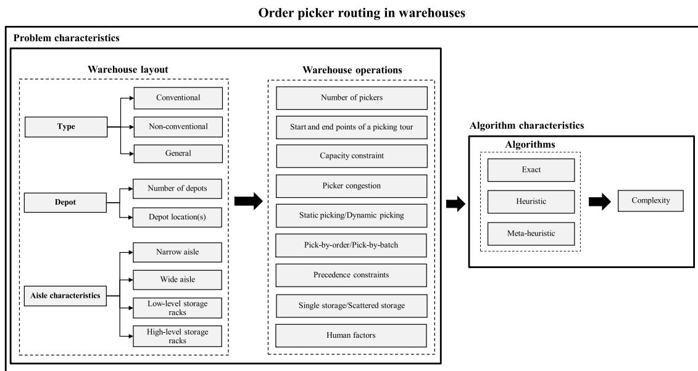

Fig. 3. Conceptual framework used for classifying the literature on order picker routing.

 $v_0$  denotes the depot1 where the order picker receives a pick-list and drops off picked items. The vertices  $a_j$  and  $b_j$ ,  $j = 1, 2, \dots, n$ , are the rear and front ends of each aisle. Secondly, connect any two vertices in  $G$  that correspond to adjacent locations of requested items by parallel edges and add a weight to each edge corresponding to the distance between the vertices connected by the edge. Since any order picking tour of  $G$  can be considered as a tour subgraph of  $G$ , the objective is to find an order picking tour subgraph of  $G$  with minimum length. RR solved the problem by considering a sequence of increasing subgraphs of  $G$  from the left-most aisle that contains items to be picked ( $j = 1$ ) to the right-most aisle with items contained in the order ( $j = n$ ). A subgraph  $T$  of  $G$  that contains all vertices  $v_i$ ,  $i = 0, 1, \dots, m$ , is called a tour subgraph if there is an order picking tour that traverses each edge in  $T$  exactly once. To create a subgraph, edges corresponding to possible moves within an aisle and to changeovers from one aisle to the next are considered. In each subgraph along the sequence  $j = 1, 2, \dots, n$ , partial tour subgraphs (PTSs) and their equivalence classes are considered. For any subgraph  $L$  of  $G$ , a subgraph  $T_j$  of  $L$  is an  $L$  PTS if there exists a subgraph  $C_j$  of  $G - L$  (the graph consists of edges and vertices that are contained in  $G$ , but not in  $L$ ) such that  $T_j \cup C_j$  is a tour subgraph of  $G$ . Equivalence classes are referred to by a triple (degree parity of  $a_j$ , degree parity of  $b_j$ , connectivity). In each equivalence class, a PTS with minimal length is then selected as a candidate for a PTS of the minimum-length tour subgraph. For the last aisle, the shortest PTS from the set of equivalence classes that are connected and possess even degree parity in  $a_n$  and  $b_n$  is selected as the minimum-length order picking tour. RR's algorithm has frequently been extended in the past, for example for conventional warehouses where a middle cross aisle separates the warehouse into two blocks (e.g., Roodbergen and De Koster, 2001a) or to the fishbone layout (e.g., Çelik and Süral, 2014). These and other extensions will be discussed in more details in Section 5.

### 3. Conceptual framework

To characterize the order picker routing problem and the existing literature on order picker routing policies, this section proposes a conceptual framework. The framework was derived in a combined

deductive and inductive approach. In the deductive approach, we developed an initial framework together with the list of keywords for the subsequent database search based on our understanding of the problem and then refined both the framework and the list of keywords inductively building on the results obtained from the preliminary review. Fig. 3 illustrates the developed framework. As can be seen, the framework considers two dimensions of the order picker routing problem, namely *problem characteristics* and *algorithm characteristics*. The impact of these two dimensions on order picker routing is discussed in more details in Section 5. Other conceptual frameworks related to order picking were proposed by Rouwenhorst et al. (2000), De Koster et al. (2007), Gu et al. (2007), Davarzani and Norrman (2015), and Shah and Khanzode (2017), for example. These frameworks consider order picker routing as one dimension of order picking/warehousing without further analyzing its problem attributes; therefore, our work complements these earlier frameworks by going into further detail with respect to order picker routing attributes.

#### 3.1. Problem characteristics

The problem characteristics describe the order picking scenario at hand, and they include system and process attributes. They may influence the distance matrix of the order picker routing problem and may consequently impact the computational complexity of an eventual solution procedure. The framework dimension *problem characteristics* was further divided into the sub-dimensions *warehouse layout* and *warehouse operations*.

The *warehouse layout* takes account of the general type of warehouse considered, the number and location of the depot(s) and several aisle characteristics. As to the type of warehouse, the literature discussed three main warehouse variants:

- • *Conventional warehouses* have a rectangular shape with parallel picking aisles that are perpendicular to a certain number of straight cross aisles. Conventional warehouses with two cross aisles on the front and back ends are often referred to as single-block warehouses (see Fig. 1 and A1 for two examples), while warehouses with more than two cross aisles are often referred to as multi-block warehouses, where each block in the warehouse consists of a number of sub-aisles.
- • *Non-conventional warehouses* do not arrange all picking aisles or cross aisles in parallel to each other, but select a different layout to

1 We use the term ‘depot’ synonymously for ‘Input/Output point’ (‘I/O point’) that has also been used in the literature.

**Table 1**  
Comparison of related literature reviews with the work at hand.

| Author(s)                   | Research focus       | Considered planning problems                                                                                                                         | Review methodology |                               | Conceptual framework for order picker routing | Overlap (in absolute numbers and %) with our core* sample and our extended* sample |
|-----------------------------|----------------------|------------------------------------------------------------------------------------------------------------------------------------------------------|--------------------|-------------------------------|-----------------------------------------------|------------------------------------------------------------------------------------|
|                             |                      |                                                                                                                                                      | Literature search  | Literature selection strategy |                                               |                                                                                    |
| Cormier and Gunn (1992)     | Warehousing          | Layout design, Storage assignment, Batching, Routing                                                                                                 | ×                  | ×                             | ×                                             | 2 (3.7%), 0 (0%)                                                                   |
| Van Den Berg (1999)         | Warehousing          | Storage assignment, Batching, Routing and sequencing                                                                                                 | ×                  | ×                             | ×                                             | 4 (7.4%), 1 (0.7%)                                                                 |
| Rouwenhorst et al. (2000)   | Warehousing          | Layout design, Storage assignment, Batching, Routing and sequencing                                                                                  | ×                  | ×                             | ×                                             | 3(5.6%), 2(1.3%)                                                                   |
| De Koster et al. (2007)     | Order picking        | Layout design, Storage assignment, Zoning, Batching, Routing                                                                                         | ×                  | ×                             | ×                                             | 10 (18.5%), 17 (11.4%)                                                             |
| Gu et al. (2007)            | Warehousing          | Storage assignment, Zoning Batching, Routing and sequencing, Sorting                                                                                 | ×                  | ×                             | ×                                             | 10 (18.5%), 13 (8.7%)                                                              |
| Davarzani and Norman (2015) | Warehousing          | Layout design, Storage assignment, Batching, Routing                                                                                                 | ✓                  | ✓                             | ×                                             | 2 (3.7%), 5 (3.4%)                                                                 |
| Shah and Khanzode (2017)    | Warehousing          | Zoning, Wave picking, Batching, Routing, Picking equipment, Sorting, Layout and slotting, Replenishment, Picking productivity and e-fulfilment,      | ✓                  | ×                             | ×                                             | 7 (13.0%), 22 (14.8%)                                                              |
| Van Gils et al. (2018)      | Order picking        | Combination of planning problems (e.g., batching and routing)                                                                                        | ✓                  | ✓                             | ×                                             | 13 (24.1%), 38 (25.5%)                                                             |
| Boysen et al. (2019)        | Warehousing          | Mixed-shelves storage, Batching, Zoning, Sorting, Dynamic order processing, AGV-assisted picking, Shelf-moving robots, Advanced picking workstations | ✓                  | ✓                             | ×                                             | 14 (25.9%), 35 (23.5%)                                                             |
| <b>This paper</b>           | <b>Order picking</b> | <b>Routing</b>                                                                                                                                       | ✓                  | ✓                             | ✓                                             |                                                                                    |

✓ = employed in the literature review, × = not mentioned in the literature review, \* = There are 54 papers in the core and 149 papers in the extended sample of our review (see Section 4.2).4.2 Methodology.

facilitate reaching certain regions of the warehouse or to improve space utilization. Examples include the fishbone and the flying-V (Çelik and Süral, 2014) and the U-shaped (Glock and Grosse, 2012) layouts.

- • Models of *general warehouses* do not make any assumptions about the aisles of the warehouse, but instead use general distance matrices. As a result, it is not possible to utilize specially structured distance matrices as in the work of RR, for example, which makes it difficult to solve the order picker routing problem in these warehouses efficiently. The resulting problem is identical to the classical TSP or CVRP. Examples include the works of Singh and van Oudheusden (1997) and Daniels et al. (1998).

The warehouse layout defines the number and location of the depot (s) as well as aisle characteristics. Both single- and multi-depot warehouses with wide and narrow aisles were discussed in the literature. In warehouses with narrow aisles, for example, the order picker can pick items from both sides of the aisle without having to cross it, whereas in wide-aisle warehouses, picking from both sides of the aisle makes crossing the aisle necessary leading to an additional travel distance. If the warehouse uses low-level storage racks, items can be picked directly from the racks without requiring vertical travels (Scholz and Wäscher, 2017), while in the case of high-level storage racks, vertical movements may be necessary as well. The former warehouse is usually referred to as a low-level order picking system, whereas the latter is known as a high-level system.

The sub-dimension *warehouse operations* captures various strategies employed or scenarios encountered in routing the order picker through the warehouse. It determines, for example, the number of workers picking orders in the warehouse, possible start and end points of a tour, and whether or not a capacity constraint has been defined for the order picker (e.g., in terms of weight or number of items; see Glock and Grosse (2012) and Matusiak et al. (2014), for example). If more than a single order picker works in the same narrow aisle, picker congestion (or picker blocking) may occur within aisles, which may induce waiting

times or the need to change a picking tour while the aisle or shelf is blocked by another order picker (e.g., Franzke et al., 2017). Static order picking is an operation where pick-lists are not allowed to be changed once the picking process has been initiated, whereas in case of dynamic order picking, pick-lists may be changed during the order picking process. Our framework also considers whether the warehouse is operated according to a pick-by-order or a pick-by-batch policy. In the first case, the order picker would pick individual orders, whereas in the second case, multiple orders would be combined in a batch to reduce travel distances. In the framework, we also consider whether the pick sequence is governed by precedence constraints, e.g. in case heavy items have to be picked before light items. A single storage system deals with the case where an item is stored only in a single storage location, whereas in a scattered storage system, an item is stored in multiple storage locations. Finally, our framework determines whether human factors are taken into account in the order picker routing problem. Human factors thereby describe all aspects of the design of a system (in our case: the order picking warehouse) that affect the interactions between the human and the system with the overall aim of maximizing human well-being and system performance (IEA Council, 2014).

### 3.2. Algorithm characteristics

The second dimension of our framework considers the characteristics of the algorithm employed for solving the order picker routing problem as well as its time complexity. Three general types of algorithms have been proposed in the literature:

- • *Exact algorithms* always find an optimal solution (i.e., shortest route) to an order picker routing problem. Examples include the algorithms of RR, De Koster and Van der Poort (1998), and Roodbergen and De Koster (2001a,b).
- • *Heuristics* are problem-dependent algorithms built according to its specifications, with the result in most cases not being optimal

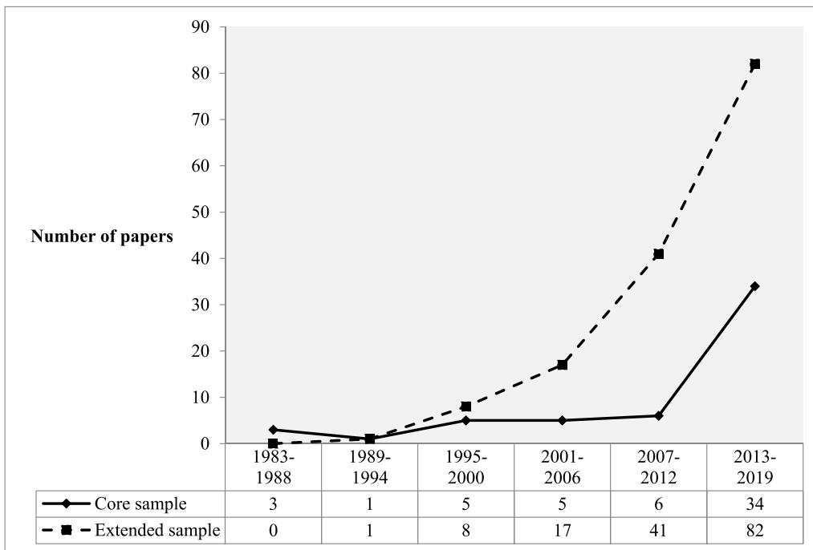

Fig. 4. Number of core and extended sample papers published per year2.

(Sörensen, 2015). Examples include the *traversal* (also known as *S-shape*), the *midpoint*, and the *largest gap* heuristics (Hall, 1993).

- • *Meta-heuristics* are high-level problem-independent algorithms that provide a set of guidelines or strategies to find an approximate solution for the problem (Sörensen, 2015). Examples include *genetic algorithms* (GA; Tsai et al., 2008), *ant colony optimization* (ACO; Chen et al., 2013), *particle swarm optimization* (PSO; Lin et al., 2016), or *tabu search* (TS; Cortés et al., 2017).

#### 4. The literature review

##### 4.1. Related literature reviews

Table 1 gives an overview of existing literature reviews on warehouse operations. To highlight the contribution of our review, we summarize related reviews with respect to research focus, planning problems considered, review methodology, and overlap with the sample of our study. As can be seen in Table 1, our literature review is the only one with a clear focus on order picker routing. We intend to cover the entire literature on this topic, including the development of a conceptual framework. The use of a systematic state-of-the-art literature search and selection strategy (see Section 4.2) led to a larger sample of works on order picker routing than covered in any of the existing reviews, which enables us to reach the research objectives formulated in Section 1 that were not addressed by earlier reviews.

To get a comprehensive overview of the state-of-research of order picker routing, we conducted a systematic literature review based on the methodologies proposed by Cooper (2010) and applied, for example, in Seuring and Gold (2012) and Hochrein and Glock (2012). The literature search and selection strategy can be summarized as follows:

First, keywords that describe the subject of this paper were defined to facilitate searching scholarly databases for relevant works. For this purpose, we created two lists of keywords, where list A relates to warehousing and list B to order picker routing and warehouse layout. List A included the keywords “order-picking”, “order picking”, “warehouse”, “warehousing” and “picker”, and List B included the keywords “route”, “routeing”, “routing” and “layout”. To generate the final

keyword list, each keyword from list A was combined with each keyword from list B (e.g. “order-picking” and “route”, “order-picking” and “routeing”, etc.). The final keyword list was then used to search the scholarly databases Ebsco Host (EH) and Scopus. Papers found in the database search were added to the working sample if they had one of the keyword combinations either in their title, abstract or list of keywords. In a second step, the papers identified during the database search were checked for relevance by first reading the paper’s abstract and, if the abstract indicated that the paper may be relevant for this review, by reading the entire paper. In the third step, a snowball search was conducted in which all works that were cited in any of the sampled papers (backward search) as well as all works that cited any of the sampled papers (forward search) were checked in addition for relevance.

During the evaluation of the database search results, the following inclusion and exclusion criteria were applied to the working sample:

- • Only works that study order picker routing policies for manual picker-to-parts warehouse operations were considered relevant. Works that propose travel time or average tour length estimation models for order picking, without actually proposing a routing policy, were excluded from further analysis. Examples are the works of Parikh and Meller (2010), Mowrey and Parikh (2014), and Venkitasubramony and Adil (2016). Similarly, also works that investigate the routing of automated storage and retrieval system (AS/RS), automated guided vehicles (AGVs), robots or tow trains through a warehouse were excluded from further analysis (e.g., Gademann, 1999; Fazlollahtabar et al., 2015).
- • We differentiated between a ‘core sample’ and an ‘extended sample’. For the core sample, only works that either proposed a particular order picker routing policy or combined two existing routing policies contained in the core sample in a hybrid method for the first time were considered relevant. The extended sample, in turn, considers all works that apply routing policies proposed in the core sample. Works that both proposed a new routing policy and used an existing routing policy already contained in the core sample were assigned to both samples. For example, the work of De Koster and Van der Poort (1998) developed both an optimal order picker routing policy and

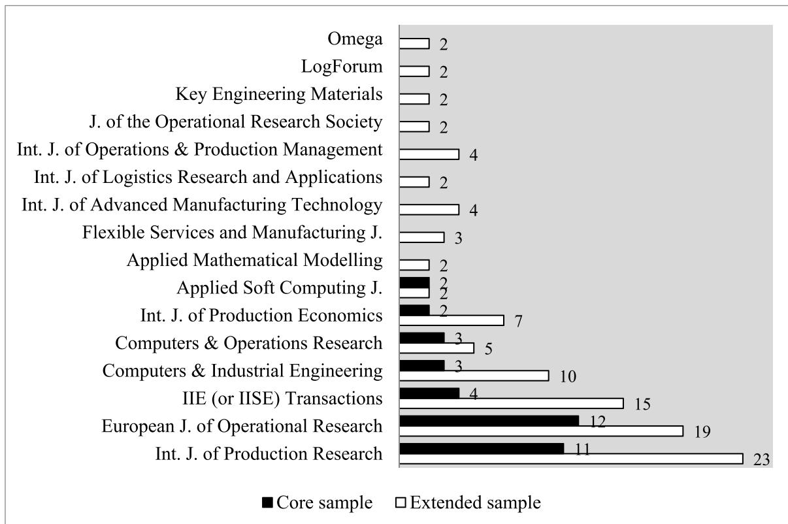

Fig. 5. Number of core and extended sample papers published per journal.

used the *S-shape* heuristic proposed by Hall (1993). This paper was consequently assigned to both the core and the extended samples. The core sample is discussed in detail below, which enables us to give a comprehensive overview of all order picker routing policies that have been proposed in the literature so far. An additional analysis of the extended sample then enables us to derive insights into the frequency and context of usage of the different routing policies in the academic literature.

- • Only works that appeared in peer-reviewed journals were considered relevant. Thus, so-called grey literature such as book chapters, conference papers, theses, technical reports, etc., were excluded from the review.
- • Only works written in English were considered relevant.

The results of the literature search are illustrated in a review protocol in Table A1 in the appendix (all numbers effective June 2019). The database search resulted in 337 papers from EH and 735 papers from Scopus. An analysis of the papers' abstracts reduced the size of the core samples to 62 (EH) and 62 (Scopus) papers, respectively. After eliminating duplicate papers, 73 papers remained in the core sample. Reading all papers led to the exclusion of 37 papers and a core sample consisting of 36 papers. Backward and forward snowball searches helped to identify 10 additional papers. Finally, discussions with experts helped to identify another 8 papers that had been missing in the core sample, which led to a final core sample size of 54 papers. With respect to the extended sample, a total number of 149 papers were identified, 44 papers from EH, 34 from Scopus, and 71 from the snowball search. Note that papers included in the extended sample that were not cited in the text are listed in the online supplement to this paper.

#### 4.2. Descriptive results

Fig. 4 presents the number of papers published per year in the core and the extended samples. As can be seen, publication numbers of both samples displayed an increasing trend in recent years, with more than 50% of the core sample papers having been published during the last five years. This trend may point towards an increasing relevance of alternative order picker routing policies in practice, which may reflect the high cost pressure many warehouses face in industry. Furthermore, an increasing number of papers in the extended sample indicates that also the application and eventual validation of existing order picker routing policies has enjoyed popularity in recent years. Fig. 5 shows the academic journals that published at least two papers contained either in the core or the extended sample. The most popular outlets with at least two papers in both samples are the *International Journal of Production Research* (11 core, 23 extended), the *European Journal of Operational Research* (12 core, 19 extended), *IIE (or IISE) Transactions* (4 core, 15 extended), *Computers & Industrial Engineering* (3 core, 10 extended), *Computers & Operations Research* (3 core, 5 extended), the *International Journal of Production Economics* (2 core, 7 extended), and *Applied Soft Computing* (2 core, 2 extended).

#### 5. Results of the literature review on order picker routing algorithms

This section reviews algorithms for the order picker routing problem. The structure follows the conceptual framework and categorizes algorithms according to the type of warehouse and the type of algorithm (see

2 The year 2019 is only considered until and including June.

Section 3). To highlight the dependencies between the papers discussed in this section, we first present RR as a seminal work on exact algorithms for order picker routing and then discuss its extensions. Subsequently, we outline further exact algorithms that are self-standing and that cannot be traced back to a single key publication. To give a structured overview of exact algorithms that are either based on the seminal work of RR or not, Table 2 summarizes basic dependencies. The remaining components of our framework are summarized in the online supplement to this paper and addressed for each paper where applicable in the following.

### 5.1. Conventional warehouses

#### 5.1.1. Single-block warehouses

This section reviews algorithms employed for solving the order picker routing problem in single-block warehouses. We structure the discussion along the algorithm types defined above.

##### 5.1.1.1. Exact algorithms

**5.1.1.1.1. RR and its extensions.** A seminal work on the optimal routing of order pickers through a warehouse is the one of RR. The warehouse investigated in this work has narrow picking aisles with a single depot in the front cross aisle. The authors further assumed a low-level storage rack for static picking in a single storage system. A picking tour starts and ends at the depot, and requested items are picked according to the pick-by-order principle by a single picker. The device's capacity is sufficient for picking all requested items in a single picking tour. The time complexity of the algorithm that was already described in more detail in Section 2 is linear in the number of aisles (i.e.,  $O(n)$ , where  $n$  is the number of aisles). The algorithm of RR lacks flexibility to be used if order picking scenarios change, and it has therefore frequently been extended in the past. De Koster and Van der Poort (1998), for example, generalized the algorithm to the case of decentralized depositing, which describes a situation where the order picker can deposit the retrieved items at the respective front ends of each picking aisle without returning to the depot, and it can be found in practice in situations where conveyor belts are used to transport picked items to the central depot or the shipping area. Thus, once an order has been completed, the picker can proceed with the next order without having to return to the depot. As a result, the start and end points of a picking tour are not necessarily the depot, but instead they can be any of the front ends of the picking aisles. Permitting more than a single start and end point for a tour leads to new

equivalence classes for the PTSs in addition to the equivalence classes proposed by RR. The algorithm's time complexity is linear in the number of aisles or items ( $O(\max(n, m))$ ).

Another extension of RR that takes account of precedence constraints (PC) was proposed by Zulj et al. (2018). Their investigated warehouse is a single-block warehouse with a single depot located at the front of the left-most picking aisle. Note that this warehouse layout is illustrated in Fig. A1 in the appendix as *standard layout* A. PC, in this context, define partial sequences for the picking of items based on the weight, fragility, and/or item category. For each picking tour, an order picker initially retrieves all heavy items contained on a pick-list and ends the tour at a predetermined heavy item location. S/he then further retrieves all light items contained on the same pick-list and finally returns to the depot. The optimal order picker route is determined by finding a combination of heavy and light subtours that results in a total tour with minimum length. The time complexity of the proposed algorithm is  $O(m^5)$ .

Çelik and Süral (2016) extended the algorithm of RR by considering turn penalties in addition to the order picker's regular travel time. Assuming that changes in the direction of travel slow down the order pickers, turn penalties are encountered whenever the order picker enters or leaves an aisle or when a U-turn is necessary within an aisle. The authors considered different depot locations in their study, namely (i) at the corner of a picking aisle and a cross aisle (so-called *corner-depot*); (ii) at a cross aisle, but not at the corner of a picking aisle and a cross aisle (*cross-depot*); and (iii) at a picking aisle (*pick-depot*). The authors solved different variants of the problem (single-objective turn minimization and time minimization, bi-objective travel time and turn minimization, and a tri-objective problem with U-turn minimization) in polynomial time.

All works mentioned above only consider static order picking. Lu et al. (2016), in contrast, extended RR's algorithm to account for situations where a pick-list that is currently being completed can be updated, e.g. because new orders have arrived at the warehouse. This situation is also known as dynamic order picking. Once the pick-list has been updated, a new picking tour is calculated with the start point of the tour being the current position of the order picker. The end point of each tour would still be the depot. Since any arbitrary position in the warehouse could be the start point of a new tour, edges corresponding to possible moves to leave an aisle have to be considered in RR's algorithm. This leads to new equivalence classes of PTSs in addition to the PTSs proposed in RR that have to be considered during the construction of the order picking tour. The time complexity of the proposed algorithm is

**Table 2**  
Classification of papers proposing exact algorithms.

| Papers                             | Warehouse layout |                | Non-conventional | General       | Extension of RR |                |
|------------------------------------|------------------|----------------|------------------|---------------|-----------------|----------------|
|                                    | Conventional     |                |                  |               | Yes             | No             |
|                                    | Single-block     | Multi-block    |                  |               |                 |                |
| Ratliff and Rosenthal (1983) (RR)  | ×                |                |                  |               |                 | ×              |
| Goetschalckx and Ratliff (1988a)   | ×                |                |                  |               |                 | ×              |
| Goetschalckx and Ratliff (1988b)   | ×                |                |                  |               |                 | ×              |
| Singh and van Oudheusden (1997)    |                  |                | ×                |               |                 | ×              |
| De Koster and Van der Poort (1998) | ×                |                |                  |               | ×               |                |
| Roodbergen and De Koster (2001a)   |                  | ×              |                  |               | ×               |                |
| Theys et al. (2010)                |                  | ×              |                  |               |                 | ×              |
| Jang and Sun (2012)                |                  | ×              |                  |               |                 |                |
| Çelik and Süral (2014)             |                  |                | ×                |               | ×               |                |
| Matusiak et al. (2014)             |                  | ×              |                  |               |                 | ×              |
| Charkhgard and Savelsbergh (2015)  | ×                |                |                  |               |                 | ×              |
| Çelik and Süral (2016)             | ×                |                |                  |               | ×               |                |
| Lu et al. (2016)                   | ×                |                |                  |               | ×               |                |
| Chabot et al. (2017)               | ×                |                |                  |               |                 | ×              |
| Pansart et al. (2018)              |                  | ×              |                  |               | ×               |                |
| Žulj et al. (2018)                 | ×                |                |                  |               | ×               |                |
| Glock et al. (2019)                |                  |                | ×                |               |                 | ×              |
| Öztürkoğlu and Hoser (2019)        |                  |                | ×                |               | ×               |                |
| <b>Frequency</b>                   | <b>9 (50%)</b>   | <b>5 (28%)</b> | <b>3 (17%)</b>   | <b>1 (5%)</b> | <b>9 (53%)</b>  | <b>8 (47%)</b> |

 $O(n)$ .

**5.1.1.2. Further exact algorithms.** Besides exact algorithms based on RR, Chabot et al. (2017) used an exact algorithm for the vehicle routing problem (VRP), namely *branch-and-cut*, to solve the order picker routing problem with PC in a wide-aisle warehouse. The authors proposed mathematical formulations derived from single- and two-index VRP models, namely (i) the *capacity-indexed formulation* (Picard and Queyranne, 1978) and (ii) the *two-indexed flow formulation* (Laporte, 1986; Toth and Vigo, 2014). A *branch-and-cut* algorithm was applied to solve the two formulations where weight and fragility inequality constraints were used as cutting planes at every node of the *branch-and-bound* tree for strengthening the linear programming relaxation. The warehouse investigated is a single-block warehouse with a single depot located half-way between the left- and right-most picking aisles (see *standard layout B* in Fig. A1 in the appendix).

Several other exact algorithms have been developed for the case where all items requested in an order are stored in a single picking aisle, including the works of Goetschalckx and Ratliff (1988a,b) and Charkhgard and Savelsbergh (2015). Goetschalckx and Ratliff (1988a) proposed two exact routing algorithms for wide-aisle warehouses with low-level storage racks they termed (i) *optimum aisle traversal* and (ii) *optimum return*. For algorithm (i), the authors assumed that a picking tour starts at the entry point of an aisle and ends at the exit point at the opposite end of the aisle. The *no-skip* property that is based on the *no-crossing* property of Barachet (1957) was applied to determine an optimal picker route for this case. The main idea of the *no-crossing* property is that a Hamiltonian path visits each vertex exactly once. As a result, such a path cannot contain a vertex with a degree other than two, hence paths will not cross themselves. The order picker always starts at the aisle entrance and then picks the nearest requested item either on the right or left side of the aisle. After that, s/he either picks the next item on the same current side of the aisle or crosses to the other side of the aisle to pick the item. The problem of finding the optimal picker route in this case is equivalent to finding the shortest path in an acyclic graph, i.e. a graph without cycles that allows that each vertex is visited at most once. In Goetschalckx and Ratliff (1988a), each vertex represents the state of the system defined by a triple (last item picked on the right side, last item picked on the left side, current position of the picker (right or left)), and each edge represents a feasible transition with a certain travel distance. The authors used a dynamic programming approach to find the shortest path in the acyclic graph where the travel distances for all transitions from the entry to the exit points were computed. The time complexity of the algorithm is  $O(m^2)$ . Charkhgard and Savelsbergh (2015) further studied algorithm (i) and calculated a minimum spanning tree (MST) on the pick locations on both sides of the aisle and then connected the entry and exit points to their closest pick locations. Using the MST in the *optimum aisle traversal* strategy, a lower bound on the length of the picking route can be computed in linear time ( $O(m)$ ). The authors termed this routing policy the *passing strategy*. In case of algorithm (ii) discussed in Goetschalckx and Ratliff (1988a), the order picker starts at the entry of the aisle, picks all items on one side of the aisle, then crosses to the farthest item on the other side of the aisle, and picks all remaining items on the way back. Goetschalckx and Ratliff (1988b) determined the optimal number of stops of a picking device and the pick sequence at each stop in a wide aisle of a single-block warehouse. The authors formulated this problem as a set covering problem with the consecutive-ones property (see Segal, 1974; Bartholdi and Ratliff, 1978), which can be solved by finding the shortest path in an acyclic graph.

**5.1.1.2. Heuristics.** The algorithms discussed in the previous section always find the shortest possible tour for the order picker routing problem. In many practical applications, the use of routing heuristics is common, which – despite their performance disadvantages – are easy to apply and which produce results that can easily be understood and implemented by the order picker. Routing heuristics for single-block

warehouses can be classified as *simple heuristics* or *TSP heuristics*. The first type was specifically developed for order picking problems, whereas the second type was originally developed for the TSP and transferred to an order picking context. The *simple heuristics* discussed in the sampled papers are summarized in the following:

Goetschalckx and Ratliff (1988a) proposed a *simple heuristic* for wide-aisle warehouses they referred to as the *Z-pick* heuristic. The heuristic determines a route where the order picker travels in a zigzag pattern through the wide aisle to collect requested items from both sides of the aisle.

Hall (1993) proposed and compared three *simple heuristics* for the order picker routing problem in a single-block warehouse with narrow aisles and a single depot, referred to as the *traversal*, the *midpoint*, and the *largest gap* heuristic. Petersen (1997) added the *return* and the *composite heuristic*. These heuristics are simple ‘rules of thumb’ and can be summarized as follows:

- • *Traversal* (also known as *S-shape*): The order picker starts in the first aisle that contains requested items and traverses the aisle completely. The picker then moves to the next aisle that contains requested items, traverses this aisle completely, and continues in this fashion until all requested items have been retrieved. Note that this heuristic had earlier been discussed by Kunder and Gudehus (1975).
- • *Midpoint*: The warehouse is divided into two equal halves, referred to as the front and the back parts. The order picker enters the aisles in the front part of the warehouse that contain requested items, and leaves each aisle on the side where s/he entered it without accessing the back part. Once the front part of the warehouse has been completed, the order picker moves to the back part of the warehouse to complete all aisles in the same fashion.
- • *Largest gap*: This heuristic also divides aisles into two halves, but uses the largest gap between two requested items or between the aisle exits and a requested item for defining the front and back part of each aisle. As in the case of the *midpoint* strategy, the order picker first completes the front part of the warehouse and then moves to the back part to collect requested items there.
- • *Return*: The order picker enters each aisle that contains at least one requested item from the front end and picks all requested items. Once the order picker has retrieved the last item, s/he returns to the front end of the aisle and continues to the next aisle.
- • *Composite*: This strategy combines the *return* and the *S-shape* heuristics such that the order picker can either entirely traverse the aisle or return to the front end where s/he entered it, depending on which heuristic gives the shortest travel distance for retrieving the farthest requested items from two adjacent aisles.

Chabot et al. (2017) modified the heuristics proposed by Hall (1993) as well as the *combined* policy proposed by Roodbergen and De Koster (2001b) (to be discussed in detail in Section 5.1.2.2 as it was originally proposed for multi-block warehouses) to solve the order picker routing problem with PC. Each modified heuristic follows the original procedure with the additional condition that a requested item is retrieved only if it respects all constraints of the problem. Otherwise, it is skipped and picked in the next tour. Once the transport capacity of the picker has been reached or the last item has been picked, the order picker returns to the depot to drop off all retrieved items. If further items need to be picked, the picker starts a new tour at the first skipped item or the first unpicked item in the regular sequence. This procedure is repeated until all remaining items have been picked.

Menéndez et al. (2017) proposed another extension of the *combined* heuristic of Roodbergen and De Koster (2001b) for *standard layout A*. The proposed heuristic starts by first evaluating for each individual aisle (excluding the left- and right-most aisles) if using the *largest gap* or the *S-shape* heuristic leads to a shorter travel distance for this aisle. The heuristic then evaluates different options for combining the resulting individually shortest travel distances within an aisle, taking account of

With respect to *TSP heuristics*, Makris and Giakoumakis (2003) applied a modified *k-interchange* heuristic to improve the solution of a simple routing heuristic (e.g., *S-shape*). The *k-interchange* heuristic, originally proposed by Nemhauser and Wolsey (1988), is a local search heuristic that improves solutions obtained for the TSP. Given an initial tour, the *k-interchange* heuristic replaces  $k$  edges in that tour by  $k$  edges that are not in the tour if such a change yields a shorter tour. The modified *k-interchange* heuristic changes the position of two random requested items in a tour, which leads to four edges in the tour being replaced by four new edges. A repetitive application of this heuristic may reduce the length of the initial tour. Grosse et al. (2014) also studied *standard layout B* with narrow aisles and used, among others, the *savings algorithm* for routing order pickers. The *savings algorithm*, originally proposed by Clarke and Wright (1964), starts with a set of tours in which each item is picked individually. It then evaluates the travel distance that can be saved when merging two existing tours into a single tour, and combines those tours that result in the highest saving in travel distance.

All previously mentioned heuristics are confined to order picking in a single storage system. Only few works considered order picker routing in a scattered storage system. In this scenario, Weidinger (2018) considered order picker routing in *standard layout B*. Two optimization sub-problems have to be solved in this case: (i) determine which locations to visit, and (ii) route the order picker for the set of locations determined in (i). The author proposed three routing heuristics using storage location selection rules that calculate priority values for the requested items, which influence the picking sequence of requested items in an order. Weidinger et al. (2019) extended this to the case where depots are located both at the rear and front ends of each aisle, so that the start and end points of a picking tour can be any of the rear and front ends of the picking aisles. They formulated a mixed-integer optimization model along with a *pool-based construction heuristic* to solve it.

**5.1.1.3. Meta-heuristics.** Meta-heuristics have mostly been used to solve combinations of multiple order picking planning problems and complex order picking problems. Works that used meta-heuristics for solving combined planning problems are discussed in the following. Tsai et al. (2008) proposed two *genetic algorithms* (GAs) to solve the order batching and order picker routing problems considering both travel cost as well as earliness and tardiness penalties. The authors first constructed batches using a GA, and then applied another GA to find a short route for the order picker given a set of items to be picked in a batch. For selecting solutions from a population, the roulette wheel selection approach was used in both GAs. Lin et al. (2016) also investigated the joint order batching and order picker routing problem in a single-block warehouse with a single depot. The authors used a modified version of the *particle swarm optimization* (PSO) approach originally proposed by Selvakumar and Thanushkodi (2007) for solving the routing problem for a batch. Ho and Tseng (2006) studied order batching in combination with order picker routing and storage assignment in *standard layout A*. For solving the order picker routing problem, a *simulated annealing* (SA) approach was proposed that aimed on improving solutions found by the *largest gap* heuristic. Chen et al. (2015) developed a non-linear mixed-integer optimization model that simultaneously considers three decision problems, namely order batching, batch sequencing, and order picker routing. The objective of the model is to minimize the total tardiness of customer orders. For finding the minimum total travel time and completion time of a batch, an *ant colony optimization* (ACO) approach was used. Ardjmand et al. (2018) proposed a *Lagrangian decomposition* (LD) heuristic combined with PSO to solve an order batching, a batch assignment, and an order picker routing problem with multiple order pickers. The objective of their study was to minimize the time required to complete all batches.

Besides the use of meta-heuristics for solving combined planning problems, several works applied meta-heuristics to other complex order

Schrotenboer et al. (2017) considered a situation where the order picker has to drop off returned products at their respective storage locations in addition to the picking of items requested by the customer. The authors proposed a *hybrid genetic algorithm* (HGA) to determine the route for a single order picker. The HGA, in this context, combines a GA with a *local search*. Moreover, they also investigated the case of multiple order pickers subject to congestion by extending the HGA, in which order picker interaction is taken into account in the model.

Chabot et al. (2017) used an *adaptive large neighborhood search* (ALNS) (originally proposed by Ropke and Pisinger, 2006) to solve the order picker routing problem with PC. The ALNS uses destroy and repair operations to improve the solution in each iteration. A destroy operation removes nodes from the pick sequence, while the repair operation inserts them at potentially better positions. In this study, the authors used three destroy operators, namely the Shaw removal (Shaw, 1997), the worst removal, and a random removal (Ropke and Pisinger, 2006), as well as two repair operators, namely a greedy parallel insertion and a *k*-regret heuristic (Potvin and Rousseau, 1993). Each operator was selected with a probability based on its past performance, and an acceptance criterion based on a SA approach was used for accepting a solution. Bódis and Botzheim (2018) applied a *bacterial memetic algorithm* (BMA) to solve the order picker routing problem based on pallet loading features depending on item properties, pick-list characteristics, and order picking system characteristics. Given a pick-list, storage locations have to be visited and the retrieved items need to be arranged on a pallet in a way that ensures the build-up of a stable transport unit without causing product damages. The pallet setup possibilities and the pick sequences were given in a matrix.

Cortés et al. (2017) studied the order picker routing problem where a tour is generated by simultaneously taking into account product attributes (weight and volume), storage locations (different height levels), inventory availability, and the availability of heterogeneous material handling equipment in the warehouse. The authors applied a generic *tabu search* (TS) and its hybrid variations with *2-Opt Exchange* and *2-Opt Insertion*. The generic TS procedure relies on swap and shift movements between two locations to explore a neighboring solution. The former hybrid variant swaps a couple of locations with another couple, whereas the latter variant shifts a couple of locations into a new position within the route.

## 5.1.2. Multi-block warehouses

**5.1.2.1. Exact algorithms.** The exact algorithms based on RR discussed in Section 5.1.1.1, are not directly applicable to multi-block warehouses, and have therefore frequently been modified in the past to cover this warehouse layout as well. Roodbergen and De Koster (2001a) studied a conventional warehouse with a middle cross aisle dividing the warehouse into an upper and a lower block. The authors applied the concept of RR to iteratively construct a minimum-length tour subgraph by expanding subgraphs according to the following three transitions: (i) add edges corresponding to possible moves of an order picker within the current aisle in the lower block; (ii) add edges corresponding to possible moves of an order picker within the same aisle in the upper block; and (iii) add edges corresponding to possible moves of an order picker from the current aisle to the adjacent aisle. For transitions (i) and (ii), possible edges presented in RR's work were used. For transition (iii), the authors proposed new edge configurations connecting two adjacent aisles. The time complexity of the algorithm is  $O(m + n)$ . Roodbergen and De Koster (2001a) assumed that all three cross aisles do not contain any storage locations. Jang and Sun (2012) relaxed this assumption and studied the case where the back cross aisle may contain requested items as well. Since edges corresponding to changeovers from one aisle to the next proposed by Roodbergen and De Koster (2001a) do not cover the case where the back cross aisle contains storage locations, Jang and Sun

(2012) proposed additional edges corresponding to possible moves of an order picker within the back cross aisle. They then applied the algorithm of Roodbergen and De Koster (2001a) to find the minimum-length order picking tour. Pansart et al. (2018) applied a fixed-parameter algorithm for the rectilinear TSP discussed in Cambazard and Catusse (2018) to find the optimal route for an order picker. This algorithm is based on a dynamic programming procedure that defines the states as possible configurations of the separator (degree parity of the vertices and connected components) as well as two types of transitions between states: vertical and horizontal. Horizontal and vertical transitions add vertexes and edges using horizontal and vertical components identified by RR.

Some authors also proposed exact algorithms originally developed for solving the TSP for the order picker routing problem in multi-block warehouses. Roodbergen and De Koster (2001b) applied a *branch-and-bound* method to their TSP formulation to find an order picking tour with minimal travel time in a narrow-aisle warehouse. The drawback of the *branch-and-bound* algorithm is its unpredictable run-time behavior, which would not be suitable for practical implementations. Theys et al. (2010) applied the *exact concorde TSP* algorithm to a conventional warehouse with two blocks and assumed that a picking tour starts and ends at a single depot that can either be in the middle (central depot) or at any other position (decentral depot) in the front cross aisle. The *exact concorde TSP* algorithm was originally developed for solving the symmetric TSP using a *branch-and-cut* method (see Jünger and Naddef, 2001). The *exact concorde TSP* solver (see Applegate et al., 2008) was applied to find the shortest route for a given pick-list. Matusiak et al. (2014) used the (exact) *A\*-algorithm*, which is based on dynamic programming, to solve the combined precedence-constrained order picker routing and order batching problem in a multi-block conventional warehouse. The authors assumed that there are multiple depots located at the back cross aisle. Besides the constraint that certain items have to be picked in a pre-specified sequence, the authors assumed that each order has to be delivered to its respective pre-specified depot. Given a number of bins per device, an order picker with an empty device receives a batch of orders where the number of orders contained in the batch is subject to a capacity constraint. An order picker travels through the warehouse to pick the items by separating different customer orders into different bins. Once all orders in a batch have been picked and delivered to their respective pre-specified depots, the order picker receives a new batch of orders. For each batch, the *A\*-algorithm* proposed by Hart et al. (1968) was applied to find a picking tour of minimal length. This algorithm uses dynamic programming where a state represents the number of picked items of each order in a batch and the order of the last picked item. The initial state is at the depot when the device is empty, while the final state is when all the items have been picked and delivered, and the device is empty again.

**5.1.2.2. Heuristics.** Routing heuristics for multi-block warehouses can be classified into *simple heuristics* and *improvement heuristics*. With respect to *simple heuristics*, Roodbergen and De Koster (2001b) extended the *largest gap* and the *S-shape* heuristic to the case of a multi-block narrow-aisle warehouse with a single depot located at the front of the left-most picking aisle. In addition, they proposed new routing heuristics they termed *combined* and *combined+*. The proposed routing heuristics can be summarized as follows:

- • *Multi-block S-shape*: The order picker starts in the left-most aisle that contains requested items and traverses up to the front cross aisle of the farthest block from the depot that contains requested items. The order picker then moves to the right until s/he reaches a sub-aisle of the farthest block containing requested items. S/he traverses this sub-aisle completely up to the back cross aisle of the farthest block. The picker then moves to either the left- or the right-most sub-aisle containing requested items, depending on which results in the

shortest travel distance. S/he then applies the *S-shape* policy for the single-block warehouse to this block and then returns to the front cross aisle of the current block. The picker continues in this fashion to the next block closer to the depot until the last block closest to the depot has been completed. Fig. S1 (in the online supplement) shows the routing procedure that results from the *multi-block S-shape* heuristic.

- • *Multi-block largest gap*: This heuristic uses the same principle for sequencing blocks for picking items as the *multi-block S-shape* heuristic. Once the order picker has reached the farthest block, s/he visits all sub-aisles that need to be entered from the back and then traverses the last sub-aisle completely to the front cross aisle. Note that each sub-aisle that contains items to be picked is entered up to the *largest gap*. The picker then visits all sub-aisles with items left from the front by entering each sub-aisle up to the *largest gap*. The picker continues in this fashion to the other blocks until the last block has been completed (see Fig. S2 in the online supplement for the route generated by *multi-block largest gap*).
- • *Combined*: The order picker starts in the left-most aisle that contains requested items. S/he traverses this aisle up to the front cross aisle of the farthest block that contains requested items. S/he further picks the requested items in the farthest block where the sub-aisles are visited sequentially from left to right. The picker either traverses each sub-aisle completely or enters and leaves the sub-aisle from the same side. This choice is made with the help of a dynamic programming method. The picker continues picking in this fashion until all blocks with requested items have been visited. Fig. S3 shows the route resulting from the *combined* heuristic.
- • *Combined+*: This heuristic improves the *combined* heuristic in two ways. First, the sub-aisles containing requested items in the block closest to the depot are visited from right to left. Secondly, the farthest block is not necessarily accessed using the left-most aisle of the warehouse containing requested items. Instead, it can be accessed by the left-most sub-aisle with items of the block closest to the depot. Routes generated by the *combined+* heuristic are at least as good as routes generated by the *combined* heuristic. Fig. S4 presents the route obtained by the *combined+* heuristic.

Chen et al. (2013) proposed two modified *S-shape* heuristics for the case where congestion (picker blocking) can occur. The first one applies the traditional *S-shape* heuristic under the condition that an order picker has to wait at the entrance of an aisle in case it is occupied by another picker until the aisle has been cleared. The second *S-shape*+ heuristic considers three types of spatial relationships between a picked item and the next target item, namely: (i) they are in the same sub-aisle; (ii) they are in the same block, but in different sub-aisles; and (iii) they are in different blocks. The authors used these three relationships to determine the travel time as well as the waiting time when congestion occurs while picking the requested items.

Vaughan and Petersen (1999) developed the *aisle-by-aisle* heuristic. The authors considered the case where an order picking tour starts at the front end of the left-most aisle and ends at the front end of the right-most aisle containing requested items. This heuristic proceeds from the left- to the right-most picking aisle under the condition that each picking aisle containing requested items has to be visited exactly once. A dynamic programming approach was applied to determine the best cross aisle to use for moving from one picking aisle to the next in such a way that the travel distance generated by the proposed heuristic is minimized. Matusiak et al. (2017) proposed a new routing heuristic they termed the *middle aisle multi-drop off routing heuristic*. This heuristic is a combination of the modified *aisle-by-aisle* heuristic (Vaughan and Petersen, 1999), and *Dijkstra's algorithm* (Dijkstra, 1959). Once a partial tour for retrieving all orders in a batch has been formed according to the *aisle-by-aisle* heuristic, the overall picking tour is completed by adding the visited depots with *Dijkstra's algorithm*. Their proposed heuristic was used in a joint order batching, picker assignment, and order picker

routing problem by taking into account the order pickers' skills in assigning batches to pickers. The authors considered multiple depots at the back cross aisle. Each order is assigned to a pre-specified depot that has to be visited after all items contained in an order have been picked. All picking aisles in the warehouse can only be traversed in a single direction, while the cross aisles can be traversed in both directions.

Scholz and Wäscher (2017) studied the joint order batching and order picker routing problem considering a single depot located at the front of the left-most picking aisle. For routing order pickers through the warehouse, the authors proposed a new heuristic they termed the *heuristically modified exact algorithm*. This algorithm builds on the exact algorithm of Roodbergen and De Koster (2001a) and tries to reduce the number of subgraphs constructed in each iteration by deleting all PTSs, except the shortest one, after each change of a picking aisle.

Shouman et al. (2007) proposed the following two heuristics:

- • *Block-aisle 1*: Each block in the warehouse is divided into an upper and a lower part. The upper part consists of storage locations where the distance from the back cross aisle is less than or equal to half of the block length. The rest of the storage locations is assigned to the lower part. The order picker traverses the left-most aisle that contains requested items up to the upper cross aisle of the farthest block that contains requested items. The picker retrieves the items stored in the upper and lower parts using the *return* policy. The same procedure is applied to the other blocks closer to the depot until the last block has been completed. Fig. S5 illustrates a route obtained by the *block-aisle 1* heuristic.
- • *Block-aisle 2*: This heuristic is identical to the *Block-aisle 1* heuristic, with the difference that the upper part contains also the next adjacent storage location of the lower part if it contains the requested item. Fig. S6 illustrates a route resulting from the *block-aisle 2* heuristic.

Chen et al. (2019a) proposed heuristics for the case of ultra-narrow aisles, where a picker cannot enter sub-aisles with a picking device, but has to leave the device at the aisle entrance. Moreover, for some sub-aisles, the picker can enter and leave from only one side of the aisle because the other side is blocked by the warehouse wall. The warehouse investigated consists of cross aisles and connect aisles that are perpendicular to the cross aisles (this warehouse layout is illustrated in Fig. S7 in the online supplement). The existence of cross and connect aisles divides the warehouse into multiple blocks in the direction from front to back and from left to right. The order picker uses either cross or connect aisles for travelling from the current sub-aisle to the target sub-aisle, where the intersection between a cross aisle and a connect aisle is referred to as a cross point. The authors extended the *return*, the *largest gap*, and the *midpoint* heuristic to make them applicable to the investigated warehouse. The proposed heuristics can be summarized as follows:

- • *Return for ultra-narrow aisles and access restriction (RNA)*: The picker starts at the depot, moves through the left-most cross point, and accesses the first cross aisle with picking tasks. For each sub-aisle that contains requested items, the picker selects the shortest feasible pick mode using the *return* policy. Afterwards, the picker moves through the nearest cross point to access the next cross aisle with picking tasks and continues in this fashion until the last cross aisle has been completed. Fig. S7 presents an example of a route generated by the RNA heuristic.
- • *Largest gap for ultra-narrow aisles and access restriction (LNA)*: This heuristic uses the same principle as the RNA heuristic. The difference is that the picker selects the shortest feasible pick mode using the *largest gap* policy.
- • *Midpoint for ultra-narrow aisles and access restriction (MNA)*: This heuristic uses the same principle as the RNA heuristic. The difference

is that the picker selects the shortest feasible pick mode using the *midpoint* policy.

Given that travelling in a connect aisle is a non-value adding activity, the authors proposed three additional heuristics, namely *return for ultra-narrow aisles and access restriction plus (RNAP)*, *largest gap for ultra-narrow aisles and access restriction plus (LNAP)*, and *midpoint for ultra-narrow aisles and access restriction plus (MNAP)*. These three heuristics use the same principle as the RNA, LNA, MNA, respectively. The difference is that there is no connect aisle between two adjacent blocks in the left and right direction. Without a connect aisle, the warehouse is divided into multiple blocks only in the front and back direction.

*Improvement heuristics* try to improve an initial solution generated by a heuristic. Popular improvement heuristics are the *2-opt* and the *3-opt* local searches as well as the *LKH TSP heuristic*. Hsieh and Tsai (2006) adapted the *Z-pick* heuristic proposed by Goetschalckx and Ratliff (1988a) to a multi-block warehouse by relaxing the limitation that the order picker has to go back and forth along the two sides of an aisle when the pick density within this aisle is high, which may result in an unnecessarily high travel distance. The authors first used the traditional *Z-pick* heuristic to find an initial tour. Afterwards, they applied a *2-opt local search* algorithm originally proposed by Croes (1958) to change the pick sequence to obtain a shorter route. For moving from one aisle to the next, the *S-shape* principle was used. In this study, the authors assumed that each picking tour starts at an input point located at the left-most front cross aisle, and that it ends at an output point located at the right-most front cross aisle. Kulak et al. (2012) proposed two heuristics for determining picking tours. First, they combined a *nearest neighbor* heuristic with an *Or-opt* heuristic. For the *nearest neighbor* heuristic, the order picker starts at the depot and then travels to the nearest pick location. From this location, s/he travels to the next (nearest) pick location etc. until all requested items have been retrieved. The *Or-opt* heuristic proposed by Or (1976) was then used to modify this initial tour by removing two or three consecutive pick locations from the picking tour and reinserting them at a different location into the tour. Secondly, the authors combined a *savings algorithm* with the *2-opt* heuristic.

Pferschy and Schauer (2018) studied the same problem with the difference that a picking tour starts and ends at different locations. The authors proposed three routing heuristics based on insertion methods for determining picking tours, namely *farthest insertion*, *cheapest insertion*, and *random insertion*. These heuristics start with a tour consisting of two nodes and then add the remaining nodes that are not in the tour one by one in the shortest possible way. The initial solutions generated by the heuristics are then improved by applying the *3-opt local search*.

Çelik and Süral (2019) developed an order picker routing heuristic they denoted *merge-and-reach* for a narrow-aisle warehouse with multiple blocks and a single depot at the front of the left-most picking aisle. This heuristic initially divides the warehouse into two parts using a cross aisle. For each part, a route is constructed using the algorithm of RR. The heuristic then checks if solutions overlap by comparing the solutions for two adjacent blocks starting from the lowest to the upper-most block. If the solutions overlap, they are merged by deleting a set of edges from their union without losing connectivity. Otherwise, they are joined by connecting them in the shortest possible way. The solution for the entire warehouse can be found using the same procedure by finally merging the solutions of both warehouse parts. The solution is finally further improved by applying the *3-opt local search*. The time complexity of the proposed heuristic is  $O(k^2n^3 + m^2)$ , where  $k, n$ , and  $m$  represent the number of cross aisles, picking aisles, and requested items, respectively.

Theys et al. (2010) used the *Lin-Kernighan-Helsgaun (LKH)* TSP heuristic (see Lin and Kernighan, 1973; Helsgaun, 2000) to solve the order picker routing problem in a conventional warehouse with two blocks. The *LKH* is a local optimization algorithm that takes an initial order picking tour and then repeatedly exchanges some edges in the tour with other edges that are not in the tour (based on the  $\lambda$ -opt algorithm presented in Lin, 1965) to reduce the distance of the current tour.

Numerical experiments showed that LKH leads to significant improvements in travel distance as compared to existing heuristics (*multi-block S-shape*, *multi-block largest gap*, *combined*, and *aisle-by-aisle*). The authors further used the same heuristics to generate an initial tour that was then improved with the *LKH* heuristic. These combinations slightly improve the travel distance generated by the *LKH* heuristic with a default initial solution. Furthermore, they also considered the combination of the same heuristics with a *2-opt local search* heuristic. This way, they generated four routing heuristics, namely *multi-block S-shape* + *2-opt*, *multi-block largest gap* + *2-opt*, *combined* + *2-opt*, and *aisle-by-aisle* + *2-opt*. These heuristics improved the initial solutions generated by those heuristics without substantial increases in run time.

Scholz et al. (2017) investigated a narrow-aisle warehouse with two blocks and a single depot located at the front of the left-most picking aisle. They used the *combined* heuristic to generate initial tours, which were then improved using the *LKH* as well as the *2-opt* and *3-opt* heuristics.

**5.1.2.3. Meta-heuristics.** Meta-heuristics for solving the order picker routing problem have also been proposed for multi-block warehouses, and in many cases, they are based on ACO. Also in this case, they were mainly used for solving combined planning problem as well as order picker routing problems in complex scenarios. Chen et al. (2013) (discussed in Section 5.1.2.2) applied an ACO approach to a multi-block narrow-aisle warehouse with two order pickers taking into account congestion. The authors represented the routing problem as a Steiner TSP, which can be solved using ACO. To deal with the congestion problem, they proposed some spatial relationships between a picked item and the next target item. This work was extended by Chen et al. (2016), who proposed a routing method based on ACO for multiple order pickers under stochastic picking times and picker congestion. The authors first determined an initial route for each order picker by applying the ACO meta-heuristic proposed by Chen et al. (2013), and then coordinated the routes of the pickers in real time by online coordination rules that can be used to inspect the other pickers' positions. Li et al. (2017) used an ACO approach combined with a *2-opt local search* for solving the joint order batching and order picker routing problem in a warehouse with two blocks and a single depot. First, a feasible picking tour is constructed using ACO. After that, two variants of a local search procedure, namely *2-opt reverse* and *2-opt relocate* as proposed in Zhang et al. (2013), are applied to improve the initial solution. Both local search procedures choose the two nodes  $X$  and  $Y$  from the current tour. The *2-opt reverse* procedure reverses the partial sequence from  $X$  to  $Y$ , whereas the *2-opt relocate* procedure inserts  $Y$  in front of  $X$ .

De Santis et al. (2018) proposed a new hybrid meta-heuristic, ACO in combination with *Floyd-Warshall (FW)*, for order picker routing in a narrow-aisle warehouse with two blocks and a single depot in a low-level single storage warehouse. The picking tour starts and ends at the depot. In the first stage of this hybrid heuristic, a graph representation of the warehouse is constructed, and then the *FW* algorithm (Floyd, 1962; Warshall, 1962) is used to find the shortest path connecting each pair of vertices in the graph, where the input to the *FW* algorithm is the graph representation. In the second stage of the procedure, the ACO algorithm determines the picking route. The proposed algorithm is applicable not only for static order picking, but also for dynamic order picking. Furthermore, the authors used the *MAX-MIN ant system (MMAS)* algorithm (Stützle and Hoos, 2000) as a benchmark to evaluate the performance of the *FW-ACO* algorithm. Recently, Chen et al. (2019b) developed a hybrid of an ACO and a GA for order picking in the multi-block warehouse with ultra-narrow aisles and access restriction, which is a layout similar to that investigated in Chen et al. (2019a). Their algorithm uses ACO for generating the initial chromosomes for the GA, and the GA is then used for determining the route. The authors compared their hybrid meta-heuristic with the *RNA* and *LNA* heuristics proposed by Chen et al. (2019a), and found that their

proposed method outperforms these heuristics in most investigated scenarios. Besides routing meta-heuristics based on ACO and its hybrid variants, Lin et al. (2016) proposed a *particle swarm optimization (PSO)* procedure for solving the order picker routing problem in a multi-block warehouse. The reader is referred to Lin et al. (2016) for details (see Section 5.1.1.3).

## 5.2. Non-conventional warehouses

### 5.2.1. Exact algorithms

Exact routing algorithms for non-conventional warehouses have rarely been proposed so far. Çelik and Süral (2014) investigated the so-called fishbone warehouse, where picking aisles extend horizontally and vertically from two diagonal cross aisles. The authors proposed a tractable transformation from a graph representation of the fishbone warehouse to a graph for a conventional warehouse with two blocks presented in Roodbergen and De Koster (2001a). The authors stated that this transformation is applicable also to the flying-V warehouse, which consists of a middle cross aisle aligned in a V-shape, and parallel picking aisles that are perpendicular to the front and back cross aisles (see, e.g., Gue and Meller, 2009). Consequently, the order picker routing problem can be solved optimally for both fishbone and flying-V warehouses in polynomial time using both the transformation and the algorithm proposed in Roodbergen and De Koster (2001a). Öztürkoğlu and Hoser (2019) also used the algorithm of RR and modified the algorithm of Roodbergen and De Koster (2001a) for optimally routing order pickers through a new warehouse design called a discrete cross aisle layout (see Fig. S8 in the online supplement). In this layout, a traditional middle cross aisle is divided into segments called tunnels, where each tunnel connects two adjacent picking aisles. The authors developed an efficient procedure for constructing PTSs for alternative positions of a tunnel for each aisle.

Glock et al. (2019) integrated human factors aspects into a model for rotating pallets in a non-conventional order picking warehouse with a U-shaped picking zone with a single depot located at the open end of the zone. The authors proposed an optimal routing policy by utilizing the fact that all requested items are located on a convex polygon. Based on the theorem of Barachet (1957), a picking tour starts at the depot and then continues to the requested items in clockwise order from the depot, ending at the depot. All requested items on a pick-list are picked according to the pick-by-order principle operated by a single order picker.

### 5.2.2. Heuristics

Besides the exact algorithm presented in the previous section, Çelik and Süral (2014) also modified several simple heuristics to make them applicable to the fishbone warehouse, namely *S-shape*, *largest gap*, and *aisle-by-aisle*. The fishbone warehouse is divided by two diagonal middle aisles into three parts, referred to as the left, the middle, and the right parts. The modified heuristics can be summarized as follows:

- • *Fishbone S-shape*: The picker starts in the left part of the warehouse and applies the *S-shape* heuristic from the first aisle that contains requested items to the back-most aisle. S/he then moves to the middle part of the warehouse and picks requested items according to the same principle, and finally completes the right part. The middle part is completed from left to right, and the right part from the back to the front.
- • *Fishbone largest gap*: This heuristic first applies the *largest gap* heuristic to the left and middle parts of the warehouse using the left diagonal middle aisle. Afterwards, the picker moves to the back cross aisle of the middle part and picks items from this part. S/he then moves to the right diagonal middle aisle and picks the remaining items in the middle part of the warehouse as well as items in the right part, following the *largest gap* heuristic. Next, the picker moves back to the depot and thereby picks all remaining items.

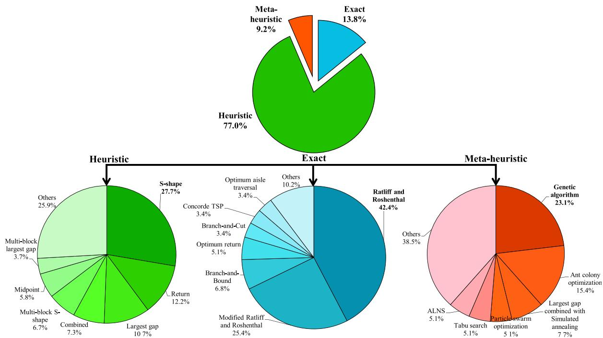

Fig. 6. Frequencies of usage of the different routing policies.

- • *Fishbone aisle-by-aisle*: This heuristic proceeds sequentially from the left to the right part of the warehouse and applies the *aisle-by-aisle* strategy to each part.

Henn et al. (2013) developed a heuristic routing procedure for a U-shaped layout that was presented earlier in Gerking (2009). The U-shaped layout consists of a central aisle arranged in the form of a U, with various picking aisles extending from the central aisle. The central and front cross aisles are wide aisles that allow order pickers to pass each other, while all other aisles are narrow. Narrow aisles cannot be entered with a picking device. As a result, the picker only travels on the central aisle with his/her device and enters the actual picking aisles without the device. This entails that a picking aisle may have to be visited more than once if multiple items are requested from this aisle, which was referred to as the *return-with-replication* policy (see also Kunder and Gudehus, 1975). If a requested item is stored in the central block, the order picker can enter the aisle either from the right or from the left of the central aisle, depending on which option gives the shortest route. During walking in the central aisle, the picker has to decide about whether to pick the requested items from the left or from the right of the central aisle since only one-way traffic is allowed in the central aisle. The corresponding routing heuristic was referred to as *walking-the-U*.

Glock and Grosse (2012) also studied a U-shaped warehouse with two parallel shelves and a third shelf that is perpendicular to the two parallel shelves and considered the layout design, storage assignment and order picker routing problems in this case. The authors assumed that the order picker has a limited transport capacity, such that an order may have to be split up into multiple tours. This variant of the capacitated vehicle routing problem was solved using a *sweep algorithm*.

### 5.2.3. Meta-heuristics

Recently, Zhou et al. (2019) developed three routing meta-heuristics, namely a GA, an ACO approach, and a *cuckoo* algorithm to solve the order picker routing problem in non-conventional fishbone warehouses with narrow aisles and a single storage system. The authors compared the performance of these three algorithms in terms of average tour length and computing time and found that (based on their analysis) the *cuckoo* algorithm is better than ACO and ACO is better than the GA.

### 5.3. General warehouses

Singh and van Oudheusden (1997) studied the case of a warehouse with scattered storage. The authors did not consider a particular warehouse layout, but instead formulated the problem as a variant of the travelling purchaser problem, where the objective is to find a tour that minimizes the sum of travelling and commodity cost. The authors presented a *branch-and-bound* algorithm for this problem that works for any kind of distance matrix that considers travel distances from one storage location to another.

Daniels et al. (1998) also studied the order picker routing problem with scattered storage without assuming a specific layout. The author applied modified *nearest neighbor* and *shortest arc* heuristics as well as a *tabu search* approach to solve the problem.

Recently, Ardjmand et al. (2019) investigated the order batching and order picker routing problem in a put wall-based order picking systems. Two GAs with random shuffling and inverse-insert-swap mutation operations, a *list-based simulated annealing (LBSA)*, and a hybrid of a GA and an *LBSA* were proposed to solve this problem. The warehouse investigated in their study is a general warehouse with a single storage system. A picking tour starts at the put wall, continues through the warehouse for retrieving requested items, and returns to the put wall to position each retrieved item in a specific put wall container.

## 6. Discussion

### 6.1. Frequencies of usage

This section analyzes how frequently the routing policies contained in the core sample have been used in the literature. For this purpose, we analyze the frequencies of usage of these policies in all 203 sampled papers (core and extended sample).

Fig. 6 shows that heuristics have enjoyed the highest popularity in the literature, accounting for 77.0% of all sampled papers. Even though heuristics usually do not generate an optimal route and their gaps to the optimal solutions can be large at times, they have widely been used as they are easy to implement and easy to understand by the order pickers. In addition, some authors mentioned that heuristics generate tours that

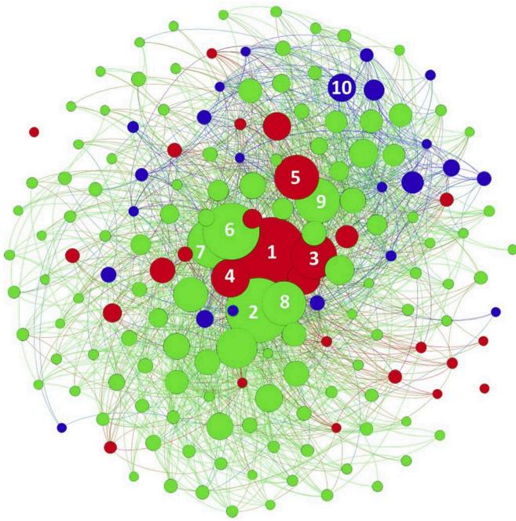

Fig. 7. Citation analysis of the papers in the core and extended sample.

are intuitive to the order picker, which may be another reason for their popularity (e.g., Petersen et al., 2004). Finally, they are often easier to adapt to alternative layouts, whereas exact algorithms are often dedicated to specific warehouse layouts.

Exact algorithms were applied in 13.8% of the sampled papers. Some researchers have noted that exact algorithms are only infrequently used in practice because optimal routes may seem illogical to the order pickers (e.g., De Koster et al., 2007), which may confuse them, inducing deviations from the route (e.g., Petersen and Aase, 2004; Elbert et al., 2017). This could be one reason for the comparatively low popularity of exact algorithms in the literature. Meta-heuristics have also not attracted much attention in the literature so far. As can be seen in Fig. 6, they account for only 9.2% of the sampled papers. However, the use of meta-heuristics has recently increased (see Fig. 8), and they could become more popular in the future.

A more detailed analysis of the algorithm categories shows that the *S-shape* heuristic is by far the most popular heuristic, followed by the *return* and *largest gap* policies, which account for 27.7%, 12.2%, and 10.7% of the sampled papers using a heuristic, respectively. According to the authors' experience, the *S-shape* policy is frequently used in practice because of its simplicity, which could be one reason for its popularity in the literature. In terms of exact algorithms, the top three most popular policies are those of RR, its modifications (e.g., De Koster and Van der Poort, 1998; Roodbergen and De Koster, 2001a), and the *branch-and-bound* procedure, which account for 42.4%, 25.4%, and 6.8% of the sampled papers applying an exact algorithm, respectively. The popularity of RR's algorithm and its modifications is mainly due to its low run-time, which enables warehouse managers to compute optimal order picking routes quickly. The algorithm of RR and its modifications can solve any realistically-sized problem within fractions of seconds, which is not the case for standard TSP algorithms (Scholz et al., 2016). *Branch-and-bound* algorithms have also been used to find order picking tours with minimal length. Their run-time, however, often prohibits their use in practice. As to meta-heuristics, the three most popular algorithms are *genetic algorithms*, *ant colony optimization*, and *largest gap combined with simulated annealing*, which account for 23.1%, 15.4%, and 7.7% of the

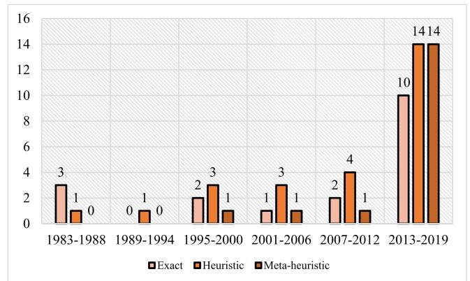

Fig. 8. Number of order picker routing policies in the core sample per year of publication.

sampled papers applying a meta-heuristic, respectively. These heuristics enjoyed an especially high popularity for complex order picking problems that are difficult to solve (Van Gils et al., 2018), e.g. joint order batching and order picker routing problems such as the one discussed in Li et al. (2017).

## 6.2. Citation analysis

A citation analysis can be used to illustrate the connectivity between papers in a literature sample and to identify works that have been pivotal for shaping a specific research field (e.g., Fahimnia et al., 2015; Calma and Davies, 2016). Fig. 7 aims at highlighting key papers (i.e., papers that have been cited very often) in the research field of order picker routing by type of algorithm. It shows the citation graph obtained for the papers in our sample using the Fruchterman Reingold layout in Gephi (<https://gephi.org/>). The nodes in the graph represent the papers in the core and extended samples, and the edges represent the local citations among them. The size of the nodes reflects the number of local citations a paper received within our sample. Nodes are categorized by different colors according to the main type of algorithm developed/used in the paper (i.e., red: exact; green: heuristic; blue: meta-heuristic). As can be seen, two papers adopt a key position in order picker routing: 1) Ratliff and Rosenthal (1983) and 2) Hall (1993) (marked with numbers 1 and 2 in the graph), receiving 94 and 84 local citations in our sample, respectively. Fig. A2 in the appendix further illustrates the citation network of these two key papers. As can be seen, these two papers inspired various works on order picker routing, and they have been relevant for all three types of algorithms discussed in this review. Other major papers that contributed especially towards the development and application of optimal routing algorithms that received ample citations are 3) Roodbergen and De Koster (2001a), 4) De Koster and Van der Poort (1998), and 5) Gademann and Velde (2005). With regard to the development of heuristics, the papers of 6) Roodbergen and De Koster (2001b), 7) Petersen (1997), 8) Petersen and Schmenner (1999), and 9) De Koster et al. (1999) are the most cited works. Besides RR and Hall (1993), also the paper of Roodbergen and De Koster (2001b) is at the center of our citation graph, which illustrates that it is connected to the three algorithm categories in a quite balanced way (cf. Fig. A2). The most cited paper proposing a meta-heuristic for order picker routing is 10) Tsai et al. (2008). Fig. A2 shows that this paper is connected especially to other works proposing meta-heuristics and to papers that propose or apply heuristics. Fig. A3 illustrates the most contributing authors who published works contained in our core and extended samples, and Fig. A4a highlights their collaboration structure (again developed using Gephi). As can be seen, there are few main clusters of authors who frequently published together in a specific sub-area of order picker

routing. Three imporoportant clusters are authors around de Koster and Roodbergen especially for exact algorithms, Petersen and co-authors for heuristic algorithms, and Chen and colleagues for meta-heuristics (see Fig. A4b–d). Finally, Fig. A5 shows the most cited papers contained in our core sample according to their citations in Google Scholar to highlight the attention the core journal papers received also outside of our (core and extended) sample.

### 6.3. Main insights

Table S1 in the online supplement to this paper classifies all papers contained in the core sample in light of the conceptual framework, including warehouse layout, warehouse operations, and algorithm characteristics. As can be seen, the majority of the proposed algorithms focused on conventional, rectangular warehouses, accounting for 83% (45 out of 54) of the sampled works. The most frequently discussed conventional warehouses were single-block warehouses (53%; 24 out of 45 papers), which could be a result of their high level of space utilization. Furthermore, the majority of routing algorithms were developed for narrow-aisle warehouses with a single depot and low-level storage racks. In terms of warehouse operations, most of the proposed routing algorithms were confined to a single order picker and a single storage system without considering any interdependencies, e.g. picker blocking. The studies of Chen et al. (2013, 2016) and Schrotenboer et al. (2017) are the only three studies that proposed routing algorithms considering picker blocking in warehouses. Moreover, most of the studies focused on static picking systems, and only two studies developed routing algorithms for dynamic picking systems (Lu et al., 2016 and De Santis et al., 2018). With respect to order picker routing with precedence constraints, only four papers considered this scenario.

Algorithms for routing order pickers through a warehouse were assigned to three categories in this review, namely exact algorithms, heuristics, and meta-heuristics. Table S1 shows that 18 out of 61 algorithms we identified are exact algorithms, 26 are heuristics, and 17 are meta-heuristics. Fig. 8 shows that all three types of routing policies have enjoyed an increasing popularity over the years; we could, however, not identify a trend that indicates that one type has become (much) more popular than the two others over time. Exact algorithms that exploit the special distance matrices that occur in warehouses have frequently been proposed in the past. They are mainly based on the algorithm proposed by RR. The most common features of the exact algorithms based on RR are that they first construct a graph representation, generate Eulerian subgraphs, and then define PTSs. They do not consider each PTS separately, but group PTSs according to their equivalence classes.

Unlike exact algorithms, heuristics were proposed for approximating solutions, and they are often easier to implement. The results of our review showed that two types of routing heuristics were proposed: (i) *constructive heuristics* and (ii) *improvement heuristics*. The first category can be further divided into *simple heuristics* (e.g., *S-shape*, *largest gap*, *composite*) and *TSP heuristics* (e.g., *LKH*, *nearest neighbor*, *savings algorithm*). *Simple heuristics* are simple ‘rules of thumb’ that can be used for generating straightforward and easy-to-memorize routes. A *simple heuristic* continuously searches for solutions and stops when a solution is found. *Improvement heuristics* usually employ a hybrid method that tries to improve an initial solution that has been generated by either a *simple heuristic* or a *TSP heuristic*. Our results revealed that the *2-opt* and *3-opt* local searches have been frequently used to improve initial tours. Even though routing heuristics have attracted the attention of researchers due to their short run time and their applicability, the biggest drawback of routing heuristics is that their optimality gaps can be large at times. Results reported in the literature show that exact algorithms obtain tour lengths that are between 4% and 18% (Goetschalck and Ratliff, 1988a), 7% and 34% (De Koster and Van der Poort, 1998), 1% and 25% (Roodbergen and De Koster, 2001b), 24.3% (Jang and Sun, 2012), 9% and 38% (Çelik and Süral, 2014), 12% (Lu et al., 2016) shorter than those generated by heuristics. The optimality gaps of the heuristics

depend on several factors such as warehouse layouts, warehouse sizes, pick-list sizes, and the solution of other order picking planning problems. For example, Çelik and Süral (2014) reported that the optimality gaps of heuristics investigated in their work decrease when the depth/width ratio of the investigated warehouses increases.

Meta-heuristics have especially been used to solve order picker routing problems that were studied in combination with other planning problems (e.g., batching, storage assignment). The *genetic algorithm (GA)* is the most popular meta-heuristic for order picker routing. One of the most important decisions when implementing a GA is to decide on the solution representation. In order picker routing, we found that the most commonly used solution representation of the GA is one where the value of a gene denotes the storage location of a requested item, and the order of the genes in a chromosome represent the visiting sequence of the storage locations. Moreover, we found that the most frequently used crossover operator is the *partially matched crossover*.

### 6.4. Research opportunities

From the analysis of the papers contained in the core and extended samples, we identified various research opportunities for further developing the research field of order picker routing in warehouses. We categorize the research opportunities with respect to warehouse layouts and warehouse operations. For each category, we formulate research opportunities by priority and relevance to practice.

With respect to *warehouse layouts*, our first observation is that most papers that proposed exact algorithms focused on (conventional or non-conventional) warehouses with a single depot. In practice, however, warehouses may have multiple depots (cf. De Koster and Van der Poort, 1998; Matusiak et al., 2014). Therefore, future research could generalise the existing exact algorithms to warehouses with multiple depots. A second observation is that the majority of the proposed exact algorithms were dedicated to the conventional warehouse (see Table S1 in the online supplement). In contrast, we found only three papers that proposed exact algorithms for solving the order picker routing problem in non-conventional warehouses, namely the fishbone and the flying-V (cf. Çelik and Süral, 2014), the U-shaped picking zone (cf. Glock et al., 2019), and the discrete cross aisle layout (cf. Öztürkoğlu and Hoser, 2019). Consequently, there is a strong need for developing exact routing algorithms for other non-conventional warehouses such as other U-shaped layouts (Henn et al., 2013), the inverted-V (Gue et al., 2012), the chevron, the leaf, and the butterfly layouts (Öztürkoğlu et al., 2012). A third observation is that order picker routing policies for the fishbone warehouse have not received much attention by researchers so far, despite the existing evidence that this layout is used in practice (Öztürkoğlu et al., 2012). Hence, developing additional order picker routing policies for the fishbone warehouse could be an interesting topic for future research. A fourth observation is that prior studies that proposed exact routing algorithms for an entire warehouse (in contrast to single aisle only) have almost consistently assumed that the order picker can reach the requested items from both sides of the aisle without having to cross to the other side of the aisle. To fill this research gap, future research could study optimal routing for (entire) wide-aisle warehouses where additional horizon travels within an aisle are taken account of. Another observation we made is that works proposing exact algorithms studied warehouses with either purely wide or purely narrow aisles. We only identified a single paper that used the *S-shape* heuristic to estimate travel time in a warehouse with both wide and narrow aisles (Mowrey and Parikh, 2014). Therefore, it would be interesting to develop exact algorithms for order picker routing in a mixed-width aisle warehouse. We also noticed that there is no exact algorithm for order picker routing in warehouses with access restrictions as described in Chen et al. (2019a, b), which would be another interesting research opportunity.

With respect to *order picking operations*, almost all routing algorithms found in this review focused on a single storage system. Only 4 out of 54 papers in the core sample addressed the routing problem in a scattered

storage system (Singh and van Oudheusden, 1997; Daniels et al., 1998; Weidinger, 2018; Weidinger et al., 2019). Therefore, there may be opportunities for developing routing algorithms for this area as scattered storage systems are applied in many real-world warehouses (see Weidinger, 2018). A further topic that has only attracted little attention so far is the routing of order pickers subject to precedence constraints, e.g. based on item weight or item category (food/non-food) (see Chabot et al., 2017; Žulj et al., 2018). According to our experience, the current state-of-research does not reflect the importance precedence constraints enjoy in practice, and therefore we recommend the order picker routing problem with precedence constraints for future research.

The number of papers focusing on the combination of multiple order picking planning problems has increased over the last decade. Solving combined planning problems can lead to an improved warehouse performance (see Van Gils et al., 2018). Consequently, future research could continue to investigate the interaction between multiple problems, e.g. order picker routing and batching, order picker routing and storage assignment etc. Since the resulting problems are usually very complex, meta-heuristics could be promising solution approaches.

Several warehouses of online retailers apply dynamic order picking (Gong and De Koster, 2008). However, the results of our review show that dynamic order picker routing is another topic that has not attracted much attention so far. In a dynamic environment, pick-lists can be updated while the order picking process is in progress due to incoming orders that are added to the current tour (e.g., Lu et al., 2016). Our review showed that the optimal routing of order pickers in dynamic environments has thus far only been addressed by Lu et al. (2016) for a single-block warehouse. Therefore, future research could develop exact routing algorithms for situations where items are dynamically added to existing tours. The algorithm could then find a new optimal route that starts at the current position of the order picker and ends at the depot.

Our review also showed that an exact routing algorithm that accounts for picker congestion was not proposed so far. Therefore, future research could focus on developing exact routing algorithms for the case where congestion may occur within aisles. Once congestion occurs, new optimal routes would have to be calculated for all order pickers involved in the congestion. One possible way to approach this problem is to apply some dedicated rules according to the spatial relationship between a picked item and a next target item as proposed by Chen et al. (2013).

Another observation is that Çelik and Süral (2016) were the only to investigate turn penalties that take into account the time that is lost when the order picker changes the direction of travel. Future research could extend their work to other warehouse layouts, e.g. multi-block warehouses or non-conventional warehouses.

Finally, Grosse et al. (2017) pointed out that order picker routing interacts with human factors aspects, such as fatigue, learning or injury risks. Our review showed, however, that human factors aspects have so far only been considered very infrequently (only 1 out of 54 papers in the core sample). Future research could hence propose routing algorithms that take into account the interaction between order picker routing and human factors aspects.

## 7. Conclusion

Order picker routing in warehouses has become an important planning task in every manual order picking system. Travelling through the warehouse for retrieving requested items from storage locations consumes a significant amount of an order picker's working time. To reduce

travel time, various order picker routing policies have been proposed in the literature over the last decades. To map the research field of order picker routing and to classify all existing algorithms and warehouse-specific routing procedures, the paper at hand conducted a systematic review of the literature on order picker routing problems. A conceptual framework was proposed for classifying the different routing policies that have emerged in the literature. Using this framework, we categorized the existing literature with regard to the type of algorithm (exact, heuristic, and meta-heuristic) and warehouse layout (conventional, non-conventional, and general). We provided a structured discussion of the existing routing algorithms following the conceptual framework. We conclude that research on order picker routing in warehouses has received much attention especially over the last five years, where 63.0% of the core sample papers and 55.0% of the extended sample papers have been published. This increasing trend may be an indicator of the importance of order picker routing both in research and practice, despite the automation efforts that are currently made in many industries. We also note that algorithms employed for solving the order picker routing problem differ in terms of their accuracy and computational complexity. Heuristics (77.0% of all sampled papers) have enjoyed the highest popularity in the literature, whereas exact algorithms (13.8% of all sampled papers) have received less attention. Meta-heuristics (9.2% of all sampled papers) have enjoyed the highest popularity for solving combined order picking planning problems that are difficult to solve. Our review shows that the majority of the proposed algorithms focused on conventional warehouses. In contrast, only 6 out of 54 papers contained in the core sample addressed the order picker routing problem in non-conventional warehouses (cf. Glock and Grosse, 2012; Henn et al., 2013; Çelik and Süral, 2014; Glock et al., 2019; Öztürkoğlu and Hoser, 2019; Zhou et al., 2019). For several non-conventional warehouses, there is further potential for developing exact, heuristic and meta-heuristic routing policies.

Our discussion of the state-of-knowledge of order picker routing shows that there is potential for future research to develop exact algorithms for the routing of order pickers, both for non-conventional warehouses and/or for order picking in specific scenarios, e.g. under dynamic picking, picker congestion, turn penalties, or precedence constraints.

The review paper at hand has limitations. We only considered papers relevant for this study that were published in peer-reviewed journals, whereas papers that appeared in other outlets (e.g. book chapters or conference proceedings) were excluded from the review. These filters may have led to the exclusion of relevant work from this review. In addition, besides some (anecdotal) evidence found in the reviewed papers, we were not able to report how frequently the different routing policies and warehouse layout types are used in practice. Future research could therefore extend the scope of this review to derive additional insights into the practical use of order picker routing policies and their implementation in warehouse management software. Moreover, our review studied order picker routing for manual picker-to-parts systems. We did not consider the routing of robots in automated warehouses. The routing of robots may differ from the routing of order pickers, e.g. due to a limited battery capacity or constraints on human-robot-interaction. Future research could further investigate the routing of robots to gain insights into routing problems in warehousing triggered by digitalization efforts. The reader is referred to Azadeh et al. (2019) for a recent overview of robotized and automated warehouse systems.

**Table A1**

Review protocol for the core sample.

| Filter type                   | Descriptions and guidelines                                                                                                                                                                                                                                                                                                                                                                                                                                                                                                                                                | Results           |
|-------------------------------|----------------------------------------------------------------------------------------------------------------------------------------------------------------------------------------------------------------------------------------------------------------------------------------------------------------------------------------------------------------------------------------------------------------------------------------------------------------------------------------------------------------------------------------------------------------------------|-------------------|
| Inclusion criteria            | Topic: Papers with a focus on order picker routing in a warehouse Peer-reviewed journals: Academic journal papers Language: Limited to English Time span: Not limited                                                                                                                                                                                                                                                                                                                                                                                             |                   |
| Keywords combination          | “order picking and route” or “order picking and routeing” or “order picking and routing” or “order picking and layout” or “order-picking and route” or “order-picking and routeing” or “order-picking and routing” or “order-picking and layout” or “warehouse and route” or “warehouse and routeing” or “warehouse and routing” or “warehouse and layout” or “warehousing and route” or “warehousing and routeing” or “warehousing and routing” or “warehousing and layout” or “picker and route” or “picker and routeing” or “picker and routing” or “picker and layout” |                   |
| Keyword search                | Search selected online databases with the keyword combinations defined above. Ensure substantive relevance by requiring that all papers contain at least one keyword combination in their title, abstract or list of keywords.                                                                                                                                                                                                                                                                                                                                          | EH 337 Scopus 735 |
| Consolidation I               | Ensure relevance of content by subjecting all papers to a manual analysis of their abstracts. Results from selected databases were consolidated and duplicate papers were eliminated.                                                                                                                                                                                                                                                                                                                                                                                   | 62 62             |
| Consolidation II              | Ensure relevance by completely reading all papers left in the sample.                                                                                                                                                                                                                                                                                                                                                                                                                                                                                                      | 36                |
| Snowball approach             | Search for additional papers in backward/forward snowball searches based on all previously selected papers.                                                                                                                                                                                                                                                                                                                                                                                                                                                                | 10                |
| Expert consultation           | Discuss search results with experts to identify missing papers.                                                                                                                                                                                                                                                                                                                                                                                                                                                                                                            | 8                 |
| <b>Final core sample size</b> |                                                                                                                                                                                                                                                                                                                                                                                                                                                                                                                                                                            | <b>54</b>         |

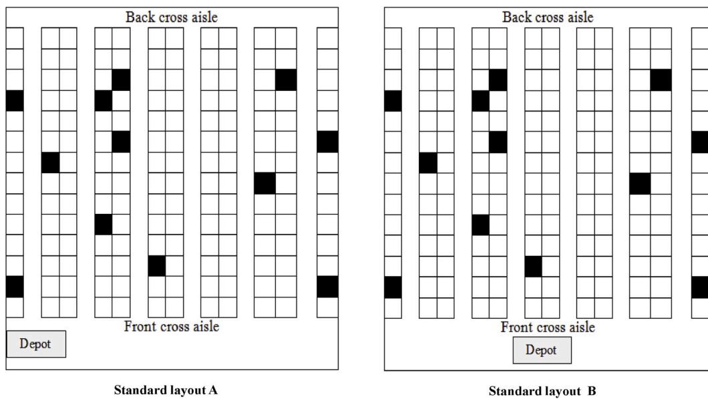

**Fig. A1.** Standard warehouse layouts.

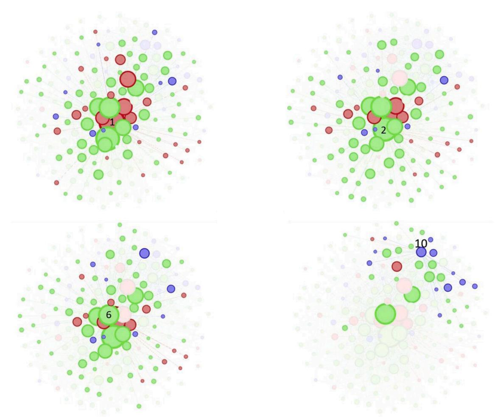

**Fig. A2.** Citation networks of 1) [Ratliff and Rosenthal \(1983\)](#page-21-0), 2) [Hall \(1993\)](#page-20-0), 6) [Roodbergen and De Koster \(2001b\)](#page-21-0), and 10) [Tsai et al. \(2008\)](#page-21-0).

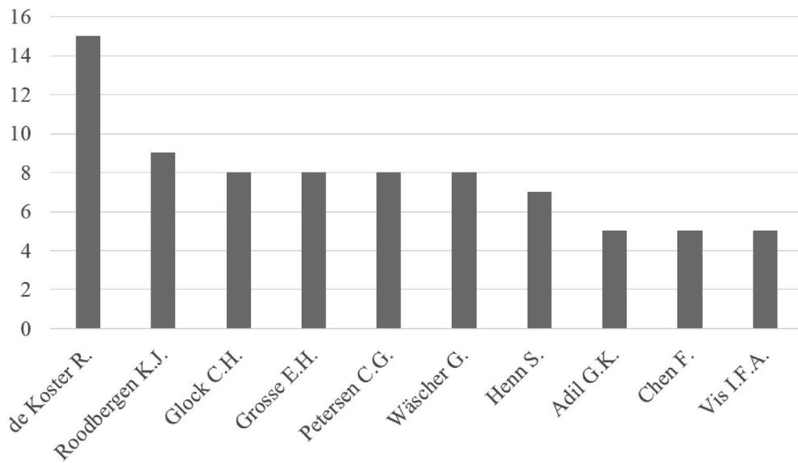

**Fig. A3.** Most contributing authors in the core and extended samples.

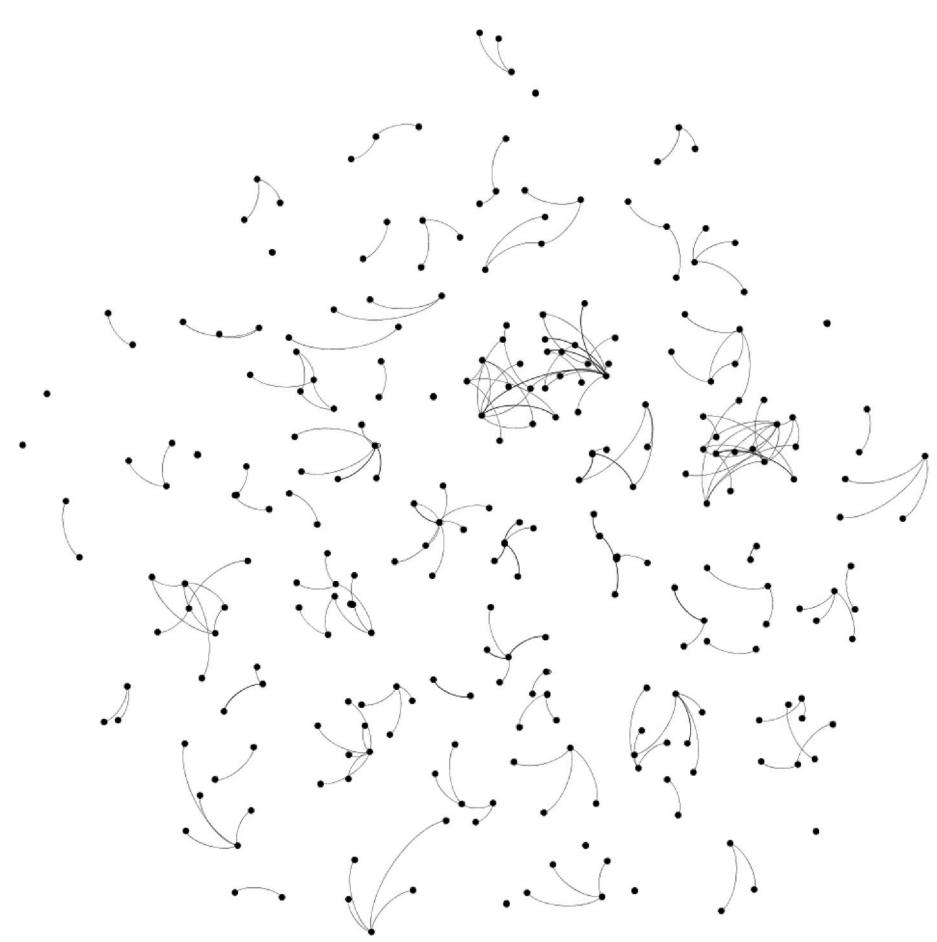

**Fig. A4a.** Collaboration structure in the core and extended samples.

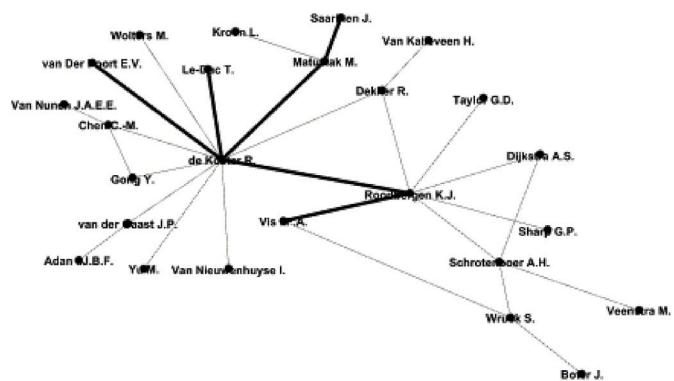

**Fig. A4b.** Author cluster including de Koster and Roodbergen.

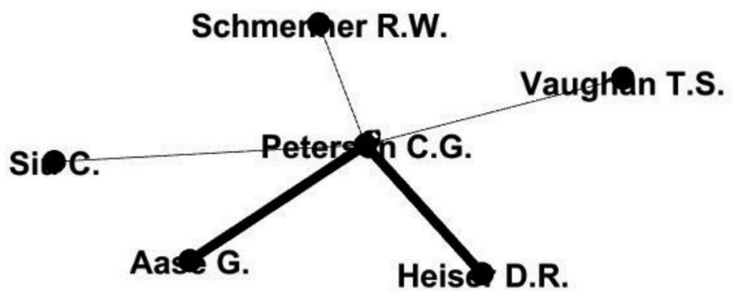

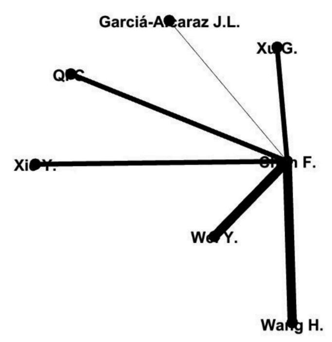

**Fig. A4d.** Author cluster including Chen.

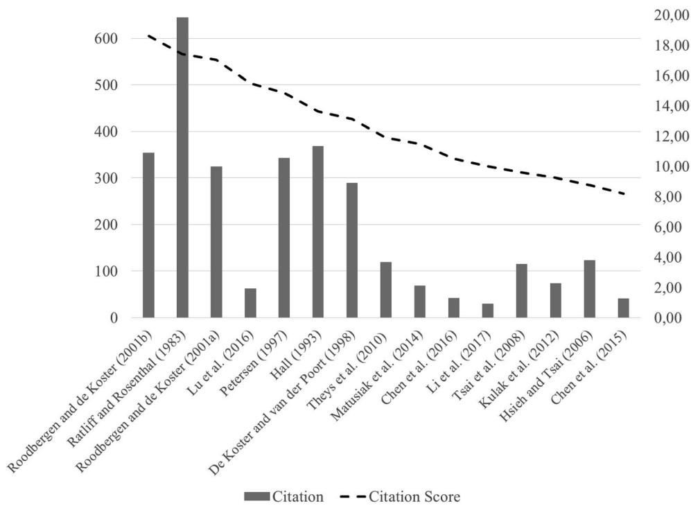

**Fig. A5.** Most frequently cited papers in the core sample3 .

3 [Fig. A5](#page-16-0) shows both total number of citations (in Google Scholar by August 2019) and a citation score that takes into account the number of citations a paper received since publication divided by the number of years since publications. The papers a ranked according to the citation score.

Supplementary data to this article can be found online at <https://doi.org/10.1016/j.ijpe.2019.107564>.

## References

Applegate, D., Bixby, R., Chvátal, V., Cook, W., 2008. Concorde TSP solver. <http://www.tsp.gatech.edu/concorde/>.

\* Ardjmand, E., Shakeri, H., Singh, M., Bajgiran, O.S., 2018. Minimizing order picking makespan with multiple pickers in a wave picking warehouse. *Int. J. Prod. Econ.* 206, 169–183.

\* Ardjmand, E., Bajgiran, O.S., Youssef, E., 2019. Using list-based simulated annealing and genetic algorithm for order batching and picker routing in put wall based picking systems. *Appli. Soft Comput. J.* 75, 106–119.

Azadeh, K., De Koster, R., Roy, D., 2019. Robotized and automated warehouse systems: review and recent developments. *Transp. Sci.* 53 (4), 917–945.

Barachet, L.L., 1957. Letter to the editor-graphic solution of the traveling-salesman problem. *Oper. Res.* 5 (6), 841–845.

Bartholdi III, J.J., Ratliff, H.D., 1978. Unnetworks, with applications to idle time scheduling. *Manag. Sci.* 24 (8), 850–858.

\* Bódis, T., Botzheim, J., 2018. Bacterial memetic algorithms for order picking routing problem with loading constraints. *Expert Syst. Appl.* 105, 196–220.

Boysen, N., de Koster, R., Weidinger, F., 2019. Warehousing in the e-commerce era: a survey. *Eur. J. Oper. Res.* 277 (2), 396–411.

Cambazard, H., Catusse, N., 2018. Fixed-parameter algorithms for rectilinear Steiner tree and rectilinear traveling salesman problem in the plane. *Eur. J. Oper. Res.* 270 (2), 419–429.

Calma, A., Davies, M., 2016. Academy of management journal, 1958–2014: a citation analysis. *Scientometrics* 108 (2), 959–975.

\* Çelik, M., Süral, H., 2014. Order picking under random and turnover-based storage policies in fishbone aisle warehouses. *IIE Trans.* 46 (3), 283–300.

\* Çelik, M., Süral, H., 2016. Order picking in a parallel-aisle warehouse with turn penalties. *Int. J. Prod. Res.* 54 (14), 4340–4355.

\* Çelik, M., Süral, H., 2019. Order picking in parallel-aisle warehouses with multiple blocks: complexity and a graph theory-based heuristic. *Int. J. Prod. Res.* 57 (3), 888–906.

Cergibozan, Ç., Tasan, A.S., 2016. Order batching operations: an overview of classification, solution techniques, and future research. *J. Intell. Manuf.* 1–15.

\* Chabot, T., Lahyani, R., Coelho, L.C., Renaud, J., 2017. Order picking problems under weight, fragility and category constraints. *Int. J. Prod. Res.* 55 (21), 6361–6379.

\* Charkhgard, H., Savelsbergh, M., 2015. Efficient algorithms for travelling salesman problems arising in warehouse order picking. *ANZIAM J.* 57 (2), 166–174.

\* Chen, F., Wang, H., Qi, C., Xie, Y., 2013. An ant colony optimization routing algorithm for two order pickers with congestion consideration. *Comput. Ind. Eng.* 66 (1), 77–85.

\* Chen, F., Wang, H., Xie, Y., Qi, C., 2016. An ACO-based online routing method for multiple order pickers with congestion consideration in warehouse. *J. Intell. Manuf.* 27 (2), 389–408.

\* Chen, F., Xu, G., Wei, Y., 2019a. Heuristic routing methods in multiple-block warehouses with ultra-narrow aisles and access restriction. *Int. J. Prod. Res.* 57 (1), 228–249.

\* Chen, F., Xu, G., Wei, Y., 2019b. An integrated metaheuristic routing method for multiple-block warehouses with ultra narrow aisles and access restriction. *Complexity*. <https://doi.org/10.1155/2019/1280285>.

\* Chen, T.L., Cheng, C.Y., Chen, Y.Y., Chan, L.K., 2015. An efficient hybrid algorithm for integrated order batching, sequencing and routing problem. *Int. J. Prod. Econ.* 159, 158–167.

Clarke, G., Wright, J.W., 1964. Scheduling of vehicles from a central depot to a number of delivery points. *Oper. Res.* 12 (4), 568–581.

Cooper, H., 2010. Research Synthesis and Meta-Analysis: A Step-by-step Approach, fourth ed. Sage publications, Thousand Oaks.

Cormier, G., Gunn, E.A., 1992. A review of warehouse models. *Eur. J. Oper. Res.* 58 (1), 3–13.

\* Cortés, P., Gómez-Montoya, R.A., Muñuzuri, J., Correa-Espinal, A., 2017. A tabu search approach to solving the picking routing problem for large-and medium-size distribution centres considering the availability of inventory and K heterogeneous material handling equipment. *Appl. Soft Comput.* 53, 61–73.

Croes, G.A., 1958. A method for solving traveling-salesman problems. *Oper. Res.* 6 (6), 791–812.

\* Daniels, R.L., Rummel, J.L., Schantz, R., 1998. A model for warehouse order picking. *Eur. J. Oper. Res.* 105 (1), 1–17.

Davarzani, H., Norman, A., 2015. Toward a relevant agenda for warehousing research: literature review and practitioners' input. *Logist. Res.* 8 (1), 1.

\* De Koster, R., Van der Poort, E., 1998. Routing order pickers in a warehouse: a comparison between optimal and heuristic solutions. *IIE Trans.* 30 (5), 469–480.

De Koster, M.B.M., Van der Poort, E.S., Wolters, M., 1999. Efficient order batching methods in warehouses. *Int. J. Prod. Res.* 37 (7), 1479–1504.

De Koster, R., Le-Duc, T., Roodbergen, K.J., 2007. Design and control of warehouse order picking: a literature review. *Eur. J. Oper. Res.* 182 (2), 481–501.

\* De Santis, R., Montanari, R., Vignali, G., Bottani, E., 2018. An adapted ant colony optimization algorithm for the minimization of the travel distance of pickers in manual warehouses. *Eur. J. Oper. Res.* 267 (1), 120–137.

Dijkstra, E.W., 1959. A note on two problems in connexion with graphs. *Numer. Math.* 1 (1), 269–271.

Elbert, R.M., Franzke, T., Glock, C.H., Grosse, E.H., 2017. The effects of human behavior on the efficiency of routing policies in order picking: the case of route deviations. *Comput. Ind. Eng.* 111, 537–551.

Fahimnia, B., Sarkis, J., Davarzani, H., 2015. Green supply chain management: a review and bibliometric analysis. *Int. J. Prod. Econ.* 162, 101–114.

Fazlollahtabar, H., Saidi-Mehrabad, M., Balakrishnan, J., 2015. Mathematical optimization for earliness/tardiness minimization in a multiple automated guided vehicle manufacturing system via integrated heuristic algorithms. *Robot. Auton. Syst.* 72, 131–138.

Floyd, R.W., 1962. Algorithm 97: shortest path. *Commun. ACM* 5 (6), 345.

Franzke, T., Grosse, E.H., Glock, C.H., Elbert, R., 2017. An investigation of the effects of storage assignment and picker routing on the occurrence of picker blocking in manual picker-to-parts warehouses. *Int. J. Logist. Manag.* 28 (3), 841–863.

Gademann, A.N., 1999. Optimal routing in an automated storage/retrieval system with dedicated storage. *IIE Trans.* 31 (5), 407–415.

Gademann, N., Velde, S., 2005. Order batching to minimize total travel time in a parallel-aisle warehouse. *IIE Trans.* 37 (1), 63–75.

Gerking, H., 2009. Kommissionierstrategien: schleife, stichgang, walking the U. In: Pulverich, M., Schietinger, J. (Eds.), *Handbuch Kommissionierung*. Vogel, München, pp. 148–155.

\* Glock, C.H., Grosse, E.H., 2012. Storage policies and order picking strategies in U-shaped order-picking systems with a movable base. *Int. J. Prod. Res.* 50 (16), 4344–4357.

\* Glock, C.H., Grosse, E.H., Abedinnia, H., Emde, S., 2019. An integrated model to improve ergonomic and economic performance in order picking by rotating pallets. *Eur. J. Oper. Res.* 273 (2), 516–534.

Glock, C.H., Grosse, E.H., Elbert, R.M., Franzke, T., 2017. Maverick picking: the impact of modifications in work schedules on manual order picking processes. *Int. J. Prod. Res.* 55 (21), 6344–6360.

\* Goetschalckx, M., Ratliff, H.D., 1988a. Order picking in an aisle. *IIE Trans.* 20 (1), 53–62.

\* Goetschalckx, M., Ratliff, H.D., 1988b. An efficient algorithm to cluster order picking items in a wide aisle. *Eng. Costs Prod. Econ.* 13 (4), 263–271.

Gong, Y., De Koster, R., 2008. A polling-based dynamic order picking system for online retailers. *IIE Trans.* 40 (11), 1070–1082.

\* Grosse, E.H., Glock, C.H., Ballester-Ripoll, R., 2014. A simulated annealing approach for the joint order batching and order picker routing problem with weight restrictions. *Int. J. Oper. Quant. Manag.* 20 (2), 65–83.

Grosse, E.H., Glock, C.H., Neumann, W.P., 2017. Human factors in order picking: a content analysis of the literature. *Int. J. Prod. Res.* 55 (5), 1260–1276.

Grosse, E.H., Glock, C.H., Jaber, M.Y., Neumann, W.P., 2015. Incorporating human factors in order picking planning models: framework and research opportunities. *Int. J. Prod. Res.* 53 (3), 695–717.

Gu, J., Goetschalckx, M., McGinnis, L.F., 2007. Research on warehouse operation: a comprehensive review. *Eur. J. Oper. Res.* 177 (1), 1–21.

Gue, K.R., Meller, R.D., 2009. Aisle configurations for unit-load warehouses. *IIE Trans.* 41 (3), 171–182.

Gue, K.R., Ivanović, G., Meller, R.D., 2012. A unit-load warehouse with multiple pickup and deposit points and non-traditional aisles. *Transp. Res. Part E Logist. Transp. Rev.* 48 (4), 795–806.

\* Hall, R.W., 1993. Distance approximations for routing manual pickers in a warehouse. *IIE Trans.* 25 (4), 76–87.

Hart, P.E., Nilsson, N.J., Raphael, B., 1968. A formal basis for the heuristic determination of minimum cost paths. *IEEE Trans. Syst. Sci. Cybern.* 4 (2), 100–107.

Helsgaun, K., 2000. An effective implementation of the Lin-Kernighan traveling salesman heuristic. *Eur. J. Oper. Res.* 126 (1), 106–130.

\* Henn, S., Koch, S., Gerking, H., Wäscher, G., 2013. A U-shaped layout for manual order-picking systems. *Logist. Res.* 6 (4), 245–261.

\* Ho, Y.C., Tseng, Y.Y., 2006. A study on order-batching methods of order-picking in a distribution centre with two cross-aisles. *Int. J. Prod. Res.* 44 (17), 3391–3417.

Hochrein, S., Glock, C.H., 2012. Systematic literature reviews in purchasing and supply management research: a tertiary study. *Int. J. Integr. Supply Manag.* 7 (4), 215–245.

\* Hsieh, L.F., Tsai, L., 2006. The optimum design of a warehouse system on order picking efficiency. *Int. J. Adv. Manuf. Technol.* 28 (5–6), 626–637.

IEA Council, 2014. Definition and Domains of Ergonomics. *International Ergonomics Association*. <http://www.iea.cc/whats/>.

\* Jang, H.Y., Sun, J.U., 2012. A graph optimization algorithm for warehouses with middle cross aisles. *Appl. Mech. Mater.* 145, 354–358.

Jünger, M., Naddef, D. (Eds.), 2001. *Computational Combinatorial Optimization: Optimal or Provably Near-Optimal Solutions*, vol. 2241. Springer Science & Business Media.

\* Kulak, O., Sahin, Y., Taner, M.E., 2012. Joint order batching and picker routing in single and multiple-cross-aisle warehouses using cluster-based tabu search algorithms. *Flex. Serv. Manuf. J.* 24 (1), 52–80.

Kunder, R., Gudehus, T., 1975. Mittlere wegzeiten beim eindimensionalen kommissionieren. *Z. Oper. Res.* 19 (2), B53–B72.

Laporte, G., 1986. Generalized subtour elimination constraints and connectivity constraints. *J. Oper. Res. Soc.* 37 (5), 509–514.

\* Li, J., Huang, R., Dai, J.B., 2017. Joint optimisation of order batching and picker routing in the online retailer's warehouse in China. *Int. J. Prod. Res.* 55 (2), 447–461.

\* Lin, C.C., Kang, J.R., Hou, C.C., Cheng, C.Y., 2016. Joint order batching and picker Manhattan routing problem. *Comput. Ind. Eng.* 95, 164–174.

Lin, S., 1965. Computer solutions of the traveling salesman problem. *Bell Syst. Tech. J.* 44 (10), 2245–2269.

Lin, S., Kernighan, B.W., 1973. An effective heuristic algorithm for the traveling-salesman problem. *Oper. Res.* 21 (2), 498–516.

\* Lu, W., McFarlane, D., Giannikas, V., Zhang, Q., 2016. An algorithm for dynamic order-picking in warehouse operations. *Eur. J. Oper. Res.* 248 (1), 107–122.

\* Makris, P.A., Giakoumakis, I.G., 2003. k-Interchange heuristic as an optimization procedure for material handling applications. *Appl. Math. Model.* 27 (5), 345–358.

\* Matusiak, M., de Koster, R., Saarinen, J., 2017. Utilizing individual picker skills to improve order batching in a warehouse. *Eur. J. Oper. Res.* 263 (3), 888–899.

\* Matusiak, M., de Koster, R., Kroon, L., Saarinen, J., 2014. A fast simulated annealing method for batching precedence-constrained customer orders in a warehouse. *Eur. J. Oper. Res.* 236 (3), 968–977.

\* Menéndez, B., Pardo, E.G., Alonso-Ayuso, A., Molina, E., Duarte, A., 2017. Variable neighborhood search strategies for the order batching problem. *Comput. Oper. Res.* 78, 500–512.

Mowrey, C.H., Parikh, P.J., 2014. Mixed-width aisle configurations for order picking in distribution centers. *Eur. J. Oper. Res.* 232 (1), 87–97.

Nemhauser, G.L., Wolsey, L.A., 1988. Integer and Combinatorial Optimization. In: *Interscience Series in Discrete Mathematics and Optimization*. John Wiley & Sons.

Or, I., 1976. Traveling Salesman-type Combinatorial Problems and Their Relation to the Logistics of Regional Blood Banking. Ph.D. Thesis. Department of Industrial Engineering and Management Sciences, Northwestern University, Evanston, IL.

Öztürkoğlu, Ö., Gue, K.R., Meller, R.D., 2012. Optimal unit-load warehouse designs for single-command operations. *IIE Trans.* 44 (6), 459–475.

\* Öztürkoğlu, Ö., Hoser, D., 2019. A discrete cross aisle design model for order-picking warehouses. *Eur. J. Oper. Res.* 275 (2), 411–430.

\* Pansart, L., Catusse, N., Cambazard, H., 2018. Exact algorithms for the order picking problem. *Comput. Oper. Res.* 100, 117–127.

Parikh, P.J., Meller, R.D., 2010. A travel-time model for a person-onboard order picking system. *Eur. J. Oper. Res.* 200 (2), 385–394.

\* Petersen, C.G., 1997. An evaluation of order picking routing policies. *Int. J. Oper. Prod. Manag.* 17 (11), 1098–1111.

Petersen, C.G., Aase, G., 2004. A comparison of picking, storage, and routing policies in manual order picking. *Int. J. Prod. Econ.* 92 (1), 11–19.

Petersen, C.G., Schmenner, R.W., 1999. An evaluation of routing and volume-based storage policies in an order picking operation. *Decis. Sci. J.* 30 (2), 481–501.

Petersen, C.G., Aase, G.R., Heiser, D.R., 2004. Improving order-picking performance through the implementation of class-based storage. *Int. J. Phys. Distrib. Logist. Manag.* 34 (7), 534–544.

\* Pferschy, U., Schauer, J., 2018. Order batching and routing in a non-standard warehouse. *Electron. Notes Discrete Math.* 69, 125–132.

Picard, J.C., Queyranne, M., 1978. The time-dependent traveling salesman problem and its application to the tardiness problem in one-machine scheduling. *Oper. Res.* 26 (1), 86–110.

Potvin, J.Y., Rousseau, J.M., 1993. A parallel route building algorithm for the vehicle routing and scheduling problem with time windows. *Eur. J. Oper. Res.* 66 (3), 331–340.

\* Ratliff, H.D., Rosenthal, A.S., 1983. Order-picking in a rectangular warehouse: a solvable case of the traveling salesman problem. *Oper. Res.* 31 (3), 507–521.

\* Roodbergen, K.J., De Koster, R., 2001a. Routing order pickers in a warehouse with a middle aisle. *Eur. J. Oper. Res.* 133 (1), 32–43.

\* Roodbergen, K.J., De Koster, R., 2001b. Routing methods for warehouses with multiple cross aisles. *Int. J. Prod. Res.* 39 (9), 1865–1883.

Ropke, S., Pisinger, D., 2006. An adaptive large neighborhood search heuristic for the pickup and delivery problem with time windows. *Transp. Sci.* 40 (4), 455–472.

Rouwenhorst, B., Reuter, B., Stockrahm, V., van Houtum, G.J., Mantel, R.J., Zijm, W.H., 2000. Warehouse design and control: framework and literature review. *Eur. J. Oper. Res.* 122 (3), 515–533.

\* Scholz, A., Wäscher, G., 2017. Order Batching and Picker Routing in manual order picking systems: the benefits of integrated routing. *Cent. Eur. J. Oper. Res.* 25 (2), 491–520.

Scholz, A., Henn, S., Stuhlmann, M., Wäscher, G., 2016. A new mathematical programming formulation for the single-picker routing problem. *Eur. J. Oper. Res.* 253 (1), 68–84.

\* Scholz, A., Schubert, D., Wäscher, G., 2017. Order picking with multiple pickers and due dates–simultaneous solution of order batching, batch Assignment and sequencing, and picker routing problems. *Eur. J. Oper. Res.* 263 (2), 461–478.

\* Schrotenboer, A.H., Wruck, S., Roodbergen, K.J., Veenstra, M., Dijkstra, A.S., 2017. Order picker routing with product returns and interaction delays. *Int. J. Prod. Res.* 55 (21), 6394–6406.

Segal, M., 1974. The operator-scheduling problem: a network-flow approach. *Oper. Res.* 22 (4), 808–823.

Selvakumar, A.I., Thanushkodi, K., 2007. A new particle swarm optimization solution to nonconvex economic dispatch problems. *IEEE Trans. Power Syst.* 22 (1), 42–51.

Seuring, S., Gold, S., 2012. Conducting content-analysis based literature reviews in supply chain management. *Supply Chain Manag.: Int. J.* 17 (5), 544–555.

Shah, B., Khanzode, V., 2017. A comprehensive review of warehouse operational issues. *Int. J. Logist. Syst. Manag.* 26 (3), 346–378.

Shaw, P., 1997. A New Local Search Algorithm Providing High Quality Solutions to Vehicle Routing Problems. *APES Group, Dept of Computer Science, University of Strathclyde, Glasgow, Scotland, UK.*

\* Shouman, M.A., Khater, M., Boushaala, A., 2007. Comparisons of order picking routing methods for warehouses with multiple cross aisles. *AEJ-Alexandria Eng. J.* 46 (3), 261–272.

\* Singh, K.N., van Oudheusden, D.L., 1997. A branch and bound algorithm for the traveling purchaser problem. *Eur. J. Oper. Res.* 97 (3), 571–579.

Sörensen, K., 2015. Metaheuristics—the metaphor exposed. *Int. Trans. Oper. Res.* 22 (1), 3–18.

Stützle, T., Hoos, H.H., 2000. MAX-MIN ant system. *Future Gener. Comput. Syst.* 16 (8), 889–914.

\* Theys, C., Bräysy, O., Dullaert, W., Raa, B., 2010. Using a TSP heuristic for routing order pickers in warehouses. *Eur. J. Oper. Res.* 200 (3), 755–763.

Tompkins, J.A., White, J.A., Bozer, Y.A., Tanchoco, J.M.A., 2010. Facilities Planning. *John Wiley & Sons.*

Toth, P., Vigo, D., 2014. In: Toth, P., Vigo, D. (Eds.), “The Family of Vehicle Routing Problem.” in Vehicle Routing: Problems, vols. 1–23. Methods, and Applications Philadelphia: MOS-SIAM Series on Optimization.

\* Tsai, C.Y., Liou, J.J., Huang, T.M., 2008. Using a multiple-GA method to solve the batch picking problem: considering travel distance and order due time. *Int. J. Prod. Res.* 46 (22), 6533–6555.

Van Den Berg, J.P., 1999. A literature survey on planning and control of warehousing systems. *IIE Trans.* 31 (8), 751–762.

Van Gils, T., Ramaekers, K., Caris, A., de Koster, R.B., 2018. Designing efficient order picking systems by combining planning problems: state-of-the-art classification and review. *Eur. J. Oper. Res.* 267 (1), 1–15.

\* Vaughan, T.S., Petersen, C.G., 1999. The effect of warehouse cross aisles on order picking efficiency. *Int. J. Prod. Res.* 37 (4), 881–897.

Venkitasubramony, R., Adil, G.K., 2016. Analytical models for pick distances in fishbone warehouse based on exact distance contour. *Int. J. Prod. Res.* 54 (14), 4305–4326.

Warshall, S., 1962. A theorem on boolean matrices. *J. ACM (JACM)* 9 (1), 11–12.

\* Weidinger, F., 2018. Picker routing in rectangular mixed shelves warehouses. *Comput. Oper. Res.* 95, 139–150.

\* Weidinger, F., Boysen, N., Schneider, M., 2019. Picker routing in the mixed-shelves warehouses of e-commerce retailers. *Eur. J. Oper. Res.* 274 (2), 501–515.

Zhang, Z., Che, O., Cheang, B., Lim, A., Qin, H., 2013. A memetic algorithm for the multiperiod vehicle routing problem with profit. *Eur. J. Oper. Res.* 229 (3), 573–584.

\* Zhou, L., Li, Z., Shi, N., Liu, S., Xiong, K., 2019. Performance analysis of three intelligent algorithms on route selection of fishbone layout. *Sustainability* 11 (4), 1148.

\* Žulj, I., Glock, C.H., Grosse, E.H., Schneider, M., 2018. Picker routing and storage-assignment strategies for precedence-constrained order picking. *Comput. Ind. Eng.* 123, 338–347.