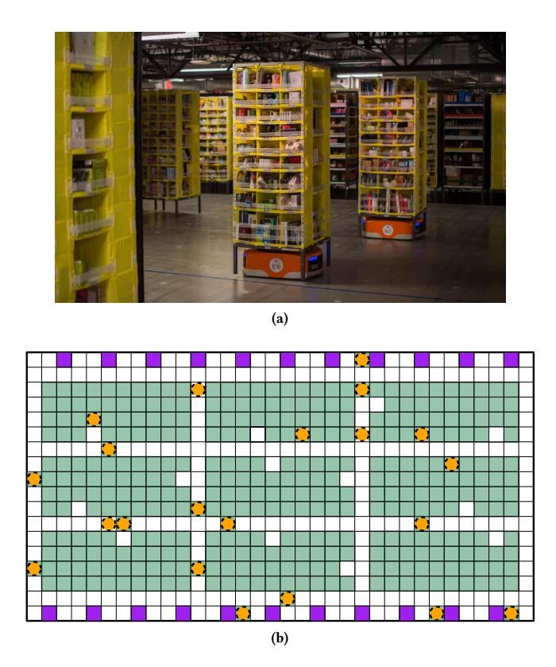
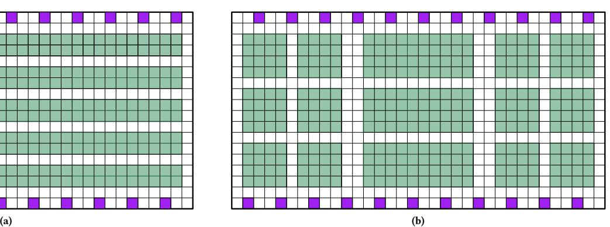
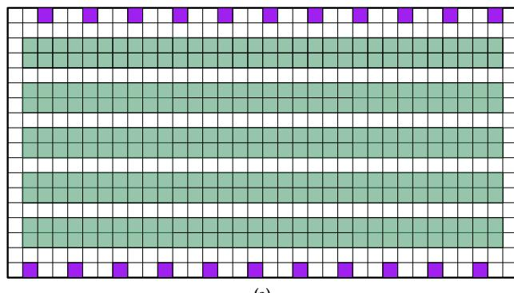

# Research Challenges and Opportunities in Multi-Agent Path Finding and Multi-Agent Pickup and Delivery Problems

Blue Sky Ideas Track

Oren Salzman

Technion Israel Institute of Technology

Haifa, Israel

osalzman@cs.technion.ac.il

Roni Stern

Ben Gurion University of the Negev

Be'er Sheva, Israel

Palo Alto Research Center (PARC)

Palo Alto, USA

sternron@post.bgu.ac.il,rstern@parc.com

## ABSTRACT

Recent years have shown a large increase in applications and research of problems that include moving a fleet of physical robots. One particular application that is currently a multi-billion industry led by tech giants such as Amazon robotics and Alibaba is warehouse robots. In this application, a large number of robots operate autonomously in the warehouse picking up, carrying, and putting down the inventory pods. In this paper, we outline several key research challenges and opportunities that manifest in this warehouse application. The first challenge, known as the Multi-Agent Path Finding (MAPF) problem, is the problem of finding a non-colliding path for each agent. While this problem has been well-studied in recent years, we outline several open questions, including understanding the actual hardness of the problem, learning the warehouse to improve online computations, and distributing the problem. The second challenge is known as the Multi-Agent Package and Delivery (MAPD) problem, which is the problem of moving packages in the warehouse. This problem has received some attention, but with limited theoretical understanding or exploitation of the incoming stream of requests. Finally, we highlight a third, often overlooked challenge, which is the challenge of designing the warehouse in a way that will allow efficient solutions of the two above challenges.

# KEYWORDS

Path planning, Warehouse environments, Task allocation, MAPF, MAPD

#### ACM Reference Format:

Oren Salzman and Roni Stern. 2020. Research Challenges and Opportunities in Multi-Agent Path Finding and Multi-Agent Pickup and Delivery Problems. In Proc. of the 19th International Conference on Autonomous Agents and Multiagent Systems (AAMAS 2020), Auckland, New Zealand, May 9–13, 2020, IFAAMAS, [5](#page-4-0) pages.

#### 1 INTRODUCTION

Coordinating the movement of a fleet of agents or robots1 is a decades-old family of problems that has been intensively studied by the robotics and artificial intelligence communities [\[7,](#page-3-0) [8,](#page-3-1) [11,](#page-3-2) [15,](#page-4-1) [21,](#page-4-2) [30,](#page-4-3) [47,](#page-4-4) [50,](#page-4-5) [51,](#page-4-6) [55,](#page-4-7) [56,](#page-4-8) [62,](#page-4-9) [69,](#page-4-10) [70,](#page-4-11) [72,](#page-4-12) inter alia]. Applications of this family of problems can be found in diverse settings including assembly [\[22,](#page-4-13) [40\]](#page-4-14), evacuation [\[44\]](#page-4-15), formation [\[5,](#page-3-3) [41,](#page-4-16) [60\]](#page-4-17), localization [\[17\]](#page-4-18), micro-droplet manipulation [\[20\]](#page-4-19), object transportation [\[45\]](#page-4-20), searchand-rescue [\[27\]](#page-4-21), and air-traffic management [\[54\]](#page-4-22).

One specific application of this general problem that gained significant interest in the research community is the warehouse domain, which we will use as a motivating running example. Here, storage locations host inventory pods that hold one or more kinds of goods. A large number (several hundreds and some times even several thousands) of robots operate autonomously in the warehouse picking up, carrying, and putting down the inventory pods. The robots move the pods from their storage locations to designated dropoff locations where the needed goods are manually removed from the inventory pods (to be packaged and then shipped to customers). Each pod is then carried back by a robot to a (possibly different) storage location [\[67\]](#page-4-23). The robots operate on a shared infrastructure, and thus may be directed by a central controller. The successful use of such robots in warehouse applications is currently a multi-billion industry led by tech giants such as Amazon robotics and Alibaba [\[1\]](#page-3-4). For a visualization, see Fig. [1.](#page-1-0)

Here, we are interested in two types of problems that can be used to model this application (as well as many others). In the first, called Multi Agent Path Finding (MAPF), we are given a graph G = (V, E) which, in our motivating example, is a discretization of the warehouse into cells where each cell represents a graph vertex and two vertices are connected in the graph if their corresponding cells are adjacent and do not contain pods. In addition, we are given s : [1, . . . , k] → V and t : [1, . . . , k] → V which map each one of the k agents to a start and target vertex, respectively. Time is typically discretized as well and at each time step an agent performs one of two actions: it can either wait in its cell or move to an adjacent cell.2

An action is considered conflict free or valid if two agents do not occupy the same vertex or the same edge at a given timestep. The objective is to find conflict-free paths for the agents from their start to their target locations that minimize some objective. Typically, we wish to minimize the makespan which is the latest arrival time

1Here we use the terms agents and robots to distinguish between the setting that the planning problem is discrete and continuous, respectively. Unless stated otherwise, here we limit ourselves to the study of the discrete setting.

Proc. of the 19th International Conference on Autonomous Agents and Multiagent Systems (AAMAS 2020), B. An, N. Yorke-Smith, A. El Fallah Seghrouchni, G. Sukthankar (eds.), May 9–13, 2020, Auckland, New Zealand. © 2020 International Foundation for Autonomous Agents and Multiagent Systems (www.ifaamas.org). All rights reserved.

2While some works plan in the continuous space to account for continuous time and robot kinematics (see e.g., [\[25,](#page-4-24) [26,](#page-4-25) [35\]](#page-4-26)), the discretized model is considered realistic enough to model many applications, including warehouse domains.

Figure 1: Warehouse robots. [\(a\)](#page-1-1) Amazon robots (orange) moving pods (yellow) containing goods in a warehouse environment. Figure adapted from [http://tiny.cc/ief6cz.](http://tiny.cc/ief6cz) [\(b\)](#page-1-2) Typical layout of pods in a warehouse. Pods and dropoff locations are depicted by green and purple squares, respectively. Agents are depicted using orange circles. Notice that some agents carry the pods and some don't.

of an agent at its target location or the flowtime which is the sum of the arrival times of all agents at their target locations.[3](#page-0-0)

The second problem, which can be viewed as an extension to the MAPF problem, is called the multi-agent pickup and delivery (MAPD) problem or lifelong MAPF. In this problem, agents have to attend to a stream of delivery tasks in an online setting.[4](#page-0-0) Here, we need to assign each delivery task to an agent. Subsequently, each agent has to move to its given pickup location and then to its given delivery location while avoiding collisions with other agents.

To a layman, it may seem that the wide use of fleets of robots in warehouse applications implies that the MAPF and MAPD problem have already been solved. This is far from true. From a theoretical point of view, the general MAPF problem is computationally hard for a wide range of optimization criteria [\[6,](#page-3-5) [18,](#page-4-27) [43,](#page-4-28) [58,](#page-4-29) [68,](#page-4-30) [71\]](#page-4-31). This implies that computing optimal solutions to the MAPF problem for instances involving a large number of robots is computationally intractable in many settings. From an application point of view, deployed systems use planning algorithms that have no guarantees on the quality of the solution, relying on a large amount of human experience and intuition with little-to-no scientific grounding.

In this paper, we list open challenges and possible research directions that the community may take in order to address these challenges as well as propose new research questions that arise for this domain.

#### 2 RELATED WORK

To address the inherent hardness of MAPF and MAPD, the research community designed general centralized and decentralized MAPD algorithms that use MAPF algorithms as underlying building blocks. Centralized approaches typically allow for optimal or bounded suboptimal algorithms by reducing the MAPF problem to other well-known problems such as network flow [\[70\]](#page-4-11), satisfiability [\[59\]](#page-4-34), Answer Set Programming [\[14\]](#page-4-35) or by using search-based methods [\[7,](#page-3-0) [8,](#page-3-1) [24,](#page-4-36) [50,](#page-4-5) [51,](#page-4-6) [63\]](#page-4-37). Unfortunately these methods fail to scale to more than several hundreds of agents—still an order of magnitude less than what is required by many real-world applications. Decentralized algorithms can scale to thousands of agents but provide no guarantees on the quality (i.e., throughput) of the solution [\[34,](#page-4-38) [36\]](#page-4-39).

#### 3 MAPF: CHALLENGES & OPPORTUNITIES

# 3.1 Hardness of MAPF in warehouse domains

Solving the MAPF problem without accounting for path quality (i.e., addressing the feasibility problem) can be done efficiently. Specifically, variants of the problem can be solved in O(n 3 ) where n is the number of vertices in the graph (see, e.g., [\[4,](#page-3-6) [19,](#page-4-40) [73\]](#page-4-41)). However, optimally solving the MAPF problem is computationally intractable [\[18,](#page-4-27) [43,](#page-4-28) [58,](#page-4-29) [71\]](#page-4-31) for different optimization criteria. Similar results can be shown even in the planar setting [\[68\]](#page-4-30) and when restricting the problem to grids [\[6\]](#page-3-5). While variants of this problem are NP-hard to approximate within any factor less than 4/3 [\[37\]](#page-4-42), it is not clear whether solving the MAPF problem optimally is APX-hard or if polynomial-time approximation schemes (PTAS) exist.

Interestingly, for specific cases this optimal-efficiency gap can be narrowed down. Recently, Yu [\[69\]](#page-4-10) presented a MAPF algorithm that exhibits a constant-time approximation in the average case for the setting where the environment is well connected. Roughly speaking, a (grid-like) environment is said to be well connected if it is composed of small cycles and in two adjacent rows (or columns) multiple swapping of agent locations can be done in constant time.

A major open challenge is to deepen the understanding of why and when the problem is computationally hard. Specifically, if we narrow down the MAPF problem to the specific setting of gridlike domains with rectangular obstacles (the storage locations, in our running example) and if we restrict the set of start and targets to non-pathological cases is the problem still computationally hard? Both positive and negative answers to this question may be invaluable in progressing the state-of-the-art.

The entire problem may still be computationally hard (just as the general MAPF), but this requires new hardness results. Alternatively, it may be solvable in polynomial time. A third option exists, which we conjecture to be the truth, where the problem can be solved by algorithms that are exponential only in the size of a

3 For a complete taxonomy of different MAPF problems, including conflict types, objective functions and more, see [\[57\]](#page-4-32).

4An offline version of this problem has been discussed [\[33\]](#page-4-33).

fixed parameter while polynomial in the size of the input. Such an algorithm is called a fixed-parameter tractable (FPT-) algorithm [\[12\]](#page-4-43). This research direction draws inspiration from recent results in multi-robot motion planning [\[29\]](#page-4-44).[5](#page-0-0) This well-studied problem (see, e.g., [\[55,](#page-4-7) [62,](#page-4-9) [70\]](#page-4-11)) is also computationally hard (see [\[23\]](#page-4-45) and references within). However, it was recently shown that a slight relaxation of the problem, requiring a limited amount of spacing among robots in their initial and final placements, lends itself to very efficient polynomial solutions [\[2\]](#page-3-7).

#### 3.2 Faster MAPF by learning from experience

MAPF problems are typically defined as a one-shot problem where a query is provided to the algorithm and it is tasked with computing a collision-free path for the fleet of agents between their respective start and target locations. However, in many cases the environment is known in advance (e.g., in our motivating warehouse application, the layout of the pods is known in advance). While this layout is constantly changing (e.g., as agents move from place to place, with and without pods), at any given point of time, the vast majority of the environment remains unchanged (e.g., in terms of pod location), when compared to the original layout. Thus, when solving the MAPF problem, we often have the additional flexibility of preprocessing the environment to efficiently answer multiple MAPF problems in a query phase. This was shown to be extremely useful for the continuous motion-planning problem [\[28,](#page-4-46) [42,](#page-4-47) [46,](#page-4-48) [48,](#page-4-49) [49,](#page-4-50) [55\]](#page-4-7). An immediate question that follows is "how can the query phase benefit from preprocessing the environment"?

We suggest to explore how learning from experience can help to solve computationally-hard problems. Here, experience may be obtained in a preprocessing phase or throughout the lifetime of the system. Such an experience-based approach may integrate with other techniques that pre-process and use the physical and virtual environment to improve planning [\[65,](#page-4-51) [66\]](#page-4-52).

# 3.3 Dec. MAPF with quality guarantees

Interestingly, much of the work on decentralized algorithms for MAPF has actually been done on a single computer [\[53,](#page-4-53) [64\]](#page-4-54). This avoids the need to address communication overhead and synchronization issues. This is surprising because the MAPF problem is inherently a multi-agent problem,[6](#page-0-0) and thus one could gain efficiency by performing the problem-solving by the multiple agents in parallel. On the other hand, there has been much work on distributed motion planning for robots, which can often scale elegantly but lacks solution quality guarantees. A major open challenge is how can existing centralized and decentralized MAPF algorithms be distributed in practice over multiple machines while maintaining their advantageous properties (e.g., completeness and optimality).

One can distribute the process of solving large-scale MAPF problems in more than one way. A promising approach for distributing MAPF is to split the graph to regions and have a planning agent per region. That agent will then interact with other planning agents to find a path for all agents, even if it crosses multiple regions. Distributing MAPF raises several interesting challenges such as limiting the communication overhead and balancing the computational load. Addressing these challenges can allow elegant scaling of current MAPF algorithms to thousands of agents while providing some notion of solution quality. The vast literature on agent-oriented programming [\[52\]](#page-4-55) and distributed AI [\[13\]](#page-4-56) addressed similar challenges, and thus may provide the foundation for scalable distributed MAPF solutions.

# 4 MAPD: CHALLENGES & OPPORTUNITIES

### 4.1 Realistic MAPD models

A first step in analyzing a MAPD instance is to argue if it can be solved or not. Čáp et al. [\[10\]](#page-3-8) introduced the notion of a well formed environment which gives a sufficient (though not necessary) condition for a MAPD instance to be solvable. Here, an environment is said to be well formed if (i) the number of tasks is finite and (ii) each agent can wait indefinitely at its start and target vertices without blocking any other agent.

In practice, however, we are interested in infinite streams of tasks. Therefore, a MAPD is an online algorithm [\[3\]](#page-3-9), and can be analyzed in terms of competitive ratio (overhead over an offline-optimal algorithm) and worst-case behavior. Further analysis can be done by modeling how the stream of tasks arrives to the system. This includes both the rate at which tasks arrive and the distribution of start and target placements of each task. Such models are beneficial not only from a theoretic point of view but also from a practical one—if a MAPD algorithm is given a model of how the stream of tasks arrive to the system, it can leverage this additional knowledge e.g., by preprocessing the environment.

# 4.2 Lifelong learning in MAPD

Deployed MAPD systems often see similar queries across local time periods (for example, before the school year, school supplies will be in high demand causing the pods storing them in our running example to be accessed frequently). This calls for online local adaptation of a MAPD algorithm. Here, we will need to learn or estimate the distribution of queries that arrive in an online manner and adapt the system accordingly.

# 4.3 Dec. MAPD as a distributed AI problem

Performing the MAPD computation over multiple machines poses similar challenges and opportunities as discussed in Sec. [3.3](#page-2-0) for MAPF, such as how to distribute the problem solving in an effective way and how to minimize communication overhead. In addition, since MAPD is fundamentally a multi-agent planning problem, one can build on existing work on distributed multi-agent planning [\[31,](#page-4-57) [32,](#page-4-58) [39\]](#page-4-59).

For example, research in multi-agent STRIPS [\[9,](#page-3-10) [16\]](#page-4-60) includes methods to identify actions that are private to specific agents, and thus agents do not need to coordinate their application. Then, one can distribute the planning process and have the agent only communicate about planned actions that are not public. Several such frameworks have been proposed for multi-agent-STRIPS [\[38,](#page-4-61) [61\]](#page-4-62). Using these frameworks directly for MAPD is challenging, since it

5A similar problem to the MAPF where the robots operate in a continuous space and have kinematic constraints.

6By multi-agent we mean that there are multiple entities that perform actions, and not necessarily in a distributed manner.

Figure 2: Pods and drop-off locations are depicted by green and purple squares, respectively. In both figures, there are almost the same number of pods. However, the different layout has a dramatic effect on solution quality.

is not clear how to identify private actions. But, weaker forms of privacy may be of use in MAPD. In general, bridging between MAPD and the literature on multi-agent planning suggests potential gains.

# 5 CHALLENGES BEYOND MAPF AND MAPD

In the MAPD problem, our ultimate goal is to maximize the system's efficiency. In the warehouse domain, a key efficiency measure is throughput. Namely, the number of tasks completed per unit of time. Given a MAPD algorithm, the throughput can be increased by (i) changing the layout of the environment—here the layout is defined as the number and positions of designated pickup and dropoff locations (pods in our running example—see also Fig. [2\)](#page-3-11) and (ii) changing the number of agents.

Intuitively, given a layout ℓ in a given environment, gradually increasing the number of agents from a single agent will result in higher throughput as the agents can service more tasks simultaneously. However, after a certain number of agents is reached, coordination becomes a limiting factor and the throughput will decrease. This will be either because planning times are larger than execution times (and the agents need to wait for future plans to be computed) or because the execution time increases dramatically (for example when some agents will have to make large detours to avoid other agents). Similarly, given a fixed number of agents and a given environment, adding pods increases throughput as the probability that a given pod will contain a required item increases. This, in turn, results in shorter paths for the agents to execute. However, after a certain number of pods is reached, the agents have less space to maneuver and higher coordination is required (resulting both in longer planning times as well as longer execution times).

Thus, given an environment which contains static obstacles (walls, pillars in the room etc.), an immediate question that should be addressed (and surprisingly has not been asked to the extent of our knowledge) is what is the optimal layout and optimal number of agents to maximize the expected throughput of the system? Here we propose to algorithmically design the environment in a way that the pathological cases that cause the problem to be computationally hard will not appear (or will appear as little as possible).

# 6 CONCLUSION

In this paper, we described several algorithmic open challenges in MAPF and MAPD research, with an effort to scale to fleets of thousands of agents while maintaining theoretic guarantees both on the running time as well as the quality of the solution obtained. These challenges include a deeper understanding of the complexity of these problems and mapping it to applicable algorithms, exploiting the ability to preprocess the environment and past execution, and distributing the planning process. In addition, we outline the design challenge of how to structure the environment in a way that will enable efficient planning. With the growing number of large-scale multi-agent systems of this type, advances in solving MAPF, MAPD, and the corresponding design problem, holds the potential to be one of the great successes of multi-agent AI research.

#### ACKNOWLEDGMENTS

Author #2 is partially funded by ISF grant #210/17 to Roni Stern.

## REFERENCES

[1] [n. d.]. Three Ways Amazon, Alibaba, and Ocado Benefit from Warehouse Robots. [https://www.innovecs.com/ideas-portfolio/](https://www.innovecs.com/ideas-portfolio/amazon-alibaba-ocado-use-warehouse-robots/) [amazon-alibaba-ocado-use-warehouse-robots/.](https://www.innovecs.com/ideas-portfolio/amazon-alibaba-ocado-use-warehouse-robots/) Accessed: 19-07-19. [2] Aviv Adler, Mark De Berg, Dan Halperin, and Kiril Solovey. 2014. Efficient multi-robot motion planning for unlabeled discs in simple polygons. In WAFR. 1–17. [3] Susanne Albers. 2003. Online algorithms: a survey. Mathematical Programming 97, 1-2 (2003), 3–26. [4] Vincenzo Auletta, Angelo Monti, Mimmo Parente, and Pino Persiano. 1999. A linear-time algorithm for the feasibility of pebble motion on trees. Algorithmica 23, 3 (1999), 223–245. [5] Tucker Balch and Ronald C Arkin. 1998. Behavior-based formation control for multirobot teams. IEEE Trans. on Robotics & Auto. 14, 6 (1998), 926–939. [6] Jacopo Banfi, Nicola Basilico, and Francesco Amigoni. 2017. Intractability of time-optimal multirobot path planning on 2d grid graphs with holes. IEEE Robot. Autom. Lett. 2, 4 (2017), 1941–1947. [7] Max Barer, Guni Sharon, Roni Stern, and Ariel Felner. 2014. Suboptimal Variants of the Conflict-Based Search Algorithm for the Multi-Agent Pathfinding Problem. In ECAI, Vol. 263. 961–962. [8] Eli Boyarski, Ariel Felner, Roni Stern, Guni Sharon, David Tolpin, Oded Betzalel, and Solomon Eyal Shimony. 2015. ICBS: Improved Conflict-Based Search Algorithm for Multi-Agent Pathfinding. In IJCAI. 740–746. [9] Ronen I Brafman and Carmel Domshlak. 2008. From One to Many: Planning for Loosely Coupled Multi-Agent Systems.. In ICAPS. 28–35. [10] Michal Čáp, Peter Novák, Alexander Kleiner, and Martin Selecky. 2015. Prioritized ` planning algorithms for trajectory coordination of multiple mobile robots. IEEE Trans. on Aut. Sci. & Eng. 12, 3 (2015), 835–849. [11] Liron Cohen, Tansel Uras, and Sven Koenig. 2015. Feasibility study: Using highways for bounded-suboptimal multi-agent path finding. In SOCS. 2–8.

- [12] Marek Cygan, Fedor V Fomin, Łukasz Kowalik, Daniel Lokshtanov, Dániel Marx, Marcin Pilipczuk, Michał Pilipczuk, and Saket Saurabh. 2015. Parameterized algorithms. Vol. 4. Springer. [13] Edmund H Durfee and Jeffrey S Rosenschein. 1994. Distributed problem solving and multi-agent systems: Comparisons and examples. In International Distributed Artificial Intelligence Workshop. 94–104. [14] Esra Erdem, Doga Gizem Kisa, Umut Oztok, and Peter Schüller. 2013. A general formal framework for pathfinding problems with multiple agents. In AAAI. [15] Ariel Felner, Roni Stern, Solomon Eyal Shimony, Eli Boyarski, Meir Goldenberg, Guni Sharon, Nathan Sturtevant, Glenn Wagner, and Pavel Surynek. 2017. Searchbased optimal solvers for the multi-agent pathfinding problem: Summary and challenges. In SOCS. [16] Richard E Fikes and Nils J Nilsson. 1971. STRIPS: A new approach to the application of theorem proving to problem solving. AIJ 2, 3-4 (1971), 189–208. [17] Dieter Fox, Wolfram Burgard, Hannes Kruppa, and Sebastian Thrun. 2000. A probabilistic approach to collaborative multi-robot localization. Rob. Res. 8, 3 (2000), 325–344. [18] Oded Goldreich. 2011. Finding the shortest move-sequence in the graphgeneralized 15-puzzle is NP-hard. In Studies in Complexity and Cryptography. Miscellanea on the Interplay between Randomness and Computation. Springer, 1–5. [19] Gilad Goraly and Refael Hassin. 2010. Multi-color pebble motion on graphs. Algorithmica 58, 3 (2010), 610–636. [20] Eric J Griffith and Srinivas Akella. 2005. Coordinating multiple droplets in planar array digital microfluidic systems. Int. J. of Rob. Res. 24, 11 (2005), 933–949. [21] Yi Guo and Lynne E Parker. 2002. A distributed and optimal motion planning approach for multiple mobile robots. In ICRA, Vol. 3. 2612–2619. [22] Dan Halperin, J-C Latombe, and Randall H Wilson. 2000. A general framework for assembly planning: The motion space approach. Algorithmica 26, 3-4 (2000), 577–601. [23] Dan Halperin, Oren Salzman, and Micha Sharir. 2017. Algorithmic motion planning. In Handbook of Discrete and Computational Geometry (3rd ed.), Jacob
- E. Goodman Csaba D. Toth, Joseph O'Rourke (Ed.). CRC Press, Inc., Chapter 50, 1307–1338. [24] Shuai D. Han and Jingjin Yu. 2019. DDM\*: Fast Near-Optimal Multi-Robot Path Planning using Diversified-Path and Optimal Sub-Problem Solution Database Heuristics. CoRR abs/1904.02598 (2019). [25] Wolfgang Hönig, Scott Kiesel, Andrew Tinka, Joseph W Durham, and Nora Ayanian. 2019. Persistent and Robust Execution of MAPF Schedules in Warehouses. IEEE Robot. Autom. Lett. 4, 2 (2019), 1125–1131. [26] Wolfgang Hönig, T. K. Satish Kumar, Liron Cohen, Hang Ma, Hong Xu, Nora Ayanian, and Sven Koenig. 2016. Multi-Agent Path Finding with Kinematic Constraints. In ICAPS. 477–485. [27] James S Jennings, Greg Whelan, and William F Evans. 1997. Cooperative search and rescue with a team of mobile robots. In International Conference on Advanced Robotics (ICAR). 193–200. [28] Lydia E. Kavraki, Petr Svestka, Jean-Claude Latombe, and Mark H. Overmars. 1996. Probabilistic roadmaps for path planning in high-dimensional configuration spaces. IEEE Trans. on Robotics & Auto. 12, 4 (1996), 566–580. [29] Steven M. LaValle. 2006. Planning Algorithms. Cambridge University Press. [30] Steven M LaValle and Seth A Hutchinson. 1998. Optimal motion planning for multiple robots having independent goals. IEEE Trans. on Robotics & Auto. 14, 6 (1998), 912–925. [31] Victor R Lesser. 1995. Multiagent systems: An emerging subdiscipline of AI. ACM Computing Surveys (CSUR) 27, 3 (1995), 340–342. [32] Sejoon Lim and Daniela Rus. 2012. Stochastic distributed multi-agent planning and applications to traffic. In ICRA. 2873–2879. [33] Minghua Liu, Hang Ma, Jiaoyang Li, and Sven Koenig. 2019. Planning, Scheduling and Monitoring for Airport Surface Operations. In AAMAS. 1152–1160. [34] Minghua Liu, Hang Ma, Jiaoyang Li, and Sven Koenig. 2019. Task and Path Planning for Multi-Agent Pickup and Delivery. In AAMAS. 1152–1160. [35] Hang Ma, Wolfgang Hönig, T. K. Satish Kumar, Nora Ayanian, and Sven Koenig. 2019. Lifelong Path Planning with Kinematic Constraints for Multi-Agent Pickup and Delivery. In AAAI. 7651–7658. [36] Hang Ma, Jiaoyang Li, TK Kumar, and Sven Koenig. 2017. Lifelong multi-agent path finding for online pickup and delivery tasks. In AAMAS. 837–845. [37] Hang Ma, Craig A. Tovey, Guni Sharon, T. K. Satish Kumar, and Sven Koenig. 2016. Multi-Agent Path Finding with Payload Transfers and the Package-Exchange Robot-Routing Problem. In AAAI. 3166–3173. [38] Shlomi Maliah, Guy Shani, and Roni Stern. 2017. Collaborative privacy preserving multi-agent planning. JAAMAS 31, 3 (2017), 493–530. [39] Raz Nissim and Ronen Brafman. 2014. Distributed heuristic forward search for multi-agent planning. J. Artif. Intell. Res. 51 (2014), 293–332. [40] Bartholomew O Nnaji. 1993. Theory of automatic robot assembly and programming. Springer Science & Business Media. [41] Sameera Poduri and Gaurav S Sukhatme. 2004. Constrained coverage for mobile sensor networks. In ICRA, Vol. 1. 165–171. [42] Vinitha Ranganeni, Oren Salzman, and Maxim Likhachev. 2018. Effective Footstep Planning for Humanoids Using Homotopy-Class Guidance. In ICAPS. 500–508. [43] Daniel Ratner and Manfred Warmuth. 1990. The (n 2 − 1)-puzzle and related relocation problems. Journal of Symbolic Computation 10, 2 (1990), 111–137. [44] Samuel Rodriguez and Nancy M Amato. 2010. Behavior-based evacuation planning. In ICRA. 350–355. [45] Daniela Rus, Bruce Donald, and Jim Jennings. 1995. Moving furniture with teams of autonomous robots. In IROS, Vol. 1. 235–242. [46] Oren Salzman and Dan Halperin. 2015. Optimal motion planning for a tethered robot: Efficient preprocessing for fast shortest paths queries. In ICRA. 4161–4166. [47] Oren Salzman and Dan Halperin. 2016. Asymptotically Near-Optimal RRT for Fast, High-Quality Motion Planning. IEEE Transactions on Robotics 32, 3 (2016), 473–483. [48] Oren Salzman, Doron Shaharabani, Pankaj K. Agarwal, and Dan Halperin. 2014. Sparsification of motion-planning roadmaps by edge contraction. Int. J. of Rob. Res. 33, 14 (2014), 1711–1725. [49] Oren Salzman, Kiril Solovey, and Dan Halperin. 2016. Motion Planning for Multilink Robots by Implicit Configuration-Space Tiling. IEEE Robot. Autom. Lett. 1, 2 (2016), 760–767. [50] Guni Sharon, Roni Stern, Ariel Felner, and Nathan R. Sturtevant. 2012. Conflict-Based Search For Optimal Multi-Agent Path Finding. In AAAI. [51] Guni Sharon, Roni Stern, Meir Goldenberg, and Ariel Felner. 2013. The increasing cost tree search for optimal multi-agent pathfinding. Artificial intelligence 195 (2013), 470–495. [52] Yoav Shoham. 1997. An overview of agent-oriented programming. Software agents 4 (1997), 271–290. [53] David Silver. 2005. Cooperative Pathfinding. AIIDE 1 (2005), 117–122. [54] David Sislak, Přemysl Volf, and Michal Pechoucek. 2010. Agent-based cooperative decentralized airplane-collision avoidance. IEEE Transactions on Intelligent Transportation Systems 12, 1 (2010), 36–46. [55] Kiril Solovey, Oren Salzman, and Dan Halperin. 2016. Finding a needle in an exponential haystack: Discrete RRT for exploration of implicit roadmaps in multi-robot motion planning. Int. J. of Rob. Res. 35, 5 (2016), 501–513. [56] Trevor Scott Standley. 2010. Finding Optimal Solutions to Cooperative Pathfinding Problems. In AAAI. 173–178. [57] Roni Stern, Nathan R. Sturtevant, Ariel Felner, Sven Koenig, Hang Ma, Thayne T. Walker, Jiaoyang Li, Dor Atzmon, Liron Cohen, T. K. Satish Kumar, Roman Barták, and Eli Boyarski. 2019. Multi-Agent Pathfinding: Definitions, Variants, and Benchmarks. In SOCS. 151–159. [58] Pavel Surynek. 2010. An optimization variant of multi-robot path planning is intractable. In AAAI. 1261–1263. [59] Pavel Surynek, Ariel Felner, Roni Stern, and Eli Boyarski. 2016. Efficient SAT approach to multi-agent path finding under the sum of costs objective. In ECAI. IOS Press, 810–818. [60] Herbert G Tanner, George J Pappas, and Vijay Kumar. 2004. Leader-to-formation stability. IEEE Trans. on Robotics & Auto. 20, 3 (2004), 443–455. [61] Alejandro Torreño, Eva Onaindia, Antonín Komenda, and Michal Stolba. 2017. Cooperative Multi-Agent Planning: A Survey. CoRR abs/1711.09057 (2017). [62] Jur van den Berg, Jack Snoeyink, Ming C. Lin, and Dinesh Manocha. 2009. Centralized path planning for multiple robots: Optimal decoupling into sequential plans. In RSS. [63] Glenn Wagner and Howie Choset. 2015. Subdimensional expansion for multirobot path planning. Artificial intelligence 219 (2015), 1–24. [64] Ko-Hsin Cindy Wang, Adi Botea, et al. 2008. Fast and Memory-Efficient Multi-Agent Pathfinding.. In ICAPS. 380–387. [65] Danny Weyns, H Van Dyke Parunak, Fabien Michel, Tom Holvoet, and Jacques Ferber. 2004. Environments for multiagent systems state-of-the-art and research challenges. In International Workshop on Environments for Multi-Agent Systems. 1–47. [66] Danny Weyns, Kurt Schelfthout, and Tom Holvoet. 2005. Exploiting a virtual environment in a real-world application. In International Workshop on Environments for Multi-Agent Systems. 218–234. [67] Peter R Wurman, Raffaello D'Andrea, and Mick Mountz. 2008. Coordinating hundreds of cooperative, autonomous vehicles in warehouses. Artificial intelligence 29, 1 (2008), 9–9. [68] Jingjin Yu. 2016. Intractability of Optimal Multirobot Path Planning on Planar Graphs. IEEE Robot. Autom. Lett. 1, 1 (2016), 33–40. [69] Jingjin Yu. 2019. Average Case Constant Factor Time and Distance Optimal Multi-Robot Path Planning in Well-Connected Environments. Rob. Res. (2019), 1–15. [70] Jingjin Yu and Steven M. LaValle. 2012. Multi-agent Path Planning and Network Flow. In WAFR, Vol. 86. Springer, 157–173. [71] Jingjin Yu and Steven M. LaValle. 2013. Structure and Intractability of Optimal Multi-Robot Path Planning on Graphs. In AAAI. 1443–1449. [72] Jingjin Yu and Steven M. LaValle. 2016. Optimal Multirobot Path Planning on Graphs: Complete Algorithms and Effective Heuristics. IEEE Transactions on Robotics 32, 5 (2016), 1163–1177. [73] Jingjin Yu and Daniela Rus. 2014. Pebble motion on graphs with rotations: Efficient feasibility tests and planning algorithms. In WAFR. 729–746.