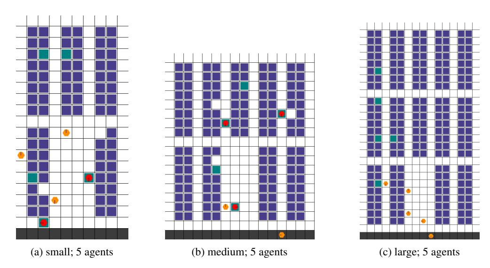

# THE MULTI-AGENT PICKUP AND DELIVERY PROB-LEM: MAPF, MARL AND ITS WAREHOUSE APPLICA-TIONS

Tim Tsz-Kit Lau

Department of Statistics

Northwestern University

timlautk@u.northwestern.edu

Biswa Sengupta

Zebra Technologies

Endeavour House, Shaftsbury Avenue, London, UK

biswa.sengupta@zebra.com

## ABSTRACT

We study two state-of-the-art solutions to the multi-agent pickup and delivery (MAPD) problem based on different principles—multi-agent path-finding (MAPF) and multi-agent reinforcement learning (MARL). Specifically, a recent MAPF algorithm called conflict-based search (CBS) and a current MARL algorithm called shared experience actor-critic (SEAC) are studied. While the performance of these algorithms is measured using quite different metrics in their separate lines of work, we aim to benchmark these two methods comprehensively in a simulated warehouse automation environment.

# 1 INTRODUCTION

The multi-agent pickup and delivery (MAPD) problem in various industrial applications such as warehouse automation has long been a central problem to study in artificial intelligence due to its widespread real-world applications. In the MAPD problem, various agents operate in an everyday environment in a multi-agent system. Each of them picks up a new item in the request queue and delivers it to a designated delivery location. To execute these tasks, the agents need to travel in the environment via their collision-free paths. To be more precise, each agent has to move from its current location to the pickup location of a requested item in the request queue and travel to the delivery location of the item after the pickup.

Two major approaches to tackle MAPD are multi-agent path-finding (MAPF) and multi-agent reinforcement learning (MARL). MAPF, as a more traditional solution to the MAPD problem, involves computing collision-free paths for many agents given the current states of the agents (e.g., their locations) and a representation of the environment (e.g., the pickup and delivery locations and obstacles present in the environment). MAPF also finds applications in computer games, traffic management and airport schedules. Most methods for solving the MAPD problem in the literature are based on MAPF, so somehow, MAPD and MAPF are viewed as the same problem. A noticeable difference between them is that a vanilla MAPF problem assumes the planning problem is *single-shot*, i.e., the agents will stay at their goal locations once they have arrived. In contrast, an MAPD problem is usually *lifelong*, i.e., an agent will begin delivery once after a pickup and will travel to a new requested item location once it has finished a delivery. This paper aims to tackle the MAPD problem with the more realistic lifelong MAPF approaches.

Due to the recent interest in MARL, the MAPD problem is also solved with MARL algorithms. However, it is generally viewed as a benchmark problem to showcase the efficiency of newly proposed MARL algorithms instead of a specific problem to study. Based on the formulation of the MARL problems, MARL algorithms tackle the MAPD problem in a completely different flavour. They do not compute a full collision-free path but instead learn agents' policies that choose actions of the agents given their current observations of the environment. These agents' policies are learned to maximize the agents' cumulative (discounted) rewards, which are usually assigned when the agents have successfully picked up or delivered an item.

The qualities of the above two types of MAPD solutions are usually assessed using very different metrics in their lines of work. The MAPF-based solutions are mainly evaluated using success rates, flow times (the sum of arrival times of all agents at their goal locations) and makespans (the maximum of the arrival times of all agents at their goal locations). In contrast, the MARL-based methods are usually assessed with the standard metrics used in reinforcement learning—training and evaluation returns. Such a discrepancy between the evaluation metrics renders it difficult in comparing these two types of solutions. Given this discrepancy, in this paper, we aim to provide a comprehensive comparison between these two seemingly disconnected types of solutions to the MAPD problem. We particularly compare the lifelong version of a well-known centralized single-shot MAPF solver called conflict-based search (CBS) to the state-of-the-art MARL solver called shared experience actor-critic (SEAC).

### 2 BACKGROUND

In this section, we give a general overview of the problem formulations of MAPF and MARL, which can also be found from prior work [\(Christianos et al.,](#page-8-0) [2020;](#page-8-0) [2021;](#page-8-1) [Huang et al.,](#page-8-2) [2021;](#page-8-2) [Li et al.,](#page-8-3) [2019a](#page-8-3)[;b;](#page-8-4) [2021;](#page-8-5) [Liu et al.,](#page-9-0) [2019\)](#page-9-0). Details of related algorithms are given in Section [3.](#page-2-0)

### 2.1 SINGLE-SHOT MULTI-AGENT PATH FINDING

A (single-shot) multi-agent pathfinding problem is defined by an unweighted undirected graph  $\mathcal{G} = (\mathcal{V}, \mathcal{E})$  and a set of  $n$  agents  $A := \{\alpha_1, \dots, \alpha_n\}$ . Each agent  $\alpha_i$  has a start vertex  $s_i \in \mathcal{V}$  and a goal vertex  $g_i \in \mathcal{V}$ . With time discretized into time steps, each agent can only either move to an adjacent vertex or stay at the current vertex in the graph at each time step. Both of the move and wait actions incur a unit cost until the agent has arrived at its goal vertex and no longer moves so that the cost of each agent is the number of time steps required for its arrival at its goal vertex from its start vertex. There are two types of conflicts under consideration: (i) a *vertex conflict*, denoted by  $\langle \alpha_i, \alpha_j, v, t \rangle$ , happens when agents  $\alpha_i$  and  $\alpha_j$  are at the same vertex  $v \in \mathcal{V}$  at time step  $t$ ; (ii) an *edge conflict*, denoted by  $\langle \alpha_i, \alpha_j, v_1, v_2, t \rangle$ , occurs when agents  $\alpha_i$  and  $\alpha_j$  traverse the same edge  $(v_1, v_2) \in \mathcal{E}$  in opposite directions between time steps  $t$  and  $t + 1$ . The overall objective of MAPF is to find a set of conflict-free paths which move all agents from their start vertices to their goal vertices, which are often referred to as *solutions*, by minimizing the sum of the costs of all the agents.

#### 2.2 LIFELONG MULTI-AGENT PATH FINDING

As mentioned in Section [1,](#page-0-0) an MAPD problem is indeed a lifelong MAPF problem that solves possibly multiple single-shot MAPF problems in an inner loop. Thus, existing approaches for solving lifelong MAPF problems are usually based on those for solving single-shot MAPF instances, which can be categorized into three main types.

- 1. A lifelong MAPF problem is decomposed into a sequence of single-shot MAPF instances where all agents perform path replanning at every step.
- 2. A lifelong MAPF problem is decomposed into a sequence of single-shot MAPF instances where path replanning is performed only for agents that have just picked up or delivered their items [\(Ma et al.,](#page-9-1) [2017b\)](#page-9-1).
- 3. A lifelong MAPF problem is solved as a whole in an offline setting, as reductions to other well-studied combinatorial problems such as an answer set programming problem [\(Nguyen](#page-9-2) [et al.,](#page-9-2) [2017\)](#page-9-2).

See [Li et al.](#page-8-5) [\(2021\)](#page-8-5) for more detailed descriptions of these three types of solutions to lifelong MAPF problems, [Felner et al.](#page-8-6) [\(2017\)](#page-8-6); [Ma et al.](#page-9-3) [\(2017a\)](#page-9-3) for detailed surveys on MAPF (mainly single-shot), and also [Salzman & Stern](#page-9-4) [\(2020\)](#page-9-4) for recent research challenges and opportunities in MAPF and MAPD problems.

#### 2.3 MULTI-AGENT REINFORCEMENT LEARNING

Solutions based on multi-agent reinforcement learning (MARL), unlike MAPF-based solutions, do not compute a set full collision-free paths of all the agents in the environment, but instead learn policies of the agents which decide the actions of the agents at each time step given the current states of the environment.

This MARL problem can be foreformulated as a *partially observable* multi-agent Markov decision process (a.k.a. Markov game) for  $n$  agents, which is defined by the tuple  $(\mathcal{N}, \mathcal{S}, \{\mathcal{O}_i\}_{i \in \mathcal{N}}, \{\mathcal{A}_i\}_{i \in \mathcal{N}}, P, \{R_i\}_{i \in \mathcal{N}})$ , where  $\mathcal{N} := \{1, \dots, n\}$  denotes the set of  $n$  agents,  $\mathcal{S}$  is the state space,  $\mathcal{O} := \mathcal{O}_1 \times \dots \times \mathcal{O}_n$  is the joint observation space,  $\mathcal{A} := \mathcal{A}_1 \times \dots \times \mathcal{A}_n$  is the joint action space. Each agent  $i$  can only perceive local observations  $o_i \in \mathcal{O}_i$  which depend on the current state. The function  $P: \mathcal{S} \times \mathcal{A} \rightarrow \mathcal{P}(\mathcal{S})$ , which is known as a transition model, returns a distribution on the successive state given the current state and joint action. For each agent  $i$ , the reward function  $R_i: \mathcal{S} \times \mathcal{A} \times \mathcal{S} \rightarrow \mathbb{R}$  gives its individual reward  $r_{i,t}$  at time step  $t$ . The overall MARL objective is to find an optimal joint policies of the agents, denoted by  $\pi^* = (\pi_1^*, \dots, \pi_n^*)$ , such that the discounted return of each agent  $i$  is maximized with respect to the policies of other agents, i.e.,

$$(\forall i \in \mathcal{N}) \quad \pi_i^* \in \operatorname{Argmax}_{\pi_i} \mathbb{E}_{\pi_i, \pi_i^*} \left[ \sum_{t=0}^T \gamma^t r_{i,t} \right], \quad (1)$$

where  $\pi_{\setminus i} := (\pi_1, \dots, \pi_{i-1}, \pi_{i+1}, \dots, \pi_n)$ ,  $\gamma \in (0, 1]$  is the discount factor, and  $T$  is the total number of time steps of an episode.

Note that, based on the different contexts of MARL algorithms, we can add more stringent assumptions to the above formulation, e.g., the action spaces, the observation spaces, or the reward functions of the agents can be assumed to be identical [\(Christianos et al.,](#page-8-0) [2020;](#page-8-0) [Foerster et al.,](#page-8-7) [2018;](#page-8-7) [Rashid](#page-9-5) [et al.,](#page-9-5) [2018\)](#page-9-5).

# 3 ALGORITHMS FOR MAPF AND MARL PROBLEMS

In this section, we give the details of several popular algorithms for MAPF and MARL problems which are compared numerically in Section [4.](#page-4-0)

### 3.1 MAPF SOLVERS

#### 3.1.1 CONFLICT-BASED SEARCH FOR SINGLE-SHOT MAPF

While there are a multitude of MAPF solvers developed in recent years, conflict-based search (CBS) and its variants are among the strongest algorithms. Conflict-based search (CBS; [Sharon et al.,](#page-9-6) [2015\)](#page-9-6) is a centralized bilevel tree search algorithm, which resolves conflicts by adding constraints at the high level and replans paths for agents respecting these constraints at the low level. At the high level, CBS performs a best-first search on the *constraint tree* (CT), which is a binary search tree, according to the costs of the CT nodes. Each CT node N encompasses:

- 1. a set of constraints Nconstraints in the search, in which each constraint can be either a vertex constraint or an edge constraint (see Section [2.1](#page-1-0) for their definitions);
- 2. a solution Nsolution which consists of a set of individually cost-minimal paths for all agents, subject to the constraints in Nconstraints;
- 3. a cost Ncost of N which is the sum of costs of the paths in Nsolution;
- 4. a set of conflicts Nconflicts between any two paths in Nsolution.

At the high level, CBS begins with only one node with an empty constraint set and expands the CT by expanding a CT node with the lowest cost Ncost. After choosing such a CT node to expand, CBS finds the set of conflicts Nconflicts in Nsolution. If there are none, CBS terminates and returns Nsolution. Otherwise, CBS *randomly* chooses one of the conflicts to resolve by splitting N into two child CT nodes. In each of these two children, we add CT nodes, an additional vertex or edge constraint on one of the two conflicting agents to Nconstraints of the corresponding child node, depending on the type of the conflict. This is done similarly for the other conflicting agent and its corresponding child node.

At the low level, after the addition of the constraints, path replanning is performed in Nsolution whenever necessary via a low-level search such as cooperative A\* search [\(Silver,](#page-9-7) [2005\)](#page-9-7), while keeping other paths unchanged. A child CT node will be pruned if this low-level search cannot find any path that satisfies the constraints.

Improved versions of CBS have also been developed to improve its efficiency. Improved CBS (ICBS; [Boyarski et al.,](#page-8-8) [2015\)](#page-8-8) prioritizes the conflicts to split on at each CT node N, whereas CBSH [\(Felner](#page-8-9)

While th the above CBS algorithms are mainly for single-shot MAPF problems, a common approach to solve lifelong MAPF is to stitch a sequence of single-shot MAPF instances together by using a MAPF solver to replan whenever at least one agent is assigned to a new target location at each time step, see e.g., Liu et al. (2019). Since replanning time grows exponentially with the number of agents, reducing replanning frequencies such as planning paths within a finite window (Li et al., 2021) improves the scalability of lifelong MAPF.

#### 3.2 MARL ALGORITHMS

#### 3.2.1 POLICY GRADIENT AND ACTOR-CRITIC ALGORITHMS

The policy gradient algorithm such as REINFORCE (Williams, 1992) is a model-free reinforcement learning algorithm which learns an optimal policy  $\pi_{\theta}$ , usually parameterized by  $\theta$ . The expected return is defined through  $J(\theta) := \mathbb{E}_{s \sim \mathcal{D}^{\pi}, a \sim \pi_{\theta}(\cdot | s)}[Q^{\pi_{\theta}}(s, a)]$ , with

$$Q^{\pi_{\theta}}(s, a) := \mathbb{E}_{a \sim \pi_{\theta}(\cdot \mid s)} \left[ \sum_{k=0}^T \gamma^k r_{t+k+1} \mid s_t = s, a_t = a \right],$$

where  $\mathcal{D}^\pi$  is the on-policy state distribution under  $\pi$ . To maximize the expected return  $J$ , we compute the gradient of the objective via the policy gradient theorem (Sutton et al., 2000), which gives

$$\nabla_{\boldsymbol{\theta}} J(\boldsymbol{\theta}) = \mathbb{E}_{s \sim \mathcal{D}^\pi, a \sim \pi_{\boldsymbol{\theta}}}(\cdot \mid s)} [Q^{\pi_{\boldsymbol{\theta}}}(s, a) \nabla_{\boldsymbol{\theta}} \log \pi_{\boldsymbol{\theta}}(s, a)].$$

While the Markov property is not used in computing policy gradients, so that they can be used in partially observable settings, the estimation of policy gradients often suffer from high variance. To achieve variance reduction, actor-critic algorithms estimate Monte Carlo returns with a value function  $V_{\phi}^{\pi}(s)$  parameterized by  $\phi$ . Hence, an actor-critic algorithm under a multi-agent partially observable setting makes use of the following policy loss for agent  $i$ 

$$\mathcal{L}(\boldsymbol{\theta}_i) := -\log \pi_{\boldsymbol{\theta}_i}(a_t^i | o_t^i) \cdot [r_t^i + \gamma V_{\phi_i}(o_{t+1}^i) - V_{\phi_i}(o_t^i)],$$

where the value function  $V_{\phi_i}$  minimizes

$$\mathcal{L}(\phi_i) :=: \left\| V_{\phi_i}(o_t^i) - y_i^{\phi_i} \right\|_2^2 \quad \text{with} \quad y_i^{\phi_i} := r_t^i + \gamma V_{\phi_i}(o_{t+1}^i).$$

In an implelementation, both the policies and value functions are parameterized by neural networks. A2C (Mnih et al., 2016) is used with  $n$ -step rewards, parallel trajectory sampling and entropy regularization.

#### 3.2.2 SHARED EXPERIENCE ACTOR-CRITIC

Based on the actor-critic algorithms described above, shared experience actor-critic (SEAC; Christianos et al., 2020) is proposed for efficient learning using shared experience among agents. The main merit of sharing experience among agents is that agents can learn from the experiences of other agents without having the same rewards. In SEAC, the trajectories of other agents are used as off-policy data, and importance sampling with a behavioural policy  $\rho$  is used to correct for the off-policy data. Detailed algorithmic descriptions of SEAC can be found in Christianos et al. (2020).

### 3.2.3 OTHER MARL ALGORITHMS

As the MAPD problem involves cooperation among agents, a popular paradigm in such a cooperative MARL problem is the Centralized Training with Decentralized Execution. All agents can access data from all other agents during training but not at execution time. In addition to SEAC implemented in this paper, MARL algorithms of this type also include MADDPG (Lowe et al., 2017), Q-MIX (Rashid et al., 2018) and COMA (Foerster et al., 2018). Added to the above general MARL algorithms, two recent works by Sartoretti et al. (2019) and Damani et al. (2021) develop specific MARL algorithms to the lifelong MAPF problem.

# 4 NUMERICAL EXPERIMENTS

We evaluate the MAPF-based and MARL-based methods on a simulated robotic warehouse environment, which is modified from the Multi-Robot Warehouse Environment (RWARE; [Papoudakis](#page-9-12) [et al.,](#page-9-12) [2021\)](#page-9-12). The modifications are mainly for more efficient training of SEAC and the applicability of the lifelong version of CBS. First, agents need to pick up and deliver requested shelves (items) to the delivery locations but do not need to return the shelves to empty shelves before travelling to new pickup locations. Furthermore, the number of delivery locations is increased so that agents can deliver items in any location of the bottom row. This modification is done because each agent should have its distinct goal location in CBS. Finally, to address the issue of sparse rewards when training MARL algorithms, each agent will be assigned a +1 reward when picking up a requested item and a +2 reward when delivering items to a delivery location successfully. Other specifications such as the observations, actions and dynamics remain the same as in RWARE.

The modified robotic warehouse environment is visualized in Figure [1,](#page-4-1) in three different sizes (small, medium and large). Each agent is hexagonal, with a black line indicating its facing direction. When an agent is not carrying any item in yellow, its target is to move to a requested item that is green then pick it up. An agent carrying an ordered item is indicated by red, and its target is to deliver the item to any location of the grey bottom row. A new item will be randomly generated in the request queue right after the delivery of an object so that the number of items in the request queue remains unchanged. Each agent repeats this pickup and delivery cycle until an episode of a fixed number of time steps ends. When an agent is not carrying any item, it can move through any coordinates in the environment, including under the unrequested purple shelves. It can only move across the corridors and the delivery row if it carries an item. We also assumed an equal number of agents and requested items in the environment to simplify the tasks.

Figure 1: The modified RWARE environment of different sizes.

Regarding the MAPF-based method, we have implemented a centralized single-shot MAPF algorithm, the vanilla single-shot CBS algorithm, and solved the lifelong MAPF problem by replanning whenever any agent has a new goal location. This solution would imply that replanning becomes more frequent whenever the number of agents increases or the environment becomes denser. On the other hand, as a MARL-based method for comparison purposes, we train a SEAC algorithm based on this modified environment with a less sparse reward design. Empirically we observe that this modification leads to lower sample complexity than the original one. All the experiments are run on a machine with an Intel Xeon E5-2699v4 CPU, a single Tesla V100 GPU (only used in SEAC), and 540GB RAM.

One remarkable difference between the implementations of lifelong CBS and SEAC is that the vanilla CBS is homogeneous among all agents so that all items except the requested ones are viewed as obstacles in the environment. This implies all agents, regardless of the status of carrying items or not, cannot move under any unrequested shelves. This significantly reduces the number of feasible paths

in the lifelong CBS solver. Therefore, it is expected that the lifelong CBS solver will fail whenever the environment is too dense, i.e., the number of agents relative to the size of the domain is too large.

We compare lifelong CBS and SEAC at test time, considering all three sizes of the warehouse, with 2, 5 and 8 agents in lifelong CBS and 5, 10 and 15 agents in SEAC. We observe that lifelong CBS does not scale to 10 or more agents in any of the sizes of the environment due to time-consuming replanning schemes. We evaluate their performance with five random seeds, each with four episodes of 500-time steps. These two algorithms are compared using the following five metrics (averaged over all episodes and random seeds), which are commonly used in either MAPF or MARL but not both: (i) mean flow time for the first delivery (the sum of arrival times of all agents at their delivery locations, in terms of the number of time steps required); (ii) mean makespan for the first delivery (the maximum of the arrival times of all agents at their delivery locations, in terms of the number of time steps required); (iii) mean episodic cumulative reward per agent in one episode; (iv) mean number of successfully delivered items of each agent in one episode; (v) mean episodic time (in seconds). These metrics for lifelong CBS and SEAC are given in Tables [1](#page-5-0) and [2](#page-6-0) respectively.

Table 1: Metrics (s.e.) for lifelong CBS.

| Metric n    |        | small     | Lifelong | CBS medium |         | large     |
|-------------|--------|-----------|----------|------------|---------|-----------|
| 2           | 66.60  | (7.58)    | 75.20    | (17.68)    | 76.00   | (17.13)   |
| 5           | 178.60 | (16.40)   | 196.20   | (29.10)    | 209.80  | (11.38)   |
| 8           | 307.00 | (53.43)   | 345.60   | (37.71)    | 339.80  | (22.38)   |
| 2           | 41.40  | (5.30)    | 44.60    | (10.29)    | 44.80   | (11.08)   |
| 5           | 51.60  | (5.01)    | 55.40    | (9.30)     | 60.40   | (7.33)    |
| 8           | 61.60  | (8.50)    | 71.80    | (9.89)     | 66.20   | (4.07)    |
| 2           | 36.02  | (2.98)    | 35.30    | (2.09)     | 27.95   | (1.89)    |
| 5           | 31.19  | (1.24)    | 30.63    | (4.59)     | 26.09   | (1.36)    |
| 8           | 27.19  | (1.39)    | 28.02    | (1.19)     | 23.40   | (1.16)    |
| # delivered |        |           |          |            |         |           |
| 2           | 30.30  | (14.22)   | 30.20    | (13.83)    | 23.90   | (11.01)   |
| 5           | 27.07  | (12.63)   | 27.87    | (15.10)    | 22.48   | (10.43)   |
| 8           | 24.50  | (11.61)   | 24.46    | (11.29)    | 20.38   | (9.44)    |
| 2           | 508.40 | (0.97)    | 510.57   | (0.78)     | 513.53  | (1.26)    |
| 5           | 567.34 | (79.62)   | 637.12   | (340.26)   | 565.88  | (29.60)   |
| 8 2618.11   |        | (4866.68) | 1391.95  | (1372.68)  | 2371.99 | (2409.23) |

From Table [1,](#page-5-0) we observe that, in general, both the mean flow time and makespan increase with the number of agents and the size of the environment. The increased environment size leads to a less dense environment, so more time steps are required for completing deliveries due to longer travel distances. On the other hand, the increase in the number of agents gives rise to a denser environment so that there are fewer possible collision-free paths. Agents need to travel long distances to avoid collisions which are more likely to occur in a denser environment. In addition, the mean cumulative reward and the mean number of delivered items of each agent per episode decrease with the number of agents and the size of the environment. Within a fixed time of 500 in every episode, each agent can only deliver fewer items in an environment with more agents or of larger size, thus receiving a smaller reward.

More notably, while the mean episodic times of lifelong CBS are close in different sizes of the environment, the mean episodic time grows significantly with the number of agents, also suffering from high variance. Since our implementation of lifelong CBS is online, episodic times include the time required for both replanning and agents' movement in the environment. Attributed to a denser environment, replanning is performed at higher frequencies with more agents. Each replanning is also more time-consuming as more conflicts have to be resolved. The high variance of the mean episodic times with large numbers of agents also indicates that lifelong CBS's performance is not robust enough in different instances of the environment.

For SEAC, we observe from Table [2](#page-6-0) similar variations of the mean flow time and the mean makespan. However, with more agents in the environment, agents trained using SEAC can deliver more items

Table 2: Metrics (s.e.) for SEAC.

| Metric n    |        | small    |        | SEAC medium |         | large    |
|-------------|--------|----------|--------|-------------|---------|----------|
| 5           | 274.15 | (53.04)  | 367.00 | (137.32)    | 555.90  | (182.28) |
| 10          | 482.55 | (88.30)  | 763.90 | (223.34)    | 805.45  | (146.45) |
| 15          | 882.15 | (201.03) | 846.20 | (127.07)    | 1030.80 | (268.63) |
| 5           | 88.50  | (27.37)  | 142.50 | (65.43)     | 221.70  | (93.63)  |
| 10          | 94.80  | (33.62)  | 203.65 | (101.51)    | 177.85  | (58.99)  |
| 15          | 185.75 | (90.75)  | 146.45 | (44.56)     | 305.05  | (110.42) |
| 5           | 37.01  | (2.53)   | 25.98  | (5.04)      | 12.26   | (3.06)   |
| 10          | 39.60  | (2.01)   | 21.37  | (4.03)      | 19.42   | (4.47)   |
| 15          | 31.02  | (3.93)   | 23.29  | (4.08)      | 8.18    | (1.17)   |
| # delivered |        |          |        |             |         |          |
| 5           | 10.00  | (9.69)   | 14.20  | (33.69)     | 5.71    | (14.21)  |
| 10          | 8.41   | (5.72)   | 5.12   | (7.84)      | 8.69    | (22.86)  |
| 15          | 12.90  | (19.53)  | 16.77  | (34.98)     | 30.77   | (59.61)  |
| 5           | 509.75 | (0.23)   | 511.34 | (0.39)      | 513.50  | (0.40)   |
| 10          | 512.77 | (0.36)   | 514.43 | (0.42)      | 516.66  | (0.45)   |
| 15          | 515.67 | (0.50)   | 517.59 | (0.43)      | 519.48  | (0.46)   |

with more agents on average in an episode. This is a remarkable difference from lifelong CBS, which has significantly fewer possible paths in the warehouse than SEAC.

Furthermore, since the agents' policies in SEAC are learned during training and the mean episodic times are computed at test time, only agents' environmental movements account for the episodic time. Therefore, the mean episodic times are very close regardless of the size of the environment or the number of agents. This makes SEAC a more viable and efficient solution in practice as robots have to stay idle during replanning in lifelong CBS.

Comparing lifelong CBS and SEAC from Tables [1](#page-5-0) and [2](#page-6-0) for 5 agents, spending similar time in each episode, lifelong CBS has significantly smaller mean flowtime and mean makespan, while having significantly more items delivered in an episode by each agent on average. This is because CBS-based methods plan the shortest collision-free path for every individual agent from its start location to its target location, which should be more efficient than SEAC which only gives the most probable action for each agent based on the current observation of the environment at every time step (i.e., no planning ahead). However, depending on the density of the environment, MAPF-based methods suffer from the issue of scalability. Replanning in lifelong CBS might take a very long time in practice or even fail in various instances in a relatively dense environment. This suggests that lifelong CBS is a more efficient solver for the MAPD problem with fewer agents and in less dense environments, whereas SEAC should be used when many agents are used. However, we should note that the training of SEAC agents also costs a significant amount of time, which mainly rises with the number of agents.

## 5 DISCUSSION AND FUTURE WORK

While we implemented the lifelong CBS with the principle that replanning is performed whenever any one of the agents changes its target locations, this current implementation is far from efficient. In addition to the improved variants of CBS mentioned in Section [3,](#page-2-0) various recent works in MAPF address different perspectives and improve the efficiencies of MAPF solvers, see e.g., [Greshler et al.](#page-8-12) [\(2021\)](#page-8-12); [Honig et al.](#page-8-13) ¨ [\(2019\)](#page-8-13); [Huang et al.](#page-8-2) [\(2021\)](#page-8-2); [Ma et al.](#page-9-13) [\(2019b\)](#page-9-13); [Shahar et al.](#page-9-14) [\(2021\)](#page-9-14); [Wu et al.](#page-10-2) [\(2021\)](#page-10-2).

Furthermore, a crucial and valuable research direction to pursue is to use lifelong MAPF methods to improve the sample efficiency of MARL algorithms for solving the MAPD problem. For instance, the solutions based on lifelong MAPF solvers can be used as expert demonstration data to derive a policy, i.e., (multi-agent) imitation learning [\(Ho & Ermon,](#page-8-14) [2016;](#page-8-14) [Lin et al.,](#page-9-15) [2021;](#page-9-15) [Song et al.,](#page-9-16) [2018;](#page-9-16) [Wang et al.,](#page-10-3) [2021\)](#page-10-3). Furthermore, when the reward functions are hard to design or each agent has

no access to the rewards or goals of other agents, we can use expert demonstration data to learn the rewards, i.e., (multi-agent) inverse reinforcement learning [\(Filos et al.,](#page-8-15) [2021;](#page-8-15) [Yu et al.,](#page-10-4) [2019\)](#page-10-4).

The MAPD problem considered in this paper is a relatively simple instance where all agents are assumed to be homogeneous: all agents can pick up any requested item and deliver items at any delivery location. Instead of the implicit assumption of all agents being homogeneous, a more realistic yet complicated scenario is to allow agents to have different abilities and goals: each agent can only pick up a designated type of item. A recent MARL algorithm based on selective parameter sharing (SePS; [Christianos et al.,](#page-8-1) [2021\)](#page-8-1) is designed to handle such settings, in which parameter sharing is performed among individual groups of homogeneous agents with grouping performed automatically using an unsupervised clustering algorithm based on the abilities and goals of the agents. It remains to see how SePS compares to lifelong MAPF-based solutions in more complicated MAPD problems.

### REFERENCES

Max Barer, Guni Sharon, Roni Stern, and Ariel Felner. Suboptimal variants of the conflict-based search algorithm for the multi-agent pathfinding problem. In *Annual Symposium on Combinatorial Search (SoCS)*, 2014. Eli Boyarski, Ariel Felner, Roni Stern, Guni Sharon, David Tolpin, Oded Betzalel, and Eyal Shimony. ICBS: Improved conflict-based search algorithm for multi-agent pathfinding. In *Proceedings of the International Joint Conference on Artificial Intelligence (IJCAI)*, 2015. Filippos Christianos, Lukas Schafer, and Stefano V. Albrecht. Shared experience actor-critic for multi- ¨ agent reinforcement learning. In *Advances in Neural Information Processing Systems (NeurIPS)*, 2020. Filippos Christianos, Georgios Papoudakis, Arrasy Rahman, and Stefano V. Albrecht. Scaling multiagent reinforcement learning with selective parameter sharing. In *Proceedings of the International Conference on Machine Learning (ICML)*, 2021. Mehul Damani, Zhiyao Luo, Emerson Wenzel, and Guillaume Sartoretti. PRIMAL2: Pathfinding via reinforcement and imitation multi-agent learning - Lifelong. *IEEE Robotics and Automation Letters*, 6(2):2666–2673, 2021. Ariel Felner, Roni Stern, Solomon Eyal Shimony, Eli Boyarski, Meir Goldenberg, Guni Sharon, Nathan Sturtevant, Glenn Wagner, and Pavel Surynek. Search-based optimal solvers for the multiagent pathfinding problem: Summary and challenges. In *Annual Symposium on Combinatorial Search (SoCS)*, 2017. Ariel Felner, Jiaoyang Li, Eli Boyarski, Hang Ma, Liron Cohen, T.K. Satish Kumar, and Sven Koenig. Adding heuristics to conflict-based search for multi-agent path finding. In *Proceedings of the International Conference on Automated Planning and Scheduling*, 2018. Angelos Filos, Clare Lyle, Yarin Gal, Sergey Levine, Natasha Jaques, and Gregory Farquhar. PsiPhilearning: Reinforcement learning with demonstrations using successor features and inverse temporal difference learning. In *Proceedings of the International Conference on Machine Learning (ICML)*, 2021. Jakob Foerster, Gregory Farquhar, Triantafyllos Afouras, Nantas Nardelli, and Shimon Whiteson. Counterfactual multi-agent policy gradients. In *Proceedings of the AAAI Conference on Artificial Intelligence*, 2018. Nir Greshler, Ofir Gordon, Oren Salzman, and Nahum Shimkin. Cooperative multi-agent path finding: Beyond path planning and collision avoidance. *arXiv preprint arXiv:2105.10993*, 2021. Jonathan Ho and Stefano Ermon. Generative adversarial imitation learning. In *Advances in Neural Information Processing Systems (NeurIPS)*, 2016. Wolfgang Honig, Scott Kiesel, Andrew Tinka, Joseph W. Durham, and Nora Ayanian. Persistent and ¨ robust execution of MAPF schedules in warehouses. *IEEE Robotics and Automation Letters*, 4(2): 1125–1131, 2019. Taoan Huang, Bistra Dilkina, and Sven Koenig. Learning to resolve conflicts for multi-agent path finding with conflict-based search. In *Proceedings of the AAAI Conference on Artificial Intelligence*, 2021. Jiaoyang Li, Ariel Felner, Eli Boyarski, Hang Ma, and Sven Koenig. Improved heuristics for multiagent path finding with conflict-based search. In *Proceedings of the International Joint Conference on Artificial Intelligence (IJCAI)*, 2019a. Jiaoyang Li, Daniel Harabor, Peter J. Stuckey, Ariel Felner, Hang Ma, and Sven Koenig. Disjoint splitting for multi-agent path finding with conflict-based search. In *Proceedings of the International Conference on Automated Planning and Scheduling (ICAPS)*, 2019b. Jiaoyang Li, Andrew Tinka, Scott Kiesel, Joseph W. Durham, T.K. Satish Kumar, and Sven Koenig. Lifelong multi-agent path finding in large-scale warehouses. In *Proceedings of the AAAI Conference on Artificial Intelligence*, 2021.

Alex Tong Lin, Mark J. Debord, Katia Estabridis, Gary Hewer, Guido Montufar, and Stanley Osher. Decentralized multi-agents by imitation of a centralized controller. In *Proceedings of the Annual Conference on Mathematical and Scientific Machine Learning*, 2021. Minghua Liu, Hang Ma, Jiaoyang Li, and Sven Koenig. Task and path planning for multi-agent pickup and delivery. In *Proceedings of the International Joint Conference on Autonomous Agents and Multiagent Systems (AAMAS)*, 2019. Ryan Lowe, Yi Wu, Aviv Tamar, Jean Harb, Pieter Abbeel, and Igor Mordatch. Multi-agent actorcritic for mixed cooperative-competitive environments. *Advances in Neural Information Processing Systems (NeurIPS)*, 2017. Hang Ma, Sven Koenig, Nora Ayanian, Liron Cohen, Wolfgang Honig, TK Kumar, Tansel Uras, ¨ Hong Xu, Craig Tovey, and Guni Sharon. Overview: Generalizations of multi-agent path finding to real-world scenarios. *arXiv preprint arXiv:1702.05515*, 2017a. Hang Ma, Jiaoyang Li, T.K. Satish Kumar, and Sven Koenig. Lifelong multi-agent path finding for online pickup and delivery tasks. In *Proceedings of the International Joint Conference on Autonomous Agents and Multiagent Systems (AAMAS)*, 2017b. Hang Ma, Daniel Harabor, Peter J. Stuckey, Jiaoyang Li, and Sven Koenig. Searching with consistent prioritization for multi-agent path finding. In *Proceedings of the AAAI Conference on Artificial Intelligence*, 2019a. Hang Ma, Wolfgang Honig, TK Satish Kumar, Nora Ayanian, and Sven Koenig. Lifelong path ¨ planning with kinematic constraints for multi-agent pickup and delivery. In *Proceedings of the AAAI Conference on Artificial Intelligence*, 2019b. Volodymyr Mnih, Adria Puigdomenech Badia, Mehdi Mirza, Alex Graves, Timothy Lillicrap, Tim Harley, David Silver, and Koray Kavukcuoglu. Asynchronous methods for deep reinforcement learning. In *Proceedings of the International Conference on Machine Learning (ICML)*, 2016. Van Nguyen, Philipp Obermeier, Tran Cao Son, Torsten Schaub, and William Yeoh. Generalized target assignment and path finding using answer set programming. In *Proceedings of the International Joint Conference on Artificial Intelligence (IJCAI)*, 2017. Georgios Papoudakis, Filippos Christianos, Lukas Schafer, and Stefano V. Albrecht. Benchmark- ¨ ing multi-agent deep reinforcement learning algorithms in cooperative tasks. *arXiv preprint arXiv:2006.07869*, 2021. Tabish Rashid, Mikayel Samvelyan, Christian Schroeder, Gregory Farquhar, Jakob Foerster, and Shimon Whiteson. QMIX: Monotonic value function factorisation for deep multi-agent reinforcement learning. In *Proceedings of the International Conference on Machine Learning (ICML)*, 2018. Oren Salzman and Roni Stern. Research challenges and opportunities in multi-agent path finding and multi-agent pickup and delivery problems. In *Proceedings of the International Joint Conference on Autonomous Agents and Multiagent Systems (AAMAS)*, 2020. Guillaume Sartoretti, Justin Kerr, Yunfei Shi, Glenn Wagner, T.K. Satish Kumar, Sven Koenig, and Howie Choset. Primal: Pathfinding via reinforcement and imitation multi-agent learning. *IEEE Robotics and Automation Letters*, 4(3):2378–2385, 2019. Tomer Shahar, Shashank Shekhar, Dor Atzmon, Abdallah Saffidine, Brendan Juba, and Roni Stern. Safe multi-agent pathfinding with time uncertainty. *Journal of Artificial Intelligence Research*, 70: 923–954, 2021. Guni Sharon, Roni Stern, Ariel Felner, and Nathan R. Sturtevant. Conflict-based search for optimal multi-agent pathfinding. *Artificial Intelligence*, 219:40–66, 2015. David Silver. Cooperative pathfinding. *AIIDE*, 1:117–122, 2005. Jiaming Song, Hongyu Ren, Dorsa Sadigh, and Stefano Ermon. Multi-agent generative adversarial imitation learning. *arXiv preprint arXiv:1807.09936*, 2018.

Richard S. Sutton, David A. McAllester, Satinder P. Singh, and Yishay Mansour. Policy gradient methods for reinforcement learning with function approximation. In *Advances in Neural Information Processing Systems (NeurIPS)*, 2000. Hongwei Wang, Lantao Yu, Zhangjie Cao, and Stefano Ermon. Multi-agent imitation learning with copulas. In *Joint European Conference on Machine Learning and Knowledge Discovery in Databases (ECML-KDD)*, 2021. Ronald J. Williams. Simple statistical gradient-following algorithms for connectionist reinforcement learning. *Machine Learning*, 8(3):229–256, 1992. Xiaohu Wu, Yihao Liu, Xueyan Tang, Wentong Cai, Funing Bai, Gilbert Khonstantine, and Guopeng Zhao. Multi-agent pickup and delivery with task deadlines. In *Proceedings of the International Symposium on Combinatorial Search (SoCS)*, 2021. Lantao Yu, Jiaming Song, and Stefano Ermon. Multi-agent adversarial inverse reinforcement learning. In *Proceedings of the International Conference on Machine Learning (ICML)*, 2019.